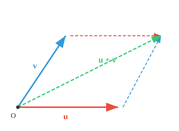
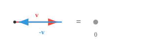

# Векторные пространства

*Векторные пространства образуют математическую площадку, на которой живет ML. В этом файле рассказывается о сложении векторов, скалярном умножении, аксиомах замыкания, подпространствах и о том, почему почти все в ИИ представлено в виде векторов.*

- Думайте о векторном пространстве как об особой игровой площадке, на которой живут математические объекты, и каждый объект называется **вектором**. 

— Векторное пространство формально определяется как совокупность векторов, которые можно складывать и масштабировать, не выходя из пространства. 

- Полезный не-пример: целые числа $\mathbb{Z}$ **не** являются векторным пространством над действительными числами, поскольку масштабирование $3$ на $0.5$ дает $1.5$, которое выходит за пределы множества. Часть определения «не выходя за пределы пространства» выполняет реальную работу.

- Для геометрической интуиции в машинном обучении (ML) мы всегда будем думать о векторах как о точке в евклидовом пространстве, представленной ее координатами. 

- Вектор $\mathbf{a}$ (математически обозначен строчными буквами, выделенными жирным шрифтом) имеет координаты $n$, каждая из которых представляет положение вдоль оси.

$$\mathbf{a} = [a_1, a_2, a_3]$$


- Векторы в векторном пространстве подчиняются очень специфическому, нерушимому набору правил:

    - **Сложение векторов (объединение)**:
    Вы можете взять любые два вектора и объединить их, чтобы создать новый.
    Думайте о векторах как об инструкциях к движению.
    Если вектор А означает «пройти 3 шага вперед», а вектор Б означает «пройти 2 шага вправо»,
    их добавление (А + Б) создает новую единственную инструкцию: «пройди 3 шага вперед и 2 шага вправо».

    - **Скалярное умножение (Масштабирование)**:
    Вы можете взять любой вектор и масштабировать его, используя обычное число («скаляр»).
    Вы можете растянуть его, сжать или повернуть вспять.
    Если вектор А — это «пройти 3 шага вперед», масштабирование его на 2 приведет к «пройти 6 шагов вперед».
    Масштабирование на -1 полностью переворачивает его так, чтобы он «прошёл на 3 шага назад».

- **Размерность** векторного пространства — это количество содержащихся в нем независимых направлений. $\mathbb{R}^2$ является двухмерным (требуется 2 координаты), а $\mathbf{a}$, указанный выше, находится в $\mathbb{R}^3$.

- Мы можем, например, представить любой объект, скажем, человека, в виде вектора, где $h_1$ = рост в см, $h_2$ = вес в кг, $h_3$ = возраст.

$$\mathbf{h} = [185, 75, 30]$$

- Мы создали векторное пространство с вектором, представляющим человека.

- Мы можем представлять нескольких людей и видеть, насколько они близки или разделены!


— Мы можем добавить больше функций, создавая богатое представление о человеке, которое в ML часто называют векторами функций.

- Чем больше у вас уникальных и значимых признаков, тем более описательным является вектор признаков, и это важный фактор, о котором следует помнить. 

- За пределами трехмерного пространства вектора становится очень сложно визуализировать, что послужило вдохновением для создания области математики под названием **Линейная алгебра**.

- Итак, **Линейная алгебра** — это изучение векторов, векторных пространств и отображений между векторами.

— Мы представляем почти все в AI/ML в виде векторов, делая линейную алгебру основой этой области.

- Сложение векторов можно выполнить, визуально поместив один вектор на хвост другого и рисуя от начала координат до конечной точки.


- Для двух векторов $\mathbf{a} = (a_1, a_2)$ и $\mathbf{b} = (b_1, b_2)$: $\mathbf{a} + \mathbf{b} = (a_1 + b_1, a_2 + b_2)$

- Векторы также можно вычитать, при этом применяются все правила сложения.

- Умножение вектора на скаляр масштабирует вектор на этот коэффициент в том же направлении.


- Для скалярного $c$ и векторного $\mathbf{v} = (v_1, v_2)$: $c\mathbf{v} = (cv_1, cv_2)$

- **Замыкание при сложении**: если вы добавите любые два вектора из векторного пространства, результатом также будет вектор в том же пространстве: если $\mathbf{u} \in V$ и $\mathbf{v} \in V$, то $\mathbf{u} + \mathbf{v} \in V$

- **Замыкание при скалярном умножении**: если умножить любой вектор из векторного пространства на скаляр, результатом будет вектор в том же пространстве: если $\mathbf{v} \in V$ и $c \in F$, то $c\mathbf{v} \in V$

- **Коммутативность сложения**: для любых двух векторов $\mathbf{u}$ и $\mathbf{v}$: $\mathbf{u} + \mathbf{v} = \mathbf{v} + \mathbf{u}$

- Оба пути через параллелограмм приходят в одну и ту же точку.

- **(Нулевой вектор)**: существует вектор $\mathbf{0}$ такой, что для любого вектора $\mathbf{v}$: $\mathbf{v} + \mathbf{0} = \mathbf{v}$


- **Аддитивное обратное**: для каждого вектора $\mathbf{v}$ существует вектор $-\mathbf{v}$ такой, что: $\mathbf{v} + (-\mathbf{v}) = \mathbf{0}$



- **Распределительность 1**: для любых скаляров $c$ и векторов $\mathbf{u}$, $\mathbf{v}$: $c(\mathbf{u} + \mathbf{v}) = c\mathbf{u} + c\mathbf{v}$


- Масштабирование суммы (золото) дает тот же результат, что и суммирование масштабированных векторов.

- **Распределительность 2**: Для любых скаляров $c$, $d$ и вектора $\mathbf{v}$: $(c + d)\mathbf{v} = c\mathbf{v} + d\mathbf{v}$

- **Ассоциативность**: для любых скаляров $c$, $d$ и векторов $\mathbf{v}$: $(cd)\mathbf{v} = c(d\mathbf{v})$

- **Элемент идентификации**: Для любого вектора $\mathbf{v}$: $1\mathbf{v} = \mathbf{v}$, где $1$ — мультипликативное тождество в области скаляров.

- Некоторые примеры векторных пространств:

    - **$\mathbb{R}^n$ (n-мерное пространство)**: все действительные числа в n-мерном пространстве, пример вектора [1,4,3000...n-й элемент], добавьте две точки или масштабируйте одну, и вы все равно приземлитесь где-то на плоскости.

    - **Изображения в оттенках серого**: изображение $28 \times 28$ имеет интенсивность всего 784 пикселя, то есть вектор в $\mathbb{R}^{784}$. Добавление двух изображений (смешивание) или масштабирование одного (осветление) дает другое изображение того же размера.

    - **Аудиосигналы**: клип длительностью 1 секунда, дискретизированный с частотой 44,1 кГц, представляет собой вектор с 44 100 записями. Смешение двух клипов — это просто сложение векторов.

    - **Полиномы**: добавление двух полиномов или масштабирование одного по числу дает еще один полином, поэтому они тоже образуют векторное пространство. Векторы не обязательно должны выглядеть как стрелки!

- **Подпространство** — это небольшая игровая площадка внутри большей. Представьте себе трехмерное пространство как комнату. Плоский лист бумаги, проходящий через центр комнаты, представляет собой подпространство, как и один прямой провод, проходящий через центр.

— Ключевое требование — подпространство должно проходить через начало координат. Если вы сместите этот лист бумаги от центра, он перестанет быть подпространством, потому что нулевой вектор на нем больше не будет.


— Все те же правила из векторного пространства (сложение, масштабирование, замыкание) по-прежнему работают внутри подпространства. Вы можете добавлять или масштабировать векторы внутри него и никогда не «падать» в большее пространство.

- Линия, проходящая через начало координат, представляет собой одномерное подпространство, плоскость, проходящая через начало координат, представляет собой двумерное подпространство, а полное пространство является самостоятельным подпространством.

— В ML подпространства появляются естественным образом. Многомерные данные часто имеют структуру, которая находится в подпространстве более низкой размерности. Такие методы, как PCA, находят это подпространство, чтобы мы могли работать с данными более эффективно.

## Задачи по кодированию (используйте CoLab или блокнот)

1. Запустите код, чтобы проверить свойство дистрибутивности, затем измените его и протестируйте другие правила!
```python
import jax.numpy as jnp

u = jnp.array([1, 2])
v = jnp.array([3, 0])
c = 2

lhs = c * (u + v)
rhs = c*u + c*v

print(f"LHS: {lhs}")
print(f"RHS: {rhs}")
```

2. Запустите код для визуализации различных векторов, затем измените значения для разных координат, чтобы понять, как каждая ось влияет на положение.
```python
import jax.numpy as jnp
import matplotlib.pyplot as plt

# Try changing these vectors!
a = jnp.array([3, 2, 4])
b = jnp.array([1, 4, 2])
c = jnp.array([4, 1, 3])

fig = plt.figure()
ax = fig.add_subplot(111, projection="3d")

for vec, name, color in [(a, "a", "red"), (b, "b", "blue"), (c, "c", "green")]:
    ax.quiver(0, 0, 0, *vec, color=color, arrow_length_ratio=0.1, linewidth=2, label=name)

lim = int(jnp.abs(jnp.stack([a, b, c])).max()) + 1
ax.set_xlim([0, lim]); ax.set_ylim([0, lim]); ax.set_zlim([0, lim])
ax.set_xlabel("X"); ax.set_ylabel("Y"); ax.set_zlabel("Z")
ax.legend()
plt.show()
```

## Побочный квест (некоторые математические символы, которые нужно знать)

| Символ | Значение | Пример |
|---|---|---|
| € | является элементом | x ∈ A: x находится в множестве A |
| ∉ | не является элементом | Икс ∉ А |
| ⊂ | является правильным подмножеством | А ⊂ Б |
| ⊆ | является подмножеством или равно | А ⊆ Б |
| ∪ | союз | A ∪ B: вещи из A или B |
| ∩ | пересечение | A ∩ B: вещи как в A, так и в B |
| ∅ | пустой набор | А знак равно ∅ |
| ℝ | действительные числа | Икс € ℝ |
| ℤ | целые числа | -2, -1, 0, 1, 2 |
| ℕ | натуральные числа | 1, 2, 3, ... |
| ℚ | рациональные числа | дроби типа 1/2 |
| ⇒ | подразумевает | х > 2 ⇒ х > 1 |
| ⇔ | тогда и только тогда, когда | x = 2 ⇔ x² = 4, с дополнительными условиями |
| ∀ | для всех | ∀x ∈ ℝ |
| ∃ | существует | ∃x такой, что x² = 4 |
| ¬ | не | ¬P: не P |
| ∧ | и | П ∧ Q |
| ∨ | или | П ∨ Q |
| ∴ | поэтому | х = 2, ∴ х² = 4 |