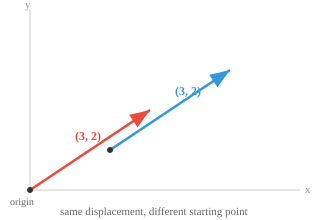
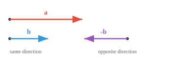

# Свойства вектора

*Свойства вектора описывают геометрические и алгебраические характеристики, определяющие поведение векторов. В этом файле описаны величина, направление, единичные векторы, равенство, параллелизм, ортогональность и линейная независимость — строительные блоки каждого пространства объектов ML.*

- **Амплитуда** (или длина) вектора показывает, *как далеко* он простирается. Думайте об этом как о длине стрелы. Для вектора $\mathbf{a} = (a_1, a_2, a_3)$ его величина равна:

$$\|\mathbf{a}\| = \sqrt{a_1^2 + a_2^2 + a_3^2}$$

- Это всего лишь теорема Пифагора, расширенная на высшие измерения и измеряющая расстояние по прямой от начала координат до точки.

- **Направление** вектора указывает вам, *куда* он указывает; просто визуализируйте прямую линию от начала координат до точки координат. 

- Когда начало координат не указано явно, мы часто подразумеваем (0,0,...0), центральную точку, по крайней мере, для целей визуализации. 

- Позиция не имеет значения, дело всегда в смещении: вектор $(3, 2)$, нарисованный из начала координат, и тот же $(3, 2)$, нарисованный из другой точки, по-прежнему равны.



- Два вектора могут иметь одинаковую длину, но указывать в совершенно разных направлениях, или иметь одинаковую точку, но различаться по длине.


- Два вектора **равны** тогда и только тогда, когда все их соответствующие компоненты совпадают; та же длина, то же направление, та же стрелка.

$$\mathbf{a} = \mathbf{b} \iff a_i = b_i \text{ for all } i$$

- Два вектора **параллельны**, если один из них скалярно кратен другому. Они направлены вдоль одной и той же линии, либо в одном направлении, либо точно в противоположном направлении.

$$\mathbf{a} \parallel \mathbf{b} \iff \mathbf{a} = k\mathbf{b} \text{ for some scalar } k \neq 0$$



- Если $k > 0$, они указывают одинаково. Если $k < 0$, они направлены в противоположные стороны. В любом случае они лежат на одной прямой через начало координат.

- Интуитивно, параллельные векторы не несут никакой «новой» информации о направлении. Один из них — просто растянутая или перевернутая версия другого.

- Два вектора считаются **ортогональными** (перпендикулярными), если они направлены в совершенно независимых направлениях. Продвижение по одному не дает никакого прогресса по другому.


- Подумайте о том, чтобы идти на север, а затем идти на восток, это ортогональные направления, никакой путь на север никогда не переместит вас на восток. С ортогональностью мы будем сталкиваться очень часто.

— Ортогональность играет центральную роль в машинном обучении: ортогональные функции несут совершенно независимую информацию, что идеально подходит для представления.

- В более общем смысле, любые два вектора имеют между собой **угол** $\theta$ в диапазоне от $0°$ до $180°$.

- Этот угол отражает всю взаимосвязь между двумя направлениями: $0°$ означает параллельность (одно и то же направление), $180°$ означает параллельность (противоположное направление) и $90°$ означает ортогональность. Все, что между ними, представляет собой смесь.

— Большинство векторных отношений в ML живут где-то в этом спектре. Позже мы увидим точные инструменты (скалярное произведение, косинусное подобие) для вычисления этого угла.

- Набор векторов является **линейно зависимым**, если хотя бы один из них можно построить из остальных путем масштабирования и сложения. Никакой новой информации в комплект это не вносит.

- Например, если $\mathbf{c} = 2\mathbf{a} + 3\mathbf{b}$, то $\mathbf{c}$ избыточен, у вас уже есть все, что предлагает $\mathbf{c}$ через $\mathbf{a}$ и $\mathbf{b}$.

— Параллельные векторы всегда линейно зависимы, поскольку один является лишь масштабированной копией другого. Любое множество, содержащее нулевой вектор, также линейно зависимо.

- Векторы **линейно независимы**, если ни один из них не может быть построен из других. Каждый из них вносит действительно новое направление. Ортогональные векторы всегда линейно независимы.

- Некоторая интуиция: если вы хотите изучить разных людей и представить их в виде вектора, линейно зависимые векторы (люди) исказят наблюдение в пользу точки данных с избыточной выборкой, что является важным фактором при разработке набора данных для обучения ИИ. 

- В 2D два линейно независимых вектора могут достигать любой точки плоскости. В 3D вам нужно три. Идея «сколько независимых векторов вам нужно» напрямую связана с размерностью.- Вектор считается **разреженным**, если большинство его компонентов равны нулю. Напротив, когда большинство компонентов ненулевые, называется **плотным**.

$$\mathbf{s} = [0, 0, 3, 0, 0, 0, 1, 0, 0, 0]$$

- Разреженность имеет значение, поскольку она влияет как на хранение, так и на вычисления. Разреженные векторы можно хранить и обрабатывать гораздо эффективнее, отслеживая только ненулевые записи.

- **Единичный вектор** — это вектор с величиной ровно 1. Он просто представляет направление без информации о длине. Любой вектор можно превратить в единичный вектор, разделив его на величину:

$$\hat{\mathbf{a}} = \frac{\mathbf{a}}{\|\mathbf{a}\|}$$

- Этот процесс называется **нормализацией**. Он убирает вопрос «как далеко» и оставляет только «в какую сторону», это важный фактор в машинном обучении. 

- Стандартные единичные векторы указывают вдоль каждой оси: $\hat{\mathbf{i}} = (1, 0, 0)$, $\hat{\mathbf{j}} = (0, 1, 0)$, $\hat{\mathbf{k}} = (0, 0, 1)$. Любой вектор можно записать как их комбинацию, например $(3, 2, 4) = 3\hat{\mathbf{i}} + 2\hat{\mathbf{j}} + 4\hat{\mathbf{k}}$.

## Задачи по кодированию (используйте CoLab или блокнот)

1. Вычислите величину вектора и убедитесь, что она соответствует теореме Пифагора, а затем внесите изменения, чтобы вычислить единичный вектор. 
```python
import jax.numpy as jnp

a = jnp.array([3.0, 4.0])

magnitude = jnp.sqrt(jnp.sum(a ** 2))
print(f"Magnitude of a: {magnitude}") 
```

2. Проверьте, параллельны ли два вектора, проверив, является ли один из них скалярным кратным другому.
```python
import jax.numpy as jnp

a = jnp.array([2, 4, 6])
b = jnp.array([1, 2, 3])

ratios = a / b
print(f"Ratios: {ratios}")
print(f"Parallel: {jnp.allclose(ratios, ratios[0])}")
```