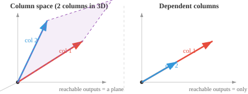

# Свойства матрицы

*Матрицы — это структуры данных, которые хранят наборы данных, кодируют преобразования и определяют каждый уровень нейронной сети. В этом файле описаны размеры матрицы, элементы, транспонирование, трассировка, определитель, инверсия, ранг и нулевое пространство — основные свойства, используемые в линейной алгебре и машинном обучении.*

- По своей сути **матрица** представляет собой прямоугольную сетку чисел, расположенных в строках и столбцах. Если вектор представляет собой один список чисел, то матрица представляет собой стек векторов.

```math
A = \begin{bmatrix} 1 & 2 & 3 \\ 4 & 5 & 6 \end{bmatrix}
```

- Если один человек описывается вектором $[\text{age}, \text{height}, \text{weight}]$, то три человека образуют матрицу, где каждая строка соответствует одному человеку:

```math
\begin{bmatrix} 25 & 170 & 65 \\ 30 & 180 & 80 \\ 22 & 160 & 55 \end{bmatrix}
```

- Эта матрица имеет 3 строки и 3 столбца, поэтому мы называем ее матрицей $3 \times 3$.

- Каждое число в таблице называется **элементом** или **записью** и идентифицируется по строке и столбцу: $A_{ij}$ — это элемент в строке $i$, столбце $j$.

- **Транпонирование** матрицы переворачивает ее по диагонали, превращая строки в столбцы, а столбцы в строки. Если $A$ — это $m \times n$, то $A^T$ — это $n \times m$.

```math
A = \begin{bmatrix} 1 & 2 & 3 \\ 4 & 5 & 6 \end{bmatrix} \quad \Rightarrow \quad A^T = \begin{bmatrix} 1 & 4 \\ 2 & 5 \\ 3 & 6 \end{bmatrix}
```

- Умножение матрицы на ее транспонирование всегда дает квадратную матрицу: $AA^T$ — это $m \times m$, а $A^TA$ — это $n \times n$.

- **След** квадратной матрицы представляет собой сумму ее диагональных элементов: $\text{tr}(A) = A_{11} + A_{22} + \cdots + A_{nn}$. След равен сумме собственных значений (что мы увидим позже).


- Для приведенной выше матрицы $\text{tr}(A) = 1 + 4 + 9 = 14$. Имеет значение только выделенная диагональ.

— Если две матрицы представляют одно и то же линейное преобразование при разных базисах, их следы будут одинаковыми. Трассировка «независима от базы».

– **Ранг** матрицы — это количество линейно независимых строк (или, что то же самое, столбцов). Он говорит вам, сколько «полезной информации» несет матрица.

- Например, следующая матрица имеет ранг 2, поскольку ни одна строка не кратна другой:

```math
\begin{bmatrix} 1 & 2 \\ 3 & 4 \end{bmatrix}
```

Но эта матрица имеет ранг 1, потому что вторая строка всего в два раза больше первой, поэтому она не добавляет новой информации:

```math
\begin{bmatrix} 1 & 2 \\ 2 & 4 \end{bmatrix}
```

- Матрица $5 \times 3$ может иметь ранг не более 3. Если некоторые строки являются просто масштабированными или объединенными версиями других, ранг снижается. Матрица максимально возможного ранга называется **полным рангом**.


- Квадратная матрица обратима (имеет обратную) тогда и только тогда, когда она имеет полный ранг.

- Ранг связан с **нулевым пространством** (набором векторов, которые матрица отображает в ноль) посредством **теоремы о нулевом ранге**: $\text{rank}(A) + \text{nullity}(A) = \text{number of columns of } A$. То, что матрица сохраняет (ранг) плюс то, что она уничтожает (нулевое значение), равно общему размеру.

- **Пространство столбцов** матрицы — это набор всех возможных результатов при умножении матрицы на любой вектор. Он охватывает столбцы матрицы. Если матрица имеет 3 столбца, но только 2 являются независимыми, пространство столбцов представляет собой 2D-плоскость, а не все 3D-пространство.



- **Пространство строк** — это та же идея, но с точки зрения строк. Ранг равен размерности пространства столбцов и пространства строк, поэтому они всегда совпадают.

- Вместе пространство столбцов говорит вам: «Какие результаты может дать эта матрица?» и нулевое пространство говорит вам: «Какие входные данные отображаются в ноль?» Эти два пространства полностью описывают то, что делает матрица.

– **Определитель** квадратной матрицы — это одно число, которое показывает, как матрица масштабирует пространство. Подумайте о матрице $2 \times 2$ как о преобразовании единичного квадрата в параллелограмм. Определитель — это площадь этого параллелограмма (со знаком).

```math
\det\begin{bmatrix} a & b \\ c & d \end{bmatrix} = ad - bc
```


- Например:

```math
\det\begin{bmatrix} 2 & 1 \\ 0 & 3 \end{bmatrix} = 2 \cdot 3 - 1 \cdot 0 = 6
```

Преобразование растягивает единичный квадрат в параллелограмм площадью 6.

- Если определитель положителен, преобразование сохраняет ориентацию (все не «переворачивается»). Если отрицательный, он меняет ориентацию (как зеркальное отражение). Если ноль, матрица сжимает пространство в более низкое измерение, сжимая параллелограмм до линии или точки.

- Матрица с нулевым определителем называется **сингулярной**. Он не имеет инверсии и безвозвратно теряет информацию.- Для матриц размером более $2 \times 2$ определитель вычисляется с использованием **дополнительных** и **кофакторов**. **Младший** $M_{ij}$ является определителем меньшей матрицы, которую вы получаете, удалив строку $i$ и столбец $j$.


- **кофактор** $C_{ij} = (-1)^{i+j} M_{ij}$ присоединяет к каждому минору знак (чередующийся в виде шахматной доски: $+, -, +, \ldots$). Определителем полной матрицы является тогда сумма по любой строке или столбцу: $\det(A) = \sum_j A_{1j} \cdot C_{1j}$. Это называется **расширением кофактора**.

- **Обратная** квадратная матрица $A$, записанная $A^{-1}$, представляет собой матрицу, которая отменяет то, что делает $A$: $AA^{-1} = A^{-1}A = I$ (единичная матрица). Только неособые матрицы имеют обратные.

- Для матрицы $2 \times 2$ обратная формула имеет прямую формулу:

```math
\begin{bmatrix} a & b \\ c & d \end{bmatrix}^{-1} = \frac{1}{ad - bc}\begin{bmatrix} d & -b \\ -c & a \end{bmatrix}
```

Обратите внимание на определитель в знаменателе, поэтому сингулярные матрицы (нулевой определитель) не имеют обратной.

- **Число условия** показывает, насколько чувствительна матрица к небольшим изменениям входных данных. Он определяется как $\kappa(A) = \|A\| \cdot \|A^{-1}\|$.

- Число обусловленности, близкое к 1, означает, что матрица **хорошо обусловлена**: небольшие изменения входных данных приводят к небольшим изменениям выходных данных. Большое число условий означает, что оно **плохо обусловлено**: малейшие ошибки значительно усиливаются. Ортогональные и единичные матрицы имеют число обусловленности 1, а сингулярные матрицы имеют бесконечное число обусловленности.

- Например, следующая матрица имеет номер состояния $10^8$. Одно направление масштабируется нормально, а другое почти сжимается до нуля, поэтому небольшие возмущения в этом направлении сильно искажаются:

```math
\begin{bmatrix} 1 & 0 \\ 0 & 10^{-8} \end{bmatrix}
```

- Точно так же, как векторы имеют нормы (длину), матрицы имеют **нормы**, которые измеряют их «размер». Наиболее распространенной является **норма Фробениуса**, которая рассматривает матрицу как длинный вектор и вычисляет ее длину:

```math
\|A\|_F = \sqrt{\sum_{i}\sum_{j} A_{ij}^2}
```

- Например:

```math
\left\|\begin{bmatrix} 1 & 2 \\ 3 & 4 \end{bmatrix}\right\|_F = \sqrt{1 + 4 + 9 + 16} = \sqrt{30} \approx 5.48
```

- **Спектральная норма** $\|A\|_2$ является наибольшим сингулярным значением $A$. Он измеряет максимальную величину, на которую матрица может растянуть любой единичный вектор. В ML матричные нормы используются для регуляризации веса (штрафования больших весов) и контроля стабильности тренировок.

- Симметричная матрица $A$ является **положительно определенной**, если для каждого ненулевого вектора $\mathbf{x}$: $\mathbf{x}^T A \mathbf{x} > 0$. Эта квадратичная форма всегда дает положительное число.

- Например, следующая матрица является положительно определенной:

```math
A = \begin{bmatrix} 2 & 1 \\ 1 & 3 \end{bmatrix}
```

Выберите любой вектор, например $\mathbf{x} = [1, -1]^T$: $\mathbf{x}^T A \mathbf{x} = 2 - 1 - 1 + 3 = 3 > 0$. Какой бы ненулевой $\mathbf{x}$ вы ни попробовали, вы всегда получаете положительный результат.

- Положительно определенные матрицы важны, поскольку они гарантируют, что задачи оптимизации имеют единственный минимум.

- Если условие смягчено до $\mathbf{x}^T A \mathbf{x} \geq 0$ (допускается ноль), матрица является **положительной полуопределенной** (PSD). PSD-матрицы появляются постоянно: ковариационные матрицы, матрицы ядра в SVM и гессианцы в локальных минимумах — все это PSD. Разница в том, что PSD позволяет некоторым направлениям быть «плоскими» (нулевая кривизна), а не строго изгибаться вверх.

## Задачи по кодированию (используйте CoLab или блокнот)

1. Вычислить след, ранг и определитель матрицы. Попробуйте сделать одну строку кратной другой и посмотрите, как изменяются ранг и определитель.
```python
import jax.numpy as jnp

A = jnp.array([[1.0, 2.0],
               [3.0, 4.0]])

print(f"Trace: {jnp.trace(A)}")
print(f"Rank: {jnp.linalg.matrix_rank(A)}")
print(f"Determinant: {jnp.linalg.det(A):.2f}")
```

2. Вычислите обратную матрицу, умножьте ее на оригинал и убедитесь, что вы получили тождество. Затем попробуйте сингулярную матрицу и посмотрите, что произойдет.
```python
import jax.numpy as jnp

A = jnp.array([[1.0, 2.0],
               [3.0, 4.0]])

A_inv = jnp.linalg.inv(A)
print(f"A * A_inv:\n{A @ A_inv}")
```