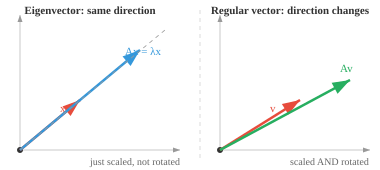
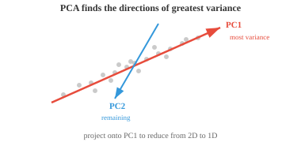

# Матричное разложение

*Матричное разложение разбивает сложные матрицы на более простые факторы для решения систем, вычисления обратных величин и сжатия данных. В этом файле описаны методы исключения Гаусса, LU, QR, Холецкого, собственное разложение и SVD, алгоритмы PCA, рекомендательные системы и численная стабильность в машинном обучении.*

- Матричное разложение (или факторизация) разбивает матрицу на более простые части, с которыми легче работать. Думайте об этом как о факторизации числа: $12 = 3 \times 4$ легче рассуждать, чем просто 12.

- Мы разлагаем матрицы, чтобы быстрее решать системы уравнений, стабильно вычислять обратные, находить собственные значения, сжимать данные и понимать геометрию преобразований.

- Самый фундаментальный метод – **исключение по Гауссу** (сокращение строк). Идея проста: учитывая систему $A\mathbf{x} = \mathbf{b}$, используйте три разрешенные операции для упрощения $A$ до тех пор, пока ответ не станет очевидным. 

- Операции следующие: поменять местами две строки, умножить строку на ненулевой скаляр или добавить кратное число одной строки к другой.

– Например, чтобы исключить первый столбец под опорной точкой, вычтите кратные строке 1 из строк ниже:

```math
\begin{bmatrix} 2 & 1 & 5 \\ 4 & 3 & 7 \\ 6 & 5 & 9 \end{bmatrix} \xrightarrow{R_2 - 2R_1} \begin{bmatrix} 2 & 1 & 5 \\ 0 & 1 & -3 \\ 6 & 5 & 9 \end{bmatrix} \xrightarrow{R_3 - 3R_1} \begin{bmatrix} 2 & 1 & 5 \\ 0 & 1 & -3 \\ 0 & 2 & -6 \end{bmatrix}
```

- Целью является **форма эшелона строк (REF)**: нули под каждой опорной точкой (первая ненулевая запись в каждой строке), при этом каждая опорная точка находится справа от той, что над ней. Матрица приобретает форму лестницы.


- При переходе к **сокращенной форме эшелона строк (RREF)** каждая опорная точка будет равна 1 и единственной ненулевой записи в своем столбце. Каждая матрица имеет уникальный RREF.

- В треугольной форме мы решаем путем **обратной замены**: нижняя строка напрямую дает последнюю переменную, затем работаем вверх. 

- Это основа, на которой строятся все остальные разложения. Цель разложения - привести матрицу к треугольной форме, чтобы мы могли обратно заменить переменные и решить их. 

- **LU-разложение** формализует метод исключения Гаусса путем разложения квадратной матрицы на $A = LU$ (или $A = PLU$ с заменой строк), где $L$ — нижний треугольный, а $U$ — верхний треугольный.


- Чтобы решить $A\mathbf{x} = \mathbf{b}$: сначала решите $L\mathbf{y} = \mathbf{b}$ прямой заменой (сверху вниз), затем решите $U\mathbf{x} = \mathbf{y}$ обратной заменой (снизу вверх). Два простых треугольных решения вместо одного сложного общего решения.

- Преимущество по сравнению с необработанным методом исключения Гаусса заключается в повторном использовании. Имея $L$ и $U$, вы можете решить множество различных векторов $\mathbf{b}$, не повторяя факторизацию. 

- Если вам нужно решить одну и ту же систему с 1000 различными правыми частями (обычно в симуляциях), вы разбиваете на факторы один раз и используете повторно.

- Когда матрица симметрична и положительно определена (например, ковариационная матрица), мы можем добиться еще большего. 

- **Разложение Холецкого** учитывает его как $A = LL^T$, где $L$ представляет собой нижний треугольник. Например:

```math
\begin{bmatrix} 4 & 2 \\ 2 & 5 \end{bmatrix} = \begin{bmatrix} 2 & 0 \\ 1 & 2 \end{bmatrix} \begin{bmatrix} 2 & 1 \\ 0 & 2 \end{bmatrix}
```

- Это примерно в два раза быстрее, чем LU, и гарантированно численно стабильно. Думайте об этом как о «квадратном корне» матрицы.

- Если разложение не удалось (отрицательное значение под квадратным корнем), матрица не является положительно определенной. Таким образом, Холецкий служит одновременно и тестом на положительную определенность. 

- **Собственные векторы** квадратной матрицы $A$ — это особые направления, которые преобразование только растягивает или сжимает, но не вращает. **собственное значение** — это коэффициент масштабирования:

$$A\mathbf{x} = \lambda\mathbf{x}$$



- Большинство векторов меняют направление при умножении на матрицу. Но собственные векторы особенные: выходные точки направлены в том же направлении, что и входные, только масштабированные $\lambda$. Если $\lambda = 2$, длина собственного вектора удваивается. Если $\lambda = -1$, направление меняется. Если $\lambda = 0$, оно сжимается до нуля.

- Например, с:

```math
A = \begin{bmatrix} 3 & 1 \\ 0 & 2 \end{bmatrix}
```

  вектор $[1, 0]^T$ является собственным вектором с $\lambda = 3$, поскольку $A[1, 0]^T = [3, 0]^T = 3[1, 0]^T$.- Чтобы найти собственные значения, решите **характеристический полином** $\det(A - \lambda I) = 0$. Корни – это собственные значения. Затем замените каждый $\lambda$ обратно на $(A - \lambda I)\mathbf{x} = \mathbf{0}$, чтобы найти соответствующие собственные векторы.

- Ключевые свойства:

    - След $A$ равен сумме его собственных значений.
    - Определитель $A$ равен произведению его собственных значений.
    - Симметричные матрицы имеют перпендикулярные собственные векторы и действительные собственные значения.
    - Положительно определенные матрицы имеют все положительные собственные значения.
    - Ковариационные матрицы (с которыми мы встретимся в статистике) всегда являются положительно полуопределенными.

- Вычисление собственных значений через характеристический полином нецелесообразно для больших матриц. Вместо этого используются итерационные методы:

    - **Итерация мощности**: несколько раз умножить на $A$ и нормализовать. Сходится к доминирующему собственному вектору (наибольшему собственному значению). Просто, но находит только одну собственную пару.

    - **QR-алгоритм**: метод рабочей лошадки. Многократно разлагайте и рекомбинируйте, используя QR-факторизацию, пока матрица не сойдется к треугольной форме, обнаруживая все собственные значения на диагонали.

    - **Обратная итерация**: находит собственный вектор, ближайший к заданному целевому значению. Полезно, когда вы примерно знаете, какое собственное значение вам нужно.

    - Для больших разреженных матриц итерации **Арнольди** и **Ланцоша** используют разреженность для повышения эффективности.

- Если квадратная матрица имеет полный набор линейно независимых собственных векторов, ее можно **диагонализировать**: $A = PDP^{-1}$, где $D$ — диагональная матрица собственных значений, а столбцы $P$ — собственные векторы.

- Почему это полезно? С диагональными матрицами работать тривиально. Нужен $A^{100}$? Вместо того, чтобы умножать $A$ само на себя 100 раз, вычислите $PD^{100}P^{-1}$, и возведение диагональной матрицы в степень просто возводит каждую запись независимо. Это превращает дорогую операцию в дешевую.

- **собственный базис** — это базис, полностью состоящий из собственных векторов. В этом базисе матрица становится диагональной, а преобразование представляет собой просто независимое масштабирование вдоль каждого направления собственного вектора. Это похоже на поиск естественной системы координат для преобразования.

- **QR-разложение** разлагает любую матрицу $A$ на $A = QR$, где $Q$ ортогональна (ее столбцы ортонормированы), а $R$ является верхнетреугольной. Думайте об этом как об отделении информации о «направлении» ($Q$) от информации «масштабирования и смешивания» ($R$).

- **Процесс Грама-Шмидта** строит $Q$ столбец за столбцом. Возьмите первый столбец $A$ и нормализуйте его. Возьмите второй столбец, вычтите его проекцию на первый (чтобы он стал перпендикулярным) и нормализуйте. Повторите для каждого столбца. В результате получается ортонормированный набор векторов.

- QR-разложение является основой алгоритма QR для собственных значений. Он также используется непосредственно для решения задач наименьших квадратов: когда $A\mathbf{x} = \mathbf{b}$ не имеет точного решения (больше уравнений, чем неизвестных), QR находит лучший приблизительный ответ.

- **SVD** (разложение по сингулярным значениям) — наиболее общее и, возможно, самое важное разложение. Каждая матрица (любой формы, любого ранга) имеет SVD: $A = U\Sigma V^T$.

    - $V^T$ ($n \times n$, ортогональный): вращает входной сигнал.
    - $\Sigma$ ($m \times n$, диагональ): масштабируется по ортогональным осям (сингулярные значения, неотрицательные, в порядке убывания)
    - $U$ ($m \times m$, ортогональный): поворачивает выходной сигнал.


— Геометрически СВД говорит, что каждое линейное преобразование, каким бы сложным оно ни было, — это всего лишь вращение, за которым следует растяжение по осям, за которым следует еще одно вращение. Круг становится эллипсом.

- Сингулярные значения ($\sigma_1 \geq \sigma_2 \geq \ldots$) показывают «важность» каждого направления. Большие сингулярные значения соответствуют наиболее важным направлениям. Ранг $A$ равен количеству ненулевых сингулярных значений.- **Низкоранговая аппроксимация**: оставив только самые большие сингулярные значения $k$ и обнулив остальные, вы получите наилучшую аппроксимацию $A$ ранга $k$. Вот как работает сжатие изображений: для того, чтобы изображение $1000 \times 1000$ выглядело почти идентично, может потребоваться только сингулярное значение $k = 50$, сжимая его в 20 раз.

- SVD также обеспечивает псевдоинверсию: $A^+ = V\Sigma^+U^T$, где $\Sigma^+$ инвертирует ненулевые сингулярные значения.

- Хотя собственное разложение работает только для квадратных матриц, SVD работает для любой матрицы. Это его ключевое преимущество.

- **PCA** (Анализ главных компонентов) использует собственное разложение (или SVD) для уменьшения размерности. 

- Представьте себе набор данных со 100 объектами на выборку (вектор из тусклых 100, сложенный в матрицу). Многие из этих функций коррелируют и дублируют друг друга. 

- PCA находит направления, в которых фактически меняются данные, позволяя вам сохранить только то, что имеет значение.



- Первая главная компонента (PC1) – это направление наибольшей дисперсии. 

- Второй (PC2) улавливает большую часть оставшейся дисперсии и перпендикулярен первому. 

- Если большая часть дисперсии сосредоточена всего в нескольких направлениях, вы можете спроецировать данные до этих измерений и отбросить остальные с минимальными потерями.

- Шаги:

    - Стандартизируйте данные (вычтите среднее значение, разделите на стандартное отклонение), чтобы все функции вносили одинаковый вклад.
    - Вычислить ковариационную матрицу
    - Найдите его собственные значения и собственные векторы
    - Выберите собственные векторы $k$ с наибольшими собственными значениями (это главные компоненты)
    - Спроецируйте данные на эти компоненты.

- Стандартизация имеет решающее значение: без нее объект, измеряемый в километрах, будет доминировать над объектом, измеряемым в сантиметрах, независимо от фактической важности.

- На практике PCA используется для визуализации (проецирования многомерных данных в 2D или 3D), уменьшения шума (отбрасывания направлений с низкой дисперсией, которые в основном представляют собой шум) и ускорения моделей машинного обучения за счет уменьшения количества входных функций.

- **Kernel PCA** расширяет возможности PCA для нелинейных отношений. Он отображает данные с помощью функции ядра в многомерное пространство, где структура становится линейной, затем применяет стандартный PCA и проецирует обратно.

- **Разложение Шура** факторизует квадратную матрицу как $A = QTQ^\ast$, где $Q$ — унитарная, а $T$ — верхняя треугольная. Каждая квадратная матрица имеет разложение Шура, даже если ее нельзя диагонализировать.

- **Неотрицательная матричная факторизация (NMF)** разлагает матрицу на две неотрицательные матрицы: $A \approx WH$, где все записи в $W$ и $H$ имеют вид $\geq 0$. В отличие от SVD, который может создавать отрицательные записи, NMF только добавляет, а не вычитает. Это делает части интерпретируемыми: при моделировании тем $W$ дает веса тем для каждого документа, а $H$ дает веса слов для каждой темы, все неотрицательные, что соответствует тому, как мы думаем о том, «сколько каждой темы» содержится в документе.

- **Спектральная теорема** утверждает, что симметричные (или эрмитовы) матрицы всегда можно диагонализировать с помощью ортогональной (или унитарной) матрицы. Их собственные значения всегда вещественны, а собственные векторы всегда ортогональны. Это теоретическая основа PCA.

## Задачи по кодированию (используйте CoLab или блокнот)

1. Вычислить собственные значения и собственные векторы симметричной матрицы. Убедитесь, что собственные векторы перпендикулярны, и восстановите матрицу по ее собственному разложению.
```python
import jax.numpy as jnp

A = jnp.array([[4.0, 2.0],
               [2.0, 3.0]])

eigenvalues, eigenvectors = jnp.linalg.eigh(A)
print(f"Eigenvalues: {eigenvalues}")
print(f"Eigenvectors orthogonal: {jnp.dot(eigenvectors[:,0], eigenvectors[:,1]):.6f}")

# Reconstruct: A = P D P^T
D = jnp.diag(eigenvalues)
A_reconstructed = eigenvectors @ D @ eigenvectors.T
print(f"Reconstruction matches: {jnp.allclose(A, A_reconstructed)}")
```

2. Реализуйте степенную итерацию, чтобы найти наибольшее собственное значение, и обратную итерацию, чтобы найти наименьшее. Сравните с `jnp.linalg.eigh`. Тогда попробуйте реализовать QR-алгоритм самостоятельно.
```python
import jax.numpy as jnp

A = jnp.array([[4.0, 2.0],
               [2.0, 3.0]])

# Power iteration: finds the LARGEST eigenvalue
v = jnp.array([1.0, 0.0])
for _ in range(20):
    v = A @ v
    v = v / jnp.linalg.norm(v)
print(f"Largest eigenvalue:  {v @ A @ v:.4f}")

# Inverse iteration: multiply by A^{-1} instead of A, finds the SMALLEST eigenvalue
v = jnp.array([1.0, 0.0])
for _ in range(20):
    v = jnp.linalg.solve(A, v)
    v = v / jnp.linalg.norm(v)
print(f"Smallest eigenvalue: {1.0 / (v @ jnp.linalg.solve(A, v)):.4f}")

print(f"jnp.linalg.eigh:    {jnp.linalg.eigh(A)[0]}")
```

3. Вычислите SVD матрицы, затем восстановите ее, используя только сингулярные значения top-k, и наблюдайте, как качество аппроксимации меняется с увеличением k.
```python
import jax.numpy as jnp

A = jnp.array([[1.0, 2.0, 3.0],
               [4.0, 5.0, 6.0],
               [7.0, 8.0, 9.0]])

U, S, Vt = jnp.linalg.svd(A)

for k in [1, 2, 3]:
    approx = U[:, :k] @ jnp.diag(S[:k]) @ Vt[:k, :]
    error = jnp.linalg.norm(A - approx)
    print(f"k={k}, reconstruction error: {error:.4f}")
```