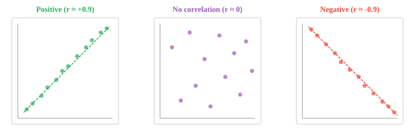

# Статистические показатели

*Статистические меры суммируют данные с помощью отдельных чисел, которые отражают распространение, положение, форму и связь. В этом файле описаны дисперсия, стандартное отклонение, квартили, асимметрия, эксцесс, ковариация, корреляция и z-показатели — набор инструментов для исследовательского анализа данных и разработки функций в машинном обучении.*

- В предыдущем файле мы представили моменты как семейство сводных статистических данных. Здесь мы раскрываем вытекающие из них практические инструменты: меры дисперсии, положения, формы и ассоциации.

- **Дисперсия** отвечает на вопрос: насколько разбросаны данные? Два класса могут иметь одинаковый средний балл по тестам, но очень разные разбросы.


- Узкое (синее) распределение имеет низкую дисперсию: большинство значений плотно группируются вокруг среднего значения. Широкое (красное) распределение имеет высокую дисперсию: значения разбросаны дальше.

– **Дисперсия** – это средний квадрат расстояния от среднего значения. Мы выравниваем, чтобы избежать взаимного уравновешивания положительных и отрицательных отклонений.

$$\sigma^2 = \frac{1}{N} \sum_{i=1}^{N} (x_i - \mu)^2$$

- При работе с выборкой (не со всей совокупностью) мы делим на $N - 1$ вместо $N$. Эта поправка (называемая поправкой Бесселя) объясняет тот факт, что выборка имеет тенденцию недооценивать истинную изменчивость:

$$s^2 = \frac{1}{N-1} \sum_{i=1}^{N} (x_i - \bar{x})^2$$

- **Стандартное отклонение** – это квадратный корень дисперсии: $\sigma = \sqrt{\sigma^2}$. Это возвращает меру к исходным единицам. Если ваши данные указаны в сантиметрах, отклонение будет указано в см$^2$, но стандартное отклонение снова будет указано в см.

- **Среднее абсолютное отклонение (MAD)** — более простая альтернатива. Вместо возведения в квадрат возьмем абсолютное значение каждого отклонения:

$$\text{MAD} = \frac{1}{N} \sum_{i=1}^{N} |x_i - \mu|$$

- MAD более устойчив к выбросам, чем к дисперсии, поскольку он не усиливает большие отклонения путем их возведения в квадрат. Однако дисперсия более удобна с математической точки зрения (она хорошо разлагается при доказательствах и оптимизации машинного обучения).

- **Позиция** отвечает на другой вопрос: где находится конкретное значение относительно остальных данных?

- **Квартили** делят отсортированные данные на четыре равные части. Q1 (25-й процентиль) — это значение, ниже которого падает 25% данных. Q2 — медиана (50-й процентиль). Q3 — это 75-й процентиль.

- **Межквартильный размах (IQR)** равен $Q3 - Q1$. Он фиксирует разброс средних 50% данных, игнорируя крайности.


- Ящикообразная диаграмма — одна из самых полезных визуализаций в статистике. Рамка охватывает Q1–Q3, линия внутри — это медиана, усы простираются до самых крайних значений, не являющихся выбросами, а точки за усами — это выбросы.

- **Процентили** обобщают квартили. $p$-й процентиль — это значение, ниже которого падают $p\%$ наблюдений. Q1 — это 25-й процентиль, медиана — 50-й, а Q3 — 75-й.

– **Z-показатель** показывает, на сколько стандартных отклонений значение отличается от среднего:

$$z = \frac{x - \mu}{\sigma}$$

- Z-показатель, равный 2, означает, что значение на 2 стандартных отклонения выше среднего. Z-показатель $-1.5$ означает, что оно на 1,5 стандартных отклонения ниже. Это также называется **стандартизацией** и широко используется в машинном обучении для масштабирования функций, поскольку оно преобразует любое распределение так, чтобы оно имело среднее значение 0 и стандартное отклонение 1.

- **Форма** описывает геометрию распределения за пределами его центра и разброса.

- **Асимметрия** (стандартизованный третий момент из предыдущего файла) измеряет асимметрию. Идеально симметричное распределение, такое как нормальная кривая, имеет нулевую асимметрию. Положительная асимметрия означает более длинный правый хвост (например, распределение доходов). Отрицательная асимметрия означает более длинный левый хвост (например, возраст выхода на пенсию).

$$\text{Skewness} = \frac{1}{N} \sum_{i=1}^{N} \left(\frac{x_i - \mu}{\sigma}\right)^3$$

- **Куртозис** (стандартизованный 4-й момент) измеряет тяжесть хвоста. Нормальное распределение имеет эксцесс, равный 3. Распределения с более тяжелыми хвостами (более склонные к выбросам) имеют эксцесс, превышающий 3.

$$\text{Kurtosis} = \frac{1}{N} \sum_{i=1}^{N} \left(\frac{x_i - \mu}{\sigma}\right)^4$$

- **Корреляция** измеряет силу и направление связи между двумя переменными. Он отвечает: когда одна переменная повышается, имеет ли тенденцию другая повышаться, понижаться или ничего не делать?

- **Корреляция Пирсона** ($r$) измеряет *линейную* связь. Он варьируется от $-1$ (совершенно отрицательный) через $0$ (нет) до $+1$ (совершенно положительный).

$$r = \frac{\sum_{i=1}^{N} (x_i - \bar{x})(y_i - \bar{y})}{\sqrt{\sum (x_i - \bar{x})^2} \cdot \sqrt{\sum (y_i - \bar{y})^2}}$$

- Если вы помните скалярные произведения из главы 1, корреляция Пирсона, по сути, представляет собой косинусное сходство между среднецентрированными версиями $\mathbf{x}$ и $\mathbf{y}$.

- **Корреляция Спирмена** ($\rho$) измеряет *монотонную* ассоциацию. Вместо использования необработанных значений он сначала ранжирует их, а затем вычисляет корреляцию Пирсона для рангов. Это делает его устойчивым к выбросам и работает даже тогда, когда зависимость нелинейна, если она постоянно увеличивается или уменьшается.

– **Среднее геометрическое** – это подходящее среднее значение, когда значения перемножаются, например, темпы роста. Если ваши инвестиции вырастут на 10%, затем на 20%, затем на 30%, средний коэффициент роста не является средним арифметическим этих темпов. Вместо этого:

$$\bar{x}_{\text{geo}} = \left(\prod_{i=1}^{N} x_i\right)^{1/N}$$

- В частности, что касается темпов роста, сначала преобразуйте проценты в коэффициенты (1,10, 1,20, 1,30), вычислите среднее геометрическое, затем вычтите 1.

- **Экспоненциальная скользящая средняя (EMA)** придает больший вес недавним наблюдениям. В отличие от простой скользящей средней, где все точки в окне имеют одинаковый вес, EMA затухает экспоненциально:

$$\text{EMA}_t = \alpha \cdot x_t + (1 - \alpha) \cdot \text{EMA}_{t-1}$$

- Коэффициент сглаживания $\alpha$ (от 0 до 1) контролирует, насколько быстро старые наблюдения теряют влияние. Более высокое значение $\alpha$ означает более быструю реакцию на недавние изменения, более низкое значение $\alpha$ означает более плавное. В машинном обучении EMA используется в оптимизаторах, таких как Адам, и в текущей статистике пакетной нормализации.

- **Обнаружение выбросов** определяет точки данных, которые необычно далеки от остальных. Два распространенных метода:
    - **Метод IQR**: точка является выбросом, если она падает ниже $Q1 - 1.5 \times \text{IQR}$ или выше $Q3 + 1.5 \times \text{IQR}$.
    - **Метод Z-оценки**: точка является выбросом, если $|z| > 3$ (более 3 стандартных отклонений от среднего значения).

- Метод IQR более надежен, поскольку не предполагает нормального распределения. Метод z-показателя хорошо работает, когда данные примерно нормальны, но может дать сбой, если распределение сильно искажено.

## Задачи по кодированию (используйте CoLab или блокнот)

1. Вычислите дисперсию, стандартное отклонение и MAD для набора данных и сравните их. Посмотрите, что произойдет, если вы добавите экстремальный выброс.
```python
import jax.numpy as jnp

data = jnp.array([4, 8, 6, 5, 3, 7, 9, 5, 6, 7], dtype=jnp.float32)

mean = jnp.mean(data)
variance = jnp.var(data)
std = jnp.std(data)
mad = jnp.mean(jnp.abs(data - mean))

print("Original data:")
print(f"  Variance: {variance:.3f}, Std: {std:.3f}, MAD: {mad:.3f}")

# Add an outlier and recompute
data_outlier = jnp.append(data, 100.0)
mean2 = jnp.mean(data_outlier)
print(f"\nWith outlier (100):")
print(f"  Variance: {jnp.var(data_outlier):.3f}, Std: {jnp.std(data_outlier):.3f}, MAD: {jnp.mean(jnp.abs(data_outlier - mean2)):.3f}")
```

2. Вычислите корреляцию Пирсона и Спирмена между двумя переменными. Экспериментируйте с разными отношениями.
```python
import jax
import jax.numpy as jnp

# Perfect linear relationship
x = jnp.array([1, 2, 3, 4, 5, 6, 7, 8], dtype=jnp.float32)
y = 2 * x + 1  # try changing this!

def pearson(a, b):
    a_c = a - jnp.mean(a)
    b_c = b - jnp.mean(b)
    return jnp.sum(a_c * b_c) / (jnp.sqrt(jnp.sum(a_c**2)) * jnp.sqrt(jnp.sum(b_c**2)))

def spearman(a, b):
    rank_a = jnp.argsort(jnp.argsort(a)).astype(jnp.float32)
    rank_b = jnp.argsort(jnp.argsort(b)).astype(jnp.float32)
    return pearson(rank_a, rank_b)

print(f"Pearson r:  {pearson(x, y):.4f}")
print(f"Spearman ρ: {spearman(x, y):.4f}")
```

3. Внедрите обнаружение выбросов, используя методы IQR и z-score, а затем сравните их результаты на искаженных данных.
```python
import jax.numpy as jnp

data = jnp.array([2, 3, 3, 4, 5, 5, 5, 6, 6, 7, 50], dtype=jnp.float32)

# IQR method
q1, q3 = jnp.percentile(data, 25), jnp.percentile(data, 75)
iqr = q3 - q1
lower, upper = q1 - 1.5 * iqr, q3 + 1.5 * iqr
iqr_outliers = data[(data < lower) | (data > upper)]
print(f"IQR bounds: [{lower:.1f}, {upper:.1f}]")
print(f"IQR outliers: {iqr_outliers}")

# Z-score method
z_scores = (data - jnp.mean(data)) / jnp.std(data)
z_outliers = data[jnp.abs(z_scores) > 3]
print(f"\nZ-scores: {z_scores}")
print(f"Z-score outliers (|z| > 3): {z_outliers}")
```

4. Рассчитайте и постройте экспоненциальное скользящее среднее с различными коэффициентами сглаживания для зашумленных данных.
```python
import jax.numpy as jnp
import matplotlib.pyplot as plt

# Generate noisy data
key = __import__("jax").random.PRNGKey(0)
noise = __import__("jax").random.normal(key, shape=(50,))
signal = jnp.linspace(0, 5, 50) + noise

def ema(data, alpha):
    result = jnp.zeros_like(data)
    result = result.at[0].set(data[0])
    for t in range(1, len(data)):
        result = result.at[t].set(alpha * data[t] + (1 - alpha) * result[t - 1])
    return result

plt.figure(figsize=(10, 4))
plt.plot(signal, "o", alpha=0.3, label="raw data", color="#999")
for alpha, color in [(0.1, "#e74c3c"), (0.3, "#3498db"), (0.7, "#27ae60")]:
    plt.plot(ema(signal, alpha), label=f"α={alpha}", color=color, linewidth=2)
plt.legend()
plt.title("EMA with different smoothing factors")
plt.show()
```