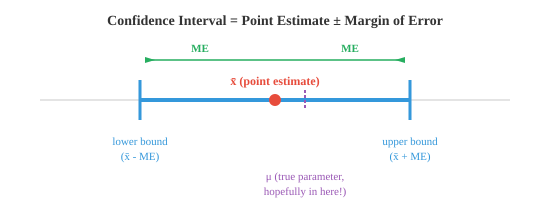

# Статистический вывод

*Статистические выводы выходят за рамки решений «да/нет» и позволяют оценить параметры популяции с количественной неопределенностью. Этот файл охватывает доверительные интервалы, оценку точек и интервалов, оценку максимального правдоподобия, метод моментов и регрессионный анализ, мост между необработанными данными и прогнозными моделями в машинном обучении.*

- Проверка гипотезы дает вам решение да/нет: отклонить или не отклонить. Но часто вам нужно что-то более информативное, диапазон возможных значений параметра, который вы оцениваете. Именно это и обеспечивают **доверительные интервалы**.

– **Точечная оценка** – это одно число, рассчитанное на основе выборки, например среднее значение выборки $\bar{x}$. Это ваше лучшее предположение о параметре численности населения, но само по себе оно не дает представления о том, насколько точна оценка.

– **доверительный интервал** ограничивает точечную оценку диапазоном, отражающим неопределенность. Он принимает форму:

$$\text{CI} = \bar{x} \pm \text{ME}$$

– **Допуск погрешности (ME)** зависит от трех вещей: насколько вы хотите быть уверенными, насколько вариативны данные и насколько велика ваша выборка:

$$\text{ME} = z^\ast \cdot \frac{\sigma}{\sqrt{n}}$$

— Здесь $z^\ast$ — критическое значение нормального распределения, соответствующее желаемому уровню достоверности. Для уверенности 95 % $z^\ast = 1.96$. Для уверенности 99 % $z^\ast = 2.576$.



– **95 % доверительный интервал** означает: если вы повторите эксперимент много раз и каждый раз будете строить интервал, около 95 % этих интервалов будут содержать истинный параметр популяции. Это не означает, что существует 95% вероятность того, что параметр находится в этом конкретном интервале. Параметр фиксированный; интервалы - это то, что меняется.

- **Рабочий пример**: вы измеряете рост 50 человек и находите $\bar{x} = 170$ см с $\sigma = 8$ см. Постройте 95% доверительный интервал.

$$\text{ME} = 1.96 \cdot \frac{8}{\sqrt{50}} = 1.96 \cdot 1.131 = 2.22 \text{ cm}$$

$$\text{CI} = [170 - 2.22, \; 170 + 2.22] = [167.78, \; 172.22]$$

- С 95% уверенностью можно сказать, что истинный средний рост лежит между 167,78 и 172,22 см.

- Если значение $\sigma$ неизвестно (обычный случай), вместо этого используйте выборочное стандартное отклонение $s$ и t-распределение:

$$\text{CI} = \bar{x} \pm t^\ast_{n-1} \cdot \frac{s}{\sqrt{n}}$$

- Более широкие интервалы более уверенны, но менее точны. Более узкие интервалы более точны, но менее достоверны. Вы можете сузить интервал, не теряя уверенности, увеличив размер выборки.

- **Анализ мощности** помогает спланировать эксперимент еще до его проведения. Вопрос в том, насколько большая выборка мне нужна, чтобы обнаружить эффект заданного размера и заданной мощности?

- Вспомним из предыдущего файла, что power = $1 - \beta$, вероятность правильного отклонения ложного $H_0$. Общая цель — 80% мощности.

- Требуемый размер выборки для z-теста, выявляющего разницу $\delta$ со значимостью $\alpha$ и мощностью $1-\beta$, составляет:

$$n = \left(\frac{(z_{\alpha/2} + z_{\beta}) \cdot \sigma}{\delta}\right)^2$$

- Например, чтобы обнаружить разницу среднего роста в 2 см ($\sigma = 8$) с помощью $\alpha = 0.05$ и мощности 80 % ($z_{0.025} = 1.96$, $z_{0.20} = 0.84$):

$$n = \left(\frac{(1.96 + 0.84) \cdot 8}{2}\right)^2 = \left(\frac{22.4}{2}\right)^2 = 11.2^2 \approx 126$$

- Вам понадобится около 126 человек на группу.

- Анализ мощности предотвращает две распространенные ошибки: проведение эксперимента слишком маленького размера, чтобы обнаружить реальный эффект (недостаточная мощность) или трату ресурсов на эксперимент, намного больший, чем необходимо (слишком мощный).

- **Методы Монте-Карло** используют случайную выборку для решения задач, которые трудно или невозможно решить аналитически. Основная идея: если вы не можете что-то точно вычислить, смоделируйте это много раз и используйте результаты в качестве приближения.

- Название происходит от казино Монте-Карло, намекая на роль случайности. Эти методы являются «рабочими лошадками» машинного обучения для таких задач, как оценка интегралов, оценка неопределенности модели и аппроксимация сложных распределений.

- Общий рецепт Монте-Карло:
    - Определить область возможных входных данных
    - Генерировать случайные входные данные из этого домена
    - Оценить функцию на каждом входе
    - Агрегировать результаты (среднее, количество и т.д.)— Классический пример — оценка $\pi$. Представьте себе квадрат со стороной 2 с центром в начале координат и вписанным в него кругом радиуса 1. Площадь квадрата равна 4, а площадь круга — $\pi$.


- Равномерно сбрасывайте случайные точки по квадрату. Доля, попадающая внутрь круга, примерно равна $\pi/4$:

$$\pi \approx 4 \times \frac{\text{points inside circle}}{\text{total points}}$$

- Точка $(x, y)$ находится внутри круга, если $x^2 + y^2 \le 1$. Чем больше очков вы наберете, тем ближе ваша оценка к истинному значению $\pi$.

- В ML методы Монте-Карло появляются в:
    - **Отсев по методу Монте-Карло**: выполните вывод несколько раз с включенным отсевом, чтобы оценить неопределенность прогноза.
    - **MCMC (Марковская цепь Монте-Карло)**: выборка из сложных апостериорных распределений в байесовских моделях.
    - **Методы политического градиента**: оценивайте градиенты в обучении с подкреплением путем выборки траекторий.

- **Факторный анализ** – это метод обнаружения скрытых (латентных) переменных, которые объясняют корреляции между наблюдаемыми переменными. Если 10 вопросов личностного опроса можно объяснить тремя основными чертами (экстраверсия, доброжелательность, добросовестность), факторный анализ обнаруживает эти черты.

- В модели предполагается, что каждая наблюдаемая переменная $x_i$ представляет собой линейную комбинацию нескольких скрытых факторов $f_j$ плюс шум:

$$x_i = \lambda_{i1} f_1 + \lambda_{i2} f_2 + \ldots + \lambda_{ik} f_k + \epsilon_i$$

- Значения $\lambda$ называются **факторными нагрузками** и показывают, насколько сильно каждая наблюдаемая переменная связана с каждым фактором. Это напрямую связано с матричным разложением из главы 2; Факторный анализ тесно связан с разложением по собственным значениям и SVD.

– **План эксперимента** – это искусство структурировать эксперимент так, чтобы можно было сделать обоснованные выводы. Плохой дизайн может сделать бесполезным даже большой набор данных.

- Ключевые компоненты хорошо спланированного эксперимента:
    - **Независимая переменная (IV)**: чем вы манипулируете (например, доза препарата, архитектура модели).
    - **Зависимая переменная (DV)**: что вы измеряете (например, время восстановления, точность).
    - **Контрольная группа**: не получает лечения (или принимает плацебо), что обеспечивает исходный уровень для сравнения.
    - **Случайное распределение**: участники распределяются по группам случайным образом, что уравновешивает мешающие переменные, которые вы не измеряли.

- **Общие экспериментальные планы**:
    - **Полностью рандомизированный дизайн**: субъекты случайным образом распределяются по группам лечения. Просто и эффективно, когда группы сопоставимы.
    - **Рандомизированный дизайн блоков**: субъекты сначала группируются в блоки (например, по возрасту), затем случайным образом распределяются на лечение в каждом блоке. Это уменьшает изменчивость фактора блокировки, аналогичного по духу стратифицированной выборке.
    - **Факторный дизайн**: одновременно тестируется несколько IV. Факторный план $2 \times 3$ имеет 2 уровня одной переменной и 3 — другой, что дает 6 комбинаций лечения. Это позволяет обнаруживать **взаимодействия**, при которых влияние одной переменной зависит от уровня другой.
    - **Перекрестный дизайн**: каждый субъект получает все виды лечения последовательно (с периодами вымывания между ними). Каждый субъект служит своим собственным контролем, уменьшая эффект индивидуальных различий.

- В экспериментах по машинному обучению эти принципы имеют решающее значение. При сравнении моделей следует учитывать случайное начальное число, разделение набора данных и аппаратное обеспечение. Перекрестная проверка — это форма перекрестного проектирования. Исследования абляции, в которых вы удаляете один компонент за раз, следуют логике факторного планирования.

## Задачи по кодированию (используйте CoLab или блокнот)

1. Постройте 95% доверительный интервал для примера высоты, затем поэкспериментируйте с различными уровнями достоверности и размерами выборки.
```python
import jax.numpy as jnp

x_bar = 170.0    # sample mean
sigma = 8.0      # population std (known)
n = 50           # sample size

# Critical values for common confidence levels
z_stars = {0.90: 1.645, 0.95: 1.960, 0.99: 2.576}

for conf, z_star in z_stars.items():
    me = z_star * (sigma / jnp.sqrt(n))
    lower, upper = x_bar - me, x_bar + me
    print(f"{conf*100:.0f}% CI: [{lower:.2f}, {upper:.2f}]  (ME = {me:.2f})")
```

2. Оцените $\pi$ с помощью моделирования Монте-Карло. Постройте график сходимости оценки при увеличении количества точек.
```python
import jax
import jax.numpy as jnp
import matplotlib.pyplot as plt

key = jax.random.PRNGKey(42)

# Generate random points in [-1, 1] x [-1, 1]
n_points = 100_000
k1, k2 = jax.random.split(key)
x = jax.random.uniform(k1, shape=(n_points,), minval=-1, maxval=1)
y = jax.random.uniform(k2, shape=(n_points,), minval=-1, maxval=1)

# Check which points are inside the unit circle
inside = (x**2 + y**2) <= 1.0
cumulative_inside = jnp.cumsum(inside)
counts = jnp.arange(1, n_points + 1)
pi_estimates = 4.0 * cumulative_inside / counts

plt.figure(figsize=(10, 4))
plt.plot(pi_estimates, color="#3498db", alpha=0.7, linewidth=0.5)
plt.axhline(y=jnp.pi, color="#e74c3c", linestyle="--", label=f"π = {jnp.pi:.6f}")
plt.xlabel("Number of points")
plt.ylabel("Estimate of π")
plt.title("Monte Carlo estimation of π")
plt.legend()
plt.ylim(2.8, 3.5)
plt.show()

print(f"Final estimate: {pi_estimates[-1]:.6f}")
print(f"True value:     {jnp.pi:.6f}")
print(f"Error:          {abs(pi_estimates[-1] - jnp.pi):.6f}")
```

3. Выполните простой анализ мощности: для заданного размера эффекта и стандартного отклонения рассчитайте необходимый размер выборки и проверьте его с помощью моделирования.
```python
import jax
import jax.numpy as jnp

# Parameters
delta = 2.0      # effect size (difference in means)
sigma = 8.0      # population std
alpha = 0.05
power_target = 0.80

# Analytical sample size
z_alpha = 1.96   # two-tailed, alpha=0.05
z_beta = 0.84    # power=0.80
n_required = ((z_alpha + z_beta) * sigma / delta) ** 2
print(f"Required n per group: {n_required:.0f}")

# Verify by simulation
key = jax.random.PRNGKey(7)
n = int(jnp.ceil(n_required))
n_sims = 5000
rejections = 0

for _ in range(n_sims):
    key, k1, k2 = jax.random.split(key, 3)
    group_a = jax.random.normal(k1, shape=(n,)) * sigma + 50
    group_b = jax.random.normal(k2, shape=(n,)) * sigma + 50 + delta
    pooled_se = jnp.sqrt(2 * sigma**2 / n)
    z = (group_b.mean() - group_a.mean()) / pooled_se
    p = 2 * (1 - __import__("jax").scipy.stats.norm.cdf(jnp.abs(z)))
    if p <= alpha:
        rejections += 1

print(f"Simulated power: {rejections/n_sims:.3f}")
print(f"Target power:    {power_target:.3f}")
```

4. Визуализируйте, как ширина доверительного интервала меняется в зависимости от размера выборки. Это показывает, почему сбор большего количества данных дает более точные оценки.
```python
import jax.numpy as jnp
import matplotlib.pyplot as plt

sigma = 8.0
z_star = 1.96  # 95% confidence

sample_sizes = jnp.array([10, 20, 30, 50, 100, 200, 500, 1000], dtype=jnp.float32)
margins = z_star * sigma / jnp.sqrt(sample_sizes)

plt.figure(figsize=(8, 4))
plt.bar([str(int(n)) for n in sample_sizes], margins, color="#3498db", alpha=0.7)
plt.xlabel("Sample size")
plt.ylabel("Margin of error (cm)")
plt.title("95% CI margin of error shrinks with larger samples")
plt.show()
```