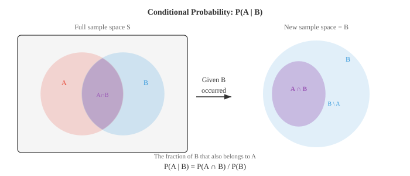
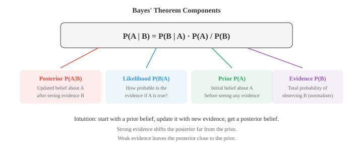

# Концепции вероятности

*Теория вероятностей формализует неопределенность и предоставляет правила для ее рассуждений. В этом файле описаны выборочные пространства, события, аксиомы вероятности, условной вероятности, независимости, теорема Байеса, а также частотные и байесовские интерпретации — математическая основа, лежащая в основе каждой генеративной и дискриминативной модели в ML.*

- Вероятность присваивает событию число от 0 до 1, измеряющее вероятность того, что оно произойдет. 

- Вероятность 0 означает невозможность, 1 означает уверенность, а 0,5 означает подбрасывание монеты.

- Есть две основные интерпретации. Точка зрения **частотников** гласит, что вероятность — это относительная частота в долгосрочной перспективе: подбросьте честную монету 10 000 раз, и примерно в 50% случаев выпадет решка.

- **Байесианская** точка зрения гласит, что вероятность — это степень убежденности: вы можете сказать, что вероятность того, что завтра пойдет дождь, составляет 70 %, даже если завтра наступит только один раз.

- Обе интерпретации используют одни и те же математические правила. Разница философская, но она имеет значение в ML. Частотные методы дают точечные оценки. Байесовские методы дают полное распределение по параметрам.

- **Пространство выборки** $S$ — это набор всех возможных результатов эксперимента. Подбросьте монетку: $S = \{H, T\}$. Бросьте кубик: $S = \{1, 2, 3, 4, 5, 6\}$.

– **Событие** — это любое подмножество выборочного пространства. «Выпадение четного числа» — это событие $A = \{2, 4, 6\}$, которое является подмножеством $S$.

- Просто подсчитывается вероятность события, когда все исходы равновероятны (из файла 01):

$$P(A) = \frac{|A|}{|S|} = \frac{\text{favourable outcomes}}{\text{total outcomes}}$$

- Для примера с четным числом: $P(\text{even}) = \frac{3}{6} = 0.5$.


- **Дополнение** события $A$, записанное $A'$ или $A^c$, представляет собой все в $S$, чего нет в $A$. Поскольку каждый результат либо находится в $A$, либо нет:

$$P(A') = 1 - P(A)$$

- Добавки часто являются более простым путем. Вместо того, чтобы считать все способы получить хотя бы один орел за 5 подбрасываний монеты, посчитайте один способ, чтобы не получить орла, и вычтите: $P(\text{at least one head}) = 1 - P(\text{all tails}) = 1 - (0.5)^5 = 0.969$.

- Два события являются **взаимоисключающими** (непересекающимися), если они не могут произойти одновременно: $A \cap B = \emptyset$. Выпадение 2 и 5 на одном кубике исключают друг друга.

- **Правило сложения взаимоисключающих событий** очень простое:

$$P(A \cup B) = P(A) + P(B) \quad \text{(if } A \cap B = \emptyset\text{)}$$

– Если события могут перекрываться, вам понадобится **общее правило сложения**, чтобы избежать двойного учета пересечений:

$$P(A \cup B) = P(A) + P(B) - P(A \cap B)$$

- Это отражает принцип включения-исключения из подсчета. Диаграмма Венна выше показывает, почему: фиолетовая область (пересечение) учитывается один раз в $P(A)$ и еще раз в $P(B)$, поэтому мы вычитаем ее один раз.

- **Совместная вероятность** $P(A \cap B)$ — это вероятность того, что одновременно произойдет $A$ и $B$. В колоде карт $P(\text{red} \cap \text{king}) = \frac{2}{52}$, потому что есть 2 красных короля.

- **Маргинальная вероятность** — это вероятность одного события независимо от других. $P(\text{red}) = \frac{26}{52} = 0.5$ — это предельная вероятность. Если у вас есть совместное распределение по двум переменным, маржинальное значение получается путем суммирования (или интегрирования) по другой переменной.

- **Условная вероятность** отвечает: учитывая, что $B$ уже произошло, какова вероятность $A$? Мы сожмем пространство выборки с $S$ до $B$ и спросим, какая часть $B$ также принадлежит $A$:

$$P(A | B) = \frac{P(A \cap B)}{P(B)}, \quad P(B) > 0$$



- Пример: вы берете карту, и кто-то говорит вам, что она красная. Какова вероятность, что это король? Всего 26 красных карточек, из них 2 короля, поэтому $P(\text{king} | \text{red}) = \frac{2}{26} = \frac{1}{13}$. Используя формулу: $P(\text{king} \cap \text{red}) / P(\text{red}) = \frac{2/52}{26/52} = \frac{1}{13}$.

- Два события считаются **независимыми**, если знание одного из них ничего не говорит о другом. Формально:

$$P(A \cap B) = P(A) \cdot P(B)$$

- Эквивалентно $P(A | B) = P(A)$. Подбрасывание двух отдельных монет является независимым событием. Вытягивание двух карт без замены не является самостоятельным (первое вытягивание меняет то, что осталось).- Независимость – это огромное упрощение. Для независимых событий совместные вероятности учитываются в произведениях, что делает вычисления более удобными. Многие модели машинного обучения предполагают независимость между функциями (например, наивный Байес) именно из-за этого упрощения.

- **Правило умножения** для любых двух событий меняет формулу условной вероятности:

$$P(A \cap B) = P(A | B) \cdot P(B) = P(B | A) \cdot P(A)$$

- Для независимых событий это упрощается до $P(A \cap B) = P(A) \cdot P(B)$, поскольку условное значение равно маргинальному.

- **Теорема Байеса** — один из наиболее важных результатов в теории вероятностей и основа байесовского машинного обучения. Он позволяет изменить направление условной вероятности:

$$P(A | B) = \frac{P(B | A) \cdot P(A)}{P(B)}$$

- Теорема следует непосредственно из записи $P(A \cap B)$ двумя способами: $P(B|A) \cdot P(A) = P(A|B) \cdot P(B)$, а затем решения $P(A|B)$.



- Каждый компонент имеет имя:
    - **Предыдущее** $P(A)$: ваше первоначальное убеждение до того, как вы увидите доказательства.
    - **Вероятность** $P(B|A)$: насколько вероятно свидетельство, если предположить, что $A$ соответствует действительности.
    - **Доказательства** $P(B)$: общая вероятность увидеть доказательства, действует как нормализатор.
    - **Задняя** $P(A|B)$: ваше обновленное убеждение после просмотра доказательств.

- Разберем классический пример медицинского диагноза. Предположим, болезнью страдает 1% населения. Точность теста на заболевание составляет 95 %: он правильно определяет 95 % больных (чувствительность) и правильно определяет 90 % здоровых (специфичность).

- Ваш тест положительный. Какова вероятность того, что у вас действительно есть это заболевание?

- Пусть $D$ = наличие заболевания, $+$ = положительный результат теста.
    - Приор: $P(D) = 0.01$
    - Вероятность: $P(+ | D) = 0.95$
    - Уровень ложных срабатываний: $P(+ | D') = 0.10$

- Нам нужен $P(+)$. По закону полной вероятности:

$$P(+) = P(+ | D) \cdot P(D) + P(+ | D') \cdot P(D')$$
$$= 0.95 \times 0.01 + 0.10 \times 0.99 = 0.0095 + 0.099 = 0.1085$$

- Теперь применим теорему Байеса:

$$P(D | +) = \frac{P(+ | D) \cdot P(D)}{P(+)} = \frac{0.95 \times 0.01}{0.1085} \approx 0.088$$

- Несмотря на то, что точность теста составляет 95 %, положительный результат дает лишь 8,8 % шансов заболеть этим заболеванием. Предыдущее имеет огромное значение. Поскольку заболевание встречается редко, большинство положительных результатов являются ложноположительными. Это важнейшее понимание любой проблемы классификации в ML: когда классы несбалансированы, сама по себе точность вводит в заблуждение.

- **Закон полной вероятности** делит выборочное пространство на взаимоисключающие, исчерпывающие события $B_1, B_2, \ldots, B_n$ и выражает любое событие $A$ как:

$$P(A) = \sum_{i=1}^{n} P(A | B_i) \cdot P(B_i)$$

- Именно это мы использовали для расчета $P(+)$ в медицинском примере: мы разделили население на «болеет» и «не болеет».

- **цепное правило вероятности** обобщает правило умножения на любое количество событий:

$$P(A_1 \cap A_2 \cap \cdots \cap A_n) = P(A_1) \cdot P(A_2 | A_1) \cdot P(A_3 | A_1 \cap A_2) \cdots P(A_n | A_1 \cap \cdots \cap A_{n-1})$$

- Каждый фактор обуславливает все, что было раньше. Это основа авторегрессионных языковых моделей: вероятность предложения — это произведение вероятности каждого слова с учетом всех предыдущих слов.

- **Условная независимость** означает, что два события независимы при наличии третьего. $A$ и $B$ являются условно независимыми при условии $C$, если:

$$P(A \cap B | C) = P(A | C) \cdot P(B | C)$$

- События могут быть незначительно зависимыми, но условно независимыми, и наоборот. Например, результаты экзамена двух студентов могут коррелировать (оба зависят от сложности экзамена), но, учитывая сложность экзамена, их баллы независимы.

- Условная независимость — ключевое предположение, лежащее в основе графических моделей, таких как байесовские сети. Он позволяет разложить сложные совместные распределения на управляемые части, что делает логический вывод осуществимым с вычислительной точки зрения.

## Задачи по кодированию (используйте CoLab или блокнот)

1. Смоделируйте задачу медицинского диагноза. Создайте популяцию из 100 000 человек, примените данные о распространенности заболевания и точности теста и убедитесь, что теорема Байеса дает правильный апостериорный результат.
```python
import jax
import jax.numpy as jnp

key = jax.random.PRNGKey(42)
n = 100_000

# Generate population
k1, k2 = jax.random.split(key)
has_disease = jax.random.bernoulli(k1, p=0.01, shape=(n,))

# Generate test results
k3, k4 = jax.random.split(k2)
# Sensitivity: P(+|D) = 0.95, Specificity: P(-|D') = 0.90
test_positive = jnp.where(
    has_disease,
    jax.random.bernoulli(k3, p=0.95, shape=(n,)),
    jax.random.bernoulli(k4, p=0.10, shape=(n,))
)

# Among those who tested positive, what fraction actually has the disease?
positives = test_positive.astype(bool)
true_positives = (has_disease & positives).sum()
total_positives = positives.sum()

print(f"Total positive tests: {total_positives}")
print(f"True positives: {true_positives}")
print(f"P(Disease | Positive) = {true_positives / total_positives:.4f}")
print(f"Bayes' formula:         {0.95 * 0.01 / 0.1085:.4f}")
```

2. Проверьте правило сложения с помощью моделирования. Сгенерируйте случайные события A и B с известными вероятностями и перекрытием, затем проверьте, что $P(A \cup B) = P(A) + P(B) - P(A \cap B)$.
```python
import jax
import jax.numpy as jnp

key = jax.random.PRNGKey(0)
n = 200_000
k1, k2 = jax.random.split(key)

# Events: A = value < 0.4, B = value < 0.6 (overlap at < 0.4)
vals_a = jax.random.uniform(k1, shape=(n,))
vals_b = jax.random.uniform(k2, shape=(n,))

A = vals_a < 0.4
B = vals_b < 0.6

p_a = A.mean()
p_b = B.mean()
p_a_and_b = (A & B).mean()
p_a_or_b = (A | B).mean()

print(f"P(A) = {p_a:.4f}")
print(f"P(B) = {p_b:.4f}")
print(f"P(A ∩ B) = {p_a_and_b:.4f}")
print(f"P(A ∪ B) simulated = {p_a_or_b:.4f}")
print(f"P(A) + P(B) - P(A∩B) = {p_a + p_b - p_a_and_b:.4f}")
```3. Продемонстрируйте, что условная вероятность меняется с появлением доказательств. Смоделируйте бросок двух игральных костей и вычислите $P(\text{sum} = 7)$, затем $P(\text{sum} = 7 | \text{first die} = 3)$.
```python
import jax
import jax.numpy as jnp

key = jax.random.PRNGKey(1)
n = 500_000
k1, k2 = jax.random.split(key)

d1 = jax.random.randint(k1, shape=(n,), minval=1, maxval=7)
d2 = jax.random.randint(k2, shape=(n,), minval=1, maxval=7)
total = d1 + d2

# Unconditional
p_sum7 = (total == 7).mean()
print(f"P(sum=7) = {p_sum7:.4f} (exact: {6/36:.4f})")

# Conditional on first die = 3
mask = d1 == 3
p_sum7_given_d1_3 = (total[mask] == 7).mean()
print(f"P(sum=7 | d1=3) = {p_sum7_given_d1_3:.4f} (exact: {1/6:.4f})")
```

4. Реализуйте теорему Байеса как функцию и используйте ее для итеративного обновления убеждений. Начните с единого априорного значения отклонения монеты и обновляйте его после наблюдения за каждым подбрасыванием.
```python
import jax.numpy as jnp
import matplotlib.pyplot as plt

def bayes_update(prior, likelihood):
    """Multiply prior by likelihood and normalise."""
    posterior = prior * likelihood
    return posterior / posterior.sum()

# Discretise possible bias values
theta = jnp.linspace(0, 1, 200)
prior = jnp.ones_like(theta)  # uniform prior
prior = prior / prior.sum()

# Observed flips: 1=heads, 0=tails
flips = [1, 1, 0, 1, 1, 1, 0, 1, 0, 1]

plt.figure(figsize=(10, 5))
plt.plot(theta, prior, "--", color="#999", label="prior")

for i, flip in enumerate(flips):
    likelihood = theta if flip == 1 else (1 - theta)
    prior = bayes_update(prior, likelihood)
    if i in [0, 2, 4, 9]:
        plt.plot(theta, prior, label=f"after {i+1} flips", linewidth=2)

plt.xlabel("Coin bias θ")
plt.ylabel("Belief (normalised)")
plt.title("Bayesian updating: belief about coin bias")
plt.legend()
plt.grid(alpha=0.3)
plt.show()
```