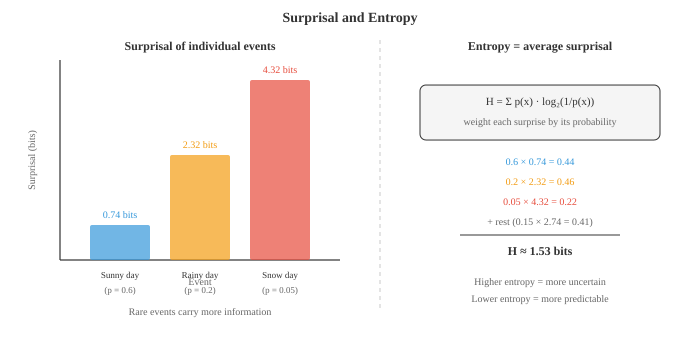
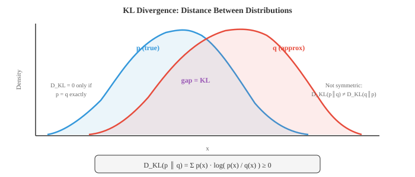

# Теория информации

*Теория информации количественно определяет информацию, неожиданность и разницу между распределениями вероятностей. В этом файле рассматриваются энтропия, перекрестная энтропия, расхождение KL, взаимная информация и неожиданность, концепции, лежащие в основе каждой функции потерь классификации, цель VAE и схема сжатия данных, используемые в машинном обучении.*

- Теория информации, основанная Клодом Шенноном в 1948 году, дает нам математическую основу для количественной оценки информации. Он отвечает на такие вопросы, как: насколько вас должно удивить событие? Сколько информации несет в себе сообщение? Насколько различаются два распределения вероятностей?

- Эти вопросы звучат абстрактно, но они лежат в основе функций потерь ML, сжатия данных и систем связи. Перекрестная энтропийная потеря, наиболее распространенная функция потерь в классификации, берет свое начало непосредственно из теории информации.

- Начните с самого простого вопроса: сколько информации несет в себе одно событие?

– **Сюрприз** (также называемый самоинформацией) измеряет, насколько неожиданным является событие. Если что-то очень вероятно произойдет, вы почти ничему не научитесь. Если случается что-то редкое, вы многому учитесь.

- Если вы живете в пустыне и вам говорят, что солнечно, это не очень информативно. Если вам скажут, что идет снег, это чрезвычайно информативно. Сюрприз формализует эту интуицию:

$$I(x) = \log_2 \frac{1}{p(x)} = -\log_2 p(x)$$

- При использовании $\log_2$ единицей измерения являются **биты**. У честного подбрасывания монеты есть неожиданный бит $-\log_2(0.5) = 1$. Событие с вероятностью $1/8$ имеет неожиданные биты $\log_2(8) = 3$.

- Почему логарифм, а не просто $1/p$? Три причины:
    - Определенное событие ($p = 1$) должно давать нулевую информацию: $\log(1) = 0$, но $1/1 = 1$.
    - Независимые события должны иметь дополнительную информацию: $\log(1/p_1 p_2) = \log(1/p_1) + \log(1/p_2)$.
    - Нам нужна плавная и хорошо работающая функция. $1/p$ взрывается; $\log(1/p)$ растет осторожно.

- **Энтропия** – это ожидаемый сюрприз, средний объем информации, которую вы получаете за одно событие, выбранное из распределения. Он измеряет неопределенность или «непредсказуемость» распределения:

$$H(X) = E[I(X)] = -\sum_{x} p(x) \log_2 p(x)$$



- Честная монета имеет бит энтропии $H = -0.5\log_2(0.5) - 0.5\log_2(0.5) = 1$. Максимальная неопределенность.

- Смещенная монета с $p = 0.9$ имеет энтропийные биты $H = -0.9\log_2(0.9) - 0.1\log_2(0.1) \approx 0.469$. Меньше неопределенности — меньше энтропии.

- Детерминированное событие ($p = 1$) имеет энтропию $H = 0$. Никакой неопределенности вообще.

- Энтропия максимальна, когда все исходы равновероятны. Для $n$ равновозможных исходов $H = \log_2 n$. Игральная кость имеет биты энтропии $\log_2 6 \approx 2.585$.

- Практическое значение энтропии — **сжатие**. Теорема Шеннона о кодировании исходного кода гласит, что вы не можете сжимать данные ниже уровня энтропии без потери информации. Изображение, в котором каждый пиксель равновероятен (максимальная энтропия), не может быть сжато. Изображение, которое в основном белое (с низкой энтропией), хорошо сжимается.

- Для быстрого определения масштаба: пиксель в оттенках серого (256 значений) имеет максимальную энтропию 8 бит. Изображение в оттенках серого 1080p содержит не более $1920 \times 1080 \times 8 \approx 16.6$ миллионов бит. Реальные изображения имеют гораздо меньшую энтропию, поскольку соседние пиксели коррелируют, поэтому сжатие JPEG работает.

- Для непрерывных случайных величин дискретная сумма становится целой. **Дифференциальная энтропия** равна:

$$h(X) = -\int_{-\infty}^{\infty} f(x) \log f(x)\, dx$$

- Гауссиан с дисперсией $\sigma^2$ имеет дифференциальную энтропию $h = \frac{1}{2}\log_2(2\pi e \sigma^2)$. Среди всех распределений с одинаковой дисперсией гауссово распределение имеет максимальную энтропию. Это одна из причин, по которой гауссиан настолько распространен в моделировании: он делает наименьшее количество допущений, выходящих за рамки указанного среднего значения и дисперсии.

– **Взаимная информация** измеряет, насколько знание одной переменной говорит вам о другой. Это уменьшение неопределенности относительно $X$, когда вы наблюдаете $Y$:

$$I(X; Y) = H(X) - H(X|Y) = H(Y) - H(Y|X)$$

- Эквивалентно:

$$I(X; Y) = \sum_{x,y} p(x,y) \log_2 \frac{p(x,y)}{p(x) p(y)}$$

- Если $X$ и $Y$ независимы, $p(x,y) = p(x)p(y)$ и взаимная информация равна нулю. Чем более они зависимы, тем выше взаимная информация.- В машинном обучении взаимная информация используется при выборе функций (выбор функций с высоким MI с целью), в методах информационных узких мест и при оценке качества кластеризации.

- **Кросс-энтропия** измеряет среднее количество бит, необходимое для кодирования событий из рассылки $p$ с использованием кода, оптимизированного для рассылки $q$:

$$H(p, q) = -\sum_{x} p(x) \log_2 q(x)$$

- Если $q$ идеально соответствует $p$, перекрестная энтропия равна энтропии: $H(p, p) = H(p)$. Если $q$ является плохим приближением, перекрестная энтропия выше. «Лишние» биты возникают из-за несоответствия.

— Именно поэтому кросс-энтропия является стандартной функцией потерь для классификации в ML. Истинные метки определяют $p$ (горячее распределение), а предсказанные модели вероятности определяют $q$. Минимизация перекрестной энтропии подталкивает $q$ к $p$:

$$\mathcal{L} = -\sum_{c} y_c \log \hat{y}_c$$

- Для одного образца с истинным классом $c$ это упрощается до $\mathcal{L} = -\log \hat{y}_c$. Эта потеря является сюрпризом для истинного класса, согласно предсказаниям модели. Если модель присваивает высокую вероятность правильному классу, потери невелики.

- **Дивергенция KL** (дивергенция Кульбака-Лейблера, также называемая относительной энтропией) измеряет, насколько одно распределение отличается от другого:

$$D_{\text{KL}}(p \| q) = \sum_{x} p(x) \log \frac{p(x)}{q(x)} = H(p, q) - H(p)$$

- Дивергенция KL — это «дополнительные затраты» за использование распределения $q$ вместо истинного распределения $p$. Оно всегда неотрицательно ($D_{\text{KL}} \ge 0$) и равно нулю только при условии $p = q$.



- Расхождение KL несимметрично: $D_{\text{KL}}(p \| q) \ne D_{\text{KL}}(q \| p)$. Эта асимметрия имеет значение. $D_{\text{KL}}(p \| q)$ наказывает $q$ за размещение низкой вероятности там, где $p$ имеет высокую вероятность (потому что $\log(p/q)$ взрывается). $D_{\text{KL}}(q \| p)$ наказывает обратное.

- Эта асимметрия приводит к двум стилям аппроксимации:
    - Свертывание $D_{\text{KL}}(p \| q)$ приводит к **соответствию моментов**: $q$ охватывает все режимы $p$, но может быть слишком разбросанным.
    - Свертывание $D_{\text{KL}}(q \| p)$ приводит к **поиску режима**: $q$ концентрируется на одном режиме $p$, но может пропустить другие. Именно это и использует вариационный вывод.

- Поскольку $H(p)$ является константой относительно модели, минимизация перекрестной энтропии $H(p, q)$ эквивалентна минимизации $D_{\text{KL}}(p \| q)$. Вот почему мы можем использовать перекрестную энтропийную потерю и знать, что мы также минимизируем расхождение KL между истинным и прогнозируемым распределениями.

- Дивергенция КЛ играет центральную роль в **байесовском обновлении**. Заднее $P(\theta | D)$ является распределением, наиболее близким к предшествующему $P(\theta)$ (с точки зрения KL-дивергенции), что согласуется с наблюдаемыми данными. Каждое новое наблюдение обновляет апостериорную информацию, уменьшая неопределенность относительно $\theta$.

- В вариационных автоэнкодерах (VAE) функция потерь имеет два члена: потери при реконструкции (перекрестная энтропия) и член дивергенции KL, который регуляризует скрытое пространство, чтобы оставаться близким к стандартному нормальному распределению.

- Чтобы связать все воедино: энтропия говорит о внутренней неопределенности распределения, перекрестная энтропия говорит о том, насколько хорошо ваша модель приближается к реальности, а расхождение KL говорит о разрыве между ними. Эти три величины составляют основу современной оптимизации машинного обучения.

## Задачи по кодированию (используйте CoLab или блокнот)

1. Вычислите энтропию различных распределений и убедитесь, что равномерное распределение имеет максимальную энтропию для заданного числа результатов.
```python
import jax.numpy as jnp

def entropy(p):
    """Compute entropy in bits. Filter out zero-probability events."""
    p = p[p > 0]
    return -jnp.sum(p * jnp.log2(p))

# Fair die
fair = jnp.ones(6) / 6
print(f"Fair die entropy:   {entropy(fair):.4f} bits (max = log2(6) = {jnp.log2(6.):.4f})")

# Loaded die
loaded = jnp.array([0.1, 0.1, 0.1, 0.1, 0.1, 0.5])
print(f"Loaded die entropy: {entropy(loaded):.4f} bits")

# Deterministic
det = jnp.array([0.0, 0.0, 0.0, 0.0, 0.0, 1.0])
print(f"Deterministic:      {entropy(det):.4f} bits")

# Fair coin
coin = jnp.array([0.5, 0.5])
print(f"Fair coin entropy:  {entropy(coin):.4f} bits")
```

2. Вычислить кросс-энтропию и расхождение KL между истинным распределением и несколькими приближениями. Убедитесь, что $D_{\text{KL}}(p \| q) = H(p, q) - H(p)$.
```python
import jax.numpy as jnp

def cross_entropy(p, q):
    return -jnp.sum(p * jnp.log2(jnp.clip(q, 1e-10, 1.0)))

def kl_divergence(p, q):
    mask = p > 0
    return jnp.sum(jnp.where(mask, p * jnp.log2(p / jnp.clip(q, 1e-10, 1.0)), 0.0))

def entropy(p):
    p = p[p > 0]
    return -jnp.sum(p * jnp.log2(p))

p = jnp.array([0.4, 0.3, 0.2, 0.1])  # true distribution

for name, q in [("perfect match", p),
                ("slight mismatch", jnp.array([0.35, 0.30, 0.25, 0.10])),
                ("big mismatch", jnp.array([0.1, 0.1, 0.1, 0.7]))]:
    h_p = entropy(p)
    h_pq = cross_entropy(p, q)
    kl = kl_divergence(p, q)
    print(f"{name:20s}: H(p)={h_p:.4f}, H(p,q)={h_pq:.4f}, "
          f"KL={kl:.4f}, H(p,q)-H(p)={h_pq-h_p:.4f}")
```

3. Покажите, что расхождение KL несимметрично, вычислив $D_{\text{KL}}(p \| q)$ и $D_{\text{KL}}(q \| p)$ для двух разных распределений.
```python
import jax.numpy as jnp

def kl_div(p, q):
    mask = p > 0
    return float(jnp.sum(jnp.where(mask, p * jnp.log2(p / jnp.clip(q, 1e-10, 1.0)), 0.0)))

p = jnp.array([0.9, 0.1])
q = jnp.array([0.5, 0.5])

print(f"D_KL(p || q) = {kl_div(p, q):.4f}")
print(f"D_KL(q || p) = {kl_div(q, p):.4f}")
print(f"Not the same! KL divergence is asymmetric.")
```

4. Имитировать потерю перекрестной энтропии во время обучения. Создайте «истинную» горячую метку и покажите, как потери уменьшаются по мере улучшения предсказанных моделью вероятностей.
```python
import jax.numpy as jnp
import matplotlib.pyplot as plt

# True label: class 2 out of 4
true_label = jnp.array([0, 0, 1, 0])

# Simulate improving predictions
steps = []
losses = []
for confidence in jnp.linspace(0.25, 0.99, 50):
    # Model becomes more confident in class 2
    remaining = (1 - confidence) / 3
    pred = jnp.array([remaining, remaining, confidence, remaining])
    loss = -jnp.sum(true_label * jnp.log(jnp.clip(pred, 1e-10, 1.0)))
    steps.append(float(confidence))
    losses.append(float(loss))

plt.figure(figsize=(8, 4))
plt.plot(steps, losses, color="#e74c3c", linewidth=2)
plt.xlabel("Model confidence in true class")
plt.ylabel("Cross-entropy loss")
plt.title("Cross-entropy loss decreases as predictions improve")
plt.grid(alpha=0.3)
plt.show()
```