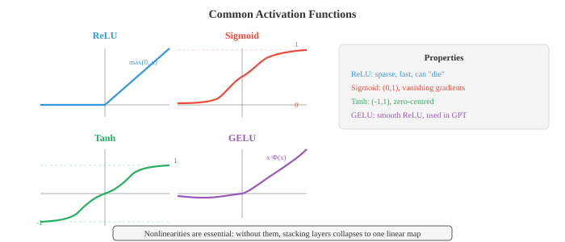
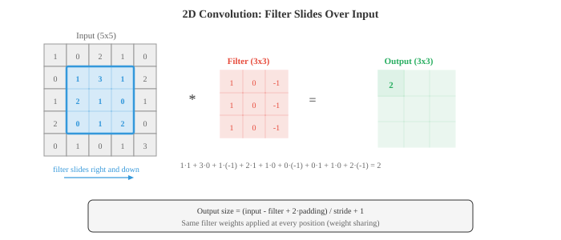

# Глубокое обучение

*Глубокое обучение объединяет нелинейные слои для создания иерархических представлений, которые автоматически преобразуют необработанные входные данные в полезные функции. В этом файле описаны MLP, функции активации, обратное распространение ошибки, CNN, RNN, LSTM, внимание, преобразователи, GAN, VAE, модели диффузии и методы нормализации*.

- Что делает сеть «глубокой»? Мелкая сеть имеет один скрытый слой; глубокая сеть имеет много. Глубина позволяет сети строить иерархические представления: ранние уровни изучают простые функции (края, тона), а более поздние слои объединяют их в сложные понятия (лица, предложения). Именно эта композиционность придает глубокому обучению силу.

- Самая простая глубокая сеть — это **многослойный перцептрон (MLP)**, также называемый полностью связной или плотной сетью. Каждый слой вычисляет:

$$h = \sigma(Wx + b)$$

— Здесь $W$ — весовая матрица (глава 02), $b$ — вектор смещения, а $\sigma$ — нелинейная функция активации. Выходные данные одного слоя становятся входными данными для следующего. Без нелинейности наложение слоев было бы бессмысленным: $W_2(W_1 x) = (W_2 W_1)x$, что является всего лишь еще одним линейным преобразованием. Это как раз коллапс матричного умножения из главы 02.

- **Функции активации** вводят нелинейность, которая делает глубину значимой.

- **ReLU** (выпрямленный линейный блок): $\text{ReLU}(x) = \max(0, x)$. Это наиболее широко используемая активация. Он быстро вычисляется, не насыщается при положительных входных сигналах и производит редкие активации (многие нейроны выдают ровно ноль). Недостаток: нейроны с отрицательным входом всегда выдают ноль, и если они застревают там навсегда, они «умирают» и перестают учиться.

- **Сигмоид**: $\sigma(x) = \frac{1}{1+e^{-x}}$, сжимает входы в $(0, 1)$. Полезно для выходных слоев при двоичной классификации, но проблематично в скрытых слоях, поскольку градиенты исчезают, когда входные данные далеки от нуля (кривая почти плоская).

- **Тань**: $\tanh(x) = \frac{e^x - e^{-x}}{e^x + e^{-x}}$, сжатие до $(-1, 1)$. Центрирован по нулю (в отличие от сигмовидной формы), что способствует градиентному течению, но все же страдает от исчезновения градиентов в крайних точках.

- **GELU** (линейная единица измерения гауссовой ошибки): $\text{GELU}(x) = x \cdot \Phi(x)$, где $\Phi$ — стандартный нормальный CDF. Это плавное приближение к ReLU, которое пропускает небольшие отрицательные значения. GELU используется по умолчанию в GPT и BERT.

- **Взмах**: $\text{Swish}(x) = x \cdot \sigma(x)$, еще одни гладкие ворота. На практике похоже на GELU.



- Плотный слой с входами $d_{\text{in}}$ и выходами $d_{\text{out}}$ имеет параметры $d_{\text{in}} \times d_{\text{out}} + d_{\text{out}}$ (веса плюс смещения). Матричное умножение $Wx$ — это просто умножение матрицы на вектор из главы 02. При пакетной настройке входными данными являются матрица $X$ формы $(B, d_{\text{in}})$, а выходными данными — $XW^T + b$ формы $(B, d_{\text{out}})$.

- **Теорема об универсальной аппроксимации** гласит, что один скрытый слой с достаточным количеством нейронов может аппроксимировать любую непрерывную функцию в компактной области с произвольной точностью. Звучит так, будто глубина не имеет значения, но загвоздка в том, что «нейронов достаточно». На практике глубокие сети могут представлять одни и те же функции с экспоненциально меньшим количеством параметров, чем мелкие. Глубина дает вам эффективность, а не только выразительность.

- По мере того, как сети становятся глубже, возникают две градиентные патологии. **Исчезающие градиенты**: когда градиенты проходят через множество слоев (согласно правилу цепочки, глава 03), они умножаются на множество коэффициентов. Если эти коэффициенты постоянно меньше 1 (как это происходит при насыщении сигмовидной и танга), градиент экспоненциально сжимается к нулю. Ранние слои почти не учатся. **Взрывной градиент**: если коэффициенты постоянно превышают 1, градиенты растут экспоненциально, вызывая числовое переполнение и нестабильное обучение.

- Решения для исчезновения/взрыва градиентов:
  - Используйте активации ReLU или GELU (градиент равен 1 для положительных входов, без насыщения)
  - Тщательная инициализация веса
  - Слои нормализации
  - Остаточные соединения (пропуск соединений)
  - Отсечение градиента (для взрывающихся градиентов): ограничение нормы градиента максимальным значением.- **Инициализация веса** имеет значение, поскольку она определяет масштаб активаций и градиентов в начале тренировки. Если веса слишком велики, активации взрываются; слишком малы, они исчезают.

- **Инициализация Ксавьера (Глорота)** устанавливает веса из распределения с отклонением $\frac{2}{d_{\text{in}} + d_{\text{out}}}$. Это сохраняет дисперсию активаций примерно постоянной на разных уровнях, предполагая линейную или танх-активацию.

- **Инициализация He (Kaiming)** использует дисперсию $\frac{2}{d_{\text{in}}}$, которая откалибрована для активаций ReLU (поскольку ReLU обнуляет половину активаций, для компенсации необходимо удвоить дисперсию).

- **Уровни нормализации** стабилизируют обучение, гарантируя, что входные данные для каждого слоя имеют согласованную статистику (приблизительно нулевое среднее значение, единичная дисперсия).

- **Пакетная нормализация (BatchNorm)** нормализует размер партии: для каждого канала/функции вычисляется среднее значение и дисперсия для всех выборок в мини-партии, а затем нормализуется. Он добавляет обучаемые параметры масштаба ($\gamma$) и сдвига ($\beta$), чтобы сеть могла отменить нормализацию при необходимости:

$$\hat{x} = \frac{x - \mu_B}{\sqrt{\sigma_B^2 + \epsilon}}, \quad y = \gamma \hat{x} + \beta$$

- У BatchNorm есть проблема: это зависит от размера партии. При очень маленьких партиях статистика зашумлена. Во время вывода вы используете текущие средние значения вместо пакетной статистики, что создает несоответствие между поездом и тестом.

- **Нормализация слоя (LayerNorm)** нормализует размер объекта для каждого отдельного образца. Он не зависит от других образцов в партии, что делает его стандартным выбором для трансформаторов и рекуррентных сетей.

- **Нормализация экземпляра** нормализует пространственные измерения для каждого образца и каждого канала независимо. Популярен в стиле передачи.

- **Нормализация группы** разбивает каналы на группы и нормализует внутри каждой группы. Это компромисс между LayerNorm и InstanceNorm.


- **Dropout** — это метод регуляризации, который случайным образом обнуляет часть $p$ нейронов во время обучения. Это заставляет сеть не полагаться ни на один нейрон, поощряя избыточные представления. Во время тестирования все нейроны активны. **Инвертированное исключение** масштабирует активации на $\frac{1}{1-p}$ во время обучения, поэтому во время тестирования масштабирование не требуется. Это стандартная реализация.

- **Сверточные нейронные сети (CNN)** используют пространственную структуру. Вместо того, чтобы соединять каждый вход с каждым выходом (как в плотных слоях), сверточный слой перемещает небольшой фильтр (ядро) по входу, вычисляя скалярное произведение в каждой позиции. Одни и те же веса фильтра распределяются по всем позициям, что радикально уменьшает параметры и повышает трансляционную инвариантность.

- **Операция свертки** для 2D-входа с фильтром $K$ размера $k \times k$:

$$(\text{input} * K)[i,j] = \sum_{m=0}^{k-1} \sum_{n=0}^{k-1} \text{input}[i+m, j+n] \cdot K[m, n]$$



- Размер вывода зависит от трех гиперпараметров. **Шаг** определяет, на сколько пикселей фильтр перемещается между позициями (шаг 2 уменьшает пространственные размеры вдвое). **Заполнение** добавляет нули вокруг границы ввода («то же самое» заполнение сохраняет пространственный размер, «действительное» заполнение — нет). Формула выходного размера: $\text{out} = \lfloor (\text{in} - k + 2p) / s \rfloor + 1$.

- Слои **объединения** уменьшают дискретизацию карт объектов. При максимальном пуле принимается максимальное значение в каждом окне; средний пул принимает среднее значение. Объединение уменьшает пространственные размеры, сохраняя при этом наиболее важную информацию.

- **Расширенные извилины** вставляют промежутки между фильтрующими элементами, увеличивая рецептивное поле без увеличения параметров. Степень расширения 2 означает, что фильтр 3x3 покрывает область 5x5.

- **Свертки 1x1** — это свертки с фильтром 1x1. Они не смотрят на пространственных соседей; вместо этого они смешивают информацию по каналам. Думайте о них как о нанесении плотного слоя в каждой пространственной позиции. Их используют для дешевого изменения количества каналов.- **Пропустить соединения** (остаточные соединения) позволяют входу обходить один или несколько уровней: $\text{output} = F(x) + x$. Слою необходимо запомнить только остаток $F(x) = \text{output} - x$, что проще, когда оптимальное преобразование близко к идентичному. ResNets (остаточные сети) с помощью этого трюка объединили более 100 слоев, решая проблему деградации, когда более глубокие сети работали хуже, чем более мелкие.

- CNN создают **иерархию функций**. Ранние слои обнаруживают края и текстуры. Средние слои объединяют их в части (глаза, колеса). Поздние слои распознают целые объекты. Рецептивное поле каждого слоя (область ввода, которую он может «видеть») растет с глубиной.

- **Вложения** сопоставляют дискретные токены (слова, символы, идентификаторы элементов) с плотными векторами. Слой внедрения — это просто таблица поиска: матрица формы $E$ (размер словаря, размерность внедрения). Поиск токена $i$ означает выбор строки $i$ из $E$. Это эквивалентно умножению на горячий вектор, что является частным случаем умножения матрицы на вектор (глава 02). Вложения изучаются во время обучения, поэтому схожие токены получаются со схожими векторами.

- **Токенизация** – это процесс преобразования необработанного текста в последовательность токенов. Токенизация на уровне слов разделяется на пробелы, но не может обрабатывать невидимые слова. **Токенизация подслов** (BPE, WordPiece, SentencePiece) разбивает текст на часто встречающиеся подслова, балансируя размер и охват словарного запаса. Слово «несчастье» может превратиться в [«un», «счастье»] или [«un», «счастье», «iness»].

- **Рекуррентные нейронные сети (RNN)** обрабатывают последовательности по одному элементу за раз, сохраняя скрытое состояние, которое передает информацию вперед:

$$h_t = \tanh(W_h h_{t-1} + W_x x_t + b)$$

- Скрытое состояние $h_t$ представляет собой сжатую сводку всего, что сеть видела до момента $t$. Одни и те же веса $W_h$ и $W_x$ используются во всех временных шагах (распределение веса, как CNN разделяют пространственные веса).

- Ванильные RNN борются с длинными последовательностями из-за исчезающих градиентов: сигнал градиента от шага $t$ до шага $t - k$ проходит через умножение $k$ на $W_h$ и сжимается (или взрывается) экспоненциально.

- **LSTM** (длинная краткосрочная память) решает эту проблему, вводя отдельное состояние ячейки $c_t$, которое течет во времени с минимальным вмешательством. Три врата контролируют, какая информация входит, уходит и сохраняется:

- **Ворота забывания** решают, что удалить из состояния ячейки: $f_t = \sigma(W_f [h_{t-1}, x_t] + b_f)$.
- **Входной вентиль** решает, какую новую информацию записать: $i_t = \sigma(W_i [h_{t-1}, x_t] + b_i)$, с возможными значениями $\tilde{c}_t = \tanh(W_c [h_{t-1}, x_t] + b_c)$.
- Обновление состояния ячейки: $c_t = f_t \odot c_{t-1} + i_t \odot \tilde{c}_t$.
- **Выходной вентиль** решает, что предоставлять: $o_t = \sigma(W_o [h_{t-1}, x_t] + b_o)$ и $h_t = o_t \odot \tanh(c_t)$.


- Состояние ячейки действует как конвейер: информация может течь неизменной на протяжении многих временных шагов (ворота забывания остаются близкими к 1), что решает проблему исчезновения градиента для долгосрочных зависимостей.

- **GRU** (Gated Recurrent Unit) упрощает LSTM, объединяя состояние ячейки и скрытое состояние в одно и используя два шлюза вместо трех: шлюз обновления (объединяет забывание и ввод) и шлюз сброса. GRU имеют меньше параметров и часто работают сравнимо с LSTM.

— Фундаментальным ограничением RNN (включая LSTM) является последовательная обработка: вы должны обрабатывать токен 1, прежде чем токен 2, прежде чем токен 3. Это предотвращает распараллеливание и создает узкое место в информации, поскольку весь контекст должен проходить через скрытое состояние фиксированного размера.

- **Внимание** решает обе проблемы. Вместо того, чтобы сжимать весь входной сигнал в фиксированный вектор, внимание позволяет модели просмотреть все входные позиции и решить, какие из них имеют отношение к текущему выходному сигналу.

- В современной формулировке используются **запросы, ключи и значения (Q, K, V)**. Думайте об этом как о поиске в библиотеке: у вас есть запрос (то, что вы ищете), ключи (ярлыки на каждой книге) и значения (фактическое содержание книги). Вы сравниваете свой запрос со всеми ключами, чтобы выяснить, какие значения нужно получить.

- **Масштабирование внимания к точечному произведению**:$$\text{Attention}(Q, K, V) = \text{softmax}\!\left(\frac{QK^T}{\sqrt{d_k}}\right) V$$

- $QK^T$ вычисляет сходство между каждым запросом и каждым ключом. Это умножение матрицы (глава 02), а записи представляют собой скалярное произведение, которое измеряет косинусное сходство (глава 01). Деление на $\sqrt{d_k}$ предотвращает слишком большое скалярное произведение (что может привести к насыщению softmax и созданию распределений, близких к горячему, с исчезающими градиентами). Softmax преобразует сходства в распределение вероятностей. Умножение на $V$ дает взвешенную комбинацию значений.

- **Многоголовое внимание** выполняет параллельные операции внимания $h$, каждая из которых имеет разные изученные проекции Q, K и V. Это позволяет модели одновременно обрабатывать информацию из разных подпространств представления. Одна голова может заниматься синтаксическими связями, а другая — семантическими. Результаты объединяются и прогнозируются:

$$\text{MultiHead}(Q, K, V) = \text{Concat}(\text{head}_1, \ldots, \text{head}_h) W^O$$

- Архитектура **Трансформатор** (Васвани и др., 2017) полностью построена на уровнях внимания и прямой связи, без повторений. Блок кодера повторяет: многоголовочное самообслуживание, добавление и норма слоя, сеть прямой связи, добавление и норма слоя. Блок декодера добавляет замаскированное самообладание (не позволяющее модели видеть будущие токены) и уровень перекрестного внимания, который обрабатывает выходные данные кодера.


- **Позиционное кодирование** необходимо, поскольку внимание эквивалентно перестановкам, то есть оно обрабатывает входные данные как набор, а не как последовательность. Без информации о местоположении фразы «кот сидел на коврике» и «коврик сидел на кошке» были бы идентичными. Оригинальный Transformer использует синусоидальную позиционную кодировку:

$$PE_{(pos, 2i)} = \sin\!\left(\frac{pos}{10000^{2i/d}}\right), \quad PE_{(pos, 2i+1)} = \cos\!\left(\frac{pos}{10000^{2i/d}}\right)$$

— Каждая позиция получает уникальный вектор, который модель может использовать для различения позиций. Вместо этого современные модели часто используют изученные позиционные вложения или относительные позиционные кодировки (RoPE, ALiBi).

— Трансформаторы обрабатывают все токены параллельно (матрица самообслуживания $QK^T$ вычисляется за одно умножение матрицы), что позволяет им обучаться гораздо быстрее, чем RNN на современном оборудовании. Компромисс заключается в том, что самовнимание имеет длину последовательности $O(n^2)$ (каждый токен заботится обо всех остальных), а RNN — $O(n)$. Вот почему модели с длинным контекстом требуют особых вариантов внимания (редкое внимание, линейное внимание, мгновенное внимание).

- **Vision Transformers (ViT)** применяют Transformer к изображениям, разбивая изображение на фрагменты фиксированного размера (например, 16x16), сглаживая каждый фрагмент в вектор и обрабатывая фрагменты как последовательность токенов. В начале добавляется обучаемый токен [CLS], и его окончательное представление используется для классификации. Несмотря на отсутствие сверточных индуктивных смещений, ViT соответствуют или превосходят CNN при обучении на достаточном количестве данных.

- **MLP-Mixer** — это еще более простая архитектура, которая заменяет внимание и свертку с помощью MLP. Он чередуется между MLP «смешивания токенов» (применяется к пространственным позициям) и MLP «смешивания каналов» (применяется к объектам). Он работает конкурентоспособно, предполагая, что ключевым моментом современной архитектуры является не внимание само по себе, а скорее эффективное смешивание информации между токенами и функциями.

- **Автокодеры** изучают сжатые представления, обучая сеть восстанавливать собственные входные данные. Кодер сопоставляет входные данные с узким местом меньшей размерности (скрытым кодом), а декодер отображает их обратно:

$$z = f_{\text{enc}}(x), \quad \hat{x} = f_{\text{dec}}(z), \quad \mathcal{L} = \|x - \hat{x}\|^2$$

- Узкое место заставляет сеть изучать наиболее важные функции. Автоэнкодеры используются для уменьшения размерности, шумоподавления (обработка шумного входного сигнала, восстановление чистого выходного сигнала) и обнаружения аномалий (большая ошибка восстановления сигнализирует о необычном входном сигнале).

- **Вариационные автоэнкодеры (VAE)** добавляют вероятностный подход. Вместо кодирования в одну точку $z$ кодер выводит параметры распределения (среднее значение $\mu$ и дисперсию $\sigma^2$ гауссова). Скрытый код взят из этого дистрибутива: $z = \mu + \sigma \odot \epsilon$, где $\epsilon \sim \mathcal{N}(0, I)$. Этот **трюк с перепараметризацией** делает выборку дифференцируемой, поэтому через нее могут проходить градиенты.- Убыток VAE имеет два слагаемых:

$$\mathcal{L} = \underbrace{\|x - \hat{x}\|^2}_{\text{reconstruction}} + \underbrace{D_{\text{KL}}(q(z|x) \| p(z))}_{\text{regularisation}}$$

- Термин дивергенции KL (из главы 05) подталкивает изученное заднее $q(z|x)$ к предшествующему $p(z) = \mathcal{N}(0, I)$, гарантируя, что скрытое пространство будет гладким и хорошо структурированным. Затем вы можете выполнить выборку из предыдущих данных и декодировать их для создания новых данных. Именно это делает генеративные модели VAE.

## Задачи по кодированию (используйте CoLab или блокнот)

1. Создайте простой MLP с нуля в JAX. Обучите его решению задачи двумерной классификации (например, концентрических кругов) и визуализируйте границу решения.
```python
import jax
import jax.numpy as jnp
import matplotlib.pyplot as plt
from sklearn.datasets import make_circles

# Data
X, y = make_circles(n_samples=500, noise=0.1, factor=0.5, random_state=42)
X, y = jnp.array(X), jnp.array(y, dtype=jnp.float32)

# Initialise a 2-layer MLP: 2 -> 16 -> 16 -> 1
def init_params(key):
    k1, k2, k3 = jax.random.split(key, 3)
    return {
        'W1': jax.random.normal(k1, (2, 16)) * 0.5,
        'b1': jnp.zeros(16),
        'W2': jax.random.normal(k2, (16, 16)) * 0.5,
        'b2': jnp.zeros(16),
        'W3': jax.random.normal(k3, (16, 1)) * 0.5,
        'b3': jnp.zeros(1),
    }

def forward(params, x):
    h = jnp.maximum(0, x @ params['W1'] + params['b1'])  # ReLU
    h = jnp.maximum(0, h @ params['W2'] + params['b2'])   # ReLU
    logit = (h @ params['W3'] + params['b3']).squeeze()
    return jax.nn.sigmoid(logit)

def loss_fn(params, X, y):
    pred = forward(params, X)
    return -jnp.mean(y * jnp.log(pred + 1e-7) + (1 - y) * jnp.log(1 - pred + 1e-7))

grad_fn = jax.jit(jax.grad(loss_fn))
params = init_params(jax.random.PRNGKey(0))
lr = 0.1

for step in range(2000):
    grads = grad_fn(params, X, y)
    params = {k: params[k] - lr * grads[k] for k in params}

# Plot decision boundary
xx, yy = jnp.meshgrid(jnp.linspace(-2, 2, 200), jnp.linspace(-2, 2, 200))
grid = jnp.column_stack([xx.ravel(), yy.ravel()])
zz = forward(params, grid).reshape(xx.shape)

plt.figure(figsize=(7, 6))
plt.contourf(xx, yy, zz, levels=[0, 0.5, 1], alpha=0.3, colors=['#e74c3c', '#3498db'])
plt.scatter(X[y==0,0], X[y==0,1], c='#e74c3c', s=10, label='Class 0')
plt.scatter(X[y==1,0], X[y==1,1], c='#3498db', s=10, label='Class 1')
plt.title("MLP Decision Boundary on Concentric Circles")
plt.legend(); plt.grid(alpha=0.3); plt.show()

acc = jnp.mean((forward(params, X) > 0.5) == y)
print(f"Accuracy: {acc:.2%}")
```

2. Реализуйте 1D-свертку с нуля. Примените к сигналу простой фильтр обнаружения фронтов и сравните его со встроенным фильтром `jnp.convolve`.
```python
import jax.numpy as jnp
import matplotlib.pyplot as plt

def conv1d(signal, kernel):
    """1D convolution (valid mode) from scratch."""
    n, k = len(signal), len(kernel)
    output = jnp.zeros(n - k + 1)
    for i in range(n - k + 1):
        output = output.at[i].set(jnp.sum(signal[i:i+k] * kernel))
    return output

# Create a signal with a step function
t = jnp.linspace(0, 4, 200)
signal = jnp.where(t < 1, 0.0, jnp.where(t < 2, 1.0, jnp.where(t < 3, 0.5, 1.5)))

# Edge detection kernel
edge_kernel = jnp.array([-1.0, 0.0, 1.0])

# Our implementation vs built-in
our_output = conv1d(signal, edge_kernel)
jnp_output = jnp.convolve(signal, edge_kernel, mode='valid')

fig, axes = plt.subplots(3, 1, figsize=(10, 6), sharex=True)
axes[0].plot(t, signal, color='#3498db', linewidth=1.5)
axes[0].set_title("Original Signal"); axes[0].set_ylabel("Value")

axes[1].plot(t[:len(our_output)], our_output, color='#e74c3c', linewidth=1.5)
axes[1].set_title("After Edge Detection (our conv1d)"); axes[1].set_ylabel("Value")

axes[2].plot(t[:len(jnp_output)], jnp_output, color='#27ae60', linewidth=1.5, linestyle='--')
axes[2].set_title("After Edge Detection (jnp.convolve)"); axes[2].set_ylabel("Value")
axes[2].set_xlabel("t")

plt.tight_layout(); plt.show()
print(f"Outputs match: {jnp.allclose(our_output, jnp_output)}")
```

3. Внедрить масштабируемое точечное произведение с нуля. Рассчитайте веса внимания для небольшого примера и визуализируйте матрицу внимания в виде тепловой карты.
```python
import jax
import jax.numpy as jnp
import matplotlib.pyplot as plt

def scaled_dot_product_attention(Q, K, V):
    """Scaled dot-product attention."""
    d_k = Q.shape[-1]
    scores = Q @ K.T / jnp.sqrt(d_k)
    weights = jax.nn.softmax(scores, axis=-1)
    output = weights @ V
    return output, weights

# Example: 4 tokens, embedding dim 8
key = jax.random.PRNGKey(42)
k1, k2, k3 = jax.random.split(key, 3)
seq_len, d_model = 4, 8

Q = jax.random.normal(k1, (seq_len, d_model))
K = jax.random.normal(k2, (seq_len, d_model))
V = jax.random.normal(k3, (seq_len, d_model))

output, weights = scaled_dot_product_attention(Q, K, V)

print(f"Q shape: {Q.shape}")
print(f"Attention weights shape: {weights.shape}")
print(f"Output shape: {output.shape}")
print(f"\nAttention weights (rows sum to 1):")
print(weights)
print(f"Row sums: {weights.sum(axis=-1)}")

# Visualise attention
fig, ax = plt.subplots(figsize=(5, 4))
im = ax.imshow(weights, cmap='Blues', vmin=0, vmax=1)
ax.set_xlabel("Key position"); ax.set_ylabel("Query position")
ax.set_title("Attention Weights")
tokens = ['tok 0', 'tok 1', 'tok 2', 'tok 3']
ax.set_xticks(range(4)); ax.set_xticklabels(tokens)
ax.set_yticks(range(4)); ax.set_yticklabels(tokens)
for i in range(4):
    for j in range(4):
        ax.text(j, i, f"{weights[i,j]:.2f}", ha='center', va='center', fontsize=10)
plt.colorbar(im); plt.tight_layout(); plt.show()
```

4. Создайте простой автокодировщик, который сжимает 2D-данные через узкое место 1D и восстанавливает их. Визуализируйте скрытое пространство и реконструкции.
```python
import jax
import jax.numpy as jnp
import matplotlib.pyplot as plt
from sklearn.datasets import make_moons

# Data
X, _ = make_moons(n_samples=500, noise=0.05, random_state=42)
X = jnp.array(X)

# Autoencoder: 2 -> 8 -> 1 -> 8 -> 2
def init_ae(key):
    k1, k2, k3, k4 = jax.random.split(key, 4)
    return {
        'enc_W1': jax.random.normal(k1, (2, 8)) * 0.5, 'enc_b1': jnp.zeros(8),
        'enc_W2': jax.random.normal(k2, (8, 1)) * 0.5, 'enc_b2': jnp.zeros(1),
        'dec_W1': jax.random.normal(k3, (1, 8)) * 0.5, 'dec_b1': jnp.zeros(8),
        'dec_W2': jax.random.normal(k4, (8, 2)) * 0.5, 'dec_b2': jnp.zeros(2),
    }

def encode(p, x):
    h = jnp.tanh(x @ p['enc_W1'] + p['enc_b1'])
    return h @ p['enc_W2'] + p['enc_b2']

def decode(p, z):
    h = jnp.tanh(z @ p['dec_W1'] + p['dec_b1'])
    return h @ p['dec_W2'] + p['dec_b2']

def ae_loss(p, X):
    z = encode(p, X)
    X_hat = decode(p, z)
    return jnp.mean((X - X_hat) ** 2)

grad_fn = jax.jit(jax.grad(ae_loss))
params = init_ae(jax.random.PRNGKey(0))
lr = 0.01

for step in range(3000):
    grads = grad_fn(params, X)
    params = {k: params[k] - lr * grads[k] for k in params}

z = encode(params, X)
X_hat = decode(params, z)

fig, axes = plt.subplots(1, 2, figsize=(12, 5))
axes[0].scatter(X[:,0], X[:,1], c=z.squeeze(), cmap='viridis', s=10)
axes[0].set_title("Original Data (coloured by latent code)")
axes[1].scatter(X_hat[:,0], X_hat[:,1], c=z.squeeze(), cmap='viridis', s=10)
axes[1].set_title("Reconstruction from 1D bottleneck")
for ax in axes:
    ax.set_aspect('equal'); ax.grid(alpha=0.3)
plt.tight_layout(); plt.show()

print(f"Reconstruction MSE: {ae_loss(params, X):.4f}")
```