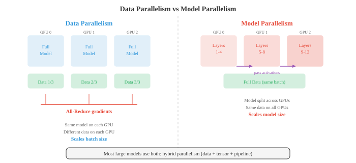
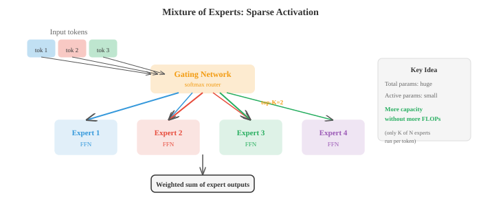

# Распределенное глубокое обучение

*Распределенное обучение распределяет вычисления по нескольким графическим процессорам и машинам для обучения моделей, которые слишком велики или слишком медленны для одного устройства. Этот файл охватывает смешанную точность, параллелизм данных, параллелизм моделей, параллелизм конвейеров, ZeRO, FSDP, тензорный параллелизм и коммуникационные примитивы, такие как all-reduce, необходимые для обучения LLM в большом масштабе.*

- Обучение большой нейронной сети на одном графическом процессоре в конечном итоге заходит в тупик. Модель может не уместиться в памяти, или обучение может занять месяцы. Распределенное обучение распределяет работу по нескольким устройствам (графическим процессорам, TPU или целым машинам) для более быстрого обучения и обучения более крупных моделей. В этом файле описаны методы, которые делают это возможным.

– Чтобы понять, почему распределение имеет значение, начните с **вычислительной стоимости** обучения. Один прямой проход через плотный слой с входными данными $d_{\text{in}}$ и выходными данными $d_{\text{out}}$ для пакета примеров $B$ требует примерно $2 \cdot B \cdot d_{\text{in}} \cdot d_{\text{out}}$ FLOP (операций с плавающей запятой): одно умножение и одно сложение для каждого элемента выходной матрицы. Обратный проход стоит примерно вдвое больше, чем прямой (вычисление градиентов как по входным данным, так и по весам), поэтому один шаг обучения на плотном слое занимает около $6 \cdot B \cdot d_{\text{in}} \cdot d_{\text{out}}$ FLOP.

- Для слоя преобразователя со скрытым измерением $d$ блок самообслуживания включает в себя четыре проекции (Q, K, V и выход), каждая из которых стоит $O(B \cdot n \cdot d^2)$ FLOP (где $n$ — длина последовательности), плюс вычисление матрицы внимания по адресу $O(B \cdot n^2 \cdot d)$. Блок прямой связи имеет два плотных слоя, обычно расширяющихся до $4d$ и обратно: $O(B \cdot n \cdot 8d^2)$. Итого на слой: примерно $O(B \cdot n \cdot 12d^2 + B \cdot n^2 \cdot d)$. Умножьте это число на количество слоев, и вы поймете, почему обучение моделей в масштабе GPT требует тысяч часов графического процессора.

- **стена памяти** часто является более жестким ограничением. Во время обучения память графического процессора должна одновременно хранить четыре вещи:


- **Параметры**: вес модели. Модель с 7 миллиардами параметров в FP32 (4 байта на параметр) требует 28 ГБ только для весов.
- **Градиенты**: тот же размер, что и параметры. Еще 28 ГБ.
- **Состояния оптимизатора**: Адам поддерживает два дополнительных буфера (оценки первого и второго момента), каждый из которых равен размеру параметров. Они сохраняются в FP32 для обеспечения численной стабильности, даже если модель использует более низкую точность. Для нашей модели 7B это $2 \times 28 = 56$ GB.
- **Активации**: промежуточные значения, сохраненные во время прямого прохода для использования при обратном проходе. Размер зависит от размера партии, длины последовательности и ширины модели. Зачастую это самый крупный компонент, который растет линейно с размером партии.

- Для нашей модели 7B с FP32 Adam: 28 (параметры) + 28 (грады) + 56 (оптимизатор) = 112 ГБ, еще до того, как мы посчитаем активации. Один графический процессор A100 емкостью 80 ГБ не может вместить это. Вот почему так важны распределенные стратегии.

- **Смешанная тренировка на точность** – это первая линия защиты. Вместо того, чтобы хранить все в FP32 (32-битная плавающая запятая), вы тренируетесь, используя FP16 или BF16 (16-битный) для прямых и обратных проходов, сохраняя при этом основную копию весов в FP32 для обновления оптимизатора.

- **FP16** имеет высокую точность (10-битная мантисса), но ограниченный диапазон, что может привести к переполнению/недополнению. Масштабирование потерь (умножение потерь на большой коэффициент перед обратным проходом, а затем деление градиентов на тот же коэффициент) смягчает это явление.

- **BF16** (мозговое число с плавающей запятой) имеет тот же диапазон экспоненты, что и FP32 (8-битная экспонента), но меньшую точность (7-битная мантисса). Он почти никогда не переполняется и редко требует масштабирования потерь, что упрощает его использование. BF16 используется по умолчанию для современного обучения трансформаторов.

- Смешанная точность примерно вдвое уменьшает объем памяти для активаций и градиентов (основные затраты при проходах вперед/назад), сохраняя при этом состояния оптимизатора в FP32 для обеспечения числовой стабильности.- **Параллелизм данных** — простейшая распределенная стратегия. Вы реплицируете всю модель на графических процессорах $N$, разбиваете каждый мини-пакет на равные фрагменты $N$ и отправляете по одному фрагменту на каждый графический процессор. Каждый графический процессор независимо выполняет прямой и обратный проход своего фрагмента. Затем градиенты усредняются по всем графическим процессорам (с использованием операции полного сокращения), и каждый графический процессор обновляет свою локальную копию модели.

- С точки зрения модели это эквивалентно обучению с мини-пакетом, который в $N$ раз больше. Если каждый графический процессор обрабатывает пакет размером $B$, эффективный размер пакета равен $N \cdot B$.



- Усреднение градиента может выполняться синхронно или асинхронно. **Синхронный SGD** ожидает завершения работы всех графических процессоров перед усреднением, обеспечивая математическую эквивалентность обучению одного графического процессора с более крупным пакетом. Обратной стороной является то, что самый медленный графический процессор («отставший») всех тормозит.

- **Асинхронный SGD** позволяет каждому графическому процессору обновлять сервер общих параметров независимо, без ожидания. Это устраняет проблему отставания, но вводит «устаревшие градиенты»: графический процессор может вычислять градиенты на основе слегка устаревших параметров. Устаревшие градиенты добавляют шум и могут замедлить сходимость. На практике предпочтительным является синхронный SGD с эффективной связью.

- **Накопление градиента** — это программный трюк, позволяющий моделировать партии больших размеров на ограниченном оборудовании. Вместо одного обновления для каждого мини-пакета вы выполняете несколько проходов вперед/назад и накапливаете градиенты, а затем выполняете одно обновление. Это дает тот же результат, что и более крупный пакет, без необходимости увеличения памяти графического процессора для активаций (в памяти одновременно находится только один мини-пакет активаций).

- Когда сама модель слишком велика для размещения на одном графическом процессоре, вам необходим **параллелизм моделей**. Есть два основных вкуса.

- **Тензорный параллелизм** разделяет отдельные слои между графическими процессорами. Большое умножение матрицы $Y = XW$ можно разделить по столбцам: разделите $W$ на $[W_1, W_2]$ на двух графических процессорах, вычислите $Y_1 = XW_1$ и $Y_2 = XW_2$ параллельно, а затем объедините. Это работает для проекций внимания и слоев прямой связи. Для этого требуется быстрая связь между графическими процессорами (обычно NVLink внутри узла), поскольку частичные результаты необходимо объединять на каждом уровне.

- **Конвейерный параллелизм** назначает разные уровни разным графическим процессорам. GPU 0 запускает уровни 1–4, GPU 1 — слои 5–8 и так далее. Данные проходят по конвейеру, как по сборочному конвейеру. Наивный подход имеет «пузырь конвейера»: пока графический процессор 0 обрабатывает прямой проход для микропакета 1, графические процессоры 1–3 простаивают. **Микропакетная обработка** смягчает эту проблему, разбивая мини-пакет на более мелкие микропакеты, которые последовательно проходят через конвейер, в результате чего все графические процессоры большую часть времени остаются занятыми.

- **Гибридный параллелизм** сочетает в себе параллелизм данных, тензор и конвейер. Типичная установка большой модели может использовать тензорный параллелизм внутри узла (8 графических процессоров, соединенных с помощью быстрого NVLink), конвейерный параллелизм между узлами и параллелизм данных между группами узлов. Именно так обучаются такие модели, как GPT-4 и Llama.

- Эффективность распределенного обучения во многом зависит от **коммуникации**. Ключевая операция — **все-сокращение**: по заданному значению на каждом из графических процессоров $N$ вычисляется сумма (или среднее значение) и распределяется результат по всем графическим процессорам.

- Наивный all-reduce отправляет все данные на один графический процессор, суммирует их и передает обратно. Это $O(N)$ в связи и создает узкое место в корне.

- **Кольцевое все-уменьшение** гораздо более эффективно. Расположите графические процессоры $N$ в кольцо. Каждый графический процессор разбивает свои данные на фрагменты $N$. В шагах $N - 1$ каждый графический процессор отправляет один фрагмент своему соседу и получает фрагмент от другого соседа, накапливая частичные суммы. После еще одного шага $N - 1$ полная сумма распространяется на все графические процессоры. Общее количество данных, передаваемых на один графический процессор: $2(N-1)/N$ умножается на размер данных, который приближается к $2\times$ по мере роста $N$. Важно отметить, что при использовании $N$ это значение не увеличивается, что делает его оптимальным с точки зрения пропускной способности.

- **Серверы параметров** — это альтернативная архитектура, в которой выделенные серверные узлы хранят параметры модели. Рабочие вычисляют градиенты и отправляют их на сервер, который обновляет параметры и отправляет их обратно. Это проще, но может создать узкие места связи на сервере.

- **NCCL** (Библиотека коллективных коммуникаций NVIDIA) — это стандартная библиотека для связи между графическими процессорами. Он обеспечивает оптимизированную реализацию всех операций сокращения, сбора всех данных, широковещательной передачи и других коллективных операций, автоматически выбирая лучший алгоритм для топологии сети.

- **Законы масштабирования** описывают, как производительность модели повышается с увеличением объема вычислений, данных и размера модели. Оригинальный Kaplan et al. (2020) законы масштабирования показали, что потери уменьшаются по степенному закону с каждым:

$$L(N) \propto N^{-\alpha_N}, \quad L(D) \propto D^{-\alpha_D}, \quad L(C) \propto C^{-\alpha_C}$$

- где $N$ — количество параметров, $D$ — размер набора данных, а $C$ — бюджет вычислений.

- **Законы масштабирования Шиншиллы** (Хоффманн и др., 2022) показали, что большинство моделей недостаточно обучены: при заданном вычислительном бюджете вам следует обучать меньшую модель на большем количестве данных, чем считалось ранее. Оптимальное соотношение — примерно 20 токенов на параметр. Модель 7B должна видеть около 140B токенов, а не 300B токенов, которые Llama 1 использовала с моделью 65B. Это открытие привело к сдвигу в сторону «оптимального для вычислений» обучения.

- **Mixture of Experts (MoE)** — это архитектура, которая масштабирует емкость модели без пропорционального масштабирования вычислений. Вместо одной сети прямой связи на каждый уровень трансформатора у вас есть «экспертные» сети $N$ (каждая из которых представляет собой стандартный FFN). **Сеть шлюзования** (маршрутизатор) проверяет каждый токен и отправляет его ведущим экспертам $K$ (обычно $K = 1$ или $K = 2$).



- Общее количество параметров намного больше (поскольку у вас есть эксперты $N$), но число FLOP на токен остается примерно постоянным (потому что на каждый токен активируются только эксперты $K$). Например, Mixtral 8x7B имеет общее количество параметров 47B, но использует только около 13B на прямой проход, обеспечивая производительность гораздо большей модели за счет меньшей.

- МО создает проблемы. **Балансировка нагрузки**: если маршрутизатор отправляет большую часть токенов одному и тому же эксперту, остальные теряются. Вспомогательные потери способствуют равномерной маршрутизации. **Коммуникация**: разные эксперты могут работать на разных графических процессорах, поэтому для маршрутизации токенов требуется сквозная связь, а это дорого.

- **Отказоустойчивость** имеет решающее значение, когда обучение длится несколько недель или месяцев на тысячах графических процессоров. Если один графический процессор выйдет из строя, вы не хотите терять весь прогресс. **Контрольная точка** периодически сохраняет веса модели, состояния оптимизатора и состояние обучения (скорость обучения, количество шагов, положение данных) на диск. В случае сбоя вы перезагружаетесь с последней контрольной точки.

- **Градиентная контрольная точка** (также называемая повторным вычислением активации) — это оптимизация памяти, а не механизм обеспечения отказоустойчивости. Во время прямого прохода вместо сохранения всех активаций для обратного прохода вы сохраняете активации только в определенных контрольных точках. Во время обратного прохода вы пересчитываете недостающие активации из контрольных точек. При этом вычислительные ресурсы расходуются на память: стоимость прямого прохода увеличивается примерно на 33 %, но может уменьшить память активации в раз $\sqrt{L}$ (где $L$ — количество слоев).

- Объединив все это, обучение пограничной модели сочетает в себе все эти методы: смешанную точность BF16, параллелизм данных на тысячах графических процессоров с кольцевым сокращением всех элементов, тензорный параллелизм внутри узлов, конвейерный параллелизм между узлами, градиентные контрольные точки для сокращения памяти, MoE для эффективности параметров и регулярные контрольные точки для отказоустойчивости. Системная инженерия так же сложна, как и разработка алгоритмов.

- Подводя итог набору инструментов распределенного обучения:| Техника | Что он делает | Компромисс |
|---|---|---|
| Смешанная точность (BF16) | Уменьшает память вдвое для активаций/градаций | Небольшие численные различия |
| Параллелизм данных | Масштабирует размер пакета между графическими процессорами | Накладные расходы на связь для синхронизации градиента |
| Тензорный параллелизм | Разделяет слои по графическим процессорам | Требуется быстрое соединение |
| Параллелизм трубопроводов | Разделяет этапы модели по графическим процессорам | Трубопроводный пузырь (потеря вычислений) |
| Накопление градиента | Имитирует большие партии | Медленнее (несколько проходов вперед/назад) |
| Градиентная контрольная точка | Уменьшает память активации | ~ на 33 % больше вычислений |
| Кольцо все-уменьшить | Эффективное усреднение градиента | Ограничение пропускной способности для больших моделей |
| МО | Больше емкости, те же FLOP | Балансировка нагрузки, сложность маршрутизации |
| Законы масштабирования | Руководства вычисляют распределение | Эмпирический, может не соответствовать всем масштабам |

## Задачи по кодированию (используйте CoLab или блокнот)

1. Рассчитайте требования к FLOP и памяти для слоя преобразователя. Оцените общую стоимость обучения, учитывая скрытое измерение $d$, длину последовательности $n$, размер пакета $B$ и количество слоев.
```python
import jax.numpy as jnp

def transformer_layer_flops(d, n, B):
    """Approximate FLOPs for one transformer layer forward pass."""
    # QKV projections: 3 * (B * n * d * d) * 2 (multiply-add)
    qkv_flops = 3 * 2 * B * n * d * d
    # Attention: (B * n * n * d) * 2 for QK^T, (B * n * n * d) * 2 for attn*V
    attn_flops = 2 * 2 * B * n * n * d
    # Output projection: (B * n * d * d) * 2
    out_flops = 2 * B * n * d * d
    # FFN: two layers, d->4d and 4d->d: 2 * (B * n * d * 4d) * 2
    ffn_flops = 2 * 2 * B * n * d * 4 * d
    return qkv_flops + attn_flops + out_flops + ffn_flops

def transformer_layer_memory(d, n, B, dtype_bytes=2):
    """Approximate activation memory (bytes) for one layer."""
    # QKV: 3 * B * n * d
    qkv_mem = 3 * B * n * d * dtype_bytes
    # Attention weights: B * heads * n * n (approx B * n * n * sizeof)
    attn_mem = B * n * n * dtype_bytes
    # FFN intermediate: B * n * 4d
    ffn_mem = B * n * 4 * d * dtype_bytes
    return qkv_mem + attn_mem + ffn_mem

# Example: GPT-2 scale
d, n, B, L = 1024, 1024, 8, 24
fwd_flops = transformer_layer_flops(d, n, B)
total_flops = 3 * L * fwd_flops  # 3x for forward + backward
act_mem = L * transformer_layer_memory(d, n, B)
param_count = L * (12 * d * d + 13 * d)  # approximate

print(f"Model: d={d}, n={n}, B={B}, L={L}")
print(f"Parameters: {param_count / 1e6:.0f}M")
print(f"FLOPs per step: {total_flops / 1e12:.2f} TFLOPs")
print(f"Activation memory: {act_mem / 1e9:.2f} GB (BF16)")
print(f"Parameter memory (FP32): {param_count * 4 / 1e9:.2f} GB")
print(f"Adam optimizer memory: {param_count * 8 / 1e9:.2f} GB")
print(f"Total training memory: {(param_count * 16 + act_mem) / 1e9:.2f} GB")
```

2. Имитировать параллельное обучение данных. Разделите набор данных на несколько «виртуальных графических процессоров», независимо вычислите градиенты, усредните их и проверьте, соответствует ли результат обучению на одном графическом процессоре.
```python
import jax
import jax.numpy as jnp

# Simple linear model: y = wx + b
key = jax.random.PRNGKey(0)
X = jax.random.normal(key, (64, 4))
w_true = jnp.array([1.0, -2.0, 3.0, 0.5])
y = X @ w_true + 0.1 * jax.random.normal(key, (64,))

def loss_fn(w, X, y):
    return jnp.mean((X @ w - y) ** 2)

grad_fn = jax.grad(loss_fn)

# Single GPU: full batch gradient
w = jnp.zeros(4)
grad_single = grad_fn(w, X, y)

# Data parallel: split across 4 "GPUs"
n_gpus = 4
chunk_size = len(X) // n_gpus
grads = []
for i in range(n_gpus):
    X_chunk = X[i*chunk_size:(i+1)*chunk_size]
    y_chunk = y[i*chunk_size:(i+1)*chunk_size]
    grads.append(grad_fn(w, X_chunk, y_chunk))

# All-reduce: average gradients
grad_parallel = jnp.mean(jnp.stack(grads), axis=0)

print("Single-GPU gradient:", grad_single)
print("Data-parallel gradient (avg):", grad_parallel)
print(f"Match: {jnp.allclose(grad_single, grad_parallel, atol=1e-5)}")

# Train both and compare
w_single, w_parallel = jnp.zeros(4), jnp.zeros(4)
lr = 0.1
for step in range(100):
    w_single = w_single - lr * grad_fn(w_single, X, y)

    grads = [grad_fn(w_parallel, X[i*chunk_size:(i+1)*chunk_size],
                     y[i*chunk_size:(i+1)*chunk_size]) for i in range(n_gpus)]
    avg_grad = jnp.mean(jnp.stack(grads), axis=0)
    w_parallel = w_parallel - lr * avg_grad

print(f"\nAfter 100 steps:")
print(f"Single-GPU weights: {w_single}")
print(f"Data-parallel weights: {w_parallel}")
print(f"Max difference: {jnp.max(jnp.abs(w_single - w_parallel)):.2e}")
```

3. Реализуйте простой слой «Смесь экспертов». Создайте шлюзовую сеть, которая направляет токены топ-экспертам и объединяет их результаты.
```python
import jax
import jax.numpy as jnp

def expert_fn(x, W1, b1, W2, b2):
    """Simple 2-layer FFN expert."""
    h = jnp.maximum(0, x @ W1 + b1)  # ReLU
    return h @ W2 + b2

def moe_layer(x, gate_W, experts_params, top_k=2):
    """
    MoE forward pass.
    x: (batch, d_model)
    gate_W: (d_model, n_experts)
    experts_params: list of (W1, b1, W2, b2) per expert
    """
    n_experts = len(experts_params)

    # Gating: compute routing scores
    gate_logits = x @ gate_W  # (batch, n_experts)
    gate_probs = jax.nn.softmax(gate_logits, axis=-1)

    # Top-K selection
    top_k_indices = jnp.argsort(-gate_probs, axis=-1)[:, :top_k]
    top_k_probs = jnp.take_along_axis(gate_probs, top_k_indices, axis=-1)
    # Renormalise
    top_k_probs = top_k_probs / jnp.sum(top_k_probs, axis=-1, keepdims=True)

    # Compute expert outputs (simplified: run all experts, mask later)
    expert_outputs = jnp.stack([
        expert_fn(x, *experts_params[i]) for i in range(n_experts)
    ], axis=1)  # (batch, n_experts, d_model)

    # Gather top-K expert outputs and weight them
    batch_idx = jnp.arange(x.shape[0])[:, None]
    selected_outputs = expert_outputs[batch_idx, top_k_indices]  # (batch, top_k, d_model)
    output = jnp.sum(selected_outputs * top_k_probs[:, :, None], axis=1)

    return output, gate_probs

# Setup
key = jax.random.PRNGKey(42)
batch, d_model, d_ff, n_experts = 8, 16, 32, 4

# Initialise experts
experts_params = []
for i in range(n_experts):
    k1, k2, key = jax.random.split(key, 3)[0], jax.random.split(key, 3)[1], jax.random.split(key, 3)[2]
    experts_params.append((
        jax.random.normal(k1, (d_model, d_ff)) * 0.1,
        jnp.zeros(d_ff),
        jax.random.normal(k2, (d_ff, d_model)) * 0.1,
        jnp.zeros(d_model),
    ))

key, subkey = jax.random.split(key)
gate_W = jax.random.normal(subkey, (d_model, n_experts)) * 0.1
x = jax.random.normal(key, (batch, d_model))

output, gate_probs = moe_layer(x, gate_W, experts_params, top_k=2)

print(f"Input shape: {x.shape}")
print(f"Output shape: {output.shape}")
print(f"Gate probabilities (first sample): {gate_probs[0]}")
print(f"Expert usage (avg across batch):")
for i in range(n_experts):
    usage = jnp.mean(gate_probs[:, i])
    print(f"  Expert {i}: {usage:.3f}")
```