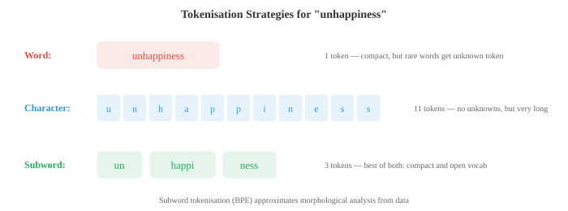
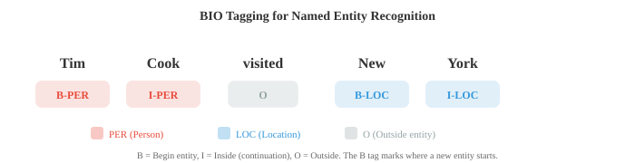

# Обработка текста и классическое НЛП

*Обработка текста преобразует необработанные символы в структурированные представления, которые могут использоваться моделями. Этот файл охватывает токенизацию (слово, подслово, BPE, WordPiece), нормализацию текста, расстояние редактирования, TF-IDF, n-граммные языковые модели, теги POS, NER и анализ настроений — классический конвейер НЛП, который до сих пор лежит в основе современных систем.*

- Необработанный текст беспорядочен. Прежде чем любая модель НЛП сможет работать с языком, текст необходимо очистить, нормализовать и преобразовать в структурированное представление. Этот файл описывает конвейер от необработанных символов до функций, которые могут использовать модели, а также классические алгоритмы НЛП, которые доминировали до глубокого обучения.

- **Нормализация текста** преобразует необработанный текст в каноническую форму. Цель состоит в том, чтобы уменьшить нерелевантные вариации, чтобы «Привет», «Привет», «Привет» и «Привет» обрабатывались соответствующим образом.

- **Свертывание регистра** преобразует текст в нижний регистр. При этом «The» и «the» объединяются в один токен. Это помогает в большинстве задач, но в некоторых случаях уничтожает полезную информацию: «США» (страна) против «нас» (местоимение) или «Яблоко» (компания) против «яблоко» (фрукт).

- **Нормализация Юникода** учитывает тот факт, что один и тот же символ может быть закодирован несколькими способами. Символ «é» может представлять собой одну кодовую точку (U+00E9) или основу «e» плюс комбинированный акцент (U+0065 + U+0301). Нормализация NFC объединяет их в одну кодовую точку; НФД их разлагает. Без нормализации две одинаково выглядящие строки могут не совпадать.

- **Редактировать расстояние** измеряет разницу между двумя строками. **Расстояние Левенштейна** подсчитывает минимальное количество односимвольных вставок, удалений и замен, необходимых для преобразования одной строки в другую. «котенок» → «сидит» имеет расстояние редактирования 3 (k→s, e→i, вставьте g).

- Расстояние редактирования рассчитывается с использованием динамического программирования (мы рассмотрим его в главе «Алротим»). Определите $D[i][j]$ как расстояние между первыми символами $i$ строки $s$ и первыми символами $j$ строки $t$:

```math
D[i][j] = \begin{cases} j & \text{if } i = 0 \\ i & \text{if } j = 0 \\ D[i{-}1][j{-}1] & \text{if } s[i] = t[j] \\ 1 + \min(D[i{-}1][j], \; D[i][j{-}1], \; D[i{-}1][j{-}1]) & \text{otherwise} \end{cases}
```

- Редактируйте коррекцию правописания, нечеткое сопоставление и выравнивание последовательностей ДНК. В НЛП он используется для обработки опечаток и поиска похожих слов.

- **Токенизация** разбивает текст на отдельные единицы (токены), которые может обрабатывать модель. Это первый и, возможно, самый важный этап предварительной обработки. Выбор стратегии токенизации глубоко влияет на поведение модели.

- **Токенизация пробелов** разбивается на пробелы. Просто, но наивно: «Нью-Йорк» становится двумя токенами, «не» — одним токеном (или разделяется на «дон» и «т» в зависимости от разделителя), а в таких языках, как китайский и японский, между словами вообще нет пробелов.

– **Токенизация на основе правил** использует созданные вручную шаблоны (регулярные выражения) для обработки сокращений, знаков препинания и особых случаев. «Я» → «Я» + «м», «США». остается как один токен. Каждому языку нужны свои правила, а это трудоемко.

- **Токенизация подслов** — современное решение. Вместо разделения по границам слов он изучает словарь часто встречающихся подслов из данных. Это элегантно обрабатывает неизвестные слова: если слова «несчастье» нет в словаре, его можно разделить на «не» + «счастье» + «нес», сохраняя морфологическую структуру.



- **Кодирование парами байтов (BPE)** начинается с отдельных символов в качестве словаря. Он неоднократно находит наиболее часто встречающиеся соседние пары и объединяет их в новый токен. После достаточного количества слияний общие слова становятся отдельными токенами, а редкие слова разбиваются на частые подслова.

- Алгоритм BPE:
    1. Инициализируйте словарь со всеми отдельными символами в обучающем корпусе.
    2. Подсчитайте частоту каждой соседней пары токенов.
    3. Объединить наиболее часто встречающуюся пару в новый токен.
    4. Повторите шаги 2–3 для желаемого количества слияний (размера словаря).

- Например, начиная с «low» (5 раз), «lower» (2 раза), «new w e s t» (6 раз): наиболее часто встречающейся парой может быть «es» → слиться в «es». Затем «эс т» → «есть». Затем «новое» → «новое». Итоговый словарь содержит как полные слова, так и части подслов.- **WordPiece** (используется BERT) аналогичен BPE, но выбирает слияния на основе вероятности, а не частоты. Он объединяет пару, которая максимизирует вероятность языковой модели обучающих данных. Токены подслов, которые не начинаются с слова, имеют префикс «##» (например, «playing» → «play» + «##ing»).

- **Unigram** (используется SentencePiece) использует противоположный подход: начинает с большого словарного запаса и итеративно удаляет токены, удаление которых меньше всего снижает вероятность обучающих данных. Итоговый словарь представляет собой набор подслов, которые лучше всего объясняют корпус.

- **SentencePiece** — это независимая от языка библиотека токенизации, которая обрабатывает входные данные как необработанный поток байтов (без предварительной токенизации пробелов). Это позволяет использовать его для любого языка, в том числе без пробелов. Он реализует алгоритмы BPE и Unigram.

- Размер словаря является ключевым гиперпараметром. Типичный выбор варьируется от 30 000 до 100 000 токенов. Больший словарь означает меньшее количество токенов на последовательность (более эффективно), но большую таблицу встраивания. Меньший словарь означает больше разделений на подслова и более длинные последовательности.

- Оба метода приводят слова к базовой форме, но они различаются подходом.

- **Стемминг** отсекает суффиксы по грубым правилам. Стеммер Портера сводит «бег» к «бегу», «счастье» к «счастливому», а «учебу» к «учебе». Это быстро, но неточно: «университет» и «вселенная» происходят от «универсов», несмотря на то, что они не связаны друг с другом.

- **Лемматизация** использует словарный запас и морфологический анализ, чтобы найти истинную словарную форму (лемму). «Бег» → «бежать», «лучше» → «хорошо», «мыши» → «мышь». Для этого необходимо знать часть речи: «видел» как глагол лемматизирует «видеть», но как существительное остается «видел».

- Современная токенизация подслов в значительной степени заменила стемминг и лемматизацию в нейронном НЛП, но они остаются полезными при поиске информации и при работе с небольшими моделями или ограниченными данными.

- **Тегирование частей речи (POS)** присваивает грамматическую категорию каждому слову: существительному, глаголу, прилагательному, определителю и т. д. Это одна из старейших задач НЛП, имеющая фундаментальное значение для синтаксического анализа.

- Набор тегов Penn Treebank является наиболее распространенным для английского языка и включает 36 тегов (NN для существительного в единственном числе, NNS для существительного во множественном числе, VB для основного глагола, VBD для прошедшего времени, JJ для прилагательного и т. д.).

- Маркировка POS-терминалов сложна, поскольку многие слова неоднозначны. «Книга» может быть существительным («книга») или глаголом («забронировать рейс»). Слово «Бег» имеет десятки значений в разных частях речи. Контекст имеет важное значение.

- Ранние тегеры использовали **Скрытые марковские модели (HMM)** из главы 05. Скрытые состояния — это POS-теги, наблюдения — это слова. Вероятности перехода фиксируют последовательности тегов (за определителем, скорее всего, следует существительное или прилагательное), а вероятности выбросов фиксируют, какие слова с какими тегами появляются. Алгоритм Витерби находит наиболее вероятную последовательность тегов.

- Модель HMM для маркировки POS:

$$\hat{t}_{1:n} = \arg\max_{t_{1:n}} \prod_{i=1}^{n} P(w_i \mid t_i) \cdot P(t_i \mid t_{i-1})$$

- Современные POS-теггеры используют нейронные сети (двунаправленные LSTM или преобразователи) и достигают точности более 97 % на английском языке, приближаясь к человеческим возможностям.

- **Распознавание названных объектов (NER)** идентифицирует и классифицирует имена собственные и другие конкретные объекты в тексте: людей, организации, места, даты, денежные суммы и т. д.

- В сообщении «Генеральный директор Apple Тим Кук объявил о мероприятии в Купертино в понедельник» система NER должна идентифицировать: Apple (ORG), Тим Кук (PER), Купертино (LOC), понедельник (ДАТА).

- NER обычно оформляется как **маркировка последовательностей** с использованием **BIO-тегов** (также называемых IOB-тегами). Каждый токен получает тег:
    - **B-TYPE**: начало объекта типа TYPE.
    - **I-TYPE**: внутри (продолжение) объекта типа TYPE.
    - **O**: вне какой-либо сущности

- «Тим Кук посетил Нью-Йорк» становится: Тим/B-PER Кук/I-PER посетил/O Нью/B-LOC Йорк/I-LOC. Тег B отмечает начало нового объекта, что важно, когда два объекта одного типа находятся рядом.



- Классический NER использовал **Условные случайные поля (CRF)** из главы 05, которые моделируют условную вероятность всей последовательности тегов с учетом входных данных. В отличие от HMM, которые являются генеративными ($P(x, y)$), CRF являются дискриминативными и напрямую моделируют $P(y \mid x)$. CRF с линейной цепочкой определяет:$$P(y_{1:n} \mid x_{1:n}) = \frac{1}{Z(x)} \exp\!\left(\sum_{i=1}^{n} \left[\sum_k \lambda_k f_k(y_i, x, i) + \sum_j \mu_j g_j(y_i, y_{i-1}, x, i)\right]\right)$$

- Здесь $f_k$ — **элементы излучения** (насколько вероятно, что тег $y_i$ будет введен в позицию $i$), а $g_j$ — **переходные элементы** (насколько вероятно, что тег $y_i$ получит предыдущий тег $y_{i-1}$). 

- Функция секционирования $Z(x) = \sum_{y'} \exp(\ldots)$ суммирует все возможные последовательности тегов для нормализации распределения. Обучение максимизирует условное логарифмическое правдоподобие, что требует эффективного вычисления $Z(x)$ с использованием прямого алгоритма (глава 05). 

- Ключевое преимущество перед независимой классификацией каждого токена: функции перехода CRF налагают структурные ограничения (например, I-PER должен следовать только за B-PER или I-PER и никогда не появляться после O). 

- Современный NER объединяет CRF поверх нейронного кодировщика (BiLSTM-CRF или BERT-CRF), где нейронная сеть выдает оценки выбросов, а уровень CRF изучает структуру перехода.

- **Синтаксический анализ** преобразует предложение в его синтаксическую структуру, либо в дерево округов, либо в дерево зависимостей (оба из файла 01).

– **Алгоритм CYK** (Кок-Янгер-Касами) анализирует предложения с контекстно-свободными грамматиками с использованием динамического программирования. 

- Требуется, чтобы грамматика была в **нормальной форме Хомского** (каждое правило имеет либо два нетерминала, либо один терминал с правой стороны). Он заполняет треугольную таблицу снизу вверх: ячейки представляют собой фрагменты предложения, и каждая ячейка хранит нетерминалы, которые могут генерировать этот интервал.

- CYK выполняется за время $O(n^3 \cdot |G|)$, где $n$ — длина предложения, а $|G|$ — размер грамматики. Это точно, но медленно для больших грамматик.

- **Разбор со сдвигом-сокращением** обрабатывает предложение слева направо, сохраняя стек. На каждом шаге он либо **смещается** (помещает следующее слово в стек), либо **уменьшает** (извлекает элементы из стека и заменяет их фразой). Обученный классификатор решает действия на каждом этапе. Это выполняется за время $O(n)$, что делает его намного быстрее, чем CYK.

- **Разбор зависимостей** на практике теперь встречается чаще, чем анализ групп. Двумя основными подходами являются анализаторы зависимостей на основе переходов (например, сдвиг-сокращение) и анализаторы на основе графов (которые оценивают все возможные ребра и находят максимальное связующее дерево). Анализаторы нейронных зависимостей, использующие BiLSTM или преобразователи, достигают самых современных результатов.

- До внедрения НЛП представляло документы в виде векторов, используя простые методы подсчета.

- Модель **мешка слов (BoW)** представляет документ как вектор количества слов, полностью игнорируя порядок слов. Если в словаре есть слова $V$, каждый документ представляет собой вектор в $\mathbb{R}^V$ (обратно соединяющийся с векторными пространствами из главы 01). Запись для слова $w$ — это количество раз, которое $w$ встречается в документе.


- BoW прост, но удивительно эффективен для таких задач, как классификация документов и фильтрация спама. Его главная слабость в том, что оно считает каждое слово одинаково важным: «тот» и «революционный» имеют одинаковый вес.

- **TF-IDF** (частота термина, обратная частоте документов) исправляет это, взвешивая слова в зависимости от их информативности. Слова, которые часто встречаются в одном документе, но редко встречаются в корпусе, вероятно, важны для этого документа.

$$\text{TF-IDF}(t, d) = \text{TF}(t, d) \times \text{IDF}(t)$$

- **Частота термина** $\text{TF}(t, d)$ часто представляет собой необработанное количество термина $t$ в документе $d$ (или его журнале: $1 + \log(\text{count})$).

- **Обратная частота документов** $\text{IDF}(t) = \log\frac{N}{|\{d : t \in d\}|}$, где $N$ — общее количество документов. Слова, встречающиеся в каждом документе (например, «the»), имеют IDF, близкий к 0. Редкие слова имеют высокий IDF.

- Векторы TF-IDF можно сравнивать с использованием косинусного сходства (из главы 01) для измерения сходства документов. Это основа классических систем поиска и поиска информации.

– **Языковая модель** присваивает вероятность последовательности слов. Он отвечает: насколько вероятно это предложение? Языковые модели играют центральную роль в машинном переводе, распознавании речи, исправлении орфографии и генерации текста.- Вероятность предложения $w_1, w_2, \ldots, w_n$ согласно цепному правилу вероятности (глава 05):

$$P(w_1, w_2, \ldots, w_n) = \prod_{i=1}^{n} P(w_i \mid w_1, \ldots, w_{i-1})$$

- Это точно, но непрактично: вам нужно будет хранить вероятности для каждой возможной истории. **Предположение Маркова** (глава 05) усекает историю до последних слов $k-1$, давая **н-граммную модель** (где $n = k$).

- Модель **bigram** ($n = 2$) выполняет условия только для предыдущего слова:

$$P(w_i \mid w_1, \ldots, w_{i-1}) \approx P(w_i \mid w_{i-1})$$

- **триграммная модель** ($n = 3$) условия для двух предыдущих слов. Вероятности N-грамм оцениваются путем подсчета в корпусе:

$$P(w_i \mid w_{i-1}) = \frac{\text{count}(w_{i-1}, w_i)}{\text{count}(w_{i-1})}$$

– **Недоумение** показывает, насколько хорошо языковая модель предсказывает набор тестов. Это обратная вероятность тестового набора, нормированная по количеству слов:

$$\text{PPL} = P(w_1, \ldots, w_N)^{-1/N} = \exp\!\left(-\frac{1}{N} \sum_{i=1}^{N} \log P(w_i \mid w_{<i})\right)$$

- Меньшая степень недоумения означает, что модель меньше «удивлена» тестовыми данными и, следовательно, лучше. Модель, которая присваивает равномерную вероятность словарю из 10 000 слов, имеет степень недоумения 10 000. Хорошая модель биграммы может достичь недоумения около 200. Современные модели нейронного языка достигают недоумения ниже 20.

- Обратите внимание, что недоумение — это возведенная в степень перекрестная энтропия (из теории информации в главе 05). Минимизация потерь перекрестной энтропии во время обучения напрямую минимизирует недоумение.

- **Сглаживание** решает проблему нулевой вероятности: если n-грамма никогда не появлялась при обучении, модель присваивает ей вероятность 0, что делает вероятность всего предложения равной 0. **Сглаживание Лапласа** (add-1) добавляет небольшой счетчик к каждой n-грамме:

$$P_{\text{Laplace}}(w_i \mid w_{i-1}) = \frac{\text{count}(w_{i-1}, w_i) + 1}{\text{count}(w_{i-1}) + V}$$

- Это слишком агрессивно для больших словарей (он крадет слишком много вероятности из наблюдаемых n-грамм). **Сглаживание Кнезера-Нея** — золотой стандарт для n-граммных моделей. Он сочетает в себе две идеи: абсолютное дисконтирование и вероятность продолжения отката.

– Во-первых, **абсолютное дисконтирование** вычитает фиксированную скидку $d$ (обычно $d \approx 0.75$) из каждого наблюдаемого количества, а не добавляет псевдосчета. Освобожденная вероятностная масса перераспределяется на невидимые n-граммы. Интерполированная форма:

$$P_{\text{KN}}(w_i \mid w_{i-1}) = \frac{\max(\text{count}(w_{i-1}, w_i) - d, \; 0)}{\text{count}(w_{i-1})} + \lambda(w_{i-1}) \cdot P_{\text{cont}}(w_i)$$

- где $\lambda(w_{i-1})$ – нормирующая константа, распределяющая дисконтированную массу. Ключевым нововведением является **вероятность продолжения** $P_{\text{cont}}(w_i)$, которая измеряет количество различных контекстов, в которых появляется $w_i$, а не то, как часто он появляется в целом:

$$P_{\text{cont}}(w_i) = \frac{|\{w' : \text{count}(w', w_i) > 0\}|}{|\{(w', w'') : \text{count}(w', w'') > 0\}|}$$

- Числитель подсчитывает, сколько отдельных слов предшествует $w_i$ в корпусе. Такое слово, как «Франциско», встречается в нескольких контекстах (почти всегда после «Сан»), поэтому даже если «Сан-Франциско» встречается очень часто, «Франциско» имеет низкую вероятность продолжения и не будет ложно предсказано в других контекстах. 

- И наоборот, общие слова, такие как «the», появляются после многих разных слов и имеют высокую вероятность продолжения. Это отражает интуитивное понимание того, что универсальность слова имеет большее значение, чем его исходная частота для оценки задержки.

- Модели N-грамм были новейшим достижением на протяжении десятилетий. Они быстрые, интерпретируемые и не требуют никакого обучения (просто подсчет). Но они борются с долгосрочными зависимостями («Ключи, которые я оставил на столе, **отсутствуют**», требуют знания того, что подлежащее «ключи» стоит во множественном числе, что далеко от глагола). Модели нейронного языка, начиная с RNN и заканчивая преобразователями, устраняют это ограничение.

## Задачи по кодированию (используйте CoLab или блокнот)

1. Реализуйте расстояние редактирования Левенштейна с помощью динамического программирования. Проверьте его на парах слов и используйте для простой коррекции орфографии.
```python
import jax.numpy as jnp

def edit_distance(s, t):
    """Compute Levenshtein edit distance using DP."""
    m, n = len(s), len(t)
    D = [[0] * (n + 1) for _ in range(m + 1)]

    for i in range(m + 1):
        D[i][0] = i
    for j in range(n + 1):
        D[0][j] = j

    for i in range(1, m + 1):
        for j in range(1, n + 1):
            if s[i-1] == t[j-1]:
                D[i][j] = D[i-1][j-1]
            else:
                D[i][j] = 1 + min(D[i-1][j], D[i][j-1], D[i-1][j-1])

    return D[m][n]

# Test
pairs = [("kitten", "sitting"), ("sunday", "saturday"), ("hello", "hallo")]
for s, t in pairs:
    print(f"d('{s}', '{t}') = {edit_distance(s, t)}")

# Simple spelling correction
dictionary = ["the", "their", "there", "then", "than", "this", "that", "these", "those"]
misspelled = "thier"
corrections = sorted(dictionary, key=lambda w: edit_distance(misspelled, w))
print(f"\nClosest to '{misspelled}': {corrections[:3]}")
```

2. Внедрить токенизацию BPE с нуля. Начните с токенов уровня персонажа и итеративно объединяйте наиболее часто встречающиеся пары.
```python
from collections import Counter

def get_pairs(corpus):
    """Count adjacent token pairs across all words."""
    pairs = Counter()
    for word, freq in corpus.items():
        symbols = word.split()
        for i in range(len(symbols) - 1):
            pairs[(symbols[i], symbols[i+1])] += freq
    return pairs

def merge_pair(pair, corpus):
    """Merge all occurrences of a pair in the corpus."""
    new_corpus = {}
    bigram = ' '.join(pair)
    replacement = ''.join(pair)
    for word, freq in corpus.items():
        new_word = word.replace(bigram, replacement)
        new_corpus[new_word] = freq
    return new_corpus

# Training corpus with word frequencies
text = "low low low low low lower lower newest newest newest newest newest newest"
word_freqs = Counter(text.split())
# Initialise: split each word into characters with end-of-word marker
corpus = {' '.join(word) + ' _': freq for word, freq in word_freqs.items()}

print("Initial corpus:")
for word, freq in corpus.items():
    print(f"  {word}: {freq}")

# Run BPE for 10 merges
for i in range(10):
    pairs = get_pairs(corpus)
    if not pairs:
        break
    best_pair = max(pairs, key=pairs.get)
    corpus = merge_pair(best_pair, corpus)
    print(f"\nMerge {i+1}: {best_pair} (freq={pairs[best_pair]})")
    for word, freq in corpus.items():
        print(f"  {word}: {freq}")
```

3. Постройте языковую модель биграммы и вычислите степень недоумения в тестовом предложении. Поэкспериментируйте со сглаживанием по Лапласу.
```python
from collections import Counter, defaultdict
import math

# Training corpus
train = """the cat sat on the mat . the dog chased the cat .
the cat ran from the dog . a dog sat on a mat .""".split()

# Count bigrams and unigrams
bigrams = Counter(zip(train[:-1], train[1:]))
unigrams = Counter(train)
vocab_size = len(set(train))

def bigram_prob(w2, w1, alpha=0):
    """P(w2 | w1) with optional Laplace smoothing."""
    return (bigrams[(w1, w2)] + alpha) / (unigrams[w1] + alpha * vocab_size)

# Compute perplexity
test = "the cat sat on a mat .".split()

for alpha in [0, 1, 0.1]:
    log_prob = 0
    for w1, w2 in zip(test[:-1], test[1:]):
        p = bigram_prob(w2, w1, alpha=alpha)
        if p > 0:
            log_prob += math.log(p)
        else:
            log_prob += float('-inf')

    ppl = math.exp(-log_prob / (len(test) - 1)) if log_prob > float('-inf') else float('inf')
    print(f"Smoothing α={alpha}: perplexity = {ppl:.2f}")
```

4. Реализуйте TF-IDF с нуля и используйте косинусное сходство, чтобы найти документ, наиболее похожий на запрос.
```python
import jax.numpy as jnp
import math
from collections import Counter

documents = [
    "the cat sat on the mat",
    "the dog chased the cat around the park",
    "a mat was placed on the floor by the door",
    "the quick brown fox jumped over the lazy dog",
]

# Build vocabulary
vocab = sorted(set(word for doc in documents for word in doc.split()))
word_to_idx = {w: i for i, w in enumerate(vocab)}
V = len(vocab)
N = len(documents)

# Compute TF-IDF matrix
doc_freq = Counter()
for doc in documents:
    for word in set(doc.split()):
        doc_freq[word] += 1

tfidf_matrix = jnp.zeros((N, V))
for i, doc in enumerate(documents):
    word_counts = Counter(doc.split())
    for word, count in word_counts.items():
        tf = 1 + math.log(count)
        idf = math.log(N / doc_freq[word])
        j = word_to_idx[word]
        tfidf_matrix = tfidf_matrix.at[i, j].set(tf * idf)

# Query
query = "cat on the mat"
query_vec = jnp.zeros(V)
query_counts = Counter(query.split())
for word, count in query_counts.items():
    if word in word_to_idx:
        tf = 1 + math.log(count)
        idf = math.log(N / doc_freq.get(word, 1))
        query_vec = query_vec.at[word_to_idx[word]].set(tf * idf)

# Cosine similarity (from chapter 01)
def cosine_sim(a, b):
    return jnp.dot(a, b) / (jnp.linalg.norm(a) * jnp.linalg.norm(b) + 1e-8)

print(f"Query: '{query}'\n")
for i, doc in enumerate(documents):
    sim = cosine_sim(query_vec, tfidf_matrix[i])
    print(f"  Doc {i} (sim={sim:.3f}): '{doc}'")
```