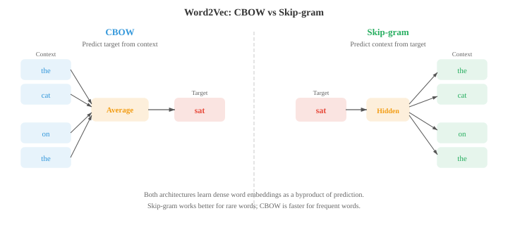
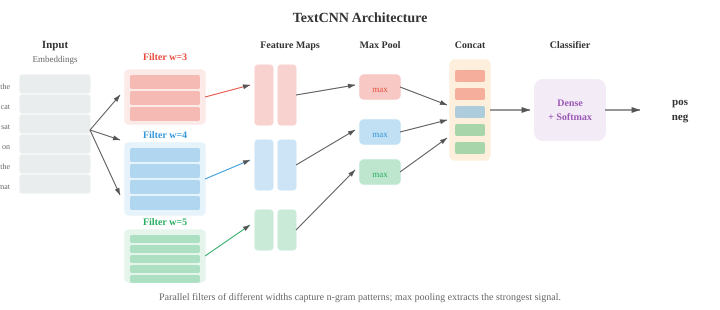

# Вложения и модели последовательностей

*Встраивание слов сжимает разреженный символический текст в плотные векторные пространства, где семантическое сходство становится геометрической близостью. Этот файл охватывает Word2Vec (CBOW, Skip-gram), GloVe, FastText, RNN, LSTM, GRU, seq2seq с вниманием, а также парадигму кодировщика-декодера, переход от набора слов к контекстным представлениям.*

- В файле 01 мы представили гипотезу распределения: слова, встречающиеся в схожем контексте, обычно имеют схожее значение. В файле 02 мы представили текст, используя редкие, созданные вручную элементы, такие как векторы TF-IDF. Эти векторы живут в очень многомерных пространствах (одно измерение на каждое словарное слово) и в большинстве случаев имеют нулевое значение. **Внедрение слов** сжимает эту информацию в плотные, низкоразмерные векторы, которые фиксируют семантические отношения и извлекаются непосредственно из данных.

- **Word2Vec** (Миколов и др., 2013) изучает встраивание слов путем обучения мелкой нейронной сети решению простой задачи прогнозирования. Есть две архитектуры.

- Модель **Непрерывный мешок слов (CBOW)** предсказывает целевое слово на основе окружающих его контекстных слов. Учитывая окно контекстных слов (например, «кот ___ на»), модель усредняет их векторы внедрения и передает результат через линейный слой, чтобы предсказать пропущенное слово («Сат»). Целью обучения является максимальное:

$$P(w_t \mid w_{t-k}, \ldots, w_{t-1}, w_{t+1}, \ldots, w_{t+k})$$

- Модель **Пропустить грамму** делает обратное: по заданному слову предсказывает окружающие слова контекста. Для целевого слова «Сат» модель пытается предсказать «the», «cat», «on», «the» в отдельных прогнозах. Цель максимизирует:

$$P(w_{t+j} \mid w_t) \quad \text{for each } j \in [-k, k], \; j \neq 0$$



- Пропускная грамма лучше работает с редкими словами, поскольку каждое слово генерирует несколько обучающих примеров (по одному на каждую позицию контекста). CBOW работает быстрее и немного лучше для часто встречающихся слов, поскольку усредняет несколько контекстных сигналов.

- Обучение полному словарному запасу обходится дорого, поскольку знаменатель softmax суммируется по всем словам $V$. **Отрицательная выборка** приближает это, превращая проблему в двоичную классификацию: отличайте истинное контекстное слово (положительная выборка) от случайно выбранных шумовых слов (отрицательные выборки). Вместо вычисления полного softmax модель обновляет только вложения для цели, истинного контекстного слова и нескольких негативов:

$$\mathcal{L} = \log \sigma(v_{w_O}^T v_{w_I}) + \sum_{i=1}^{k} \mathbb{E}_{w_i \sim P_n} [\log \sigma(-v_{w_i}^T v_{w_I})]$$

- Здесь $v_{w_I}$ — это встраивание входного слова, $v_{w_O}$ — это встраивание выходного (контекстного) слова, а $P_n$ — это распределение шума, обычно частота униграмм, возведенная в степень 3/4 (что снижает вес очень частых слов, таких как «the»).

- Почему эта простая цель приводит к значимым вложениям? Леви и Голдберг (2014) показали, что скип-грамма с отрицательной выборкой неявно факторизует **сдвинутую поточечно матрицу взаимной информации (PMI)**. При сходимости скалярное произведение двух векторов слов приближается:

$$v_w^T v_c \approx \text{PMI}(w, c) - \log k$$

- где $\text{PMI}(w, c) = \log \frac{P(w, c)}{P(w) P(c)}$ измеряет, насколько более вероятно, что слова $w$ и $c$ встречаются случайно, чем ожидалось (глава 05 теория информации), а $k$ - количество отрицательных образцов. Слова, которые встречаются гораздо чаще, чем случайно, имеют высокий PMI и, следовательно, высокое скалярное произведение (подобные вложения). Слова, которые встречаются реже, чем ожидалось, имеют отрицательный PMI и разные вложения. Это показывает, что Word2Vec делает то же самое, что и классические методы распределительной семантики, такие как латентный семантический анализ (SVD на матрицах совпадения), но в более масштабируемом онлайн-режиме.

- Самым удивительным свойством вложений Word2Vec является то, что они фиксируют **аналогии** посредством векторной арифметики. Вектор $v_{\text{king}} - v_{\text{man}} + v_{\text{woman}}$ наиболее близок к $v_{\text{queen}}$. Это работает, поскольку пространство внедрения кодирует семантические отношения как приблизительно линейные направления: направление «роялти» примерно равно $v_{\text{king}} - v_{\text{man}}$, и добавление его к $v_{\text{woman}}$ приводит к появлению рядом с $v_{\text{queen}}$. Это связано с линейной алгеброй из главы 01: семантические отношения представляют собой векторные переводы.- **GloVe** (Global Vectors for Word Representation, Pennington et al., 2014) использует другой подход. Вместо обучения по одному из окон локального контекста он создает глобальную матрицу совпадения слов $X$, где $X_{ij}$ подсчитывает, как часто слово $j$ появляется в контексте слова $i$ во всем корпусе. Затем модель изучает вложения, скалярное произведение которых аппроксимирует логарифмическое совпадение:

$$w_i^T \tilde{w}_j + b_i + \tilde{b}_j = \log X_{ij}$$

- Функция потерь взвешивает каждую пару с помощью функции ограничения $f(X_{ij})$, которая предотвращает доминирование очень частых совпадений:

$$\mathcal{L} = \sum_{i,j=1}^{V} f(X_{ij}) \left(w_i^T \tilde{w}_j + b_i + \tilde{b}_j - \log X_{ij}\right)^2$$

- GloVe сочетает в себе преимущества глобальной матричной факторизации (например, скрытого семантического анализа) с изучением локального контекста Word2Vec. На практике GloVe и Word2Vec создают встраивания одинакового качества.

- **FastText** (Bojanowski et al., 2017) расширяет пропускную грамму, представляя каждое слово как набор символьных n-грамм. Слово «где» с $n = 3$ становится: «<wh", "whe", "her", "ere", "re>» плюс токен целого слова «<where>». Вложение слова представляет собой сумму всех его вложений в n-граммы.

- Это имеет решающее преимущество: FastText может создавать вставки для слов, которые он никогда не видел во время обучения. Слово «местонахождение» имеет те же n-граммы, что и «где», поэтому его встраивание будет разумным, даже если «местонахождение» никогда не появлялось в обучающих данных. Это особенно полезно для морфологически богатых языков (файл 01), где слова имеют множество изменяемых форм.

- **Встроенная оценка** обычно использует два типа контрольных показателей. **Задачи по аналогии** проверяют, соответствует ли $v_a - v_b + v_c \approx v_d$ (например, «Париж» $-$ «Франция» $+$ «Италия» $\approx$ «Рим»). **Эталоны сходства** сравнивают косинусное сходство (глава 01) между парами слов с человеческими суждениями. Общие наборы данных включают WordSim-353, SimLex-999 и набор тестов по аналогии Google. Практическое предостережение: встраивания, которые превосходны в аналогиях, могут быть не лучшими для последующих задач, таких как классификация настроений. Лучшая оценка часто — это сама задача.

- В главе 06 мы представили RNN, LSTM и GRU как архитектуры для последовательных данных. Здесь мы сосредоточимся на том, как они применяются конкретно к языковым задачам.

- **Языковая модель RNN** считывает токены по одному и прогнозирует следующий токен на каждом этапе. Скрытое состояние $h_t$ сжимает всю историю $w_1, \ldots, w_t$ в вектор фиксированного размера, а линейный слой плюс softmax отображает $h_t$ в распределение по словарю. При обучении используется перекрестная энтропийная потеря по отношению к истинному следующему токену, что идентично минимизации недоумения (файл 02). Ключевое ограничение: скрытое состояние фиксированного размера должно кодировать всю историю, а информация из ранних токенов постепенно перезаписывается.

- **Двунаправленные RNN** обрабатывают последовательность в обоих направлениях: один RNN читает слева направо, другой читает справа налево. В каждой позиции $t$ прямое скрытое состояние $\overrightarrow{h}_t$ и обратное скрытое состояние $\overleftarrow{h}_t$ объединяются, образуя контекстно-зависимое представление $h_t = [\overrightarrow{h}_t ; \overleftarrow{h}_t]$. Это дает модели доступ как к прошлому, так и к будущему контексту, что полезно для таких задач, как маркировка POS и NER (файл 02), где метка слова зависит от слов как до, так и после него. Двунаправленные RNN нельзя использовать для языкового моделирования, поскольку вы не можете просмотреть будущие токены при их прогнозировании.


- **RNN с глубоким стекированием** размещают несколько слоев RNN друг над другом. Скрытые состояния слоя $l$ на всех временных шагах становятся входной последовательностью для слоя $l + 1$. Объединение 2–4 слоев обычно повышает производительность за счет построения иерархических представлений, аналогично тому, как более глубокие CNN создают иерархии объектов (глава 06). За пределами четырех слоев исчезающие градиенты и переобучение становятся проблемами, если между слоями не добавляются остаточные связи.- Архитектура **последовательность-последовательность (seq2seq)** (Sutskever et al., 2014) сопоставляет входную последовательность переменной длины с выходной последовательностью переменной длины. Он состоит из **кодировщика** RNN, который считывает входные данные и сжимает их в вектор контекста (конечное скрытое состояние), и **декодера** RNN, который генерирует выходные данные по одному токену за раз в зависимости от этого вектора контекста.


— Seq2seq стала прорывной архитектурой для машинного перевода. Кодер считывает предложение на французском языке, декодер производит перевод на английский язык. Декодер начинается со специального токена начала последовательности и генерирует токены авторегрессионно, пока не создаст токен конца последовательности. Практический трюк: изменение входной последовательности на противоположное (подача «chat le» вместо «lechat») улучшило результаты, поскольку первое входное слово располагалось ближе к первому выходному слову в графе вычислений, сокращая путь градиента.

- Проблема узкого места: весь ввод должен быть сжат в один вектор фиксированного размера. Для длинных предложений этот вектор не может уловить всю информацию, и производительность снижается. Это мотивировало **механизмы внимания**.

- В главе 06 представлена ​​современная формулировка внимания Q, K, V. Первоначальные механизмы внимания для НЛП были сформулированы по-другому: модели согласования между состояниями кодера и декодера.

- **Внимание Багданау** (аддитивное внимание, Багданау и др., 2015) вычисляет показатель выравнивания между скрытым состоянием декодера $s_t$ и каждым скрытым состоянием кодера $h_i$ с использованием обученной сети прямой связи:

$$e_{ti} = v^T \tanh(W_s s_{t-1} + W_h h_i)$$

- Оценки нормализуются по весам внимания с помощью softmax, а вектор контекста представляет собой взвешенную сумму состояний кодера:

$$\alpha_{ti} = \frac{\exp(e_{ti})}{\sum_j \exp(e_{tj})}, \quad c_t = \sum_i \alpha_{ti} h_i$$

- Затем декодер использует $s_{t-1}$ и $c_t$ для создания следующего вывода. Ключевая идея: вместо одного фиксированного вектора контекста для всего предложения каждый шаг декодера получает различную взвешенную комбинацию состояний кодера, что позволяет модели «оглянуться назад» на соответствующие части входных данных.

- **Внимание Луонг** (мультипликативное внимание, Луонг и др., 2015) упрощает подсчет баллов. Вариант **точка** использует $e_{ti} = s_t^T h_i$. В варианте **general** используется $e_{ti} = s_t^T W h_i$. Они быстрее, чем аддитивная оценка Богданау, потому что они используют матричное умножение вместо сети прямой связи. Luong Attention также вычисляет вектор контекста на основе текущего состояния декодера $s_t$ (а не $s_{t-1}$), что дает ему доступ к большему количеству информации, но делает вычисления немного другими.


- Веса внимания часто визуализируются в виде тепловых карт, показывающих, на каких входных токенах фокусируется декодер при создании каждого выходного токена. При переводе эти тепловые карты примерно отслеживают выравнивание слов между исходным и целевым языками, при этом диагональный рисунок нарушается переупорядочением (например, порядок прилагательных и существительных различается во французском и английском языках).

- Во время вывода декодер должен выбирать токен на каждом этапе. **Жадное декодирование** выбирает токен с наибольшей вероятностью в каждой позиции, но это может привести к неоптимальным последовательностям: локально хороший выбор может привести к тому, что модель станет глобально плохим предложением. **Поиск луча** сохраняет верхние частичные последовательности $k$ (ширина луча) на каждом шаге, расширяя каждый из них на все возможные последующие токены и сохраняя лучший $k$ в целом.

- При ширине луча $k = 1$ поиск луча сводится к жадному декодированию. Типичные значения: от $k = 4$ до $k = 10$. Лучи большего размера находят лучшие последовательности, но пропорционально медленнее. Лучевой поиск также требует **нормализации длины**, чтобы избежать предпочтения более коротких последовательностей, которые, естественно, имеют более высокую общую вероятность, поскольку они умножают меньше терминов. Нормализованный балл:

$$\text{score}(y) = \frac{1}{|y|^\alpha} \sum_{t=1}^{|y|} \log P(y_t \mid y_{<t})$$- где $|y|$ — длина последовательности, а $\alpha$ (обычно 0,6–0,7) контролирует силу штрафа за длину. При использовании $\alpha = 0$ нормализация длины отсутствует. Для $\alpha = 1$ оценка представляет собой логарифмическую вероятность для каждого токена (среднее геометрическое). Промежуточное значение балансирует между предпочтением кратких результатов и отсутствием слишком раннего усечения.

- В то время как RNN обрабатывают текст последовательно, **1D CNN** обрабатывают его параллельно, перемещая фильтры по последовательности токенов. Каждый фильтр обнаруживает локальный шаблон (характеристику n-граммы).

- **TextCNN** (Ким, 2014) применяет несколько одномерных сверточных фильтров разной ширины (например, 3, 4, 5 токенов) к входной матрице внедрения. Каждый фильтр создает карту объектов, а **пулирование по максимуму во времени** берет одно максимальное значение из каждой карты объектов, фиксируя, был ли обнаружен шаблон где-либо в тексте, независимо от положения. Объединенные функции из всех фильтров объединяются и передаются в классификатор.



- TextCNN быстр и удивительно эффективен для задач классификации текста, таких как анализ настроений. Он фиксирует локальные шаблоны n-грамм, но не может моделировать долгосрочные зависимости: фильтр шириной 5 видит только 5 последовательных токенов. **Расширенные причинные извилины** решают эту проблему, вставляя промежутки (расширения) между элементами фильтра. Объединение слоев с экспоненциально возрастающей скоростью расширения (1, 2, 4, 8,...) экспоненциально увеличивает восприимчивое поле без увеличения параметров, что позволяет модели фиксировать зависимости между сотнями токенов.

- Все обсуждавшиеся до сих пор встраивания (Word2Vec, GloVe, FastText) создают один вектор для каждого типа слова независимо от контекста. «Банк» имеет одинаковое значение, независимо от того, означает ли он финансовое учреждение или берег реки. Это фундаментальное ограничение, которое устраняют **контекстные встраивания**.

- **ELMo** (Embeddings from Language Models, Peters et al., 2018) создает контекстные представления слов, запуская глубокую двунаправленную языковую модель LSTM для входного текста. Прямой LSTM прогнозирует следующее слово в каждой позиции; отдельный обратный LSTM предсказывает предыдущее слово. Оба обучаются на языковых моделях в больших корпусах.

- В каждой позиции $k$ ELMo объединяет скрытые состояния всех слоев $L$, используя изученные веса для конкретной задачи:

$$\text{ELMo}_k = \gamma \sum_{j=0}^{L} s_j \, h_{k,j}$$

- Здесь $h_{k,j}$ — это скрытое состояние в позиции $k$ и слое $j$ (слой 0 — это встраивание необработанного токена), $s_j$ — это скалярные веса, нормализованные по softmax, а $\gamma$ — это специфическая задача. коэффициент масштабирования. Разные уровни собирают разную информацию: нижние уровни собирают синтаксис (теги POS, морфологию слов), верхние уровни собирают семантику (смысл слова, семантическую роль). Смешивая все слои с изученными весами, встраивания ELMo адаптируются к различным последующим задачам.

- ELMo положил начало парадигме **предварительная подготовка, затем точная настройка**: обучение большой языковой модели на массивном неразмеченном тексте, а затем использование ее представлений для последующих задач. ELMo специально использует предварительно обученные представления в качестве фиксированных или слегка настраиваемых функций, которые объединяются с входными данными для конкретной задачи. BERT и GPT (файл 04) продвигают эту идею дальше, настраивая всю модель от начала до конца, что оказывается значительно более эффективным.

- Переход от Word2Vec к ELMo иллюстрирует повторяющуюся тему в НЛП: переход от статических представлений к динамическим, от локального контекста к глобальному и от поверхностных моделей к глубоким. Каждый шаг меняет вычислительные затраты на более богатые представления. Трансформаторы (файл 04) завершают этот прогресс, полностью заменяя повторение вниманием, обеспечивая как глубокую контекстуализацию, так и параллельные вычисления.

## Задачи по кодированию (используйте CoLab или блокнот)

1. Внедрить пропущенную грамму Word2Vec с отрицательной выборкой с нуля. Тренируйтесь на небольшом корпусе и визуализируйте изученные вложения с помощью PCA.
```python
import jax
import jax.numpy as jnp
import matplotlib.pyplot as plt

# Small corpus
corpus = """the king ruled the kingdom . the queen ruled the kingdom .
the prince is the son of the king . the princess is the daughter of the queen .
a man worked in the castle . a woman worked in the castle .
the king and queen lived in the castle . the prince and princess played outside .""".lower().split()

vocab = sorted(set(corpus))
word2idx = {w: i for i, w in enumerate(vocab)}
idx2word = {i: w for w, i in word2idx.items()}
V = len(vocab)

# Generate skip-gram pairs with window size 2
window = 2
pairs = []
for i, word in enumerate(corpus):
    for j in range(max(0, i - window), min(len(corpus), i + window + 1)):
        if i != j:
            pairs.append((word2idx[word], word2idx[corpus[j]]))

pairs = jnp.array(pairs)
print(f"Vocabulary: {V} words, Training pairs: {len(pairs)}")

# Model parameters
embed_dim = 16
key = jax.random.PRNGKey(42)
k1, k2 = jax.random.split(key)
W_in = jax.random.normal(k1, (V, embed_dim)) * 0.1    # input embeddings
W_out = jax.random.normal(k2, (V, embed_dim)) * 0.1   # output embeddings

# Negative sampling loss for one pair
def neg_sampling_loss(W_in, W_out, target, context, neg_ids):
    v_in = W_in[target]      # (embed_dim,)
    v_out = W_out[context]   # (embed_dim,)
    v_neg = W_out[neg_ids]   # (k, embed_dim)

    pos_loss = -jax.nn.log_sigmoid(jnp.dot(v_in, v_out))
    neg_loss = -jnp.sum(jax.nn.log_sigmoid(-v_neg @ v_in))
    return pos_loss + neg_loss

# Training loop
num_neg = 5
lr = 0.05

@jax.jit
def train_step(W_in, W_out, target, context, neg_ids):
    loss, (g_in, g_out) = jax.value_and_grad(neg_sampling_loss, argnums=(0, 1))(
        W_in, W_out, target, context, neg_ids)
    return loss, W_in - lr * g_in, W_out - lr * g_out

key = jax.random.PRNGKey(0)
for epoch in range(50):
    total_loss = 0.0
    for i in range(len(pairs)):
        key, subkey = jax.random.split(key)
        neg_ids = jax.random.randint(subkey, (num_neg,), 0, V)
        loss, W_in, W_out = train_step(W_in, W_out, pairs[i, 0], pairs[i, 1], neg_ids)
        total_loss += loss
    if (epoch + 1) % 10 == 0:
        print(f"Epoch {epoch+1}: avg loss = {total_loss / len(pairs):.4f}")

# Visualise with PCA (chapter 01)
embeddings = W_in
mean = embeddings.mean(axis=0)
centered = embeddings - mean
U, S, Vt = jnp.linalg.svd(centered, full_matrices=False)
coords = centered @ Vt[:2].T  # project onto top 2 PCs

plt.figure(figsize=(10, 8))
for i, word in idx2word.items():
    plt.scatter(coords[i, 0], coords[i, 1], c='#3498db', s=40)
    plt.annotate(word, (coords[i, 0] + 0.02, coords[i, 1] + 0.02), fontsize=9)
plt.title("Word2Vec Skip-gram Embeddings (PCA projection)")
plt.grid(alpha=0.3); plt.show()
```

2. Создайте языковую модель RNN на уровне символов, которая учится генерировать текст из небольшой обучающей строки.
```python
import jax
import jax.numpy as jnp

# Tiny training text
text = "to be or not to be that is the question "
chars = sorted(set(text))
char2idx = {c: i for i, c in enumerate(chars)}
idx2char = {i: c for c, i in char2idx.items()}
V = len(chars)
data = jnp.array([char2idx[c] for c in text])

# RNN parameters
hidden_dim = 64
key = jax.random.PRNGKey(0)
k1, k2, k3, k4, k5 = jax.random.split(key, 5)

params = {
    'Wx': jax.random.normal(k1, (V, hidden_dim)) * 0.1,
    'Wh': jax.random.normal(k2, (hidden_dim, hidden_dim)) * 0.05,
    'bh': jnp.zeros(hidden_dim),
    'Wy': jax.random.normal(k3, (hidden_dim, V)) * 0.1,
    'by': jnp.zeros(V),
}

def rnn_step(params, h, x_idx):
    x = jnp.eye(V)[x_idx]  # one-hot
    h = jnp.tanh(x @ params['Wx'] + h @ params['Wh'] + params['bh'])
    logits = h @ params['Wy'] + params['by']
    return h, logits

def loss_fn(params, inputs, targets):
    h = jnp.zeros(hidden_dim)
    total_loss = 0.0
    for t in range(len(inputs)):
        h, logits = rnn_step(params, h, inputs[t])
        log_probs = jax.nn.log_softmax(logits)
        total_loss -= log_probs[targets[t]]
    return total_loss / len(inputs)

grad_fn = jax.jit(jax.grad(loss_fn))

# Training
inputs = data[:-1]
targets = data[1:]
lr = 0.01

for step in range(500):
    grads = grad_fn(params, inputs, targets)
    params = {k: params[k] - lr * grads[k] for k in params}
    if (step + 1) % 100 == 0:
        l = loss_fn(params, inputs, targets)
        print(f"Step {step+1}: loss = {l:.4f}")

# Generate text
def generate(params, seed_char, length=60):
    h = jnp.zeros(hidden_dim)
    idx = char2idx[seed_char]
    result = [seed_char]
    key = jax.random.PRNGKey(42)
    for _ in range(length):
        h, logits = rnn_step(params, h, idx)
        key, subkey = jax.random.split(key)
        idx = jax.random.categorical(subkey, logits)
        result.append(idx2char[int(idx)])
    return ''.join(result)

print(f"\nGenerated: {generate(params, 't')}")
```3. Реализуйте игрушечную модель seq2seq с вниманием Багданау к изменению последовательности. Визуализируйте матрицу выравнивания внимания.
```python
import jax
import jax.numpy as jnp
import matplotlib.pyplot as plt

# Task: reverse a sequence of digits (e.g., [3, 1, 4] -> [4, 1, 3])
vocab_size = 10  # digits 0-9
SOS, EOS = 10, 11  # special tokens
total_vocab = 12
embed_dim, hidden_dim = 16, 32
max_len = 5

key = jax.random.PRNGKey(42)
keys = jax.random.split(key, 8)

params = {
    'embed': jax.random.normal(keys[0], (total_vocab, embed_dim)) * 0.1,
    'enc_Wx': jax.random.normal(keys[1], (embed_dim, hidden_dim)) * 0.1,
    'enc_Wh': jax.random.normal(keys[2], (hidden_dim, hidden_dim)) * 0.05,
    'dec_Wx': jax.random.normal(keys[3], (embed_dim, hidden_dim)) * 0.1,
    'dec_Wh': jax.random.normal(keys[4], (hidden_dim, hidden_dim)) * 0.05,
    # Bahdanau attention
    'Ws': jax.random.normal(keys[5], (hidden_dim, hidden_dim)) * 0.1,
    'Wh_att': jax.random.normal(keys[6], (hidden_dim, hidden_dim)) * 0.1,
    'v_att': jax.random.normal(keys[7], (hidden_dim,)) * 0.1,
    # Output projection (from hidden + context to vocab)
    'Wo': jax.random.normal(keys[0], (hidden_dim * 2, total_vocab)) * 0.1,
}

def encode(params, seq):
    """Encode input sequence, return all hidden states."""
    h = jnp.zeros(hidden_dim)
    states = []
    for t in range(len(seq)):
        x = params['embed'][seq[t]]
        h = jnp.tanh(x @ params['enc_Wx'] + h @ params['enc_Wh'])
        states.append(h)
    return jnp.stack(states), h

def bahdanau_attention(params, dec_state, enc_states):
    """Compute Bahdanau attention weights and context vector."""
    scores = jnp.tanh(enc_states @ params['Wh_att'] + dec_state @ params['Ws'])
    e = scores @ params['v_att']  # (src_len,)
    alpha = jax.nn.softmax(e)
    context = alpha @ enc_states
    return context, alpha

def decode_step(params, dec_h, prev_token, enc_states):
    x = params['embed'][prev_token]
    dec_h = jnp.tanh(x @ params['dec_Wx'] + dec_h @ params['dec_Wh'])
    context, alpha = bahdanau_attention(params, dec_h, enc_states)
    combined = jnp.concatenate([dec_h, context])
    logits = combined @ params['Wo']
    return dec_h, logits, alpha

def seq2seq_loss(params, src, tgt):
    enc_states, enc_final = encode(params, src)
    dec_h = enc_final
    loss = 0.0
    prev_token = SOS
    for t in range(len(tgt)):
        dec_h, logits, _ = decode_step(params, dec_h, prev_token, enc_states)
        log_probs = jax.nn.log_softmax(logits)
        loss -= log_probs[tgt[t]]
        prev_token = tgt[t]
    return loss / len(tgt)

# Generate training data: reverse sequences
key = jax.random.PRNGKey(0)
train_srcs, train_tgts = [], []
for _ in range(200):
    key, subkey = jax.random.split(key)
    length = jax.random.randint(subkey, (), 3, max_len + 1)
    key, subkey = jax.random.split(key)
    seq = jax.random.randint(subkey, (int(length),), 0, vocab_size)
    train_srcs.append(seq)
    train_tgts.append(seq[::-1])  # reverse

# Training
grad_fn = jax.grad(seq2seq_loss)
lr = 0.01

for epoch in range(100):
    total_loss = 0.0
    for src, tgt in zip(train_srcs, train_tgts):
        grads = grad_fn(params, src, tgt)
        params = {k: params[k] - lr * grads[k] for k in params}
        total_loss += seq2seq_loss(params, src, tgt)
    if (epoch + 1) % 20 == 0:
        print(f"Epoch {epoch+1}: avg loss = {total_loss / len(train_srcs):.4f}")

# Visualise attention for one example
test_src = jnp.array([3, 1, 4, 1, 5])
test_tgt = test_src[::-1]

enc_states, enc_final = encode(params, test_src)
dec_h = enc_final
attentions = []
prev_token = SOS
for t in range(len(test_tgt)):
    dec_h, logits, alpha = decode_step(params, dec_h, prev_token, enc_states)
    attentions.append(alpha)
    prev_token = test_tgt[t]

att_matrix = jnp.stack(attentions)
fig, ax = plt.subplots(figsize=(6, 5))
im = ax.imshow(att_matrix, cmap='Blues')
ax.set_xlabel("Source position"); ax.set_ylabel("Target position")
src_labels = [str(int(x)) for x in test_src]
tgt_labels = [str(int(x)) for x in test_tgt]
ax.set_xticks(range(len(src_labels))); ax.set_xticklabels(src_labels)
ax.set_yticks(range(len(tgt_labels))); ax.set_yticklabels(tgt_labels)
for i in range(len(tgt_labels)):
    for j in range(len(src_labels)):
        ax.text(j, i, f"{att_matrix[i,j]:.2f}", ha='center', va='center', fontsize=9)
ax.set_title("Bahdanau Attention Alignment (sequence reversal)")
plt.colorbar(im); plt.tight_layout(); plt.show()
```