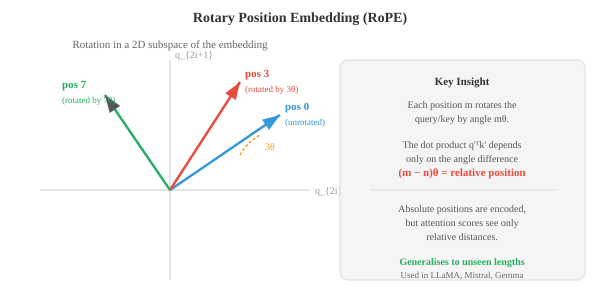
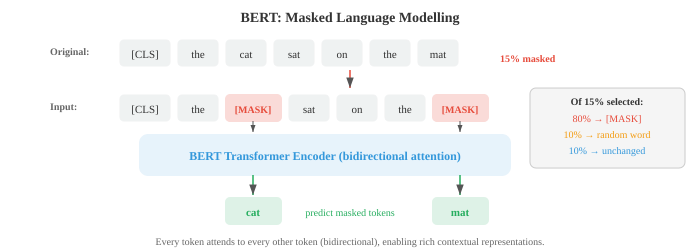

# Трансформеры и языковые модели

*Трансформеры заменили повторяемость вниманием к себе и стали доминирующей архитектурой понимания и генерации языка. В этом файле описаны BERT, GPT, T5, позиционные кодировки (синусоидальные, RoPE), цели предварительной подготовки (MLM, CLM), точная настройка, быстрое проектирование и законы масштабирования — основа современных LLM.*

- В главе 06 мы представили архитектуру Transformer: самообслуживание, многоголовое внимание, позиционное кодирование и структуру кодера-декодера. Здесь мы сосредоточимся на том, как преобразователи адаптируются к конкретным парадигмам НЛП, на моделях, которые определили современное НЛП (BERT, GPT, T5), и на методах, которые делают их практичными в масштабе.

- Вспомните основную операцию: **масштабированное скалярное произведение** вычисляет $\text{softmax}(QK^T / \sqrt{d_k}) V$, где запросы, ключи и значения являются линейными проекциями входных данных. **Многоголовое внимание** запускает $h$ параллельные головы внимания, каждая из которых имеет разные изученные проекции, и объединяет результаты. Блок Трансформатор дополняет это остаточными соединениями, нормализацией слоев и позиционной сетью прямой связи (глава 06).

- Тонкий, но важный архитектурный выбор — размещение **нормализации слоев**. Исходный Transformer использует **post-norm**: остаток и нормализация идут после подслоя, как $\text{LayerNorm}(x + \text{Sublayer}(x))$. 

- В большинстве современных моделей используется **pre-norm**: нормализация перед подслоем, как $x + \text{Sublayer}(\text{LayerNorm}(x))$. Предварительная норма более стабильна во время обучения, поскольку остаточное соединение передает градиенты непосредственно через идентификационный путь, без влияния на них нормализации. Это упрощает обучение очень глубоких моделей без тщательного повышения скорости обучения.

- **Подуровень прямой связи** в каждом блоке Transformer представляет собой двухслойный MLP, применяемый независимо к каждой позиции токена:

$$\text{FFN}(x) = W_2 \cdot \text{GELU}(W_1 x + b_1) + b_2$$

- Внутренний размер обычно в 4 раза превышает размер модели (например, $d_{\text{model}} = 768$, $d_{\text{ff}} = 3072$). На этот FFN приходится около двух третей параметров в каждом блоке, и считается, что он функционирует как память «ключ-значение», в которой хранятся фактические знания, полученные во время обучения.

- **Позиционное кодирование** дает модели информацию о порядке токенов, поскольку внимание само по себе эквивалентно перестановке. Исходное **синусоидальное кодирование** (глава 06) использует фиксированные функции синуса и косинуса на разных частотах. **Обученные позиционные вложения** просто добавьте обучаемый вектор для каждой позиции (используется в BERT и GPT-2). Обе кодировки являются абсолютными: позиция 5 получает один и тот же вектор независимо от контекста.

- **Внедрение вращающегося положения (RoPE)** кодирует положение путем вращения векторов запроса и ключей в двумерных подпространствах. Для пары размеров $(q_{2i}, q_{2i+1})$ применяется поворот на угол $m\theta_i$ (где $m$ — положение, а $\theta_i = 10000^{-2i/d}$):

```math
\begin{bmatrix} q'_{2i} \\ q'_{2i+1} \end{bmatrix} = \begin{bmatrix} \cos m\theta_i & -\sin m\theta_i \\ \sin m\theta_i & \cos m\theta_i \end{bmatrix} \begin{bmatrix} q_{2i} \\ q_{2i+1} \end{bmatrix}
```



Прелесть RoPE в том, что скалярное произведение $q'^T k'$ между чередующимися запросами и ключами зависит только от относительной позиции $m - n$, а не от абсолютной позиции. 

- Чтобы понять, почему, запишите вращение как $q' = R_m q$ и $k' = R_n k$, где $R_m$ — это блочно-диагональная матрица вращения. Оценка внимания становится:

$$q'^T k' = (R_m q)^T (R_n k) = q^T R_m^T R_n \, k = q^T R_{n-m} \, k$$

- Последний шаг следует из свойства группы вращения: $R_m^T R_n = R_{n-m}$ (поворот назад на $m$, затем вперед на $n$ равен повороту на $n - m$). 

- Это означает, что оценка внимания зависит только от относительного расстояния $n - m$, а не от абсолютных позиций $m$ и $n$ по отдельности. 
 
- Модель получает естественное представление о расстоянии без каких-либо изученных параметров положения и может обобщать длину последовательности, не наблюдаемую во время обучения.- **ALiBi** (Внимание с линейными смещениями) использует еще более простой подход: он добавляет фиксированный линейный штраф к показателям внимания в зависимости от расстояния, например $\text{score}_{ij} = q_i^T k_j - m \cdot |i - j|$, где $m$ — наклон, специфичный для головы. Разные головы используют разные наклоны, что позволяет одним головам фокусироваться локально, а другим — глобально. ALiBi не требует заученных параметров положения и хорошо обобщает последовательности, более длинные, чем те, которые наблюдаются во время обучения.

- Тремя доминирующими парадигмами языковых моделей на основе Transformer являются **только кодер**, **только декодер** и **кодер-декодер**. Они различаются тем, что видит модель (маска внимания) и тем, как они обучены.


- **BERT** (Представления двунаправленного кодировщика от Transformers, Devlin et al., 2019) — каноническая модель, предназначенная только для кодировщика. Он обрабатывает текст с полным двунаправленным вниманием: каждый токен может обрабатывать любой другой токен, как левый, так и правый. Это дает BERT богатые контекстные представления, но означает, что он не может генерировать текст авторегрессионно.

- BERT предварительно обучен с двумя целями. **Моделирование языка в масках (MLM)** случайным образом маскирует 15 % входных токенов и обучает модель их прогнозированию. Из выбранных токенов 80% заменяются токеном [MASK], 10% — случайным словом и 10% остаются неизменными (чтобы модель не научилась прогнозировать только тогда, когда она видит [MASK]). Целью обучения является:

$$\mathcal{L}_{\text{MLM}} = -\sum_{i \in \mathcal{M}} \log P(w_i \mid w_{\backslash \mathcal{M}})$$

- где $\mathcal{M}$ — набор замаскированных позиций, а $w_{\backslash \mathcal{M}}$ — предложение, в котором эти замаскированные позиции. Это цель **шумоподавления**: модель учится восстанавливать поврежденные входные данные.



- **Прогнозирование следующего предложения (NSP)** обучает BERT предсказывать, являются ли два предложения последовательными в исходном тексте. Для этой двоичной классификации используется специальный токен [CLS] в начале ввода. NSP был включен, чтобы помочь с такими задачами, как ответы на вопросы, которые требуют понимания взаимоотношений в предложениях, хотя более поздняя работа (RoBERTa) показала, что он мало что дает и от него можно отказаться.

- Предварительно обученные представления BERT адаптируются к последующим задачам путем добавления сверху головы для конкретной задачи (простого линейного слоя) и точной настройки всей модели. Для задач классификации используется представление токена [CLS]. Для задач на уровне токена (маркировка NER, POS) используется представление каждого токена. Этот подход «тонкой настройки» переносит лингвистические знания, полученные в ходе предварительного обучения, на новые задачи с относительно небольшим количеством размеченных данных.

- **GPT** (Генераторный предварительно обученный трансформатор, Рэдфорд и др., 2018) — каноническая модель, предназначенная только для декодера. Он использует **причинное (авторегрессивное) внимание**: каждый токен может обслуживать только токены, находящиеся на более ранних позициях (и саму себя). Это обеспечивается путем маскировки будущих позиций в матрице внимания (установка их оценок на $-\infty$ перед softmax). Цель обучения проста: **моделирование причинно-следственного языка**: предсказать следующий токен по всем предыдущим токенам.

$$\mathcal{L}_{\text{CLM}} = -\sum_{i=1}^{n} \log P(w_i \mid w_1, \ldots, w_{i-1})$$

— Это та же цель модели языка n-грамм из файла 02, но с параметризацией Transformer, которая может обусловливать весь предыдущий контекст, а не только последние токены $k-1$.

- **GPT-2** масштабировал это до 1,5 миллиардов параметров и продемонстрировал высокую производительность с нулевым выстрелом: без какой-либо точной настройки он мог выполнять задачи, используя подсказку на естественном языке («Перевести с английского на французский: ...»). 

- **GPT-3** (175 миллиардов параметров) показал, что само по себе масштабирование может обеспечить **контекстное обучение**: предоставляя в подсказке несколько примеров ввода-вывода, модель может выполнять новые задачи без каких-либо обновлений градиента.

- **Модели кодировщика-декодера**, такие как **T5** (Преобразователь преобразования текста в текст, Раффель и др., 2020), оформляют каждую задачу НЛП как преобразование текста в текст: входные данные представляют собой текстовую строку (возможно, с префиксом задачи, например «перевести с английского на немецкий:»), а выходные данные представляют собой текстовую строку. Кодер обрабатывает входные данные с двунаправленным вниманием, а декодер генерирует выходные данные авторегрессионно с перекрестным вниманием к кодировщику.- T5 предварительно обучен с использованием **коррупции диапазона**: случайные смежные диапазоны токенов заменяются контрольными токенами, и модель должна генерировать исходные токены. Например, «Кот сидел на коврике» в качестве входных данных может стать «[X] на [Y]», а целью будет «[X] кот сидел [Y] на коврике». Это обобщение MLM BERT на диапазоны, а не на отдельные токены.

- **BART** (Льюис и др., 2020) — это еще одна модель кодировщика-декодера, предварительно обученная с целью шумоподавления, но она применяет более широкий набор стратегий повреждения: маскирование токенов, удаление токенов, маскирование интервалов, перестановка предложений и ротация документов. Разнообразие коррупции заставляет модель изучать более надежные представления.

- По мере того, как языковые модели становятся больше, **полная точная настройка** (обновление всех параметров) становится непрактичной: модели с 175 ББ параметров требуются сотни гигабайт только для хранения состояний оптимизатора. **Методы точной настройки с эффективным использованием параметров (PEFT)** адаптируют лишь небольшую часть параметров.

- **Адаптеры** вставляют небольшие узкие слои (обычно два линейных слоя с нелинейностью: проецируют вниз до небольшого размера, затем проецируют обратно) между существующими слоями Трансформера. Обучаются только веса адаптера; исходный вес модели заморожен. Это добавляет менее 5% новых параметров при полной точной настройке производительности для большинства задач.

- **LoRA** (Адаптация низкого ранга) изменяет сами весовые матрицы без добавления новых слоев. Вместо обновления матрицы полного веса $W$ LoRA изучает разложение обновления низкого ранга: $W' = W + BA$, где $B$ — это $d \times r$, а $A$ — это $A$. $r \times d$ с $r \ll d$ (обычно от $r = 4$ до $r = 64$). Оригинальный $W$ заморожен; обучены только $A$ и $B$. Во время вывода обновление может быть объединено с исходными весами без дополнительной задержки:

$$W' = W + BA$$


- **Настройка префиксов** добавляет последовательность обучаемых «виртуальных токенов» к матрицам ключей и значений каждого уровня внимания. Модель обрабатывает эти векторы префиксов, как если бы они были реальными токенами, и обучаются только параметры префикса. Это похоже на быструю настройку, но действует в пространстве активации, а не в пространстве внедрения.

- **Быстрое проектирование** – это искусство разработки входного текста, который обеспечивает желаемое поведение предварительно обученной модели без каких-либо обновлений параметров. 

    - **Нулевая подсказка** описывает задачу на естественном языке («Классифицируйте настроение следующего обзора:»). 

    - **Подсказка с несколькими кадрами** предоставляет примеры ввода-вывода перед фактическим запросом. 

    - Подсказки **Цепочки мыслей (CoT)** добавляют фразу «Давайте подумаем шаг за шагом» или включают следы рассуждений в примерах, что значительно повышает производительность при выполнении арифметических и логических задач, направляя модель на разложение проблем.

- **Контекстное обучение (ICL)** — это явление, при котором большие языковые модели могут научиться выполнять задачи на примерах, представленных в подсказке, без каких-либо обновлений градиента. Вес модели не меняется; он использует примеры как своего рода неявную спецификацию. 

- Как механически работает ICL, остается активным вопросом исследований; Одна из гипотез состоит в том, что уровни внимания реализуют форму градиентного спуска при прямом проходе, эффективно «тренируясь» на контекстных примерах.

- **Законы масштабирования** описывают предсказуемые взаимосвязи между размером модели, размером данных, бюджетом вычислений и производительностью (измеренной по потерям). Каплан и др. (2020) обнаружили, что потери подчиняются степенному закону для каждой переменной:

$$L(N) \propto N^{-\alpha_N}, \quad L(D) \propto D^{-\alpha_D}, \quad L(C) \propto C^{-\alpha_C}$$

- где $N$ — количество параметров, $D$ — размер набора данных, а $C$ — бюджет вычислений. Эти степенные законы справедливы для многих порядков величины и предполагают, что простое увеличение масштаба дает предсказуемые улучшения.

- **Законы масштабирования Шиншиллы** (Хоффманн и др., 2022) пересмотрели это, показав, что большинство крупных моделей недостаточно обучены. При фиксированном бюджете вычислений $C$ оптимальное распределение одинаково масштабирует размер модели и обучающие данные:

$$N_{\text{opt}} \propto C^{0.5}, \quad D_{\text{opt}} \propto C^{0.5}$$

- Это означает, что если вы удвоите свой вычислительный бюджет, вам следует увеличить размер модели и размер набора данных в $\sqrt{2}$, а не просто увеличить размер модели. 

- Каплан и др. рекомендовал масштабировать $N$ быстрее, чем $D$, что привело к созданию очень больших, но недостаточно обученных моделей. Chinchilla (70 млрд параметров, 1,4 тыс. токенов) соответствовала производительности Gopher (280 млрд параметров, 300 млрд токенов) с тем же вычислительным бюджетом, демонстрируя, что более ранние модели испытывали острую нехватку данных. 

- Практическое правило: тренируйтесь примерно на 20 токенах на каждый параметр.

- **Mixture of Experts (MoE)** — это архитектура, которая масштабирует емкость модели без пропорционального масштабирования вычислений. Вместо одного большого уровня прямой связи MoE использует несколько уровней **экспертов** FFN и **сеть шлюзов** (маршрутизатор), которая выбирает, каких экспертов активировать для каждого токена.

- Функция шлюзования вычисляет оценку маршрутизации для каждого эксперта и выбирает верхнего $k$ (обычно $k = 1$ или $k = 2$):

$$G(x) = \text{TopK}(\text{softmax}(W_g x))$$

— Только выбранные эксперты обрабатывают токен, поэтому вычислительные затраты масштабируются в зависимости от $k$ (количество активных экспертов), а не от общего количества экспертов $E$. Модель с 8 экспертами и топ-2 маршрутизацией имеет в 4 раза больше параметров, чем плотная модель, но только в 2 раза больше вычислений.


- Критической проблемой в Министерстве экономики является **балансировка нагрузки**: если маршрутизатор отправляет большую часть токенов нескольким популярным экспертам, остальные тратятся впустую. Обучение добавляет вспомогательные **потери балансировки нагрузки**, которые способствуют единообразному использованию экспертов:

$$\mathcal{L}_{\text{balance}} = E \cdot \sum_{i=1}^{E} f_i \cdot p_i$$

- где $f_i$ — доля токенов, назначенных эксперту $i$, а $p_i$ — средняя вероятность маршрутизации для эксперта $i$. Это произведение минимизируется, когда доли токенов и вероятности одинаковы (каждая равна $1/E$).

- **Экспертный параллелизм** распределяет разных экспертов по разным акселераторам. Во время прямого прохода этап связи «все со всеми» направляет токены на устройство, на котором размещен назначенный им эксперт, а затем направляет результаты обратно. Стоимость связи является основной инженерной проблемой Министерства экологии в масштабе. Такие модели, как Switch Transformer, Mixtral и GShard, используют MoE для достижения высокой производительности при практических затратах на логические выводы.

- Построение моделей – это полдела; измерение того, работают ли они, — это вторая половина. Оценка НЛП исключительно сложна, поскольку язык неоднозначен, субъективен и открыт.

- Перевод может быть правильным по-разному. Резюме может быть хорошим, даже если оно не содержит точных слов со ссылкой.

- Ответ чат-бота может быть полезным, безвредным и честным, но разумные люди с этим не согласятся.

- **Точное соответствие (EM)** – это самый простой показатель: точно ли выходные данные модели соответствуют золотому ответу? Он используется для задач с короткими однозначными ответами, таких как экстрактивный ответ на вопросы (SQuAD) или математические вычисления в закрытой форме.

- ЭМ жестковат; «Нью-Йорк» и «Нью-Йорк» не могут совпадать, если не применить нормализацию, но их простота делает их однозначными.

- **Метрики уровня токена** рассматривают НЛП как проблему классификации на уровне токена, используя точность, отзыв и F1 из главы 06.

- **Точность** определяет, какая часть токенов, предсказанных моделью, верна: $P = \text{TP} / (\text{TP} + \text{FP})$. Модель, которая предсказывает очень мало объектов, но делает все правильно, имеет высокую точность.

- **Напоминание** измеряет, какую долю золотых жетонов нашла модель: $R = \text{TP} / (\text{TP} + \text{FN})$. Модель, которая предсказывает каждый токен как сущность, имеет идеальную полноту, но ужасную точность.

- **F1** — среднее гармоническое значение точности и полноты:

$$F_1 = \frac{2PR}{P + R}$$- Среднее гармоническое (а не арифметическое) штрафует за дисбаланс: если $P$ или $R$ имеет низкое значение, $F_1$ является низким. Для NER (файл 02) F1 вычисляется для каждого типа объекта, а затем усредняется по типам. Для маркировки POS точность на уровне токена более распространена, поскольку каждый токен получает метку.

- **Уровень интервала F1** (используется в SQuAD) сравнивает набор токенов в прогнозируемом диапазоне с набором в золотом диапазоне. Это более щадяще, чем точное совпадение: если золотой ответ — «Эйфелева башня», а модель предсказывает «Эйфелеву башню», диапазон F1 высокий (4 перекрывающихся маркера из 5), даже если EM равно нулю.

- **BLEU** (Двуязычное исследование оценки, Папинени и др., 2002) — это классический показатель машинного перевода. Он измеряет перекрытие n-грамм между переводом-кандидатом и одним или несколькими эталонными переводами. Оценка сочетает в себе точность на нескольких уровнях n-грамм (от униграммы до 4-граммов) со штрафом за краткость:

$$\text{BLEU} = \text{BP} \cdot \exp\!\left(\sum_{n=1}^{N} w_n \log p_n\right)$$

- где $p_n$ — **модифицированная точность n-грамм**: количество каждой n-граммы в кандидате ограничивается максимальным значением в любой ссылке, не позволяя вырожденному кандидату, такому как "the the the", получить высокие оценки. Веса $w_n$ обычно одинаковы ($w_n = 1/N$, с $N = 4$).

- **штраф за краткость** $\text{BP} = \min(1, \exp(1 - r/c))$ наказывает кандидатов короче эталонной длины ($c$ — длина кандидата, $r$ — эталонная длина). Без этого модель могла бы достичь высокой точности, выводя очень мало и очень безопасных слов.

- BLEU достаточно коррелирует с человеческим суждением на уровне корпуса (в среднем по многим предложениям), но плохо на уровне предложений.

- Он вознаграждает точные совпадения n-грамм и пропускает действительные парафразы: «кот на коврике» и «кошка сидит на коврике» имеют нулевое перекрытие биграмм, хотя означают одно и то же.

- BLEU также полностью игнорирует запоминание — кандидат, который произносит только самые распространенные слова, имеет хорошие показатели точности.

- **ROUGE** (Recall-Oriented Understudy for Gisting Evaluation, Lin, 2004) — стандартная метрика для обобщения. В отличие от BLEU, который делает упор на точность, ROUGE делает упор на запоминаемость: какая часть эталонных n-грамм встречается у кандидата?

- **ROUGE-N** вычисляет запоминание n-грамм: $\text{ROUGE-N} = \frac{|\text{n-grams}_{\text{ref}} \cap \text{n-grams}_{\text{cand}}|}{|\text{n-grams}_{\text{ref}}|}$. ROUGE-1 (униграмма) и ROUGE-2 (биграмма) являются наиболее распространенными.

- ROUGE-L использует **самую длинную общую подпоследовательность (LCS)** между кандидатом и ссылкой, которая фиксирует порядок слов на уровне предложения, не требуя последовательных совпадений.

- Длина LCS, нормализованная по эталонной длине, дает отзыв, нормализованная по длине-кандидату, дает точность, а F-мера объединяет их.

- LCS рассчитывается посредством динамического программирования за время $O(mn)$ (аналогично редактированию расстояния из файла 02):

$$R_{\text{LCS}} = \frac{\text{LCS}(X, Y)}{m}, \quad P_{\text{LCS}} = \frac{\text{LCS}(X, Y)}{n}, \quad F_{\text{LCS}} = \frac{(1 + \beta^2) R_{\text{LCS}} P_{\text{LCS}}}{R_{\text{LCS}} + \beta^2 P_{\text{LCS}}}$$

- где $m$ и $n$ — длины ссылки и кандидата, а $\beta$ обычно устанавливается в пользу отзыва ($\beta \to \infty$ обеспечивает чистый отзыв).

- **METEOR** (Метрика оценки перевода с явным упорядочением, Banerjee and Lavie, 2005) устраняет недостатки BLEU за счет включения синонимов, стемминга и порядка слов.

- Сначала он выравнивает слова между кандидатом и ссылкой, используя точные совпадения, совпадения по основе (через Портер, происходящие из файла 02) и совпадения синонимов (через WordNet из файла 01).

- Затем он вычисляет среднее гармоническое значение точности униграмм и отзыва, взвешенное по отношению к отзыву, и применяет штраф за фрагментацию, который наказывает кандидатов, если совпадающие слова появляются в другом порядке, чем ссылка.

- **ChrF** (F-показатель n-грамм символов) вычисляет F-показатель по n-граммам символов, а не по n-граммам слов. Это делает его устойчивым к морфологическим вариациям (критически важно для агглютинативных языков из файла 01) и частично учитывает различия в токенизации. ChrF++ добавляет биграммы слов к n-граммам символов.

- Этот показатель стал рекомендуемым показателем для машинного перевода наряду с BLEU, особенно для морфологически богатых языков.- **Perplexity** (файл 02) измеряет, насколько хорошо языковая модель предсказывает просроченный набор тестов. Это стандартная внутренняя метрика для языковых моделей: $\text{PPL} = \exp(-\frac{1}{N} \sum_{i} \log P(w_i \mid w_{<i}))$. Ниже лучше.

- Недоумение сравнимо только между моделями, использующими одну и ту же токенизацию, поскольку разные токенизаторы создают разную длину последовательности $N$ для одного и того же текста.

- Модель с большим словарным запасом, как правило, имеет меньшую степень недоумения на токен, но обрабатывает меньше токенов на предложение.

- **Биты на байт** (BPB) нормализуются по количеству байтов UTF-8 в тексте, а не по количеству токенов, что делает его независимым от токенизации:

```math
\text{BPB} = \frac{-\sum_{i} \log_2 P(w_i \mid w_{<i})}{\text{number of UTF-8 bytes}}
```

- **BERTScore** (Чжан и др., 2020) выходит за рамки сопоставления n-грамм на поверхностном уровне, вычисляя сходство во вложенном пространстве. Каждый токен в кандидате сопоставляется с наиболее похожим на него токеном в ссылке с использованием косинусного сходства контекстных вложений (обычно из предварительно обученной модели BERT). Оценки суммируются по точности, полноте и F1:

$$R_{\text{BERT}} = \frac{1}{|r|} \sum_{r_i \in r} \max_{c_j \in c} \cos(r_i, c_j), \quad P_{\text{BERT}} = \frac{1}{|c|} \sum_{c_j \in c} \max_{r_i \in r} \cos(c_j, r_i)$$

- где $r_i$ и $c_j$ — контекстные внедрения ссылочных и потенциальных токенов. Это отражает семантическое сходство, которое упускают из виду метрики n-грамм: «автомобиль» и «автомобиль» получают высокие оценки, потому что их вложения BERT схожи, хотя у них нет общих символов.

- **BLEURT** (Sellam et al., 2020) идет дальше, настраивая модель BERT непосредственно на суждениях человека о качестве. Учитывая пару эталона и кандидата, он выводит скалярный показатель качества. BLEURT обучается на синтетических данных (случайные отклонения справочных переводов, оцениваемых такими метриками, как BLEU и METEOR), а затем настраивается на человеческие рейтинги. Он лучше коррелирует с человеческим суждением, чем любой показатель поверхностного уровня.

- **COMET** (Кросслингвальная оптимизированная метрика для оценки перевода, Rei et al., 2020) — это изученная метрика машинного перевода, которая зависит от исходного предложения, ссылки и кандидата, а не только ссылки и кандидата. Он использует многоязычный кодировщик (XLM-R) для внедрения всех трех и прогнозирует показатель качества. Зная исходный код, COMET может обнаружить смысловые ошибки, которые пропускают только справочные показатели (например, беглый, но фактически неправильный перевод).

- **LLM как судья** — это современный подход к масштабной оценке. Вместо вычисления показателей по ссылкам мощная языковая модель (GPT-4, Claude) позволяет оценить качество выходных данных модели. Судья получает входные данные, ответ модели и, возможно, эталонный ответ, и выставляет оценку (например, 1–5) или парное предпочтение (ответ A лучше, чем ответ B).

- **Парное сравнение** (используется в Chatbot Arena) — наиболее надежный формат оценки LLM в качестве судьи. Судья видит два ответа и выбирает лучший, а не присваивает абсолютные оценки. Это позволяет избежать проблем с калибровкой (разные судьи могут иметь разные базовые показатели «3 из 5»). Результаты объединяются в **рейтинги Эло** (по шахматам), где каждая модель начинается с базового рейтинга и получает или теряет очки в зависимости от побед и поражений по сравнению с другими моделями. Ожидаемая вероятность победы модели $A$ над моделью $B$ составляет:

$$P(A \succ B) = \frac{1}{1 + 10^{(R_B - R_A) / 400}}$$

- где $R_A, R_B$ – рейтинги Эло. После каждого сравнения рейтинги обновляются: $R_A' = R_A + K(S - P(A \succ B))$, где $S \in \{0, 1\}$ — это фактический результат, а $K$ управляет величиной обновления. Модели, которые постоянно побеждают сильных противников, быстро растут; модели, проигрывающие слабым противникам, падают.

- **Предвзятость позиции** – это известная проблема судей LLM: они склонны отдавать предпочтение ответу, представленному первым (или, в некоторых моделях, ответу, представленному вторым). **Обмен** (оценка каждой пары дважды с ответами в обоих порядках) и усреднение результатов смягчают эту проблему.

- **Предвзятость в отношении многословия** – еще одна причина: судьи, как правило, предпочитают более длинные и подробные ответы, даже если краткий ответ лучше.

– **Самосогласованность** проверяет, дает ли судья одинаковую оценку при нескольких оценках одного и того же материала. Высокая дисперсия указывает на то, что оценочный сигнал зашумлен.- **Согласие между аннотаторами** (каппа Коэна или альфа Криппендорфа) измеряет согласие нескольких судей, обеспечивая верхнюю границу надежности оценки.

- **Загрязнение** является критической проблемой: если данные оценки появляются в обучающем наборе модели, контрольные оценки становятся завышенными и бессмысленными.

- Это особенно проблематично для выпускников LLM, обученных на данных, полученных из Интернета, где, вероятно, присутствуют популярные тесты. Стратегии смягчения последствий включают в себя: использование закрытых тестовых наборов, которые не публикуются публично, создание динамических тестов, которые периодически обновляют вопросы, **канареечные строки** (уникальные идентификаторы, встроенные в тестовые данные для обнаружения утечек) и сравнение производительности на загрязненных и чистых подмножествах.

– **Стандартные тесты NLU** оценивают понимание языка при выполнении различных задач.

- **GLUE** (общая оценка понимания языка) и **SuperGLUE** — это многозадачные тесты, охватывающие тональность (SST-2), текстовое сходство (STS-B), вывод на естественном языке (MNLI, RTE), кореференцию (WSC) и ответы на вопросы (BoolQ).

- Модели оцениваются по каждой задаче отдельно и оцениваются по совокупной метрике. GLUE теперь считается насыщенным (модели превосходят возможности человека по большинству задач); SuperGLUE остается более сложной задачей.

- **MMLU** (Массовое многозадачное понимание языка) оценивает знания и рассуждения по 57 академическим предметам (математика, история, право, медицина, информатика и т. д.) с помощью вопросов с несколькими вариантами ответов.

- Он проверяет, усвоила ли модель обширные знания во время предварительного обучения. Оценки сообщаются по каждому предмету и в виде макросреднего значения.

- **MMLU-Pro** добавляет более сложные многоэтапные логические вопросы с 10 вариантами ответов вместо 4.

- **HellaSwag** проверяет здравый смысл, предлагая модели выбрать наиболее правдоподобное продолжение сценария. Неправильные ответы генерируются состязательно (с использованием моделей), чтобы быть внешне правдоподобными, но семантически неверными.

- **WinoGrande** тестирует разрешение корреференций на основе здравого смысла с минимальными парами, отличающимися одним словом.

- **ARC** (AI2 Reasoning Challenge) использует школьные научные вопросы в простых и сложных наборах, проверяя фактические способности и способности к рассуждению.

- **Эталогические и математические тесты** оценивают возможности решения проблем, которые отличают сильных студентов LLM от слабых.

- **GSM8K** (Математика для начальной школы 8K) содержит 8500 элементарных математических задач, требующих многоэтапных арифметических рассуждений. Это стандартный тест для основных математических рассуждений и оценки цепочки мыслей (файл 04).

- **MATH** – это более сложный набор математических задач соревновательного уровня по алгебре, теории чисел, геометрии, счету и теории вероятностей. Проблемы требуют многоэтапного символического рассуждения, а MATH-500 представляет собой обычно сообщаемое подмножество из 500 задач.

- Задачи **AIME** (Американский пригласительный экзамен по математике) относятся к соревновательному уровню: их правильное решение требует глубоких математических рассуждений, состоящих из многих шагов. DeepSeek-R1 набрал 79,8% на AIME 2024, демонстрируя, что модели рассуждения, обученные на основе RL (файл 05), могут конкурировать с сильными конкурентами-людьми.

- **HumanEval** и **MBPP** (в основном базовые проблемы программирования) оценивают генерацию кода, проверяя, проходит ли код модели модульные тесты. HumanEval содержит 164 задачи Python с сигнатурами функций и строками документации; модель должна генерировать тело функции.

- Метрика **pass@k**: вероятность того, что хотя бы одно из сгенерированных $k$ решений пройдет все тесты. Для одного образца:

$$\text{pass@}k = 1 - \frac{\binom{n-c}{k}}{\binom{n}{k}}$$

- где $n$ — общее количество сгенерированных выборок, а $c$ — количество прошедших проверку. Эта формула корректирует погрешность, возникающую при простом взятии лучшего из образцов $k$.

- **SWE-bench** идет еще дальше, оценивая, могут ли модели решить реальные проблемы GitHub путем изменения существующих кодовых баз — гораздо более сложная проверка практических навыков разработки программного обеспечения.- **GPQA** (Graduate-Level Google-Proof QA) содержит вопросы экспертного уровня по биологии, физике и химии, которые сложны даже для экспертов в предметной области. Он проверяет, имеют ли модели подлинное понимание, а не сопоставление с образцом. Подмножество «Алмаз» самое сложное.

– **По критериям безопасности и согласованности** оценивается полезность, безвредность и честность моделей.

- **TruthfulQA** проверяет, воспроизводят ли модели распространенные заблуждения. Вопросы составлены таким образом, что наиболее распространенные ответы в Интернете являются неправильными (например, «Что произойдет, если вы проглотите жвачку?», распространенный миф заключается в том, что она сохраняется в течение 7 лет, но правдивый ответ заключается в том, что она проходит нормально). Модели, запомнившие популярные, но неверные утверждения, получают низкие оценки.

- **BBQ** (тест предвзятости для контроля качества) проверяет социальные предубеждения по таким категориям, как возраст, пол, раса и религия. Вопросы структурированы таким образом, чтобы предвзятая модель систематически выбирала стереотипные ответы. **Toxigen** оценивает склонность модели создавать токсичный контент об определенных демографических группах.

- **MT-Bench** оценивает способность к многоходовой беседе с помощью 80 тщательно разработанных вопросов по письму, ролевым играм, рассуждениям, математике, кодированию, извлечению информации, STEM и гуманитарным наукам. Судья LLM (GPT-4) оценивает ответы по шкале от 1 до 10. Многоходовой формат проверяет, могут ли модели следить за происходящим, поддерживать контекст и обрабатывать запросы на разъяснения.

- **Chatbot Arena** (LMSYS) использует реальных пользователей для проведения слепых попарных сравнений между анонимными моделями. Пользователи отправляют запросы и голосуют за лучший ответ, не зная, какая модель его дала. Полученная в результате таблица лидеров Elo считается наиболее экологически обоснованной оценкой качества LLM общего назначения, поскольку она отражает реальные предпочтения пользователей в отношении разнообразных, непроверенных подсказок.

- **AlpacaEval** автоматизирует парную оценку, сравнивая выходные данные модели с эталонной моделью (GPT-4) с помощью фиксированного набора инструкций. Судейская модель определяет процент побед.

- **AlpacaEval 2.0** использует контролируемые по длине проценты побед для исправления смещения многословия.

- **Оценка конкретной задачи** требует специальных показателей для специализированных областей.

- **Коэффициент ошибок в словах (WER)** для распознавания речи: $\text{WER} = (S + D + I) / N$, где $S$, $D$, $I$ — ошибки замены, удаления и вставки, а $N$ — количество опорных слов. Это расстояние редактирования (файл 02), нормализованное по ссылочной длине, применяемое на уровне слова.

- **Слот F1** для ориентированных на задачи диалоговых систем определяет, правильно ли модель извлекает структурированную информацию из высказываний пользователей (например, извлекает «пункт назначения: Париж» и «дата: завтра» из «Забронируйте мне рейс в Париж завтра»).

- **Точность цитирования** для систем RAG (файл 05) проверяет, действительно ли сгенерированные моделью цитирования подтверждают сделанные утверждения. Утверждение сверяется с полученным отрывком, и метрика подсчитывает долю утверждений, которые полностью, частично или не поддерживаются.

- **Ошибки оценки** распространены и могут сделать недействительными все сравнения показателей.

- **Обучение на тесте**: оптимизация для достижения эталонной производительности, а не реальных возможностей. Модель, настроенная на множественный выбор в стиле MMLU, даст хорошие результаты по MMLU, но может потерпеть неудачу при ответе на те же вопросы, заданные в открытом формате.

- **Игра с метриками**: модели можно оптимизировать для получения результатов, которые хорошо оцениваются по автоматическим метрикам (высокий BLEU, низкий уровень недоумения), но при этом они не являются действительно хорошими. Оптимальный для BLEU перевод часто представляет собой безопасный общий парафраз, а не естественный и беглый.

- **Насыщение эталоном**: когда модели приближаются к показателям человека или превосходят его, тест перестает быть информативным. GLUE, SQuAD 1.1 и некоторые другие теперь насыщены.

- Область постоянно создает более жесткие ориентиры, но цикл создания, насыщения и замены затрудняет продольное сравнение.- **Человеческая оценка** остается золотым стандартом, но она дорогая, медленная и ее трудно воспроизвести. Разные группы аннотаторов (краудворкеры и эксперты в предметной области, разные культуры, разные языки) выносят разные суждения. Отчетность о соглашении между аннотаторами и демографических данных аннотаторов имеет важное значение для воспроизводимости.

## Задачи по кодированию (используйте CoLab или блокнот)

1. Реализуйте полный блок кодировщика Transformer с нуля (многоголовочное внимание, упреждение, остаточные соединения, норма слоя). Примените его к простой задаче классификации последовательностей.
```python
import jax
import jax.numpy as jnp
import matplotlib.pyplot as plt

def layer_norm(x, gamma, beta, eps=1e-5):
    mean = x.mean(axis=-1, keepdims=True)
    var = x.var(axis=-1, keepdims=True)
    return gamma * (x - mean) / jnp.sqrt(var + eps) + beta

def multi_head_attention(Q, K, V, W_q, W_k, W_v, W_o, n_heads):
    B, T, D = Q.shape
    head_dim = D // n_heads

    q = Q @ W_q  # (B, T, D)
    k = K @ W_k
    v = V @ W_v

    # Reshape to (B, n_heads, T, head_dim)
    q = q.reshape(B, T, n_heads, head_dim).transpose(0, 2, 1, 3)
    k = k.reshape(B, T, n_heads, head_dim).transpose(0, 2, 1, 3)
    v = v.reshape(B, T, n_heads, head_dim).transpose(0, 2, 1, 3)

    scores = q @ k.transpose(0, 1, 3, 2) / jnp.sqrt(head_dim)
    weights = jax.nn.softmax(scores, axis=-1)
    out = (weights @ v).transpose(0, 2, 1, 3).reshape(B, T, D)
    return out @ W_o, weights

def transformer_block(x, params):
    # Pre-norm multi-head self-attention
    normed = layer_norm(x, params['ln1_g'], params['ln1_b'])
    attn_out, weights = multi_head_attention(
        normed, normed, normed,
        params['W_q'], params['W_k'], params['W_v'], params['W_o'],
        n_heads=4
    )
    x = x + attn_out

    # Pre-norm feed-forward
    normed = layer_norm(x, params['ln2_g'], params['ln2_b'])
    ff = jax.nn.gelu(normed @ params['W1'] + params['b1'])
    ff = ff @ params['W2'] + params['b2']
    x = x + ff
    return x, weights

# Initialise parameters
d_model, d_ff, n_heads = 32, 128, 4
key = jax.random.PRNGKey(42)
keys = jax.random.split(key, 10)

params = {
    'W_q': jax.random.normal(keys[0], (d_model, d_model)) * 0.05,
    'W_k': jax.random.normal(keys[1], (d_model, d_model)) * 0.05,
    'W_v': jax.random.normal(keys[2], (d_model, d_model)) * 0.05,
    'W_o': jax.random.normal(keys[3], (d_model, d_model)) * 0.05,
    'ln1_g': jnp.ones(d_model), 'ln1_b': jnp.zeros(d_model),
    'ln2_g': jnp.ones(d_model), 'ln2_b': jnp.zeros(d_model),
    'W1': jax.random.normal(keys[4], (d_model, d_ff)) * 0.05,
    'b1': jnp.zeros(d_ff),
    'W2': jax.random.normal(keys[5], (d_ff, d_model)) * 0.05,
    'b2': jnp.zeros(d_model),
}

# Test with random input
x = jax.random.normal(keys[6], (2, 8, d_model))  # batch=2, seq_len=8
out, attn_weights = transformer_block(x, params)
print(f"Input shape:  {x.shape}")
print(f"Output shape: {out.shape}")
print(f"Attention weights shape: {attn_weights.shape}")  # (B, n_heads, T, T)

# Visualise attention patterns for each head
fig, axes = plt.subplots(1, 4, figsize=(16, 3.5))
for h in range(4):
    im = axes[h].imshow(attn_weights[0, h], cmap='Blues', vmin=0)
    axes[h].set_title(f"Head {h}")
    axes[h].set_xlabel("Key pos"); axes[h].set_ylabel("Query pos")
plt.suptitle("Multi-Head Attention Patterns")
plt.tight_layout(); plt.show()
```

2. Внедрить каузальную (авторегрессивную) маскировку внимания и сравнить ее с двунаправленным вниманием. Покажите, как маска предотвращает передачу информации из будущего в прошлые токены.
```python
import jax
import jax.numpy as jnp
import matplotlib.pyplot as plt

def attention(Q, K, V, mask=None):
    d_k = Q.shape[-1]
    scores = Q @ K.T / jnp.sqrt(d_k)
    if mask is not None:
        scores = jnp.where(mask, scores, -1e9)
    weights = jax.nn.softmax(scores, axis=-1)
    return weights @ V, weights

seq_len, d_model = 6, 8
key = jax.random.PRNGKey(0)
k1, k2, k3 = jax.random.split(key, 3)
Q = jax.random.normal(k1, (seq_len, d_model))
K = jax.random.normal(k2, (seq_len, d_model))
V = jax.random.normal(k3, (seq_len, d_model))

# Bidirectional (encoder-style): all positions visible
bidir_mask = jnp.ones((seq_len, seq_len), dtype=bool)
bidir_out, bidir_weights = attention(Q, K, V, bidir_mask)

# Causal (decoder-style): only past and current positions visible
causal_mask = jnp.tril(jnp.ones((seq_len, seq_len), dtype=bool))
causal_out, causal_weights = attention(Q, K, V, causal_mask)

fig, axes = plt.subplots(1, 3, figsize=(14, 4))
tokens = [f"t{i}" for i in range(seq_len)]

axes[0].imshow(bidir_weights, cmap='Blues', vmin=0, vmax=0.5)
axes[0].set_title("Bidirectional Attention\n(BERT-style)")
axes[0].set_xticks(range(seq_len)); axes[0].set_xticklabels(tokens)
axes[0].set_yticks(range(seq_len)); axes[0].set_yticklabels(tokens)

axes[1].imshow(causal_mask.astype(float), cmap='Greys', vmin=0, vmax=1)
axes[1].set_title("Causal Mask\n(1 = allowed, 0 = blocked)")
axes[1].set_xticks(range(seq_len)); axes[1].set_xticklabels(tokens)
axes[1].set_yticks(range(seq_len)); axes[1].set_yticklabels(tokens)

axes[2].imshow(causal_weights, cmap='Blues', vmin=0, vmax=0.5)
axes[2].set_title("Causal Attention\n(GPT-style)")
axes[2].set_xticks(range(seq_len)); axes[2].set_xticklabels(tokens)
axes[2].set_yticks(range(seq_len)); axes[2].set_yticklabels(tokens)

for ax in axes:
    ax.set_xlabel("Key"); ax.set_ylabel("Query")
plt.tight_layout(); plt.show()

# Verify: in causal attention, output at position i depends only on positions <= i
print("Causal attention weight at position 2 (should only attend to 0, 1, 2):")
print(f"  Weights: {causal_weights[2]}")
print(f"  Sum of future weights (should be ~0): {causal_weights[2, 3:].sum():.6f}")
```

3. Внедрить LoRA (адаптацию низкого ранга) и показать, как она изменяет весовую матрицу с гораздо меньшим количеством обучаемых параметров, чем при полной точной настройке.
```python
import jax
import jax.numpy as jnp

d_model = 256
rank = 4  # LoRA rank (much smaller than d_model)

key = jax.random.PRNGKey(42)
k1, k2, k3 = jax.random.split(key, 3)

# Original frozen weight matrix
W_frozen = jax.random.normal(k1, (d_model, d_model)) * 0.02

# LoRA matrices (only these are trainable)
B = jnp.zeros((d_model, rank))       # initialised to zero
A = jax.random.normal(k2, (rank, d_model)) * 0.01  # random init

# Forward pass: W_effective = W_frozen + B @ A
x = jax.random.normal(k3, (8, d_model))

# Without LoRA
y_original = x @ W_frozen.T

# With LoRA
W_effective = W_frozen + B @ A
y_lora = x @ W_effective.T

# Parameter counts
full_params = d_model * d_model
lora_params = d_model * rank + rank * d_model  # B + A

print(f"Model dimension: {d_model}")
print(f"LoRA rank: {rank}")
print(f"Full fine-tuning parameters: {full_params:,}")
print(f"LoRA parameters: {lora_params:,}")
print(f"Parameter reduction: {full_params / lora_params:.1f}x")
print(f"\nSince B is initialised to zeros, initial LoRA output matches original:")
print(f"  Max difference: {jnp.abs(y_original - y_lora).max():.2e}")

# Simulate training: only update A and B
def lora_forward(A, B, W_frozen, x):
    return x @ (W_frozen + B @ A).T

def dummy_loss(A, B, W_frozen, x, target):
    pred = lora_forward(A, B, W_frozen, x)
    return jnp.mean((pred - target) ** 2)

# Target: some transformation of x
target = x @ jax.random.normal(jax.random.PRNGKey(99), (d_model, d_model)).T * 0.02

grad_fn = jax.jit(jax.grad(dummy_loss, argnums=(0, 1)))
lr = 0.01

for step in range(200):
    gA, gB = grad_fn(A, B, W_frozen, x, target)
    A = A - lr * gA
    B = B - lr * gB

loss_before = dummy_loss(jnp.zeros_like(A), jnp.zeros_like(B), W_frozen, x, target)
loss_after = dummy_loss(A, B, W_frozen, x, target)
print(f"\nLoss before LoRA: {loss_before:.6f}")
print(f"Loss after LoRA:  {loss_after:.6f}")
print(f"Effective weight change rank: {jnp.linalg.matrix_rank(B @ A)}")
```