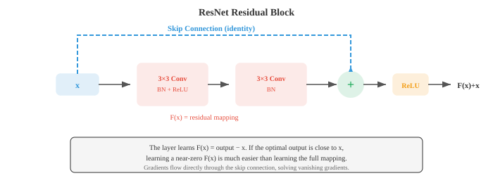
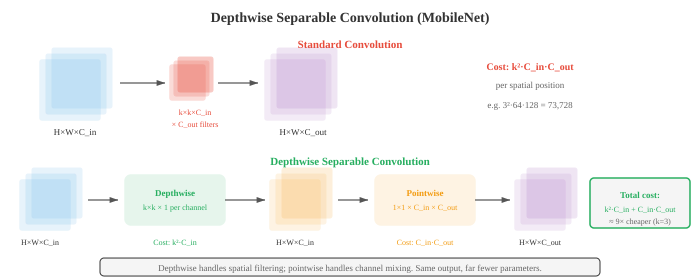

# Сверточные сети

*Сверточные нейронные сети изучают иерархии пространственных объектов непосредственно на основе пиксельных данных, заменяя созданные вручную фильтры фильтрами, оптимизированными по градиенту. В этом файле описаны механика свертки, объединение, шаг, расширение, рецептивные поля и архитектуры ориентиров (LeNet, AlexNet, VGG, ResNet, Inception, EfficientNet), определяющие классификацию изображений.*

- В файле 01 мы вручную разработали фильтры для обнаружения краев, размытия и обнаружения углов. Естественный вопрос: можем ли мы на основе данных изучить оптимальные фильтры? Именно это и делают сверточные нейронные сети (CNN). 

- Вместо того, чтобы выбирать веса фильтров вручную, CNN изучают их посредством градиентного спуска (глава 06), обнаруживая функции, которые непосредственно полезны для поставленной задачи.

- В главе 06 мы представили операцию свертки, основы CNN и идею обучения фильтров. Здесь мы углубимся в архитектурные инновации, которые сделали CNN доминирующей парадигмой в компьютерном зрении на протяжении более десяти лет.

- Вспомните основную **операцию свертки**: фильтр $K$ размера $k \times k$ скользит по входной карте объектов, вычисляя скалярное произведение в каждой позиции (глава 06). Размер вывода контролируется тремя гиперпараметрами:

    - **Шаг**: на сколько пикселей фильтр перемещается между позициями. Шаг 1 означает, что фильтр сдвигает один пиксель за раз. Шаг 2 означает, что он сдвигает два пикселя, уменьшая пространственные размеры вдвое. Стратегическая свертка является альтернативой объединению для понижения дискретизации.
    - **Заполнение**: добавление нулей вокруг границы ввода. «То же самое» дополнение ($p = \lfloor k/2 \rfloor$) сохраняет пространственные размеры. «Действительное» дополнение ($p = 0$) уменьшает их.
    - **Расширение**: вставка промежутков между фильтрующими элементами. Фильтр 3x3 с расширением 2 покрывает рецептивное поле 5x5, используя всего 9 параметров. Расширенные извилины расширяют рецептивное поле без увеличения объема вычислений.

- Выходной пространственный размер после свертки:

$$\text{out} = \left\lfloor \frac{\text{in} - k + 2p}{s} \right\rfloor + 1$$

- где $\text{in}$ — входной размер, $k$ — размер ядра, $p$ — заполнение, а $s$ — шаг. Эта формула применяется независимо к высоте и ширине.

- **Рецептивное поле** нейрона — это область исходного входного сигнала, которая может влиять на его значение. 
    - Ранние слои имеют небольшие рецептивные поля (они видят локальные узоры, такие как края). 
    - Более глубокие слои имеют более крупные рецептивные поля (они видят более крупные структуры, например части объектов). 
    
- Рецептивное поле увеличивается с каждым слоем: примерно на $k - 1$ пикселей на сверточный слой (больше с шагом или расширением). 


- Слои **Объединения** уменьшают пространственные размеры, сохраняя при этом наиболее важную информацию. 
    - **Максимальное объединение** принимает максимальное значение в каждом окне, сохраняя самую сильную активацию (самую заметную функцию). 
    - **Среднее объединение** принимает среднее значение, сглаживая карту объектов. Бассейн 2х2 с шагом 2 делит пополам оба пространственных измерения.

- **Глобальный средний пул (GAP)** усредняет всю пространственную протяженность каждого канала в одно число, создавая вектор длины, равной количеству каналов. GAP заменяет полностью связанные уровни в конце многих современных архитектур, радикально сокращая количество параметров и действуя как структурный регуляризатор.

- **Пакетная нормализация (BatchNorm)** нормализует активации внутри каждой мини-партии, чтобы иметь нулевое среднее значение и единичную дисперсию, затем применяет обучаемую шкалу и сдвиг (глава 06). В CNN BatchNorm применяется для каждого канала: статистика вычисляется по пакетным и пространственным измерениям для каждого канала независимо. Он стабилизирует обучение, обеспечивает более высокую скорость обучения и действует как мягкий регулятор.

- **Dropout** (глава 06) случайным образом обнуляет нейроны во время обучения. 

- В CNN **пространственное исключение** (Dropout2D) удаляет целые каналы карты объектов, а не отдельные пиксели, что более эффективно, поскольку соседние пиксели на карте объектов сильно коррелируют.- **Дополнение данных** искусственно расширяет обучающий набор, применяя случайные преобразования к каждому изображению во время обучения: горизонтальное переворачивание, случайное кадрирование, повороты, дрожание цвета (регулировка яркости, контрастности, насыщенности, оттенка) и вырезание (маскировка случайных прямоугольных участков). Сеть видит каждое изображение во многих различных формах, заставляя его изучать функции, инвариантные к трансформации, а не запоминать определенные шаблоны пикселей.

- Расширенные стратегии аугментации включают **Mixup** (смешивание двух изображений и их меток: $\tilde{x} = \lambda x_i + (1-\lambda) x_j$, $\tilde{y} = \lambda y_i + (1-\lambda) y_j$), **CutMix** (вставка прямоугольного фрагмента одного изображения в другое и смешивание меток пропорционально площади) и **RandAugment** (случайная выборка последовательности аугментаций из фиксированного набора с одним параметром силы).

— История архитектур CNN — это история все более глубоких и эффективных проектов, каждый из которых решает проблему, ограничивавшую предшественника.

- **LeNet-5** (LeCun et al., 1998) был оригинальной CNN, разработанной для распознавания рукописных цифр. Два сверточных слоя, за которыми следуют три полностью связанных слоя, со средним пулом и активациями танга. Было доказано, что обученные фильтры превосходят созданные вручную функции, но по современным меркам они крошечные (60 тыс. параметров).

- **AlexNet** (Крижевский и др., 2012) выиграл конкурс ImageNet с огромным отрывом, положив начало революции глубокого обучения. Ключевые нововведения: активация ReLU (вместо tanh, который страдает от исчезающих градиентов), исключение регуляризации, увеличение данных и обучение на графических процессорах. Пять сверточных слоев, три полносвязных слоя, 60 миллионов параметров.

- **VGG** (Симонян и Зиссерман, 2014) показало, что использование только фильтров 3x3, расположенных глубоко друг над другом, работает лучше, чем фильтры большего размера. Два сложенных друг на друга фильтра 3x3 имеют то же воспринимающее поле, что и один фильтр 5x5, но меньше параметров ($2 \times 3^2 = 18$ против $5^2 = 25$) и дополнительную нелинейность. VGG-16 (16 слоев) и VGG-19 (19 слоев) до сих пор широко используются в качестве экстракторов признаков. Архитектура удивительно проста: блоки свертки с увеличивающимися каналами (64, 128, 256, 512), за каждым из которых следует максимальный пул.


- **GoogLeNet/Inception** (Szegedy et al., 2014) представила **Inception модуль**: вместо выбора одного размера фильтра используйте параллельно свертки 1x1, 3x3 и 5x5, объединяйте их выходные данные и позволяйте сети решать, какой масштаб является наиболее полезным. Свертки 1x1 используются в качестве узких мест перед более крупными фильтрами для сокращения вычислений. GoogLeNet достиг более высокой точности, чем VGG, имея в 12 раз меньше параметров (6,8 млн против 138 млн).


- Модуль Inception одновременно фиксирует функции в нескольких масштабах. Фильтр 1x1 фиксирует точечные узоры, 3x3 фиксирует локальную текстуру, а 5x5 фиксирует более крупные структуры. Конкатенация объединяет все перспективы в богатое представление.

- **ResNet** (He et al., 2016) решил **проблему деградации**: более глубокие сети работали хуже, чем более мелкие, не из-за переобучения, а потому, что их труднее оптимизировать. Решением является **пропуск соединения** (остаточное соединение):

$$\text{output} = F(x) + x$$

- Слой запоминает остаток $F(x) = \text{output} - x$. Если оптимальное преобразование близко к идентичности (что часто встречается в глубоких сетях), изучение почти нулевого остатка намного проще, чем изучение полного отображения. Пропускные соединения также обеспечивают прямую градиентную магистраль, уменьшая исчезающие уклоны. Обученные сети ResNet имеют 152 слоя, что гораздо глубже, чем когда-либо прежде.



- Если входные и выходные размеры различаются (из-за изменения шага или канала), **ярлык проекции** применяет свертку 1x1 к $x$ для соответствия размерам: $\text{output} = F(x) + W_s x$.

— Блок **bottleneck** (используется в ResNet-50 и более поздних версиях) использует три свертки: 1x1 для уменьшения каналов, 3x3 для пространственной обработки и 1x1 для обратного расширения каналов. Это дешевле, чем две свертки 3х3, и позволяет создавать гораздо более глубокие сети.- **DenseNet** (Хуанг и др., 2017) развивает идею пропуска соединений дальше: каждый уровень соединяется с каждым последующим слоем внутри плотного блока. Слой $l$ получает карты объектов со всех предыдущих слоев в качестве входных данных: $x_l = H_l([x_0, x_1, \ldots, x_{l-1}])$, где $[\cdot]$ обозначает объединение по измерению канала. Это поощряет повторное использование функций, усиливает градиентный поток и уменьшает общее количество параметров.


- **Эффективные архитектуры** предназначены для развертывания на мобильных устройствах и периферийном оборудовании, где вычислительные возможности, память и энергопотребление ограничены.

- **MobileNet** (Howard et al., 2017) заменяет стандартные свертки на **разделимые по глубине свертки**, которые разбивают операцию на два этапа:
    1. **Глубокая свертка**: применение одного фильтра $k \times k$ для каждого входного канала (без межканального взаимодействия).
    2. **Поточечная свертка**: применяйте свертки 1x1 для объединения информации по каналам.

- Стандартная свертка $k \times k$ с входными каналами $C_{\text{in}}$ и выходными каналами $C_{\text{out}}$ требует умножения $k^2 \cdot C_{\text{in}} \cdot C_{\text{out}}$ на пространственное положение. Глубоко отделимая свертка стоит $k^2 \cdot C_{\text{in}} + C_{\text{in}} \cdot C_{\text{out}}$, что примерно в $k^2$ раз меньше. Для фильтра 3х3 это примерно в 9 раз дешевле.



- **MobileNet-V2** представил **инвертированный остаточный блок**: расширяйте каналы с помощью свертки 1x1, применяйте свертку по глубине в расширенном пространстве, затем проецируйте обратно вниз с помощью свертки 1x1. Пропускное соединение размещается на узких (узких) слоях, инвертируя шаблон ResNet. Коэффициент расширения обычно равен 6.

- **EfficientNet** (Tan and Le, 2019) представило **составное масштабирование**: вместо независимого масштабирования только глубины, только ширины или только разрешения, масштабируйте все три измерения вместе, используя фиксированный коэффициент. Учитывая коэффициент масштабирования $\phi$:

$$\text{depth}: d = \alpha^\phi, \quad \text{width}: w = \beta^\phi, \quad \text{resolution}: r = \gamma^\phi$$

- с учетом $\alpha \cdot \beta^2 \cdot \gamma^2 \approx 2$ (так что общий объем вычислений увеличивается примерно вдвое на единицу увеличения $\phi$). Поиск по сетке находит $\alpha = 1.2$, $\beta = 1.1$, $\gamma = 1.15$ в качестве базовых коэффициентов. EfficientNet-B0–B7 постепенно расширяется, достигая современной точности с гораздо меньшим количеством параметров и FLOP, чем предыдущие модели.


- **ShuffleNet** снижает стоимость сверток 1x1 (которые доминируют в архитектурах в стиле MobileNet) за счет использования **групповых сверток**, за которыми следует **перетасовка каналов**. Групповые свертки разбивают каналы на группы и свертывают внутри каждой группы независимо, но это предотвращает поток информации между группами. Операция перемешивания перераспределяет каналы между группами, восстанавливая смешивание информации с незначительными затратами.

- **Трансферное обучение** – это практика использования модели, обученной для решения одной задачи, и ее адаптации к другой задаче. В компьютерном зрении это почти всегда означает, что нужно начинать с модели, предварительно обученной в ImageNet (1,4 миллиона изображений, 1000 классов), и адаптироваться к набору данных, специфичному для предметной области (медицинские изображения, спутниковые изображения, производственные дефекты).

- **Извлечение признаков**: заморозьте все сверточные слои, удалите окончательную классификационную голову и тренируйте только новую голову сверху. Замороженные слои действуют как универсальный экстрактор объектов. Это хорошо работает, когда целевой домен похож на ImageNet, а целевой набор данных небольшой.

- **Точная настройка**: разморозьте некоторые или все сверточные слои и тренируйте их с небольшой скоростью обучения. Предварительно обученные веса служат отправной точкой, а не фиксированными функциями. Точная настройка обычно начинается с размораживания только более поздних уровней (которые фиксируют высокоуровневые функции, специфичные для конкретной задачи) и, при необходимости, также размораживания более ранних слоев.

- Трансферное обучение работает, потому что ранние уровни CNN изучают универсальные функции (края, текстуры, цвета), которые полезны для разных задач, а более поздние уровни изучают функции, специфичные для задачи. Сеть, обученная классифицировать животных, все еще имеет полезные детекторы границ для классификации зданий.

- **Визуализация CNN** показывает, что узнала сеть, и помогает отладить неожиданное поведение.- **Карты активации** (карты функций) показывают выходные данные каждого фильтра для данного входного изображения. Активации ранних слоев выглядят как карты границ; более глубокие слои производят все более абстрактные, пространственно грубые активации.

- **Grad-CAM** (градиентно-взвешенное картирование активации классов, Сельвараю и др., 2017) выделяет области входного изображения, которые были наиболее важны для прогнозирования модели. Это работает:
    1. Вычисление градиента оценки целевого класса по отношению к картам признаков последнего сверточного слоя (с использованием цепного правила из главы 03).
    2. Глобальное среднее значение, объединяющее эти градиенты для получения весовых коэффициентов важности для каждого канала.
    3. Вычисление взвешенной комбинации карт признаков и применение ReLU.

$$L_{\text{Grad-CAM}} = \text{ReLU}\!\left(\sum_k \alpha_k A^k\right), \quad \alpha_k = \frac{1}{Z} \sum_i \sum_j \frac{\partial y^c}{\partial A^k_{ij}}$$

- где $A^k$ — это $k$-я карта объектов, $\alpha_k$ — это вес важности для канала $k$, а $y^c$ — это оценка для класса $c$. Результатом является приблизительная тепловая карта, показывающая, какие регионы привели к классификации. ReLU применяется, потому что нас интересуют функции, которые положительно влияют на класс.


- **Инверсия объектов** восстанавливает входное изображение на основе его представления объектов путем оптимизации случайного изображения в соответствии с целевыми объектами (с использованием градиентного спуска по значениям пикселей). Это показывает, какую информацию сеть сохраняет на каждом уровне. Ранние слои восстанавливают почти идеальные изображения; более глубокие слои создают узнаваемые, но искаженные изображения, показывая, что мелкие пространственные детали теряются, а семантическое содержание сохраняется.

- **Deep Dream** и **нейронная передача стиля** — это творческие применения визуализации функций. Deep Dream максимизирует активацию нейронов на выбранном слое для создания сюрреалистических изображений с усилением шаблонов. Нейронная передача стиля оптимизирует целевое изображение в соответствии с особенностями содержимого (из глубокого слоя) одного изображения и особенностями стиля (матрица Грамма активаций фильтра, которая фиксирует статистику текстур) другого.

## Задачи по кодированию (используйте CoLab или блокнот)

1. Реализуйте простую CNN с нуля в JAX с двумя сверточными слоями, максимальным пулом и головкой классификации. Обучите его задаче классификации синтетических 2D-образцов.
```python
import jax
import jax.numpy as jnp
import jax.lax as lax
import matplotlib.pyplot as plt

def conv2d(x, kernel, stride=1):
    """Simple 2D convolution for single input, single filter."""
    return lax.conv(x[None, None], kernel[None, None], (stride, stride), 'SAME')[0, 0]

def max_pool(x, size=2):
    """2x2 max pooling."""
    H, W = x.shape
    x = x[:H//size*size, :W//size*size]
    return x.reshape(H//size, size, W//size, size).max(axis=(1, 3))

def init_cnn(key):
    k1, k2, k3 = jax.random.split(key, 3)
    return {
        'conv1': jax.random.normal(k1, (5, 5)) * 0.3,
        'conv2': jax.random.normal(k2, (3, 3)) * 0.3,
        'fc_w': jax.random.normal(k3, (64, 1)) * 0.1,
        'fc_b': jnp.zeros(1),
    }

def forward_cnn(params, img):
    # Conv1 -> ReLU -> Pool
    h = jnp.maximum(0, conv2d(img, params['conv1']))
    h = max_pool(h)
    # Conv2 -> ReLU -> Pool
    h = jnp.maximum(0, conv2d(h, params['conv2']))
    h = max_pool(h)
    # Flatten and classify
    flat = h.ravel()
    # Pad or truncate to fixed size
    flat = jnp.pad(flat, (0, max(0, 64 - len(flat))))[:64]
    logit = (flat @ params['fc_w'] + params['fc_b']).squeeze()
    return jax.nn.sigmoid(logit)

# Generate synthetic data: class 0 = low-freq pattern, class 1 = high-freq
def make_data(key, n=200):
    images, labels = [], []
    for i in range(n):
        k1, key = jax.random.split(key)
        x, y = jnp.meshgrid(jnp.linspace(0, 4*jnp.pi, 32), jnp.linspace(0, 4*jnp.pi, 32))
        if i < n // 2:
            img = jnp.sin(x) + jax.random.normal(k1, (32, 32)) * 0.1
            labels.append(0)
        else:
            img = jnp.sin(4 * x) * jnp.sin(4 * y) + jax.random.normal(k1, (32, 32)) * 0.1
            labels.append(1)
        images.append(img)
    return images, jnp.array(labels, dtype=jnp.float32)

key = jax.random.PRNGKey(42)
images, labels = make_data(key)
params = init_cnn(jax.random.PRNGKey(0))

def loss_fn(params, img, label):
    pred = forward_cnn(params, img)
    return -(label * jnp.log(pred + 1e-7) + (1 - label) * jnp.log(1 - pred + 1e-7))

grad_fn = jax.grad(loss_fn)
lr = 0.01

for epoch in range(5):
    total_loss = 0.0
    for img, label in zip(images, labels):
        grads = grad_fn(params, img, label)
        params = {k: params[k] - lr * grads[k] for k in params}
        total_loss += loss_fn(params, img, label)
    print(f"Epoch {epoch}: loss = {total_loss / len(images):.4f}")

# Test accuracy
preds = jnp.array([forward_cnn(params, img) > 0.5 for img in images])
acc = jnp.mean(preds == labels)
print(f"Accuracy: {acc:.2%}")
```

2. Визуализируйте, как фильтры разных размеров влияют на рецептивное поле. Покажите, что два сложенных друг на друга фильтра 3x3 покрывают то же рецептивное поле, что и один фильтр 5x5, но с меньшим количеством параметров.
```python
import jax.numpy as jnp
import matplotlib.pyplot as plt

def compute_receptive_field(layers):
    """Compute receptive field size from a list of (kernel_size, stride) tuples."""
    rf = 1  # start with 1 pixel
    stride_product = 1
    for k, s in layers:
        rf += (k - 1) * stride_product
        stride_product *= s
    return rf

# Compare architectures
configs = {
    'Single 5x5': [(5, 1)],
    'Two 3x3':    [(3, 1), (3, 1)],
    'Three 3x3':  [(3, 1), (3, 1), (3, 1)],
    'Single 7x7': [(7, 1)],
    '3x3 stride 2 + 3x3': [(3, 2), (3, 1)],
}

print(f"{'Config':<25} {'RF':>4} {'Params (per channel)':>20}")
print('-' * 55)
for name, layers in configs.items():
    rf = compute_receptive_field(layers)
    # Parameters: sum of k^2 for each layer (per input-output channel pair)
    params = sum(k * k for k, s in layers)
    print(f"{name:<25} {rf:>4} {params:>20}")

# Visualise receptive fields
fig, axes = plt.subplots(1, 3, figsize=(14, 4))
for ax, (name, rf_size) in zip(axes, [('5x5 filter', 5), ('Two 3x3 filters', 5), ('Three 3x3 filters', 7)]):
    grid = jnp.zeros((9, 9))
    c = 4  # centre
    half = rf_size // 2
    grid = grid.at[c-half:c+half+1, c-half:c+half+1].set(1.0)
    ax.imshow(grid, cmap='Blues', vmin=0, vmax=1)
    ax.set_title(f'{name}\nRF = {rf_size}x{rf_size}')
    ax.set_xticks(range(9)); ax.set_yticks(range(9))
    ax.grid(True, alpha=0.3)
plt.suptitle('Receptive Field Comparison')
plt.tight_layout(); plt.show()
```

3. Внедрить Град-САМ с нуля. Имея предварительно созданную простую CNN, вычислите карту активации с градиентным взвешиванием для определенного класса и визуализируйте ее как тепловую карту.
```python
import jax
import jax.numpy as jnp
import matplotlib.pyplot as plt

def simple_cnn(params, img):
    """Simple CNN that returns both the prediction and last conv activations."""
    # Conv layer (our "last conv layer" for Grad-CAM)
    H, W = img.shape
    k = params['conv'].shape[0]
    pad = k // 2
    img_pad = jnp.pad(img, pad, mode='edge')
    activation_map = jnp.zeros((H, W))
    for i in range(H):
        for j in range(W):
            activation_map = activation_map.at[i, j].set(
                jnp.sum(img_pad[i:i+k, j:j+k] * params['conv'])
            )
    activation_map = jnp.maximum(0, activation_map)  # ReLU

    # Global average pool -> dense -> output
    pooled = activation_map.mean()
    logit = pooled * params['w'] + params['b']
    return jax.nn.sigmoid(logit), activation_map

# Create test image: bright region on the left (class indicator)
img = jnp.zeros((32, 32))
img = img.at[8:24, 4:16].set(1.0)
img = img.at[5:10, 20:28].set(0.3)

key = jax.random.PRNGKey(42)
params = {
    'conv': jax.random.normal(key, (5, 5)) * 0.3,
    'w': jnp.array(2.0),
    'b': jnp.array(-0.5),
}

# Compute Grad-CAM
def class_score(params, img):
    pred, _ = simple_cnn(params, img)
    return pred

# Get activation map and gradients
pred, act_map = simple_cnn(params, img)
grad_fn = jax.grad(lambda img: simple_cnn(params, img)[0])
img_grad = grad_fn(img)

# Weight = global average of gradients (simplified 1-channel Grad-CAM)
alpha = img_grad.mean()
grad_cam = jnp.maximum(0, alpha * act_map)  # ReLU
grad_cam = (grad_cam - grad_cam.min()) / (grad_cam.max() - grad_cam.min() + 1e-8)

fig, axes = plt.subplots(1, 3, figsize=(14, 4))
axes[0].imshow(img, cmap='gray'); axes[0].set_title('Input Image'); axes[0].axis('off')
axes[1].imshow(act_map, cmap='viridis'); axes[1].set_title('Activation Map'); axes[1].axis('off')
axes[2].imshow(img, cmap='gray', alpha=0.6)
axes[2].imshow(grad_cam, cmap='jet', alpha=0.4)
axes[2].set_title(f'Grad-CAM (pred={pred:.2f})'); axes[2].axis('off')
plt.tight_layout(); plt.show()
```

4. Сравните отделимую по глубине свертку со стандартной сверткой. Подсчитайте параметры и FLOP для обоих и покажите, что они дают одинаковые результаты с гораздо меньшими вычислениями.
```python
import jax
import jax.numpy as jnp

def standard_conv(x, kernel):
    """Standard convolution: (H, W, C_in) * (k, k, C_in, C_out) -> (H, W, C_out)."""
    H, W, C_in = x.shape
    k, _, _, C_out = kernel.shape
    pad = k // 2
    x_pad = jnp.pad(x, ((pad, pad), (pad, pad), (0, 0)), mode='constant')
    out = jnp.zeros((H, W, C_out))
    for i in range(H):
        for j in range(W):
            patch = x_pad[i:i+k, j:j+k, :]  # (k, k, C_in)
            for c in range(C_out):
                out = out.at[i, j, c].set(jnp.sum(patch * kernel[:, :, :, c]))
    return out

def depthwise_separable_conv(x, dw_kernel, pw_kernel):
    """Depthwise separable: depthwise (k,k,C_in) then pointwise (C_in, C_out)."""
    H, W, C_in = x.shape
    k = dw_kernel.shape[0]
    pad = k // 2
    x_pad = jnp.pad(x, ((pad, pad), (pad, pad), (0, 0)), mode='constant')

    # Depthwise: one filter per channel
    dw_out = jnp.zeros((H, W, C_in))
    for i in range(H):
        for j in range(W):
            for c in range(C_in):
                patch = x_pad[i:i+k, j:j+k, c]
                dw_out = dw_out.at[i, j, c].set(jnp.sum(patch * dw_kernel[:, :, c]))

    # Pointwise: 1x1 conv across channels
    out = dw_out @ pw_kernel
    return out

# Setup
H, W, C_in, C_out, k = 8, 8, 16, 32, 3
key = jax.random.PRNGKey(42)
k1, k2, k3, k4 = jax.random.split(key, 4)

x = jax.random.normal(k1, (H, W, C_in))
std_kernel = jax.random.normal(k2, (k, k, C_in, C_out)) * 0.1
dw_kernel = jax.random.normal(k3, (k, k, C_in)) * 0.1
pw_kernel = jax.random.normal(k4, (C_in, C_out)) * 0.1

# Compare
std_params = k * k * C_in * C_out
dw_params = k * k * C_in + C_in * C_out

std_flops = H * W * k * k * C_in * C_out
dw_flops = H * W * (k * k * C_in + C_in * C_out)

print(f"Standard conv:            {std_params:>8,} params,  {std_flops:>10,} FLOPs")
print(f"Depthwise separable conv: {dw_params:>8,} params,  {dw_flops:>10,} FLOPs")
print(f"Parameter reduction:      {std_params / dw_params:.1f}x")
print(f"FLOP reduction:           {std_flops / dw_flops:.1f}x")

std_out = standard_conv(x, std_kernel)
ds_out = depthwise_separable_conv(x, dw_kernel, pw_kernel)
print(f"\nStandard output shape:    {std_out.shape}")
print(f"Depthwise sep output shape: {ds_out.shape}")
```