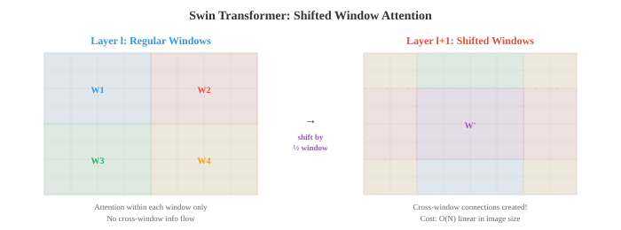

# Трансформаторы видения и генерация

* Трансформаторы зрения применяют самообладание к фрагментам изображения, бросая вызов доминированию CNN с помощью пространственного обучения на основе данных. Этот файл охватывает ViT, DeiT, Swin Transformer, генерацию изображений с помощью GAN (StyleGAN), VAE и моделей диффузии (DDPM, Stable Diffusion), а также сверхвысокое разрешение и передачу нейронных стилей.*

- CNN (файл 02) создают сильные пространственные индуктивные смещения: локальную связность, распределение веса и трансляционную эквивариантность. Трансформаторы зрения (ViT) задают провокационный вопрос: что, если мы полностью отбросим эти предубеждения и позволим модели изучать пространственную структуру на основе данных, используя только механизм внимания из главы 06?

- **Vision Transformer (ViT)** (Досовицкий и др., 2021) применяет стандартный кодер Transformer непосредственно к изображениям. Основная идея состоит в том, чтобы рассматривать изображение как последовательность фрагментов, точно так же, как НЛП рассматривает текст как последовательность токенов.

- Процесс работает следующим образом:
    1. Разделите изображение (высота $H$, ширина $W$, каналы $C$) на сетку непересекающихся фрагментов размером $P \times P$. При этом создаются патчи $N = HW / P^2$.
    2. Сгладьте каждый участок в вектор длиной $P^2 \cdot C$ и спроецируйте его на размерность модели $D$ с помощью изученного линейного встраивания (умножение одной матрицы, глава 02).
    3. Добавьте в начало обучаемое встраивание токена **[CLS]** (аналогично BERT [CLS], глава 07). Этот токен относится ко всем исправлениям, и его окончательное представление используется для классификации.
    4. Добавьте **вложения позиций** (один обучаемый вектор на позицию), чтобы предоставить пространственную информацию, поскольку внимание эквивалентно перестановкам.
    5. Пропустите последовательность вложений токенов $(N + 1)$ через стандартный кодировщик Transformer (многоголовочное самообслуживание + FFN, глава 06).
    6. Окончательное представление токена [CLS] проходит через заголовок классификации (небольшой MLP).

![Конвейер ViT: изображение разделено на фрагменты 16x16, каждый из которых сглажен и линейно проецируется, к началу добавляется токен [CLS], добавляются встраивания позиций, затем обрабатываются блоками кодировщика Transformer](../images/vit_pipeline.svg)

- **Внедрение патчей** эквивалентно свертке с размером ядра $P$ и шагом $P$ (без перекрытия). ViT буквально преобразует 2D-изображение в 1D-последовательность, а затем обрабатывает его с той же архитектурой, что и язык.

- ViT имеет меньшую индуктивную предвзятость, чем CNN: он не обеспечивает локальную связность или трансляционную эквивалентность. Это означает, что для изучения пространственной структуры с нуля требуется больше обучающих данных. На небольших наборах данных CNN превосходят ViT. Но при обучении на очень больших наборах данных (JFT-300M, 300 миллионов изображений) ViT соответствует лучшим CNN или превосходит их, что позволяет предположить, что индуктивные смещения CNN полезны для эффективности данных, но не необходимы для максимальной производительности.

- ВиТ самообслуживание имеет $O(N^2)$ по количеству патчей. Для изображения 224x224 с фрагментами 16x16 используйте $N = 196$, что вполне возможно. Но для изображений с более высоким разрешением или небольших участков квадратичная стоимость становится непомерно высокой.

- **DeiT** (Data-efficient Image Transformer, Touvron et al., 2021) показал, что ViT можно эффективно обучать только на ImageNet (без массивного набора данных JFT) с использованием мощного увеличения данных, регуляризации (стохастическая глубина, сглаживание меток, исключение) и **дистилляции знаний**: предварительно обученный преподаватель CNN предоставляет мягкие метки, которым ученик ViT учится сопоставлять. DeiT добавила **токен дистилляции** рядом с токеном [CLS], обученный прогнозировать результаты работы учителя.

- **Swin Transformer** (Лю и др., 2021) устраняет два основных ограничения ViT: его квадратичную стоимость в зависимости от размера изображения и отсутствие иерархических карт признаков (которые необходимы для обнаружения и сегментации).

- В Swin введены **смещенные окна**: вместо глобального самоконтроля для всех патчей внимание вычисляется в локальных окнах (например, патчи 7x7). Это делает стоимость линейной по размеру изображения: $O(N)$, а не $O(N^2)$. Но сами по себе локальные окна предотвратят поток информации между регионами.- **Сдвиг окна** решает эту проблему: при чередовании слоев раздел окна смещается на половину размера окна. Это создает межоконные соединения, позволяя информации перемещаться между всеми частями изображения по слоям без затрат глобального внимания.



- Swin также создает **иерархическое представление** путем объединения патчей на разных этапах. После каждого этапа соседние патчи 2x2 объединяются и проецируются, чтобы удвоить размер канала и вдвое уменьшить пространственное разрешение. Это создает многомасштабные карты объектов, аналогичные картам в CNN и FPN (файл 03), что делает Swin напрямую совместимым с головками обнаружения, такими как Faster R-CNN, и головками сегментации, такими как U-Net.

- **PVT** (Pyramid Vision Transformer) использует аналогичный иерархический подход с вниманием к пространственному сокращению: на каждом этапе ключи и значения перед вычислением внимания подвергаются пространственной субдискретизации, что снижает квадратичную стоимость при сохранении глобального восприимчивого поля.

- **Визуальное обучение с самоконтролем** тренирует представления на основе немаркированных изображений. Собирать этикетки дорого, но изображений много. Цель состоит в том, чтобы изучить функции, которые хорошо передаются в последующие задачи без каких-либо человеческих комментариев.

- **Контрастное обучение** обучает модель распознавать, что два дополненных представления одного и того же изображения («положительная пара») должны иметь схожие представления, в то время как представления разных изображений («негативные пары») должны иметь разные представления.

- **SimCLR** (Chen et al., 2020) создает два дополненных представления каждого изображения в пакете, кодирует оба с помощью общей магистрали + проекционной головки и применяет **NT-Xent loss** (нормализованную кросс-энтропию, масштабированную по температуре):

$$\ell_{i,j} = -\log \frac{\exp(\text{sim}(z_i, z_j) / \tau)}{\sum_{k \neq i} \exp(\text{sim}(z_i, z_k) / \tau)}$$

- где $\text{sim}$ – косинусоидальное подобие (глава 01), а $\tau$ – температурный параметр. Числитель объединяет положительные пары; знаменатель раздвигает отрицательные пары. SimCLR требует больших размеров пакетов (4096+), чтобы получить достаточное количество негативов.

- **MoCo** (Momentum Contrast, He et al., 2020) решает проблему больших партий, поддерживая **обновляемую по импульсу очередь** отрицательных вложений. Кодер запроса обновляется градиентным спуском; ключевой кодировщик обновляется как экспоненциальное скользящее среднее (EMA, глава 04) кодера запроса: $\theta_k \leftarrow m \theta_k + (1 - m) \theta_q$ с $m = 0.999$. В очереди хранятся последние встраивания ключей, обеспечивая большой и последовательный набор негативов без необходимости использования огромных пакетов.

- **BYOL** (Bootstrap Your Own Latent, Grill et al., 2020) полностью исключает отрицательные пары. Он использует две сети: «онлайновую» сеть и «целевую» сеть (EMA онлайн). Онлайн-сеть прогнозирует представление целевой сетью другого расширенного представления. Без негативов BYOL позволяет избежать проблемы коллапса (когда модель выводит один и тот же вектор для всего) за счет асимметрии головы предиктора и цели EMA.

- **DINO** (Самодистилляция без этикеток, Caron et al., 2021) применяет самодистилляцию к ViT. Студенческая сеть прогнозирует результаты работы сети учителей (EMA учащегося) в различных расширенных представлениях. Учитель использует более крупные культуры; студент использует более мелкие культуры. DINO создает функции, которые содержат явную информацию о макете сцены: карты самообслуживания обученных DINO ViTs естественным образом сегментируют объекты без какого-либо контроля сегментации.

- **Моделирование маскированных изображений** — это визуальный аналог моделирования языка масок BERT (глава 07). Большая часть входных патчей маскируется, и модель учится их реконструировать.

- **MAE** (Masked Autoencoders, He et al., 2022) маскирует 75% патчей и обучает кодер-декодер ViT восстанавливать значения недостающих пикселей. Кодер обрабатывает только немаскированные патчи (экономя 4-кратные вычисления во время предварительного обучения), а облегченный декодер реконструирует полное изображение из закодированных видимых патчей и обучаемых токенов маски.- **BEiT** (Предварительное обучение преобразователей изображений BERT, Бао и др., 2022) маскирует исправления и прогнозирует дискретные визуальные токены (полученные из предварительно обученного токенизатора dVAE), а не необработанные пиксели. Это соответствует предсказанию BERT токенов дискретных слов и позволяет избежать низкоуровневой детализации реконструкции пикселей.

- **Генерация изображений** направлена ​​на создание новых реалистичных изображений, которых нет в обучающем наборе. Основная задача — моделирование многомерного распределения вероятностей естественных изображений.

- **Генераторно-состязательные сети (GAN)** (Goodfellow et al., 2014) используют две конкурирующие сети: **генератор** $G$, который создает поддельные изображения из случайного шума, и **дискриминатор** $D$, который пытается отличить настоящие изображения от подделок. Они обучены состязательно: $G$ пытается обмануть $D$, а $D$ пытается поймать $G$.

$$\min_G \max_D \; \mathbb{E}_{x \sim p_{\text{data}}}[\log D(x)] + \mathbb{E}_{z \sim p(z)}[\log(1 - D(G(z)))]$$

- Генератор берет случайный скрытый вектор $z$ (выбранный из простого распределения, такого как гауссово) и отображает его с помощью серии транспонированных сверток для создания изображения. Дискриминатор представляет собой стандартный классификатор CNN. В равновесии $G$ создает изображения, неотличимые от реальных данных, а $D$ выводит 0,5 для всех входов.

- **Коллапс режима** — это основной режим отказа GAN: генератор учится создавать только несколько типов изображений, которые обманывают дискриминатор, игнорируя разнообразие обучающих данных. Генератор находит небольшой набор «безопасных» выходов, а не охватывает все распределение.

- Приемы обучения, которые стабилизируют GAN, включают в себя: спектральную нормализацию (ограничение константы Липшица дискриминатора), прогрессивный рост (сначала обучение с низким разрешением, а затем постепенное увеличение), сопоставление признаков (сопоставление статистики промежуточных признаков дискриминатора, а не конечного результата) и использование расстояния Вассерштейна вместо исходной цели дивергенции JS.

- **StyleGAN** (Каррас и др., 2019) — наиболее влиятельная архитектура GAN для высококачественного синтеза изображений. Его ключевым нововведением является **генератор на основе стилей**: вместо подачи скрытого вектора $z$ непосредственно в генератор, он сначала отображается через **сеть сопоставления** (8-слойную MLP) для создания вектора стиля $w$. Этот вектор стиля вводится в каждый слой генератора посредством **адаптивной нормализации экземпляра (AdaIN)**, которая модулирует статистику карты объектов:

$$\text{AdaIN}(x, y) = y_{s} \cdot \frac{x - \mu(x)}{\sigma(x)} + y_{b}$$

- где $y_s$ и $y_b$ — масштаб и смещение, полученные из $w$. Разные слои управляют разными аспектами: ранние слои управляют грубыми чертами (поза, форма лица), средние слои — средними чертами (прическа, глаза), а поздние слои — мелкими деталями (веснушки, текстура волос). StyleGAN может генерировать фотореалистичные лица с разрешением 1024x1024.

- **Вариационные автоэнкодеры (VAE)** (глава 06) предоставляют альтернативный генеративный подход. В отличие от GAN, VAE имеют принципиальную вероятностную структуру с четкой целью обучения (ELBO). Они имеют тенденцию создавать более размытые изображения, чем GAN, но предлагают более гладкое и структурированное скрытое пространство. VAE — это пара кодер-декодер, используемая в моделях скрытой диффузии для сжатия изображений в скрытое пространство и из него.

- **Диффузионные модели** стали доминирующей парадигмой создания изображений, превосходя GAN как по качеству, так и по разнообразию. Идея концептуально проста: постепенно добавляйте шум к данным, пока они не станут чистым гауссовым шумом (**прямой процесс**), затем научитесь шаг за шагом обращать этот процесс вспять (**обратный процесс**).

- **Прямой процесс** добавляет гауссов шум за временные шаги $T$:

$$q(x_t | x_{t-1}) = \mathcal{N}(x_t; \sqrt{1 - \beta_t} \, x_{t-1}, \beta_t I)$$

- где $\beta_t$ - график шума, увеличивающийся с течением времени. После достаточного количества шагов $x_T$ будет примерно чистым гауссовским шумом независимо от исходного изображения $x_0$. Используя прием перепараметризации (глава 06) и установив $\alpha_t = 1 - \beta_t$, $\bar{\alpha}_t = \prod_{s=1}^{t} \alpha_s$, мы можем выбрать $x_t$ непосредственно из $x_0$:$$x_t = \sqrt{\bar{\alpha}_t} \, x_0 + \sqrt{1 - \bar{\alpha}_t} \, \epsilon, \quad \epsilon \sim \mathcal{N}(0, I)$$

- **обратный процесс** учится шумоподавлению: начиная с чистого шума $x_T$, модель прогнозирует шум $\epsilon$, добавляемый на каждом этапе, и вычитает его для восстановления $x_{t-1}$. Это параметризуется нейронной сетью $\epsilon_\theta$ (обычно U-Net из файла 03), обученной с простой потерей MSE:

$$\mathcal{L} = \mathbb{E}_{t, x_0, \epsilon}\left[\|\epsilon - \epsilon_\theta(x_t, t)\|^2\right]$$


- **DDPM** (Вероятностные модели шумоподавления, Хо и др., 2020) установили эту структуру. Выборка требует повторения всех шагов $T$ (обычно 1000), что занимает много времени. **DDIM** (Неявные модели шумопонижения и диффузии, Song et al., 2021) переформулирует процесс выборки как детерминированное отображение, допуская большие пропуски шагов (например, 50 шагов вместо 1000) с минимальной потерей качества.

- **Модели на основе оценок** (Song and Ermon, 2019) предлагают альтернативную точку зрения. Вместо прогнозирования шума $\epsilon$ модель оценивает **функцию оценки** $\nabla_{x_t} \log p(x_t)$, градиент логарифмической вероятности относительно зашумленного изображения. Этот градиент указывает на более вероятные (более чистые) области распределения данных. Выборка следует этому градиенту с использованием динамики Ланжевена. Модели на основе оценок и DDPM были объединены в рамках **стохастических дифференциальных уравнений (СДУ)**: прямой процесс — это СДУ, добавляющий шум, а обратный процесс — это СДУ, обращенный во времени.

- **Руководство без классификаторов** (Ho and Salimans, 2022) контролирует компромисс между качеством выборки и разнообразием. Модель обучается как условно (с текстовым приглашением или меткой класса), так и безоговорочно (со случайным удалением условия). Во время выборки прогноз представляет собой взвешенную комбинацию:

$$\hat{\epsilon} = \epsilon_\theta(x_t, \varnothing) + s \cdot (\epsilon_\theta(x_t, c) - \epsilon_\theta(x_t, \varnothing))$$

- где $c$ — это состояние, $\varnothing$ — нулевое состояние, а $s > 1$ — шкала наведения. Более высокое значение $s$ создает изображения, которые лучше соответствуют условию, но с меньшим разнообразием. $s = 1$ дает неуправляемую модель; $s = 7.5$ — обычное значение по умолчанию.

- **Скрытая диффузия** (Ромбах и др., 2022; Стабильная диффузия) перемещает процесс диффузии из пространства пикселей в изученное скрытое пространство. Предварительно обученный кодер VAE сжимает изображения до скрытого представления меньшей размерности (обычно с 4-кратной или 8-кратной пространственной понижающей дискретизацией), в этом сжатом пространстве работает диффузия, а декодер VAE восстанавливает пиксели из скрытого изображения с шумоподавлением. Это значительно более эффективно: распространение изображения размером 512x512 в пространстве пикселей означает обработку тензора $512 \times 512 \times 3$, а в скрытом пространстве — только тензора $64 \times 64 \times 4$.

- U-Net шумоподавления в скрытой диффузии принимает латентный шум, временной шаг (закодированный как синусоидальное вложение, аналогичное позиционному кодированию в трансформаторах) и кондиционирующий сигнал (встраивание текста из замороженного текстового кодера CLIP или T5). Текстовое условие поступает через уровни перекрестного внимания в U-Net: встраивания текста служат ключами и значениями, а функции изображения служат запросами. Это позволяет модели обрабатывать соответствующие части текстового запроса в каждом пространственном положении.

- **Сопоставление потоков** — это новая альтернатива диффузии, которая изучает прямой путь передачи между шумом и данными, а не итеративное шумоподавление DDPM.

- **Непрерывный нормализующий поток (CNF)** определяет зависящее от времени поле скорости $v_\theta(x, t)$, которое перемещает выборки из простого распределения $p_0$ (шум) в распределение данных $p_1$ по плавным траекториям. Преобразование следует обыкновенному дифференциальному уравнению (ОДУ):

$$\frac{dx}{dt} = v_\theta(x, t), \quad t \in [0, 1]$$

- Начиная с $x_0 \sim \mathcal{N}(0, I)$, интеграция ODE вперед до $t = 1$ создает выборку из распределения данных. Поле скорости параметризуется нейронной сетью и обучается для соответствия целевому условному потоку.- **Оптимальное транспортное** (OT) сопоставление потоков (Липман и др., 2023) использует прямые пути между шумом и данными в качестве целевого потока: условный путь от выборки шума $x_0$ к выборке данных $x_1$ — это просто $x_t = (1 - t) x_0 + t x_1$, а целевая скорость равна $v = x_1 - x_0$. Потери на обучении составляют:

$$\mathcal{L} = \mathbb{E}_{t, x_0, x_1} \left[\|v_\theta(x_t, t) - (x_1 - x_0)\|^2\right]$$

- **Исправленные потоки** (Лю и др., 2022) итеративно выпрямляют изученные пути потока. После начального прохода обучения модель используется для генерации пар (шум, данные) путем моделирования ОДУ. Эти пары, которые более тесно связаны, чем случайные пары, используются для переобучения модели. Повторение этого процесса приводит к созданию все более прямых путей, которые можно пройти за меньшее количество шагов ОДУ (даже за один шаг), что обеспечивает чрезвычайно быструю генерацию.

- Сопоставление потоков имеет несколько преимуществ перед диффузией: цель обучения проще (прямая регрессия скорости, отсутствие графика шума), ОДУ выборки более гладкий (требуется меньше шагов интегрирования), а подключение к оптимальному транспорту обеспечивает теоретическое обоснование. Stable Diffusion 3 и Flux используют согласование потоков вместо традиционного DDPM.

## Задачи по кодированию (используйте CoLab или блокнот)

1. Реализуйте встраивание патча ViT с нуля. Разделите изображение на фрагменты, сгладьте их, спроецируйте на размер модели, добавьте встраивание положения и добавьте токен [CLS].
```python
import jax
import jax.numpy as jnp
import matplotlib.pyplot as plt

def create_patch_embedding(image, patch_size, d_model, params):
    """Convert an image into a sequence of patch embeddings."""
    H, W, C = image.shape
    n_patches_h = H // patch_size
    n_patches_w = W // patch_size
    n_patches = n_patches_h * n_patches_w

    # Extract patches
    patches = []
    for i in range(n_patches_h):
        for j in range(n_patches_w):
            patch = image[i*patch_size:(i+1)*patch_size,
                          j*patch_size:(j+1)*patch_size, :]
            patches.append(patch.ravel())
    patches = jnp.stack(patches)  # (N, P*P*C)

    # Linear projection to d_model
    embeddings = patches @ params['proj_w'] + params['proj_b']  # (N, d_model)

    # Prepend CLS token
    cls_token = params['cls_token']  # (1, d_model)
    embeddings = jnp.concatenate([cls_token, embeddings], axis=0)  # (N+1, d_model)

    # Add position embeddings
    embeddings = embeddings + params['pos_embed']  # (N+1, d_model)

    return embeddings, patches

# Setup
H, W, C = 32, 32, 3
patch_size = 8
d_model = 64
n_patches = (H // patch_size) * (W // patch_size)  # 16

key = jax.random.PRNGKey(42)
keys = jax.random.split(key, 5)

# Create a synthetic image with distinct quadrants
image = jnp.zeros((H, W, C))
image = image.at[:16, :16, 0].set(1.0)   # red top-left
image = image.at[:16, 16:, 1].set(1.0)   # green top-right
image = image.at[16:, :16, 2].set(1.0)   # blue bottom-left
image = image.at[16:, 16:, :2].set(1.0)  # yellow bottom-right

params = {
    'proj_w': jax.random.normal(keys[0], (patch_size**2 * C, d_model)) * 0.02,
    'proj_b': jnp.zeros(d_model),
    'cls_token': jax.random.normal(keys[1], (1, d_model)) * 0.02,
    'pos_embed': jax.random.normal(keys[2], (n_patches + 1, d_model)) * 0.02,
}

embeddings, patches = create_patch_embedding(image, patch_size, d_model, params)

print(f"Image shape: {image.shape}")
print(f"Patch size: {patch_size}x{patch_size}")
print(f"Number of patches: {n_patches}")
print(f"Patch vector length: {patch_size**2 * C}")
print(f"Embedding shape: {embeddings.shape}  (CLS + {n_patches} patches)")

# Visualise patches
fig, axes = plt.subplots(2, 5, figsize=(14, 6))
axes[0, 0].imshow(image); axes[0, 0].set_title('Full Image'); axes[0, 0].axis('off')
for idx in range(min(9, n_patches)):
    ax = axes[(idx+1) // 5, (idx+1) % 5]
    patch_img = patches[idx].reshape(patch_size, patch_size, C)
    ax.imshow(patch_img); ax.set_title(f'Patch {idx}'); ax.axis('off')
plt.suptitle('ViT Patch Decomposition')
plt.tight_layout(); plt.show()
```

2. Реализуйте простой цикл обучения GAN. Обучите генератор и дискриминатор двумерным данным и визуализируйте сгенерированное распределение, сходящееся с реальным распределением.
```python
import jax
import jax.numpy as jnp
import matplotlib.pyplot as plt

def generator(z, params):
    h = jnp.tanh(z @ params['g_w1'] + params['g_b1'])
    h = jnp.tanh(h @ params['g_w2'] + params['g_b2'])
    return h @ params['g_w3'] + params['g_b3']

def discriminator(x, params):
    h = jax.nn.leaky_relu(x @ params['d_w1'] + params['d_b1'], 0.2)
    h = jax.nn.leaky_relu(h @ params['d_w2'] + params['d_b2'], 0.2)
    return jax.nn.sigmoid(h @ params['d_w3'] + params['d_b3'])

def init_params(key):
    keys = jax.random.split(key, 6)
    z_dim, h_dim, data_dim = 2, 32, 2
    scale = 0.1
    return {
        'g_w1': jax.random.normal(keys[0], (z_dim, h_dim)) * scale,
        'g_b1': jnp.zeros(h_dim),
        'g_w2': jax.random.normal(keys[1], (h_dim, h_dim)) * scale,
        'g_b2': jnp.zeros(h_dim),
        'g_w3': jax.random.normal(keys[2], (h_dim, data_dim)) * scale,
        'g_b3': jnp.zeros(data_dim),
        'd_w1': jax.random.normal(keys[3], (data_dim, h_dim)) * scale,
        'd_b1': jnp.zeros(h_dim),
        'd_w2': jax.random.normal(keys[4], (h_dim, h_dim)) * scale,
        'd_b2': jnp.zeros(h_dim),
        'd_w3': jax.random.normal(keys[5], (h_dim, 1)) * scale,
        'd_b3': jnp.zeros(1),
    }

def d_loss(params, real_data, fake_data):
    real_score = discriminator(real_data, params)
    fake_score = discriminator(fake_data, params)
    return -jnp.mean(jnp.log(real_score + 1e-7) + jnp.log(1 - fake_score + 1e-7))

def g_loss(params, fake_data):
    fake_score = discriminator(fake_data, params)
    return -jnp.mean(jnp.log(fake_score + 1e-7))

# Real data: ring distribution
key = jax.random.PRNGKey(42)
theta = jax.random.uniform(key, (512,)) * 2 * jnp.pi
real_data = jnp.stack([jnp.cos(theta), jnp.sin(theta)], axis=1)
real_data = real_data + jax.random.normal(key, real_data.shape) * 0.05

params = init_params(jax.random.PRNGKey(0))
d_grad = jax.grad(d_loss)
g_grad = jax.grad(g_loss)
lr = 0.001

snapshots = []
for step in range(3000):
    key, k1 = jax.random.split(key)
    z = jax.random.normal(k1, (512, 2))
    fake_data = generator(z, params)

    # Update discriminator
    grads = d_grad(params, real_data, fake_data)
    for k in ['d_w1', 'd_b1', 'd_w2', 'd_b2', 'd_w3', 'd_b3']:
        params[k] = params[k] - lr * grads[k]

    # Update generator
    fake_data = generator(z, params)
    grads = g_grad(params, fake_data)
    for k in ['g_w1', 'g_b1', 'g_w2', 'g_b2', 'g_w3', 'g_b3']:
        params[k] = params[k] - lr * grads[k]

    if step in [0, 500, 1500, 2999]:
        snapshots.append((step, fake_data.copy()))

fig, axes = plt.subplots(1, 4, figsize=(16, 4))
for ax, (step, fake) in zip(axes, snapshots):
    ax.scatter(real_data[:, 0], real_data[:, 1], s=5, alpha=0.3, c='#3498db', label='Real')
    ax.scatter(fake[:, 0], fake[:, 1], s=5, alpha=0.3, c='#e74c3c', label='Generated')
    ax.set_title(f'Step {step}'); ax.set_xlim(-2, 2); ax.set_ylim(-2, 2)
    ax.set_aspect('equal'); ax.legend(markerscale=3)
plt.suptitle('GAN Training: Generator Learns the Ring Distribution')
plt.tight_layout(); plt.show()
```

3. Реализуйте процесс прямого распространения: добавляйте шум к изображению с увеличением временных шагов и визуализируйте прогрессирующее искажение. Затем выполните один шаг шумоподавления.
```python
import jax
import jax.numpy as jnp
import matplotlib.pyplot as plt

def noise_schedule(T, beta_start=0.0001, beta_end=0.02):
    """Linear noise schedule."""
    betas = jnp.linspace(beta_start, beta_end, T)
    alphas = 1.0 - betas
    alpha_bars = jnp.cumprod(alphas)
    return betas, alphas, alpha_bars

def forward_diffusion(x0, t, alpha_bars, key):
    """Add noise to x0 at timestep t."""
    alpha_bar_t = alpha_bars[t]
    noise = jax.random.normal(key, x0.shape)
    xt = jnp.sqrt(alpha_bar_t) * x0 + jnp.sqrt(1 - alpha_bar_t) * noise
    return xt, noise

# Create a simple 2D "image" (checkerboard)
img = jnp.zeros((32, 32))
for i in range(4):
    for j in range(4):
        if (i + j) % 2 == 0:
            img = img.at[i*8:(i+1)*8, j*8:(j+1)*8].set(1.0)

T = 1000
betas, alphas, alpha_bars = noise_schedule(T)

# Visualise forward process
timesteps = [0, 50, 200, 500, 999]
key = jax.random.PRNGKey(42)

fig, axes = plt.subplots(1, len(timesteps), figsize=(16, 3.5))
for ax, t in zip(axes, timesteps):
    key, subkey = jax.random.split(key)
    xt, noise = forward_diffusion(img, t, alpha_bars, subkey)
    ax.imshow(xt, cmap='gray', vmin=-2, vmax=2)
    ax.set_title(f't={t}\n$\\bar{{\\alpha}}$={alpha_bars[t]:.3f}')
    ax.axis('off')
plt.suptitle('Diffusion Forward Process: Progressive Noise Addition')
plt.tight_layout(); plt.show()

# Simple denoising: train a tiny network to predict noise at t=200
t_denoise = 200
key, k1 = jax.random.split(key)
xt, true_noise = forward_diffusion(img, t_denoise, alpha_bars, k1)

# Tiny "denoiser": just learn a constant noise estimate (for illustration)
noise_estimate = jnp.zeros_like(img)
lr = 0.01
for step in range(100):
    residual = noise_estimate - true_noise
    noise_estimate = noise_estimate - lr * residual

# Reverse one step
alpha_bar_t = alpha_bars[t_denoise]
x_denoised = (xt - jnp.sqrt(1 - alpha_bar_t) * noise_estimate) / jnp.sqrt(alpha_bar_t)

fig, axes = plt.subplots(1, 3, figsize=(12, 4))
axes[0].imshow(img, cmap='gray'); axes[0].set_title('Original $x_0$'); axes[0].axis('off')
axes[1].imshow(xt, cmap='gray', vmin=-2, vmax=2)
axes[1].set_title(f'Noisy $x_{{200}}$'); axes[1].axis('off')
axes[2].imshow(x_denoised, cmap='gray')
axes[2].set_title('Denoised (one step)'); axes[2].axis('off')
plt.tight_layout(); plt.show()

mse = jnp.mean((x_denoised - img)**2)
print(f"Denoising MSE: {mse:.4f}")
```