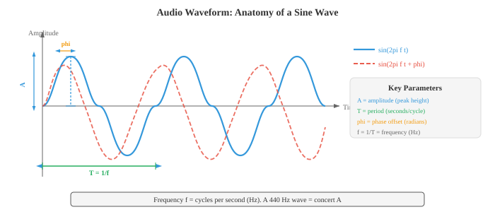
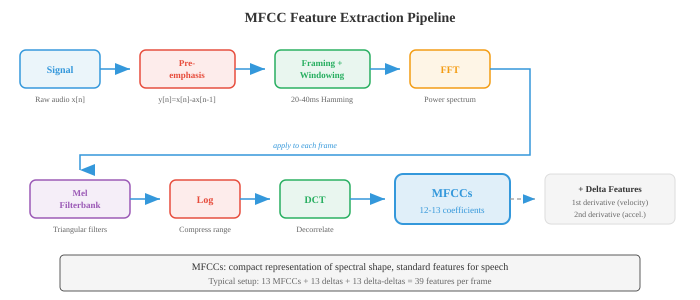

# Цифровая обработка сигналов

*Цифровая обработка сигналов преобразует необработанные аудиосигналы в структурированные представления, на которых могут учиться модели машинного обучения. В этом файле описаны физика звука, дискретизация и квантование, преобразование Фурье (DFT, FFT), спектрограммы, банки мел-фильтров, MFCC и оконная обработка, конвейер извлечения функций для всего речевого и аудио AI.*

- **Звук** – это волна давления, распространяющаяся в среде (воздухе, воде, твердых телах). Вибрирующий объект (голосовая связка, гитарная струна, диффузор динамика) толкает и притягивает молекулы воздуха, создавая чередующиеся области высокого давления (сжатия) и низкого давления (разрежения). 

- Эти колебания давления распространяются по воздуху со скоростью примерно 343 м/с и достигают вашего уха, где вызывают вибрацию барабанной перепонки и преобразуются в нервные сигналы.

- Думайте о звуке как о брошенном камне в спокойный пруд: камень — это источник вибрации, рябь — это волна давления, а пробка, покачивающаяся на поверхности, — это микрофон или барабанная перепонка, реагирующая на приход волны. 

– Высота покачивания пробки — это **амплитуда**, частота колебаний пробки в секунду — это **частота**, а то, начинается ли пробка в верхней или нижней части ее качания в момент прихода волны, — это **фаза**.

– **Форма волны** – это график зависимости давления (или напряжения после того, как микрофон преобразует звук в электрический сигнал) от времени. Самая простая форма сигнала — это **чистый тон**, одна синусоида:

$$x(t) = A \sin(2\pi f t + \phi)$$

- где:
    - $A$ - амплитуда (пиковое отклонение от нуля, определяющее громкость), 
    - $f$ — частота в Гц (циклов в секунду, определяющая высоту тона), 
    - $\phi$ — фаза в радианах (смещение волны по времени). 
    
- **Период** – это $T = 1/f$, продолжительность одного полного цикла.



- **Амплитуда** определяет воспринимаемую громкость. Удвоение амплитуды увеличивает мощность в четыре раза (поскольку мощность пропорциональна квадрату амплитуды). 

- Человеческий слух охватывает огромный диапазон амплитуд, поэтому мы используем логарифмическую шкалу: **децибел** (дБ). Уровень звукового давления составляет:

$$L = 20 \log_{10}\left(\frac{A}{A_\text{ref}}\right) \text{ dB}$$

- где $A_\text{ref}$ — эталонная амплитуда (обычно порог слышимости, $20 \mu\text{Pa}$). Шепот около 30 дБ, обычный разговор 60 дБ, рок-концерт 110 дБ. Каждое увеличение на 6 дБ примерно удваивает амплитуду; каждые 10 дБ увеличения примерно удваивают воспринимаемую громкость. Логарифм здесь — та же функция из главы 03.

- **Частота** определяет высоту звука. Низкие частоты (20-250 Гц) звуковые басы; Высокие частоты (2000-20000 Гц) звучат высоких частот. Человеческий слух охватывает диапазон примерно от 20 Гц до 20 кГц. Концерт А — 440 Гц. Удвоение частоты повышает высоту звука на одну **октаву**. 

- Большинство естественных звуков представляют собой не чистые тона, а сложные смеси многих частот, поэтому фортепиано и скрипка, играющие одну и ту же ноту, звучат по-разному: они имеют одну и ту же **основную частоту**, но различаются своими **гармониками** (целыми числами, кратными основной частоте) и относительными амплитудами (**тембром**).

- **Фаза** определяет, где в цикле начинается волна. Две волны с одинаковой амплитудой и частотой, но с разными фазами могут интерферировать конструктивно (фазы совпадают, амплитуды складываются) или деструктивно (фазы противоположны, амплитуды сокращаются). 

- Фаза имеет решающее значение в стереозвуке и формировании луча, но в значительной степени игнорируется во многих конвейерах обработки речи, поскольку восприятие высоты звука и тембра человека в основном фазово-инвариантно.

- Реальные аудиосигналы представляют собой **непрерывные** функции времени, но компьютеры работают с дискретными числами. **Выборка** преобразует непрерывный сигнал в дискретную последовательность путем измерения значения сигнала через равные промежутки времени. 

– **Частота выборки** $f_s$ – это количество измерений в секунду. Аудио компакт-диска использует $f_s = 44{,}100$ Гц; телефония использует частоту 8000 Гц; современные речевые модели обычно используют частоту 16000 Гц.

- **Теорема Найквиста-Шеннона** гласит, что непрерывный сигнал может быть полностью восстановлен по его выборкам тогда и только тогда, когда частота дискретизации как минимум в два раза превышает самую высокую частоту, присутствующую в сигнале:

$$f_s \geq 2 f_\text{max}$$- Частота $f_s / 2$ называется **частотой Найквиста**. Если сигнал содержит частоты выше частоты Найквиста, эти частоты возвращаются в допустимый диапазон и отображаются как ложные низкочастотные компоненты. Это явление называется **алиасинг**. Совмещение необратимо: если оно возникло, исходный сигнал невозможно восстановить из сэмплов.

- Повседневной аналогией сглаживания является эффект колеса телеги в фильмах: кажется, что колесо, вращающееся с частотой чуть выше частоты кадров, медленно вращается назад, потому что камера занижает частоту вращения. В аудио тон 15 кГц, дискретизированный на частоте 16 кГц ($f_\text{Nyquist} = 8$ кГц), псевдонимом $16 - 15 = 1$ кГц, совершенно другой высоты.


- Чтобы предотвратить наложение, **фильтр сглаживания** (фильтр нижних частот) удаляет все частоты выше $f_s/2$ перед семплированием. Это применяется аппаратным обеспечением аналого-цифрового преобразователя (АЦП) перед оцифровкой сигнала.

- **Квантование** сопоставляет каждую выборку с непрерывными значениями с ближайшим значением в конечном наборе уровней. Битовый квантователь $n$ имеет уровни $2^n$. Звук компакт-диска использует 16-битное квантование (уровни $2^{16} = 65{,}536$); в телефонии часто используется 8-битный формат с $\mu$-законом или **компандированием** по закону A (нелинейное отображение, которое выделяет больше уровней для малых амплитуд, что соответствует человеческому восприятию). Квантование вводит **шум квантования**, форму ошибки округления с отклонением $\Delta^2/12$, где $\Delta$ — размер шага между уровнями.

- **Анализ во временной области** извлекает характеристики непосредственно из формы сигнала, не преобразовывая ее в другую область. Эти функции просты, быстро вычисляются и фиксируют основные свойства сигнала.

- **Энергия** кадра семплов $N$ измеряет общую громкость:

$$E = \sum_{n=0}^{N-1} x[n]^2$$

- Речевые сегменты обладают высокой энергией; молчание имеет низкую энергию. Энергия — это квадрат нормы $\ell_2$ из главы 01, примененный к вектору сигнала.

- **Скорость перехода через ноль** (ZCR) подсчитывает, как часто сигнал меняет знак в кадре:

$$\text{ZCR} = \frac{1}{2(N-1)} \sum_{n=1}^{N-1} |\text{sign}(x[n]) - \text{sign}(x[n-1])|$$

- Высокий ZCR указывает на высокочастотный контент или шум; низкий ZCR указывает на низкочастотную или звонкую речь (при которой голосовые связки периодически вибрируют). ZCR — это грубый инструмент оценки частоты: чистый тон с частотой $f$ Гц пересекает ноль $2f$ раз в секунду.

- **Автокорреляция** измеряет, насколько сигнал похож на свою отложенную копию:

$$R[k] = \sum_{n=0}^{N-1-k} x[n] \cdot x[n+k]$$

- При задержке $k = 0$ автокорреляция равна энергии. Для периодических сигналов автокорреляция имеет пики с задержками, равными периоду и его кратным значениям. Это стандартный метод **обнаружения высоты звука**: найдите первый значимый пик в $R[k]$ после $k=0$, а высота равна $f_s / k_\text{peak}$. Автокорреляция связана со скалярным произведением из главы 01: $R[k]$ — это скалярное произведение сигнала со сдвинутой $k$ версией.

- **Анализ в частотной области** выявляет спектральный состав сигнала, информацию, невидимую в форме сигнала. Ключевым инструментом является **Дискретное преобразование Фурье** (DFT), которое разлагает сигнал выборок $N$ на комплексные частотные компоненты $N$:

$$X[k] = \sum_{n=0}^{N-1} x[n] \cdot e^{-j 2\pi k n / N}, \quad k = 0, 1, \ldots, N-1$$

- Каждый $X[k]$ представляет собой комплексное число, величина которого $|X[k]|$ дает амплитуду частотной составляющей на уровне $f_k = k \cdot f_s / N$ Гц, а фаза $\angle X[k]$ дает смещение фазы. ДПФ представляет собой замену базиса с базиса во временной области (единичные импульсы) на базис в частотной области (комплексные экспоненты), что является прямым применением концепции базиса из главы 02. ДПФ можно записать как матричное умножение $\mathbf{X} = W \mathbf{x}$, где $W$ — это $N \times N$ матрица ДПФ с записями. $W_{kn} = e^{-j2\pi kn/N}$.- **Быстрое преобразование Фурье** (БПФ) — это алгоритм, который вычисляет ДПФ с помощью операций $O(N \log N)$ вместо наивного $O(N^2)$ путем рекурсивного разделения задачи на подзадачи с четным и нечетным индексом (алгоритм Кули-Тьюки). Именно это ускорение делает спектральный анализ в реальном времени практичным. БПФ — один из наиболее важных алгоритмов во всех вычислениях.

- **Спектр мощности** $|X[k]|^2$ показывает распределение энергии по частотам. **Спектр магнитуд** $|X[k]|$ показывает амплитуду. Построение их графика показывает, какие частоты доминируют в сигнале: гласная имеет сильные гармоники, кратные основной частоте; фрикативный звук (например, «s») имеет широкую высокочастотную энергию.

– **Спектрограмма** – это визуальное представление того, как частотный состав сигнала меняется с течением времени. Он вычисляется путем разделения сигнала на короткие перекрывающиеся кадры, вычисления БПФ каждого кадра и сложения полученных спектров величин рядом. Горизонтальная ось — время, вертикальная ось — частота, а цвет (или яркость) в каждой точке представляет величину. Спектрограмма — это самая важная визуализация при обработке звука.


- **Мел-шкала** – это шкала перцептивных частот, которая отражает то, как люди воспринимают высоту звука. Люди воспринимают равные соотношения частот как равные интервалы высоты звука (точно так же, как мы воспринимаем равные соотношения интенсивности как равные интервалы громкости). Ниже примерно 1000 Гц шкала мела приблизительно линейна; выше 1000 Гц оно становится примерно логарифмическим:

$$m = 2595 \log_{10}\left(1 + \frac{f}{700}\right)$$

- Обратный вариант: $f = 700(10^{m/2595} - 1)$. Меловая шкала является причиной того, что музыкальные полутона равномерно распределены по логарифмической оси частот: от A4 (440 Гц) до A5 (880 Гц) и от A5 до A6 (1760 Гц) оба звучат как «на одну октаву выше», хотя промежутки в Гц составляют 440 и 880 соответственно.

- **Банк фильтров Mel** — это набор треугольных полосовых фильтров, равномерно расположенных по шкале Mel. Каждый фильтр охватывает определенный диапазон частот и суммирует спектральную энергию в этом диапазоне, создавая одно число. Типичные речевые системы используют фильтры 40-80 мел. Низкочастотные фильтры узкие (высокое разрешение, при котором мы чувствительны), а высокочастотные фильтры широкие (низкое разрешение, при котором мы менее чувствительны). Это имитирует частотное разрешение улитки человека.


- **Кепстральные коэффициенты Mel-Frequency** (MFCC) — это классическое представление характеристик речи и звука. Они сжимают мел-спектр в небольшое количество декоррелированных коэффициентов, которые фиксируют форму спектральной огибающей (которая кодирует конфигурацию голосового тракта и, следовательно, фонетическую идентичность), отбрасывая при этом мелкие спектральные детали (которые кодируют высоту и фазу).

- Трубопровод MFCC:
    1. **Предварительное выделение**: примените фильтр верхних частот первого порядка $y[n] = x[n] - \alpha x[n-1]$ (обычно $\alpha = 0.97$) для усиления высоких частот, которые ослабляются речевым трактом.
    2. **Кадрирование**: разбивка сигнала на перекрывающиеся кадры (обычно длительностью 25 мс с шагом 10 мс).
    3. **Окно**: умножьте каждый кадр на оконную функцию (Хемминга), чтобы уменьшить утечку спектра (см. ниже).
    4. **БПФ**: вычисление спектра мощности каждого оконного кадра.
    5. **Банк мел-фильтров**: применение треугольного набора мел-фильтров к спектру мощности для получения энергии мел-диапазона.
    6. **Журнал**: логарифм энергий мел-диапазона. Журнал сжимает динамический диапазон и преобразует умножение (спектральных компонентов) в сложение, что соответствует восприятию громкости человеком.
    7. **DCT**: примените дискретное косинусное преобразование к логарифмическим энергиям. DCT декоррелирует мел-зоны (поскольку соседние полосы сильно коррелированы) и уплотняет энергию в первые несколько коэффициентов. Сохраните первые 13 коэффициентов (от MFCC-0 до MFCC-12).

- ДКП на шаге 7 представляет собой, по сути, «преобразование Фурье спектра» (отсюда и название **цепстр** = анаграмма спектра). Кепстральные коэффициенты низкого порядка улавливают широкую форму спектра (резонансы голосового тракта, называемые **формантами**), тогда как коэффициенты высокого порядка улавливают мелкие детали спектра (высотные гармоники). Оставляя только первые 13, мы сохраняем формантную информацию и отбрасываем детали высоты звука.

- **Дельта** и **дельта-дельта** MFCC (первая и вторая производные по времени от MFCC, вычисляемые по конечным разностям между соседними кадрами) фиксируют динамику формы спектра, добавляя временной контекст. Полный вектор признаков MFCC часто бывает 39-мерным: 13 статических + 13 дельта + 13 дельта-дельта.

- Современные модели нейронных сетей (глава 06) в значительной степени заменили MFCC изученными функциями: спектрограммы log-mel (выходные данные шага 6, пропуская DCT) являются стандартными входными данными для глубокого обучения ASR и классификации аудио. Модель изучает собственную декорреляцию. Тем не менее, MFCC остаются важными для настроек с низким уровнем ресурсов, классических конвейеров машинного обучения и понимания основ обработки сигналов.

- **Окно** — это процесс умножения сигнального кадра на гладкую оконную функцию перед вычислением БПФ. Без использования окон БПФ предполагает, что кадр повторяется бесконечно; резкое начало и конец кадра создают искусственные разрывы, которые распределяют энергию по всем частотам — артефакт, называемый **спектральной утечкой**.

- **Прямоугольное окно** $w[n] = 1$ для всех $n$: нет сужения, максимальная утечка, но самый широкий главный лепесток (наилучшее разрешение по частоте для заданной длины кадра). На практике используется редко.

- **Окно Хэмминга**: $w[n] = 0.54 - 0.46 \cos(2\pi n / (N-1))$. Сужается почти до нуля по краям, что значительно снижает утечку. Стандартный выбор для обработки речи.

- **Окно Ханна** (также называемое Ханнингом): $w[n] = 0.5 - 0.5 \cos(2\pi n / (N-1))$. По краям сужается точно к нулю. Очень похоже на Хэмминга, но с немного лучшим подавлением боковых лепестков.

- **Окно Блэкмана**: $w[n] = 0.42 - 0.5 \cos(2\pi n / (N-1)) + 0.08 \cos(4\pi n / (N-1))$. Еще лучшее подавление боковых лепестков, но более широкий основной лепесток (худшее разрешение по частоте). Используется, когда артефакты боковых лепестков особенно проблематичны.

- Существует фундаментальный компромисс: окна с меньшими утечками имеют более широкие основные лепестки, а это означает, что они не могут разрешить две близко расположенные частоты. Это **компромисс спектрального разрешения и утечки**, следствие принципа неопределенности из главы 03.

- **Перекрытие-добавление** (OLA) — это метод восстановления сигнала из оконных обработанных кадров. Кадры перекрываются (обычно 50–75%), и после обработки оконные выходные данные суммируются. Если окно и перекрытие выбраны правильно (например, окно Ханна с перекрытием 50%), сумма перекрывающихся окон равна константе, что дает идеальную реконструкцию. Это важно для любой покадровой модификации звука (шумоподавление, сдвиг высоты тона, растяжение времени).

- **Кратковременное преобразование Фурье** (STFT) — это формальная основа, лежащая в основе спектрограмм. Он применяет ДПФ к каждому оконному кадру сигнала:

```math
\text{STFT}\{x[n]\}(m, k) = \sum_{n=0}^{N-1} x[n + mH] \cdot w[n] \cdot e^{-j 2\pi k n / N}
```

- где $m$ - индекс кадра, $H$ - размер скачка (количество выборок между последовательными кадрами), $w[n]$ - оконная функция, а $N$ - размер БПФ. Выходные данные представляют собой двумерную комплексную матрицу: **частотно-временное представление** сигнала.

- STFT воплощает в себе фундаментальный **компромисс «частота-время»**:
    - Длинные кадры (большие $N$): высокое разрешение по частоте (можно различать близко расположенные частоты), но плохое временное разрешение (невозможно определить момент изменения частоты).
    - Короткие кадры (маленькие $N$): высокое временное разрешение, но плохое частотное разрешение.
    - Произведение временного разрешения и частотного разрешения ограничено ниже: $\Delta t \cdot \Delta f \geq \frac{1}{4\pi}$. Это **предел Габора**, аналог принципа неопределенности Гейзенберга из физики.

- Типичные параметры речевого STFT: длина кадра 25 мс ($N = 400$ при 16 кГц), скачок 10 мс ($H = 160$), окно Хэмминга, 512-точечное БПФ (дополненное нулями от 400 для эффективности и более плавной спектральной интерполяции).- **Фильтрация** изменяет частотный состав сигнала, усиливая одни частоты и ослабляя другие. **Фильтр** — это система, которая принимает входной сигнал и выдает выходной сигнал. Фильтры характеризуются своей **частотной характеристикой** $H(f)$, которая описывает усиление и фазовый сдвиг, применяемые к каждой частоте.

- **Фильтр нижних частот**: пропускает частоты ниже частоты среза $f_c$ и ослабляет частоты выше нее. Удаляет высокочастотный шум и детализацию. Фильтр сглаживания перед дискретизацией представляет собой фильтр нижних частот.

- **Фильтр верхних частот**: пропускает частоты выше $f_c$ и ослабляет ниже. Устраняет низкочастотный грохот и смещение постоянного тока. Фильтр предыскажений при извлечении MFCC ($y[n] = x[n] - 0.97 x[n-1]$) представляет собой простой фильтр верхних частот.

- **Полосовой фильтр**: пропускает частоты в пределах диапазона $[f_1, f_2]$ и ослабляет за его пределами. Каждый треугольник в наборе фильтров mel является полосовым фильтром.

- **Режекторный фильтр**: ослабляет определенный узкий частотный диапазон. Используется для устранения специфических помех (например, шума линии электропередачи частотой 50/60 Гц).

- Фильтр **конечная импульсная характеристика** (FIR) вычисляет каждую выходную выборку как взвешенную сумму текущих и прошлых входных выборок:

$$y[n] = \sum_{k=0}^{M} b_k \cdot x[n-k]$$

– Веса $b_k$ — это **коэффициенты фильтра** (также называемые **отводами**). Фильтр имеет номер $M$. КИХ-фильтры всегда стабильны (выходной сигнал никогда не расходится) и могут иметь идеально линейную фазу (все частоты задерживаются на одинаковую величину, сохраняя форму сигнала). Их недостатком является то, что для достижения резкого отсечения требуется много нажатий (высокий уровень $M$), что увеличивает объем вычислений. Выходные данные представляют собой свертку входных данных с вектором коэффициентов, то есть операцию одномерной свертки из главы 06.

- Фильтр **Бесконечная импульсная характеристика** (БИХ) использует обратную связь: выходной сигнал зависит как от прошлых входов, так и от прошлых выходов:

```math
y[n] = \sum_{k=0}^{M} b_k \cdot x[n-k] - \sum_{k=1}^{L} a_k \cdot y[n-k]
```

- Условия обратной связи $a_k$ создают рекурсивную структуру, импульсная характеристика которой теоретически бесконечна по длительности. БИХ-фильтры обеспечивают резкие срезы с гораздо меньшим количеством коэффициентов, чем КИХ-фильтры, но они могут быть нестабильными (выходной сигнал растет неограниченно, если полюса передаточной функции лежат за пределами единичного круга - концепция преобразования $z$). Они также имеют нелинейную фазу, которая может искажать форму сигнала. Классические конструкции фильтров (Баттерворта, Чебышева, эллиптические) являются БИХ.

- **Передаточная функция** дискретного фильтра получается с помощью преобразования $z$:

$$H(z) = \frac{\sum_{k=0}^{M} b_k z^{-k}}{1 + \sum_{k=1}^{L} a_k z^{-k}}$$

– Корни числителя называются **нулями**, а корни знаменателя – **полюсами**. График полюс-ноль полностью характеризует поведение фильтра. Полюса рядом с единичным кругом усиливают близлежащие частоты; нули возле единичного круга их ослабляют. КИХ-фильтры имеют только нули (знаменатель равен 1). Это связано с концепциями собственных значений и поиска корней из глав 02 и 03.

- **Теорема о свертке**: свертка во временной области равна поэлементному умножению в частотной области. Это означает, что фильтрацию можно выполнять либо путем прямой свертки сигнала с импульсной характеристикой фильтра, либо путем умножения их преобразований Фурье и обратного преобразования результата. Для длинных фильтров подход в частотной области (с использованием БПФ) работает быстрее: $O(N \log N)$ по сравнению с $O(NM)$.

- **обратный STFT** (iSTFT) восстанавливает сигнал во временной области из его представления STFT. Это важно для любой системы, которая изменяет звук в частотной области (шумоподавление, разделение источников, преобразование голоса). Реконструкция использует перекрытие-добавление:

```math
x[n] = \frac{\sum_{m} w[n - mH] \cdot \text{IDFT}\{X(m, k)\}[n - mH]}{\sum_{m} w[n - mH]^2}
```

- Знаменатель нормализуется для перекрытия окон, обеспечивая идеальную реконструкцию, когда окно синтеза соответствует окну анализа и перекрытие достаточно.- **Краткое описание цепочки DSP для речи**: необработанный звук дискретизируется с частотой 16 кГц, предварительно выделяется, разбивается на кадры с окном Хэмминга длительностью 25 мс и шагом 10 мс, каждый кадр преобразуется с помощью FFT, проходит через набор фильтров mel, логарифмически сжимается и либо сохраняется как функции log-mel (для моделей нейронных сетей), либо преобразуется DCT для получения MFCC (для классических моделей). Вся эта цепочка преобразует 1D-сигнал во временной области в 2D-частотно-временное представление, подходящее для последующего машинного обучения, что будет предметом файла 02.

## Задачи по кодированию (используйте CoLab или блокнот)

1. Сгенерируйте синусоидальный сигнал, опробуйте его с разной частотой и продемонстрируйте наложение спектров. Постройте непрерывный сигнал, правильно дискретизированную версию и недостаточно дискретизированную (с псевдонимом) версию.
```python
import jax.numpy as jnp
import matplotlib.pyplot as plt

# Parameters
f_signal = 5.0  # 5 Hz signal
duration = 1.0  # 1 second

# "Continuous" signal (very high sample rate)
t_cont = jnp.linspace(0, duration, 10000)
x_cont = jnp.sin(2 * jnp.pi * f_signal * t_cont)

# Properly sampled (fs = 50 Hz, well above Nyquist = 10 Hz)
fs_good = 50
t_good = jnp.arange(0, duration, 1.0 / fs_good)
x_good = jnp.sin(2 * jnp.pi * f_signal * t_good)

# Under-sampled (fs = 7 Hz, below Nyquist = 10 Hz) -> aliasing
fs_bad = 7
t_bad = jnp.arange(0, duration, 1.0 / fs_bad)
x_bad = jnp.sin(2 * jnp.pi * f_signal * t_bad)

# The aliased frequency: |f_signal - fs_bad| = |5 - 7| = 2 Hz
f_alias = abs(f_signal - fs_bad)
x_alias_cont = jnp.sin(2 * jnp.pi * f_alias * t_cont)

fig, axes = plt.subplots(3, 1, figsize=(12, 9))

# Plot 1: original signal
axes[0].plot(t_cont, x_cont, color='#3498db', linewidth=1.5, label=f'Original {f_signal} Hz')
axes[0].set_title(f'Original {f_signal} Hz Signal')
axes[0].set_xlabel('Time (s)'); axes[0].set_ylabel('Amplitude')
axes[0].legend(); axes[0].grid(True, alpha=0.3)

# Plot 2: proper sampling
axes[1].plot(t_cont, x_cont, color='#3498db', linewidth=1, alpha=0.4, label='Original')
axes[1].stem(t_good, x_good, linefmt='#27ae60', markerfmt='o', basefmt='k-',
             label=f'Sampled at {fs_good} Hz (above Nyquist)')
axes[1].set_title(f'Proper Sampling: fs = {fs_good} Hz > 2 x {f_signal} Hz')
axes[1].set_xlabel('Time (s)'); axes[1].set_ylabel('Amplitude')
axes[1].legend(); axes[1].grid(True, alpha=0.3)

# Plot 3: aliased sampling
axes[2].plot(t_cont, x_cont, color='#3498db', linewidth=1, alpha=0.4, label='Original')
axes[2].stem(t_bad, x_bad, linefmt='#e74c3c', markerfmt='o', basefmt='k-',
             label=f'Sampled at {fs_bad} Hz (below Nyquist)')
axes[2].plot(t_cont, x_alias_cont, color='#f39c12', linewidth=1.5, linestyle='--',
             label=f'Aliased signal appears as {f_alias} Hz')
axes[2].set_title(f'Aliased Sampling: fs = {fs_bad} Hz < 2 x {f_signal} Hz')
axes[2].set_xlabel('Time (s)'); axes[2].set_ylabel('Amplitude')
axes[2].legend(); axes[2].grid(True, alpha=0.3)

plt.tight_layout(); plt.show()
```

2. Вычислите и визуализируйте БПФ сигнала, состоящего из нескольких синусоид. Покажите спектр магнитуды и определите составляющие частоты.
```python
import jax.numpy as jnp
import matplotlib.pyplot as plt

# Create a composite signal: 220 Hz + 440 Hz + 880 Hz (A3 + A4 + A5)
fs = 8000  # 8 kHz sample rate
duration = 0.1  # 100 ms
t = jnp.arange(0, duration, 1.0 / fs)
n_samples = len(t)

# Three frequency components with different amplitudes
x = 1.0 * jnp.sin(2 * jnp.pi * 220 * t) + \
    0.6 * jnp.sin(2 * jnp.pi * 440 * t) + \
    0.3 * jnp.sin(2 * jnp.pi * 880 * t)

# Compute FFT
X = jnp.fft.fft(x)
freqs = jnp.fft.fftfreq(n_samples, d=1.0 / fs)
magnitude = jnp.abs(X) / n_samples  # normalise

# Only plot positive frequencies
pos_mask = freqs >= 0
freqs_pos = freqs[pos_mask]
mag_pos = magnitude[pos_mask] * 2  # double to account for negative freq energy

fig, axes = plt.subplots(2, 1, figsize=(12, 7))

# Time domain
axes[0].plot(t * 1000, x, color='#3498db', linewidth=1)
axes[0].set_title('Composite Signal: 220 Hz + 440 Hz + 880 Hz')
axes[0].set_xlabel('Time (ms)'); axes[0].set_ylabel('Amplitude')
axes[0].grid(True, alpha=0.3)

# Frequency domain
axes[1].plot(freqs_pos, mag_pos, color='#e74c3c', linewidth=1.5)
axes[1].set_title('Magnitude Spectrum (FFT)')
axes[1].set_xlabel('Frequency (Hz)'); axes[1].set_ylabel('Magnitude')
axes[1].set_xlim(0, 1500)
# Annotate peaks
for f_peak, amp in [(220, 1.0), (440, 0.6), (880, 0.3)]:
    axes[1].annotate(f'{f_peak} Hz', xy=(f_peak, amp), fontsize=10,
                     ha='center', va='bottom', color='#9b59b6',
                     arrowprops=dict(arrowstyle='->', color='#9b59b6'))
axes[1].grid(True, alpha=0.3)

plt.tight_layout(); plt.show()
```

3. Создайте полный конвейер MFCC с нуля в JAX: предыскажение, кадрирование, оконное управление, FFT, набор фильтров mel, журнал, DCT. Визуализируйте набор фильтров mel и полученные MFCC в виде тепловой карты.
```python
import jax
import jax.numpy as jnp
import matplotlib.pyplot as plt

# --- Generate a synthetic speech-like signal ---
key = jax.random.PRNGKey(42)
fs = 16000
duration = 1.0
t = jnp.arange(0, duration, 1.0 / fs)

# Simulate voiced speech: fundamental + harmonics with amplitude decay
f0 = 150.0  # fundamental frequency
x = sum(jnp.sin(2 * jnp.pi * f0 * k * t) / k for k in range(1, 8))
# Add some noise
x = x + 0.1 * jax.random.normal(key, t.shape)
x = x / jnp.max(jnp.abs(x))  # normalise

# --- Step 1: Pre-emphasis ---
alpha = 0.97
x_pre = jnp.concatenate([x[:1], x[1:] - alpha * x[:-1]])

# --- Step 2: Framing ---
frame_len = int(0.025 * fs)   # 25 ms = 400 samples
hop_len = int(0.010 * fs)     # 10 ms = 160 samples
n_frames = (len(x_pre) - frame_len) // hop_len + 1
frames = jnp.stack([x_pre[i * hop_len : i * hop_len + frame_len]
                     for i in range(n_frames)])

# --- Step 3: Hamming window ---
hamming = 0.54 - 0.46 * jnp.cos(2 * jnp.pi * jnp.arange(frame_len) / (frame_len - 1))
windowed = frames * hamming

# --- Step 4: FFT ---
n_fft = 512
spectra = jnp.fft.rfft(windowed, n=n_fft)
power_spectra = jnp.abs(spectra) ** 2 / n_fft

# --- Step 5: Mel filterbank ---
n_mels = 40
f_min, f_max = 0.0, fs / 2.0

def hz_to_mel(f):
    return 2595 * jnp.log10(1 + f / 700)

def mel_to_hz(m):
    return 700 * (10 ** (m / 2595) - 1)

mel_min = hz_to_mel(f_min)
mel_max = hz_to_mel(f_max)
mel_points = jnp.linspace(mel_min, mel_max, n_mels + 2)
hz_points = mel_to_hz(mel_points)

freq_bins = jnp.floor((n_fft + 1) * hz_points / fs).astype(jnp.int32)
n_freqs = n_fft // 2 + 1
filterbank = jnp.zeros((n_mels, n_freqs))

for m in range(n_mels):
    f_left = freq_bins[m]
    f_center = freq_bins[m + 1]
    f_right = freq_bins[m + 2]
    # Rising slope
    for k in range(int(f_left), int(f_center)):
        if f_center != f_left:
            filterbank = filterbank.at[m, k].set((k - f_left) / (f_center - f_left))
    # Falling slope
    for k in range(int(f_center), int(f_right)):
        if f_right != f_center:
            filterbank = filterbank.at[m, k].set((f_right - k) / (f_right - f_center))

# Apply filterbank
mel_spectra = jnp.dot(power_spectra, filterbank.T)

# --- Step 6: Log ---
log_mel = jnp.log(mel_spectra + 1e-10)

# --- Step 7: DCT (type-II) ---
n_mfcc = 13
n_mel_channels = log_mel.shape[1]
dct_matrix = jnp.zeros((n_mfcc, n_mel_channels))
for i in range(n_mfcc):
    for j in range(n_mel_channels):
        dct_matrix = dct_matrix.at[i, j].set(
            jnp.cos(jnp.pi * i * (j + 0.5) / n_mel_channels)
        )
mfccs = jnp.dot(log_mel, dct_matrix.T)

# --- Visualisation ---
fig, axes = plt.subplots(3, 1, figsize=(14, 11))

# Mel filterbank
freq_axis = jnp.linspace(0, fs / 2, n_freqs)
for m in range(n_mels):
    color = '#3498db' if m % 2 == 0 else '#e74c3c'
    axes[0].plot(freq_axis, filterbank[m], color=color, alpha=0.6, linewidth=0.8)
axes[0].set_title(f'Mel Filterbank ({n_mels} filters)')
axes[0].set_xlabel('Frequency (Hz)'); axes[0].set_ylabel('Weight')
axes[0].grid(True, alpha=0.3)

# Log-mel spectrogram
im1 = axes[1].imshow(log_mel.T, aspect='auto', origin='lower',
                      extent=[0, duration, 0, n_mels], cmap='viridis')
axes[1].set_title('Log-Mel Spectrogram')
axes[1].set_xlabel('Time (s)'); axes[1].set_ylabel('Mel Band')
plt.colorbar(im1, ax=axes[1], label='Log Energy')

# MFCCs
im2 = axes[2].imshow(mfccs.T, aspect='auto', origin='lower',
                      extent=[0, duration, 0, n_mfcc], cmap='coolwarm')
axes[2].set_title(f'MFCCs (first {n_mfcc} coefficients)')
axes[2].set_xlabel('Time (s)'); axes[2].set_ylabel('MFCC Index')
plt.colorbar(im2, ax=axes[2], label='Coefficient Value')

plt.tight_layout(); plt.show()
```

4. Реализуйте КИХ-фильтры нижних и верхних частот и визуализируйте их влияние на сигнал, содержащий как низкочастотные, так и высокочастотные компоненты. Покажите представления как во временной, так и в частотной области.
```python
import jax
import jax.numpy as jnp
import matplotlib.pyplot as plt

# Create a signal with low (100 Hz) and high (2000 Hz) components
fs = 8000
duration = 0.05  # 50 ms for clear visualisation
t = jnp.arange(0, duration, 1.0 / fs)

x_low = jnp.sin(2 * jnp.pi * 100 * t)
x_high = 0.5 * jnp.sin(2 * jnp.pi * 2000 * t)
x = x_low + x_high

# Design a simple FIR low-pass filter using windowed sinc
def fir_lowpass(cutoff_hz, fs, n_taps=51):
    """Design FIR low-pass filter using windowed sinc method."""
    fc = cutoff_hz / fs  # normalised cutoff
    n = jnp.arange(n_taps)
    mid = (n_taps - 1) / 2.0
    # Sinc function (ideal low-pass impulse response)
    h = jnp.where(n == mid, 2 * fc,
                  jnp.sin(2 * jnp.pi * fc * (n - mid)) / (jnp.pi * (n - mid)))
    # Apply Hamming window
    window = 0.54 - 0.46 * jnp.cos(2 * jnp.pi * n / (n_taps - 1))
    h = h * window
    h = h / jnp.sum(h)  # normalise to unity gain at DC
    return h

def apply_filter(x, h):
    """Apply FIR filter via convolution."""
    return jnp.convolve(x, h, mode='same')

# Low-pass filter at 500 Hz (passes 100 Hz, blocks 2000 Hz)
h_lp = fir_lowpass(500, fs, n_taps=51)
x_lp = apply_filter(x, h_lp)

# High-pass = delta - low-pass (spectral inversion)
delta = jnp.zeros(51)
delta = delta.at[25].set(1.0)
h_hp = delta - h_lp
x_hp = apply_filter(x, h_hp)

# Compute spectra for all signals
def compute_spectrum(signal, fs):
    X = jnp.fft.rfft(signal)
    freqs = jnp.fft.rfftfreq(len(signal), d=1.0 / fs)
    mag = jnp.abs(X) / len(signal) * 2
    return freqs, mag

fig, axes = plt.subplots(3, 2, figsize=(14, 10))

# Time domain plots
for i, (sig, title, color) in enumerate([
    (x, 'Original (100 Hz + 2000 Hz)', '#3498db'),
    (x_lp, 'Low-pass filtered (< 500 Hz)', '#27ae60'),
    (x_hp, 'High-pass filtered (> 500 Hz)', '#e74c3c')
]):
    axes[i, 0].plot(t * 1000, sig[:len(t)], color=color, linewidth=1)
    axes[i, 0].set_title(f'Time Domain: {title}')
    axes[i, 0].set_xlabel('Time (ms)'); axes[i, 0].set_ylabel('Amplitude')
    axes[i, 0].grid(True, alpha=0.3)

# Frequency domain plots
for i, (sig, title, color) in enumerate([
    (x, 'Original', '#3498db'),
    (x_lp, 'Low-pass', '#27ae60'),
    (x_hp, 'High-pass', '#e74c3c')
]):
    freqs, mag = compute_spectrum(sig, fs)
    axes[i, 1].plot(freqs, mag, color=color, linewidth=1.5)
    axes[i, 1].set_title(f'Spectrum: {title}')
    axes[i, 1].set_xlabel('Frequency (Hz)'); axes[i, 1].set_ylabel('Magnitude')
    axes[i, 1].set_xlim(0, 3000)
    axes[i, 1].axvline(x=500, color='#f39c12', linestyle='--', alpha=0.7,
                        label='Cutoff (500 Hz)')
    axes[i, 1].legend(); axes[i, 1].grid(True, alpha=0.3)

plt.tight_layout(); plt.show()
```