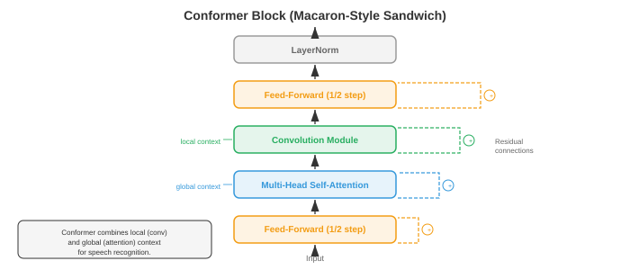

# Автоматическое распознавание речи

*Автоматическое распознавание речи преобразует устный звук в письменный текст, устраняя разрыв между человеческой речью и машиночитаемым языком. В этом файле описаны GMM-HMM, потери CTC, RNN-преобразователь, модели кодирования-декодера на основе внимания (LAS), Whisper и сквозное ASR, от классических конвейеров до современных нейронных архитектур.*

- **Автоматическое распознавание речи** (ASR) – это задача преобразования устного звука в письменный текст. Это одна из старейших проблем искусственного интеллекта (первые системы в 1950-х годах распознавали однозначные числа) и одна из наиболее коммерчески используемых (голосовые помощники, службы транскрипции, субтитры). 

- Трудность возникает из-за огромной изменчивости речи: разные говорящие, акценты, скорость речи, фоновый шум, характеристики микрофона и фундаментальная неоднозначность преобразования непрерывного акустического сигнала в отдельные слова.

- Думайте об ASR как о стенографистке в зале суда. Стенографистка слышит непрерывный поток звука, мысленно разделяет его на слова, разрешает двусмысленности, используя контекст («они» против «их» против «там») и печатает результат. Система ASR делает то же самое, но поэтапно, которые можно сделать явными и оптимизировать независимо или совместно.

- **Классический конвейер ASR** обрабатывает звук в цепочке отдельных этапов: необработанный звук преобразуется в функции (MFCC или логарифмические спектрограммы, из файла 01), **акустическая модель** оценивает, насколько хорошо каждый кадр объекта соответствует каждой фонетической единице, **модель произношения** (лексикон) сопоставляет фонетические единицы со словами, **языковая модель** оценивает вероятность последовательности слов, а **декодер** выполняет поиск слова последовательность, которая максимизирует совокупный балл. Каждый компонент обучается и настраивается отдельно.


– **Фонемы** – это мельчайшие звуковые единицы, которые различают слова в языке. В английском языке примерно 39-44 фонемы (точное количество зависит от диалекта и используемого набора фонем). Например, «летучая мышь» и «пат» различаются одной фонемой (/b/ vs /p/). Большинство систем ASR моделируют **контекстно-зависимые фонемы**, называемые **трифонами**: фонема, определяемая ее левым и правым соседями (например, «a» в контексте «b_t» отличается от «a» в «c_t»), поскольку на акустическую реализацию фонемы сильно влияют ее соседи (это называется **коартикуляция**).

- Число возможных трифонов огромно (40 фонем в кубе = 64 000), поэтому **кластеризация дерева решений** группирует акустически схожие трифоны в **сеноны** (обычно 2000–10 000 классов). Каждый сенон получает свою акустическую модель. Эта кластеризация представляет собой разновидность алгоритмов дерева решений из главы 06.

- **GMM-HMM** (модель гауссовой смеси – скрытая модель Маркова) была доминирующим подходом к акустическому моделированию с 1980-х до начала 2010-х годов. HMM (из главы 05) моделирует временную структуру речи: каждая фонема представляет собой HMM слева направо с 3–5 состояниями, где каждое состояние представляет собой субфонетический сегмент (начало, середина, смещение). Длительность переходов из одного состояния в другое неявно моделируется.

- В каждом состоянии HMM вероятность выброса (насколько вероятно, что конкретный вектор признаков соответствует этому состоянию) моделируется с помощью **модели смеси Гаусса** (GMM): взвешенной суммы многомерных распределений Гаусса (из главы 05):

```math
p(\mathbf{x} | s) = \sum_{m=1}^{M} w_m \cdot \mathcal{N}(\mathbf{x} ; \boldsymbol{\mu}_m, \boldsymbol{\Sigma}_m)
```

- где $\mathbf{x}$ — вектор признаков (например, 39-мерные MFCC), $s$ — состояние HMM, $M$ — количество компонентов смеси (обычно 8–64), $w_m$ — веса смеси, и $\boldsymbol{\mu}_m$, $\boldsymbol{\Sigma}_m$ — среднее значение и ковариация каждого гауссова компонента. Матрицы ковариации обычно являются диагональными для эффективности вычислений (при условии, что размеры объектов независимы, что примерно верно для MFCC из-за декорреляции DCT).

- В обучении используется **алгоритм Баума-Уэлча** (частный случай EM, из главы 05) для итеративной оценки параметров GMM и вероятностей перехода HMM на основе расшифрованных речевых данных. Декодирование (поиск наиболее вероятной последовательности состояний) использует **алгоритм Витерби** (динамическое программирование, из главы 05):

```math
\delta_t(j) = \max_{i} \left[ \delta_{t-1}(i) \cdot a_{ij} \right] \cdot b_j(\mathbf{x}_t)
```- где $\delta_t(j)$ - вероятность того, что лучший путь оканчивается в состоянии $j$ в момент времени $t$, $a_{ij}$ - вероятность перехода из состояния $i$ в состояние $j$, и $b_j(\mathbf{x}_t)$ — вероятность выброса объекта $\mathbf{x}_t$ в состоянии $j$.

- **DNN-HMM** (Hinton et al., 2012) заменила модель выбросов GMM глубокой нейронной сетью (DNN, из главы 06), которая прогнозирует апостериорные вероятности сенонов $p(s | \mathbf{x})$ из окна фреймов признаков. HMM по-прежнему обрабатывает временную структуру и последовательность, но нейронная сеть обеспечивает гораздо более различительные оценки выбросов. Этот гибридный подход снизил количество ошибок в словах на 20–30% по сравнению с GMM и был доминирующей парадигмой в 2012–2016 годах.

- **Декодирование WFST** (взвешенный преобразователь конечных состояний) — это стандартная структура декодирования для традиционного ASR. Каждый компонент (топология HMM H, контекстная зависимость C, лексикон L, грамматическая/языковая модель G) представлен как взвешенный преобразователь с конечным состоянием, и они составляются в один граф поиска $H \circ C \circ L \circ G$. Затем поиск Витерби находит путь с наименьшей стоимостью в этом составленном графе. WFST позволяют модульное сочетание источников знаний и эффективный динамический программный поиск. Математическая основа взята из теории конечных автоматов (связанной с конечными автоматами в главе 05).

- **Сквозное ASR** исключает отдельные компоненты (модель произношения, инвентарь фонем, декодер WFST) и обучает единую нейронную сеть, которая напрямую сопоставляет аудиофункции с символами или фрагментами слов. Ключевой проблемой является **проблема выравнивания**: входные данные (сотни функциональных кадров в секунду) и выходные данные (несколько символов в секунду) имеют очень разную длину, и выравнивание между ними неизвестно во время обучения.

- **Коннекционистская временная классификация** (CTC) (Graves et al., 2006) решает проблему выравнивания, вводя специальный **пустой** токен и позволяя сети выводить любую последовательность символов и пробелов, при условии, что свертывание последовательных дубликатов и удаление пробелов дает правильную расшифровку. Например, транскрипт «кошка» может быть получен с помощью выходной последовательности «-cc-aa-t--» (где «-» пусто).

- Формально CTC определяет сопоставление $\mathcal{B}$ «многие к одному» из набора всех выходных последовательностей длины $T$ (по алфавиту плюс пробел) для последовательностей меток. Вероятность последовательности меток $\mathbf{y}$ представляет собой сумму всех совпадений, которые схлопываются в нее:

$$P(\mathbf{y} | \mathbf{x}) = \sum_{\boldsymbol{\pi} \in \mathcal{B}^{-1}(\mathbf{y})} \prod_{t=1}^{T} p(\pi_t | \mathbf{x})$$


- Наивное вычисление этой суммы потребовало бы перебора экспоненциального количества выравниваний, но **алгоритм CTC вперед-назад** эффективно вычисляет ее в $O(T \cdot |\mathbf{y}|)$ с использованием динамического программирования, аналогично алгоритму HMM вперед-назад из главы 05.

- CTC делает **условное предположение независимости**: результат на каждом временном шаге не зависит от всех других выходов, учитывая входные данные. Это означает, что CTC не может моделировать выходные зависимости (например, он не может узнать, что за «q» почти всегда следует «u»). Для обработки таких зависимостей необходимо использовать внешнюю языковую модель.

- Параметры **декодирования CTC**:
    - **Жадное декодирование**: на каждом временном шаге берется наиболее вероятный токен, а затем сворачивается. Быстро, но неоптимально.
    - **Лучевой поиск**: сохранение частичных гипотез top-$k$ на каждом этапе, объединяя гипотезы, которые сворачиваются в один и тот же префикс. Может включать оценку языковой модели.
    - **Поиск префиксного луча**: модифицированный поиск луча, который правильно обрабатывает объединение заготовок CTC, гарантируя сравнение гипотез после свертывания.- **RNN-преобразователь** (RNN-T) (Graves, 2012) расширяет CTC, добавляя явную **сеть прогнозирования** (языковая модель, подобная RNN), которая обусловливает каждый выходной сигнал предыдущими выходными данными, устраняя предположение об условной независимости. РНН-Т состоит из трех компонентов:
    - **Кодировщик**: обрабатывает аудиофункции для создания скрытых представлений $\mathbf{h}_t^\text{enc}$ (обычно это стек слоев LSTM или Conformer).
    - **Сеть прогнозирования**: авторегрессионная RNN, которая создает скрытые представления $\mathbf{h}_u^\text{pred}$ из ранее созданных меток.
    - **Объединенная сеть**: объединяет выходные данные кодировщика и сети прогнозирования в каждой позиции (время, метка) и создает распределение по следующему токену (включая пустое):

$$p(y | t, u) = \text{softmax}(W \cdot \text{tanh}(W_\text{enc} \mathbf{h}_t^\text{enc} + W_\text{pred} \mathbf{h}_u^\text{pred} + b))$$

- RNN-T может выдавать ноль или более меток за один временной шаг (путем выдачи непустых токенов перед переходом к следующему временному шагу или выдачи пустых для перехода без вывода). Обучение использует алгоритм вперед-назад по двумерной решетке (время, метка) со сложностью $O(T \cdot U)$, где $U$ — выходная длина. RNN-T является доминирующей архитектурой для потоковой передачи ASR на устройстве (используется в телефонах Google Pixel и аналогичных продуктах), поскольку она естественным образом поддерживает потоковую передачу: кодер обрабатывает звук слева направо, а сеть прогнозирования генерирует выходные данные постепенно.

- **Listen, Attend and Spell** (LAS) (Chan et al., 2016) — это модель кодера-декодера, основанная на внимании (архитектура последовательности-последовательности из главы 06). Он состоит из трех компонентов:
    - **Прослушиватель** (кодировщик): пирамидальный двунаправленный LSTM, который обрабатывает полную входную последовательность и понижает дискретизацию в 8 раз (путем объединения пар последовательных скрытых состояний на каждом уровне), создавая более короткую последовательность скрытых состояний кодера.
    - **Внимание**: на каждом шаге декодера вычисляет веса внимания для всех состояний кодера, чтобы сформировать вектор контекста (тот же механизм внимания из главы 07).
    - **Speller** (декодер): авторегрессионный LSTM, который генерирует выходную расшифровку по одному символу за раз в зависимости от вектора контекста и ранее сгенерированных символов.

- LAS достигает хороших результатов, но требует, чтобы перед декодированием был доступен полный фрагмент речи (поскольку внимание уделяется всем состояниям кодера), что делает его непригодным для потоковых приложений. Он также испытывает трудности с очень длинными высказываниями, потому что внимание при длительных последовательностях становится рассеянным.

- **Конформер** (Гулати и др., 2020) сочетает в себе способность сверток улавливать локальные закономерности с моделированием глобальной зависимости самовнимания. Каждый блок Конформер имеет четыре модуля в сэндвич-структуре:
    1. **Модуль прямой связи** (полушаг): сеть прямой связи с остаточным соединением, использующая половину остаточного веса.
    2. **Многоголовочный модуль самоконтроля**: стандартный трансформатор самоконтроля (из главы 07) с относительным позиционным кодированием.
    3. **Модуль свертки**: точечная свертка, вентильная линейная единица (GLU), одномерная глубинная свертка, пакетная нормализация, активация Swish и еще одна точечная свертка. Глубинная свертка фиксирует локальный контекст (например, n-грамма в последовательности объектов).
    4. **Модуль прямой связи** (полушаг): идентичен модулю 1.

- Вывод: $\mathbf{y} = \text{LayerNorm}(\mathbf{x} + \frac{1}{2}\text{FFN}_1 + \text{MHSA} + \text{Conv} + \frac{1}{2}\text{FFN}_2)$. Эмпирически было обнаружено, что макароноподобная структура (FFN-Attention-Conv-FFN) с полушаговыми остатками превосходит другие упорядочения. Конформеры стали кодировщиками по умолчанию как для систем CTC, так и для систем RNN-T, превосходя по производительности чисто трансформаторные и чисто LSTM-кодеры.

- **Whisper** (Radford et al., 2023) — это крупномасштабная модель ASR OpenAI, основанная на внимании. Он использует стандартную архитектуру преобразователя кодер-декодер (из главы 07), обученную на 680 000 часов слабо контролируемых данных, собранных из Интернета (аудио в сочетании с приблизительными стенограммами). Основные варианты дизайна:
    - Входные данные: 80-канальная логарифмическая спектрограмма (из файла 01) с окнами 25 мс и скачками 10 мс, нормализованная до нулевого среднего значения и единичной дисперсии.
    - Энкодер: стандартный трансформаторный энкодер с синусоидальными позиционными вложениями и нормализацией слоя предварительной активации.
    - Декодер: декодер-преобразователь, который авторегрессионно генерирует токены с использованием токенизатора BPE на уровне байтов (из главы 07).
    - Многозадачность: одна модель обрабатывает транскрипцию, перевод, идентификацию языка и прогнозирование временных меток в зависимости от токенов специальных задач в подсказке декодера.
    - Масштаб обучающих данных (а не новизна архитектуры) является основным фактором сильного обобщения Whisper по областям, акцентам и языкам.

- **wav2vec 2.0** (Баевски и др., 2020) представляет собой **самоуправляемую** среду предварительного обучения речевым представлениям. Основная идея состоит в том, чтобы изучить речевые представления из больших объемов неразмеченного звука, а затем выполнить точную настройку с помощью небольшого количества размеченных данных. Это соответствует той же парадигме самоконтроля, что и BERT (из главы 07), но адаптировано для непрерывных аудиосигналов.

- Архитектура wav2vec 2.0 состоит из трех частей:
    - **Функциональный кодер**: многослойный одномерный CNN, который обрабатывает необработанные выборки сигналов и создает скрытые представления $\mathbf{z}_t$ с частотой кадров 20 мс (один вектор на каждые 320 выборок с частотой 16 кГц).
    - **Модуль квантования**: дискретизирует скрытые представления в конечную кодовую книгу с использованием **продуктового квантования** (разделение вектора на группы и независимое квантование каждой группы, выбирая из кодовых книг $G$ записей $V$ в каждой). Это создает цели $\mathbf{q}_t$ для контрастной цели обучения.
    - **Контекстная сеть**: преобразователь-кодер, который принимает (частично замаскированные) скрытые представления и создает контекстуализированные представления $\mathbf{c}_t$.


- Во время предварительного обучения случайные промежутки скрытых представлений **маскируются** (заменяются изученным внедрением маски), и модель должна идентифицировать истинное квантованное представление замаскированной позиции из набора отвлекающих факторов (негативов, выбранных из других позиций в том же высказывании). Контрастная потеря равна:

$$\mathcal{L} = -\log \frac{\exp(\text{sim}(\mathbf{c}_t, \mathbf{q}_t) / \kappa)}{\sum_{\tilde{\mathbf{q}} \in Q_t} \exp(\text{sim}(\mathbf{c}_t, \tilde{\mathbf{q}}) / \kappa)}$$

- где $\text{sim}$ — косинусоидальное подобие, $\kappa$ — температурный параметр, а $Q_t$ включает истинную квантованную цель плюс дистракторы. Дополнительная **потеря разнообразия** способствует равному использованию всех записей кодовой книги. Эта потеря, по сути, представляет собой контрастивную потерю InfoNCE, то же самое семейство контрастирующих целей, которое используется при визуальном обучении с самоконтролем.

- После предварительного обучения сверху добавляются линейная проекция и голова CTC, а модель точно настраивается на помеченных данных. wav2vec 2.0 достиг почти самых современных результатов всего за 10 минут размеченных данных (с использованием 53 000 часов неразмеченного аудио для предварительного обучения), демонстрируя возможности самостоятельного обучения для распознавания речи с низкими ресурсами.

- **HuBERT** (Hsu et al., 2021) — это еще один подход с самоконтролем, который заменяет контрастирующую цель на цель **маскированного прогнозирования** (предсказание дискретных назначений кластеров замаскированных кадров). Целевые значения создаются на этапе автономной кластеризации (k-средние для MFCC в первой итерации, затем k-средние для функций HuBERT в последующих итерациях). HuBERT упрощает процесс обучения по сравнению с wav2vec 2.0 (не требуется модуль квантования или контрастная выборка) и достигает сопоставимых или лучших результатов.- **Fast Conformer** (Rekesh et al., 2023, NVIDIA NeMo) заменяет квадратичное самовнимание в стандартном Conformer механизмом **понижающего внимания**: входная последовательность сжимается (обычно в 8 раз посредством пошаговой свертки) перед вычислением внимания, а затем расширяется обратно. Это снижает затраты внимания с $O(T^2)$ до $O(T^2/64)$, сохраняя при этом глобальный контекст, что позволяет тренироваться на очень длинных высказываниях (до нескольких минут) без проблем с памятью. Fast Conformer является кодировщиком по умолчанию в наборе инструментов NVIDIA NeMo и составляет основу их моделей промышленного уровня.

- **Parakeet** (NVIDIA, 2024 г.) — семейство высокоточных английских моделей ASR, построенных на кодере Fast Conformer с декодерами CTC и RNN-T, обученных на 64 000 часах английской речи. Модели Parakeet (параметры 0,6B и 1,1B) достигли самого низкого уровня ошибок в словах в стандартных тестах на момент выпуска, превзойдя Whisper big-v3 на большинстве английских тестовых наборов. Ключевыми ингредиентами являются эффективная архитектура Fast Conformer, агрессивное увеличение данных (SpecAugment, возмущение скорости, смешивание шума) и крупномасштабные контролируемые обучающие данные, демонстрирующие, что тщательное проектирование известных компонентов все еще может продвигать современное состояние.

- **Canary** (NVIDIA, 2024) расширяет структуру NeMo до многоязычного и многозадачного ASR. Он использует кодировщик Fast Conformer с декодером, основанным на внимании (а не CTC или RNN-T), и обрабатывает транскрипцию и перевод на несколько языков в одной модели (аналогично многозадачному дизайну Whisper, но с более эффективной магистралью Fast Conformer). Модели Canary поддерживают английский, немецкий, испанский и французский языки с конкурентоспособной точностью.

- **Moonshine** (Useful Sensors, 2024 г.) — семейство моделей ASR, специально оптимизированных для **развертывания на устройстве и на периферии**. Кодировщик использует гибридную архитектуру, которая заменяет начальные слои преобразователя/конформера небольшим CNN, за которым следуют несколько слоев преобразователя, что значительно уменьшает размер модели (базовая модель имеет менее 30 миллионов параметров). Moonshine нацелен на потоковую передачу в реальном времени на процессорах и устройствах с низким энергопотреблением, где Whisper был бы слишком большим и медленным, жертвуя некоторой точностью ради снижения в 5–10 раз задержек и объема памяти.

- **Дистилляция-Шепот** (Ганди и др., 2023) применяет **дистилляцию знаний** (глава 06) для сжатия Whisper в меньшую и более быструю модель. Модель студента использует только 2 слоя декодера (по сравнению с 32 слоями Whisper), сохраняя при этом полный кодировщик, и обучена для соответствия выходным распределениям Whisper. Distil-Whisper достигает WER в пределах 1% от учителя, будучи в 6 раз быстрее, что делает его практичным для приложений реального времени, где полная модель Whisper работает слишком медленно.

- **Универсальная речевая модель (USM)** (Чжан и др., 2023, Google) масштабирует предварительное обучение с самоконтролем до 12 миллионов часов неразмеченного аудио на более чем 300 языках с последующей контролируемой точной настройкой. USM демонстрирует, что парадигма wav2vec 2.0 / самоконтроля масштабируется до действительно больших режимов данных, достигая высокой производительности на языках с низким уровнем ресурсов и очень ограниченными помеченными данными.

- **Массовая многоязычная речь (MMS)** (Pratap et al., 2023, Meta) расширяет предварительное обучение wav2vec 2.0 до более чем 1100 языков с использованием религиозных записей и других источников многоязычного аудио. MMS охватывает гораздо больше языков, чем любая предыдущая система ASR, впервые обеспечивая распознавание речи для многих языков с ограниченными ресурсами.

- Ландшафт современного ASR объединяет несколько доминирующих моделей: (1) кодеры семейства конформеров с CTC или RNN-T для потоковой передачи, (2) преобразователи кодировщик-декодер для автономного режима/многозадачности, (3) предварительное обучение с самоконтролем для настроек с низким уровнем ресурсов и (4) масштабирование — больше данных и более крупные модели постоянно повышают точность. Выбор между ними зависит от ограничений развертывания: бюджета задержки, доступных вычислительных ресурсов, количества языков и того, является ли приложение потоковым или пакетным.- **Интеграция языковой модели** улучшает ASR за счет включения лингвистических знаний, выходящих за рамки того, что фиксирует акустическая модель. Основная идея состоит в том, чтобы объединить оценку акустической модели $p(\mathbf{x} | \mathbf{y})$ (насколько хорошо аудио соответствует расшифровке) с оценкой языковой модели $p(\mathbf{y})$ (насколько вероятно, что расшифровка представляет собой предложение) во время декодирования.

- **Мелкое слияние** объединяет результаты во время поиска луча:

$$\hat{\mathbf{y}} = \arg\max_\mathbf{y} \left[ \log p_\text{AM}(\mathbf{y} | \mathbf{x}) + \lambda \log p_\text{LM}(\mathbf{y}) \right]$$

- где $\lambda$ — настраиваемый вес, а $p_\text{LM}$ — модель внешнего языка (обычно n-грамма или нейронный LM из главы 07). Это просто и эффективно, но требует, чтобы LM работал с тем же словарем токенов, что и модель ASR.

- **Deep fusion** (Gulcehre et al., 2015) интегрирует языковую модель внутри сети декодера: скрытое состояние LM объединяется со скрытым состоянием декодера и проходит через механизм пропускания перед выходной проекцией. Вся система (включая предварительно обученный LM) настраивается совместно. Это обеспечивает более глубокую интеграцию, но его сложнее обучать.

- **Холодное слияние** (Sriram et al., 2018) похоже на глубокое слияние, но обучает декодер ASR с нуля с интегрированной языковой моделью, а не выполняет тонкую настройку предварительно обученного декодера. Это заставляет акустическую модель изучать дополнительную информацию, а не дублировать то, что уже известно LM.

- **Пересчет** (N-наилучший пересчет) представляет собой двухэтапный подход: сначала сгенерируйте транскрипты-кандидаты $N$ с помощью лучевого поиска, затем повторно ранжируйте их, используя более мощную языковую модель (например, большой трансформатор LM). Это легко реализовать и позволяет использовать очень большие LM, которые будут слишком медленными для декодирования первого прохода.

- **Оценка внутренней языковой модели** (ILME) решает тонкую проблему: сквозные модели неявно изучают внутренний LM из обучающих транскриптов, который может конфликтовать с внешним LM во время поверхностного слияния (по сути, двойного учета лингвистического априора). ILME оценивает внутренний LM и вычитает его оценку во время слияния:

$$\hat{\mathbf{y}} = \arg\max_\mathbf{y} \left[ \log p_\text{E2E}(\mathbf{y} | \mathbf{x}) - \beta \log p_\text{ILM}(\mathbf{y}) + \lambda \log p_\text{LM}(\mathbf{y}) \right]$$

- **Потоковая передача или автономный ASR** — фундаментальный архитектурный выбор. Автономный (или пакетный) ASR обрабатывает все высказывание перед выдачей какого-либо результата. Потоковая передача ASR производит вывод постепенно по мере поступления звука с ограниченной задержкой.

- Потоковая передача необходима для приложений реального времени: субтитры в реальном времени, голосовые помощники (пользователь ожидает ответа до того, как он закончит говорить), транскрипция телефонных звонков. Проблема в том, что некоторый будущий контекст полезен для распознавания (знание того, что следующее слово — «Йорк», устраняет неоднозначность слова «Новый»), но потоковые системы не могут ждать сколь угодно долгого будущего контекста.

- **Однонаправленные кодировщики** (LSTM слева направо, причинные свертки, причинные преобразователи) естественным образом поддерживают потоковую передачу, поскольку каждый вывод зависит только от прошлого и настоящего ввода. Двунаправленные кодировщики (которые учитывают будущий контекст) не поддерживают потоковую передачу напрямую.

- **Частное внимание** (также называемое блочным или сегментным вниманием) делит входные данные на фрагменты фиксированной длины и применяет самообладание только внутри каждого фрагмента (и, возможно, к нескольким предыдущим фрагментам). Это ограничивает задержку размером фрагмента плюс время обработки, сохраняя при этом некоторый локальный двунаправленный контекст внутри каждого фрагмента. Компромисс заключается в том, что точность снижается по мере уменьшения размера фрагмента.

- **Просмотр** позволяет кодировщику потоковой передачи просмотреть небольшое количество будущих кадров (например, 300–900 мс) перед созданием вывода для текущего кадра. Это реализуется путем добавления небольшого правого контекста к однонаправленным вычислениям. Окно просмотра увеличивает задержку, но значительно повышает точность.- **Задержка** при потоковой передаче ASR состоит из нескольких компонентов:
    – **Алгоритмическая задержка**: задержка с момента поступления звука до того момента, когда модель сможет его обработать (определяется размером фрагмента, предварительным просмотром и извлечением признаков).
    – **Задержка вычислений**: время выполнения прямого прохода модели.
    - **Задержка конечного указателя**: задержка при обнаружении того, что пользователь закончил говорить.
    - **Задержка первого токена**: как быстро появляется первое слово. **Задержка завершения**: как быстро подтверждается окончательный вывод (системы потоковой передачи часто создают предварительный вывод, который корректируется по мере поступления большего количества аудио).

– **Показатели оценки** для ASR:

– **Коэффициент ошибок в словах** (WER) — основной показатель. Он вычисляется путем сопоставления гипотезы (выходных данных системы) с эталоном (расшифровкой исходной истины) с использованием расстояния редактирования (минимального количества замен, вставок и удалений для преобразования одного в другое), а затем:

$$\text{WER} = \frac{S + D + I}{N}$$

- где $S$ - замены, $D$ - удаления, $I$ - вставки, а $N$ - общее количество слов в ссылке. WER может превышать 100 %, если имеется много вставок. WER в 5% считается примерно человеческим уровнем для чистой прочитанной речи; Разговорная или шумная речь дается значительно тяжелее (10-20%+).

- **Коэффициент ошибок символов** (CER) – это та же формула, которая применяется на уровне символов, а не на уровне слов. CER более информативен для языков без четких границ слов (китайский, японский) и для оценки того, насколько близки близкие промахи («кошка» против «летучей мыши» — 100% WER, но 33% CER).

- **Информация о слове потеряна** (WIL) и **Информация о слове сохранена** (WIP) являются теоретико-информационными альтернативами, которые учитывают корреляцию между ссылкой и гипотезой более точно, чем WER, но о них сообщают реже.

- **Фактор реального времени** (RTF) измеряет эффективность вычислений: отношение времени обработки к продолжительности звука. RTF < 1 means the system runs faster than real time; RTF > 1 означает, что он не может воспроизводить живой звук. Системы потоковой передачи должны поддерживать RTF < 1.

- **Data augmentation** is critical for robust ASR. Common techniques:
    - **Speed perturbation**: resampling audio at 0.9x and 1.1x speed (changing pitch and duration).
    - **SpecAugment** (Park et al., 2019): masking random frequency bands and time steps in the spectrogram. This is the audio analogue of dropout and is one of the most effective regularisation techniques for ASR. It requires no additional data.
    - **Noise augmentation**: mixing clean speech with recorded noise at various signal-to-noise ratios.
    - **Room impulse response simulation**: convolving clean speech with simulated room acoustics to simulate reverberant environments.

- **Tokenisation** for ASR determines the output vocabulary of the model. Options include:
    - **Characters**: simple, small vocabulary (~30 for English), but long output sequences and no implicit language modelling.
    - **Word pieces / BPE** (from chapter 07): subword units that balance vocabulary size and sequence length. The standard for modern systems (Whisper uses byte-level BPE with ~50,000 tokens).
    - **Words**: large vocabulary (50,000+), short output sequences, but cannot handle out-of-vocabulary words.
    - **Phonemes**: linguistically motivated, compact, but requires a pronunciation lexicon.

- The evolution of ASR can be summarised as a progression from heavily engineered modular systems (GMM-HMM + WFST decoding, 1990s-2010s) to hybrid systems (DNN-HMM, 2012-2016) to end-to-end systems that absorb more and more of the pipeline into a single neural network (CTC, RNN-T, LAS, 2016-2020) to large-scale pre-trained models that leverage vast amounts of unlabelled or weakly labelled data (wav2vec 2.0, Whisper, 2020-present). Each transition simplified the engineering while improving accuracy, following the broader trend in machine learning toward learning representations from data rather than hand-designing them (the same story told in chapter 06 for image features replaced by CNNs, and in chapter 07 for NLP features replaced by transformers).

## Coding Tasks (use CoLab or notebook)

1. Implement CTC loss from scratch in JAX. Create a toy example with a short sequence of logits and a target label, compute the CTC forward algorithm to get the total probability, and compute the negative log-likelihood loss.
```python
import jax
import jax.numpy as jnp
import matplotlib.pyplot as plt

def ctc_forward(log_probs, targets):
    """
    CTC forward algorithm (log-domain for numerical stability).
    log_probs: (T, V) log probabilities over vocabulary (index 0 = blank)
    targets: (U,) target label indices (no blanks)
    Returns: log probability of the target sequence under CTC.
    """
    T, V = log_probs.shape
    U = len(targets)

    # Build the extended label sequence with blanks: [blank, y1, blank, y2, ..., yU, blank]
    S = 2 * U + 1
    labels = jnp.zeros(S, dtype=jnp.int32)  # all blanks
    for i in range(U):
        labels = labels.at[2 * i + 1].set(targets[i])

    # Initialise alpha (log domain)
    NEG_INF = -1e30
    alpha = jnp.full((T, S), NEG_INF)
    alpha = alpha.at[0, 0].set(log_probs[0, labels[0]])        # start with blank
    alpha = alpha.at[0, 1].set(log_probs[0, labels[1]])        # or first label

    # Fill forward
    for t in range(1, T):
        for s in range(S):
            # Same state
            a = alpha[t - 1, s]
            # From previous state
            if s > 0:
                a = jnp.logaddexp(a, альфа[t - 1, s - 1])
            # Пропустить пробел (если текущая и двусторонняя этикетки различаются)
            если s > 1 и label[s] != 0 и labels[s] != label[s - 2]:
                a = jnp.logaddexp(a, альфа[t - 1, s - 2])
            альфа = альфа.at[t, s].set(a + log_probs[t, labels[s]])

    # Общая вероятность журнала: сумма двух последних состояний на последнем временном шаге
    log_prob = jnp.logaddexp(альфа[T - 1, S - 1], альфа[T - 1, S - 2])
    вернуть log_prob, альфа

# --- Пример игрушки ---
T = 12 # длина ввода (шаги по времени)
V = 5 # размер словаря (0=пробел, 1='c', 2='a', 3='t', 4='x')
цели = jnp.array([1, 2, 3]) # "c", "a", "t"

# Создать случайные логиты и преобразовать их в лог-вероятности
ключ = jax.random.PRNGKey(42)
logits = jax.random.normal(ключ, (T, V))
log_probs = jax.nn.log_softmax(логиты, ось=-1)

log_prob, альфа = ctc_forward (log_probs, цели)
ctc_loss = -log_prob

print(f"Целевая последовательность: {targets.tolist()} ('c', 'a', 't')")"
print(f"Входная длина T={T}, размер словаря V={V}")
print(f" Вероятность журнала CTC: {log_prob:.4f}")
print(f"Потеря CTC (отрицательный журнал-проб): {ctc_loss:.4f}")

# Визуализируем решетку прямой переменной (альфа)
рис, топор = plt.subplots(figsize=(12, 5))
# Преобразование логарифмического формата в линейное для визуализации
Alpha_linear = jnp.exp(alpha - jnp.max(alpha)) # нормализовать видимость
im = ax.imshow(alpha_linear.T, аспект='auto', origin='lower', cmap='viridis')
ax.set_xlabel('Шаг по времени (t)')
ax.set_ylabel('Расширенный индекс метки(ов)')

label_names = ['_', 'c', '_', 'a', '_', 't', '_'] # _ = пусто
ax.set_yticks(диапазон(len(label_names)))
ax.set_yticklabels(label_names)
ax.set_title(f'CTC Forward Variable (альфа-решетка) | Loss = {ctc_loss:.2f}')
plt.colorbar(im, ax=ax, label='Нормализованная вероятность')
plt.tight_layout(); plt.show()
```

2. Build a simple encoder-decoder attention-based ASR model (a minimal LAS-like architecture) in JAX. Use a 1D convolution encoder and a single-layer decoder with dot-product attention. Run it on synthetic data and visualise the attention weights.
```python
импортировать Джакс
импортировать jax.numpy как jnp
импортировать matplotlib.pyplot как plt

# --- Минимальный кодер-декодер на основе внимания для ASR ---Защиту init_params (ключ, input_dim, скрытый_dim, vocab_size):
    """Инициализируйте параметры для крошечной модели, похожей на LAS."""
    ключи = jax.random.split(ключ, 8)
    масштаб = 0,1
    параметры = {
        # Кодировщик: простая линейная проекция (имитирующая выходной сигнал)
        'enc_w': jax.random.normal(keys[0], (input_dim,hidden_dim)) * масштаб,
        'enc_b': jnp.zeros(hidden_dim),
        # Внимание: запрос, ключ, проекции значений
        'attn_q': jax.random.normal(keys[1], (hidden_dim, Hidden_dim)) * масштаб,
        'attn_k': jax.random.normal(keys[2], (hidden_dim, Hidden_dim)) * масштаб,
        'attn_v': jax.random.normal(keys[3], (hidden_dim, Hidden_dim)) * масштаб,
        # Декодер RNN (для иллюстрации простой RNN Элмана)
        'dec_wh': jax.random.normal(keys[4], (hidden_dim, Hidden_dim)) * масштаб,
        'dec_wx': jax.random.normal(keys[5], (vocab_size,hidden_dim)) * масштаб,
        'dec_wc': jax.random.normal(keys[6], (hidden_dim, Hidden_dim)) * масштаб,
        'dec_b': jnp.zeros(hidden_dim),
        # Выходная проекция
        'out_w': jax.random.normal(keys[7], (hidden_dim, vocab_size)) * масштаб,
        'out_b': jnp.zeros(vocab_size),
    }
    возвращаемые параметры

Защитное кодирование (параметры, х):
    """Кодировщик: линейная проекция (заполнитель для стека conv/LSTM)."""
    return jnp.tanh(x @ params['enc_w'] + params['enc_b'])

Защиту присутствовать (параметры, запрос, enc_out):
    """Внимание к скалярному произведению над выходными данными кодера."""
    q = запрос @ params['attn_q'] # (скрыт,)
    k = enc_out @ params['attn_k'] # (T_enc, скрытый)
    v = enc_out @ params['attn_v'] # (T_enc, скрытый)
    d_k = q.shape[-1]
    счет = (k @ q) / jnp.sqrt(d_k) # (T_enc,)
    веса = jax.nn.softmax(scores) # (T_enc,)
    контекст = веса @ v # (скрытый,)
    возвращаемый контекст, веса

def decode_step(params, h_prev, y_prev_onehot, enc_out):
    """Один шаг декодера: RNN + внимание."""
    # Вставить предыдущий токен
    y_emb = y_prev_onehot @ params['dec_wx'] # (скрыт,)
    # Обращение к кодировщику
    контекст, attn_w = присутствовать (params, h_prev, enc_out)
    # обновление РНН
    h = jnp.tanh(h_prev @ params['dec_wh'] + y_emb + context @ params['dec_wc']
                  + параметры['dec_b'])
    # Выходные логи
    logits = h @ params['out_w'] + params['out_b']
    вернуть ч, логиты, attn_w

# --- Настройка ---
ключ = jax.random.PRNGKey(0)
input_dim = 40 # например, 40 мел-полос
скрытый_дим = 64
vocab_size = 10 # небольшой словарь для демо
T_enc = 30 # временных шагов энкодера
T_dec = 8 # шагов декодера

params = init_params (ключ, input_dim, скрытый_dim, vocab_size)

# Синтетический ввод: случайные мел-подобные функции
ключ, подраздел = jax.random.split(ключ)
x = jax.random.normal(подключ, (T_enc, input_dim))

# Кодировать
enc_out = кодировать (параметры, х)

# Декодирование (учитель использует случайные цели)
ключ, подраздел = jax.random.split(ключ)
цели = jax.random.randint(подключ, (T_dec,), 0, vocab_size)

h = jnp.zeros(hidden_dim)
all_logits = []
all_attn = []

для t в диапазоне (T_dec):
    y_prev = jax.nn.one_hot(targets[t] если t > 0 иначе 0, vocab_size)
    h, logits, attn_w = decode_step (params, h, y_prev, enc_out)
    all_logits.append(логиты)
    all_attn.append(attn_w)

all_attn = jnp.stack(all_attn) # (T_dec, T_enc)
all_logits = jnp.stack(all_logits) # (T_dec, vocab_size)

# --- Визуализация весов внимания ---
рис, оси = plt.subplots(1, 2, figsize=(14, 5))

im = axes[0].imshow(all_attn, аспект='auto', cmap='Blues', origin='lower')
axes[0].set_xlabel('Шаг времени кодировщика')
axes[0].set_ylabel('Шаг декодера')
axes[0].set_title('Внимание веса (декодер -> кодировщик)')
plt.colorbar(im, ax=axes[0])

# Показать прогнозируемое распределение токенов для каждого шага декодера
im2 = axes[1].imshow(jax.nn.softmax(all_logits, axis=-1), аспект='auto',
                      cmap='Апельсины', origin='нижний')
axes[1].set_xlabel('Индекс словарного запаса')
axes[1].set_ylabel('Шаг декодера')
axes[1].set_title('Вероятности выходных токенов')
plt.colorbar(im2, ax=axes[1])plt.suptitle('Модель ASR на основе минимального внимания (необученная)')
plt.tight_layout(); plt.show()
```

3. Compute Word Error Rate (WER) from scratch using dynamic programming (edit distance), and evaluate multiple hypotheses against a reference. Visualise the edit distance matrix.
```python
импортировать jax.numpy как jnp
импортировать matplotlib.pyplot как plt
импортировать numpy как np

def Compute_wer(ссылка, гипотеза):
    """
    Вычислите WER, используя динамическое программирование (расстояние Левенштейна по словам).
    Возвращает WER, количество замен, удалений, вставок и матрицу DP.
    """
    ref_words = reference.split()
    hyp_words = гипотеза.split()
    N = длина (ref_words)
    M = len(hyp_words)

    # Матрица DP: d[i][j] = изменить расстояние между ref[:i] и hyp[:j]
    d = np.zeros((N + 1, M + 1), dtype=np.int32)
    # Откат матрицы для подсчета S, D, I
    ops = np.zeros((N + 1, M + 1, 3), dtype=np.int32) # [sub, del, ins]

    для я в диапазоне (N + 1):
        d[i][0] = i # все удаления
    для j в диапазоне (M + 1):
        d[0][j] = j # все вставки

    для i в диапазоне (1, N + 1):
        для j в диапазоне (1, M + 1):
            если ref_words[i - 1] == hyp_words[j - 1]:
                sub_cost = d[i - 1][j - 1] # совпадение, без редактирования
            еще:
                sub_cost = d[i - 1][j - 1] + 1 # подстановка
            del_cost = d[i - 1][j] + 1 # удаление
            ins_cost = d[i][j - 1] + 1 # вставка

            d[i][j] = min(sub_cost, del_cost, ins_cost)

    # Возврат для подсчета операций
    я, j = N, М
    С, Д, Я = 0, 0, 0
    в то время как я > 0 или j > 0:
        если i > 0 и j > 0 и d[i][j] == d[i-1][j-1] и ref_words[i-1] == hyp_words[j-1]:
            я -= 1; j -= 1 # правильно
        elif i > 0 и j > 0 и d[i][j] == d[i-1][j-1] + 1:
            С += 1; я -= 1; j -= 1 # замена
        elif i > 0 и d[i][j] == d[i-1][j] + 1:
            Д += 1; я -= 1 # удаление
        elif j > 0 и d[i][j] == d[i][j-1] + 1:
            Я += 1; j -= 1 # вставка
        еще:
            сломать

    wer = (S + D + I)/N, если N > 0, иначе 0,0
    вернуть wer, S, D, I, d

# --- Тестовые примеры ---
reference = "кот сидел на коврике"
гипотезы = [
    "кот сел на коврик", #идеально
    "кот сидит на коврике", замена №1
    "кот на коврике", удаление №1
    "большой кот сидел на коврике", вставка №1
    "собака сидела на коврике", # несколько ошибок
]

print(f"Ссылка: '{reference}'\n")
print(f"{'Hypothesis':<40s} {'WER':>6s} {'S':>3s} {'D':>3s} {'I':>3s}")
печать("-" * 60)
результаты = []
для хайпа в гипотезах:
    wer, S, D, I, dp =compute_wer(ссылка, hyp)
    results.append((hyp, wer, S, D, I, dp))
    print(f"'{hyp}':<40s} {wer:>6.1%} {S:>3d} {D:>3d} {I:>3d}")

# Визуализируем матрицу DP для худшего случая
худший = результаты[-1]
hyp_words = худшее[0].split()
ref_words = reference.split()
dp_matrix = худшее[5]

рис, оси = plt.subplots(1, 2, figsize=(14, 5))

# Матрица ДП
im = axes[0].imshow(dp_matrix, cmap='YlOrRd', origin='upper')
оси[0].set_xticks(диапазон(len(hyp_words) + 1))
axes[0].set_xticklabels([''] + hyp_words, Rotation=45, ha='right', Fontsize=9)
оси[0].set_yticks(диапазон(len(ref_words) + 1))
axes[0].set_yticklabels([''] + ref_words, fontsize=9)
axes[0].set_xlabel('Слова-гипотезы')
axes[0].set_ylabel('Справочные слова')
axes[0].set_title(f'Редактировать матрицу расстояний\nWER = {worst[1]:.1%}')
для меня в диапазоне (dp_matrix.shape[0]):
    для j в диапазоне (dp_matrix.shape[1]):
        axes[0].text(j, i, str(dp_matrix[i, j]), ha='center', va='center', fontsize=8)
plt.colorbar(im, ax=axes[0])

# Гистограмма сравнения WER
имена = [f'Hyp {i+1}' для i в диапазоне (len(results))]
wers = [r[1] * 100 для r в результатах]
цвета = ['#27ae60', если w == 0, иначе '#f39c12', если w < 30 else '#e74c3c' for w in wers]
axes[1].barh(names, wers, color=colors)
axes[1].set_xlabel('WER (%)')
axes[1].set_title('Word Error Rate Comparison')
for i, (w, r) in enumerate(zip(wers, results)):
    axes[1].text(w + 1, i, f'{w:.0f}% (S={r[2]}, D={r[3]}, I={r[4]})',
                 va='center', fontsize=9)
axes[1].set_xlim(0, max(wers) * 1.4)

plt.tight_layout(); plt.show()
```

4. Implement SpecAugment (frequency masking and time masking) on a log-mel spectrogram and visualise the original vs. augmented versions. Generate the spectrogram from a synthetic signal.
```python
import jax
import jax.numpy as jnp
import matplotlib.pyplot as plt

# --- Generate synthetic log-mel spectrogram ---
key = jax.random.PRNGKey(42)
fs = 16000
duration = 2.0
t = jnp.arange(0, duration, 1.0 / fs)

# Simulate speech: chirp signal with harmonics
f0 = 120.0
x = sum(jnp.sin(2 * jnp.pi * f0 * k * t * (1 + 0.1 * t)) / k for k in range(1, 10))
key, subkey = jax.random.split(key)
x = x + 0.05 * jax.random.normal(subkey, t.shape)

# Compute log-mel spectrogram (simplified)
frame_len = 400  # 25 ms
hop_len = 160    # 10 ms
n_fft = 512
n_mels = 80

n_frames = (len(x) - frame_len) // hop_len + 1
hamming = 0.54 - 0.46 * jnp.cos(2 * jnp.pi * jnp.arange(frame_len) / (frame_len - 1))

frames = jnp.stack([x[i * hop_len : i * hop_len + frame_len] for i in range(n_frames)])
windowed = frames * hamming
spectra = jnp.abs(jnp.fft.rfft(windowed, n=n_fft)) ** 2

# Simple mel filterbank
def hz_to_mel(f): return 2595 * jnp.log10(1 + f / 700)
def mel_to_hz(m): return 700 * (10 ** (m / 2595) - 1)

mel_points = jnp.linspace(hz_to_mel(0), hz_to_mel(fs / 2), n_mels + 2)
hz_pts = mel_to_hz(mel_points)
bins = jnp.floor((n_fft + 1) * hz_pts / fs).astype(jnp.int32)

n_freqs = n_fft // 2 + 1
fb = jnp.zeros((n_mels, n_freqs))
for m in range(n_mels):
    lo, mid, hi = int(bins[m]), int(bins[m+1]), int(bins[m+2])
    for k in range(lo, mid):
        if mid != lo:
            fb = fb.at[m, k].set((k - lo) / (mid - lo))
    for k in range(mid, hi):
        if hi != mid:
            fb = fb.at[m, k].set((hi - k) / (hi - mid))

log_mel = jnp.log(spectra @ fb.T + 1e-10)

# --- SpecAugment ---
def spec_augment(spec, key, n_freq_masks=2, freq_mask_width=15,
                 n_time_masks=2, time_mask_width=25):
    """Apply SpecAugment: frequency and time masking."""
    augmented = spec.copy()
    T, F = spec.shape

    # Frequency masking
    for _ in range(n_freq_masks):
        key, k1, k2 = jax.random.split(key, 3)
        f_width = jax.random.randint(k1, (), 1, freq_mask_width + 1)
        f_start = jax.random.randint(k2, (), 0, max(1, F - freq_mask_width))
        mask = (jnp.arange(F) >= f_start) & (jnp.arange(F) < f_start + f_width)
        augmented = jnp.where(mask[None, :], 0.0, augmented)

    # Time masking
    for _ in range(n_time_masks):
        key, k1, k2 = jax.random.split(key, 3)
        t_width = jax.random.randint(k1, (), 1, time_mask_width + 1)
        t_start = jax.random.randint(k2, (), 0, max(1, T - time_mask_width))
        mask = (jnp.arange(T) >= t_start) & (jnp.arange(T) < t_start + t_width)
        дополненный = jnp.where(маска[:, None], 0.0, дополненный)

    возвращение дополненное

ключ, подраздел = jax.random.split(ключ)
log_mel_aug = spec_augment (log_mel, подраздел)

# --- Визуализируйте ---
рис, оси = plt.subplots(2, 1, figsize=(14, 8))im0 = axes[0].imshow(log_mel.T, аспект='auto', origin='lower', cmap='inferno',
                       экстент=[0, продолжительность, 0, n_mels])
axes[0].set_title('Исходная логарифмическая спектрограмма')
axes[0].set_xlabel('Время (с)'); axes[0].set_ylabel('Мел Бэнд')
plt.colorbar(im0, ax=axes[0], label='Журнал энергии')

im1 = axes[1].imshow(log_mel_aug.T, аспект='auto', origin='lower', cmap='inferno',
                       экстент=[0, продолжительность, 0, n_mels])
axes[1].set_title('После SpecAugment (частота + маскирование времени)')
axes[1].set_xlabel('Время (с)'); axes[1].set_ylabel('Мел Бэнд')
plt.colorbar(im1, ax=axes[1], label='Журнал энергии')

plt.tight_layout(); plt.show()
```