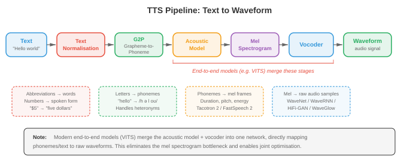
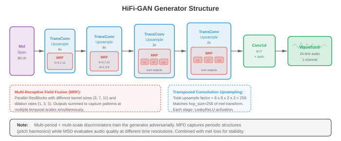

# Преобразование текста в речь и голос

* Синтез текста в речь меняет конвейер ASR, генерируя естественно звучащий звук из письменного текста. Этот файл охватывает конвейер TTS (нормализация текста, G2P, акустические модели, вокодеры), Tacotron, WaveNet, HiFi-GAN, клонирование голоса, преобразование голоса и обнаружение голосовой активности (VAD).*

- В файле 01 мы создали набор инструментов для обработки сигналов: формы сигналов, спектрограммы, банки мел-фильтров и MFCC. В файле 02 мы превратили речь в текст. Теперь переворачиваем стрелку: по заданному тексту синтезируем естественно звучащую речь. Это **преобразование текста в речь (TTS)**, проблема, которая также открывает возможности для преобразования голоса, клонирования голоса и обнаружения голосовой активности.

- Думайте о TTS как о сценическом представлении. Скрипт представляет собой ввод текста. Режиссер (акустическая модель) решает, как должна звучать каждая строчка, ее высоту, время, акцент. Затем оркестр (вокодер) исполняет партитуру, создавая настоящие звуковые волны, которые слышит публика. Современный нейронный TTS заменяет жесткую, роботизированную систему, основанную на правилах, производительностью, которая может конкурировать с человеческими динамиками.



- **Конвейер преобразования текста в речь** Стандартный конвейер TTS состоит из четырех этапов: (1) нормализация текста, (2) преобразование фонем, (3) акустическая модель и (4) вокодер. Некоторые современные системы объединяют этапы 3 и 4 в единую сквозную модель, но концептуальная декомпозиция остается полезной.

- **Нормализация текста** преобразует необработанный текст в произносимую форму. Аббревиатуры расширяются («доктор» до «доктор»), числа становятся словами («от 1984» до «девятнадцать восемьдесят четыре»), символы валюты озвучиваются («от 5 долларов» до «пяти долларов»), обрабатываются URL-адреса или специальные символы. Этот этап часто основан на правилах и грамматиках, специфичных для языка, хотя существуют модели нейронной нормализации. Ошибки здесь распространяются на все последующие этапы: если «St.» читается как «святой», а не «улица», все высказывание неверно.

- **Преобразование графемы в фонему (G2P)** преобразует нормализованный текст в последовательность фонем. Английский язык, как известно, нерегулярен («хотя», «через», «жесткий» - все используют «ого» по-разному), поэтому поиск в словаре (Словарь произношения CMU) обрабатывает общие слова, в то время как нейронная модель последовательностей (кодер-декодер главы 06 или преобразователь главы 07) обрабатывает слова, не входящие в словарный запас. Языки с поверхностной орфографией (испанский, финский) нуждаются в более простом G2P. Выходные данные обычно представляют собой последовательность IPA (международного фонетического алфавита) или эквивалентный внутренний набор фонем.

- **Акустические модели** используют последовательность фонем и создают промежуточное акустическое представление, почти всегда **mel-спектрограмму** (файл 01). Мел-спектрограмма фиксирует спектральную огибающую в каждом временном кадре, которая кодирует важную для восприятия информацию, необходимую вокодеру для восстановления формы сигнала. Акустическая модель должна определять время (как долго длится каждая фонема), высоту звука (основная частота $F_0$) и энергию (громкость).

- **Вокодеры** принимают мел-спектрограмму и создают необработанный аудиосигнал. Это некорректная задача инверсии: многие сигналы могут давать одну и ту же спектрограмму, поскольку информация о фазе была отброшена. Классические вокодеры (Гриффин-Лим, WORLD) используют итеративные подходы или подходы на основе сигнальных моделей, но сейчас по качеству доминируют нейронные вокодеры.

- **Вокодеры: WaveNet** (ван ден Оорд и др., 2016) был первым нейронным вокодером, воспроизводящим речь, практически неотличимую от человеческих записей. Он моделирует форму волны авторегрессионно, прогнозируя каждую выборку $x_t$ на основе всех предыдущих выборок:

$$P(x) = \prod_{t=1}^{T} P(x_t \mid x_1, \ldots, x_{t-1}, c)$$

- где $c$ – кондиционирующий сигнал (мел-спектрограмма). Каждая выборка является 16-битной, поэтому простой softmax для значений более 65536 непрактичен. WaveNet использует **компандирование по мю-закону** для сокращения уровней квантования до 256, а более поздние варианты используют сочетание логистического распределения.

- Основным строительным блоком WaveNet является **расширенная причинная свертка**. Причинно-следственная связь означает, что веса фильтров учитывают только прошлые выборки (без будущих утечек). Расширение означает, что фильтр пропускает выборки с экспоненциально увеличивающимися промежутками: коэффициенты расширения $1, 2, 4, 8, \ldots, 512$. Это дает экспоненциально большое рецептивное поле, сохраняя при этом линейное количество параметров.- Закрытая активация для каждого слоя:

$$z = \tanh(W_{f} \ast x) \odot \sigma(W_{g} \ast x)$$

- где $W_f$ и $W_g$ — веса свертки фильтра и вентиля, $\ast$ обозначает расширенную причинную свертку, а $\odot$ — поэлементное умножение. Этот механизм шлюзования (из LSTM главы 06) позволяет сети контролировать поток информации.

- WaveNet обеспечивает исключительное качество, но очень медленный вывод: для создания одной секунды звука с частотой 24 кГц требуется 24 000 последовательных проходов вперед. Это мотивировало все последующие исследования вокодера.

- **WaveRNN** (Kalchbrenner et al., 2018) заменяет глубокий сверточный стек WaveNet однослойной рекуррентной сетью. Он разбивает каждую 16-битную выборку на грубую (старшие 8 бит) и точную (нижние 8 бит) компоненты, прогнозируя каждую из них с помощью GRU (глава 06). Этот двойной подход softmax значительно сокращает объем вычислений, сохраняя при этом высокое качество. WaveRNN достаточно быстр для работы в режиме реального времени на мобильных процессорах при тщательной оптимизации ядра.

- **WaveGlow** (Prenger et al., 2019) — это вокодер **потоковый**, который полностью исключает авторегрессионную генерацию. Он использует последовательность обратимых преобразований (уровни аффинной связи, нормализующие потоки главы 06) для отображения простого распределения Гаусса на распределение формы сигнала. Обучение максимизирует точную логарифмическую вероятность с помощью формулы замены переменных:

$$\log P(x) = \log P(z) + \sum_{i} \log \left| \det \frac{\partial f_i}{\partial f_{i-1}} \right|$$

— где $z = f(x)$ — скрытая переменная, полученная при передаче $x$ через поток. При выводе образец $z \sim \mathcal{N}(0, I)$ извлекается и проталкивается через инвертированный поток за один параллельный проход. WaveGlow меняет размер модели (большие сети для связующих слоев) на скорость генерации.

- **HiFi-GAN** (Конг и др., 2020) использует **генеративно-состязательную сеть** для синтеза сигналов из мел-спектрограмм. Генератор повышает дискретизацию мел-спектрограммы посредством серии транспонированных сверток, за каждой из которых следует модуль **мультирецепторного слияния полей (MRF)**. Модуль MRF параллельно применяет несколько остаточных блоков с разными размерами ядра и скоростью расширения, а затем суммирует их выходные данные. Это позволяет генератору одновременно захватывать шаблоны в нескольких временных масштабах.



- HiFi-GAN использует два типа дискриминатора. **Многопериодный дискриминатор (MPD)** преобразует 1D-сигнал в 2D, складывая его в разные периоды (2, 3, 5, 7, 11), а затем применяет 2D-свертки. Это фиксирует периодические структуры на разных фундаментальных частотах. **Многомасштабный дискриминатор (MSD)** работает с необработанными сигналами, версиями с 2-кратным и 4-кратным понижением частоты дискретизации, фиксируя шаблоны с различным временным разрешением.

- Цель обучения сочетает в себе состязательную потерю, **потерю реконструкции мел-спектрограммы** (расстояние L1 между мел-спектрограммой синтезированного и наземного аудиосигнала) и **потерю сопоставления признаков** (расстояние L1 между промежуточными функциями дискриминатора):

$$\mathcal{L}_G = \mathcal{L}_{\text{adv}}(G) + \lambda_{\text{mel}} \mathcal{L}_{\text{mel}}(G) + \lambda_{\text{fm}} \mathcal{L}_{\text{fm}}(G)$$

- HiFi-GAN обеспечивает качество синтеза, сравнимое с WaveNet, при этом будучи более чем в 1000 раз быстрее, позволяя генерировать данные в реальном времени на одном графическом процессоре.

- **Модели нейронного источника-фильтра (NSF)** сочетают традиционную обработку сигналов с нейронными сетями. В классической модели источника-фильтра вокализованная речь создается источником возбуждения (периодическая последовательность импульсов на основной частоте $F_0$), проходящим через фильтр речевого тракта (огибающая спектра). Модели NSF заменяют созданный вручную фильтр нейронной сетью, сохраняя при этом явный исходный сигнал. Входной контур $F_0$ обеспечивает точное управление высотой тона, с которым иногда сталкиваются вокодеры, управляемые исключительно данными.

- **Акустические модели: Tacotron** (Wang et al., 2017) была первой сквозной нейронной системой TTS, которая напрямую преобразовывала последовательности символов в мел-спектрограммы. Он тщательно использует архитектуру кодера-декодера (глава 07). Кодер обрабатывает последовательность символов/фонем с помощью банка сверток, сети автомагистралей и двунаправленного GRU. Декодер представляет собой авторегрессионный GRU, который прогнозирует мел-кадры по одному, используя в качестве входных данных предыдущий кадр и контекст внимания.- **Tacotron 2** (Shen et al., 2018) значительно совершенствует архитектуру. Кодер представляет собой трехслойный стек одномерной свертки, за которым следует двунаправленный LSTM (глава 06). Декодер представляет собой двухуровневый LSTM с **вниманием, зависящим от местоположения**, который обусловливает механизм внимания не только выходными данными кодера и состоянием декодера, но также совокупными весами внимания из предыдущих шагов. Это предотвращает распространенный режим отказа, связанный с пропуском внимания или повторением слов.


- Энергия внимания с учетом местоположения для позиции кодировщика $j$ на шаге декодера $i$ составляет:

$$e_{i,j} = w^T \tanh(W_s s_{i-1} + W_h h_j + W_f f_{i,j} + b)$$

- где $s_{i-1}$ — предыдущее состояние декодера, $h_j$ — выходной сигнал кодера в позиции $j$, а $f_{i,j}$ — это объект местоположения, полученный путем свертки совокупных весов внимания $\sum_{k<i} \alpha_{k,j}$ с 1D сверточный фильтр. Весами внимания являются $\alpha_{i,j} = \text{softmax}(e_{i,j})$.

- Декодер Tacotron 2 также прогнозирует вероятность **токена остановки** на каждом этапе, указывая на завершение мел-спектрограммы. Выходная мел-спектрограмма затем передается в вокодер (первоначально WaveNet, позже замененный на HiFi-GAN или аналогичный).

- Авторегрессионный характер Tacotron 2 означает, что скорость синтеза ограничена количеством мел-кадров. Для типичной мел-спектрограммы с частотой 80 кадров в секунду 5-секундное высказывание требует 400 последовательных шагов декодера.

- **FastSpeech** (Ren et al., 2019) решает проблему скорости с помощью **неавторегрессивной** акустической модели. Вместо последовательной генерации mel-кадров FastSpeech генерирует все кадры параллельно. Основная задача — определить, сколько мел-кадров должна создать каждая фонема, и FastSpeech справляется с этим с помощью **предсказателя длительности**.

- Предиктор длительности — это небольшая сверточная сеть, которая предсказывает целочисленную длительность (количество мел-кадров) для каждой фонемы. Во время обучения основные данные о продолжительности извлекаются из предварительно обученной модели авторегрессионного учителя (Tacotron 2) с использованием настройки ее внимания. Во время вывода прогнозируемые длительности используются для расширения скрытой последовательности на уровне фонемы до уровня кадра с помощью **регулятора длины**, который просто повторяет скрытое представление каждой фонемы для прогнозируемого количества кадров.

- **FastSpeech 2** (Ren et al., 2021) улучшает FastSpeech, устраняя разделение учителя и ученика. Он извлекает истинную длительность напрямую, используя принудительное выравнивание (из структур акустической модели файла 02) и добавляет явные **адаптеры отклонения** для высоты тона ($F_0$) и энергии в дополнение к длительности. Каждый адаптер представляет собой небольшой сверточный предиктор, выходные данные которого обуславливают работу декодера:

```math
\begin{aligned}
\hat{d}_i &= \text{DurationPredictor}(h_i) \\
\hat{p}_i &= \text{PitchPredictor}(h_i) \\
\hat{e}_i &= \text{EnergyPredictor}(h_i)
\end{aligned}
```

- где $h_i$ — скрытое состояние кодировщика для фонемы $i$. Во время обучения используются основные значения истинности; при выводе прогнозируемые значения дают явный контроль над просодией. Эта управляемость является основным преимуществом FastSpeech 2: регулировать высоту звука, скорость или энергию так же просто, как масштабировать выходные данные предиктора.

- FastSpeech 2 обычно в 10–20 раз быстрее, чем Tacotron 2, при выводе и позволяет избежать распространенных режимов авторегрессии, таких как пропуск слов, повторение и потеря внимания.

- **VITS** (Ким и др., 2021) — это **сквозная** модель TTS, которая напрямую генерирует сигналы из текста, исключая отдельный этап вокодера. VITS сочетает в себе условный вариационный автокодировщик (глава 06) с нормализацией потоков и состязательным обучением. Апостериорный кодер отображает истинные mel-спектрограммы в скрытое пространство, предшествующий кодер отображает фонемы (через текстовый кодер на основе преобразователя и предсказатель длительности) в то же самое скрытое пространство, а декодер (на основе HiFi-GAN) генерирует сигналы из скрытых выборок.

- Цель обучения VITS сочетает в себе:
    - **Потери при реконструкции**: VAE заставляет скрытое распределение кодировать акустическую информацию.
    - **Расхождение KL**: выравнивает априорную часть, обусловленную текстом, и заднюю часть, обусловленную звуком.
    - **Состязательные потери**: дискриминаторы обеспечивают качество сигнала.
    - **Потеря продолжительности**: тренируется стохастический предсказатель продолжительности.- VITS обеспечивает более высокое качество, чем двухэтапные системы (FastSpeech 2 + HiFi-GAN), поскольку акустическая модель и вокодер оптимизируются совместно, что позволяет избежать несоответствия между прогнозируемыми и достоверными мел-спектрограммами, которое ухудшает двухступенчатые системы.

- **VALL-E** (Wang et al., 2023) радикально переосмысливает TTS как **проблему моделирования языка** с использованием дискретных аудиотокенов. Он использует нейронный аудиокодек (EnCodec) для представления речи как последовательности дискретных кодов из нескольких уровней кодовой книги. Учитывая текстовую подсказку и трехсекундное сообщение о регистрации (также закодированное в виде дискретных токенов), VALL-E использует языковую модель преобразователя для авторегрессионного прогнозирования аудиотокенов.

- VALL-E использует две модели: **авторегрессионную (AR) модель**, которая генерирует первый уровень кодовой книги токен за токеном, и **неавторегрессионную модель (NAR)**, которая прогнозирует остальные уровни кодовой книги параллельно с учетом первого уровня и друг друга. Этот подход к языковой модели кодека обеспечивает замечательное нулевое клонирование голоса: 3-секундного образца достаточно, чтобы воспроизвести голос, тембр и даже эмоциональный тон говорящего.

- **StyleTTS** (Li et al., 2022) и **StyleTTS 2** разделяют речь на компоненты содержания и стиля. Кодер стиля извлекает вектор стиля из эталонного аудио, фиксируя личность говорящего, просодию и условия записи. Во время вывода стиль может быть взят из изученного предыдущего распределения или перенесен из эталонного высказывания. StyleTTS 2 использует модели диффузии (глава 08) для предшествующего стиля, создавая разнообразную и естественную просодию.

- **Kokoro** (2024 г.) — легкая, качественная TTS-модель с открытым исходным кодом, отличающаяся небольшими размерами (~82 млн параметров) и впечатляющей естественностью. Он использует архитектуру, вдохновленную StyleTTS 2, с априорным стилем на основе диффузии и точно настроенным вокодером ISTFTNet, который напрямую прогнозирует коэффициенты STFT (из файла 01), а не необработанные образцы сигналов. Несмотря на то, что Kokoro немного меньше таких моделей, как VALL-E, он достигает почти человеческой естественности для английского, японского, французского, корейского и китайского языков, демонстрируя, что тщательно подобранные обучающие данные и эффективный дизайн архитектуры могут конкурировать с грубым масштабированием. Небольшие размеры Kokoro делают его практичным для локального и периферийного развертывания.

- **Orpheus** (Canopy Labs, 2025 г.) – это семейство моделей TTS с открытым исходным кодом (параметры 1B и 3B), построенных на парадигме **модели языка кодеков**, впервые разработанной VALL-E. Orpheus развивает эту идею дальше, создавая магистраль LLM (точно настроенную Llama 3), которая напрямую генерирует токены аудиокодека SNAC. Его выдающейся особенностью является человеческая эмоциональная выразительность: он передает смех, вздохи, колебания и эмоциональную просодию с поразительной естественностью. Orpheus можно вызвать с помощью таких тегов, как `[laugh]` или `[sigh]` во входном тексте, что дает детальный контроль над паралингвистическим выражением.

- **Dia** (Nari Labs, 2025 г.) — это модель TTS для диалогов с открытым исходным кодом, которая генерирует реалистичные диалоги с несколькими говорящими на основе одной текстовой расшифровки. Построенный на преобразователе кодер-декодер с параметрами 1,6B, Dia обрабатывает очередность, голоса говорящего и невербальные сигналы (смех, паузы) во время разговора. Он также поддерживает клонирование голоса из короткой звуковой подсказки, обеспечивая генерацию говорящего с нулевым звуком в контексте диалога.

- **Sesame CSM** (Модель разговорной речи, 2025 г.) фокусируется на естественной многооборотной разговорной речи. Вместо того, чтобы оптимизировать TTS в стиле чтения, Sesame моделирует динамику реального разговора: обратные каналы («ага»), перерывы, изменения ритма между говорящими и эмоциональную реакцию. Модель использует основу преобразователя, зависящую от контекста разговора (как текстовой, так и аудиоистории), создавая речь, стиль которой адаптируется к ходу диалога.- **Fish Speech** (Fish Audio, 2024) — это система TTS с открытым исходным кодом, использующая двойную авторегрессионную архитектуру: большая языковая модель генерирует семантические токены из текста, а меньшая модель преобразует их в акустические токены VQGAN, которые декодируются в сигналы с помощью вокодера. Fish Speech поддерживает нулевое клонирование голоса из 10-15-секундного эталона и обеспечивает низкую задержку, подходящую для приложений реального времени. Его модульная конструкция позволяет независимо заменять компоненты (например, разные вокодеры).

- **ChatTTS** (2024 г.) – это диалоговая модель TTS с открытым исходным кодом, предназначенная для диалоговых приложений, таких как чат-боты и виртуальные помощники. Он генерирует естественную разговорную речь с детальным контролем просодических функций (смех, паузы, слова-паразиты) с использованием специальных токенов, встроенных во ввод текста. ChatTTS поддерживает смешанный китайско-английский синтез и генерацию нескольких говорящих.

- **Bark** (Suno, 2023 г.) — это модель с открытым исходным кодом на основе трансформатора, которая генерирует речь, музыку и звуковые эффекты из текстовых подсказок. Он использует трехэтапный конвейер моделей преобразователей (текст → семантические токены → грубые акустические токены → тонкие акустические токены) и поддерживает клонирование голоса, многоязычный синтез и неречевой звук, такой как музыка и окружающие звуки. Универсальность Bark достигается за счет управляемости — она менее точна, чем специализированные системы TTS, но более гибка.

- **Parler-TTS** (Hugging Face, 2024) использует подход к голосовому управлению, основанный на **описании на естественном языке**: вместо того, чтобы требовать справочный аудиоклип для стиля, пользователь предоставляет текстовое описание, например «женщина-говорящая с теплым, выразительным голосом в тихой комнате». Parler-TTS обучается на аннотированных речевых данных, где каждое высказывание сочетается с описанием стиля речи на естественном языке, что обеспечивает интуитивное управление без какого-либо звукового сопровождения.

- **Neuphonic** — это платформа TTS на основе API, оптимизированная для синтеза речи со сверхмалой задержкой и предназначенная для голосовых агентов в реальном времени и диалоговых приложений искусственного интеллекта. Время до первого звука составляет менее 100 мс благодаря потоковой архитектуре, которая начинает генерировать звук до того, как станет доступен полный входной текст. Neuphonic фокусируется на уровне развертывания и оптимизации задержки, а не на новой архитектуре модели, обеспечивая инфраструктуру производственного уровня на базе современных нейронных TTS.

- **KittenTTS** — это компактная и быстрая модель TTS, разработанная для эффективного развертывания и минимального использования ресурсов. Он отдает приоритет минимальной задержке и небольшому размеру модели для периферийных и встроенных приложений, жертвуя некоторой естественностью ради производительности в реальном времени на процессорах и мобильных устройствах.

- Современный ландшафт TTS разделяется на две парадигмы: (1) **модели языка кодеков** (VALL-E, Orpheus, Fish Speech), которые рассматривают генерацию речи как предсказание следующего токена по дискретным аудиокодам, используя законы масштабирования LLM; и (2) **модели на основе потока/диффузии** (VITS, StyleTTS 2, Kokoro), которые генерируют непрерывные мел-спектрограммы или формы сигналов посредством итеративного уточнения. Кодеки LM превосходно справляются с нулевым клонированием и выразительностью; модели потока/диффузии, как правило, меньше по размеру и работают быстрее. Оба быстро приближаются к естественности человеческого уровня.

- **Моделирование просодии** контролирует «музыку» речи: высоту, продолжительность, энергию, ритм и интонацию. Без хорошей просодии синтезированная речь звучит плоско и роботизированно, даже если отдельные фонемы ясны. Подумайте о просодии как о разнице между монотонным голосом GPS и выразительным рассказчиком аудиокниги.

- **Высота** (основная частота $F_0$) – это воспринимаемая высота или низость речи. Он повышается в конце вопросов, падает в конце высказываний и непрерывно меняется в ходе эмоциональной речи. $F_0$ извлекается из аудио с помощью таких алгоритмов, как CREPE (нейронный трекер высоты тона) или YIN (на основе автокорреляции, из файла 01). В TTS высота звука либо прогнозируется акустической моделью (предиктор высоты звука FastSpeech 2), либо неявно изучается (Tacotron 2).- **Продолжительность** определяет скорость и ритм речи. Ударные слоги становятся длиннее, служебные слова сокращаются, а паузы обозначают границы фраз. Моделирование продолжительности является явным в неавторегрессионных моделях (FastSpeech) и неявным в авторегрессионных моделях (выравнивание внимания Tacotron определяет продолжительность).

- **Энергия** (громкость) подчеркивает акцент. «Я не говорил, что ОН это украл» и «Я не говорил, что он это украл» имеют разные значения, полностью передаваемые через энергетические паттерны.

- **Внедрение стилей** фиксирует просодические шаблоны более высокого уровня. Платформа **Global Style Token (GST)** (Wang et al., 2018) изучает банк токенов стиля (мягкое внимание к изученному набору вложений), которые фиксируют такие стили речи, как «возбужденный», «грустный» или «шепот». Внедрение стиля извлекается из эталонного высказывания и добавляется к выходным данным кодировщика, что позволяет передавать стиль при выводе.

- **Преобразование голоса (VC)** изменяет личность говорящего, сохраняя при этом лингвистическое содержание. Представьте, что вы записываете себя и получаете звук, похожий на звук конкретного целевого динамика. VC требует отделения личности говорящего от содержания.


- **Внедрение говорящего** (подробнее описано в файле 04) кодирует личность говорящего как вектор фиксированной размерности. Они могут быть получены из предварительно обученной модели проверки говорящего (x-векторы, ECAPA-TDNN). В VC исходная речь кодируется в представление контента, независимое от говорящего, а затем декодируется с помощью внедрения целевого говорящего.

- **Распутанные представления** разделяют речь на независимые факторы: содержание (фонемы), личность говорящего, высоту звука и ритм. Подходы включают в себя:
    - **Узкое место в информации**: сжатие представления контента настолько сильно, что информация о говорящем теряется (AutoVC).
    - **Состязательное обучение**: обучайте классификатор говорящих представлению контента и используйте обращение градиента для удаления информации о говорящих.
    - **Векторное квантование**: VQ-VAE пропускает контент через дискретное узкое место, что естественным образом лишает личности говорящего (поскольку записи кодовой книги представляют фонетические категории, а не характеристики говорящего)

- **Клонирование голоса** синтезирует речь в голосе целевого говорящего. **TTS с несколькими динамиками** обучается на данных от многих динамиков, адаптируя модель к встраиванию динамика. При выводе встраивание нового динамика извлекается из звука регистрации и используется для формирования условия.

- **Клонирование голоса по нескольким кадрам** адаптируется к новому говорящему, используя небольшой объем данных (несколько минут). Кодер динамика извлекает внедрение из звука регистрации, а модель TTS генерирует речь, обусловленную этим внедрением. Именно такой подход используется в SV2TTS (Jia et al., 2018): отдельно обученный кодер динамика, синтезатор Tacotron 2, настроенный на встраивание динамика, и вокодер WaveRNN.

- **Клонирование голоса с нуля** не требует никакой адаптации: достаточно одного короткого произнесения (3–30 секунд). VALL-E достигает этого, рассматривая звук регистрации как подсказку для языковой модели. Модель учится продолжать генерировать тот же голос, поскольку она была обучена на крупномасштабных данных нескольких говорящих, где согласованность голоса в высказывании является статистической нормой.

- **Обнаружение голосовой активности (VAD)** отвечает на простой бинарный вопрос в каждом временном интервале: говорит кто-то или нет? Несмотря на свою простоту, VAD является важным этапом предварительной обработки для ASR (файл 02), диаризации говорящих (файл 04) и шумоподавления (файл 05). Хороший VAD сокращает объем вычислений, пропуская паузу, и повышает точность, предотвращая обработку шума как речи.

- Классический VAD использует энергетический порог (речь громче тишины), скорость перехода через нуль (речь имеет характерные закономерности пересечения) и спектральные характеристики. Они не работают в шумной среде, где соотношение сигнал/шум низкое.

- Модели **Neural VAD** рассматривают проблему как двоичную классификацию на уровне кадра. Небольшая RNN или CNN принимает акустические характеристики (энергии логарифма мела из файла 01) и прогнозирует вероятности речи/неречи.- **WebRTC VAD** (Google) — это классический облегченный VAD, использующий классификатор на основе GMM по простым спектральным признакам. Он работает на четырех уровнях агрессивности (0-3) и чрезвычайно быстр, но плохо справляется с музыкой, неречевыми вокалами и средами с низким SNR. Он по-прежнему широко используется в качестве базового из-за своей простоты и отсутствия зависимости.

- **Silero VAD** (Silero Team, 2021 г.) — это де-факто стандартный нейронный VAD для промышленного использования. Его архитектура представляет собой небольшой стек разделенных по глубине 1D-сверток (идея MobileNet из главы 08, примененная к аудио), за которой следует один слой LSTM для временного контекста, с конечной линейной головкой, производящей вероятность речи для каждого кадра. Вся модель занимает менее 2 МБ (около 1 млн параметров) и обрабатывает звук фрагментами по 30–100 мс.
    - **Вход**: необработанный звук с частотой 16 кГц (без ручного извлечения признаков — сверточный интерфейс изучает свои собственные характеристики непосредственно из формы сигнала).
    - **Оконный вывод с отслеживанием состояния**: скрытое состояние LSTM переносится между фрагментами, поэтому модель обрабатывает потоковое аудио без повторной обработки всей истории. Каждый вызов обрабатывает фрагмент длительностью 30, 60 или 100 мс и возвращает вероятность речи в формате $[0, 1]$.
    - **Адаптивная установка порогов**: вместо единого фиксированного порога Silero VAD использует отдельные начальный и конечный пороги с минимальной продолжительностью речи/молчания, предотвращая быстрое переключение на зашумленных границах. Речевой сегмент должен превышать начальный порог в течение минимальной продолжительности, прежде чем он будет подтвержден, а тишина должна сохраняться ниже конечного порога, прежде чем сегмент будет закрыт.
    - **Производительность**: Silero VAD работает с коэффициентом использования ЦП в реальном времени 1–2 % (обработка 1 секунды звука занимает примерно 10–20 мс), что делает его подходящим для периферийных устройств, мобильных телефонов и конвейеров реального времени. Он значительно превосходит WebRTC VAD при воспроизведении шумного и насыщенного музыкой звука, оставаясь при этом достаточно маленьким для развертывания на устройстве.
    - Silero VAD обычно используется в качестве внешнего интерфейса для Whisper (файл 02) для разделения длинного звука на фрагменты уровня высказывания перед транскрипцией, а также для конвейеров диаризации говорящего (файл 04) для идентификации речевых областей перед извлечением вложений говорящего.

- **Обнаружение акустической активности (AAD)** обобщает VAD для обнаружения любой акустической активности, а не только речи. Это полезно в устройствах умного дома, системах безопасности и мониторинге дикой природы. Модели AAD обнаруживают такие события, как разбитие стекла, лай собак или сигналы тревоги, часто используя системы классификации звука, описанные в файле 04.

- **Метрики оценки TTS** измеряют как объективное качество, так и субъективную естественность:
    - **Средняя оценка мнений (MOS)**: слушатели оценивают естественность по шкале от 1 до 5. Золотой стандарт, но дорогой и медленный.
    - **Мел-кепстральное искажение (MCD)**: измеряет расстояние между синтезированным и эталонным мел-кепстрами. Чем ниже, тем лучше, но это не всегда коррелирует с восприятием.
    - **PESQ/POLQA**: стандартизированные показатели оценки восприятия, изначально разработанные для телефонии.
    - **Сходство динамиков**: косинусное сходство между встраиванием динамиков синтезированного и эталонного звука (актуально для клонирования голоса).
    - **Разборчивость**: измеряется путем подачи синтезированного звука через систему ASR (файл 02) и вычисления WER.

## Задачи по кодированию (используйте CoLab или блокнот)

- **Задание 1: вокодер Гриффина-Лима из мел-спектрограммы.** Реализуйте алгоритм итеративной фазовой реконструкции Гриффина-Лима для преобразования мел-спектрограммы обратно в сигнал. Это демонстрирует проблему вокодера и объясняет, почему необходимы нейронные вокодеры.

```python
import jax
import jax.numpy as jnp
import matplotlib.pyplot as plt

# Generate a synthetic waveform (sum of harmonics simulating a vowel)
sr = 16000
duration = 1.0
t = jnp.linspace(0, duration, int(sr * duration))
f0 = 220.0  # fundamental frequency
waveform = (
    0.6 * jnp.sin(2 * jnp.pi * f0 * t) +
    0.3 * jnp.sin(2 * jnp.pi * 2 * f0 * t) +
    0.1 * jnp.sin(2 * jnp.pi * 3 * f0 * t)
)

# Compute STFT
n_fft = 1024
hop_length = 256
window = jnp.hanning(n_fft)

def stft(signal, n_fft, hop_length, window):
    """Compute Short-Time Fourier Transform."""
    n_frames = 1 + (len(signal) - n_fft) // hop_length
    frames = jnp.stack([
        signal[i * hop_length : i * hop_length + n_fft] * window
        for i in range(n_frames)
    ])
    return jnp.fft.rfft(frames, n=n_fft)

def istft(stft_matrix, hop_length, window, length):
    """Compute inverse STFT with overlap-add."""
    n_fft = (stft_matrix.shape[1] - 1) * 2
    n_frames = stft_matrix.shape[0]
    frames = jnp.fft.irfft(stft_matrix, n=n_fft)
    frames = frames * window[None, :]
    output = jnp.zeros(length)
    for i in range(n_frames):
        start = i * hop_length
        end = start + n_fft
        if end <= length:
            output = output.at[start:end].add(frames[i])
    return output

# Forward STFT
S = stft(waveform, n_fft, hop_length, window)
magnitude = jnp.abs(S)

# Mel filterbank
n_mels = 80
mel_low = 0.0
mel_high = 2595 * jnp.log10(1 + (sr / 2) / 700)
mel_points = jnp.linspace(mel_low, mel_high, n_mels + 2)
hz_points = 700 * (10 ** (mel_points / 2595) - 1)
freq_bins = jnp.floor((n_fft + 1) * hz_points / sr).astype(int)

mel_filterbank = jnp.zeros((n_mels, n_fft // 2 + 1))
for m in range(n_mels):
    f_left = freq_bins[m]
    f_center = freq_bins[m + 1]
    f_right = freq_bins[m + 2]
    for k in range(f_left, f_center):
        mel_filterbank = mel_filterbank.at[m, k].set(
            (k - f_left) / max(f_center - f_left, 1)
        )
    for k in range(f_center, f_right):
        mel_filterbank = mel_filterbank.at[m, k].set(
            (f_right - k) / max(f_right - f_center, 1)
        )

# To mel and back (pseudo-inverse)
mel_spec = magnitude @ mel_filterbank.T
magnitude_reconstructed = mel_spec @ jnp.linalg.pinv(mel_filterbank.T)
magnitude_reconstructed = jnp.maximum(magnitude_reconstructed, 1e-7)

# Griffin-Lim algorithm
def griffin_lim(magnitude, n_iter, hop_length, window, signal_length):
    """Iterative phase reconstruction."""
    n_fft = (magnitude.shape[1] - 1) * 2
    key = jax.random.PRNGKey(42)
    phase = jax.random.uniform(key, magnitude.shape, minval=-jnp.pi, maxval=jnp.pi)

    for _ in range(n_iter):
        complex_spec = magnitude * jnp.exp(1j * phase)
        signal = istft(complex_spec, hop_length, window, signal_length)
        reanalysis = stft(signal, n_fft, hop_length, window)
        phase = jnp.angle(reanalysis)

    complex_spec = magnitude * jnp.exp(1j * phase)
    return istft(complex_spec, hop_length, window, signal_length)

reconstructed = griffin_lim(magnitude_reconstructed, n_iter=60, hop_length=hop_length,
                            window=window, signal_length=len(waveform))

# Plot comparison
fig, axes = plt.subplots(3, 1, figsize=(12, 8))

axes[0].plot(t[:1000], waveform[:1000], color='#3498db', linewidth=0.8)
axes[0].set_title('Original Waveform')
axes[0].set_ylabel('Amplitude')

axes[1].imshow(jnp.log1p(mel_spec.T), aspect='auto', origin='lower', cmap='magma')
axes[1].set_title('Mel Spectrogram (intermediate representation)')
axes[1].set_ylabel('Mel bin')

axes[2].plot(t[:1000], reconstructed[:1000], color='#e74c3c', linewidth=0.8)
axes[2].set_title('Griffin-Lim Reconstructed Waveform (60 iterations)')
axes[2].set_xlabel('Time (s)')
axes[2].set_ylabel('Amplitude')

plt.tight_layout()
plt.show()

# Measure reconstruction error
mse = jnp.mean((waveform[:len(reconstructed)] - reconstructed[:len(waveform)]) ** 2)
print(f"MSE between original and reconstructed: {mse:.6f}")
print("Note: phase information loss through mel inversion causes artifacts.")
```

- **Задача 2: предиктор длительности (стиль FastSpeech).** Обучите небольшой сверточный предиктор длительности, который сопоставляет встраивания фонем с длительностью. Это основной компонент, обеспечивающий неавторегрессию TTS.

```python
import jax
import jax.numpy as jnp
import jax.random as jr
import matplotlib.pyplot as plt

# Simulate phoneme sequences with ground-truth durations
# In real TTS, durations come from forced alignment or teacher attention
def generate_synthetic_data(key, n_samples=200, max_phonemes=30, embed_dim=64):
    """Generate synthetic phoneme embeddings and durations."""
    keys = jr.split(key, 4)
    lengths = jr.randint(keys[0], (n_samples,), 5, max_phonemes)

    all_embeddings = []
    all_durations = []
    all_masks = []

    for i in range(n_samples):
        L = int(lengths[i])
        emb = jr.normal(keys[1], (max_phonemes, embed_dim))
        # Durations: vowels (even indices) are longer, consonants shorter
        base_dur = jnp.where(jnp.arange(max_phonemes) % 2 == 0, 8.0, 4.0)
        noise = jr.normal(jr.fold_in(keys[2], i), (max_phonemes,)) * 1.5
        dur = jnp.clip(base_dur + noise, 1.0, 20.0).astype(jnp.float32)
        mask = (jnp.arange(max_phonemes) < L).astype(jnp.float32)

        all_embeddings.append(emb)
        all_durations.append(dur * mask)
        all_masks.append(mask)

    return (jnp.stack(all_embeddings), jnp.stack(all_durations),
            jnp.stack(all_masks))

key = jr.PRNGKey(42)
embeddings, durations, masks = generate_synthetic_data(key)

# Duration predictor: 2-layer 1D convolution + linear projection
def init_duration_predictor(key, embed_dim=64, hidden_dim=128, kernel_size=3):
    """Initialise duration predictor weights."""
    keys = jr.split(key, 4)
    scale1 = jnp.sqrt(2.0 / (embed_dim * kernel_size))
    scale2 = jnp.sqrt(2.0 / (hidden_dim * kernel_size))
    params = {
        'conv1_w': jr.normal(keys[0], (kernel_size, embed_dim, hidden_dim)) * scale1,
        'conv1_b': jnp.zeros(hidden_dim),
        'conv2_w': jr.normal(keys[1], (kernel_size, hidden_dim, hidden_dim)) * scale2,
        'conv2_b': jnp.zeros(hidden_dim),
        'linear_w': jr.normal(keys[2], (hidden_dim, 1)) * jnp.sqrt(2.0 / hidden_dim),
        'linear_b': jnp.zeros(1),
    }
    return params

def duration_predictor(params, x):
    """Predict log-durations from phoneme embeddings. x: (batch, seq, embed)."""
    # Conv layer 1 with ReLU
    h = jax.lax.conv_general_dilated(
        x.transpose(0, 2, 1),  # (batch, embed, seq)
        params['conv1_w'].transpose(2, 1, 0),  # (out, in, kernel)
        window_strides=(1,), padding='SAME'
    ).transpose(0, 2, 1) + params['conv1_b']  # back to (batch, seq, hidden)
    h = jax.nn.relu(h)

    # Conv layer 2 with ReLU
    h = jax.lax.conv_general_dilated(
        h.transpose(0, 2, 1),
        params['conv2_w'].transpose(2, 1, 0),
        window_strides=(1,), padding='SAME'
    ).transpose(0, 2, 1) + params['conv2_b']
    h = jax.nn.relu(h)

    # Linear projection to scalar
    log_dur = (h @ params['linear_w'] + params['linear_b']).squeeze(-1)
    return log_dur

# Loss: MSE on log-durations (standard in FastSpeech)
def loss_fn(params, embeddings, durations, masks):
    log_dur_pred = duration_predictor(params, embeddings)
    log_dur_true = jnp.log(jnp.clip(durations, 1.0, None))
    sq_err = (log_dur_pred - log_dur_true) ** 2 * masks
    return jnp.sum(sq_err) / jnp.sum(masks)

grad_fn = jax.jit(jax.value_and_grad(loss_fn))

# Training loop
params = init_duration_predictor(jr.PRNGKey(0))
lr = 1e-3
losses = []

for epoch in range(300):
    loss_val, grads = grad_fn(params, embeddings, durations, masks)
    params = jax.tree.map(lambda p, g: p - lr * g, params, grads)
    losses.append(float(loss_val))

# Evaluate on a sample
log_dur_pred = duration_predictor(params, embeddings[:1])
dur_pred = jnp.exp(log_dur_pred[0])
dur_true = durations[0]
mask = masks[0]
valid_len = int(jnp.sum(mask))

fig, axes = plt.subplots(1, 2, figsize=(14, 5))

axes[0].plot(losses, color='#3498db', linewidth=1.5)
axes[0].set_xlabel('Epoch')
axes[0].set_ylabel('MSE Loss (log-duration)')
axes[0].set_title('Duration Predictor Training')
axes[0].set_yscale('log')

x_pos = jnp.arange(valid_len)
width = 0.35
axes[1].bar(x_pos - width/2, dur_true[:valid_len], width, color='#27ae60',
            label='Ground truth', alpha=0.8)
axes[1].bar(x_pos + width/2, dur_pred[:valid_len], width, color='#e74c3c',
            label='Predicted', alpha=0.8)
axes[1].set_xlabel('Phoneme index')
axes[1].set_ylabel('Duration (frames)')
axes[1].set_title('Duration Prediction vs Ground Truth')
axes[1].legend()

plt.tight_layout()
plt.show()
```

- **Задание 3: Простой нейронный вокодер со свертками с повышающей дискретизацией.** Создайте минимальный генератор в стиле HiFi-GAN, который преобразует мел-спектрограмму с повышающей дискретизацией в форму волны, используя транспонированные свертки и остаточные блоки.

```python
import jax
import jax.numpy as jnp
import jax.random as jr
import matplotlib.pyplot as plt

def init_residual_block(key, channels, kernel_size, dilation):
    """Initialise a dilated residual convolution block."""
    k1, k2 = jr.split(key)
    scale = jnp.sqrt(2.0 / (channels * kernel_size))
    return {
        'conv1_w': jr.normal(k1, (kernel_size, channels, channels)) * scale,
        'conv1_b': jnp.zeros(channels),
        'conv2_w': jr.normal(k2, (kernel_size, channels, channels)) * scale,
        'conv2_b': jnp.zeros(channels),
        'dilation': dilation
    }

def residual_block(params, x):
    """x: (batch, time, channels). Dilated conv residual block with LeakyReLU."""
    h = jax.nn.leaky_relu(x, negative_slope=0.1)
    # Simplified: use standard conv (dilation handled conceptually)
    h = jax.lax.conv_general_dilated(
        h.transpose(0, 2, 1),
        params['conv1_w'].transpose(2, 1, 0),
        window_strides=(1,),
        padding='SAME',
        rhs_dilation=(params['dilation'],)
    ).transpose(0, 2, 1) + params['conv1_b']
    h = jax.nn.leaky_relu(h, negative_slope=0.1)
    h = jax.lax.conv_general_dilated(
        h.transpose(0, 2, 1),
        params['conv2_w'].transpose(2, 1, 0),
        window_strides=(1,),
        padding='SAME'
    ).transpose(0, 2, 1) + params['conv2_b']
    return x + h

def init_generator(key, n_mels=80, upsample_rates=(8, 8, 4),
                   channels=128):
    """Initialise a minimal HiFi-GAN-style generator."""
    keys = jr.split(key, 10)
    params = {}

    # Input projection: mel bins -> channels
    params['input_w'] = jr.normal(keys[0], (7, n_mels, channels)) * 0.02
    params['input_b'] = jnp.zeros(channels)

    # Upsample blocks (transposed convolutions)
    in_ch = channels
    for i, rate in enumerate(upsample_rates):
        k_size = rate * 2
        scale = jnp.sqrt(2.0 / (in_ch * k_size))
        out_ch = in_ch // 2
        params[f'up{i}_w'] = jr.normal(keys[i+1], (k_size, in_ch, out_ch)) * scale
        params[f'up{i}_b'] = jnp.zeros(out_ch)
        # Residual blocks at each scale
        params[f'res{i}_0'] = init_residual_block(jr.fold_in(keys[i+4], 0),
                                                    out_ch, 3, 1)
        params[f'res{i}_1'] = init_residual_block(jr.fold_in(keys[i+4], 1),
                                                    out_ch, 3, 3)
        in_ch = out_ch

    # Output projection to mono waveform
    params['output_w'] = jr.normal(keys[8], (7, in_ch, 1)) * 0.02
    params['output_b'] = jnp.zeros(1)
    params['upsample_rates'] = upsample_rates

    return params

def generator_forward(params, mel):
    """mel: (batch, time, n_mels) -> waveform: (batch, time * prod(rates), 1)."""
    # Input projection
    h = jax.lax.conv_general_dilated(
        mel.transpose(0, 2, 1),
        params['input_w'].transpose(2, 1, 0),
        window_strides=(1,), padding='SAME'
    ).transpose(0, 2, 1) + params['input_b']

    for i, rate in enumerate(params['upsample_rates']):
        h = jax.nn.leaky_relu(h, negative_slope=0.1)
        # Upsample via transposed convolution
        k_size = rate * 2
        h = jax.lax.conv_transpose(
            h.transpose(0, 2, 1),
            params[f'up{i}_w'].transpose(2, 1, 0),
            strides=(rate,),
            padding='SAME'
        ).transpose(0, 2, 1) + params[f'up{i}_b']
        # Residual blocks
        h = residual_block(params[f'res{i}_0'], h)
        h = residual_block(params[f'res{i}_1'], h)

    h = jax.nn.leaky_relu(h, negative_slope=0.1)
    out = jax.lax.conv_general_dilated(
        h.transpose(0, 2, 1),
        params['output_w'].transpose(2, 1, 0),
        window_strides=(1,), padding='SAME'
    ).transpose(0, 2, 1) + params['output_b']

    return jnp.tanh(out)

# Create a synthetic mel spectrogram (simulating a vowel)
n_mels = 80
n_frames = 50
mel = jnp.zeros((1, n_frames, n_mels))
# Add energy in low-frequency mel bins (simulating formants)
mel = mel.at[:, :, 5:15].set(1.0)
mel = mel.at[:, :, 20:25].set(0.6)

# Initialise and run generator
key = jr.PRNGKey(42)
params = init_generator(key, n_mels=n_mels, upsample_rates=(8, 8, 4),
                         channels=128)
waveform = generator_forward(params, mel)

print(f"Input mel shape:  {mel.shape}")
print(f"Output waveform shape: {waveform.shape}")
print(f"Upsample factor: {8 * 8 * 4} = {8*8*4}x")

fig, axes = plt.subplots(2, 1, figsize=(12, 6))

axes[0].imshow(mel[0].T, aspect='auto', origin='lower', cmap='magma')
axes[0].set_title('Input Mel Spectrogram')
axes[0].set_ylabel('Mel bin')
axes[0].set_xlabel('Frame')

waveform_np = waveform[0, :, 0]
axes[1].plot(waveform_np[:2000], color='#9b59b6', linewidth=0.5)
axes[1].set_title('Generator Output Waveform (untrained - random noise)')
axes[1].set_ylabel('Amplitude')
axes[1].set_xlabel('Sample')

plt.tight_layout()
plt.show()
print("Note: The output is noise because the generator is untrained.")
print("In practice, adversarial + mel loss training shapes this into speech.")
```

- **Задание 4: Обнаружение голосовой активности с помощью простой RNN.** Обучите небольшую модель VAD на основе GRU функциям синтетического звука, чтобы классифицировать кадры как речь или тишину.

```python
import jax
import jax.numpy as jnp
import jax.random as jr
import matplotlib.pyplot as plt

# Generate synthetic log-mel energy features with speech/silence labels
def generate_vad_data(key, n_sequences=100, n_frames=200, n_features=40):
    """Simulate log-mel features: speech regions are higher energy with structure."""
    keys = jr.split(key, 5)
    all_features = []
    all_labels = []

    for i in range(n_sequences):
        k = jr.fold_in(keys[0], i)
        k1, k2, k3 = jr.split(k, 3)

        # Random speech/silence pattern
        label = jnp.zeros(n_frames)
        n_segments = jr.randint(k1, (), 2, 6)
        for seg in range(int(n_segments)):
            start = jr.randint(jr.fold_in(k2, seg), (), 0, n_frames - 20)
            length = jr.randint(jr.fold_in(k3, seg), (), 10, 50)
            end = jnp.minimum(start + length, n_frames)
            label = label.at[int(start):int(end)].set(1.0)

        # Features: speech frames have higher energy + spectral structure
        noise = jr.normal(jr.fold_in(keys[1], i), (n_frames, n_features)) * 0.3
        speech_pattern = jnp.outer(label, jnp.exp(-jnp.arange(n_features) / 15.0))
        features = speech_pattern * 2.0 + noise + 0.1

        all_features.append(features)
        all_labels.append(label)

    return jnp.stack(all_features), jnp.stack(all_labels)

key = jr.PRNGKey(123)
features, labels = generate_vad_data(key)
train_features, train_labels = features[:80], labels[:80]
test_features, test_labels = features[80:], labels[80:]

# Simple GRU-based VAD model
def init_vad_model(key, input_dim=40, hidden_dim=64):
    keys = jr.split(key, 6)
    scale_ih = jnp.sqrt(2.0 / input_dim)
    scale_hh = jnp.sqrt(2.0 / hidden_dim)
    return {
        'W_z': jr.normal(keys[0], (input_dim, hidden_dim)) * scale_ih,
        'U_z': jr.normal(keys[1], (hidden_dim, hidden_dim)) * scale_hh,
        'b_z': jnp.zeros(hidden_dim),
        'W_r': jr.normal(keys[2], (input_dim, hidden_dim)) * scale_ih,
        'U_r': jr.normal(keys[3], (hidden_dim, hidden_dim)) * scale_hh,
        'b_r': jnp.zeros(hidden_dim),
        'W_h': jr.normal(keys[4], (input_dim, hidden_dim)) * scale_ih,
        'U_h': jr.normal(keys[5], (hidden_dim, hidden_dim)) * scale_hh,
        'b_h': jnp.zeros(hidden_dim),
        'W_out': jr.normal(jr.fold_in(keys[0], 99), (hidden_dim, 1)) * 0.1,
        'b_out': jnp.zeros(1),
    }

def gru_step(params, h, x):
    """Single GRU step."""
    z = jax.nn.sigmoid(x @ params['W_z'] + h @ params['U_z'] + params['b_z'])
    r = jax.nn.sigmoid(x @ params['W_r'] + h @ params['U_r'] + params['b_r'])
    h_tilde = jnp.tanh(x @ params['W_h'] + (r * h) @ params['U_h'] + params['b_h'])
    h_new = (1 - z) * h + z * h_tilde
    return h_new

def vad_forward(params, x):
    """x: (batch, time, features) -> logits: (batch, time)."""
    batch_size, n_frames, _ = x.shape
    hidden_dim = params['W_z'].shape[1]
    h = jnp.zeros((batch_size, hidden_dim))

    outputs = []
    for t in range(n_frames):
        h = gru_step(params, h, x[:, t, :])
        logit = (h @ params['W_out'] + params['b_out']).squeeze(-1)
        outputs.append(logit)

    return jnp.stack(outputs, axis=1)

def bce_loss(params, features, labels):
    """Binary cross-entropy loss for VAD."""
    logits = vad_forward(params, features)
    probs = jax.nn.sigmoid(logits)
    probs = jnp.clip(probs, 1e-7, 1 - 1e-7)
    loss = -(labels * jnp.log(probs) + (1 - labels) * jnp.log(1 - probs))
    return jnp.mean(loss)

grad_fn = jax.jit(jax.value_and_grad(bce_loss))

# Training
params = init_vad_model(jr.PRNGKey(0))
lr = 5e-3
losses = []

for epoch in range(200):
    loss_val, grads = grad_fn(params, train_features, train_labels)
    params = jax.tree.map(lambda p, g: p - lr * g, params, grads)
    losses.append(float(loss_val))
    if epoch % 50 == 0:
        print(f"Epoch {epoch}: loss = {loss_val:.4f}")

# Evaluate on test set
test_logits = vad_forward(params, test_features)
test_preds = (jax.nn.sigmoid(test_logits) > 0.5).astype(jnp.float32)
accuracy = jnp.mean(test_preds == test_labels)
print(f"\nTest accuracy: {accuracy:.4f}")

# Visualise a test example
idx = 0
fig, axes = plt.subplots(3, 1, figsize=(14, 7))

axes[0].imshow(test_features[idx].T, aspect='auto', origin='lower', cmap='magma')
axes[0].set_title('Log-Mel Energy Features')
axes[0].set_ylabel('Mel bin')

axes[1].fill_between(range(200), test_labels[idx], alpha=0.4, color='#27ae60',
                     label='Ground truth')
axes[1].plot(jax.nn.sigmoid(test_logits[idx]), color='#e74c3c',
             linewidth=1.5, label='Predicted probability')
axes[1].axhline(0.5, color='gray', linestyle='--', linewidth=0.8)
axes[1].set_ylabel('Speech probability')
axes[1].legend()
axes[1].set_title('VAD Predictions')

axes[2].fill_between(range(200), test_labels[idx], alpha=0.4, color='#27ae60',
                     label='Ground truth')
axes[2].fill_between(range(200), test_preds[idx], alpha=0.4, color='#f39c12',
                     label='Predicted (threshold=0.5)')
axes[2].set_ylabel('Speech / Silence')
axes[2].set_xlabel('Frame')
axes[2].legend()
axes[2].set_title('VAD Binary Decision')

plt.tight_layout()
plt.show()
```