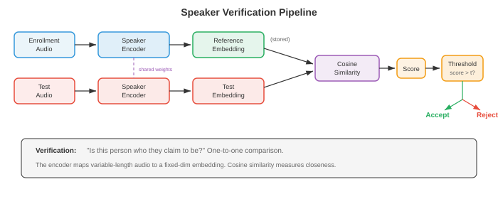
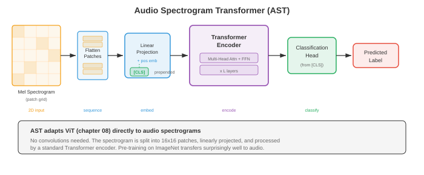

# Анализ динамиков и звука

*Анализ динамика и звука позволяет определить, кто говорит, когда он говорит и какие неречевые звуки присутствуют. Этот файл охватывает проверку и идентификацию говорящего, i-векторы, d-векторы, x-векторы, ведение дневника говорящего, классификацию аудиособытий, извлечение музыкальной информации и распознавание эмоций по речи.*

- В файле 01 мы создали основы обработки сигналов: спектрограммы, MFCC и банки фильтров mel. В файле 02 мы узнали сказанное. Теперь мы спрашиваем, кто это сказал, когда они это сказали и что еще происходит в аудиозаписи. Распознавание говорящего, диаризация, классификация аудио и анализ музыки имеют общую нить: изучение компактных вложений, которые фиксируют правильные инварианты для поставленной задачи, перекликаясь с идеями встраивания из главы 06.

- Думайте об идентификации говорящего, как о распознавании голоса друга по телефону. Вам не нужно понимать слова; что-то в тембре, темпе и качестве голоса уникально для этого человека. Системы распознавания говорящего учатся извлекать именно этот «голосовой отпечаток» из необработанного звука, игнорируя то, что говорится, и сосредотачиваясь на том, как это сказано.

- **Распознавание говорящего** — это общий термин для двух связанных задач:
    - **Проверка говорящего** (SV): по заявленной личности и аудиоклипу определить, является ли говорящий тем, за кого себя выдает. Это бинарное решение (принять или отклонить), и это технология голосовой аутентификации («Эй, Сири, это мой голос?»).
    - **Идентификация говорящего** (SI): по аудиоклипу и галерее известных докладчиков определите, какой динамик продюсировал этот клип. Это проблема классификации нескольких классов.



- Обе задачи имеют одно и то же базовое представление: фиксированное **встраивание говорящего**, которое фиксирует личность говорящего независимо от того, что он говорит. Разница только на этапе принятия решения: проверка сравнивает два вложения, идентификация находит ближайшее вложение среди кандидатов.

- **Косинусное сходство** — стандартный показатель для сравнения встраивания динамиков. Учитывая встраивание регистрации $e$ и тестовое встраивание $t$:

$$s = \frac{e \cdot t}{\|e\| \, \|t\|}$$

- Порог $\theta$ определяет решение о принятии/отклонении: если $s > \theta$, принять. Порог колеблется между **коэффициентом ложного принятия (FAR)** и **коэффициентом ложного отклонения (FRR)**. **Равная частота ошибок (EER)**, где FAR = FRR, является стандартным показателем оценки. Более низкий EER означает лучшую производительность. Современные системы достигают EER ниже 1% по стандартным критериям (VoxCeleb).

- **i-векторы** (Dehak et al., 2010) были доминирующим внедрением динамиков до глубокого обучения. Идея исходит из факторного анализа (факторизация матрицы в главе 02 и уменьшение размерности в главе 04). **Универсальная фоновая модель (UBM)**, большая GMM, обученная на разных говорящих, определяет супервекторное пространство. Супервектор GMM каждого высказывания проецируется в низкомерное **пространство тотальной изменчивости**:

$$M = m + Tw$$

- где $M$ — супервектор GMM высказывания, $m$ — средний супервектор UBM, $T$ — общая матрица изменчивости (полученная из данных), а $w$ — i-вектор, низкомерный (обычно 400–600) представление, отражающее изменчивость как динамика, так и канала.

- Чтобы удалить изменчивость канала из i-векторов, **Вероятностный линейный дискриминантный анализ (PLDA)** моделирует i-вектор как сумму скрытых переменных, специфичных для говорящего и специфичного для канала. PLDA обеспечивает принципиальную оценку отношения правдоподобия для проверки:

$$\text{score}(w_1, w_2) = \log \frac{P(w_1, w_2 \mid \text{same speaker})}{P(w_1 \mid \text{speaker}_1) \, P(w_2 \mid \text{speaker}_2)}$$

- **d-векторы** (Variani et al., 2014) были первыми встраиваниями нейронных динамиков. DNN, обученная для классификации говорящих по признакам уровня кадра, извлекает представление фиксированного размера путем усреднения последних активаций скрытого слоя по всем кадрам высказывания. Простые, но эффективные d-векторы продемонстрировали, что нейронные сети могут изучать особенности распознавания говорящего без использования сложного статистического механизма i-векторов.- **x-векторы** (Snyder et al., 2018) значительно усовершенствовали внедрение нейронных динамиков с использованием архитектуры **нейронной сети с временной задержкой (TDNN)**. TDNN представляют собой одномерные свертки со специальными контекстными окнами на каждом уровне, связанные с расширенными свертками из WaveNet файла 03, но применяемые к функциям уровня кадра, а не к необработанным образцам сигналов.


- Архитектура x-вектора состоит из трех этапов:
    - **Уровни уровня кадра**: стек слоев TDNN обрабатывает MFCC (из файла 01) с постепенно расширяющимся временным контекстом. Каждый уровень видит фиксированное контекстное окно (например, $\{t-2, t-1, t, t+1, t+2\}$ для первого уровня, более широкое для последующих слоев).
    - **Объединение статистики**: после слоев на уровне кадра среднее и стандартное отклонение выходных данных на уровне кадра вычисляются по всему высказыванию, создавая вектор фиксированного размера независимо от длины высказывания:

```math
\begin{aligned}
\mu &= \frac{1}{T} \sum_{t=1}^{T} h_t \\
\sigma &= \sqrt{\frac{1}{T} \sum_{t=1}^{T} (h_t - \mu)^2}
\end{aligned}
```

- где $h_t$ — выходные данные на уровне кадра в момент времени $t$. Объединение $[\mu; \sigma]$ представляет собой объединенное представление.
    - **Слои на уровне сегмента**: полностью связанные слои обрабатывают объединенное представление. Результатом первого слоя уровня сегмента (до softmax) является встраивание x-вектора.

- x-векторы обучаются со стандартной кросс-энтропийной потерей личности говорящего. Несмотря на подготовку к классификации, изученное промежуточное представление (х-вектор) хорошо обобщается на невидимых говорящих, поскольку сеть учится извлекать отличительные особенности говорящего, а не запоминать конкретных говорящих.

- **ECAPA-TDNN** (Desplanques et al., 2020) — это современная архитектура на основе TDNN для распознавания говорящего. Он вводит три улучшения по сравнению с x-векторами:
    - **Блоки сжатия-возбуждения (SE)**: внимание к каналам (из SENet главы 08), которое повторно взвешивает функциональные каналы на основе глобального контекста, что позволяет модели выделять каналы, важные для говорящего.
    - **Многомасштабные функции в стиле Res2Net**: внутри каждого блока TDNN каналы разбиваются на группы, которые обрабатываются иерархически, создавая функции с несколькими временными разрешениями (аналогично извлечению многомасштабных функций в главе 08).
    - **Внимательное объединение статистики**: вместо усреднения с равным весом механизм внимания взвешивает вклад каждого кадра в объединенную статистику. Кадры с большим содержанием, различающим говорящего (например, гласные, которые несут больше информации о говорящем), получают более высокий вес внимания:

$$\alpha_t = \frac{\exp(v^T f(h_t))}{\sum_{\tau} \exp(v^T f(h_\tau))}$$

— где $f$ — небольшая нейронная сеть, а $v$ — обученный вектор внимания. Сопровождаемое среднее и стандартное отклонение становятся $\tilde{\mu} = \sum_t \alpha_t h_t$ и $\tilde{\sigma} = \sqrt{\sum_t \alpha_t (h_t - \tilde{\mu})^2}$.

- ECAPA-TDNN обычно обучается с помощью **AAM-Softmax** (Additive Angular Margin Softmax), который добавляет штраф за угловой запас к потерям классификации, смещая вложения одного и того же динамика ближе друг к другу, а разные динамики дальше друг от друга в гиперсфере:

$$L = -\log \frac{e^{s \cos(\theta_{y_i} + m)}}{e^{s \cos(\theta_{y_i} + m)} + \sum_{j \neq y_i} e^{s \cos \theta_j}}$$

- где $\theta_{y_i}$ — угол между встраиванием и весовым вектором истинного класса, $m$ — запас (обычно 0,2), а $s$ — коэффициент масштабирования (обычно 30). Эта потеря возникает из-за распознавания лиц (ArcFace из главы 08) и очень эффективна для проверки говорящего.

- **Диалог говорящего** отвечает на вопрос «кто когда говорил» в записи с несколькими динамиками. Думайте об этом как о раскрашивании временной шкалы: каждый цвет представляет отдельного говорящего, и система должна определить, когда каждый говорящий активен, включая перекрывающуюся речь.

- **Диаризация на основе кластеризации** — это традиционный конвейерный подход:
    - **Сегментация**: разделите звук на короткие сегменты (обычно 1–2 секунды) с помощью скользящего окна или обнаружения смены динамиков.
    - **Извлечение встраивания**: извлечение встраивания динамика (x-вектор, ECAPA-TDNN) для каждого сегмента.
    - **Кластеризация**: группируйте сегменты по говорящим. **Агломеративная иерархическая кластеризация (AHC)** является стандартной: начните с каждого сегмента как отдельного кластера, затем итеративно объединяйте два наиболее похожих кластера, пока не будет достигнут критерий остановки (на основе порогового значения расстояния или целевого числа говорящих).
    - **Повторная сегментация**: уточнение границ с помощью повторного выравнивания на основе Витерби.

- Число говорящих обычно неизвестно априори, что усложняет задачу по сравнению со стандартной кластеризацией. Еще одним распространенным подходом является спектральная кластеризация с порогом на основе собственных значений для определения $k$.

- **Сквозная нейронная диаризация (EEND)** (Fujita et al., 2019) рассматривает диаризацию как проблему классификации по нескольким меткам. Нейронная сеть (обычно модель, основанная на самовнимании, преобразователь главы 07) принимает всю запись в качестве входных данных и выводит двоичную метку активности для каждого говорящего в каждом кадре. Это напрямую обрабатывает перекрывающуюся речь, что является основным недостатком методов на основе кластеризации.

- Выход EEND для динамиков $S$ в корпусе $t$:

$$\hat{y}_{t,s} = \sigma(f_s(h_t))$$

- где $h_t$ — выход трансформатора в кадре $t$, а $f_s$ — линейная проекция для динамика $s$. Потери при обучении представляют собой двоичную перекрестную энтропию, суммируемую по динамикам и кадрам. Основная проблема заключается в том, что количество динамиков должно быть фиксированным или обрабатываться с помощью архитектуры с переменным выходом (EEND-EDA использует кодер-декодер с аттракторами).

- **Инвариантное обучение перестановке (PIT)** для диаризации решает проблему неоднозначности меток: поскольку динамики не имеют внутреннего порядка, потери вычисляются для всех возможных назначений динамиков на выход и берется минимум (это тот же PIT, который используется при разделении источников, описанном в файле 05).

- **Классификация аудио** присваивает метку всему аудиоклипу. В отличие от ASR (файл 02), который расшифровывает речь, классификация аудио охватывает более широкий диапазон: звуки окружающей среды (сирена, дождь, лай собаки), музыкальные жанры (рок, джаз, классика) и общие звуковые события.

- Стандартный подход следует парадигме классификации изображений из главы 08: представьте звук в виде спектрограммы (2D-частотно-временное изображение), затем примените классификатор CNN или трансформатор. Этот подход спектрального изображения основан на десятилетиях прогресса в области компьютерного зрения.

- **Классификация звуков окружающей среды (ESC)** использует такие наборы данных, как ESC-50 (50 классов, 2000 клипов) и UrbanSound8K. Типичными архитектурами являются CNN (глава 06), применяемые к логарифмическим спектрограммам. Расширение данных имеет решающее значение: растяжение по времени, сдвиг высоты звука, добавление фонового шума и **SpecAugment** (подход маскировки файла 02, применяемый к спектрограммам) – все это улучшает обобщение.

- **Обнаружение аудиособытий** (Sound Event Detection, SED) — это временной аналог классификации: не только то, какие события присутствуют, но и когда они начинаются и заканчиваются. **AudioSet** (Gemmeke et al., 2017) – это крупномасштабный тест с 527 классами событий и более чем 2 миллионами 10-секундных клипов с YouTube, каждый из которых слабо помечен (метки на уровне клипа, а не на уровне кадра).

- **SED со слабым контролем** должен получать прогнозы на уровне кадра из меток уровня клипа. Стандартный подход использует CNN, которая генерирует вероятности классов на уровне кадра, а затем объединяет их в прогнозы на уровне клипа посредством объединения внимания:

$$\hat{Y}_c = \sigma\left(\sum_t \alpha_{t,c} \cdot f_{t,c}\right)$$

- где $f_{t,c}$ — логит уровня кадра для класса $c$ в момент времени $t$, а $\alpha_{t,c}$ — вес внимания. Прогноз уровня клипа $\hat{Y}_c$ обучается по метке уровня клипа.- **Классификация акустических сцен (ASC)** классифицирует общую среду: «аэропорт», «парк», «станция метро», «офис». Это целостная задача: модель должна отражать общую акустическую текстуру, а не конкретные события. Серия испытаний DCASE ежегодно проверяет ASC, при этом системы-победители обычно используют ансамбли CNN на спектрограммах с различным разрешением.

- **Внедрение аудио** — это представления общего назначения, полученные из крупномасштабных аудиоданных, аналогичные внедрению слов (глава 07) или функциям изображения (глава 08), которые передаются в последующие задачи.

- **VGGish** (Hershey et al., 2017) адаптирует сеть классификации изображений VGG (глава 08) к аудио. Он обрабатывает 0,96-секундные патчи логарифмической спектрограммы через VGG-подобную CNN, предварительно обученную в AudioSet, создавая 128-мерное встраивание для каждого патча. Встраивания VGGish служат в качестве аудиофункций общего назначения для последующих задач, подобно тому, как CNN, предварительно обученные ImageNet, предоставляют визуальные функции.

- **PANN** (Pre-trained Audio Neural Networks, Kong et al., 2020) — это семейство архитектур CNN (CNN6, CNN10, CNN14), обученных на полном AudioSet для разметки аудио. CNN14, наиболее широко используемый, представляет собой 14-слойную CNN со свертками $3 \times 3$, применяемыми к логарифмическим спектрограммам. PANN создают 2048-мерные вложения, которые обеспечивают современное обучение передаче различных аудиозадач.

- **Преобразователь аудиоспектрограмм (AST)** (Gong et al., 2021) применяет архитектуру Vision Transformer (ViT, глава 08) непосредственно к аудиоспектрограммам. Спектрограмма разбивается на патчи $16 \times 16$ (точно так же, как ViT разбивает изображения), каждый патч линейно проецируется на встраивание токена, добавляются позиционные встраивания, и стандартный преобразователь-кодер (глава 07) обрабатывает последовательность. Вывод токена [CLS] используется для классификации.



- AST выигрывает от **предварительного обучения ImageNet**: поскольку спектрограммы представляют собой 2D-изображения, AST инициализируется на основе ViT, предварительно обученного на изображениях ImageNet, а затем выполняет точную настройку звука. Этот кросс-модальный перенос на удивление эффективен, поскольку оба домена имеют общие низкоуровневые функции (края, текстуры), а позиционные представления можно интерполировать для обработки спектрограмм разных размеров.

- **HTS-AT** (Чен и др., 2022 г.) совершенствует AST за счет иерархической архитектуры Swin Transformer (см. внимание в главе 08), снижая вычислительные затраты и одновременно повышая производительность за счет многомасштабного извлечения признаков.

- **BEATs** (Chen et al., 2023) использует стратегию предварительного обучения, специфичную для аудио: итеративное предсказание по маске с дискретным токенизатором (аналогично подходу wav2vec 2.0 из файла 02, но применяется к общему аудио). Токенизатор постепенно совершенствуется, создавая все более семантически значимые дискретные аудиотокены.

- **Диаризирование говорящих с помощью встраивания** сочетает встраивание говорящих с временным моделированием. Современные системы, такие как Pyannote.audio, используют трехэтапный конвейер: (1) модель нейронной сегментации, которая обнаруживает повороты говорящих и наложение речи, (2) этап извлечения встраивания (ECAPA-TDNN), применяемый к каждому обнаруженному сегменту, и (3) кластеризация для определения личности говорящего по всей записи.

- **Поиск музыкальной информации (MIR)** применяет аудиоанализ к музыке. Спектральные представления из файла 01 здесь особенно полезны, поскольку музыка имеет богатую гармоническую структуру.

- **Отслеживание ритма** определяет ритмический пульс музыки. Стандартный подход вычисляет **огибающую силы начала** на основе спектрограммы (определяя увеличение энергии начала сигнальной ноты), затем находит темп с помощью автокорреляции или темпограммы и, наконец, отслеживает отдельные позиции ударов с помощью динамического программирования, чтобы найти последовательность времени ударов, которая лучше всего соответствует огибающей начала, сохраняя при этом постоянный темп.- **Распознавание аккордов** определяет гармоническое содержание с течением времени. Входные данные обычно представляют собой **хромаграмму** (также называемую профилем класса высоты тона): 12-мерное представление, которое объединяет все октавы, показывая энергию в каждом из 12 классов высоты тона (C, C#, D, ..., B). CNN или RNN (глава 06) классифицирует каждый временной интервал по одной из стандартных меток аккордов (до мажор, ля минор, G7 и т. д.).

- Хромаграмма вычисляется на основе STFT (файл 01) путем сопоставления каждого элемента частоты с его классом основного тона:

$$\text{chroma}(p) = \sum_{k : \text{pitch}(k) \bmod 12 = p} |X(k)|^2$$

- где $p \in \{0, 1, \ldots, 11\}$ — это класс высоты тона, а $\text{pitch}(k)$ отображает частотный элемент $k$ на номер MIDI-ноты.

- **Основы разделения источников** (подробнее описаны в файле 05) позволяют разделить музыкальную запись на отдельные инструменты (вокал, ударные, бас и т. д.). Это имеет решающее значение для приложений MIR, таких как создание ремиксов, караоке и транскрипция музыки. Такие модели, как Demucs (файл 05), обеспечивают удивительно хорошее качество разделения по стандартному тесту MUSDB18.

- **Музыкальные теги** присваивают песням метки (жанр, настроение, инструменты, эпоха). По сути, это аудиоклассификация, применяемая к музыке, с использованием того же подхода CNN на спектрограмме. Набор данных Million Song и MagnaTagATune являются стандартными тестами.

- **Аудиоотпечатки** идентифицируют конкретную запись по короткому отрывку, даже с шумом, реверберацией или артефактами сжатия. Классической системой является Shazam, которая хэширует точки созвездия (выдающиеся пики на спектрограмме). Нейронные подходы изучают надежные внедрения, которые инвариантны к акустическому ухудшению, сохраняя при этом различение между различными записями, что повторяет обучение инвариантным функциям из глав 06 и 08.

## Задачи по кодированию (используйте CoLab или блокнот)

- **Задача 1: извлечение встраивания динамиков с объединением статистики.** Создайте простую модель в стиле x-вектора, которая обрабатывает функции уровня кадра через слои TDNN и объединяет статистические данные для создания встраивания динамиков.

```python
import jax
import jax.numpy as jnp
import jax.random as jr
import matplotlib.pyplot as plt

# Simulate frame-level MFCC features for multiple speakers
def generate_speaker_data(key, n_speakers=5, utterances_per_speaker=20,
                          n_frames=100, n_features=40):
    """Generate synthetic speaker data with speaker-dependent patterns."""
    keys = jr.split(key, 3)
    all_features = []
    all_labels = []

    # Each speaker has a characteristic spectral pattern
    speaker_patterns = jr.normal(keys[0], (n_speakers, n_features)) * 0.5

    for spk in range(n_speakers):
        for utt in range(utterances_per_speaker):
            k = jr.fold_in(keys[1], spk * utterances_per_speaker + utt)
            noise = jr.normal(k, (n_frames, n_features)) * 0.3
            features = speaker_patterns[spk][None, :] + noise
            all_features.append(features)
            all_labels.append(spk)

    perm = jr.permutation(keys[2], len(all_features))
    features = jnp.stack(all_features)[perm]
    labels = jnp.array(all_labels)[perm]
    return features, labels

key = jr.PRNGKey(42)
features, labels = generate_speaker_data(key)
n_speakers = 5
n_features = 40

# x-vector-style model
def init_xvector(key, n_features=40, hidden=128, embed_dim=64, n_speakers=5):
    keys = jr.split(key, 8)
    params = {
        # TDNN layer 1: context [-2, 2]
        'tdnn1_w': jr.normal(keys[0], (5, n_features, hidden)) * jnp.sqrt(2.0 / (5 * n_features)),
        'tdnn1_b': jnp.zeros(hidden),
        # TDNN layer 2: context [-2, 2]
        'tdnn2_w': jr.normal(keys[1], (5, hidden, hidden)) * jnp.sqrt(2.0 / (5 * hidden)),
        'tdnn2_b': jnp.zeros(hidden),
        # TDNN layer 3: context [-3, 3]
        'tdnn3_w': jr.normal(keys[2], (7, hidden, hidden)) * jnp.sqrt(2.0 / (7 * hidden)),
        'tdnn3_b': jnp.zeros(hidden),
        # Segment-level layers (after pooling: 2*hidden -> embed_dim)
        'seg1_w': jr.normal(keys[3], (2 * hidden, embed_dim)) * jnp.sqrt(2.0 / (2 * hidden)),
        'seg1_b': jnp.zeros(embed_dim),
        # Classification head
        'cls_w': jr.normal(keys[4], (embed_dim, n_speakers)) * jnp.sqrt(2.0 / embed_dim),
        'cls_b': jnp.zeros(n_speakers),
    }
    return params

def xvector_forward(params, x, return_embedding=False):
    """x: (batch, frames, features) -> logits or embeddings."""
    # TDNN layers (1D convolutions)
    h = jax.lax.conv_general_dilated(
        x.transpose(0, 2, 1), params['tdnn1_w'].transpose(2, 1, 0),
        window_strides=(1,), padding='SAME'
    ).transpose(0, 2, 1) + params['tdnn1_b']
    h = jax.nn.relu(h)

    h = jax.lax.conv_general_dilated(
        h.transpose(0, 2, 1), params['tdnn2_w'].transpose(2, 1, 0),
        window_strides=(1,), padding='SAME'
    ).transpose(0, 2, 1) + params['tdnn2_b']
    h = jax.nn.relu(h)

    h = jax.lax.conv_general_dilated(
        h.transpose(0, 2, 1), params['tdnn3_w'].transpose(2, 1, 0),
        window_strides=(1,), padding='SAME'
    ).transpose(0, 2, 1) + params['tdnn3_b']
    h = jax.nn.relu(h)

    # Statistics pooling: mean and std over time
    mu = jnp.mean(h, axis=1)
    sigma = jnp.std(h, axis=1)
    pooled = jnp.concatenate([mu, sigma], axis=-1)

    # Segment-level layer -> embedding
    embedding = jax.nn.relu(pooled @ params['seg1_w'] + params['seg1_b'])

    if return_embedding:
        return embedding

    # Classification
    logits = embedding @ params['cls_w'] + params['cls_b']
    return logits

def cross_entropy_loss(params, features, labels):
    logits = xvector_forward(params, features)
    one_hot = jax.nn.one_hot(labels, n_speakers)
    log_probs = jax.nn.log_softmax(logits)
    return -jnp.mean(jnp.sum(one_hot * log_probs, axis=-1))

grad_fn = jax.jit(jax.value_and_grad(cross_entropy_loss))

# Train
params = init_xvector(jr.PRNGKey(0))
lr = 1e-3
losses = []

for epoch in range(300):
    loss_val, grads = grad_fn(params, features, labels)
    params = jax.tree.map(lambda p, g: p - lr * g, params, grads)
    losses.append(float(loss_val))

# Extract embeddings and visualise with t-SNE-style 2D projection (using PCA)
embeddings = xvector_forward(params, features, return_embedding=True)

# Simple PCA to 2D
emb_centered = embeddings - jnp.mean(embeddings, axis=0)
_, _, Vt = jnp.linalg.svd(emb_centered, full_matrices=False)
proj_2d = emb_centered @ Vt[:2].T

fig, axes = plt.subplots(1, 2, figsize=(14, 5))

axes[0].plot(losses, color='#3498db', linewidth=1.5)
axes[0].set_xlabel('Epoch')
axes[0].set_ylabel('Cross-Entropy Loss')
axes[0].set_title('Speaker Classification Training')
axes[0].set_yscale('log')

colors = ['#3498db', '#e74c3c', '#27ae60', '#f39c12', '#9b59b6']
for spk in range(n_speakers):
    mask = labels == spk
    axes[1].scatter(proj_2d[mask, 0], proj_2d[mask, 1], c=colors[spk],
                    label=f'Speaker {spk}', alpha=0.7, s=30)
axes[1].set_xlabel('PC 1')
axes[1].set_ylabel('PC 2')
axes[1].set_title('Speaker Embeddings (PCA projection)')
axes[1].legend()

plt.tight_layout()
plt.show()

# Verification demo: cosine similarity
emb_norm = embeddings / jnp.linalg.norm(embeddings, axis=-1, keepdims=True)
sim_matrix = emb_norm @ emb_norm.T
print(f"Embedding shape: {embeddings.shape}")
print(f"Avg same-speaker similarity: {jnp.mean(sim_matrix[labels[:, None] == labels[None, :]]):.4f}")
print(f"Avg diff-speaker similarity: {jnp.mean(sim_matrix[labels[:, None] != labels[None, :]]):.4f}")
```

- **Задача 2: Проверка говорящего с помощью оценки косинусного сходства.** Учитывая заранее рассчитанные вложения говорящих, внедрите систему проверки, которая вычисляет EER (равную частоту ошибок) и строит кривую DET.

```python
import jax
import jax.numpy as jnp
import jax.random as jr
import matplotlib.pyplot as plt

def generate_verification_pairs(key, n_speakers=20, dim=64, n_pairs=2000):
    """Generate speaker embeddings and verification trial pairs."""
    keys = jr.split(key, 5)

    # Speaker centroids with some variance
    centroids = jr.normal(keys[0], (n_speakers, dim))
    centroids = centroids / jnp.linalg.norm(centroids, axis=-1, keepdims=True)

    # Generate enrollment and test embeddings with intra-speaker variance
    enroll_embs = []
    test_embs = []
    trial_labels = []  # 1 = same speaker (target), 0 = different (impostor)

    for i in range(n_pairs):
        k1, k2, k3 = jr.split(jr.fold_in(keys[1], i), 3)
        is_target = jr.bernoulli(k1).astype(int)

        spk1 = jr.randint(k2, (), 0, n_speakers)
        emb1 = centroids[spk1] + jr.normal(jr.fold_in(k3, 0), (dim,)) * 0.15

        if is_target:
            spk2 = spk1
        else:
            spk2 = (spk1 + jr.randint(jr.fold_in(k3, 1), (), 1, n_speakers)) % n_speakers

        emb2 = centroids[spk2] + jr.normal(jr.fold_in(k3, 2), (dim,)) * 0.15

        enroll_embs.append(emb1)
        test_embs.append(emb2)
        trial_labels.append(int(is_target))

    return (jnp.stack(enroll_embs), jnp.stack(test_embs),
            jnp.array(trial_labels))

key = jr.PRNGKey(42)
enroll, test, labels = generate_verification_pairs(key)

# Compute cosine similarity scores
enroll_norm = enroll / jnp.linalg.norm(enroll, axis=-1, keepdims=True)
test_norm = test / jnp.linalg.norm(test, axis=-1, keepdims=True)
scores = jnp.sum(enroll_norm * test_norm, axis=-1)

# Compute FAR and FRR at various thresholds
thresholds = jnp.linspace(-1.0, 1.0, 500)

target_scores = scores[labels == 1]
impostor_scores = scores[labels == 0]

fars = []
frrs = []
for thresh in thresholds:
    far = jnp.mean(impostor_scores >= thresh)  # false accepts
    frr = jnp.mean(target_scores < thresh)     # false rejects
    fars.append(float(far))
    frrs.append(float(frr))

fars = jnp.array(fars)
frrs = jnp.array(frrs)

# Find EER: where FAR ≈ FRR
eer_idx = jnp.argmin(jnp.abs(fars - frrs))
eer = float((fars[eer_idx] + frrs[eer_idx]) / 2)
eer_threshold = float(thresholds[eer_idx])

print(f"Equal Error Rate (EER): {eer:.4f} ({eer*100:.2f}%)")
print(f"EER threshold: {eer_threshold:.4f}")

fig, axes = plt.subplots(1, 3, figsize=(18, 5))

# Score distributions
bins = jnp.linspace(-0.5, 1.0, 60)
axes[0].hist(target_scores, bins=bins, alpha=0.6, color='#27ae60',
             label='Target (same speaker)', density=True)
axes[0].hist(impostor_scores, bins=bins, alpha=0.6, color='#e74c3c',
             label='Impostor (different speaker)', density=True)
axes[0].axvline(eer_threshold, color='#f39c12', linestyle='--', linewidth=2,
                label=f'EER threshold = {eer_threshold:.3f}')
axes[0].set_xlabel('Cosine Similarity Score')
axes[0].set_ylabel('Density')
axes[0].set_title('Score Distributions')
axes[0].legend()

# FAR vs FRR
axes[1].plot(thresholds, fars, color='#e74c3c', linewidth=2, label='FAR')
axes[1].plot(thresholds, frrs, color='#3498db', linewidth=2, label='FRR')
axes[1].axvline(eer_threshold, color='#f39c12', linestyle='--', linewidth=1.5)
axes[1].scatter([eer_threshold], [eer], color='#f39c12', s=100, zorder=5,
                label=f'EER = {eer:.4f}')
axes[1].set_xlabel('Threshold')
axes[1].set_ylabel('Error Rate')
axes[1].set_title('FAR and FRR vs Threshold')
axes[1].legend()

# DET curve (FAR vs FRR)
axes[2].plot(fars, frrs, color='#9b59b6', linewidth=2)
axes[2].plot([0, 1], [0, 1], 'k--', alpha=0.3)
axes[2].scatter([eer], [eer], color='#f39c12', s=100, zorder=5,
                label=f'EER = {eer:.4f}')
axes[2].set_xlabel('False Acceptance Rate')
axes[2].set_ylabel('False Rejection Rate')
axes[2].set_title('DET Curve')
axes[2].set_xlim([0, 0.5])
axes[2].set_ylim([0, 0.5])
axes[2].legend()
axes[2].set_aspect('equal')

plt.tight_layout()
plt.show()
```

- **Задача 3. Встраивание патчей аудиоспектрограммы (стиль AST).** Реализуйте уровень извлечения и внедрения патчей преобразователя аудиоспектрограмм, визуализируя токенизацию спектрограммы.

```python
import jax
import jax.numpy as jnp
import jax.random as jr
import matplotlib.pyplot as plt

# Generate a synthetic spectrogram (harmonic structure + noise)
def generate_spectrogram(key, n_time=128, n_freq=128):
    """Create a synthetic spectrogram with harmonic patterns."""
    k1, k2 = jr.split(key)
    spec = jr.normal(k1, (n_time, n_freq)) * 0.1

    # Add harmonic bands (simulating speech formants)
    for f0 in [15, 30, 45, 70]:
        width = 3
        envelope = jnp.exp(-0.5 * ((jnp.arange(n_freq) - f0) / width) ** 2)
        time_mod = 0.5 + 0.5 * jnp.sin(2 * jnp.pi * jnp.arange(n_time) / 40)
        spec += jnp.outer(time_mod, envelope)

    return jnp.clip(spec, 0, None)

key = jr.PRNGKey(42)
spectrogram = generate_spectrogram(key)
n_time, n_freq = spectrogram.shape

# Patch extraction parameters
patch_h = 16  # time
patch_w = 16  # frequency
stride_h = 16
stride_w = 16
embed_dim = 192  # ViT-Small dimension

n_patches_h = n_time // stride_h
n_patches_w = n_freq // stride_w
n_patches = n_patches_h * n_patches_w

print(f"Spectrogram: {n_time} x {n_freq}")
print(f"Patch size: {patch_h} x {patch_w}")
print(f"Number of patches: {n_patches_h} x {n_patches_w} = {n_patches}")

# Extract patches
def extract_patches(spec, patch_h, patch_w, stride_h, stride_w):
    """Extract non-overlapping patches from spectrogram."""
    patches = []
    positions = []
    for i in range(0, spec.shape[0] - patch_h + 1, stride_h):
        for j in range(0, spec.shape[1] - patch_w + 1, stride_w):
            patch = spec[i:i+patch_h, j:j+patch_w]
            patches.append(patch.flatten())
            positions.append((i, j))
    return jnp.stack(patches), positions

patches, positions = extract_patches(spectrogram, patch_h, patch_w, stride_h, stride_w)
print(f"Patches shape: {patches.shape}")  # (n_patches, patch_h * patch_w)

# Linear projection (patch embedding)
patch_dim = patch_h * patch_w
k1, k2 = jr.split(jr.PRNGKey(0))
W_embed = jr.normal(k1, (patch_dim, embed_dim)) * jnp.sqrt(2.0 / patch_dim)
b_embed = jnp.zeros(embed_dim)

# Learnable positional embeddings
pos_embed = jr.normal(k2, (n_patches + 1, embed_dim)) * 0.02  # +1 for CLS

# CLS token
cls_token = jnp.zeros((1, embed_dim))

# Forward pass
patch_tokens = patches @ W_embed + b_embed  # (n_patches, embed_dim)
tokens = jnp.concatenate([cls_token, patch_tokens], axis=0)  # (n_patches+1, embed_dim)
tokens = tokens + pos_embed  # Add positional embeddings

print(f"Token sequence shape: {tokens.shape}")
print(f"Each token has dimension: {embed_dim}")

# Visualisation
fig, axes = plt.subplots(2, 2, figsize=(14, 10))

# Original spectrogram with patch grid
axes[0, 0].imshow(spectrogram.T, aspect='auto', origin='lower', cmap='magma')
for i in range(0, n_time + 1, stride_h):
    axes[0, 0].axvline(i - 0.5, color='white', linewidth=0.5, alpha=0.5)
for j in range(0, n_freq + 1, stride_w):
    axes[0, 0].axhline(j - 0.5, color='white', linewidth=0.5, alpha=0.5)
axes[0, 0].set_title(f'Spectrogram with {patch_h}x{patch_w} Patch Grid')
axes[0, 0].set_xlabel('Time frame')
axes[0, 0].set_ylabel('Frequency bin')

# Individual patches visualised
n_show = min(16, n_patches)
patch_grid = patches[:n_show].reshape(n_show, patch_h, patch_w)
combined = jnp.concatenate([patch_grid[i] for i in range(min(8, n_show))], axis=1)
axes[0, 1].imshow(combined.T, aspect='auto', origin='lower', cmap='magma')
axes[0, 1].set_title(f'First {min(8, n_show)} Patches (concatenated)')
axes[0, 1].set_xlabel('Patch index (horizontal)')
axes[0, 1].set_ylabel('Frequency within patch')

# Token embeddings similarity matrix
token_norms = tokens / jnp.linalg.norm(tokens, axis=-1, keepdims=True)
sim = token_norms @ token_norms.T
im = axes[1, 0].imshow(sim, cmap='RdBu_r', vmin=-1, vmax=1)
axes[1, 0].set_title('Token Similarity Matrix (cosine)')
axes[1, 0].set_xlabel('Token index')
axes[1, 0].set_ylabel('Token index')
plt.colorbar(im, ax=axes[1, 0], fraction=0.046)

# Positional embedding similarity
pos_norms = pos_embed / jnp.linalg.norm(pos_embed, axis=-1, keepdims=True)
pos_sim = pos_norms @ pos_norms.T
im2 = axes[1, 1].imshow(pos_sim, cmap='RdBu_r', vmin=-1, vmax=1)
axes[1, 1].set_title('Positional Embedding Similarity')
axes[1, 1].set_xlabel('Position index')
axes[1, 1].set_ylabel('Position index')
plt.colorbar(im2, ax=axes[1, 1], fraction=0.046)

plt.tight_layout()
plt.show()
```

- **Задание 4: Простое вычисление хромаграммы для анализа аккордов.** Вычислите и визуализируйте хромаграмму из синтетического гармонического сигнала, демонстрируя свертывание классов высоты звука, используемое при поиске музыкальной информации.

```python
import jax
import jax.numpy as jnp
import matplotlib.pyplot as plt

# Generate a synthetic musical signal: C major chord -> G major chord
sr = 16000
duration = 2.0
t = jnp.linspace(0, duration, int(sr * duration))

# C major (C4=261.6, E4=329.6, G4=392.0) for first half
# G major (G3=196.0, B3=246.9, D4=293.7) for second half
half = len(t) // 2

c_major = (0.5 * jnp.sin(2 * jnp.pi * 261.63 * t[:half]) +
           0.4 * jnp.sin(2 * jnp.pi * 329.63 * t[:half]) +
           0.3 * jnp.sin(2 * jnp.pi * 392.00 * t[:half]))

g_major = (0.5 * jnp.sin(2 * jnp.pi * 196.00 * t[:half]) +
           0.4 * jnp.sin(2 * jnp.pi * 246.94 * t[:half]) +
           0.3 * jnp.sin(2 * jnp.pi * 293.66 * t[:half]))

signal = jnp.concatenate([c_major, g_major])

# Compute STFT
n_fft = 4096  # high resolution for pitch accuracy
hop_length = 512
window = jnp.hanning(n_fft)

def stft(signal, n_fft, hop_length, window):
    n_frames = 1 + (len(signal) - n_fft) // hop_length
    frames = jnp.stack([
        signal[i * hop_length : i * hop_length + n_fft] * window
        for i in range(n_frames)
    ])
    return jnp.fft.rfft(frames, n=n_fft)

S = stft(signal, n_fft, hop_length, window)
power_spec = jnp.abs(S) ** 2
freqs = jnp.fft.rfftfreq(n_fft, 1.0 / sr)

# Compute chromagram by mapping frequency bins to pitch classes
# MIDI note number from frequency: 69 + 12 * log2(f / 440)
note_names = ['C', 'C#', 'D', 'D#', 'E', 'F', 'F#', 'G', 'G#', 'A', 'A#', 'B']

def freq_to_chroma(freq):
    """Map frequency to pitch class (0-11). Returns -1 for freq <= 0."""
    midi = 69 + 12 * jnp.log2(jnp.clip(freq, 1e-10, None) / 440.0)
    return jnp.round(midi).astype(int) % 12

# Build chromagram: sum power spectrum energy for each pitch class
chromagram = jnp.zeros((power_spec.shape[0], 12))
valid_freqs = freqs[1:]  # skip DC
valid_power = power_spec[:, 1:]

for p in range(12):
    # Find frequency bins belonging to this pitch class
    chroma_bins = freq_to_chroma(valid_freqs)
    mask = (chroma_bins == p).astype(jnp.float32)
    chromagram = chromagram.at[:, p].set(
        jnp.sum(valid_power * mask[None, :], axis=1)
    )

# Normalise each frame
chromagram = chromagram / (jnp.max(chromagram, axis=1, keepdims=True) + 1e-8)

# Visualisation
fig, axes = plt.subplots(3, 1, figsize=(14, 10))

# Waveform
axes[0].plot(t[:3000], signal[:3000], color='#3498db', linewidth=0.5,
             label='C major')
axes[0].plot(t[half:half+3000], signal[half:half+3000], color='#e74c3c',
             linewidth=0.5, label='G major')
axes[0].set_title('Waveform: C major → G major')
axes[0].set_ylabel('Amplitude')
axes[0].set_xlabel('Time (s)')
axes[0].legend()

# Spectrogram (log scale)
time_axis = jnp.arange(power_spec.shape[0]) * hop_length / sr
axes[1].imshow(jnp.log1p(power_spec[:, :500].T), aspect='auto', origin='lower',
               cmap='magma', extent=[0, time_axis[-1], 0, freqs[500]])
axes[1].set_title('Power Spectrogram')
axes[1].set_ylabel('Frequency (Hz)')
axes[1].set_xlabel('Time (s)')

# Chromagram
im = axes[2].imshow(chromagram.T, aspect='auto', origin='lower', cmap='YlOrRd',
                     extent=[0, time_axis[-1], -0.5, 11.5])
axes[2].set_yticks(range(12))
axes[2].set_yticklabels(note_names)
axes[2].set_title('Chromagram (pitch class energy over time)')
axes[2].set_ylabel('Pitch class')
axes[2].set_xlabel('Time (s)')
plt.colorbar(im, ax=axes[2], fraction=0.046, label='Normalised energy')

# Mark expected active pitch classes
mid_frame = chromagram.shape[0] // 2
print(f"C major region - expected: C, E, G")
print(f"  Chroma values: {dict(zip(note_names, [f'{v:.2f}' for v in chromagram[mid_frame//2]]))}")
print(f"G major region - expected: G, B, D")
print(f"  Chroma values: {dict(zip(note_names, [f'{v:.2f}' for v in chromagram[mid_frame + mid_frame//2]]))}")

plt.tight_layout()
plt.show()
```