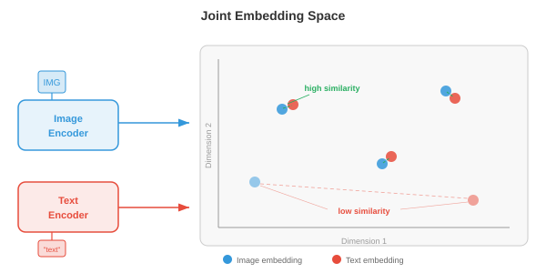
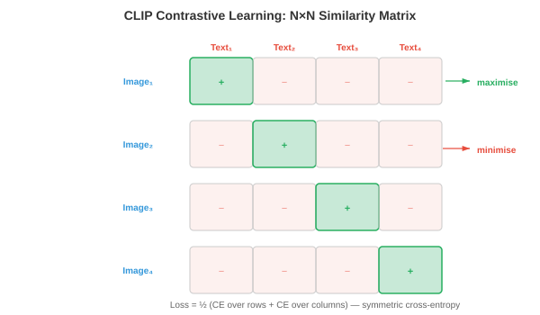
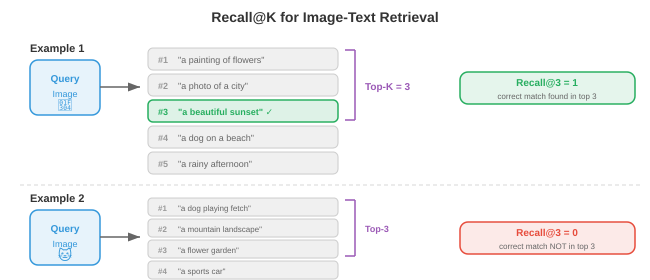

# Мультимодальные представления

*Мультимодальные представления объединяют видение, язык и звук в общие пространства внедрения. В этом файле описаны стратегии слияния, CLIP, ALIGN, SigLIP, функции контрастных потерь (InfoNCE, NT-Xent), нулевая классификация и оценка извлечения.*

- Представьте, что вы сидите в кафе. Вы видите на столе дымящуюся чашку, слышите звон керамики, чувствуете запах жареных кофейных зерен и чувствуете тепло, исходящее от кружки. Ни одно чувство не скажет вам всего: ваш мозг объединяет эти сигналы в единое восприятие «горячего кофе». **Мультимодальное обучение** делает то же самое для машин: оно объединяет информацию из нескольких модальностей (зрение, язык, звук и другие) для создания более богатых и надежных представлений, чем любая отдельная модальность, которую можно обеспечить в отдельности.

- **Модальность** — это отдельный канал информации. В машинном обучении наиболее распространенными модальностями являются изображения (сетки пикселей), текст (последовательности токенов), аудио (формы сигналов или спектрограммы, как в главе 9), видео (последовательности кадров) и структурированные данные (таблицы, графики). Каждая модальность имеет свою статистическую структуру: изображения пространственно связны, текст последователен и дискретен, звук временен и непрерывен. Задача мультимодального обучения — объединить эти фундаментально разные типы данных.

- Зачем комбинировать модальности? Потому что они предоставляют дополнительную информацию. Фотография собаки расскажет вам о ее породе и окрасе, но не о ее имени. Подпись типа «мой золотистый ретривер Макс» сообщает вам имя и породу, но не точную позу. Вместе изображение и текст дают более полную картину, чем каждое из них по отдельности. Эта взаимодополняемость является основной мотивацией: мультимодальные модели могут отвечать на вопросы, генерировать контент и принимать решения, на которые не способна ни одна унимодальная модель.


## Стратегии слияния

- Подумайте о групповом проекте. Вы можете комбинировать идеи двумя способами: все работают вместе в одной комнате с самого начала (делясь необработанными заметками и черновиками), или каждый человек пишет свой раздел независимо, и вы объединяете окончательные документы. Они соответствуют **раннему слиянию** и **позднему слиянию** в мультимодальном обучении.

- **Раннее объединение** (также называемое объединением на уровне объектов) объединяет или смешивает необработанные или низкоуровневые функции из разных модальностей до того, как произойдет какая-либо серьезная обработка. Например, вы можете объединить пиксельные элементы изображения с встраиваниями текстовых токенов и передать объединенную последовательность в один преобразователь. Модель может с самого начала изучать детальные кросс-модальные взаимодействия, но пространство ввода велико, и модель должна научиться одновременно обрабатывать очень разные типы данных.

- Формально, учитывая векторы признаков $x_{\text{img}} \in \mathbb{R}^{d_1}$ и $x_{\text{txt}} \in \mathbb{R}^{d_2}$ из двух модальностей, раннее слияние просто объединяет их:

$$x_{\text{fused}} = [x_{\text{img}}; x_{\text{txt}}] \in \mathbb{R}^{d_1 + d_2}$$

- Этот объединенный вектор затем обрабатывается общей сетью. Преимущество заключается в том, что модель может обнаруживать кросс-модальные корреляции на каждом уровне. Недостатком являются вычислительные затраты и сложность согласования очень разных типов объектов (плотные значения пикселей по сравнению с разреженными индексами токенов).

- **Позднее слияние** (также называемое слиянием на уровне решений) обрабатывает каждую модальность независимо через собственный кодировщик, создавая представление высокого уровня или даже окончательный прогноз для каждой. Затем эти выходные данные объединяются, обычно путем усреднения оценок, голосования или изученного комбинированного слоя. Позднее слияние проще и позволяет повторно использовать предварительно обученные унимодальные модели, имеющиеся в наличии, но оно не может фиксировать низкоуровневые кросс-модальные взаимодействия, поскольку модальности никогда не «видят» необработанные функции друг друга.

- Учитывая прогнозы, специфичные для модальности $\hat{y}_1$ и $\hat{y}_2$, простое правило позднего слияния:

$$\hat{y} = \alpha \hat{y}_1 + (1 - \alpha) \hat{y}_2$$

- где $\alpha \in [0, 1]$ — это изученный или настроенный вручную вес смешивания.- **Срединное слияние** (также называемое промежуточным слиянием) — это прагматичная золотая середина, используемая большинством современных систем. Каждая модальность сначала обрабатывается своим собственным кодировщиком (извлекая специфичные для модальности особенности), а затем закодированные представления объединяются в сети, часто через уровни перекрестного внимания. Это позволяет каждому кодировщику специализироваться на своей модальности, сохраняя при этом богатые кросс-модальные взаимодействия. Flamingo, LLaVA и большинство моделей языка видения (файл 02) используют среднее слияние.


- Выбор между стратегиями объединения зависит от доступности данных, вычислительного бюджета и задачи. Раннее слияние — это мощный инструмент, но требующий больших объемов данных. Позднее слияние дешево, но ограничено. Среднее слияние с перекрестным вниманием стало доминирующим подходом в крупномасштабных мультимодальных моделях, поскольку оно уравновешивает выразительность и модульность.

## Совместные пространства вложения

- Представьте себе универсального переводчика, который может взять любое предложение на любом языке и сопоставить его с одной и той же точкой общего «смыслового пространства». Предложение «собака на пляже» на английском, французском или японском языках будет находиться в одной и той же координате. **Совместные пространства встраивания** делают именно это, но с разными модальностями: изображение собаки на пляже и текст «собака на пляже» должны сопоставляться с соседними точками в одном и том же векторном пространстве.

- Формально мы изучаем две функции кодировщика: $f_\theta : \mathcal{X}_1 \to \mathbb{R}^d$ для модальности 1 (например, изображения) и $g_\phi : \mathcal{X}_2 \to \mathbb{R}^d$ для модальности 2 (например, текст). Оба отображают свои входные данные в одно и то же $d$-мерное пространство. Цель обучения гарантирует, что семантически совпадающие пары $(x_1, x_2)$ имеют вложения $f_\theta(x_1)$ и $g_\phi(x_2)$, которые близки (высокое косинусное сходство), в то время как несовпадающие пары находятся далеко друг от друга.

— Это прямое обобщение пространств встраивания слов из главы 7. Напомним, что Word2Vec и GloVe размещали семантически похожие слова рядом друг с другом в векторном пространстве. Совместные пространства встраивания расширяют эту идею на разные модальности: вместо сходства слов в словах мы измеряем сходство изображения и текста, сходство аудио-текста или даже сходство изображения-звука.

- Метрикой сходства почти всегда является **косинусное сходство** (глава 1):

$$\text{sim}(u, v) = \frac{u \cdot v}{\|u\| \|v\|}$$

- Путем $L_2$-нормализации всех вложений в единичную гиперсферу сходство косинусов сводится к простому скалярному произведению $u \cdot v$, которое чрезвычайно эффективно для вычислений и может быть ускорено с помощью приближенных библиотек ближайших соседей.



- Преимущество совместного пространства встраивания в том, что оно обеспечивает **нулевую передачу**. После того, как вы выровняли встраивания изображений и текста, вы можете классифицировать изображения по категориям, с которыми вы никогда не тренировались: просто вставьте названия категорий в виде текста и найдите, какое встраивание текста ближе всего к встраиванию изображения. Никакой тонкой настройки для конкретной задачи не требуется. Это ключевая идея CLIP и его преемников.

## Сравнительное обучение для мультимодального выравнивания

- Представьте себе упражнение в классе, в котором учащимся дают перетасованные пары фотографий и подписей и просят сопоставить каждую фотографию с правильной подписью. Чтобы сделать это хорошо, вам нужно понимать как визуальный контент, так и язык, и знать, как они связаны. **Контрастное обучение** обучает модели именно таким образом: учитывая набор пар (изображение, текст), модель должна выяснить, какое изображение соответствует какому тексту.

- Как мы видели в главе 8 (файл 04), контрастное обучение в унимодальной настройке (SimCLR, MoCo) объединяет дополненные представления одного и того же изображения и раздвигает представления разных изображений. Мультимодальное контрастивное обучение заменяет «дополненные виды» «совпадающими модальностями»: изображение и его подпись представляют собой положительную пару; изображение в паре с любой другой подписью в пакете является отрицательной парой.

### КЛИП

- **CLIP** (Предварительное обучение контрастному языку и изображению, Рэдфорд и др., 2021) — это основополагающая модель мультимодального контрастивного обучения. Он обучает кодировщик изображений (ViT или ResNet, глава 8) и кодировщик текста (трансформатор, глава 7) совместно на 400 миллионах пар (изображение, текст), взятых из Интернета.- Учитывая пакет пар изображение-текст $N$, CLIP вычисляет матрицу $N \times N$ косинусных сходств между всеми встраиваниями изображений и всеми вложениями текста. Диагональные записи — это совпадающие пары (позитивы); все недиагональные записи не совпадают (отрицательные). Потери при обучении приводят к тому, что диагональные входы становятся выше, а недиагональные — ниже.

- Потеря представляет собой симметричную перекрестную энтропию. Для изображения $i$ в сочетании с текстом $j = i$ потеря изображения в текст составит:

$$\mathcal{L}_{i \to t} = -\frac{1}{N} \sum_{i=1}^{N} \log \frac{\exp(\text{sim}(z_i^{\text{img}}, z_i^{\text{txt}}) / \tau)}{\sum_{k=1}^{N} \exp(\text{sim}(z_i^{\text{img}}, z_k^{\text{txt}}) / \tau)}$$

- и потеря текста в изображение такая же, если роли поменялись местами:

$$\mathcal{L}_{t \to i} = -\frac{1}{N} \sum_{i=1}^{N} \log \frac{\exp(\text{sim}(z_i^{\text{txt}}, z_i^{\text{img}}) / \tau)}{\sum_{k=1}^{N} \exp(\text{sim}(z_i^{\text{txt}}, z_k^{\text{img}}) / \tau)}$$

- Общие потери CLIP являются средними:

$$\mathcal{L}_{\text{CLIP}} = \frac{1}{2}(\mathcal{L}_{i \to t} + \mathcal{L}_{t \to i})$$

- Здесь $\tau$ — это изученный параметр **температуры** (инициализируется $\tau = 0.07$). Температура контролирует четкость распределения softmax: низкий $\tau$ заставляет модель сильнее фокусироваться на ближайшем совпадении, высокий $\tau$ распределяет вероятность более равномерно. CLIP изучает $\tau$ вместе с весами модели, а не рассматривает его как фиксированный гиперпараметр.



- Кодер изображения CLIP обычно представляет собой ViT-L/14 (большой преобразователь изображения с патчами 14x14, глава 8, файл 04). Кодировщик текста представляет собой 12-слойный преобразователь с причинно-следственной маскировкой (например, GPT, глава 7, файл 04). Оба кодировщика проецируют свои выходные данные в общее 512- или 768-мерное пространство с помощью обученной линейной проекции с последующей нормализацией $L_2$.

- Самым замечательным свойством CLIP является **классификация изображений с нулевым кадром**. Чтобы отнести изображение к одной из категорий $K$, вы создаете текстовые подсказки $K$, такие как «фотография {имя класса}», встраиваете каждое приглашение с помощью кодировщика текста, встраиваете изображение с помощью кодировщика изображений и выбираете класс, встраивание текста которого имеет наибольшее косинусное сходство с встраиванием изображения. В ImageNet CLIP достигает конкурентоспособной точности, не видя ни одного обучающего примера ImageNet.

### ВЫРАВНИТЬ

- **ALIGN** (Jia et al., 2021) масштабирует подход CLIP к более зашумленному и большему набору данных: 1,8 миллиарда пар изображение-текст с минимальной фильтрацией. В то время как CLIP тщательно обрабатывал свои данные, ALIGN показывает, что масштаб может компенсировать шум. ALIGN использует кодировщик изображений EfficientNet и кодировщик текста BERT и обучается с одинаковыми потерями контрастности. Ключевой вывод заключается в том, что при достаточном количестве данных вам не нужна дорогостоящая очистка данных: контрастная цель естественным образом снижает вес зашумленных пар, поскольку они создают противоречивые градиенты.

### СигЛИП

- **SigLIP** (Потеря сигмовидной кишки для предварительной тренировки языка и изображения, Чжай и др., 2023) заменяет контрастивную потерю CLIP на основе softmax на более простую потерю сигмовидной кишки. Вместо того, чтобы рассматривать матрицу сходства $N \times N$ как задачу классификации (каждая строка представляет собой softmax по столбцам), SigLIP обрабатывает каждую запись независимо как двоичную классификацию: совпадает ли эта пара (изображение, текст) или нет?

- Потери SigLIP для одной пары $(i, j)$ составляют:

$$\mathcal{L}_{ij} = -y_{ij} \log \sigma(z_i^{\text{img}} \cdot z_j^{\text{txt}} / \tau) - (1 - y_{ij}) \log(1 - \sigma(z_i^{\text{img}} \cdot z_j^{\text{txt}} / \tau))$$

- где $y_{ij} = 1$, если $i = j$ (совпадает) и $y_{ij} = 0$ в противном случае, а $\sigma$ - сигмовидная функция.

- Важнейшим преимуществом SigLIP является то, что он устраняет необходимость глобальной нормализации softmax для всей партии. В CLIP знаменатель softmax требует сбора всех вложений на всех устройствах, что является узким местом в распределенном обучении. Сигмовидные потери SigLIP для каждой пары можно рассчитать локально, что обеспечивает более эффективное масштабирование для очень больших пакетов. SigLIP соответствует качеству CLIP при более низких затратах на обучение.

## Функции контрастных потерь в деталях

- Функции потерь, используемые в контрастном обучении, имеют общую структуру: все они пытаются сделать показатель сходства положительных пар выше, чем отрицательных пар, с некоторым понятием «запаса» или «температуры», контролирующего, насколько сильно модель продвигается. Формализуем ключевые варианты.

### ИнфоNCE- **InfoNCE** (Оценка контрастности шума, ван ден Оорд и др., 2018) является теоретической основой потерь CLIP. Учитывая запрос $q$, один положительный ключ $k^+$ и отрицательные $K$ $\{k_1^-, \ldots, k_K^-\}$, потеря составит:

$$\mathcal{L}_{\text{InfoNCE}} = -\log \frac{\exp(q \cdot k^+ / \tau)}{\exp(q \cdot k^+ / \tau) + \sum_{j=1}^{K} \exp(q \cdot k_j^- / \tau)}$$

- Это задача классификации $(K+1)$-способа: определить положительный среди кандидатов $K+1$. InfoNCE — это нижняя граница взаимной информации между запросом и положительным ключом, поэтому ее максимизация выравнивает представления семантически согласованных входных данных. Граница ужесточается по мере увеличения количества негативов $K$, что объясняет, почему контрастные методы выигрывают от больших размеров партий.

### NT-Xent

- **NT-Xent** (нормализованная перекрестная энтропия с температурной шкалой, Chen et al., 2020) — это потери, используемые в SimCLR (глава 8, файл 04), и по сути это InfoNCE, применяемый симметрично внутри пакета. Для пакета пар $N$ расширенные представления $2N$ создают отрицательные значения $2N - 2$ для каждой привязки (все представления, кроме самого себя и его положительного). Убыток по положительной паре $(i, j)$ составит:

$$\ell_{i,j} = -\log \frac{\exp(\text{sim}(z_i, z_j) / \tau)}{\sum_{k=1}^{2N} \mathbf{1}_{[k \neq i]} \exp(\text{sim}(z_i, z_k) / \tau)}$$

- NT-Xent и InfoNCE — это одна и та же математическая формула; названия различаются, поскольку они были представлены в разных контекстах (видение с самоконтролем или теория обучения представлению).

### Роль температуры

- **Температура** $\tau$ — один из наиболее важных гиперпараметров в контрастивном обучении. Чтобы построить интуицию, подумайте о температуре в физическом смысле: при высокой температуре молекулы движутся хаотично (софтмакс плоский, все негативы выглядят одинаково плохо); при низкой температуре молекулы образуют жёсткие структуры (софтмакс достигает максимума, имеют значение только самые жёсткие негативы).

- Формально, как $\tau \to 0$, softmax приближается к жесткому argmax, который выбирает только один самый жесткий отрицательный аргумент. Как $\tau \to \infty$, все негативы вносят одинаковый вклад. На практике $\tau \in [0.01, 0.1]$ хорошо работает для нормализованных вложений. Слишком низкая температура приводит к нестабильности тренировки (градиенты становятся очень большими для жестких негативов); слишком высокая температура делает потери нечувствительными к нарушениям.

- CLIP инициализирует $\tau = 0.07$ и запоминает его как логарифмически параметризованный скаляр $\tau = \exp(t)$, где $t$ обновляется путем градиентного спуска вместе с весами модели. Это позволяет модели автоматически регулировать сложность контрастного задания во время обучения.


### Тройной убыток и альтернативы, основанные на марже

- До того, как InfoNCE доминировала, **тройная потеря** была стандартом для обучения метрикам. Учитывая якорь $a$, положительный $p$ и отрицательный $n$:

$$\mathcal{L}_{\text{triplet}} = \max(0, \|a - p\|^2 - \|a - n\|^2 + m)$$

- где $m$ — это запас, обеспечивающий нахождение положительного значения как минимум на $m$ ближе, чем отрицательного. Потеря триплетов действует на отдельные триплеты, а не на партии, что делает его менее эффективным в выборке, чем InfoNCE. Он также чувствителен к стратегии майнинга: случайные негативы часто бывают слишком простыми (потери равны нулю), поэтому **жесткий негативный майнинг** (выбор ближайшего неправильного совпадения) или **полужесткий майнинг** (выбор негативов в пределах поля) имеет решающее значение.

- InfoNCE неявно выполняет жесткий отрицательный анализ по всей партии, что является одной из причин, по которой он превосходит тройные потери в масштабе. Нормализация softmax в InfoNCE автоматически увеличивает вес жестких негативов (тех, которые имеют большое сходство с якорем), обеспечивая естественный учебный план без явного интеллектуального анализа.

## Извлечение изображения и текста и классификация с нулевым выстрелом

- После того, как у вас есть обученное совместное пространство для встраивания, вы можете выполнить **извлечение изображения и текста**: по запросу изображения найти наиболее релевантные тексты из базы данных (извлечение изображения в текст) или по текстовому запросу найти наиболее релевантные изображения (извлечение текста в изображение). Это просто поиск ближайшего соседа в общем пространстве встраивания.- Представьте себе библиотекаря, который может мгновенно сравнить любую фотографию с любой подписью в каталоге, насчитывающем миллион единиц. Им не нужно заранее понимать все возможные категории; они просто измеряют, насколько «близка» каждая фотография к каждой подписи. Именно так модели в стиле CLIP выполняют поиск и нулевую классификацию.

- **Классификация с нулевым выстрелом** — это особый случай преобразования текста в изображение. Учитывая имена классов $K$, вы создаете текстовые подсказки $\{t_1, \ldots, t_K\}$ (например, «фото кошки», «фото собаки») и встраиваете их. Для нового изображения $x$ прогнозируемый класс:

$$\hat{y} = \arg\max_{k} \; \text{sim}(f_\theta(x), g_\phi(t_k))$$

- Ключевым моментом является то, что кодировщик текста действует как гибкая головка классификатора. Вместо обучения нового линейного слоя для каждой последующей задачи вы просто описываете задачу на естественном языке. Вот почему CLIP так хорошо обобщает: кодировщик текста видел миллионы разнообразных описаний во время предварительного обучения.

- **Быстрое проектирование** имеет значение. Точность нулевого кадра CLIP в ImageNet повышается с 63,2% до 68,4%, просто изменяя шаблон запроса с «{имя класса}» на «фото {имя класса}». Более того, **быстрое объединение** усредняет вложения текста из нескольких шаблонов (например, «фотография {имя класса}», «хорошая фотография {имя класса}», «рисунок {имя класса}») для создания более надежного текстового представления.


## Аудиовизуальная переписка

- Закройте глаза и послушайте, как кто-то подбрасывает баскетбольный мяч. Вы можете определить, когда он упадет на пол, по ритмичным звукам. Теперь откройте глаза: визуальный отскок идеально совпадает с каждым ударом. Это тесное соответствие между звуковыми и визуальными событиями является бесплатным контролирующим сигналом, на котором машины могут учиться. **Аудиовизуальное обучение** учит модели ассоциировать звуки с их визуальными источниками без каких-либо человеческих ярлыков.

— Идея поразительно похожа на CLIP, но текст заменяется звуком. Учитывая парные видеокадры и аудиосегменты, модель изучает пространство внедрения, в котором выровненные по времени аудиовизуальные пары расположены близко, а невыровненные пары находятся далеко друг от друга.

- Методы **аудиовизуального встраивания (AVE)** (Аранджелович и Зиссерман, 2017) обучают визуальный кодировщик $f$ и аудиокодер $g$ с контрастной потерей видеоданных. Положительная пара — это (видеокадр, аудиоклип одного и того же времени), а негативная пара — это аудиоклипы из разных видео или разного времени. Модель узнает, что звук лая соответствует изображению собаки, а звук гитары соответствует изображению гитары, и все это без ярлыков.

- Аудиокодер обычно обрабатывает **логарифмические спектрограммы** (глава 9, файл 01) с использованием CNN или аудиопреобразователя, создавая встраивание фиксированного размера. Визуальный кодер обрабатывает видеокадры, используя стандартную магистраль изображений (ResNet, ViT). Оба проецируются в общее многомерное пространство $d$, и при обучении используются те же потери InfoNCE, что и при CLIP:

$$\mathcal{L}_{\text{AV}} = -\log \frac{\exp(\text{sim}(z^{\text{vis}}, z^{\text{aud}}) / \tau)}{\sum_{k=1}^{N} \exp(\text{sim}(z^{\text{vis}}, z_k^{\text{aud}}) / \tau)}$$


- **Приложения** аудиовизуального обучения включают в себя: локализацию источника звука (откуда на изображении исходит звук?), аудиовизуальное распознавание речи (сочетание движений губ со звуком, как в главе 9, файл 02), аудиовизуальное разделение источника (изолирование голоса одного говорящего путем наблюдения за его лицом, задача «коктейльной вечеринки» из главы 9, файл 05) и создание видео на основе звука.

- **ImageBind** (Girdhar et al., 2023) расширяет это до шести модальностей: изображения, текст, аудио, глубина, тепловые данные и данные IMU. Ключевой вывод заключается в том, что вам не нужны парные данные для каждой комбинации. Приравнивая каждую модальность к изображениям (используя пары изображение-текст для текста, пары изображение-аудио для аудио и т. д.), все модальности неявно выравниваются через общее пространство встраивания изображений. Эта «связка» посредством общей модальности привязки приводит к неожиданному согласованию: аудио и текст становятся похожими, даже если они никогда не обучались вместе напрямую.

## Оценка

- Для оценки мультимодальных моделей необходимы показатели, отражающие межмодальное понимание. Двумя доминирующими парадигмами оценки являются **тесты с нулевым результатом** и **показатели извлечения**.

### Тесты с нулевым выстрелом- Оценка с нулевым выстрелом позволяет определить, может ли модель выполнять задачи, для которых она никогда не была специально обучена. Наиболее распространенным тестом является **нулевая точность ImageNet**: встраивайте все 1000 названий классов ImageNet в виде текста, встраивайте каждое тестовое изображение и измеряйте точность классификации топ-1 и топ-5 на основе косинусного сходства. CLIP ViT-L/14 достигает точности первого уровня 75,5% при нулевом выстреле, что сравнимо с контролируемым ResNet-50, обученным на ImageNet.

- Другие тесты с нулевым выстрелом включают: CIFAR-10/100, STL-10, Food-101, Oxford Pets и Flowers-102. Оценка по множеству наборов данных позволяет проверить, действительно ли модель обладает общим визуальным пониманием или просто запомнила закономерности из данных предварительного обучения.

- Оценка **Линейного датчика** является дополнительным испытанием. Вы замораживаете предварительно обученный кодировщик изображений, извлекаете признаки для помеченного набора данных и поверх него обучаете простой линейный классификатор. Это измеряет качество изученных представлений независимо от механизма поиска с нулевым выстрелом. Возможности CLIP — это превосходные характеристики линейных датчиков, часто соответствующие контролируемому предварительному обучению или превосходящие его.

### Метрики извлечения

- Для задач извлечения (изображение в текст и текст в изображение) стандартной метрикой является **Recall@K** (R@K): доля запросов, для которых правильное совпадение появляется в первых $K$ полученных результатах. Общие значения: R@1, R@5 и R@10.

— Формально для набора запросов $Q$:

$$\text{R@}K = \frac{1}{Q} \sum_{q=1}^{Q} \mathbf{1}[\text{rank}(q) \leq K]$$

- где $\text{rank}(q)$ — позиция правильного соответствия в ранжированном списке поиска для запроса $q$.

- Стандартные тесты поиска включают **Flickr30K** (31 000 изображений, каждое с 5 подписями) и **MS-COCO** (123 000 изображений, каждое с 5 подписями). Оценка выполняется в рамках тестового разделения: по заданному изображению извлекаются правильные подписи из полного тестового набора и наоборот.

– **Медианный рейтинг** (MedR) – это дополнительный показатель: медианная позиция правильного соответствия по всем запросам. Идеальная модель имеет MedR = 1. Чем меньше, тем лучше.

- Помимо поиска, мультимодальные модели также оцениваются по критериям композиционного понимания, таким как **Winoground** (который проверяет, может ли модель отличить «кружку собаки» от «собаки в кружке») и **ARO** (Атрибут, Связь, Порядок), которые проверяют, действительно ли модель понимает структуру языка или просто соответствует набору слов. Модели в стиле CLIP часто с этим сталкиваются, обнаруживая фундаментальное ограничение: контрастное предварительное обучение выравнивает глобальную семантику, но может не отражать мелкозернистую композиционную структуру.



## Собираем все вместе

- Мультимодальные представления, описанные в этом файле, составляют основу всего, что будет следовать в этой главе. Совместные пространства внедрения, обученные CLIP и его преемниками, являются «клеем», соединяющим зрение и язык. Файл 02 основывается на этой основе с помощью моделей языка видения, которые выходят за рамки поиска и позволяют генерировать текст об изображениях. В файле 03 показано, как изображения и видео маркируются для использования в моделях последовательностей. Файл 04 охватывает кросс-модальную генерацию (текст-изображение, текст-видео). А в файле 05 рассматриваются унифицированные архитектуры, которые обрабатывают множество модальностей в рамках одной модели.

- Основной вывод: контрастное обучение на парных данных создает пространства для внедрения, в которых различные модальности взаимозаменяемы. Встраивание изображения и встраивание текста становятся «одним и тем же», обеспечивая нулевую классификацию, поиск и плавную интеграцию в более крупные системы. Простота этой идеи — просто сдвинуть совпадающие пары вместе и раздвинуть несовпадающие пары — противоречит ее исключительной эффективности.

## Задачи по кодированию (используйте CoLab или блокнот)

1. Внедрить контрастную потерю CLIP с нуля. Создайте случайные встраивания изображений и текста, вычислите матрицу сходства и вычислите симметричную потерю перекрестной энтропии.
```python
import jax
import jax.numpy as jnp
import matplotlib.pyplot as plt

def clip_loss(image_embeds, text_embeds, temperature=0.07):
    """Compute symmetric CLIP contrastive loss."""
    # L2 normalise embeddings
    image_embeds = image_embeds / jnp.linalg.norm(image_embeds, axis=1, keepdims=True)
    text_embeds = text_embeds / jnp.linalg.norm(text_embeds, axis=1, keepdims=True)

    # Compute cosine similarity matrix (N x N)
    logits = image_embeds @ text_embeds.T / temperature  # (N, N)

    # Labels: the diagonal (i-th image matches i-th text)
    N = logits.shape[0]
    labels = jnp.arange(N)

    # Symmetric cross-entropy: image-to-text + text-to-image
    loss_i2t = -jnp.mean(jax.nn.log_softmax(logits, axis=1)[jnp.arange(N), labels])
    loss_t2i = -jnp.mean(jax.nn.log_softmax(logits, axis=0)[labels, jnp.arange(N)])
    return (loss_i2t + loss_t2i) / 2, logits * temperature

# Simulate a batch of 8 image-text pairs in 64-dim space
key = jax.random.PRNGKey(42)
k1, k2 = jax.random.split(key)
N, D = 8, 64
image_embeds = jax.random.normal(k1, (N, D))
text_embeds = jax.random.normal(k2, (N, D))

loss, sim_matrix = clip_loss(image_embeds, text_embeds)
print(f"CLIP loss (random embeddings): {loss:.4f}")

# Visualise the similarity matrix
fig, ax = plt.subplots(figsize=(6, 5))
im = ax.imshow(sim_matrix, cmap='coolwarm', vmin=-1, vmax=1)
ax.set_xlabel("Text index"); ax.set_ylabel("Image index")
ax.set_title(f"Cosine Similarity Matrix (loss={loss:.3f})")
plt.colorbar(im); plt.tight_layout(); plt.show()
# Try changing temperature (0.01, 0.1, 1.0) and observe how loss changes
# Try making matched pairs similar: set text_embeds = image_embeds + small noise
```

2. Создайте модель встраивания игрушечных суставов, которая научится выравнивать 2D-изображения (случайные векторы) с «подписями» (различные случайные векторы), используя потери InfoNCE и градиентный спуск.
```python
import jax
import jax.numpy as jnp
import matplotlib.pyplot as plt

def info_nce_loss(img_enc, txt_enc, img_data, txt_data, tau=0.1):
    """InfoNCE over a batch of paired (image, text) data."""
    z_img = img_data @ img_enc  # (N, D)
    z_txt = txt_data @ txt_enc  # (N, D)
    # L2 normalise
    z_img = z_img / jnp.linalg.norm(z_img, axis=1, keepdims=True)
    z_txt = z_txt / jnp.linalg.norm(z_txt, axis=1, keepdims=True)
    logits = z_img @ z_txt.T / tau
    labels = jnp.arange(logits.shape[0])
    return -jnp.mean(jax.nn.log_softmax(logits, axis=1)[jnp.arange(len(labels)), labels])

# Create 32 paired samples: img in R^8, txt in R^6, embed into R^4
key = jax.random.PRNGKey(0)
k1, k2, k3, k4 = jax.random.split(key, 4)
N, d_img, d_txt, d_embed = 32, 8, 6, 4

img_data = jax.random.normal(k1, (N, d_img))
txt_data = jax.random.normal(k2, (N, d_txt))

# Learnable projection matrices
img_enc = jax.random.normal(k3, (d_img, d_embed)) * 0.1
txt_enc = jax.random.normal(k4, (d_txt, d_embed)) * 0.1

grad_fn = jax.jit(jax.grad(info_nce_loss, argnums=(0, 1)))
lr = 0.05
losses = []

for step in range(300):
    loss = info_nce_loss(img_enc, txt_enc, img_data, txt_data)
    losses.append(float(loss))
    g_img, g_txt = grad_fn(img_enc, txt_enc, img_data, txt_data)
    img_enc = img_enc - lr * g_img
    txt_enc = txt_enc - lr * g_txt

print(f"Initial loss: {losses[0]:.3f}, Final loss: {losses[-1]:.3f}")
print(f"Random baseline (log N): {jnp.log(N):.3f}")

plt.figure(figsize=(8, 4))
plt.plot(losses, color='#2c3e50')
plt.axhline(y=0, color='green', linestyle='--', alpha=0.5, label='Perfect alignment')
plt.axhline(y=float(jnp.log(N)), color='red', linestyle='--', alpha=0.5, label='Random (log N)')
plt.xlabel("Step"); plt.ylabel("InfoNCE Loss")
plt.title("Learning a Joint Embedding Space")
plt.legend(); plt.grid(alpha=0.3); plt.tight_layout(); plt.show()
# Modify d_embed (try 2, 4, 16) to see how embedding dimension affects alignment
```3. Реализуйте нулевую классификацию с заранее вычисленными вложениями. Имитируйте «прототипы» классов как вложения текста и классифицируйте новые изображения путем поиска ближайшего соседа.
```python
import jax
import jax.numpy as jnp
import matplotlib.pyplot as plt

# Simulate 5 classes, each with a prototype text embedding in R^32
key = jax.random.PRNGKey(42)
n_classes, d = 5, 32
class_names = ["cat", "dog", "car", "plane", "ship"]

# Class prototypes (imagine these came from a text encoder)
k1, k2 = jax.random.split(key)
class_prototypes = jax.random.normal(k1, (n_classes, d))
class_prototypes = class_prototypes / jnp.linalg.norm(class_prototypes, axis=1, keepdims=True)

# Generate 200 test "images" (embeddings near their class prototype + noise)
n_per_class = 40
true_labels = jnp.repeat(jnp.arange(n_classes), n_per_class)
keys = jax.random.split(k2, n_classes * n_per_class)

image_embeds = []
for i in range(n_classes):
    noise = jax.random.normal(keys[i], (n_per_class, d)) * 0.5
    cluster = class_prototypes[i] + noise
    image_embeds.append(cluster)
image_embeds = jnp.concatenate(image_embeds, axis=0)
image_embeds = image_embeds / jnp.linalg.norm(image_embeds, axis=1, keepdims=True)

# Zero-shot classification: cosine similarity with each prototype
similarities = image_embeds @ class_prototypes.T  # (200, 5)
predicted_labels = jnp.argmax(similarities, axis=1)
accuracy = jnp.mean(predicted_labels == true_labels)
print(f"Zero-shot accuracy: {accuracy:.1%}")

# Confusion matrix
conf = jnp.zeros((n_classes, n_classes), dtype=jnp.int32)
for true, pred in zip(true_labels, predicted_labels):
    conf = conf.at[true, pred].add(1)

fig, ax = plt.subplots(figsize=(6, 5))
im = ax.imshow(conf, cmap='Blues')
ax.set_xticks(range(n_classes)); ax.set_xticklabels(class_names, rotation=45)
ax.set_yticks(range(n_classes)); ax.set_yticklabels(class_names)
ax.set_xlabel("Predicted"); ax.set_ylabel("True")
for i in range(n_classes):
    for j in range(n_classes):
        ax.text(j, i, int(conf[i, j]), ha='center', va='center', fontsize=11)
ax.set_title(f"Zero-Shot Confusion Matrix (acc={accuracy:.1%})")
plt.colorbar(im); plt.tight_layout(); plt.show()
# Try increasing noise (0.5 -> 1.0 -> 2.0) to see accuracy degrade
# Try adding prompt ensembling: average 3 noisy copies of each prototype
```