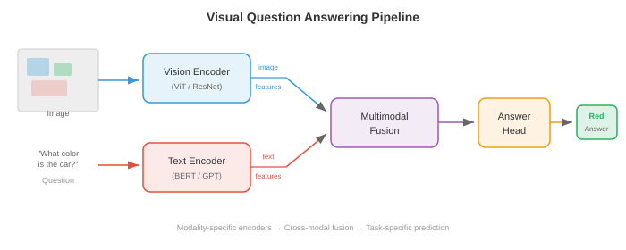
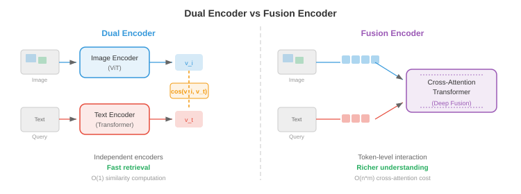
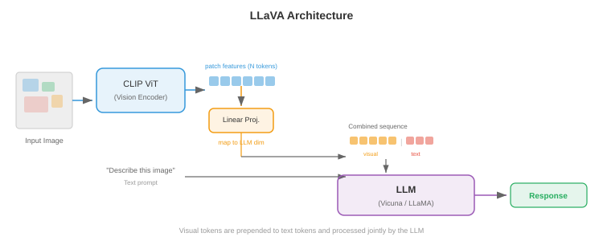
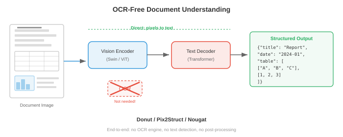

# Модели языка видения

*Модели визуального языка совместно понимают изображения и текст, позволяя визуально отвечать на вопросы, создавать подписи к изображениям и визуальные рассуждения. В этом файле описаны VQA, субтитры к изображениям, визуальное обоснование и такие архитектуры, как VisualBERT, BLIP, LLaVA, Flamingo, PaLI и Qwen-VL, которые объединяют видеокодеры с большими языковыми моделями.*

- Подумайте о музейном гиде, который может посмотреть на картину и сформулировать все о ней: какие предметы присутствуют, какую историю она рассказывает, какие эмоции она передает, и ответить на любой вопрос, который может задать посетитель. **Модель языка видения (VLM)** — это вычислительный эквивалент — система, которая совместно понимает изображения и текст, что позволяет ей описывать визуальные сцены, отвечать на вопросы о них, следовать визуальным инструкциям и даже находить определенные объекты внутри изображения с помощью запроса на естественном языке.

- VLM находятся на пересечении кодировщиков машинного зрения, с которыми вы познакомились в главе 8, и языковых моделей из главы 7. Основная инженерная задача состоит в соединении двух очень разных репрезентативных миров: пространственных, непрерывных карт признаков магистрали машинного зрения и последовательных дискретных вложений токенов языковой модели. Каждая архитектура в этом файле по своей сути представляет собой отдельный ответ на вопрос: как объединить видение и язык?


## Визуальный ответ на вопрос

- Представьте, что кто-то показывает вам фотографию и спрашивает: «Сколько собак в парке?» Вы без особых усилий анализируете изображение, находите собак, считаете их и даете ответ. **Визуальный ответ на вопрос (VQA)** формализует это: учитывая изображение $I$ и вопрос на естественном языке $q$, предскажите ответ $a$.

- Задачу можно сформулировать несколькими способами. Чаще всего VQA рассматривается как **открытая классификация**: модель выбирает из фиксированного словаря наиболее частые ответы (например, 3129 лучших ответов в VQA v2). В качестве альтернативы его можно рассматривать как **генеративный ответ**, когда модель создает текстовую строку произвольной формы — именно этот подход используют современные VLM.

- Формально вы хотите изучить функцию $f(I, q) \to a$, которая максимизирует вероятность правильного ответа. В настройке классификации это выглядит следующим образом:

$$p(a \mid I, q) = \text{softmax}(W \cdot g(v, h))$$

- где $v$ — вектор визуальных признаков (из CNN или ViT), $h$ — кодировка вопроса (из LSTM или Transformer), а $g$ — функция слияния, объединяющая их. В дизайне $g$ заключено настоящее архитектурное творчество.

- **VQA v1** (Antol et al., 2015) представил тест с 614 000 вопросов на 204 000 изображений из MS COCO. Исследователи быстро обнаружили, что модели могут достигать удивительно высокой точности, используя **языковые априоры** — отвечая «2» на вопрос «сколько» или «да» на вопрос «есть ли», даже не глядя на изображение.

- **VQA v2** (Goyal et al., 2017) решил эту проблему, соединив каждый вопрос с двумя похожими изображениями, которые дают разные ответы. Это заставило моделей основывать свои рассуждения на визуальном контенте. Настройка сбалансированной пары примерно удваивает набор данных и делает сокращения, использующие только язык, гораздо менее эффективными.

- Другие важные наборы данных VQA включают **GQA** (Hudson & Manning, 2019) с композиционными вопросами, требующими многоэтапного рассуждения, **OK-VQA** (Марино и др., 2019), требующий внешних знаний, помимо изображения, и **TextVQA** (Singh et al., 2019), где ответ зависит от чтения текста внутри изображения.

- Ранние модели VQA использовали простую стратегию: извлекали признаки изображения из предварительно обученной CNN (обычно предпоследнего уровня ResNet или VGGNet из главы 8), кодировали вопрос с помощью LSTM (глава 6) и объединяли их. Комбинационная функция $g$ быстро развивалась: от простого поэлементного умножения к билинейному объединению и мультимодальному разложению Такера. **Билинейное внимание** вычисляет $v^T W h$, где $W$ — обучаемая матрица взаимодействия, но полная билинейная форма имеет параметры $O(d_v \times d_h)$, которые слишком велики. **MLB** (мультимодальное билинейное объединение низкого ранга) разбивает это на две проекции низкого ранга, что делает его удобным.

- Прорывом для VQA стало внимание. **Stacked Attention Networks** (Yang et al., 2016) использовала кодирование вопросов для наблюдения за пространственными областями изображения, итеративно уточняя, на каких частях изображения следует сосредоточиться. Эта идея — позволить вопросу «посмотреть» на соответствующие области изображения — стала стандартной.

## Подпись к изображению

- Представьте себе друга, который смотрит на ваши отпускные фотографии и рассказывает о том, что он видит: «Золотистый ретривер ловит фрисби на солнечном пляже». **Подпись к изображению** – это задача создания описания изображения на естественном языке. В отличие от VQA здесь нет вопросов — модель должна сама решить, что стоит описывать.

- **Покажи и расскажи** (Виньялс и др., 2015) разработали каноническую архитектуру кодировщика-декодера для субтитров. Кодер CNN (например, Inception или ResNet) создает один вектор признаков изображения $v$. Этот вектор используется в качестве начального скрытого состояния декодера LSTM, который затем генерирует заголовок слово за словом, авторегрессионно:

$$p(w_t \mid w_{1:t-1}, I) = \text{LSTM}(w_{t-1}, h_{t-1})$$

- Вся модель обучается сквозным путем максимизации логарифмической вероятности достоверных подписей. Во время вывода лучевой поиск (глава 7) используется для поиска заголовков с высокой вероятностью.

— Проблема с «Покажи и расскажи» в том, что все изображение сжимается в один вектор. Для сложных сцен один вектор не может передать все важные детали. Вы теряете пространственную информацию — модель не может «оглядываться назад» на определенные части изображения, генерируя разные слова.

- **Покажи, пригласи и скажи** (Xu et al., 2015) решил эту проблему, введя **внимание к областям изображения**. Вместо кодирования изображения как одного вектора CNN создает сетку пространственных признаков (например, $14 \times 14 \times 512$ из последнего сверточного слоя VGGNet). На каждом этапе декодирования модель вычисляет веса внимания для этих пространственных местоположений, создавая вектор контекста, который выделяет наиболее релевантную область для текущего слова.

- Вспомните механизм внимания из главы 6: скрытое состояние декодера действует как запрос, пространственные объекты действуют как ключи и значения, а веса внимания сообщают модели, где искать. Авторы предложили два варианта: **мягкое внимание** (дифференцируемое средневзвешенное значение всех регионов) и **жесткое внимание** (стохастическая выборка одного региона, обученная с помощью REINFORCE).


- Карты внимания, создаваемые этими моделями, прекрасно интерпретируются: при генерации слова «собака» внимание достигает максимума в области собаки; при генерации «пляжа» он переключается на песок и воду. Это была одна из первых убедительных демонстраций того, что внимание обеспечивает встроенную интерпретируемость.

- **CIDEr** (Vedantam et al., 2015), **METEOR**, **BLEU** и **SPICE** — стандартные показатели оценки субтитров. CIDEr вычисляет взвешенное по TF-IDF сходство n-грамм между сгенерированными и эталонными подписями, специально разработанное для оценки подписей. Современные VLM обычно оцениваются с помощью CIDEr на предмет таких тестов субтитров, как MS COCO Captions и NoCaps.

- Более поздние модели субтитров включали **внимание снизу вверх** (Anderson et al., 2018), когда детектор объектов (Faster R-CNN, глава 8) сначала предлагает заметные области изображения, а модель субтитров учитывает эти особенности региона, а не однородную сетку. Это был доминирующий подход до того, как на смену пришли кодеры на базе ViT.

## Шаблоны архитектуры- Каждый VLM должен ответить на фундаментальный вопрос проектирования: в какой момент взаимодействуют зрение и язык? Ответ определяет семейство архитектуры модели. Существует три основных модели, каждая из которых имеет свои компромиссы.

### Двойной кодер

- Представьте себе двух переводчиков, работающих независимо друг от друга: один читает документ на французском языке, другой — на английском, и каждый из них составляет резюме на общем «универсальном языке». Они никогда не общаются во время перевода, но их изложения прямо сопоставимы. Это шаблон **двойного кодировщика**.

- Видеокодер $f_v$ и текстовый кодер $f_t$ независимо отображают свои соответствующие входные данные в общее пространство внедрения размером $d$. Внедрение изображения — $v = f_v(I) \in \mathbb{R}^d$, а встраивание текста — $t = f_t(q) \in \mathbb{R}^d$. Сходство вычисляется через скалярное произведение или косинусное сходство: $\text{sim}(I, q) = v^T t / (\|v\| \|t\|)$.

- CLIP (Radford et al., 2021), описанный в предыдущем файле о мультимодальных представлениях, представляет собой прототип двойного кодера. Он обучен с использованием контрастной цели (InfoNCE) на 400 миллионах пар изображение-текст, взятых из Интернета. Поскольку кодировщики независимы, вы можете предварительно вычислить и кэшировать все встраивания изображений, что делает поиск чрезвычайно эффективным — вам нужно только закодировать текст запроса во время поиска.

- Слабость двойного кодировщика в том, что зрение и язык никогда не взаимодействуют на уровне функций. Модель не может выполнять детальные кросс-модальные рассуждения: она не может, например, определить, соответствует ли конкретное слово в подписи определенной области изображения. Это ограничивает его полезность для таких задач, как VQA или обоснованные субтитры.

### Fusion-кодер

- А теперь представьте, что два переводчика находятся в одной комнате и активно обсуждают оба документа. Они могут указывать на конкретные отрывки, задавать друг другу вопросы и достигать общего понимания. Это шаблон **кодировщика Fusion**.

- Обе модальности кодируются, а затем объединяются через **уровни перекрестного внимания**, где токены из одной модальности сопровождаются токенами из другой. Изображение сначала обрабатывается видеокодером в последовательность токенов патча или региона $V = [v_1, \ldots, v_N]$. Текст преобразуется в $T = [t_1, \ldots, t_M]$. В слоях слияния текстовые токены обращаются к токенам изображений посредством перекрестного внимания:

$$\text{CrossAttn}(T, V) = \text{softmax}\!\left(\frac{(TW_Q)(VW_K)^T}{\sqrt{d_k}}\right)(VW_V)$$

- Это обеспечивает детальное взаимодействие: каждый текстовый токен может обслуживать определенные области изображения, которые ему нужны. Этот шаблон используется в таких моделях, как **VisualBERT**, **VilBERT** и **UNITER**. Плата за это заключается в том, что вы не можете предварительно вычислить отдельные вложения для извлечения — каждая пара изображение-текст требует полного прямого прохода через слои слияния.



### Кодер-декодер

- Шаблон **энкодер-декодер** сочетает в себе кодировщик изображения с декодером текста, который генерирует выходные токены авторегрессионно, подобно моделям seq2seq из главы 7. Кодировщик изображения создает контекстные представления изображений, а текстовый декодер перекрестно обрабатывает их при генерации выходного текста.

- Этот шаблон естественным образом поддерживает генеративные задачи: субтитры, VQA с ответами в свободной форме и визуальный диалог. Эту архитектуру используют такие модели, как **GIT** (генеративный преобразователь изображения в текст, Ван и др., 2022 г.), **CoCa** (Contrastive Captioner, Ю и др., 2022 г.) и **PaLI**. CoCa умело сочетает в себе шаблоны двойного кодирования и кодировщика-декодера: первая половина слоев текстового декодера работает как унимодальный текстовый кодировщик (для контрастного обучения), а вторая половина перекрестно обрабатывает функции изображения (для генеративных субтитров), получая лучшее из обоих миров.

— Выбор среди этих трёх шаблонов зависит от целевой задачи. Двойные кодеры оптимальны для масштабного поиска. Кодеры Fusion лучше всего подходят для задач детального понимания. Кодеры-декодеры наиболее универсальны для генеративных задач. Современные VLM все чаще применяют парадигму кодирования-декодера или только декодера, рассматривая каждую задачу визуального языка как генерацию текста.

## Flamingo: мультимодальное обучение с небольшим количеством шагов- Подумайте об опытном эксперте, который после многих лет изучения искусства и литературы может взглянуть на совершенно новый стиль живописи и красноречиво описать его, увидев всего лишь один или два примера. **Flamingo** (Alonso et al., 2022, DeepMind) построен по тому же принципу: он использует мощную предварительно обученную языковую модель и предварительно обученный кодировщик изображений, соединяя их с легкими архитектурными компонентами, которые позволяют быстрое обучение мультимодальным задачам.

- Философия дизайна Flamingo консервативна и эффективна: держите предварительно обученный кодировщик изображения (NFNet) и языковую модель (Шиншилла) замороженными и изучайте только «клей», который их соединяет. Этот клей состоит из двух компонентов: **Perceiver Resampler** и **закрытых слоев перекрестного внимания**.

- **Perceiver Resampler** принимает выходные данные видеокодера переменной длины (зависящие от разрешения изображения) и сжимает их в фиксированный набор визуальных токенов $N$ (обычно $N = 64$). Он работает путем инициализации набора обучаемых векторов запросов $N$ и использования перекрестного внимания, чтобы позволить этим запросам обрабатывать полный набор выходных данных видеокодера. По сути, это архитектура Perceiver (Jaegle et al., 2021), применяемая в качестве узкого места — она создает компактное визуальное представление фиксированного размера независимо от размера входного изображения.

$$z = \text{CrossAttn}(Q_{\text{learned}}, V_{\text{image}}) \in \mathbb{R}^{N \times d}$$

- **Закрытые слои перекрестного внимания** чередуются между слоями замороженной языковой модели. На каждом таком уровне текстовые токены языковой модели пересекаются с визуальными токенами, создаваемыми Perceiver Resampler. Важно отметить, что каждый стробируемый уровень перекрестного внимания включает в себя обучаемый скалярный вентиль $\alpha$, инициализированный нулем, который умножает выходные данные перекрестного внимания перед добавлением их в остаточный поток:

$$\hat{x} = x + \alpha \cdot \text{CrossAttn}(x, z)$$

- Инициализация $\alpha = 0$ означает, что в начале обучения перекрестное внимание ничего не дает, и модель ведет себя точно так же, как исходная замороженная языковая модель. Во время обучения ворота постепенно открываются, плавно интегрируя визуальную информацию, не нарушая предварительно обученных представлений языковой модели.


- Flamingo изначально обрабатывает **чередующиеся последовательности изображений и текста**. Вы можете передать ему подсказку, содержащую несколько изображений с вкраплениями текста, например: «[Изображение 1] Это кошка. [Изображение 2] Это собака. [Изображение 3] Это ___». Модель обрабатывает каждое изображение через видеокодер и Perceiver Resampler, а полученные визуальные токены вставляются в соответствующие позиции в текстовой последовательности. Причинная маска внимания языковой модели гарантирует, что каждый текстовый токен может обрабатывать только визуальные токены из текущего и предыдущего изображений.

- Такое чередование обеспечивает мощное **многомодальное обучение**. Предоставляя несколько примеров изображений и текста в контексте, Flamingo может выполнять новые задачи без каких-либо обновлений градиента. В таких тестах, как VQAv2, OK-VQA и субтитры, Flamingo с параметрами 80B достиг современной производительности при нескольких кадрах, часто совпадая или превосходя точно настроенные специализированные модели всего с 4 или 32 примерами.

## LLaVA и настройка визуальных инструкций

- Представьте, что у вас есть блестящий лингвист (магистр права) и блестящий искусствовед (кодировщик изображений). Если бы вы могли научить искусствоведа «говорить на языке эксперта по языку», они могли бы беспрепятственно сотрудничать. **LLaVA** (Large Language and Vision Assistant, Liu et al., 2023) делает именно это: он проецирует функции зрения в пространство для встраивания токенов LLM с помощью простого линейного слоя, а затем точно настраивает всю систему на основе данных, следующих за инструкциями.

- Архитектура LLaVA поразительно проста. Изображение кодируется предварительно обученным видеокодером CLIP ViT-L/14 в сетку элементов патча $V \in \mathbb{R}^{N \times d_v}$, где патчи $N = 256$ (для изображений размером 336 пикселей с патчами 14 пикселей). **Проекционный слой** $W$ отображает эти функции зрения во встраиваемое измерение LLM:

$$H_v = VW, \quad W \in \mathbb{R}^{d_v \times d_{\text{LLM}}}$$- Проецируемые визуальные токены $H_v$ просто объединяются с встраиваниями текстовых токенов и передаются в LLM (Vicuna, тонко настроенный LLaMA) как единая последовательность. LLM обрабатывает их с помощью своего стандартного каузального самовнимания — никаких специальных слоев перекрестного внимания, никакого воспринимающего, только конкатенация. Визуальные токены обрабатываются так, как если бы они были текстовыми токенами, которые кодируют визуальную информацию.



- **Настройка визуальных инструкций** – это ключевая инновация в обучении LLaVA. Авторы использовали GPT-4 для создания 158 000 мультимодальных примеров выполнения инструкций из изображений COCO. Каждый пример состоит из изображения в сочетании с разговорной инструкцией (например, «Опишите это изображение подробно», «Что необычного в этом изображении?», «Если бы я был туристом, посетившим это место, что я должен был бы знать?»). Модель обучена генерировать ответ, созданный GPT-4, с учетом изображения и инструкций.

- Обучение проходит в два этапа. **Этап 1 (предварительное обучение)**: только проекционный слой $W$ обучается на парах изображение-подпись (595 КБ из CC3M), в то время как видеокодер и LLM заморожены. Это учит $W$ согласовывать визуальные функции с пространством встраивания LLM. **Этап 2 (тонкая настройка)**: проекционный уровень и LLM совместно настраиваются на данные, следующие за инструкциями, в то время как видеокодер остается замороженным. Это учит модель следовать сложным визуальным инструкциям.

- **LLaVA-1.5** улучшила оригинал тремя ключевыми изменениями: заменой одиночной линейной проекции на двухслойную MLP (более выразительное отображение), использованием изображений с более высоким разрешением (336 пикселей вместо 224 пикселей, что дает больше токенов исправлений) и добавлением академических наборов данных VQA в набор для обучения. Эти, казалось бы, незначительные изменения привели к значительному скачку производительности в тестах.

- Подход LLaVA продемонстрировал, что вам не нужны сложные архитектурные инновации, такие как Perceiver Resampler от Flamingo или закрытое перекрестное внимание. Простой линейной проекции в сочетании с высококачественными данными настройки инструкций достаточно для эффективного подключения видеокодера к LLM. Эта простота сделала LLaVA чрезвычайно влиятельной — большинство последующих VLM с открытым исходным кодом следуют аналогичному рецепту.

## Масштабирование моделей визуального языка

- Эта область быстро перешла от экспериментальных VLM к системам промышленного масштаба, обученным на миллиардах пар изображение-текст. Три семейства моделей иллюстрируют разные подходы к масштабированию.

### Пали

- **PaLI** (модель Pathways Language and Image, Chen et al., 2022, Google) одновременно масштабирует как видеокодер, так и языковую модель. PaLI использует ViT-e (4B параметров) в качестве видеокодера и mT5 (13B параметров) в качестве языковой модели, всего 17B параметров. Изображение кодируется в последовательность токенов патчей, которые добавляются к текстовым токенам и передаются в кодер-декодер mT5.

- Ключевая идея PaLI заключается в том, что **масштабирование видеокодера имеет такое же значение, как и масштабирование языковой модели**. В предыдущих работах обычно использовалась фиксированная основа зрения среднего размера (например, ViT-B или ViT-L) и весь бюджет параметров помещался в LLM. PaLI показал, что ViT-e с 4B-параметрами, предварительно обученный на JFT-4B (4 миллиарда помеченных изображений), значительно повышает производительность при выполнении мелкозернистых визуальных задач, таких как распознавание текста и пространственное мышление.

- PaLI обучен на WebLI, наборе данных из 10 миллиардов пар изображений и текста на 109 языках, что делает его по своей сути многоязычным. Модель предварительно обучена с помощью набора задач: создание подписей к изображениям, VQA и сопоставление изображения и текста, причем все они представляют собой генерацию текста в тексте (в соответствии с парадигмой T5 из главы 7). **PaLI-X** (параметры 55B) и **PaLI-3** (5B, использование SigLIP в качестве кодировщика изображения) являются последующими итерациями.

### Квен-ВЛ

- **Qwen-VL** (Bai et al., 2023, Alibaba) основывается на Qwen LLM путем добавления кодировщика видения ViT и однослойного модуля перекрестного внимания (аналогичного Perceiver Resampler от Flamingo), который сжимает выходные данные кодировщика видения в фиксированный набор из 256 визуальных токенов. Визуальные токены объединяются с текстовыми токенами и обрабатываются Qwen LLM.- В тренировках Квен-ВЛ используется трехэтапный рецепт. Этап 1: предварительная подготовка на 1,4 миллиардах пар изображение-текст со слабым контролем, при этом разморозится только видеокодер. Этап 2: многозадачное предварительное обучение на данных более высокого качества, включая наборы данных VQA, субтитров, заземления и оптического распознавания символов, с размораживанием полной модели. Этап 3: контролируемая точная настройка выполнения инструкций и данных диалога. Это прогрессивное усовершенствование, от зашумленных веб-данных к тщательно подобранным данным инструкций, является шаблоном, характерным для большинства современных VLM.

- **Qwen2-VL** (2024 г.) представила поддержку **динамического разрешения**: вместо изменения размера всех изображений до фиксированного размера они обрабатывают изображения с их исходным разрешением, динамически регулируя количество визуальных токенов. Изображения с более высоким разрешением производят больше токенов, а изображения с более низким разрешением — меньше. Это повышает производительность при выполнении задач, чувствительных к деталям, таких как понимание документов и детальное распознавание, без траты вычислений на входные данные с низким разрешением.

### СтажерВЛ

- **InternVL** (Чен и др., 2024, Шанхайская лаборатория искусственного интеллекта) активно масштабирует видеокодер, используя InternViT-6B — преобразователь изображения с 6 миллиардами параметров — в сочетании с языковой моделью. Ключевым архитектурным вкладом является **динамическая обработка с высоким разрешением**: изображения делятся на фрагменты размером 448x448 пикселей, каждый из которых обрабатывается видеокодировщиком независимо, а полученные фрагменты объединяются с миниатюрами полного изображения. Это позволяет модели обрабатывать изображения с произвольными соотношениями сторон и разрешениями.

- InternVL-2 также представил **прогрессивное обучение выравниванию**: сначала выравнивание видеокодера с контрастным объективом (например, CLIP), затем подключение его к LLM через легкий разъем MLP и, наконец, точная сквозная настройка на данных инструкций. Прогрессивная стратегия предотвращает катастрофическое забывание предварительно обученных представлений кодировщика изображения.


- Общей темой для всех трех семейств является важность **курирования обучающих данных**. Необработанные пары «изображение-текст», полученные из Интернета, содержат шум и часто не совпадают. Последовательные этапы обучения постепенно фильтруют и уточняют данные, переходя от миллиардов зашумленных пар к миллионам примеров высококачественных инструкций. Качество окончательных данных тонкой настройки часто имеет большее значение, чем количество необработанных параметров модели.

## Обоснование и обращение

- Представьте, что вы указываете на человека в толпе и говорите: «Женщина в красной шляпе». Вы используете язык для обозначения определенной пространственной области. **Визуальное обоснование** действует наоборот: учитывая изображение и выражение на естественном языке, модель должна идентифицировать (локализовать) указанный объект. **Обращение к выражению** создает ограничивающую рамку; **ссылаясь на сегментацию выражений**, создается пиксельная маска.

- Формально, учитывая изображение $I$ и ссылающееся выражение $r$ (например, «большая коричневая собака слева»), модель прогнозирует ограничивающую рамку $b = (x, y, w, h)$ или набор координат, которые локализуют референт. Наборы данных включают **RefCOCO**, **RefCOCO+** и **RefCOCOg**, каждый из которых содержит изображения с несколькими объектами и однозначными ссылающимися выражениями для каждого.

- В ранних моделях заземления использовался двухэтапный подход: сначала генерируются предложения регионов (из Faster R-CNN или аналогичного), затем оценивают каждое предложение по языковому запросу с использованием модели слияния. Регион с наивысшим баллом — это прогноз. Это требует больших вычислительных затрат и ограничено качеством предложений.

- Современные VLM интегрируют заземление непосредственно в генеративную структуру. Основная идея заключается в представлении координат ограничивающего прямоугольника в виде **текстовых токенов**. Вы разделяете непрерывное координатное пространство на ячейки (например, 1000 ячеек для каждой из $x, y, w, h$) и добавляете в словарь специальные токены местоположения, такие как `<loc_342>`. Затем модель создает ограничивающую рамку, выводя последовательность токенов местоположения:

$$\text{Output: } \texttt{<loc\_102><loc\_215><loc\_487><loc\_398>}$$— Этот трюк с токенизацией позволяет любой авторегрессионной языковой модели выполнять заземление без каких-либо архитектурных изменений — она просто учится «проговаривать координаты». **Pix2Seq** (Chen et al., 2022) стал пионером этого подхода для обнаружения объектов, а такие модели, как Qwen-VL, Ferret и Kosmos-2, расширяют его до понимания выражений и обоснования фраз.

- **Космос-2** (Пэн и др., 2023, Microsoft) добавляет возможность заземления в мультимодальный LLM, представляя пространственные местоположения в виде специальных токенов, встроенных в сгенерированный текст. Например, он может сгенерировать: «A `<phrase>` золотистый ретривер `</phrase>` `<box>` `<loc_102>` `<loc_215>` `<loc_487>` `<loc_398>` `</box>` ловит фрисби." Такое чередование текстовых и пространственных токенов позволяет одновременно использовать субтитры и заземление.


- **Указание** расширяет обоснование: вместо ограничивающих рамок модель прогнозирует одну точку (обычно центр указанного объекта). Это полезно для интерактивных приложений, где пользователь спрашивает: «Где ближайший выход?» и модель отвечает координатами, наложенными на изображение. Такие модели, как **Shikra** и **Ferret**, поддерживают точечную привязку в дополнение к блочному заземлению.

## Понимание документов без оптического распознавания символов

- Традиционные конвейеры понимания документов сложны: сначала запустите механизм оптического распознавания текста для извлечения текста и макета, затем введите извлеченный текст в языковую модель. Этот многоэтапный подход ненадежен: ошибки оптического распознавания символов распространяются вниз по течению, а информация о пространственной компоновке часто теряется или отображается плохо. Что, если бы модель могла считывать данные напрямую с пикселей, как вы это делаете?

- **Donut** (Document Assessment Transformer, Kim et al., 2022) полностью исключает распознавание текста. Он использует Swin Transformer (глава 8) в качестве видеокодера для обработки изображения документа и декодер Transformer в стиле BART для генерации структурированного текстового вывода непосредственно из визуальных функций. Декодер может создавать JSON, пары «ключ-значение» или обычный текст, в зависимости от задачи.

- Обучение Пончика двухэтапное. **Предварительное обучение**: модель учится читать, выполняя синтетическое распознавание текста — по изображению документа она генерирует полнотекстовое содержимое. Он обучается на миллионах синтетических изображений документов, полученных из текстовых корпусов, обучая видеокодер распознавать символы, шрифты и макеты. **Точная настройка**: модель адаптируется к конкретным последующим задачам, таким как анализ квитанций, понимание форм или классификация документов, путем обучения ее генерированию структурированных выходных данных для конкретной задачи.

- Декодер Donut использует специальную схему подсказок: задача определяется токеном подсказки (например, `<doc_class>` для классификации или `<parse_receipt>` для анализа квитанций), и модель генерирует выходные данные, обусловленные этим подсказкой. Этот унифицированный интерфейс позволяет одной модели решать несколько задач по распознаванию документов.

- **Pix2Struct** (Ли и др., 2023, Google) использует идею отсутствия оптического распознавания символов и применяет ее для понимания веб-страниц и понимания диаграмм/рисунков. Ключевой целью предварительного обучения является **синтаксический анализ снимков экрана**: учитывая замаскированный снимок экрана веб-страницы, модель генерирует базовый HTML-код, который создает видимую область. Это учит модель понимать взаимосвязь между визуальным рендерингом и структурированной разметкой.

- Pix2Struct представляет **обработку ввода с переменным разрешением**: вместо изменения размера всех изображений до фиксированного размера (что искажает пропорции и уничтожает мелкий текст), он упаковывает изображение в фиксированное количество фрагментов, сохраняя при этом исходное соотношение сторон. Высокий и узкий документ создает высокую и узкую сетку патчей. Это имеет решающее значение для понимания документа, в котором соотношение сторон несет семантическую информацию (квитанция узкая и высокая; электронная таблица широкая и короткая).

- **Nougat** (Blecher et al., 2023, Meta) применяет архитектуру Donut специально к научным работам, генерируя полную разметку LaTeX непосредственно из изображений страниц PDF. Он может обрабатывать сложные математические уравнения, таблицы и рисунки — задачи, с которыми традиционные конвейеры OCR плохо справляются. Модель обучается на парах изображений страниц PDF и соответствующем им исходном коде LaTeX.

- Успех моделей без OCR демонстрирует более широкий принцип глубокого обучения: сквозные модели, которые обучаются непосредственно на необработанных входных данных (пикселях), часто превосходят по производительности сложные многоэтапные конвейеры, поскольку они могут совместно оптимизировать все компоненты и изучать представления, специально адаптированные для конечной задачи. Промежуточный этап оптического распознавания символов является узким местом, ограничивающим возможности обучения модели.

## Конвейер визуальных токенов

— Независимо от семейства архитектуры, каждый VLM должен преобразовать образ в последовательность токенов, которые может обрабатывать языковая модель. Понимание этого конвейера имеет важное значение. Процесс варьируется в зависимости от модели, но общий порядок действий таков:

- **Шаг 1: Извлечение фрагментов.** Изображение (высота $H$, ширина $W$) делится на непересекающиеся фрагменты размером $P \times P$, образуя фрагменты $N = HW / P^2$. Для изображения 336x336 с фрагментами 14x14 $N = 576$.

- **Шаг 2: Кодирование изображения.** Каждый патч линейно проецируется и проходит через кодировщик изображения (обычно ViT). Выходные данные представляют собой последовательность вложений контекстных патчей $V = [v_1, \ldots, v_N] \in \mathbb{R}^{N \times d_v}$. Эти внедрения несут как информацию о локальном внешнем виде, так и глобальный контекст (из самообслуживания).

- **Шаг 3. Сжатие токенов (необязательно).** Некоторые модели сжимают визуальные токены $N$ в меньший набор токенов $M \ll N$, чтобы уменьшить вычислительную нагрузку на языковую модель. Flamingo использует Perceiver Resampler ($M = 64$); Квен-ВЛ использует перекрестное внимание ($M = 256$); **Q-Former** (используемый в BLIP-2, Ли и др., 2023 г.) использует набор обучаемых токенов запроса $M = 32$, которые перекрестно обрабатывают выходные данные видеокодера.

- **Шаг 4: Проецирование.** Визуальные токены (полный набор или сжатый набор) проецируются в пространство внедрения языковой модели через линейный уровень или MLP. После проецирования визуальные токены имеют ту же размерность, что и встраивания текстовых токенов, и могут быть объединены с ними.

- **Шаг 5: Внедрение в LLM.** Проецируемые визуальные токены вставляются в последовательность токенов в позиции специального токена-заполнителя `<image>`, и объединенная последовательность обрабатывается языковой моделью. Самообслуживание LLM позволяет текстовым токенам обслуживать визуальные токены и наоборот.


- Количество визуальных токенов напрямую влияет на вычислительные затраты. Каждый визуальный токен участвует в самовнимании LLM, которое имеет квадратичную длину последовательности. Изображение высокого разрешения с множеством патчей может создавать сотни или тысячи визуальных токенов, доминируя в контекстном окне LLM. Вот почему сжатие токенов важно: сокращение 576 визуальных токенов до 64 снижает визуальный вклад в внимание примерно в 9 раз.

- **BLIP-2** (Li et al., 2023) отличается эффективной стратегией соединения. Он представляет облегченный **Q-Former** (небольшой преобразователь с обучаемыми запросами), который находится между замороженным кодировщиком изображения и замороженным LLM. Q-Former — единственный обучаемый компонент — и видеокодер, и LLM остаются замороженными. Предварительное обучение проходит в два этапа: сначала с целью контрастного обучения изображения и текста, сопоставления и субтитров (подключение к видеокодеру), затем с целями генерации языка (подключение к LLM). Эта модульная конструкция позволяет BLIP-2 подключать любой видеокодер к любому LLM.

## Цели обучения

- При обучении VLM преследуются различные цели, в зависимости от шаблона архитектуры:

- **Потеря контрастности изображения и текста (ITC):** выравнивает изображения и текстовые представления в общем пространстве внедрения, как в CLIP. Это основная цель для двойных кодировщиков, и она часто используется в качестве цели предварительного обучения для моделей слияния. Потеря представляет собой потерю InfoNCE из предыдущего файла.– **Сопоставление изображения и текста (ITM):** цель двоичной классификации — по заданному изображению и тексту предсказать, совпадают ли они. Жесткие негативы (похожий текст, но в сочетании с другим изображением) усложняют эту задачу и заставляют модель учиться точному выравниванию.

- **Языковое моделирование (LM):** стандартная цель авторегрессионного языкового моделирования — предсказать следующий токен с учетом всех предыдущих токенов. Для VLM «предыдущие токены» включают визуальные токены, поэтому модель учится генерировать текст с учетом визуального ввода. Это основная цель для VLM кодировщика-декодера и только декодера.

$$\mathcal{L}_{\text{LM}} = -\sum_{t=1}^{T} \log p(w_t \mid w_{<t}, V)$$

- **Моделирование на языке префиксов:** вариант, в котором изображение и текстовый префикс предоставляются в качестве контекста (не обучаются), а модель обучается генерировать только продолжение. Это используется в таких моделях, как PaLI и SimVLM.

- Большинство современных VLM объединяют несколько целей во время предварительного обучения (например, ITC + ITM + LM в BLIP, ITC + LM в CoCa), а затем настраиваются с помощью чистой цели LM на данных инструкций.

## Задачи по кодированию (используйте CoLab или блокнот)

1. Реализуйте простой декодер подписей к изображениям, основанный на внимании. Используйте случайные «характеристики изображения» в качестве выходных данных кодера и обучайте декодер генерировать фиксированную подпись, наблюдая, как веса внимания смещаются в пространственных положениях на каждом этапе декодирования.
```python
import jax
import jax.numpy as jnp
import matplotlib.pyplot as plt

# Simulate a 4x4 spatial grid of image features (16 regions, dim=32)
key = jax.random.PRNGKey(42)
k1, k2, k3 = jax.random.split(key, 3)
img_features = jax.random.normal(k1, (16, 32))  # 16 spatial regions, 32-dim

# Vocabulary: 0=<start>, 1="a", 2="red", 3="car", 4=<end>
vocab_size, embed_dim, hidden_dim = 5, 16, 32
W_embed = jax.random.normal(k2, (vocab_size, embed_dim)) * 0.1
W_attn_q = jax.random.normal(k3, (hidden_dim, 32)) * 0.1  # query projection

def attend(h, img_feats, W_q):
    """Compute soft attention over image features given decoder state h."""
    query = h @ W_q  # (32,)
    scores = img_feats @ query  # (16,)
    weights = jax.nn.softmax(scores)  # (16,)
    context = weights @ img_feats  # (32,)
    return context, weights

# Simple GRU-like step (for illustration, just a linear + tanh)
W_h = jax.random.normal(jax.random.PRNGKey(0), (embed_dim + 32, hidden_dim)) * 0.1

def decode_step(h, word_idx, img_feats):
    context, attn_weights = attend(h, img_feats, W_attn_q)
    word_emb = W_embed[word_idx]  # (16,)
    inp = jnp.concatenate([word_emb, context])  # (48,)
    h_new = jnp.tanh(inp @ W_h)  # (32,)
    return h_new, attn_weights

# Run decoding for the sequence: <start> -> "a" -> "red" -> "car" -> <end>
target_seq = [0, 1, 2, 3, 4]
h = jnp.zeros(hidden_dim)
all_attn = []
for word_idx in target_seq[:-1]:
    h, attn_w = decode_step(h, word_idx, img_features)
    all_attn.append(attn_w)

# Visualise attention maps (reshaped to 4x4 grid) at each step
words = ["<start>", "a", "red", "car"]
fig, axes = plt.subplots(1, 4, figsize=(14, 3))
for i, (ax, w) in enumerate(zip(axes, words)):
    ax.imshow(all_attn[i].reshape(4, 4), cmap='viridis')
    ax.set_title(f'Attending when\ngenerating after "{w}"')
    ax.axis('off')
plt.suptitle('Attention Over Image Regions at Each Decoding Step')
plt.tight_layout(); plt.show()
# Try changing img_features to see how attention patterns shift!
```

2. Смоделируйте конвейер визуальных токенов: внесите исправления в изображение, проецируйте исправления в пространство внедрения, объедините их с встраиваниями текстовых токенов и запустите один слой самообслуживания поверх объединенной последовательности.
```python
import jax
import jax.numpy as jnp
import matplotlib.pyplot as plt

key = jax.random.PRNGKey(7)

# Create a synthetic 8x8 "image" with 3 channels
k1, k2, k3, k4 = jax.random.split(key, 4)
image = jax.random.uniform(k1, (8, 8, 3))

# Step 1: Patchify into 4x4 patches -> 4 patches
patch_size = 4
patches = image.reshape(2, patch_size, 2, patch_size, 3)
patches = patches.transpose(0, 2, 1, 3, 4).reshape(4, patch_size * patch_size * 3)  # (4, 48)
print(f"Number of patches: {patches.shape[0]}, patch dim: {patches.shape[1]}")

# Step 2: Project patches to embedding dim (d=16)
d_model = 16
W_patch = jax.random.normal(k2, (patches.shape[1], d_model)) * 0.1
visual_tokens = patches @ W_patch  # (4, 16)

# Step 3: Create text token embeddings (simulate 3 text tokens)
text_tokens = jax.random.normal(k3, (3, d_model)) * 0.1

# Step 4: Concatenate visual + text tokens
combined = jnp.concatenate([visual_tokens, text_tokens], axis=0)  # (7, 16)
print(f"Combined sequence length: {combined.shape[0]} (4 visual + 3 text)")

# Step 5: Single-head self-attention over the combined sequence
W_Q = jax.random.normal(k4, (d_model, d_model)) * 0.1
k5, k6 = jax.random.split(k4)
W_K = jax.random.normal(k5, (d_model, d_model)) * 0.1
W_V = jax.random.normal(k6, (d_model, d_model)) * 0.1

Q = combined @ W_Q
K = combined @ W_K
V = combined @ W_V
attn_scores = (Q @ K.T) / jnp.sqrt(d_model)
attn_weights = jax.nn.softmax(attn_scores, axis=-1)  # (7, 7)

output = attn_weights @ V  # (7, 16)

# Visualise the cross-modal attention pattern
labels = ['V1', 'V2', 'V3', 'V4', 'T1', 'T2', 'T3']
fig, ax = plt.subplots(figsize=(6, 5))
im = ax.imshow(attn_weights, cmap='Blues')
ax.set_xticks(range(7)); ax.set_xticklabels(labels)
ax.set_yticks(range(7)); ax.set_yticklabels(labels)
ax.set_xlabel('Key'); ax.set_ylabel('Query')
ax.set_title('Self-Attention: Visual (V) and Text (T) Tokens')
plt.colorbar(im, ax=ax); plt.tight_layout(); plt.show()
# Observe: text tokens attend to visual tokens (cross-modal attention)!
```

3. Внедрить токенизацию координат для визуального обоснования. Учитывая ограничивающую рамку, преобразуйте ее в дискретные токены; учитывая дискретные токены, восстановите ограничивающую рамку. Визуализируйте ошибку квантования в различных разрешениях ячейки.
```python
import jax.numpy as jnp
import matplotlib.pyplot as plt

def encode_bbox(bbox, num_bins=1000):
    """Convert continuous bbox (x, y, w, h) in [0,1] to discrete tokens."""
    tokens = jnp.round(jnp.array(bbox) * (num_bins - 1)).astype(jnp.int32)
    return tokens

def decode_bbox(tokens, num_bins=1000):
    """Convert discrete tokens back to continuous bbox."""
    return tokens.astype(jnp.float32) / (num_bins - 1)

# Ground-truth bounding box (normalised to [0, 1])
gt_bbox = jnp.array([0.123, 0.456, 0.333, 0.222])

# Test quantisation at different bin resolutions
bin_sizes = [10, 50, 100, 500, 1000]
errors = []
for n_bins in bin_sizes:
    tokens = encode_bbox(gt_bbox, n_bins)
    reconstructed = decode_bbox(tokens, n_bins)
    error = jnp.max(jnp.abs(gt_bbox - reconstructed))
    errors.append(float(error))
    print(f"Bins={n_bins:>5d} | Tokens={tokens} | "
          f"Reconstructed={reconstructed} | Max error={error:.6f}")

fig, ax = plt.subplots(figsize=(8, 4))
ax.plot(bin_sizes, errors, 'o-', color='#e74c3c', linewidth=2, markersize=8)
ax.set_xlabel('Number of Bins'); ax.set_ylabel('Max Quantisation Error')
ax.set_title('Bounding Box Quantisation Error vs Bin Resolution')
ax.set_xscale('log'); ax.set_yscale('log')
ax.grid(True, alpha=0.3); plt.tight_layout(); plt.show()
# Try: what happens with very few bins (e.g., 5)? When is the error acceptable?
```