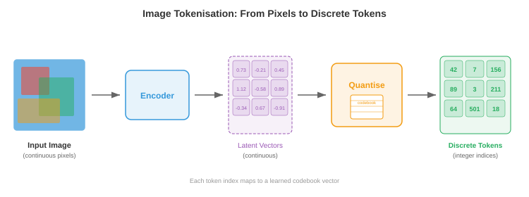
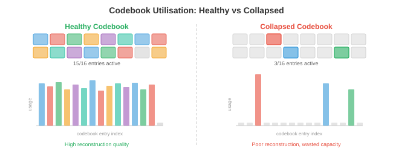
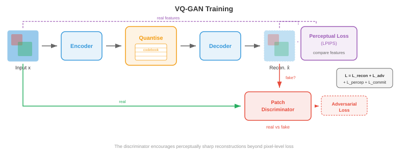
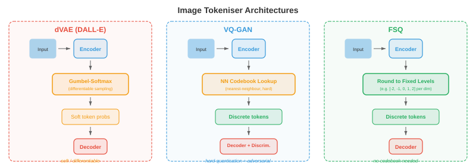
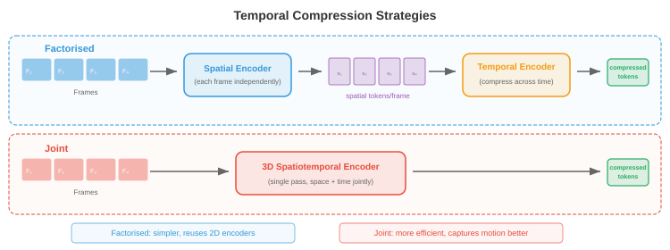

# Токенизация изображений и видео

* Токенизация изображений и видео преобразует непрерывные визуальные данные в дискретные последовательности токенов, которые преобразователи могут обрабатывать как текст. В этом файле описаны VQ-VAE, VQ-GAN, обучение кодовой книги, dVAE DALL-E, токенизация видео и квантование без поиска*.

## Зачем токенизировать изображения

- Думайте о языке как о конечном алфавите: в английском примерно 26 букв, а современные языковые модели делят текст на 30 000–100 000 токенов подслов. Каждое предложение становится последовательностью дискретных символов, которые преобразователь может предсказывать один за другим. Изображения, с другой стороны, живут в непрерывном многомерном пространстве: одно изображение RGB размером 256x256 — это точка в $\mathbb{R}^{256 \times 256 \times 3} \approx \mathbb{R}^{196{,}608}$. Если вы хотите, чтобы языковая модель «проговаривала» изображения с помощью тех же механизмов, которые она использует для разговора по-английски, вам необходимо преобразовать эти непрерывные массивы пикселей в управляемую последовательность дискретных токенов, взятых из конечного словаря. Это преобразование представляет собой **токенизацию изображения**.

- Представьте, что вы художник-мозаик. У вас нет бесконечных оттенков плитки; у вас есть фиксированная палитра, скажем, из 8192 различных цветов плитки. Чтобы воспроизвести фотографию в виде мозаики, вы должны (1) решить, какую область фотографии представляет каждая плитка, (2) выбрать ближайший цвет плитки для каждой области и (3) признать, что некоторые детали потеряны, но общая картина узнаваема. Токенизация изображения делает именно это: кодер сжимает пространственные фрагменты в скрытые векторы, кодовая книга сопоставляет каждый вектор с ближайшим к нему элементом, и в результате получается сетка целочисленных индексов, по одному на каждый фрагмент, которую может обрабатывать дискретная модель.

- Преимущества токенизации тройны. Во-первых, он резко сжимает изображение: изображение размером 256x256 может превратиться в сетку токенов 16x16, уменьшая длину последовательности с 65 536 пикселей до 256 токенов, что приемлемо для моделей, основанных на внимании, стоимость которых масштабируется квадратично с длиной последовательности. Во-вторых, он унифицирует представление: текстовые токены и токены изображений живут в одном и том же дискретном словаре, что позволяет одному авторегрессионному преобразователю генерировать чередующийся текст и изображения. В-третьих, это создает полезное узкое место, которое заставляет модель изучать семантически значимые коды, а не запоминать пиксельный шум.



- Вспомните из главы 8, как сверточные сети извлекают иерархические карты объектов из изображений, и из главы 7, как генераторы текстовых токенов преобразуют строки в целочисленные последовательности. Токенизация изображений находится на пересечении: она использует кодировщик CNN или преобразователя изображения (глава 8) для создания пространственных характеристик, а затем заимствует идею дискретного словаря (глава 7) для преобразования этих функций в индексы токенов.

## VQ-VAE: векторное квантование

- Как мы видели в главе 6, стандартный **вариационный автокодировщик** (VAE) кодирует входные данные в непрерывное скрытое распределение и декодирует выборки из этого распределения обратно в реконструкции. Скрытое пространство является непрерывным, что затрудняет его использование в моделях дискретных последовательностей. **Векторный квантованный вариационный автоэнкодер** (VQ-VAE), представленный ван ден Оордом и др. (2017) заменяет непрерывный латентный код дискретным, вводя обучаемую кодовую книгу векторов внедрения и привязывая каждый выходной сигнал кодера к ближайшей записи кодовой книги.

- Представьте себе библиотеку с полками с надписью $K$. Когда поступает новая книга (выход кодировщика), библиотекарь помещает ее на полку, на существующие книги которого (векторы кодовой книги) она больше всего похожа, и записывает номер полки. Позже, чтобы получить книгу, вам понадобится только номер полки: запись кодовой книги на этой полке вполне подойдет. Это векторное квантование.

- Формально VQ-VAE состоит из трех компонентов:

- **кодировщик** $E$, который отображает входное изображение $\mathbf{x} \in \mathbb{R}^{H \times W \times 3}$ в пространственную сетку непрерывных скрытых векторов $\mathbf{z}_e = E(\mathbf{x}) \in \mathbb{R}^{h \times w \times d}$, где $h \times w$ — пространственное разрешение с пониженной дискретизацией, а $d$ — измерение внедрения.

- **Кодовая книга** $\mathcal{C} = \{\mathbf{e}_1, \mathbf{e}_2, \ldots, \mathbf{e}_K\} \subset \mathbb{R}^d$, содержащая обучаемые векторы встраивания $K$. Типичные размеры кодовой книги варьируются от 512 до 16 384 записей.- **декодер** $D$, который восстанавливает изображение из квантованных латентных значений.

- **Шаг квантования** заменяет каждый выходной сигнал кодера $\mathbf{z}_e(\mathbf{x})$ в пространственной позиции $(i, j)$ на ближайшую запись кодовой книги:

$$\mathbf{z}_q(i,j) = \mathbf{e}_{k^\ast} \quad \text{where} \quad k^\ast = \arg\min_k \|\mathbf{z}_e(i,j) - \mathbf{e}_k\|_2$$

- Это поиск ближайшего соседа во вложенном пространстве, точно такая же операция, как присвоение k-средних (глава 6). Индекс $k^\ast$ — это дискретный токен пространственного положения $(i,j)$, а полное изображение представлено в виде сетки целых чисел $h \times w$ из $\{1, \ldots, K\}$.


- Проблема в том, что $\arg\min$ не является дифференцируемым: вы не можете выполнить обратное распространение ошибки через дискретный выбор. VQ-VAE решает эту проблему с помощью **прямой оценки**: во время прямого прохода декодер получает $\mathbf{z}_q$ (квантованный вектор); во время обратного прохода градиент потерь восстановления относительно $\mathbf{z}_q$ копируется непосредственно в $\mathbf{z}_e$, как если бы шаг квантования был тождественной функцией. Это компактно записывается так:

$$\mathbf{z}_q = \mathbf{z}_e + \text{sg}(\mathbf{z}_q - \mathbf{z}_e)$$

- где $\text{sg}(\cdot)$ — оператор остановки градиента. При прямом проходе это значение равно $\mathbf{z}_q$; при обратном проходе градиент проходит только через член $\mathbf{z}_e$.

- Полная потеря VQ-VAE состоит из трех членов:

$$\mathcal{L} = \underbrace{\|\mathbf{x} - D(\mathbf{z}_q)\|_2^2}_{\text{reconstruction}} + \underbrace{\|\text{sg}(\mathbf{z}_e) - \mathbf{e}\|_2^2}_{\text{codebook (VQ)}} + \underbrace{\beta \|\mathbf{z}_e - \text{sg}(\mathbf{e})\|_2^2}_{\text{commitment}}$$

- **Потери при реконструкции** обучают кодер и декодер точно воспроизводить входной сигнал. **Потери кодовой книги** (также называемые потерями VQ) смещают векторы кодовой книги к выходам кодера; обратите внимание, что $\text{sg}(\mathbf{z}_e)$ означает, что кодер не получает градиенты от этого термина, поэтому он только обновляет кодовую книгу. **Потеря фиксации** действует наоборот: она побуждает выходы кодировщика оставаться близко к векторам кодовой книги, предотвращая «убегание» кодировщика из кодовой книги. Гиперпараметр $\beta$ (обычно 0,25) контролирует баланс между кодовой книгой и условиями обязательства.

- На практике кодовая книга часто обновляется с помощью **экспоненциального скользящего среднего** (EMA), а не градиентного спуска, который более стабилен. Пусть $\mathbf{n}_k$ — количество выходов кодера, назначенных записи кодовой книги $k$, а $\mathbf{s}_k$ — их сумма. Обновление EMA:

$$\mathbf{n}_k \leftarrow \gamma \mathbf{n}_k + (1 - \gamma) |\{(i,j) : k^\ast_{ij} = k\}|$$

$$\mathbf{s}_k \leftarrow \gamma \mathbf{s}_k + (1 - \gamma) \sum_{(i,j) : k^\ast_{ij} = k} \mathbf{z}_e(i,j)$$

$$\mathbf{e}_k \leftarrow \frac{\mathbf{s}_k}{\mathbf{n}_k}$$

- где $\gamma$ — скорость затухания (обычно 0,99). Это эквивалентно запуску онлайн-алгоритма k-средних на выходах кодера.

### Свернуть кодовую книгу

- Печально известный режим отказа VQ-VAE — это **коллапс кодовой книги** (также называемый коллапсом индекса): модель учится использовать только небольшую часть записей кодовой книги $K$, оставляя большинство записей «мертвыми». Представьте себе библиотеку, в которой 90% полок пусты, потому что библиотекарь всегда направляет книги на одни и те же популярные полки. Это приводит к потере репрезентативной способности.

- Коллапс кодовой книги происходит потому, что кодер, кодовая книга и декодер совместно адаптируются во время обучения. Если запись не выбрана для нескольких пакетов, она отклоняется от коллектора кодера, что делает ее выбор еще менее вероятным, создавая петлю положительной обратной связи.- Несколько методов уменьшения коллапса кодовой книги:
    - **Сброс кодовой книги**: периодическая повторная инициализация мертвых записей путем копирования случайно выбранных выходных данных кодировщика. Это дает мертвым записям новое начало вблизи активной области скрытого пространства.
    - **Обновление EMA со сглаживанием Лапласа**: добавьте небольшую константу в $\mathbf{n}_k$, чтобы предотвратить нулевой счет для любой записи и гарантировать, что все записи получают сигнал градиента.
    - **Настройка потери фиксации**: увеличение $\beta$ приводит к тому, что выходные данные кодировщика группируются более плотно вокруг записей кодовой книги, распределяя назначения более равномерно.
    - **Факторизованные коды**: разложение поиска кодовой книги на продукт более мелких поисков (например, две кодовые книги размером $\sqrt{K}$ каждая), что улучшает использование за счет уменьшения эффективного размера кодовой книги для каждого поиска.
    - **Регуляризация энтропии**: добавьте штраф, который способствует равномерному распределению при использовании кодовой книги, максимизируя энтропию $H = -\sum_k p_k \log p_k$, где $p_k$ — эмпирическая вероятность присвоения.



## VQ-GAN: состязательная тренировка для более высокой точности

- VQ-VAE создает приличные реконструкции, но потеря $\ell_2$ на уровне пикселей приводит к размытым результатам, поскольку одинаково наказывается каждое отклонение пикселя, усредняя правдоподобные детали, а не выбирая четкие. Представьте, что вы просите кого-то нарисовать лицо, которое минимизирует среднее отличие от всех возможных лиц — он нарисует размытое среднее лицо, а не четкое индивидуальное.

- **VQ-GAN** (Esser et al., 2021) решает эту проблему путем объединения структуры VQ-VAE с **дискриминатором** из генеративно-состязательных сетей (глава 6). Дискриминатор — это сверточная сеть на основе патчей, которая определяет, является ли локальный патч изображения реальным (на основе обучающих данных) или поддельным (на основе декодера). Эта состязательная потеря побуждает декодер создавать четкие и реалистичные текстуры вместо усреднений по пикселям.

- Цель VQ-GAN добавляет к потерям VQ-VAE два члена:

$$\mathcal{L}_\text{VQ-GAN} = \mathcal{L}_\text{VQ-VAE} + \lambda_\text{adv} \mathcal{L}_\text{adv} + \lambda_\text{perc} \mathcal{L}_\text{perc}$$

- **Состязательные потери** $\mathcal{L}_\text{adv}$ – это стандартная цель GAN, применяемая к выходу декодера. Дискриминатор $\mathcal{D}$ пытается отличить настоящие патчи от декодированных патчей, а декодер (генератор) пытается его обмануть. Ненасыщающая формула:

$$\mathcal{L}_\text{adv} = -\mathbb{E}[\log \mathcal{D}(D(\mathbf{z}_q))]$$

- **Потеря восприятия** $\mathcal{L}_\text{perc}$ сравнивает активации функций из предварительно обученной сети (обычно VGG или LPIPS) между исходными и реконструированными изображениями:

$$\mathcal{L}_\text{perc} = \sum_l \|\phi_l(\mathbf{x}) - \phi_l(D(\mathbf{z}_q))\|_2^2$$

- где $\phi_l$ обозначает карту объектов на слое $l$ предварительно обученной сети. Эта потеря отражает структурное сходство высокого уровня, а не точность на уровне пикселей.

- Вес $\lambda_\text{adv}$ адаптивно устанавливается таким образом, чтобы состязательный градиент и градиент реконструкции были сбалансированы, предотвращая доминирование состязательных потерь на ранних этапах обучения, когда реконструкции плохи.



- В результате получается токенизатор, который производит значительно более точные реконструкции, чем VQ-VAE, при том же размере кодовой книги. VQ-GAN является основой токенизатора многих основных систем генерации изображений, включая оригинальные DALL-E, Parti и многочисленные модели преобразования текста в изображение. Он превращает изображение 256x256 в сетку дискретных токенов 16x16 или 32x32 из кодовой книги размером 1024–16384, достигая степени сжатия от 16x до 64x в каждом пространственном измерении.

## Остаточное квантование и многомасштабные кодовые книги

- Единая кодовая книга накладывает жесткий потолок на качество реконструкции: каждая пространственная позиция представлена ровно одним вектором кодовой книги, и любая деталь, более точная, чем может выразить кодовая книга, теряется. Подумайте об описании цвета одним словом из фиксированной палитры: «бирюзовый» — близко, но не точно. Если бы вы могли добавить уточнение — «бирюзовый, но немного более синий и немного ярче» — вы бы стали намного ближе.- **Остаточное квантование** (RQ) применяет эту идею итеративно. После того как первый шаг квантования выдаст $\mathbf{z}_q^{(1)}$, вычислите остаток $\mathbf{r}^{(1)} = \mathbf{z}_e - \mathbf{z}_q^{(1)}$, затем квантовайте остаток по второй кодовой книге, чтобы получить $\mathbf{z}_q^{(2)}$, и так далее для уровней $T$:

$$\mathbf{r}^{(0)} = \mathbf{z}_e$$

$$\mathbf{z}_q^{(t)} = \text{Quantise}(\mathbf{r}^{(t-1)}, \mathcal{C}^{(t)})$$

$$\mathbf{r}^{(t)} = \mathbf{r}^{(t-1)} - \mathbf{z}_q^{(t)}$$

- Окончательное квантованное представление — $\hat{\mathbf{z}} = \sum_{t=1}^{T} \mathbf{z}_q^{(t)}$. С уровнями $T$, каждый из которых использует кодовую книгу размера $K$, эффективный размер словаря равен $K^T$, но вам нужно хранить только векторы $T \times K$, а не $K^T$. Например, 8 уровней с $K = 1024$ дают эффективные записи $1024^8 \approx 10^{24}$, сохраняя при этом только 8192 вектора.

- Каждый последующий уровень фиксирует более мелкие детали: первая кодовая книга фиксирует грубую структуру, вторая фиксирует среднечастотные поправки и так далее. Это аналогично последовательному приближению в формате JPEG или прогрессивному рендерингу в веб-изображениях, где сначала появляется черновая версия, а детали заполняются постепенно.


- **Многомасштабные кодовые книги** расширяют эту идею, работая с разными пространственными разрешениями. Вместо многократного квантования одной и той же пространственной сетки вы выполняете квантование в нескольких масштабах: грубая сетка фиксирует глобальную структуру, более мелкая сетка фиксирует локальные детали. Это связано с идеей пирамиды признаков из раздела обнаружения объектов главы 8, где объекты в разных масштабах захватывают разные уровни детализации.

- **Квантование продукта** — это родственный метод, в котором латентный вектор измерения $d$ разбивается на субвекторы $M$ измерения $d/M$, и каждый субвектор квантуется независимо с помощью своей собственной кодовой книги. Это дает эффективный словарь $K^M$ при сохранении только векторов $M \times K$. Квантование произведения широко используется при приблизительном поиске ближайших соседей (глава 13) и адаптировано для токенизации изображений.

- **Конечное скалярное квантование** (FSQ), введенное Ментцером и др. (2023) использует совершенно другой подход: вместо изучения кодовой книги он просто округляет каждое измерение скрытого вектора до одного из фиксированного набора целочисленных уровней (например, $\{-2, -1, 0, 1, 2\}$). При использовании уровней $L$ для каждого измерения и измерений $d$ неявный размер кодовой книги равен $L^d$. FSQ полностью позволяет избежать коллапса кодовой книги, поскольку нет изученных векторов кодовой книги, а есть только изученные выходные данные кодера, которые детерминированно округляются. Прямая оценка учитывает недифференцируемость округления.

## Токенизаторы изображений на практике

- Переход от VQ-VAE к VQ-GAN и остаточному квантованию породил семейство практических токенизаторов изображений, используемых в современных генеративных моделях.

### Токенизатор DALL-E (dVAE)

- В оригинальном **DALL-E** (Рамеш и др., 2021) использовался дискретный VAE (dVAE) для токенизации изображений 256x256 в сетки токенов 32x32 из кодовой книги размером 8192. dVAE заменил жесткое квантование $\arg\min$ на релаксацию Gumbel-Softmax, что сделало прямой проход дифференцируемым во время обучение. Во время вывода $\arg\max$ используется для создания назначений жестких токенов. Обучение dVAE проводилось с использованием комбинации потерь при реконструкции, отклонения KL от однородного априорного значения и изученного температурного графика для Gumbel-Softmax. Затем DALL-E обучил авторегрессионный преобразователь с 12 миллиардами параметров моделировать совместное распределение 256 текстовых токенов и 1024 токенов изображений (32x32).

### ЛамаГен- **LlamaGen** (Sun et al., 2024) показал, что вы можете переназначить стандартную архитектуру языковой модели в стиле Llama (глава 7) для авторегрессионной генерации изображений при условии, что у вас есть хороший токенизатор изображений. LlamaGen использует улучшенный токенизатор VQ-GAN с большой кодовой книгой (16 384 записи) и обучает ванильный авторегрессионный преобразователь (без каких-либо специальных модификаций, специфичных для изображения, кроме токенизатора), для прогнозирования токенов изображений слева направо в порядке растрового сканирования. Ключевой вывод заключается в том, что как только изображения разбиваются на отдельные последовательности, та же самая парадигма прогнозирования следующего токена, которая работает для языка, работает и для изображений, подтверждая идею о том, что токенизация действительно устраняет разрыв модальности.

### Токенизатор Космоса

- **Токенайзер Cosmos** (NVIDIA, 2024 г.) предназначен как для изображений, так и для видео в единой среде. Он использует причинно-следственную 3D-архитектуру, которая рассматривает изображения как однокадровые видеоролики, позволяя одному и тому же токенизатору обрабатывать обе модальности. Cosmos поддерживает как непрерывный, так и дискретный режимы токенизации: непрерывный режим выводит действительные скрытые векторы (для серверных частей модели диффузии), а дискретный режим применяет конечное скалярное квантование для создания целочисленных токенов (для серверных частей модели авторегрессии). Кодер использует причинно-следственные трехмерные свертки, так что токены каждого кадра зависят только от текущего и предыдущего кадров, что обеспечивает токенизацию потокового видео.



## Токенизация видео

- Видео добавляет третью ось — время — к пространственным измерениям изображений. Видео представляет собой последовательность кадров, обычно со скоростью 24–30 кадров в секунду, причем соседние кадры сильно избыточны, поскольку визуальный мир не меняется кардинально за 33 миллисекунды. Токенизация видео использует эту временную избыточность для достижения гораздо более высокого сжатия, чем токенизация каждого кадра независимо.

- Воспринимайте сжатие видео как флип-книгу. Если бы вы рисовали каждую страницу с нуля, вам потребовались бы тысячи подробных рисунков. Но большинство страниц почти идентичны своим соседям, поэтому вы можете рисовать полный «ключевой кадр» каждые 10 страниц и отмечать лишь небольшие изменения на страницах между ними. Видеотокенизаторы обучаются этому трюку автоматически.

### 3D ВК-ВАЭ

- Самым простым расширением VQ-VAE для видео является **3D VQ-VAE**, который заменяет 2D-свертки в кодере и декодере на 3D-свертки, которые работают одновременно в пространственном и временном измерениях. Если кодер выполняет понижающую дискретизацию с коэффициентом $f_s$ в пространственном отношении и в $f_t$ во временном, видеоклип $T \times H \times W$ становится сеткой токенов $(T/f_t) \times (H/f_s) \times (W/f_s)$.

- Например, при использовании $f_s = 16$ и $f_t = 4$ 16-кадровый видеоклип размером 256x256 становится последовательностью токенов $4 \times 16 \times 16 = 1024$. Это достаточно компактно, чтобы преобразователь мог моделировать авторегрессию, тогда как количество необработанных пикселей будет составлять $16 \times 256 \times 256 \times 3 \approx 3.1$ миллионов значений.

- 3D-свертки совместно изучают пространственные и временные характеристики. Ранние слои фиксируют локальное движение (перемещение границ между кадрами), а более глубокие слои фиксируют динамику более высокого уровня (появление, исчезновение или изменение формы объектов). Это тот же принцип иерархического извлечения признаков из сверточных сетей главы 8, расширенный по оси времени.


### Причинные видеотокенизаторы

- Стандартная 3D-свертка рассматривает прошлые, текущие и будущие кадры. Это означает, что вам понадобится весь видеоклип, прежде чем вы сможете токенизировать какой-либо из него. **Причинные токенизаторы видео** ограничивают временные свертки так, что каждый результат зависит только от текущего и предыдущего кадров, но не от будущих кадров. Это аналогично причинной маскировке в авторегрессионных преобразователях (глава 7): информация течет вперед во времени, но никогда назад.

- Причинная токенизация необходима для двух случаев использования. Во-первых, **потоковая передача**: вы можете токенизировать видео в реальном времени по мере поступления кадров, без буферизации будущих кадров. Во-вторых, **авторегрессивная генерация**: когда преобразователь генерирует видео покадрово, токены для кадра $t$ должны быть вычислены без знания кадра $t+1$, поскольку кадр $t+1$ еще не был сгенерирован.- Причинное ограничение реализуется путем асимметричного заполнения временных сверток: ядро временного размера $k$ дополняется нулями $k-1$ на прошлой стороне и нулевыми нулями на будущей стороне, гарантируя, что вывод в момент времени $t$ зависит только от входных данных время от времени. $t-k+1, \ldots, t$.

- Одним из элегантных свойств причинных токенизаторов видео является то, что они могут токенизировать одно изображение («видео» из одного кадра) без специальной обработки. Первый кадр не имеет прошлого контекста, поэтому его токены вычисляются только на основе кадра. Эта **унификация изображения и видео** означает, что один токенизатор обслуживает оба метода, упрощая архитектуру и позволяя моделям генерировать изображения и видео с помощью одного и того же декодера.

### Стратегии временного сжатия

- Разные приложения требуют разных коэффициентов временного сжатия. Для распознавания действий (когда важны тонкие движения) мягкое сжатие ($f_t = 2$) сохраняет временные детали. Для создания длинного видео (когда хранение тысяч кадров невозможно) необходимо агрессивное сжатие ($f_t = 8$ или выше).

- Некоторые токенизаторы используют **факторизованное сжатие**: пространственное и временное сжатие выполняются на отдельных этапах. Во-первых, 2D-кодер сжимает каждый кадр независимо, создавая скрытую сетку для каждого кадра. Затем одномерный временной кодер сжимает данные во временном измерении. Эта факторизация вычислительно дешевле, чем полная 3D-свертка, и допускает различные степени сжатия для пространства и времени. Компромисс заключается в том, что он не может захватывать пространственно-временные закономерности (например, мяч, движущийся по диагонали) так же эффективно, как совместное 3D-кодирование.

- **Токены временной интерполяции** — это недавнее нововведение, в котором токенизатор полностью кодирует только ключевые кадры и представляет промежуточные кадры в виде упрощенных кодов интерполяции, описывающих, как трансформироваться между ключевыми кадрами. Это отражает классическое сжатие видео (I-кадры и P-кадры в H.264/HEVC), но в изученном скрытом пространстве.



## Непрерывные и дискретные токены

— Не каждой последующей модели нужны дискретные токены. **Модели диффузии** (глава 10, файл 04) изначально работают с непрерывными значениями — они итеративно удаляют шум из гауссовой выборки, а их функции потерь (сопоставление оценок шумоподавления) определяются в непрерывных пространствах. Для диффузионных серверов кодировщик токенизатора создает непрерывные скрытые векторы, которые никогда не квантуются. **Модели со скрытой диффузией** (Stable Diffusion, DALL-E 3, Flux) используют кодер-декодер, подобный VQ-GAN, но полностью пропускают кодовую книгу, работая в непрерывном скрытом пространстве.

- **Модели авторегрессии** (в стиле GPT), с другой стороны, прогнозируют следующий токен на основе конечного словаря, используя softmax для классов $K$. По сути, им требуются дискретные токены. Каждая система генерации изображений, использующая авторегрессионный преобразователь (DALL-E, Parti, LlamaGen, Chameleon), зависит от дискретного токенизатора.

- Таким образом, выбор между непрерывными и дискретными токенами определяется серверной частью генерации:

- Используйте **дискретные токены**, когда: модель является авторегрессионной (прогнозирование следующего токена с потерей перекрестной энтропии), вы хотите использовать словарь совместно с текстовыми токенами для унифицированных мультимодальных моделей или вам нужен точный контроль на уровне токена (например, для поиска или редактирования путем замены токена).

- Используйте **непрерывные токены**, когда: модель представляет собой модель диффузии или модель согласования потоков, задача требует реконструкции с очень высокой точностью (непрерывные латентные значения полностью исключают ошибку квантования) или вы хотите использовать потери регрессии, которые работают с векторами с действительным знаком.

- Некоторые новейшие архитектуры поддерживают оба режима. Например, токенизатор Cosmos может выводить либо непрерывные латентные токены (для режима диффузии), либо токены с дискретизацией FSQ (для режима авторегрессии) из одного и того же кодера с облегченной головкой квантования, которую можно включать или выключать.- **Мягкое квантование** — это золотая середина: вместо жесткого назначения $\arg\min$ вычисляется средневзвешенное значение ближайших записей кодовой книги top-$k$ с весами, заданными softmax на отрицательных расстояниях. Это сохраняет больше информации, чем жесткое квантование, оставаясь при этом приблизительно дискретным. Некоторые системы используют мягкое квантование во время обучения и жесткое квантование при выводе.


## Приложения

### Генерация авторегрессионного изображения

- Когда изображения представляют собой дискретные последовательности токенов, вы можете обучить стандартный авторегрессионный преобразователь моделировать их. Токены изображения сглаживаются в одномерную последовательность (обычно в порядке растрового сканирования: слева направо, сверху вниз), и преобразователь изучает $p(\text{token}_i | \text{token}_1, \ldots, \text{token}_{i-1})$ со стандартной перекрестной энтропийной потерей. Во время генерации токены выбираются один за другим, и заполненная сетка передается через декодер токенизатора для создания пикселей.

- Условия для текста просты: добавьте текстовые токены к последовательности токенов изображения, чтобы модель обучила $p(\text{image tokens} | \text{text tokens})$. Именно так DALL-E, Parti и LlamaGen выполняют преобразование текста в изображение. Токены текста и изображения используют один и тот же преобразователь, один и тот же механизм внимания и часто одну и ту же таблицу внедрения (при этом токены текста и изображения занимают разные диапазоны индексов).

- Порядок растрового сканирования вводит искусственную асимметрию: сначала генерируется верхний левый угол изображения, без какого-либо контекста правого нижнего угла. Этому посвящено несколько работ. **Моделирование маскированных изображений** (MaskGIT) обучает двунаправленный преобразователь, который генерирует все токены одновременно, но с различной степенью достоверности, итеративно демаскируя наиболее достоверные токены. **Многомасштабная генерация** сначала генерирует грубые токены (фиксируя глобальный состав), а затем уточняет их с помощью остаточных токенов. Эти подходы сочетают в себе простоту генерации слева направо в пользу лучшей глобальной согласованности.

### Токены Unified Vision-Language

- Самой глубокой мотивацией для токенизации изображений является **унификация**: помещение видения и языка в один и тот же формат представления, чтобы единая архитектура модели обрабатывала и то, и другое. Как мы обсуждали в главе 7, языковые модели являются чрезвычайно способными машинами для преобразования последовательности в последовательность. Представляя изображения в виде последовательностей токенов, мы бесплатно наследуем всю инфраструктуру языкового моделирования — рецепты предварительного обучения, законы масштабирования, RLHF, расширения длины контекста.

- Ярким примером является **Chameleon** (Meta, 2024 г.): он использует токенизатор VQ-GAN с 8192 записями кодовой книги для преобразования изображений в токены, которые чередуются с текстовыми токенами в едином словаре, состоящем примерно из 65 000 записей (текст + изображение). Стандартный преобразователь обучается на смешанных последовательностях текста и изображений, что позволяет ему генерировать текст по изображениям, изображения по тексту или чередующийся контент из текста и изображений, и все это за один и тот же прямой проход.

- **Gemini** (Google, 2024) использует аналогичный подход в больших масштабах, изначально распознавая и генерируя изображения, аудио и текст в рамках одного преобразователя, при этом токенизаторы, специфичные для модальности, вносятся в общую последовательность.

- Ключевой инженерной проблемой унифицированных моделей является **баланс словаря**: если 8192 из 65 000 словарных статей являются токенами изображений, модель может недооценивать возможности зрения. Решения включают в себя отдельные уровни внедрения для каждой модальности (совместно используемые только на уровне внимания), взвешивание потерь для конкретной модальности и тщательные соотношения смешивания данных во время предварительного обучения.


## Задачи по кодированию (используйте CoLab или блокнот)

1. Реализуйте минимальный уровень VQ в JAX: учитывая пакет выходных векторов кодировщика, выполните поиск кодовой книги ближайшего соседа и вычислите потери VQ-VAE (реконструкция + кодовая книга + фиксация). Визуализируйте использование кодовой книги в виде гистограммы.
```python
import jax
import jax.numpy as jnp
import matplotlib.pyplot as plt

# --- Minimal VQ layer ---
key = jax.random.PRNGKey(42)
d = 8          # embedding dimension
K = 64         # codebook size
n_vectors = 256  # batch of encoder outputs

# Random encoder outputs and codebook
k1, k2 = jax.random.split(key)
z_e = jax.random.normal(k1, (n_vectors, d))       # encoder outputs
codebook = jax.random.normal(k2, (K, d)) * 0.1     # codebook (small init)

# Nearest-neighbour lookup: find closest codebook entry for each z_e
# distances[i, k] = ||z_e[i] - codebook[k]||^2
distances = (
    jnp.sum(z_e ** 2, axis=1, keepdims=True)
    - 2 * z_e @ codebook.T
    + jnp.sum(codebook ** 2, axis=1, keepdims=True).T
)
indices = jnp.argmin(distances, axis=1)       # token indices
z_q = codebook[indices]                        # quantised vectors

# VQ-VAE loss terms
beta = 0.25
loss_codebook = jnp.mean((jax.lax.stop_gradient(z_e) - z_q) ** 2)
loss_commit   = jnp.mean((z_e - jax.lax.stop_gradient(z_q)) ** 2)
loss_total    = loss_codebook + beta * loss_commit
print(f"Codebook loss: {loss_codebook:.4f}, Commitment loss: {loss_commit:.4f}")

# Codebook utilisation
unique, counts = jnp.unique(indices, return_counts=True, size=K, fill_value=-1)
plt.figure(figsize=(10, 4))
plt.bar(range(K), counts, color='#3498db', alpha=0.8)
plt.xlabel('Codebook Index'); plt.ylabel('Assignment Count')
plt.title(f'Codebook Utilisation ({jnp.sum(counts > 0)}/{K} entries used)')
plt.grid(True, alpha=0.3); plt.tight_layout(); plt.show()
# Try: increase K to 512 and observe collapse. Then add codebook reset logic.
```

2. Создайте игрушечный 2D-векторный квантователь, который научится мозаично формировать 2D-распределение. Создавайте случайные 2D-точки, изучайте кодовую книгу с помощью обновлений EMA и визуализируйте регионы Вороного.
```python
import jax
import jax.numpy as jnp
import matplotlib.pyplot as plt

# Generate 2D data from a mixture of Gaussians
key = jax.random.PRNGKey(0)
n_points = 2000
K = 16  # codebook entries
gamma = 0.99  # EMA decay

# Four clusters
keys = jax.random.split(key, 5)
centres = jnp.array([[2, 2], [-2, 2], [-2, -2], [2, -2]], dtype=jnp.float32)
data = jnp.concatenate([
    jax.random.normal(keys[i], (n_points // 4, 2)) * 0.5 + centres[i]
    for i in range(4)
])

# Initialise codebook from random data points
idx = jax.random.choice(keys[4], n_points, (K,), replace=False)
codebook = data[idx]
ema_count = jnp.ones(K)
ema_sum = codebook.copy()

# Run EMA-based codebook learning for several epochs
for epoch in range(30):
    # Assign each point to nearest codebook entry
    dists = jnp.sum((data[:, None, :] - codebook[None, :, :]) ** 2, axis=2)
    assignments = jnp.argmin(dists, axis=1)
    # EMA update
    for k in range(K):
        mask = (assignments == k)
        count_k = jnp.sum(mask)
        ema_count = ema_count.at[k].set(gamma * ema_count[k] + (1 - gamma) * count_k)
        if count_k > 0:
            sum_k = jnp.sum(data[mask], axis=0)
            ema_sum = ema_sum.at[k].set(gamma * ema_sum[k] + (1 - gamma) * sum_k)
    codebook = ema_sum / ema_count[:, None]

# Visualise assignments and codebook
fig, ax = plt.subplots(1, 1, figsize=(8, 8))
colors = plt.cm.tab20(jnp.linspace(0, 1, K))
for k in range(K):
    mask = assignments == k
    ax.scatter(data[mask, 0], data[mask, 1], c=[colors[k]], s=5, alpha=0.3)
ax.scatter(codebook[:, 0], codebook[:, 1], c='black', s=120, marker='X',
           edgecolors='white', linewidths=1.5, zorder=10, label='Codebook')
ax.set_title(f'Learned VQ Codebook ({K} entries) on 2D Data')
ax.legend(); ax.set_aspect('equal'); ax.grid(True, alpha=0.3)
plt.tight_layout(); plt.show()
# Try: increase K to 64 and observe finer tiling. Reduce gamma and see instability.
```3. Продемонстрируйте остаточное квантование: закодируйте пакет векторов с помощью $T$ последовательных этапов квантования и измерьте, как ошибка восстановления уменьшается с каждым уровнем.
```python
import jax
import jax.numpy as jnp
import matplotlib.pyplot as plt

key = jax.random.PRNGKey(7)
d = 16         # embedding dimension
K = 32         # codebook size per level
T = 8          # number of residual levels
n_vectors = 512

# Random data to quantise
k1, *cb_keys = jax.random.split(key, T + 1)
z = jax.random.normal(k1, (n_vectors, d))

# Independent random codebooks for each level
codebooks = [jax.random.normal(cb_keys[t], (K, d)) * (0.5 ** t)
             for t in range(T)]

# Residual quantisation loop
residual = z.copy()
z_hat = jnp.zeros_like(z)
errors = []

for t in range(T):
    cb = codebooks[t]
    dists = (jnp.sum(residual ** 2, axis=1, keepdims=True)
             - 2 * residual @ cb.T
             + jnp.sum(cb ** 2, axis=1, keepdims=True).T)
    indices = jnp.argmin(dists, axis=1)
    z_q_t = cb[indices]
    z_hat = z_hat + z_q_t
    residual = residual - z_q_t
    mse = jnp.mean(jnp.sum((z - z_hat) ** 2, axis=1))
    errors.append(float(mse))
    print(f"Level {t+1}: MSE = {mse:.4f}")

plt.figure(figsize=(8, 5))
plt.plot(range(1, T + 1), errors, 'o-', color='#e74c3c', linewidth=2, markersize=8)
plt.xlabel('Residual Quantisation Level')
plt.ylabel('Reconstruction MSE')
plt.title('Error Reduction with Residual Quantisation')
plt.xticks(range(1, T + 1)); plt.grid(True, alpha=0.3)
plt.tight_layout(); plt.show()
# Try: use a single codebook of size K*T and compare with RQ. Which wins?
```

4. Смоделируйте простой одномерный «видеотокенизатор»: сгенерируйте последовательность одномерных сигналов (имитирующих видеокадры), примените причинное временное сжатие и сравните с непричинным сжатием с точки зрения качества реконструкции.
```python
import jax
import jax.numpy as jnp
import matplotlib.pyplot as plt

key = jax.random.PRNGKey(99)
n_frames = 16
frame_len = 64

# Generate a "video": a slowly moving Gaussian bump across frames
x_axis = jnp.linspace(-3, 3, frame_len)
frames = jnp.stack([
    jnp.exp(-0.5 * (x_axis - (-2 + 4 * t / n_frames)) ** 2)
    for t in range(n_frames)
])  # shape: (n_frames, frame_len)

# Causal temporal compression: each frame's code depends only on past frames
# Simple approach: average current frame with exponential decay of past
alpha_causal = 0.6
causal_codes = jnp.zeros_like(frames)
causal_codes = causal_codes.at[0].set(frames[0])
for t in range(1, n_frames):
    causal_codes = causal_codes.at[t].set(
        alpha_causal * frames[t] + (1 - alpha_causal) * causal_codes[t - 1]
    )

# Non-causal: average with both past and future (bilateral smoothing)
kernel = jnp.array([0.2, 0.6, 0.2])  # past, current, future
padded = jnp.concatenate([frames[:1], frames, frames[-1:]], axis=0)
noncausal_codes = jnp.stack([
    kernel[0] * padded[t] + kernel[1] * padded[t+1] + kernel[2] * padded[t+2]
    for t in range(n_frames)
])

# Reconstruction error
mse_causal = jnp.mean((frames - causal_codes) ** 2)
mse_noncausal = jnp.mean((frames - noncausal_codes) ** 2)
print(f"Causal MSE: {mse_causal:.6f}, Non-causal MSE: {mse_noncausal:.6f}")

fig, axes = plt.subplots(1, 3, figsize=(15, 5))
for ax, data, title in zip(axes,
    [frames, causal_codes, noncausal_codes],
    ['Original Frames', f'Causal (MSE={mse_causal:.5f})',
     f'Non-causal (MSE={mse_noncausal:.5f})']):
    ax.imshow(data, aspect='auto', cmap='viridis', origin='lower')
    ax.set_xlabel('Spatial Position'); ax.set_ylabel('Frame Index')
    ax.set_title(title)
plt.tight_layout(); plt.show()
# Try: vary alpha_causal and the kernel weights. What happens with alpha=1.0?
```