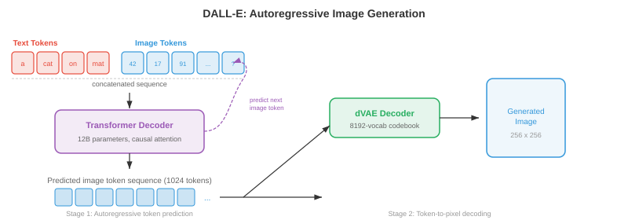
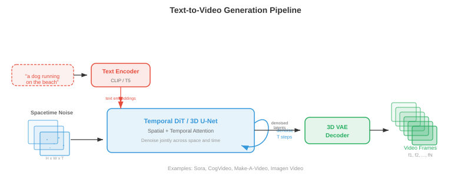
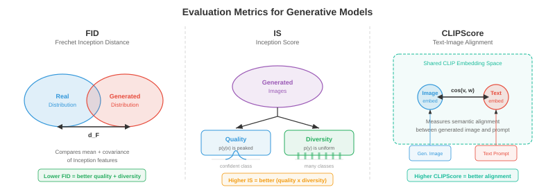

# Кросс-модальная генерация

*Кросс-модальная генерация производит результат в одной модальности, обусловленный входом из другой; текст в изображение, изображение в текст, текст в аудио и многое другое. В этом файле описаны DALL-E, Stable Diffusion, руководство без классификаторов, ControlNet, субтитры к изображениям, преобразование текста в видео (Sora) и преобразование текста в аудио.*

- Из файлов 01–03 этой главы вы узнали, как представлять, выравнивать и маркировать различные модальности. Теперь наступает творческий акт: создание одной модальности из другой. Кросс-модальная генерация является основой инструментов преобразования текста в изображение, систем синтеза видео, моделей музыкальных композиций и субтитров к изображениям. Думайте об этом как об обучении машины мультимедийному художнику: вы описываете словами то, что хотите, и она рисует, анимирует или сочиняет.

- Основная идея — **условная генерация**: учитывая входные данные из модальности $A$ (например, текст), создайте выходные данные в модальности $B$ (например, изображение). Формально вы изучаете модель $p_\theta(y \mid x)$, где $x$ — это кондиционирующий сигнал, а $y$ — сгенерированный выходной сигнал. Проблема в том, что это условное распределение чрезвычайно сложное и многомерное — изображение размером 512x512 находится в $\mathbb{R}^{786432}$, и для одной текстовой подсказки существует множество допустимых изображений.


## Генерация текста в изображение

- Представьте, что вы описываете сцену художнику-зарисовщику зала суда. Художник должен интерпретировать ваши слова, вспомнить, как выглядят предметы, скомпоновать их пространственно и передать окончательную картину. Модели преобразования текста в изображение делают именно это, но всем этим навыкам они должны научиться на основе данных, а не за годы обучения в художественной школе.

### DALL-E: авторегрессионное создание изображений

- **DALL-E** (Рамеш и др., 2021) рассматривает генерацию изображений как задачу прогнозирования последовательности — ту же парадигму, которая лежит в основе языковых моделей (глава 07). Ключевой вывод заключается в том, что если вы можете представлять изображения в виде дискретных токенов (вспомним VQ-VAE из файла 03), то генерация изображения — это просто создание последовательности токенов, одного за другим.

- Трубопровод состоит из двух этапов. Во-первых, **дискретный VAE (dVAE)** сжимает изображение размером 256x256 в сетку дискретных токенов 32x32 из кодовой книги из 8192 записей, сокращая изображение до последовательности из 1024 токенов. Во-вторых, **декодер-трансформер** обучается моделировать совместное распределение 256 текстовых токенов (закодированных в BPE), объединенных с 1024 токенами изображений, всего 1280 токенов:

$$p(x_{\text{text}}, x_{\text{img}}) = \prod_{i=1}^{1280} p(x_i \mid x_1, \ldots, x_{i-1})$$

- Во время генерации вы вводите текстовые токены, и модель авторегрессионно выбирает токены изображений один за другим. Это элегантно, поскольку повторно использует тот же механизм языкового моделирования — внимание, причинную маскировку, выборку top-k — для синтеза изображений.

- Обратной стороной является то, что авторегрессионная генерация по своей сути является последовательной: генерация 1024 токенов по одному происходит медленно, и любая ошибка на ранних этапах последовательности усугубляется. DALL-E смягчил эту проблему, создав множество изображений-кандидатов и повторно ранжировав их с помощью CLIP (из файла 01), чтобы найти наилучшее соответствие текстовому приглашению.



### Stable Diffusion: скрытое распространение с кондиционированием текста

- **Стабильная диффузия** (Ромбах и др., 2022) использует принципиально иной подход. Вместо того, чтобы предсказывать токены один за другим, он начинает с чистого шума и постепенно преобразует его в изображение, руководствуясь текстовой подсказкой. Вспомните модели диффузии из главы 8 «Стабильная диффузия», которая работает в сжатом скрытом пространстве, а не в пространстве пикселей, что делает ее значительно более эффективной.

- Архитектура состоит из трех компонентов, работающих согласованно. **Кодер VAE** сжимает изображение из пространства пикселей ($512 \times 512 \times 3$) в скрытое представление ($64 \times 64 \times 4$), уменьшая размерность в 48 раз. **Кодер текста** (обычно CLIP или OpenCLIP) преобразует текстовую подсказку в последовательность векторов внедрения. **Подавитель шума U-Net** учитывает скрытый шум, временной шаг и встраивание текста и прогнозирует, какой шум будет вычитаться на каждом этапе. Кондиционирование текста попадает в U-Net через уровни **перекрестного внимания**:

$$\text{Attention}(Q, K, V) = \text{softmax}\left(\frac{QK^T}{\sqrt{d}}\right)V$$- где $Q$ — из зашумленных функций изображения, а $K, V$ — из вложений текста. Это позволяет модели обращать внимание на соответствующие слова в каждом пространственном положении — при шумоподавлении области, где должен появиться «красный шар», модель обращает внимание на токены «красный» и «шар».

- При выводе вы выбираете $z_T \sim \mathcal{N}(0, I)$ в скрытом пространстве, итеративно удаляете шум с помощью U-Net для шагов $T$ (обычно 20-50 с планированием DDIM) и декодируете чистый скрытый $z_0$ обратно в пространство пикселей с помощью декодера VAE. Весь прямой проход генерирует изображение размером 512x512 за секунды на потребительском графическом процессоре.


### Практические рекомендации без классификаторов

- **Руководство без классификаторов (CFG)** — это секретный ингредиент, который позволяет моделям преобразования текста в изображение создавать изображения, которые действительно соответствуют их подсказкам. Вспомним главу 8, что CFG обучает модель как условно, так и безусловно, а затем усиливает условный сигнал во время выборки:

$$\hat{\epsilon} = \epsilon_\theta(x_t, \varnothing) + s \cdot (\epsilon_\theta(x_t, c) - \epsilon_\theta(x_t, \varnothing))$$

- где $s$ – шкала наведения. Подумайте о термине $(\epsilon_\theta(x_t, c) - \epsilon_\theta(x_t, \varnothing))$ как о «направлении к подсказке» — он отражает то, что отличает условное предсказание от безусловного. Умножение на $s > 1$ преувеличивает это направление, приближая изображение к текстовому описанию за счет разнообразия.

- На практике $s = 7.5$ является обычным значением по умолчанию для стабильной диффузии. По адресу $s = 1.0$ вы получаете необработанные выходные данные модели (разные, но примерно соответствующие подсказке). На $s = 20+$ изображения становятся перенасыщенными и повторяющимися, но очень тесно связаны с текстом. Оптимальное значение $s$ зависит от применения: творческое исследование предпочитает более низкое руководство, тогда как точное быстрое соблюдение требует более высокого руководства.

### Imagen: каскадное распространение с пониманием языка

- **Imagen** (Saharia et al., 2022) продемонстрировал, что мощный текстовый кодировщик имеет большее значение, чем более крупная модель изображения. Вместо CLIP Imagen использует замороженную языковую модель **T5-XXL** (из главы 07) в качестве кодировщика текста, которая имеет гораздо более глубокое понимание семантики языка, композиционности и пространственных отношений («синий куб на вершине красной сферы»).

- Imagen использует подход **каскадного распространения**: базовая модель диффузии генерирует изображение размером 64x64, первая модель со сверхвысоким разрешением масштабируется до 256x256, а вторая модель со сверхвысоким разрешением достигает 1024x1024. Каждый этап представляет собой отдельную модель диффузии, основанную на тексте и (для апскейлеров) изображении с более низким разрешением. Этот каскад позволяет избежать моделирования мелких деталей при базовом разрешении, позволяя базовой модели сосредоточиться на композиции и семантике, в то время как средства повышения разрешения обрабатывают текстуру и резкость.

- В Imagen также реализована **динамическая пороговая обработка**: на каждом этапе шумоподавления прогнозируемые значения пикселей обрезаются до процентильного диапазона, а не до фиксированного диапазона $[-1, 1]$. Это предотвращает появление артефактов насыщения при высоких масштабах наведения, что является распространенной проблемой в диффузионных моделях.

### Партии: авторегрессия в масштабе

- **Parti** (Pathways Autoregressive Text-to-Image, Yu et al., 2022) возродила авторегрессионный подход в огромных масштабах. Как и DALL-E, он преобразует изображения в дискретные токены (с помощью ViT-VQGAN) и последовательно генерирует их с помощью преобразователя. Но Парти использовал преобразователь кодер-декодер с 20 миллиардами параметров (на основе архитектуры Pathways) и показал, что авторегрессионные модели могут соответствовать качеству диффузии при достаточном масштабировании.

- Архитектура кодера-декодера Parti является ключевым отличием от конструкции DALL-E, состоящей только из декодера. Текст проходит через кодировщик; декодер перекрестно обрабатывает закодированный текст при создании токенов изображения. Это отражает машинный перевод (глава 07) — вы переводите с «языка текста» на «язык изображений».

### DiT и генерация на основе потоков- **Диффузионные трансформаторы (DiT)** (Peebles and Xie, 2023) заменяют магистраль U-Net в диффузионных моделях простым трансформатором. Каждый зашумленный скрытый патч рассматривается как токен (аналог ViT из главы 8), и преобразователь обрабатывает эти токены с само-вниманием и перекрестным вниманием к текстовому условию. DiT показал, что трансформаторы масштабируются более предсказуемо, чем U-Nets, для распространения — удвоение вычислительных ресурсов надежно снижает оценку FID вдвое.

- **Согласование потоков** (см. главу 8) появилось как альтернатива парадигме прогнозирования диффузионного шума. Вместо того, чтобы прогнозировать вычитание шума $\epsilon$, модель прогнозирует скорость $v_\theta(x_t, t)$, которая переносит образцы по прямым путям от шума к данным. **Stable Diffusion 3** и **Flux** используют согласование потоков с **мультимодальной архитектурой DiT (MM-DiT)**, в которой токены текста и изображения обрабатываются совместно блоками преобразователей с двунаправленным вниманием — обе модальности взаимодействуют друг с другом, а не только текст, обуславливающий особенности изображения посредством перекрестного внимания.


## Генерация текста в видео

- Преобразование текста в видео представляет собой преобразование текста в изображение с безжалостным дополнительным ограничением: **временная согласованность**. Каждый кадр должен быть внутренне непротиворечивым (действительным изображением), но последовательные кадры также должны быть плавно связаны — объекты должны двигаться естественно, освещение должно постоянно меняться, а «камера» должна следовать физически правдоподобным траекториям. Подумайте о разнице между рисованием одного пейзажа и съемкой фильма.

### Временные проблемы

- Видео ставит перед созданием изображений три проблемы. **Временная согласованность** требует, чтобы объекты сохраняли свою идентичность в разных кадрах — собака в кадре 1 должна оставаться той же собакой в ​​кадре 100. **Моделирование движения** требует изучения физической динамики: как движутся объекты, как работает гравитация, как текут жидкости. **Затраты вычислений** очень высоки: 10-секундное видео с частотой 24 кадра в секунду и разрешением 512x512 содержит $10 \times 24 \times 512 \times 512 \times 3 \approx 188$ миллионов значений, что примерно в 240 раз больше данных, чем одно изображение.

### Подходы создания видео и расширения до видео

- **Make-A-Video** (Singer et al., 2022) применил прагматичный подход: начните с предварительно обученной модели преобразования текста в изображение и добавьте временные слои. Ключевой вывод заключается в том, что у вас уже есть надежные модели «текст-изображение», обученные на миллиардах пар «изображение-текст», и вам нужно изучать движение только на основе (немаркированных) видеоданных.

- Make-A-Video вставляет слои **временного внимания** и **временной свертки** в предварительно обученную пространственную U-сеть. Пространственные слои (предварительно обученные на изображениях) обрабатывают внешний вид, а новые временные слои (обученные на видео) обрабатывают движение. Пространственное внимание действует внутри каждого кадра; временное внимание действует во всех кадрах в каждом пространственном положении. Эта факторизация эффективна, поскольку временные и пространственные закономерности в значительной степени разделимы.

- Конвейер генерации отражает каскад Imagen: базовая модель генерирует 16 кадров размером 64x64, затем пространственные и временные модели сверхвысокого разрешения масштабируются до окончательного разрешения и частоты кадров. Сеть интерполяции кадров увеличивает временную плавность.

### VideoPoet и модели видео на основе токенов

- **VideoPoet** (Кондратюк и др., 2024) объединяет генерацию видео в рамках парадигмы языкового моделирования. Все модальности — текст, изображение, видео, аудио — токенизированы в дискретные последовательности, а единая модель большого языка (LLM) обучена авторегрессионному прогнозированию токенов во всех модальностях. Это обеспечивает возможности нулевого кадра: преобразование текста в видео, изображение в видео, видео в аудио, редактирование видео и зарисовка — все они возникают из одной и той же модели.

- VideoPoet маркирует видео с помощью кодера MAGVIT-v2 (3D VQ-VAE, из файла 03), который совместно сжимает пространственные и временные измерения. Аудио токенизируется с помощью SoundStream. Основа LLM предварительно обучена на тексте и точно настроена на мультимодальных последовательностях токенов, изучая совместное распределение по модальностям.

### Временная диффузия в стиле Сора- **Sora** (OpenAI, 2024) привлек внимание общественности к временной диффузии благодаря своей способности генерировать длинные, связные и физически правдоподобные видеоролики. Хотя полные детали архитектуры не публикуются, ключевые идеи включают масштабирование DiT в пространстве-времени: видеокадры разлагаются на **пространственно-временные фрагменты** (3D-фрагменты по высоте, ширине и времени), которые рассматриваются как токены для большого преобразователя.

- Подход «пространственно-временной патч» означает, что модель обрабатывает видео как собственный 3D-сигнал, а не как последовательность 2D-кадров. Это позволяет улавливать долгосрочные временные зависимости — модель может «планировать заранее» на всю продолжительность видео, а не генерировать кадр за кадром.

- Сора может обрабатывать переменную продолжительность, разрешение и соотношение сторон, регулируя количество пространственно-временных патчей. Обучение данным с исходным разрешением (вместо обрезки всего в квадраты) улучшает композицию и качество кадрирования.

### Wan: создание видео с открытым исходным кодом

- **Wan** (Wan et al., 2025) — это семейство моделей генерации видео с открытым исходным кодом (параметры 1.3B и 14B), построенных на основе DiT с временным сжатием 3D VAE. Ван использует **сопоставление потоков** вместо традиционной диффузии в стиле DDPM, изучая прямые пути передачи от шума к скрытому видео. 3D VAE сжимает видео пространственно и временно (4-кратное временное сжатие), а DiT обрабатывает полученные скрытые пространственно-временные токены с полным трехмерным вниманием.

- Wan поддерживает преобразование текста в видео, изображение в видео (анимацию неподвижного изображения) и редактирование видео. Модель 14B генерирует связные видеоролики продолжительностью до 5 секунд с разрешением 720p, демонстрируя, что модели с открытым исходным кодом могут приблизиться к качеству проприетарных систем при тщательном выборе архитектуры и методов обучения.



## Генерация текста в аудио

- Представьте себе композитора, читающего сценарий и записывающего саундтрек. Модели преобразования текста в аудио делают нечто аналогичное: учитывая текстовое описание («гроза с сильным дождем и далеким громом»), они генерируют соответствующий звуковой сигнал. Задача состоит в том, чтобы преодолеть разрыв между дискретной, символической природой текста и непрерывной, временной природой звука.

### AudioLM: языковое моделирование для аудио

- **AudioLM** (Борсос и др., 2023) генерирует звук путем авторегрессионного прогнозирования дискретных аудиотокенов, опираясь на ту же парадигму языкового моделирования, которую использует DALL-E для изображений. Он использует иерархическую структуру токенов: **семантические токены** (из самоконтролируемой модели, такой как w2v-BERT, вспомните главу 9) фиксируют контент высокого уровня (то, что говорится или воспроизводится), тогда как **акустические токены** (из SoundStream, нейронного аудиокодека) фиксируют мелкие акустические детали (как это звучит — тембр, качество записи).

- Генерация происходит в два этапа. Во-первых, преобразователь прогнозирует семантические токены с учетом дополнительной звуковой подсказки, устанавливая план контента высокого уровня. Во-вторых, другой преобразователь прогнозирует акустические токены, обусловленные семантическими токенами, заполняя акустические детали. Эта иерархия отражает конвейер преобразования текста в речь (глава 9) — семантические токены играют роль фонем, а акустические токены играют роль кадров мел-спектрограммы.

- AudioLM может генерировать продолжение речи (при наличии 3 секунд речи генерировать следующие 10), продолжение музыки и звуковые эффекты — все на основе одной модели, обученной на аудиоданных (для предварительного обучения не требуются текстовые метки).

### MusicLM: музыка с текстовым сопровождением

- **MusicLM** (Agostinelli et al., 2023) расширяет возможности AudioLM для создания музыки с учетом текста. Он добавляет совместное встраивание текста и аудио (из **MuLan**, модели, похожей на CLIP, обученной на парах музыка-текст), чтобы обусловить генерацию. Встраивание MuLan отражает семантическое значение текстового описания («оптимистичный джаз с соло на саксофоне») и направляет генерацию иерархических токенов.

- MusicLM генерирует музыку с частотой 24 кГц произвольной длительности, сохраняя мелодическую и ритмическую последовательность в течение минутных произведений. Он также может зависеть от напеваемой мелодии (с использованием жетонов мелодии, извлеченных с помощью трекера высоты тона) и текстового описания, создавая полную аранжировку, которая следует напеваемой мелодии в стиле, описанном текстом.### MusicGen: эффективная одноэтапная генерация

- **MusicGen** (Copet et al., 2023) упрощает многоэтапный подход. Вместо отдельных семантических и акустических моделей MusicGen использует один авторегрессионный преобразователь, который напрямую генерирует несколько уровней кодовой книги из аудиокодека. Ключевым нововведением является **шаблон чередующейся кодовой книги**: вместо того, чтобы генерировать все уровни кодовой книги для одного временного шага перед переходом к следующему, MusicGen чередует токены по кодовым книгам и временным шагам в шаблоне, который позволяет параллельно декодировать некоторые уровни кодовой книги.

- Кондиционирование является простым: текст кодируется кодировщиком T5, а встраивание текста добавляется к последовательности аудиотокенов (например, префиксная подсказка в языковой модели) или вводится посредством перекрестного внимания. MusicGen также поддерживает настройку мелодии: хромаграмма (из функций спектрограммы, обсуждаемых в главе 9) эталонной мелодии кодируется и используется вместе с текстовым условием.

$$p(a_1, \ldots, a_T) = \prod_{t=1}^{T} \prod_{k=1}^{K} p(a_{t,k} \mid a_{<t}, c_{\text{text}})$$

- где $a_{t,k}$ — это аудиотокен на временном шаге $t$ и уровне кодовой книги $k$, а $c_{\text{text}}$ — это условие текста. Произведение над $k$ факторизуется в зависимости от шаблона кодовой книги — некоторые уровни прогнозируются параллельно.


## Генерация изображения в текст

- Теперь поменяйте направление: по заданному изображению сгенерируйте описание на естественном языке. Это **подпись к изображению**, форма условного создания текста, где изображение является условием. Представьте себе музейного гида, описывающего картину: он должен воспринимать визуальное содержание, понимать взаимосвязи между объектами и свободно формулировать свои наблюдения.

### Субтитры как условное создание

- Классический подход использует архитектуру **кодер-декодер** (глава 07). Предварительно обученная CNN или ViT (глава 8) кодирует изображение в набор векторов признаков. Декодер языковой модели генерирует подпись слово за словом, учитывая особенности изображения на каждом этапе:

$$p(w_1, \ldots, w_L \mid I) = \prod_{l=1}^{L} p(w_l \mid w_1, \ldots, w_{l-1}, I)$$

- где $w_l$ — слова подписи, а $I$ — представление изображения. Перекрестное внимание соединяет декодер текста с особенностями изображения, позволяя модели «смотреть» на разные области изображения по мере того, как она генерирует разные слова — обращая внимание на область собаки при создании слова «собака» и область парка при создании слова «парк».

- **CoCa** (Contrastive Captioners, Yu et al., 2022) объединил контрастивное обучение (цель в стиле CLIP файла 01) с субтитрами в одной модели. Кодировщик изображений создает функции, используемые как для контрастного выравнивания с текстом, так и для перекрестного внимания в декодере субтитров. Это многозадачное обучение дает CoCa четкое распознавание с нуля (благодаря контрастному обучению) и сильную генерацию (на основе субтитров).

### Субтитры на языке современного видения

- Современные подходы часто используют для субтитров **большие мультимодальные модели** (файл 02). Такие модели, как LLaVA, Qwen-VL и GPT-4V, рассматривают субтитры как особый случай визуального ответа на вопрос — «вопрос» неявно «описывает это изображение». Визуальный кодер (CLIP ViT или SigLIP) создает токены исправлений, которые проецируются в пространство внедрения LLM, а LLM генерирует описание в свободной форме.

– Преимущество субтитров на основе LLM перед специальными моделями кодировщика-декодера заключается в **следующих инструкциях**: вы можете запрашивать разные уровни детализации («описать в одном предложении» или «предоставить подробный абзац»), сосредоточиться на конкретных аспектах («описать цвета») или генерировать структурированный вывод («перечислить все объекты с их расположением»). Эта гибкость достигается за счет настройки инструкций LLM (глава 07).

## Совместное создание видео и аудио

- Подумайте о просмотре фильма с выключенным звуком — впечатления пустые. Визуальный контент и звук тесно связаны: прыгающий мяч издает ритмичный стук, дождь производит стук, а толпа вызывает аплодисменты. **Совместная генерация видео и аудио** направлена ​​на совместное создание обоих модальностей, поддерживая временную согласованность между тем, что вы видите и тем, что слышите.

### Совместное временное моделирование- Основная задача — **временная синхронизация**: звук удара по барабану должен точно совпадать с визуальным кадром, показывающим удар палочки по барабану. Для этого требуется общее временное представление, на которое могут ссылаться обе модальности.

— Один из подходов — генерировать видео и аудио из общей скрытой временной шкалы. Такие модели, как **CoDi** (Composable Diffusion, Tang et al., 2023), используют отдельные модели диффузии для каждой модальности, но выравнивают их через общее скрытое пространство. Во время обучения кросс-модальные уровни внимания учатся синхронизировать визуальные и звуковые функции на каждом временном шаге. Во время генерации оба процесса диффузии протекают одновременно, обуславливая друг друга посредством общего выравнивания.

- VideoPoet (обсуждаемый выше) использует более унифицированный подход: поскольку все модальности маркируются в одну последовательность, LLM естественным образом изучает временные соответствия между видео- и аудио-токенами. Видеоклип с лающей собакой, сопровождаемый соответствующими звуковыми токенами, учит модель ассоциировать визуальное движение лая со звуком лая.

- Функции **потеря временного выравнивания** явно обеспечивают синхронизацию. Одна формулировка использует контрастное обучение на уровне кадра: аудиосегмент в момент времени $t$ должен быть больше похож на видеокадр в момент времени $t$, чем на кадры в другое время:

$$\mathcal{L}_{\text{sync}} = -\mathbb{E}_t \left[\log \frac{\exp(\text{sim}(v_t, a_t) / \tau)}{\sum_{t'} \exp(\text{sim}(v_t, a_{t'}) / \tau)}\right]$$

- где $v_t$ и $a_t$ — видео- и аудиопредставления в момент времени $t$, а $\tau$ — температурный параметр. Это структурно идентично потере InfoNCE из файла 01, но применяется на уровне временного кадра, а не на уровне клипа.

## Генерация, следующая за инструкциями

- Представьте, что вы говорите художнику: «Сделай небо драматичнее» или «Замени шляпу короной». **Генерация по инструкциям** позволяет редактировать изображения с помощью команд естественного языка, а не точных пространственных масок или мазков кисти.

### InstructPix2Pix: редактирование по описанию

- **InstructPix2Pix** (Brooks et al., 2023) обучает модель условного распространения, которая принимает входное изображение и текстовую инструкцию, а затем создает отредактированное изображение. Самое интересное заключается в том, как создаются обучающие данные: GPT-3 генерирует инструкции редактирования («сделать зиму», «превратить кота в собаку») в сочетании с текстовыми подписями ввода-вывода, а модель преобразования текста в изображение (Stable Diffusion) генерирует соответствующие пары изображений.

- Модель представляет собой модифицированную U-сеть стабильной диффузии, которая получает как текстовую инструкцию (посредством перекрестного внимания), так и скрытое входное изображение (объединенное поканально с скрытым шумом). Он использует **двойное наведение без классификатора** с двумя шкалами наведения — одну для текстовой инструкции ($s_T$) и одну для входного изображения ($s_I$):

$$\hat{\epsilon} = \epsilon_\theta(x_t, \varnothing, \varnothing) + s_I \cdot (\epsilon_\theta(x_t, c_I, \varnothing) - \epsilon_\theta(x_t, \varnothing, \varnothing)) + s_T \cdot (\epsilon_\theta(x_t, c_I, c_T) - \epsilon_\theta(x_t, c_I, \varnothing))$$

- где $c_I$ — условие входного изображения, а $c_T$ — текстовая инструкция. Первый управляющий термин определяет, насколько сохранить входное изображение; второй контролирует, насколько строго следует следовать инструкциям. Это дает пользователю двумерную ручку: высокий $s_I$ позволяет максимально точно сохранить оригинал, а высокий $s_T$ позволяет вносить более существенные изменения.


### SDEdit и редактирование на основе шума

- **SDEdit** (Meng et al., 2022) предлагает более простой подход к редактированию, не требующий специального обучения. Вы берете входное изображение, добавляете к нему шум (запуская процесс прямой диффузии с промежуточным временным шагом $t_0$), затем шумопоглощаете с помощью текстовой подсказки, описывающей желаемый результат. Количество шума контролирует силу редактирования: низкий уровень шума сохраняет структуру (изменение цвета, перенос стиля), а высокий уровень шума позволяет провести серьезную реструктуризацию (замену объекта, изменение макета).

- Компромисс точен: на временном шаге $t_0$ зашумленное изображение сохраняет $\bar{\alpha}_{t_0}$ часть исходного сигнала. Процесс шумоподавления заполняет поврежденные детали в соответствии с новой текстовой подсказкой. Это математически обосновано: модель диффузии отбирает образцы из заднего $p(x_0 \mid x_{t_0}, c)$, где $x_{t_0}$ ограничивает генерацию, чтобы она была «близка» к оригиналу.### ControlNet: пространственное кондиционирование

- **ControlNet** (Чжан и др., 2023) добавляет детальный пространственный контроль к диффузии текста в изображение. Копия предварительно обученного кодировщика U-Net обучена принимать дополнительные входные условия — карты ребер (ребра Канни), карты глубины, скелеты поз, карты сегментации — в то время как исходные веса U-Net заморожены. Выходные данные кодера ControlNet добавляются к замороженным пропущенным соединениям U-Net через **нулевые свертки** (свертки 1x1 инициализируются нулем), гарантируя, что обучение начинается с поведения предварительно обученной модели и постепенно изучает новое условие.

- Эта архитектура позволяет использовать эскиз, карту глубины или человеческую позу в качестве структурного руководства, а текстовая подсказка заполняет внешний вид. Предварительно обученные веса обеспечивают фотореализм и понимание текста; уровни ControlNet обеспечивают пространственную точность условия.

## Метрики согласованности и согласованности

- Как вы оцениваете, хорошее ли созданное изображение? «Хорошо» имеет как минимум два измерения: **качество** (похоже ли оно на настоящее изображение?) и **выравнивание** (соответствует ли оно текстовой подсказке?). Для их количественной оценки было разработано несколько показателей.

### Начальное расстояние Фреше (FID)

- **Начальное расстояние Фреше (FID)** (Heusel et al., 2017) измеряет расстояние между распределением сгенерированных изображений и реальных изображений в пространстве признаков предварительно обученной начальной сети. Думайте об этом как о сравнении «отпечатков пальцев» двух коллекций изображений, а не о сравнении отдельных изображений.

— И реальный, и сгенерированный наборы изображений пропускаются через Inception-v3, и собираются активации с предпоследнего слоя. Эти активации моделируются как многомерные гауссианы $\mathcal{N}(\mu_r, \Sigma_r)$ и $\mathcal{N}(\mu_g, \Sigma_g)$. FID — это расстояние Фреше (расстояние Вассерштейна-2) между этими гауссианами:

$$\text{FID} = \|\mu_r - \mu_g\|^2 + \text{Tr}\left(\Sigma_r + \Sigma_g - 2(\Sigma_r \Sigma_g)^{1/2}\right)$$

- Чем ниже FID, тем лучше. FID = 0 означает, что распределения идентичны. FID фиксирует как качество (если сгенерированные изображения размыты, их характеристики будут отличаться от реальных изображений), так и разнообразие (если модель страдает от коллапса режима, $\Sigma_g$ будет меньше, чем $\Sigma_r$). Типичными современными значениями для ImageNet 256x256 являются FID < 2,0.

- FID имеет известные ограничения: он предполагает распределение признаков по Гауссу (что является приблизительным), требует тысяч выборок для стабильных оценок и использует начальные функции (которые могут не отражать все значимые для восприятия различия).

### Начальный балл (IS)

- **Начальный показатель (IS)** (Salimans et al., 2016) измеряет два свойства: каждое сгенерированное изображение должно быть уверенно классифицируемым (условное распределение классов $p(y \mid x)$ должно иметь максимум), а набор сгенерированных изображений должен охватывать множество классов (предельное значение $p(y) = \mathbb{E}_x[p(y \mid x)]$ должно быть однородным). IS объединяет их через KL-дивергенцию:

$$\text{IS} = \exp\left(\mathbb{E}_x \left[D_{\text{KL}}(p(y \mid x) \| p(y))\right]\right)$$

- Чем выше IS, тем лучше. Максимальный IS равен количеству классов (1000 для ImageNet). IS вознаграждает качество (четкие, узнаваемые изображения) и разнообразие (охват классов), но у него есть существенные ограничения: он полностью игнорирует реальное распределение данных, не может обнаружить падение режима внутри класса и склоняется к изображениям, подобным ImageNet, поскольку использует предсказания классов Inception.

### CLIPScore: измерение выравнивания текста и изображения

- **CLIPScore** (Hessel et al., 2021) напрямую измеряет, насколько хорошо сгенерированное изображение соответствует текстовой подсказке, с использованием предварительно обученной модели CLIP (файл 01). Оценка представляет собой просто косинусное сходство между встраиванием изображения CLIP и встраиванием текста CLIP:

$$\text{CLIPScore}(I, T) = \max(0, \cos(E_I(I), E_T(T)))$$

- где $E_I$ и $E_T$ — кодеры изображения и текста CLIP. CLIPScore не требует ссылок — для него не требуются достоверные изображения, только текстовое приглашение. Он хорошо коррелирует с человеческими суждениями о выравнивании текста и изображения и стал стандартным показателем для оценки мгновенной точности в моделях преобразования текста в изображение.

– Для сравнения с эталонной подписью **RefCLIPScore** включает эталонное изображение:

$$\text{RefCLIPScore} = \text{HarmonicMean}(\text{CLIPScore}(I, T), \max(0, \cos(E_I(I), E_I(I_{\text{ref}}))))$$

- Это позволяет сбалансировать выравнивание текста и визуальное сходство со ссылкой.



### Человеческая оценка- Автоматизированные метрики являются прокси; человеческое суждение остается золотым стандартом. Общие протоколы включают **парные сравнения** (какое из двух изображений лучше соответствует подсказке?), **шкалы Лайкерта** (оценка качества и выравнивания от 1 до 5) и **рейтинги Эло** (рейтинг моделей в турнирном стиле). Тесты DrawBench и PartiPrompts предоставляют стандартизированные наборы подсказок для систематической оценки человеком.

## Этические соображения

— Кросс-модальная генерация — одна из наиболее этически важных областей ИИ. Возможность создавать фотореалистичные изображения, видео и аудио на основе текстовых описаний вызывает глубокую обеспокоенность, к которой специалисты-практики должны отнестись серьезно.

### Дипфейки и дезинформация

- **Дипфейки** – это созданные или обработанные средства массовой информации, предназначенные для изображения событий, которые никогда не происходили. Модели преобразования текста в изображение и текста в видео могут создавать убедительные фальшивые фотографии общественных деятелей, сфабрикованные доказательства и вводящие в заблуждение новостные изображения. Опасность заключается не только в том, что фейки существуют, но и в том, что их существование подрывает доверие ко всем средствам массовой информации: если какое-либо изображение может быть фальшивым, ни одному изображению нельзя доверять полностью.

- Методы обнаружения включают обучение классификаторов на реальных и сгенерированных изображениях, анализ статистических артефактов (изображения, сгенерированные с помощью GAN, имеют тонкие спектральные характеристики) и встраивание невидимых водяных знаков (невидимый водяной знак Stable Diffusion, SynthID Google). Однако обнаружение — это гонка вооружений: по мере совершенствования генераторов детекторы необходимо постоянно обновлять.

### Предвзятость в поколении

- Модели, обученные на данных Интернет-масштаба, наследуют и усиливают социальные предубеждения. Модели преобразования текста в изображение непропорционально генерируют лица со светлой кожей, связывают определенные профессии с определенным полом и по умолчанию следуют западным культурным нормам для неопределенных подсказок. Эти предвзятости коренятся в распределении обучающих данных и текстовых кодировщиках CLIP/T5, которые кодируют предвзятости из своих собственных обучающих корпусов.

- Стратегии смягчения последствий включают в себя создание более репрезентативных обучающих данных, применение методов устранения систематических ошибок к кодировщикам текста, использование классификаторов безопасности для фильтрации проблемных выходных данных и предоставление пользователю возможности контролировать демографические атрибуты. Ни одно из этих решений не является полным решением, поэтому необходим постоянный аудит.

### Фильтрация и безопасность контента

- Ответственное развертывание требует нескольких уровней защиты. **Фильтрация ввода** блокирует вредоносные запросы перед созданием. **Фильтрация вывода** классифицирует сгенерированный контент и отклоняет вредные материалы. **Классификаторы NSFW** обнаруживают контент откровенно сексуального характера, насилие или иной вредный контент. Например, средство проверки безопасности Stable Diffusion вычисляет косинусное сходство между встраиванием CLIP сгенерированного изображения и набором заранее определенных встраиваний вредоносных концепций, помечая изображения, которые превышают пороговое значение.

- Природа многих моделей поколений с открытым исходным кодом (Stable Diffusion, Wan) создает противоречие между демократизацией доступа и предотвращением злоупотреблений. Как только веса модели будут освобождены, фильтрацию контента можно будет обойти. Это привело к дебатам о соответствующем уровне открытости и ответственности разработчиков моделей.

### Интеллектуальная собственность и согласие

– Генеративные модели, обученные на данных из Интернета, могут без согласия воспроизводить защищенные авторским правом стили, товарные знаки или изображения реальных людей. Правовые и этические рамки все еще развиваются, но ответственная практика включает уважение механизмов отказа, признание творческого вклада, заложенного в обучающие данные, и разработку технических мер защиты от запоминания и повторения обучающих примеров.

## Задачи по кодированию (используйте CoLab или блокнот)

1. Внедрить руководство без классификаторов для игрушечной 2D-диффузионной модели. Обучите модель условной диффузии на двумерном наборе данных (например, помеченных кластерах), затем выполните выборку с использованием различных руководящих шкал, чтобы наблюдать компромисс между качеством и разнообразием.
```python
import jax
import jax.numpy as jnp
import matplotlib.pyplot as plt

# Toy 2D conditional diffusion with classifier-free guidance
def noise_schedule(T):
    betas = jnp.linspace(1e-4, 0.02, T)
    alphas = 1.0 - betas
    return jnp.cumprod(alphas)

def forward_diffuse(x0, t, alpha_bars, key):
    noise = jax.random.normal(key, x0.shape)
    return jnp.sqrt(alpha_bars[t]) * x0 + jnp.sqrt(1 - alpha_bars[t]) * noise, noise

# Generate labelled 2D data: class 0 = ring, class 1 = cluster
key = jax.random.PRNGKey(42)
k1, k2, k3 = jax.random.split(key, 3)
theta = jax.random.uniform(k1, (200,)) * 2 * jnp.pi
ring = jnp.stack([jnp.cos(theta), jnp.sin(theta)], axis=1) * 2
ring += jax.random.normal(k2, ring.shape) * 0.1
cluster = jax.random.normal(k3, (200, 2)) * 0.3

data = jnp.concatenate([ring, cluster])
labels = jnp.concatenate([jnp.zeros(200), jnp.ones(200)])

# Simulate CFG: show how guidance pushes samples toward class-conditional modes
# Try varying guidance_scale from 0.0 to 5.0 and observe results
guidance_scales = [0.0, 1.0, 3.0, 7.0]
fig, axes = plt.subplots(1, 4, figsize=(16, 4))
for ax, s in zip(axes, guidance_scales):
    ax.scatter(ring[:, 0], ring[:, 1], s=8, alpha=0.4, label='Ring (c=0)')
    ax.scatter(cluster[:, 0], cluster[:, 1], s=8, alpha=0.4, label='Cluster (c=1)')
    ax.set_title(f'Guidance scale s={s}')
    ax.set_xlim(-4, 4); ax.set_ylim(-4, 4)
    ax.set_aspect('equal'); ax.legend(fontsize=7)
plt.suptitle('Experiment: vary guidance scale and observe quality vs diversity')
plt.tight_layout(); plt.show()
# Exercise: train a small MLP denoiser with class conditioning,
# then implement the CFG formula to sample with different s values.
```

2. Вычислите FID между двумя наборами 2D-выборок, используя формулу полного расстояния Фреше. Варьируйте сгенерированное распределение и наблюдайте, как меняется FID.
```python
import jax
import jax.numpy as jnp
import matplotlib.pyplot as plt

def compute_fid(real, generated):
    """Compute Frechet distance between two 2D sample sets."""
    mu_r, mu_g = jnp.mean(real, axis=0), jnp.mean(generated, axis=0)
    sigma_r = jnp.cov(real.T)
    sigma_g = jnp.cov(generated.T)
    diff = mu_r - mu_g
    # Matrix square root via eigendecomposition
    product = sigma_r @ sigma_g
    eigvals, eigvecs = jnp.linalg.eigh(product)
    sqrt_product = eigvecs @ jnp.diag(jnp.sqrt(jnp.maximum(eigvals, 0))) @ eigvecs.T
    fid = jnp.sum(diff ** 2) + jnp.trace(sigma_r + sigma_g - 2 * sqrt_product)
    return fid

key = jax.random.PRNGKey(0)
k1, k2, k3, k4 = jax.random.split(key, 4)

# Real distribution: standard 2D Gaussian
real = jax.random.normal(k1, (1000, 2))

# Generated distributions with increasing divergence
shifts = [0.0, 0.5, 1.0, 2.0, 4.0]
fig, axes = plt.subplots(1, len(shifts), figsize=(18, 3.5))
for ax, shift in zip(axes, shifts):
    gen = jax.random.normal(k2, (1000, 2)) * (1 + shift * 0.2) + shift
    fid = compute_fid(real, gen)
    ax.scatter(real[:, 0], real[:, 1], s=3, alpha=0.3, label='Real')
    ax.scatter(gen[:, 0], gen[:, 1], s=3, alpha=0.3, label='Generated')
    ax.set_title(f'Shift={shift}\nFID={fid:.2f}')
    ax.set_xlim(-5, 8); ax.set_ylim(-5, 8)
    ax.set_aspect('equal'); ax.legend(fontsize=7)
plt.suptitle('FID increases as generated distribution diverges from real')
plt.tight_layout(); plt.show()
# Try: change the variance of generated samples without shifting the mean.
# How does FID respond to a diversity mismatch vs a location mismatch?
```3. Реализуйте вычисление CLIPScore между встраиваниями текста и изображений, используя случайные проекции в качестве замены CLIP. Посмотрите, как ведет себя косинусное сходство, когда вы меняете «выравнивание» между модальностями.
```python
import jax
import jax.numpy as jnp
import matplotlib.pyplot as plt

def cosine_similarity(a, b):
    return jnp.dot(a, b) / (jnp.linalg.norm(a) * jnp.linalg.norm(b))

def clip_score(img_emb, txt_emb):
    """CLIPScore: clamped cosine similarity."""
    return jnp.maximum(0.0, cosine_similarity(img_emb, txt_emb))

key = jax.random.PRNGKey(42)
dim = 512  # CLIP embedding dimension

# Simulate aligned and misaligned pairs
# Aligned: image and text embeddings share a component
k1, k2, k3 = jax.random.split(key, 3)
shared = jax.random.normal(k1, (dim,))
shared = shared / jnp.linalg.norm(shared)

noise_levels = jnp.linspace(0, 5, 20)
scores = []
for noise in noise_levels:
    noise_vec = jax.random.normal(k2, (dim,)) * noise
    img_emb = shared + noise_vec * 0.3
    txt_emb = shared + jax.random.normal(k3, (dim,)) * noise * 0.3
    scores.append(float(clip_score(img_emb, txt_emb)))

plt.figure(figsize=(8, 4))
plt.plot(noise_levels, scores, 'o-', color='#2c3e50')
plt.xlabel('Noise level (misalignment)')
plt.ylabel('CLIPScore')
plt.title('CLIPScore decreases as text-image alignment degrades')
plt.grid(True, alpha=0.3)
plt.tight_layout(); plt.show()
# Experiment: what happens if you normalise embeddings before adding noise?
# How does dimensionality affect the score distribution?
```