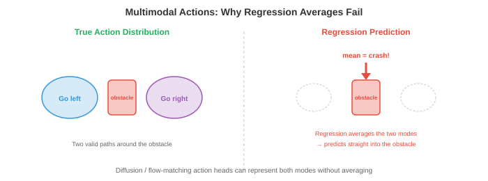

# Модели «Видение-Язык-Действие»

*Модели «Видение-Язык-Действие» (VLA) объединяют видение, понимание языка и действия в единую нейронную сеть. Этот файл описывает архитектуру VLA, токенизацию действий, RT-2, Octo, OpenVLA, стратегии предварительного обучения, обобщение, модели, не зависящие от варианта реализации, и тесты *

- В предыдущих файлах мы рассмотрели восприятие (ощущение мира) и обучение роботов (управление телом). Традиционно это были отдельные конвейеры: модуль восприятия обнаруживает объекты, языковой модуль интерпретирует команды, а модуль управления генерирует действия. Каждый модуль проектировался, обучался и отлаживался независимо.

- **Модели «Видение-Язык-Действие» (VLA)** объединяют этот конвейер в единую нейронную сеть. Модель воспринимает изображения (зрение), инструкции на естественном языке (язык) и выводит двигательные команды (действие). Одна модель, сквозная.

- Это следует той же тенденции унификации, которую мы видели в главе 10: так же, как мультимодальные модели объединили зрение и понимание языка в одну архитектуру, VLA распространяют это на физические действия. Идея заключается в том, что язык обеспечивает естественный, гибкий интерфейс для постановки задач («возьмите красную чашку и поставьте ее на полку»), а крупные предварительно обученные модели языка видения уже понимают и изображения, и инструкции.

## От языка видения к действию

- Вспомните главу 10, что **модели визуального языка (VLM)**, такие как LLaVA и Flamingo, принимают изображение и текст в качестве входных данных и создают текст в качестве выходных данных. Они понимают сцены, отвечают на вопросы и следуют инструкциям, и все это на языке.

– Представители VLA спрашивают: что, если на выходе будет не текст, а **действия робота**? Вместо сообщения «Красная чашка находится на левой стороне стола» модель генерирует последовательность двигательных команд, которые перемещают руку, чтобы схватить эту чашку.

— Ключевая идея архитектуры заключается в том, что действия могут быть представлены в виде токенов, как и слова. Если VLM генерирует токен языка за токеном, используя прогнозирование следующего токена, VLA генерирует токены действия таким же образом. Трансформатор принципиально не заботится о том, означает ли выходной токен «чашку» или «переместить захват на 2 см вперед».

- Это переосмысливает управление роботом как задачу последовательного моделирования, в которой трансформаторы преуспевают (глава 7). Модель изучает сопоставление: (наблюдение за изображением, языковая инструкция) $\to$ (последовательность жетонов действий).

## Архитектура VLA


- Типичный VLA состоит из трех компонентов:

    - **Кодер изображения**: преобразует изображения с камеры в визуальные токены. Обычно предварительно обученный кодер ViT (глава 8) или SigLIP (глава 10). Изображение разделено на фрагменты, каждый из которых встроен в виде токена, точно так же, как в стандартных преобразователях зрения.

    - **Основа языковой модели**: предварительно обученный LLM (например, LLaMA, PaLM), который обрабатывает чередующуюся последовательность визуальных и языковых токенов. Вот тут-то и происходит рассуждение: модель понимает «возьми **красную** чашку», обращая внимание как на инструкцию, так и на визуальные особенности.

    - **Действующая головка**: отображает выходные данные LLM на действия робота. Это может быть простой MLP, который отображает последнее скрытое состояние в значения непрерывного действия, или схему токенизации, которая преобразует действия в дискретные токены, предсказанные существующим словарем LLM.

- Архитектура выглядит так:

$$\text{Image} \xrightarrow{\text{ViT}} \text{visual tokens} \quad + \quad \text{Instruction} \xrightarrow{\text{tokeniser}} \text{language tokens} \quad \xrightarrow{\text{LLM}} \quad \text{action tokens}$$

- Визуальные токены и языковые токены объединяются (или чередуются) и передаются в магистраль преобразователя, которая создает токены действий авторегрессионным способом. Это та же архитектура, что и VLM (глава 10), но модальностью вывода является действие, а не текст.

## Токенизация действий

- Действия робота непрерывны: скорость суставов, положение рабочих органов, ширина захвата. Они должны быть преобразованы в дискретные токены, чтобы LLM мог их сгенерировать.


- Самый простой подход — **равномерная дискретизация**. Каждое измерение действия разделено на ячейки $N$, охватывающие диапазон допустимых значений. Например, если скорость по оси X находится в диапазоне от -0,1 до 0,1 м/с и мы используем 256 ячеек, каждая ячейка представляет $\frac{0.2}{256} \approx 0.8$ мм/с. Значение действия сопоставляется с индексом ближайшего к нему интервала, который становится токеном.- С 7 измерениями действий (6 степеней свободы + захват) и 256 ячейками каждое, словарь действий имеет токены $7 \times 256 = 1792$. Они добавляются к существующему текстовому словарю LLM. Модель генерирует один токен действия для каждого измерения авторегрессионно, точно так же, как и создание слов.

- **Разбиение действий** позволяет прогнозировать сразу несколько будущих временных шагов, а не одно действие. Если размер чанка равен $H$, модель выводит токены $H \times d$ (где $d$ — размерность действия). Это имеет решающее значение для плавных, согласованных во времени движений. Прогнозирование по одному шагу за раз может привести к прерывистому поведению, поскольку каждое предсказание независимо. Разбиение на части заставляет модель планировать короткую траекторию, фиксируя временную структуру.

- Более сложные подходы используют **обученную токенизацию** через VQ-VAE (глава 10). Кодер VQ-VAE отображает последовательность непрерывных действий в последовательность индексов дискретной кодовой книги, а декодер восстанавливает непрерывные действия на основе этих индексов. Затем LLM генерирует индексы кодовой книги, а не равномерно распределенные значения. Это аналогично тому, как токенизаторы изображений (глава 10) сжимают визуальную информацию в компактный дискретный код.

## Ключевые модели VLA

- **RT-2** (Robotic Transformer 2, Google DeepMind) был первым крупномасштабным VLA. Он берет предварительно обученный VLM (PaLM-E или PaLI-X, до 55B параметров) и настраивает его на демонстрационных данных робота. Действия представлены в виде текстовых строк: последовательность токенов «1 128 91 241 5 101 127» кодирует 7-мерное действие (каждое число представляет собой индекс ячейки).

- РТ-2 продемонстрировал замечательное свойство: **новые возможности** от перехода магистральной сети VLM к робототехнике. Модель может следовать инструкциям, включающим концепции, которые она никогда не видела в данных робота (например, «переместить банан в страну, которая начинается с буквы А» требует визуального распознавания объекта + знания о мире + действия). Понимание языка и визуальное мышление VLM «даются бесплатно».

- Ограничением RT-2 является то, что он обучался на данных одного варианта робота (определенная рука с определенным захватом). Это не распространяется на разных роботов.

- **Octo** (Калифорнийский университет в Беркли) — это **независимая от варианта исполнения** VLA с открытым исходным кодом, предназначенная для работы на различных робототехнических платформах. Ключевые нововведения:

    - **Голова диффузионного действия** вместо авторегрессионного прогнозирования токенов. Головка действия принимает выходной сигнал трансформатора и производит действия посредством процесса диффузии шумоподавления (глава 8). Это естественным образом обрабатывает мультимодальное распределение действий (см. диаграмму ниже), где существует несколько допустимых способов выполнения задачи.



    - **Гибкие пространства для наблюдения и действий**: Octo использует токенизаторы для конкретных задач для различных конфигураций роботов. Он был предварительно обучен на наборе данных Open X-Embodiment, который содержит демонстрации 22 различных вариантов робота.

    - **Эффективная точная настройка**: Octo можно настроить под нового робота всего за 100 демонстраций, что делает его практичным для лабораторий с ограниченными данными.

- **OpenVLA** (Стэнфорд, Калифорнийский университет в Беркли) использует подход тонкой настройки существующей VLM с открытым исходным кодом (на основе Llama) для робототехники. Он использует основу из 7B параметров, унифицированную токенизацию действий (256 ячеек на измерение) и обучается на данных Open X-Embodiment. Его сила в простоте: архитектура представляет собой стандартную VLM с добавленными к словарю токенами действий, что упрощает обучение и развертывание с помощью существующей инфраструктуры LLM.

- **$\pi_0$** (Физический интеллект) представляет собой современный уровень техники. Он использует предварительно обученную магистраль VLM с головкой действия **согласования потока** (глава 8). Согласование потоков генерирует действия путем изучения поля скоростей, которое переносит шум в распределения действий, создавая плавные, согласованные во времени траектории действий. $\pi_0$ продемонстрировал удивительную универсальность, выполняя задачи в различных вариантах робота, включая бимануальные манипуляции и ловкое ручное управление.

## Рецепты перед тренировкой

- VLA получают огромную выгоду от предварительно обученных магистралей VLM, которые уже понимают визуальные сцены и язык. Процесс обучения обычно состоит из этапов:1. **Предварительное обучение VLM**: обучите (или используйте готовую) модель визуального языка на миллиардах пар изображение-текст из Интернета (обучение в стиле CLIP, SigLIP, LLaVA, как описано в главе 10).

    2. **Совместное обучение на данных роботов**: точная настройка VLM на основе данных из Интернета и данных демонстрации роботов. Интернет-данные предотвращают катастрофическое забывание визуального и языкового понимания, а данные роботов учат генерировать действия. Соотношение смешивания имеет значение: слишком много данных робота ухудшает понимание языка, слишком мало данных не позволяет научиться действиям.

    3. **Точная настройка для конкретной задачи**: дополнительная точная настройка при демонстрации конкретной задачи или робота, часто с помощью LoRA (глава 10), чтобы количество обучаемых параметров было небольшим.

- Объем данных роботов на порядки меньше, чем данных из Интернета. VLM может быть предварительно обучен на миллиардах изображений, но самые большие наборы данных роботов (Open X-Embodiment) содержат только миллионы кадров во всех вариантах реализации. Из-за нехватки данных важно начинать с предварительно обученного VLM: визуальные и языковые представления передаются, и на основе ограниченных данных робота необходимо изучить только отображение действий.

## Обобщение

- Целью VLA является **обобщение**: выполнение задач, невидимых во время обучения, с объектами, которые раньше не видели, в средах, которые раньше не видели, следование инструкциям, которые раньше не видели.

- VLA обобщают по нескольким осям:

    - **Новые объекты**: магистраль VLM распознает объекты, полученные в ходе предварительного обучения через Интернет. Если модель знает, как выглядит «отвертка» по веб-изображениям, она может манипулировать ею, даже если ни одна демонстрация робота никогда не включала отвертку.

    - **Новые инструкции**: понимание композиционного языка позволяет модели следовать новым комбинациям известных концепций. «Сложите синий блок на зеленый блок» работает, даже если обучение показало наложение только красных блоков, поскольку модель понимает цветные прилагательные в результате языковой предварительной подготовки.

    - **Новые среды**: в некоторой степени VLA передаются через визуальные области (разные столы, освещение, фон), поскольку видеокодер предварительно обучен на различных веб-изображениях. Но у этого есть пределы: робот, обученный в лаборатории, может с трудом справляться на захламленной кухне.

    - **Новые варианты**: это самая сложная ось. У разных роботов разное пространство действия (углы суставов и скорости конечного рабочего органа), разные датчики (наручные камеры и камеры, расположенные сверху) и разные физические возможности. Модели, не зависящие от варианта реализации, такие как Octo и $\pi_0$, решают эту проблему с помощью гибких токенизаторов и предварительного обучения для многих типов роботов.

- Обобщение оценивается по **отложенным задачам**: роботу предлагается выполнить задачи, которым он никогда не обучался. Показатели успеха 50–80 % при выполнении новых задач считаются хорошими результатами по сравнению с >90 % при выполнении задач по распространению. Разрыв сокращается по мере масштабирования моделей и роста наборов данных о роботах.

## Модели, не зависящие от варианта осуществления

- Область движется в сторону **одна модель, много роботов**. Вместо обучения отдельной политике для каждого робота один VLA обрабатывает несколько вариантов реализации.

- Для этого необходимо решить проблему **несоответствия пространства действий**. Рука с 7 степенями свободы и захватом с параллельными губками имеет 7 измерений действия. У бимануальной установки — 14. У четвероногого — 12. У гуманоида — 30+. Токенизация действий должна быть достаточно гибкой, чтобы справиться со всем этим.

- Решения включают в себя:
    - **Дополненные векторы действий**: используйте самое большое пространство действий и дополняйте меньшие значения нулями.
    - **Головки действия для каждого варианта**: общая магистраль-трансформер с отдельными небольшими MLP для каждого типа робота.
    – **Нормализованные представления действий**: выражайте все действия в едином кадре (например, скорость конечного рабочего органа в мировой системе координат), чтобы разные роботы, производящие схожие движения конечного рабочего органа, использовали одни и те же жетоны действий.

- Общая основа изучает общее визуальное и языковое понимание, а также общие стратегии манипулирования (подход сверху, выравнивание по объекту, закрытие захвата). Компонентам, специфичным для конкретного варианта осуществления, необходимо только преобразовать эти стратегии высокого уровня в конкретные двигательные команды.

## Тесты и оценка- Оценка VLA является уникальной задачей, поскольку требует экспериментов с физическими роботами (или высокоточного моделирования).

- **SIMPLER** (Оценка политики имитации манипуляций для обучения роботов) предоставляет стандартизированные моделируемые среды для сравнения производительности VLA без физического оборудования. Он хорошо коррелирует с реальными показателями успеха и обеспечивает воспроизводимый бенчмаркинг.

- **Оценка в реальном времени** остается золотым стандартом. Типичный протокол:
    1. Определите набор задач с четкими критериями успеха (объект достигает целевой позиции, выбран правильный объект, задача выполнена в установленные сроки).
    2. Запустите пробные версии $N$ для каждой задачи (обычно 10–50).
    3. Сообщите об успешности с доверительными интервалами.
    4. Включите отложенные (никогда не тренированные) задачи для измерения обобщения.

- Набор данных **Open X-Embodiment** и эталонный анализ объединяют данные о роботах из 22 учреждений на нескольких роботизированных платформах. Он обеспечивает стандартизированный формат для обмена демонстрациями и общий пакет оценки для переноса между вариантами реализации.

## Задачи по кодированию (используйте CoLab или блокнот)

1. Внедрить токенизацию действий: разбить непрерывные действия на ячейки и реконструировать их. Наблюдайте за ошибкой квантования как функцией количества ячеек.
```python
import jax.numpy as jnp

# Continuous action: 7 dimensions (6 DoF + gripper)
action_true = jnp.array([0.023, -0.051, 0.012, 0.1, -0.03, 0.005, 0.8])
action_min = jnp.array([-0.1, -0.1, -0.1, -0.5, -0.5, -0.5, 0.0])
action_max = jnp.array([ 0.1,  0.1,  0.1,  0.5,  0.5,  0.5, 1.0])

for n_bins in [16, 64, 256, 1024]:
    # Tokenise: map continuous value to bin index
    normalised = (action_true - action_min) / (action_max - action_min)
    tokens = jnp.clip((normalised * n_bins).astype(int), 0, n_bins - 1)

    # Detokenise: map bin index back to continuous value
    reconstructed = (tokens + 0.5) / n_bins * (action_max - action_min) + action_min

    error = jnp.linalg.norm(action_true - reconstructed)
    print(f"bins={n_bins:4d}  tokens={tokens}  error={error:.6f}")
```

2. Имитация фрагментации действий и одношагового прогнозирования. Сгенерируйте плавную траекторию, добавьте шум к одношаговым прогнозам и сравните их с прогнозированием на основе фрагментов.
```python
import jax
import jax.numpy as jnp
import matplotlib.pyplot as plt

# Ground truth smooth trajectory (e.g., reaching motion)
t = jnp.linspace(0, 2 * jnp.pi, 100)
gt_x = jnp.sin(t)
gt_y = 1 - jnp.cos(t)

# Single-step: each prediction has independent noise
rng = jax.random.PRNGKey(42)
noise_ss = jax.random.normal(rng, (100, 2)) * 0.05
single_step = jnp.stack([gt_x, gt_y], axis=1) + noise_ss
# Cumulative drift from single-step errors
single_step_cumulative = jnp.cumsum(noise_ss, axis=0) * 0.3 + jnp.stack([gt_x, gt_y], axis=1)

# Chunked (chunk_size=10): noise is correlated within chunks, smoother
chunk_size = 10
rng2 = jax.random.PRNGKey(7)
chunks = []
for i in range(0, 100, chunk_size):
    chunk_noise = jax.random.normal(jax.random.fold_in(rng2, i), (2,)) * 0.05
    chunk = jnp.stack([gt_x[i:i+chunk_size], gt_y[i:i+chunk_size]], axis=1)
    chunks.append(chunk + chunk_noise)
chunked = jnp.concatenate(chunks, axis=0)

plt.figure(figsize=(8, 4))
plt.plot(gt_x, gt_y, "k-", linewidth=2, label="Ground truth")
plt.plot(single_step_cumulative[:, 0], single_step_cumulative[:, 1],
         "r-", alpha=0.7, label="Single-step (drifts)")
plt.plot(chunked[:, 0], chunked[:, 1], "b-", alpha=0.7, label="Chunked (stable)")
plt.legend(); plt.axis("equal"); plt.grid(True)
plt.title("Action Chunking vs Single-Step Prediction")
plt.show()
```

3. Визуализируйте, как распространение действий VLA может быть мультимодальным. Используйте простую двумерную смесь гауссиан, чтобы показать, почему головки действия диффузии/согласования потока предпочтительнее регрессии.
```python
import jax
import jax.numpy as jnp
import matplotlib.pyplot as plt

# Two valid ways to reach around an obstacle: left or right
rng = jax.random.PRNGKey(0)
k1, k2 = jax.random.split(rng)

mode1 = jax.random.normal(k1, (200, 2)) * 0.15 + jnp.array([-1.0, 0.5])
mode2 = jax.random.normal(k2, (200, 2)) * 0.15 + jnp.array([ 1.0, 0.5])
samples = jnp.concatenate([mode1, mode2])

# Regression predicts the mean = average of modes (invalid!)
mean_pred = samples.mean(axis=0)

plt.figure(figsize=(6, 5))
plt.scatter(samples[:, 0], samples[:, 1], s=5, alpha=0.5, label="True action distribution")
plt.plot(*mean_pred, "rx", markersize=15, markeredgewidth=3, label="Regression mean (invalid!)")
plt.plot(-1, 0.5, "g^", markersize=12, label="Mode 1 (go left)")
plt.plot(1, 0.5, "b^", markersize=12, label="Mode 2 (go right)")
plt.legend(); plt.grid(True)
plt.title("Multimodal Actions: Why Regression Fails")
plt.xlabel("Action dim 1"); plt.ylabel("Action dim 2")
plt.show()
```