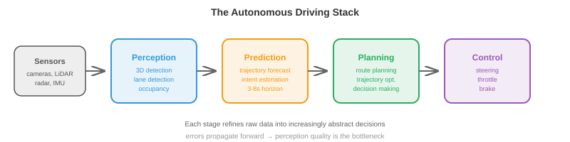
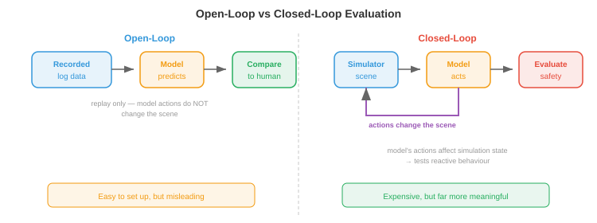

# Беспилотные автомобили

*Беспилотные автомобили — это наиболее коммерчески продвинутые автономные системы, объединяющие восприятие, прогнозирование, планирование и контроль в одном автомобиле. В этом файле описаны стек автономного вождения, карты HD, прогнозирование движения, планирование, комплексное вождение, моделирование, стандарты безопасности и уровни автономности*.

- Беспилотные автомобили, возможно, являются самой сложной проблемой робототехники, которую пытаются решить в масштабе. В отличие от заводского робота, который работает в контролируемой среде, беспилотный автомобиль должен работать в открытом мире: непредсказуемые водители-люди, пешеходы, переходящие дорогу, строительные зоны, которые появляются ночью, и погода, которая меняется каждую минуту.

- Ставки также уникально высоки. Беспилотный автомобиль работает на высоких скоростях среди уязвимых участников дорожного движения. Допуск на ошибку близок к нулю для критических с точки зрения безопасности сбоев.

## Стек автономного вождения

- Классическая архитектура беспилотного управления представляет собой **модульный конвейер** с четырьмя этапами, каждый из которых переходит в следующий:

$$\text{Perception} \to \text{Prediction} \to \text{Planning} \to \text{Control}$$



- **Восприятие** (описанное в файле 1 этой главы) обрабатывает необработанные данные датчиков в структурированное представление сцены: обнаруженные объекты с трехмерными положениями, скоростями и метками классов; дорожная разметка; светофоры; границы управляемой поверхности.

- **Прогнозирование** прогнозирует, как другие агенты (транспортные средства, пешеходы, велосипедисты) будут двигаться в будущем. Учитывая текущее состояние сцены, модуль прогнозирования выводит траектории движения каждого агента за определенный временной горизонт (обычно 3–8 секунд в будущее).

- **Планирование** решает, что должен делать автомобиль с эго: по какому пути двигаться, когда менять полосу движения, когда уступать дорогу, когда ускоряться или тормозить. Он берет прогнозируемую сцену и создает траекторию для автомобиля-эго, которая является безопасной, комфортной и движется к месту назначения.

- **Control** преобразует запланированную траекторию в команды привода: угол поворота, газ и тормоз. Это низший уровень, переводящий абстрактную траекторию в физическое движение.

- Модульная конструкция имеет явные инженерные преимущества: каждый модуль можно разрабатывать, тестировать и совершенствовать независимо. Но у него есть и недостатки: ошибки распространяются вниз по потоку (пропущенное обнаружение незаметно для планировщика), и информация теряется на каждом интерфейсе (планировщик видит ограничивающие рамки, а не богатые данные датчиков, которые их создали).

## HD-карты

- **Карты высокого разрешения (HD)** — это подробные цифровые карты с точностью до сантиметра, на которых закодирована структура дороги: границы полос, соединение полос (какая полоса соединяется с какой на перекрестке), расположение дорожных знаков, ограничения скорости, расположение пешеходных переходов и высота дорожного покрытия.

- Карты HD обеспечивают четкое представление о задаче вождения. Модулю восприятия не требуется обнаруживать границы полос с нуля в каждом кадре; ему просто нужно локализовать транспортное средство на карте и убедиться, что реальность соответствует сохраненной структуре. Это существенно упрощает планирование.

- Для создания карт HD требуются специализированные съемочные машины, оснащенные высокопроизводительными LiDAR, камерами и RTK-GPS. Карты необходимо поддерживать и обновлять по мере изменения дорог. Это дорого и нелегко масштабировать все дороги на Земле.

- **Вождение без карты** (также называемое «онлайн-картирование») направлено на устранение зависимости от предварительно созданных карт HD. Вместо этого автомобиль создает локальную карту в режиме реального времени с помощью своих датчиков. Такие модели, как **MapTR** и **MapTRv2**, используют архитектуру преобразователей для прогнозирования векторизованных элементов карты (осевые линии полос, границы дорог, пешеходные переходы) непосредственно по изображениям с камеры, выводя полилинии в виде упорядоченных последовательностей точек.

- Безкартовый подход меняет точность карты на масштабируемость: любая дорога, по которой может двигаться автомобиль, может быть нанесена на карту. Но для этого требуется, чтобы система восприятия была достаточно надежной, чтобы обнаруживать всю соответствующую дорожную структуру в режиме реального времени, в том числе на сложных перекрестках, съездах с автомагистралей и зонах строительства.

- На практике многие системы используют гибридный подход: облегченную карту с грубой топологией дороги (от существующих поставщиков карт), дополненную в реальном времени датчиками автомобиля.

## Прогнозирование движения- Предсказать, куда пойдут другие участники дорожного движения, — одна из самых сложных подзадач в области беспилотного вождения. Люди непредсказуемы, намерения скрыты, а пространство возможных вариантов будущего быстро расширяется.

- Входными данными для модели прогнозирования является **контекст сцены**: положения и скорости всех обнаруженных агентов за недавнее прошлое (обычно 1–2 секунды истории), а также статический контекст (геометрия полосы движения, сигналы светофора, границы дороги).

– Результатом является набор **прогнозируемых траекторий** для каждого агента, обычно охватывающих будущее на 3–8 секунд. Поскольку будущее неопределенно, хорошие модели прогнозирования выдают несколько возможных траекторий с соответствующими вероятностями, а не одну точечную оценку.

- **Прогнозирование траектории** как задача регрессии: прогнозирование будущих координат $(x, y)$ каждого агента на дискретных будущих временных шагах. Потери обычно представляют собой минимальную среднюю ошибку смещения (minADE) по прогнозируемым траекториям $K$:

$$\text{minADE}_K = \min_{k \in \{1, \ldots, K\}} \frac{1}{T} \sum_{t=1}^{T} \| \hat{\mathbf{p}}_t^{(k)} - \mathbf{p}_t \|_2$$

- Это показатель «лучший из $K$»: модель получает признание, если какой-либо из ее прогнозов $K$ близок к истине. Это стимулирует разнообразные, мультимодальные прогнозы.

- **Социальные силы** моделируют поведение пешеходов как динамическую систему, в которой каждый человек испытывает силы притяжения (в направлении своей цели) и силы отталкивания (вдали от других пешеходов и препятствий). Ускорение человека $i$ составляет:

$$\mathbf{a}_i = \frac{\mathbf{v}_i^{\text{desired}} - \mathbf{v}_i}{\tau} + \sum_{j \neq i} \mathbf{f}_{ij}^{\text{repulsive}} + \sum_{\text{walls}} \mathbf{f}_{\text{wall}}$$

- Это система дифференциальных уравнений, аналогичная уравнению динамики робота из файла 2 этой главы. Модель элегантна, но опирается на вручную настроенные параметры силы и не справляется со сложными межагентными взаимодействиями.

- **Графовые нейронные сети (GNN)** для прогнозирования моделируют сцену в виде графа: каждый агент является узлом, а ребра представляют пространственные отношения (близость, совместное использование полос движения). Передача сообщений между узлами фиксирует взаимодействия: «эта машина уступает этому пешеходу» или «эти два транспортных средства выезжают на одну полосу».

- Современные архитектуры прогнозирования (например, **MTR**, **QCNet**) используют модели на основе преобразователей, которые совместно анализируют историю агентов, контекст карты и взаимодействия агентов. Агенты обращают внимание на соответствующие объекты карты (текущую полосу движения, предстоящие перекрестки) и на других агентов (автомобиль впереди, пешеход на пешеходном переходе) посредством перекрестного внимания. Результатом является набор гипотез о траекториях, сгенерированных авторегрессией или с помощью смешанной модели.

- **Прогнозирование с учетом цели** сначала предсказывает, куда вероятнее всего пойдет агент (набор потенциальных целевых точек, например конечные точки полос или съезды с перекрестков), а затем прогнозирует траекторию достижения каждой цели. Это разбивает проблему на «где» (дискретно, управляемо) и «как» (непрерывный путь с учетом цели), что делает задачу мультимодального прогнозирования более разрешимой.

## Планирование

- Учитывая прогнозируемую сцену, планировщик должен определить траекторию движения автомобиля с эго. Это задача ограниченной оптимизации: найти безопасную, комфортную, эффективную и законную траекторию.

– **Планировщики, основанные на правилах**, кодируют поведение вождения как набор правил «если-то»: «если пешеход находится на пешеходном переходе, уступите дорогу», «если расстояние до впереди идущего автомобиля составляет менее 2 секунд, не меняйте полосу движения», «при приближении к красному свету снизьте скорость, чтобы остановиться у стоп-линии». Эти правила можно интерпретировать и проверять, но они становятся громоздкими в сложных сценариях (тысячи правил, множество крайних случаев, взаимодействие между правилами).

- **Планировщики, основанные на оптимизации**, формулируют вождение как оптимизацию траектории. Траектория эго параметризуется (например, как последовательность состояний $(x, y, \theta, v)$ на будущих временных шагах), а целевая функция минимизируется:

$$\min_{\boldsymbol{\xi}} \underbrace{w_1 \cdot J_{\text{progress}}(\boldsymbol{\xi})}_{\text{get to destination}} + \underbrace{w_2 \cdot J_{\text{comfort}}(\boldsymbol{\xi})}_{\text{smooth ride}} + \underbrace{w_3 \cdot J_{\text{safety}}(\boldsymbol{\xi})}_{\text{avoid collisions}}$$

$$\text{subject to: } \text{kinematic constraints, speed limits, lane boundaries}$$

- Условие прогресса наказывает за отклонения от желаемого маршрута. Термин «комфорт» наказывает за высокое боковое ускорение, рывки (производные ускорения) и резкое рулевое управление, поскольку пассажиры это чувствуют. Термин безопасности наказывает близость к другим агентам, используя прогнозируемые траектории для оценки риска столкновения.- Это оптимизация с ограничениями (глава 3): минимизация функции стоимости с учетом ограничений-неравенств. Гири $w_1, w_2, w_3$ позволяют достичь конкурирующих целей (агрессивное вождение происходит быстрее, но менее комфортно и менее безопасно).

- **Планировщики, основанные на обучении**, используют нейронные сети, обученные на данных о вождении человека, для создания траекторий. Модель наблюдает за происходящим и напрямую выводит запланированную траекторию, неявно изучая сложные компромиссы на примерах опытного вождения человека.

- Преимущество заключается в том, что поведение человека при вождении фиксируется целостно, включая тонкие, трудно формализуемые аспекты: насколько агрессивно сливаться, когда подталкивать вперед на перекрестке, сколько места оставить велосипедисту. Недостатком является та же проблема смещения распределения из-за имитационного обучения (файл 2): модель может вести себя непредсказуемо в ситуациях, плохо представленных в обучающих данных.

## Комплексное вождение

- **Сквозное вождение** полностью устраняет модульные границы. Одна нейронная сеть принимает необработанные входные данные датчиков (изображения с камеры, облака точек LiDAR) и напрямую выводит команды движения (рулевое управление, дроссель, тормоз) или запланированную траекторию. Никаких отдельных модулей восприятия, прогнозирования или планирования.

- Прелесть в том, что вся система совместно оптимизирована для конечной задачи (безопасное вождение), поэтому никакая информация не теряется на границах модулей. Модуль восприятия учится извлекать именно те функции, которые нужны планировщику, а не обнаруживать общие объекты, которые могут не улавливать важные для задачи детали.

- **UniAD** (унифицированное автономное вождение) — это выдающаяся комплексная архитектура. Он обрабатывает многокамерные изображения через кодировщик BEV, а затем применяет каскад модулей на основе трансформаторов: отслеживание, онлайн-картографирование, прогнозирование движения, прогнозирование занятости и планирование. Несмотря на наличие внутренних модулей, все они дифференцируемы и обучаются совместно, при этом потери при планировании распространяются обратно по всей сети.

- Модуль планирования в UniAD генерирует будущие путевые точки эго-транспортного средства, учитывая прогнозируемые функции BEV, прогнозируемые траектории агентов и прогнозируемую занятость. Это правило многомерной цепочки (глава 3) в действии: градиенты текут от потерь при планировании обратно к кодировщику изображения, сообщая функциям восприятия, как быть более полезными для планирования.

- В более поздних сквозных подходах используются архитектуры в стиле VLA (файл 3 этой главы). Такие модели, как **DriveVLM**, получают изображения с камеры и инструкции по навигации (или маршруту), а также выполняют действия по вождению, используя магистраль VLM. Это переносит преимущества крупномасштабной предварительной подготовки (визуальное понимание, рассуждение) непосредственно в стек вождения.

- Напряжение при движении из конца в конец связано с **интерпретируемостью**. Модульная система может сообщить: «Я обнаружил пешехода в точке (x, y) и предсказал, что он перейдет дорогу» — режим отказа можно диагностировать. Сквозная система представляет собой «черный ящик», определяющий угол поворота рулевого колеса. Когда он выходит из строя, трудно определить причину, что является серьезной проблемой для сертификации безопасности.

## Мировые модели для вождения

- **модель мира** учится прогнозировать будущее состояние сцены вождения с учетом текущего состояния и действий эго-автомобиля: $p(s_{t+1} \mid s_t, a_t)$ (как представлено в главе 10). При вождении это означает создание реалистичных будущих кадров или макетов BEV: «если я ускорюсь и поверну влево, сцена будет выглядеть вот так через 3 секунды».

- Мировые модели предлагают две мощные возможности для самостоятельного вождения:

    - **Планирование, основанное на воображении**: вместо того, чтобы предпринимать действия и смотреть, что произойдет, планировщик может «представить» несколько возможных траекторий, прокрутив их через модель мира, оценить каждую из них на предмет безопасности и комфорта и выбрать лучшую. Это основанное на модели RL (описанное в файле 2 этой главы), применяемое к вождению.- **Обученное моделирование**: модель мира, обученная на реальных данных о вождении, по сути, является симулятором, управляемым данными. Он генерирует реалистичные сценарии (включая редкие крайние случаи) без ручных усилий по созданию симулятора, созданного вручную. Что особенно важно, он фиксирует статистические закономерности реального вождения: как на самом деле ведут себя другие водители, как меняется освещение, как дождь влияет на видимость.

- **GAIA-1** (Wayve) — модель генеративного мира для вождения. Учитывая последовательность прошлых кадров камеры и действий эго-машины, он авторегрессионно генерирует будущие видеокадры. Он использует архитектуру распространения видео, зависящую от входных действий. Модель учится генерировать правдоподобное будущее: транспортные средства, которые соблюдают правила дорожного движения, пешеходы, которые ходят по тротуарам, и светофоры, которые правильно переключаются, — все это возникает на основе обучающих данных, а не запрограммированных правил.

- **DriveDreamer** и **GenAD** используют аналогичный подход, но работают в пространстве BEV, а не в пространстве пикселей. Прогнозирование будущих макетов BEV более компактно, чем создание полных видеокадров (аналогично тому, как DreamerV3 в робототехнике прогнозирует в скрытом пространстве, а не в пространстве пикселей, как описано в файле 2). Модель мира BEV предсказывает, где будут находиться все агенты, как будет выглядеть структура дороги и где существует свободное пространство, и планировщик использует это напрямую.

- **Нейронное моделирование с обратной связью** использует модели мира вместо симуляторов, созданных вручную, для тестирования. Учитывая реальный журнал вождения в качестве отправной точки, модель мира генерирует то, что произошло бы, если бы автомобиль с эго предпринял другое действие. Это позволяет провести контрфактическую оценку: «Что, если бы я затормозил на 0,5 секунды позже?» без необходимости физического воссоздания сценария.

- Связь со структурой **JEPA** (глава 10) здесь естественна. Модели движущегося мира не должны предсказывать идеальное по пикселям будущее (точные значения RGB для каждого пикселя). Им необходимо предсказать аспекты, имеющие значение для планирования: где находятся агенты, как быстро они движутся, где свободное пространство. Прогнозирование пространства внедрения (в стиле JEPA) фиксирует эти семантически значимые свойства, не тратя ресурсы на ненужные визуальные детали, такие как точные текстуры облаков.

- Основная проблема — **долгосрочная точность**. В моделях мира со временем накапливаются ошибки: небольшая ошибка во втором кадре смещает все последующие кадры. При вождении 3-секундный горизонт прогнозирования полезен для тактических решений (должен ли я объединиться сейчас?), но 30-секундный горизонт (необходимый для стратегических решений, таких как планирование маршрута) остается ненадежным. Текущая работа смягчает это за счет повторной привязки (периодического сброса модели с реальными наблюдениями) и оценки неопределенности (маркировка, когда прогнозы становятся ненадежными).

## Моделирование

- Испытание беспилотного автомобиля на реальных дорогах необходимо, но недостаточно. Опасные сценарии (возможные столкновения, крайние случаи) редки, поэтому тестирование по пройденным милям неэффективно. Автомобиль должен будет проехать сотни миллионов миль, чтобы статистически продемонстрировать безопасность, что невозможно.

- **Моделирование** обеспечивает неограниченное, контролируемое и безопасное тестирование. Сценарии, которые редко встречаются в реальном мире (ребенок, выбежавший на дорогу, лопнувшая шина, внезапное препятствие), можно протестировать миллионы раз в симуляции.

- **CARLA** — это симулятор вождения с открытым исходным кодом, созданный на Unreal Engine. Он обеспечивает реалистичную городскую среду, динамическую погоду, агентов дорожного движения и симуляцию датчиков (камеры, LiDAR, радар). Исследователи используют CARLA для обучения агентов вождения на основе RL и оценки алгоритмов восприятия.

- **nuPlan** (Motional) — это эталон планирования с обратной связью. В отличие от оценки с разомкнутым контуром (воспроизведение зарегистрированных данных и сравнение выходных данных планировщика с фактической траекторией движения водителя), оценка с обратной связью позволяет решениям планировщика влиять на симуляцию: если планировщик решает сменить полосу движения, симуляция развивается соответствующим образом. Это проверяет реактивное поведение, а не только сходство траекторий.



- Различие между **разомкнутым** и **замкнутым** оценками имеет решающее значение:- Разомкнутый цикл: воспроизведите записанный сценарий, вычислите, насколько выходные данные модели похожи на действия водителя-человека. Это легко настроить, но это вводит в заблуждение: модель, которая всегда предсказывает «идти прямо», может иметь низкую ошибку на шоссе, но потерпит крах на первом повороте.

    - Замкнутый цикл: действия модели изменяют состояние симуляции, и симуляция развивается в ответ. Это проверяет способность модели восстанавливаться после собственных ошибок и реагировать на динамические ситуации. Это намного дороже, но гораздо более значимо.

- **Генерация сценариев** создает тестовые сценарии, которые нагружают систему. Состязательные сценарии (внезапное торможение автомобиля, пешеход, спрятавшийся за припаркованным автомобилем) создаются путем оптимизации ситуаций, в которых система беспилотного вождения работает хуже всего. Это связано с состязательным обучением ОД (глава 6): поиску входных данных, которые максимизируют потери.

## Безопасность

- Безопасность беспилотного вождения регулируется инженерными стандартами, а не только показателями машинного обучения.

- **ISO 26262** (функциональная безопасность) — это автомобильный стандарт для электронных систем, критически важных для безопасности. Он определяет **Уровни полноты автомобильной безопасности (ASIL)** от A (самый низкий) до D (самый высокий) в зависимости от серьезности, воздействия и управляемости потенциальных опасностей. Компоненты восприятия и планирования беспилотной системы обычно соответствуют ASIL-D, самому высокому уровню, требующему тщательной проверки, резервирования и отказоустойчивой конструкции.

- **SOTIF** (Безопасность предполагаемой функциональности, ISO 21448) рассматривает другой класс опасностей: не отказы оборудования (которые охватывает ISO 26262), а ситуации, когда система работает так, как задумано, но все равно приводит к небезопасному результату. Модель восприятия, которая ошибочно классифицирует белый грузовик как небо (реальный инцидент), является проблемой SOTIF: аппаратное обеспечение работает нормально, но ограничения алгоритма создают опасность.

- **Область эксплуатационного проектирования (ODD)** определяет условия, при которых система беспилотного вождения предназначена для работы: конкретные географические районы, типы дорог (только шоссе, городские и обе), погодные условия (без сильного снегопада), диапазоны скоростей и время суток. Эксплуатация за пределами ODD не допускается: если система не справляется со снегом, ей нельзя ездить по снегу.

- **Отказобезопасное** и **отказоустойчивое** исполнение:
    - Отказоустойчивость: при обнаружении неисправности система переходит в безопасное состояние (например, останавливается). Это минимальное требование.
    - Работа при отказе: система продолжает безопасно работать, несмотря на неисправность, используя резервные компоненты. Беспилотный автомобиль с резервным рулевым управлением, торможением и вычислительной техникой может пережить отказ одного компонента и при этом доехать до безопасного места.

- **Избыточность** имеет фундаментальное значение. Датчики критического восприятия дублируются: несколько камер, охватывающих перекрывающиеся поля зрения, как LiDAR, так и радар, обеспечивающие независимые измерения глубины, две вычислительные платформы, на которых работает одно и то же программное обеспечение. Если какой-либо отдельный компонент выходит из строя, остальные предоставляют достаточную информацию для безопасного вождения.

## Уровни автономии


- Стандарт **SAE J3016** определяет шесть уровней автоматизации вождения: от 0 (отсутствие автоматизации) до 5 (полная автоматизация):

    - **Уровень 0 (без автоматизации)**: всё делает человек. Система может выдавать предупреждения (предупреждение о выходе из полосы движения), но не управляет автомобилем.

    - **Уровень 1 (Помощь водителю)**: система контролирует либо рулевое управление, либо скорость, но не то и другое. Адаптивный круиз-контроль (поддерживает скорость и дистанцию следования) или ассистент удержания полосы движения (удерживает автомобиль в центре полосы движения) относятся к уровню 1.

    - **Уровень 2 (Частичная автоматизация)**: система одновременно контролирует рулевое управление и скорость, но человек должен постоянно контролировать ситуацию и быть готовым взять на себя управление. Автопилот Tesla, GM Super Cruise и большинство современных функций «беспилотного вождения» относятся к уровню 2. Человек по-прежнему остается ответственным водителем.

    - **Уровень 3 (условная автоматизация)**: система управляет и контролирует окружающую среду, но только в определенных условиях (ODD). Человек может отключиться, но должен быть готов взять на себя управление, когда система запросит это (с временным буфером, обычно более 10 секунд). Mercedes Drive Pilot (на некоторых автомагистралях со скоростью ниже 60 км/ч) — первая сертифицированная система 3-го уровня.- **Уровень 4 (Высокая автоматизация)**: система управляет и обрабатывает все ситуации в пределах своего ODD без вмешательства человека. Если он сталкивается с ситуацией за пределами своего ODD, он может безопасно остановиться. Служба роботакси Waymo работает на уровне 4 в определенных географических регионах.

    - **Уровень 5 (Полная автоматизация)**: система ездит везде, где может человек, в любых условиях. Никакого руля или педалей не требуется. Этого пока не существует.

- Важнейшее различие заключается в том, **кто несет ответственность за безопасность**. На уровнях 0–2 ответственность несет человек. На уровнях 3-5 ответственность несет система (в пределах своего ODD). Это имеет глубокие юридические, страховые и этические последствия.

- Текущее состояние отрасли представляет собой сочетание уровня 2 (широко развертывание), уровня 3 (начинающееся развертывание) и уровня 4 (ограниченное географическое развертывание). Уровень 5 остается долгосрочной целью исследования.

## Задачи по кодированию (используйте CoLab или блокнот)

1. Внедрить простой планировщик оптимизации траектории. Учитывая начальную позицию, цель и препятствие, найдите самый гладкий путь без столкновений, используя градиентный спуск.
```python
import jax
import jax.numpy as jnp
import matplotlib.pyplot as plt

# Trajectory: N waypoints, each (x, y)
N = 20
start = jnp.array([0.0, 0.0])
goal = jnp.array([10.0, 0.0])
obstacle = jnp.array([5.0, 0.0])
obs_radius = 1.5

# Initialise: straight line from start to goal
waypoints_init = jnp.linspace(start, goal, N)

def cost(waypoints):
    wp = jnp.concatenate([start[None], waypoints, goal[None]], axis=0)

    # Smoothness: penalise acceleration (second differences)
    accel = wp[2:] - 2 * wp[1:-1] + wp[:-2]
    smooth_cost = jnp.sum(accel ** 2)

    # Obstacle avoidance: penalise proximity
    dists = jnp.linalg.norm(wp - obstacle, axis=1)
    collision_cost = jnp.sum(jnp.maximum(0, obs_radius + 0.5 - dists) ** 2)

    return 10 * smooth_cost + 100 * collision_cost

grad_cost = jax.grad(cost)

# Optimise the interior waypoints
waypoints = waypoints_init[1:-1]
lr = 0.01
for _ in range(500):
    g = grad_cost(waypoints)
    waypoints = waypoints - lr * g

# Plot
full_path = jnp.concatenate([start[None], waypoints, goal[None]], axis=0)
theta = jnp.linspace(0, 2 * jnp.pi, 100)

plt.figure(figsize=(10, 4))
plt.plot(full_path[:, 0], full_path[:, 1], "b.-", label="Optimised path")
plt.plot(waypoints_init[:, 0], waypoints_init[:, 1], "r--", alpha=0.5, label="Initial (straight)")
plt.fill(obstacle[0] + obs_radius * jnp.cos(theta),
         obstacle[1] + obs_radius * jnp.sin(theta), alpha=0.3, color="red", label="Obstacle")
plt.plot(*start, "go", markersize=10); plt.plot(*goal, "g*", markersize=15)
plt.legend(); plt.axis("equal"); plt.grid(True)
plt.title("Trajectory Optimisation: Smooth Collision-Free Path")
plt.show()
```

2. Смоделируйте модель прогнозирования движения с постоянной скоростью и сравните ее с фактическими данными для поворачивающегося транспортного средства.
```python
import jax.numpy as jnp
import matplotlib.pyplot as plt

# Ground truth: vehicle turning right
dt = 0.1
T = 40  # 4 seconds
v = 10.0  # m/s
omega = 0.3  # rad/s (turning rate)

# True trajectory (constant turn rate)
t = jnp.arange(T) * dt
theta = omega * t
gt_x = (v / omega) * jnp.sin(theta)
gt_y = (v / omega) * (1 - jnp.cos(theta))

# Constant velocity prediction from t=0
# Assumes the car continues straight at its current heading
obs_steps = 10  # observe first 1 second
vx0 = v * jnp.cos(theta[obs_steps - 1])
vy0 = v * jnp.sin(theta[obs_steps - 1])
pred_t = jnp.arange(T - obs_steps) * dt
pred_x = gt_x[obs_steps - 1] + vx0 * pred_t
pred_y = gt_y[obs_steps - 1] + vy0 * pred_t

plt.figure(figsize=(8, 6))
plt.plot(gt_x[:obs_steps], gt_y[:obs_steps], "ko-", label="Observed")
plt.plot(gt_x[obs_steps:], gt_y[obs_steps:], "g-", linewidth=2, label="True future")
plt.plot(pred_x, pred_y, "r--", linewidth=2, label="Constant velocity prediction")
plt.legend(); plt.axis("equal"); plt.grid(True)
plt.xlabel("x (m)"); plt.ylabel("y (m)")
plt.title("Constant Velocity Prediction vs Turning Vehicle")
plt.show()
```

3. Внедрить простой планировщик на основе правил, который принимает решение о сохранении полосы движения или остановке на основе обнаруженных препятствий.
```python
import jax.numpy as jnp

def rule_based_planner(ego_speed, obstacles, speed_limit=13.9):
    """
    Simple rule-based planner.
    ego_speed: current speed (m/s)
    obstacles: list of (distance, speed) tuples for vehicles ahead
    speed_limit: max allowed speed (m/s), default ~50 km/h

    Returns: (target_speed, action_label)
    """
    min_following_distance = 2.0 * ego_speed  # 2-second rule
    emergency_distance = 5.0  # metres

    if not obstacles:
        return speed_limit, "cruise"

    # Find closest obstacle ahead
    closest_dist, closest_speed = min(obstacles, key=lambda o: o[0])

    if closest_dist < emergency_distance:
        return 0.0, "EMERGENCY STOP"
    elif closest_dist < min_following_distance:
        # Match speed of vehicle ahead
        target = min(closest_speed, speed_limit)
        return target, "following"
    else:
        return speed_limit, "cruise"

# Test scenarios
scenarios = [
    (13.9, [], "Empty road"),
    (13.9, [(30.0, 10.0)], "Slower car ahead"),
    (13.9, [(3.0, 0.0)], "Stopped car very close"),
    (13.9, [(50.0, 13.9)], "Car ahead at same speed"),
]

for speed, obs, desc in scenarios:
    target, action = rule_based_planner(speed, obs)
    print(f"{desc:30s}  →  {action:15s} target_speed={target:.1f} m/s ({target*3.6:.0f} km/h)")
```