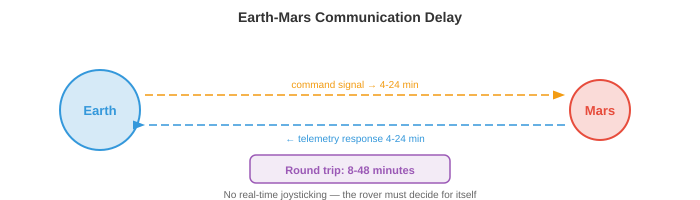
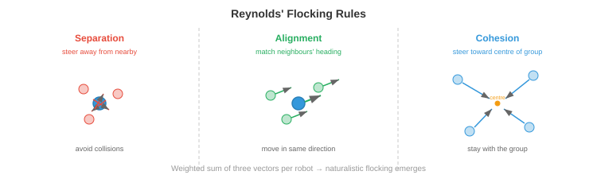

# Космическая и экстремальная робототехника

*Робототехника в космосе и экстремальных условиях доводит автономность до предела, когда задержки связи, радиация и неструктурированная местность требуют роботов, которые думают самостоятельно. Этот файл охватывает планетоходы, орбитальное обслуживание, автономность с ограниченной связью, радиационно-стойкие вычисления, подводную робототехнику, поисково-спасательные операции, роевую робототехнику и взаимодействие человека и робота*

- На протяжении всей этой главы мы изучали автономные системы, которые работают в относительно благоприятных условиях: дороги с разметкой, склады с ровными полами, кухни с известными категориями объектов. Но некоторые из наиболее эффективных применений робототехники находятся в средах, куда люди не могут попасть или где цена человеческого присутствия чрезвычайно высока: поверхность Марса, глубокое дно океана, места ядерных катастроф и горящие здания.

- Эти **экстремальные условия** имеют общие проблемы: связь ограничена или задерживается, местность неструктурирована и непредсказуема, оборудование должно выдерживать суровые условия, и поблизости нет человека, который мог бы исправить ситуацию, если что-то пойдет не так. Робот должен быть по-настоящему автономным, а не просто «автономным по отношению к человеку, смотрящему на экран».

## Космическая робототехника

- Космос – это предельная экстремальная среда. Воздуха нет, температура колеблется от -170°C до +120°C, радиация бомбардирует электронику, а помощь находится за миллионы километров. Космические роботы должны быть чрезвычайно надежными, энергоэффективными и автономными.

- **Планетарные вездеходы** – это мобильные роботы, исследующие поверхности других миров. Марсоходы НАСА («Дух», «Оппортьюнити», «Кьюриосити», «Настойчивость») являются наиболее известными примерами. Каждое поколение было более автономным, чем предыдущее.



- Фундаментальным ограничением является **задержка связи**. Марс находится на расстоянии 4–24 минут по радио (в зависимости от орбитальных позиций), поэтому связь туда и обратно занимает 8–48 минут. Ровером нельзя управлять в режиме реального времени. Если он встретит камень, он не сможет попросить Землю о помощи и дождаться ответа. Оно должно решить само.

- Ранние марсоходы (Spirit, Opportunity) в значительной степени полагались на комплексное планирование: люди изучали изображения, планировали путь, загружали команды, а марсоход их выполнял. Один цикл движения занимал целый марсианский день (сол). Ровер мог проходить 50-100 метров за сол.

- **AutoNav** (автономная навигация) в режиме «Любопытство» и «Настойчивость» значительно увеличили автономность. Ровер использует стереокамеры для построения локальной 3D-карты (вспомните глубину стерео из главы 8), оценивает проходимость местности (уклон, неровности, размер камней) и планирует безопасный путь с помощью планировщика на основе сетки с картой стоимости проходимости. Ровер движется автономно, пока команда людей спит, увеличивая ежедневное расстояние перемещения до 100+ метров.

- Конвейер восприятия на марсоходах ограничен радиационно-стойкими процессорами, которые на несколько порядков медленнее потребительского оборудования (обсуждается ниже). Алгоритмы должны быть экономными в вычислительном отношении: классическое стереосопоставление, а не глубокие нейронные сети, простые планировщики карт затрат, а не изученные политики.

- **Орбитальное обслуживание** включает в себя роботов, которые проверяют, ремонтируют, дозаправляют или уводят с орбиты спутники. Эта область расширяется, поскольку пространство становится все более перегруженным. Такие миссии, как **OSAM-1** (НАСА) и коммерческие предприятия (Astroscale, Northrop Grumman MEV), используют роботизированное оружие и стыковочные механизмы для обслуживания спутников.

- Задача заключается в **операциях сближения**: обслуживающий космический корабль должен приблизиться к целевому спутнику (который может кувыркаться, отказываться от взаимодействия и не иметь стыковочных интерфейсов) и выполнить точные манипуляции в условиях микрогравитации. Оценка позы на основе зрения (определение трехмерного положения и ориентации цели по изображениям с камеры) имеет решающее значение. При этом используются методы из главы 8: обнаружение функций, решение PnP (Perspective-n-Point) и, в последнее время, системы оценки позы на основе глубокого обучения.- **Спутниковая инспекция** использует небольшие космические корабли для визуального осмотра других спутников на предмет повреждений или аномалий. Инспектор должен самостоятельно перемещаться вокруг цели, избегать столкновений и получать изображения высокого разрешения с оптимальных точек зрения. Это проблема планирования: найти траекторию, охватывающую все точки проверки, при этом соблюдая ограничения на топливо, условия освещения и избегая столкновений.

## Ограничения общения

- В космосе связь ограничена скоростью света, доступной полосой пропускания и геометрией орбиты (марсоход на обратной стороне Марса вообще не может связаться с Землей без спутников-ретрансляторов).

- Эти ограничения фундаментально меняют архитектуру автономии. На Земле робот может передавать потоковое HD-видео на облачный сервер, выполнять логические выводы на кластере графических процессоров и получать команды за миллисекунды. В космосе робот должен делать все на борту.

- **Высокая задержка** означает, что робот должен планировать и действовать без участия человека в реальном времени. Программное обеспечение автономности должно обрабатывать номинальные операции, обнаруживать аномалии и реагировать на опасности, не дожидаясь вмешательства человека. Это требует надежной оценки состояния на борту, обнаружения неисправностей и планирования на случай непредвиденных обстоятельств.

- **Ограниченная полоса пропускания** означает, что робот не может передавать необработанные данные датчиков. Одно изображение с высоким разрешением может занимать несколько мегабайт, но скорость передачи данных между Марсом и Землей составляет всего несколько килобит в секунду по прямым каналам связи с Землей (более высокая через орбитальные ретрансляторы, но все еще ограничена). Робот должен агрессивно сжимать данные, определять приоритетность отправки данных и принимать большинство решений локально.

- **Окна связи** работают с перебоями. Марсоход может связываться с Землей только при определенной орбитальной геометрии, обычно в течение нескольких часов в сутки через спутники-ретрансляторы. За этими окнами марсоход полностью предоставлен самому себе.

- Для ИИ необходимо, чтобы **бортовая автономия** была очень надежной. Системе необходимо обнаружить, что что-то не так (колесо застряло, неисправен датчик, местность впереди непроходима), принять решение о безопасном реагировании и продолжить работу до следующего окна связи, когда она сможет сообщить об этом и получить обновленные инструкции.

## Радиационно-стойкие вычисления

- Космос наводнен ионизирующей радиацией: космическими лучами, солнечными частицами и захваченной радиацией в планетарных магнитных полях. Частицы высокой энергии могут перевернуть биты в памяти (**единичные сбои, SEU**), необратимо повредить транзисторы (**общая ионизирующая доза, TID**) или вызвать деструктивное запирание в схемах.

- **Радиационно-стойкие** процессоры предназначены для работы в такой среде. Они используют транзисторы большей геометрии, избыточную логику (тройное модульное резервирование: три копии каждой схемы голосуют на выходе) и специализированные производственные процессы. Цена — это производительность: современный сверхмощный процессор может обеспечить производительность 200 MIPS по сравнению с миллиардами операций в секунду на потребительском графическом процессоре.

- **RAD750** (BAE Systems) использовался в качестве двигателя Curiosity и многих других космических кораблей. Он работает на частоте 200 МГц и имеет вычислительную мощность около 400 MIPS, что сопоставимо с настольным компьютером середины 1990-х годов. Perseverance использует процессор аналогичного класса. Запуск современной нейронной сети (миллионы параметров, миллиарды операций умножения-накопления) на таком оборудовании невозможен.

- **Сжатие модели** становится необходимым. Методы из главы 6 (квантование, сокращение, дистилляция знаний) используются для сокращения нейронных сетей, чтобы они соответствовали экстремальному вычислительному бюджету. Модель, которая работает за миллисекунды на графическом процессоре ноутбука, может потребовать нескольких минут на радиационно-высоком процессоре или вообще не поместиться в памяти.

- Альтернативный подход использует **готовые коммерческие процессоры (COTS)** с программным обеспечением снижения радиации: коды, исправляющие ошибки, сторожевые таймеры, периодическую очистку памяти и стратегии постепенного снижения производительности. Некоторые современные миссии используют этот подход для доступа к более мощным вычислительным ресурсам за счет увеличения сложности программного обеспечения и риска.- Будущие планетарные миссии изучают **FPGA** и специализированные ускорители искусственного интеллекта, которые могут быть устойчивы к радиации, обеспечивая при этом значительно больше вычислений, чем традиционные радиационно-стойкие процессоры, что потенциально впервые позволит обеспечить глубокое обучение на борту.

## Автономная навигация по неструктурированной местности

- На Земле дороги ровные, хорошо обозначены и нанесены на карту. На Марсе, Луне или месте катастрофы нет дорог. Рельеф неструктурирован: камни, склоны, песок, расщелины и поверхности, которые могут не выдержать вес робота.

- **Классификация местности** оценивает, безопасно ли проходить каждый участок земли. Характеристики включают уклон (на основе 3D-реконструкции), шероховатость (изменение нормалей поверхности), плотность породы и тип почвы. Классические подходы вычисляют эти характеристики на основе карт стереоглубины; современные подходы используют изученные классификаторы визуальных и геометрических признаков.

- **Визуально-инерциальная одометрия (VIO)** оценивает движение робота, отслеживая визуальные особенности по кадрам камеры и объединяя их с измерениями IMU. Это основной компонент SLAM (глава 8), адаптированный для экстремальных условий. На Марсе VIO должен обрабатывать: безликую песчаную местность (несколько визуальных особенностей, которые нужно отслеживать), резкое освещение (экстремальные тени) и ограниченные вычислительные возможности.

- Оценка объединяет визуальные и инерциальные данные с использованием **Расширенного фильтра Калмана (EKF)** или оптимизации графа коэффициентов. Вектор состояния включает в себя положение, скорость, ориентацию и смещения IMU. На этапе прогнозирования используется интеграция IMU:

$$\mathbf{x}_{t+1} = f(\mathbf{x}_t, \mathbf{u}_t)$$

- где $\mathbf{u}_t$ — измерение IMU (ускорение и угловая скорость). Шаг обновления корректирует прогноз, используя наблюдения визуальных особенностей. Это байесовская оценка (глава 5): IMU предоставляет априорные данные, а визуальные наблюдения обновляют убеждения.

- **Избежание опасностей** имеет решающее значение во время посадки на планету. Когда космический корабль опускается к поверхности, он должен определить безопасные зоны приземления в режиме реального времени с помощью бортовых камер или LiDAR. Система НАСА **Terrain Relative Navigation (TRN)** на спутнике Perseverance сравнила изображения бортовой камеры с предварительно загруженными орбитальными картами, чтобы определить его положение во время спуска, а затем отклониться от опасной местности. Это позволило приземлиться в кратере Джезеро, богатом наукой, но опасном для местности месте, которое было бы слишком рискованным для предыдущих миссий.

## Подводная робототехника

- Глубокий океан так же чужд, как и космос: сокрушительное давление (более 1000 атмосфер на полной глубине океана), почти нулевая видимость, отсутствие GPS и ограниченная связь. Подводные роботы необходимы для изучения океана, проверки морской инфраструктуры, глубоководной добычи полезных ископаемых и поисковых операций.

- **АНПА** (автономные подводные аппараты) работают автономно, неся при себе энергию и вычислительную мощность. Они следуют заранее запрограммированным схемам опросов или используют встроенный интеллект, чтобы адаптироваться к открытиям. АНПА используются для картографирования морского дна, проверки трубопроводов и мониторинга окружающей среды.

- **ДУА** (дистанционно управляемые транспортные средства) привязаны к надводному кораблю кабелем, обеспечивающим питание и связь. Они используются для задач, требующих контроля человека в реальном времени: глубоководные манипуляции, строительство и ремонт. Привязь устраняет ограничения связи, но ограничивает радиус действия и усложняет эксплуатацию.

- **Акустическая связь** — основной метод подводной связи (радиоволны быстро затухают в воде). Акустические модемы достигают скорости передачи данных 1–10 кбит/с на расстоянии нескольких километров по сравнению с гигабитами в секунду для радиосвязи на суше. Это еще более ограничено, чем связь на Марсе, что вынуждает АНПА быть очень автономными.

- **Подводный SLAM** особенно сложен. Сонар обеспечивает измерения дальности, но с плохим угловым разрешением и значительным шумом (многолучевым отражением от морского дна и поверхности). Камеры работают только на очень близком расстоянии (несколько метров в прозрачной воде, меньше в мутных условиях). Функциональный визуальный SLAM (глава 8) должен быть адаптирован к уникальным визуальным характеристикам подводных сцен: затуханию цвета (в первую очередь поглощается красный свет), обратному рассеянию и искусственному освещению, создающему яркие пятна и глубокие тени.- Навигация без GPS использует метод **точного счисления** (интеграция скорости из доплеровского журнала скорости, DVL, который измеряет скорость относительно морского дна с использованием акустических доплеровских сдвигов), чему способствует периодическое всплытие для определения координат GPS или акустическое позиционирование с помощью наземных транспондеров. Это та же проблема дрейфа, что и при навигации только с помощью IMU: небольшие ошибки скорости накапливаются в ходе длительных миссий.

## Поисково-спасательная робототехника

- После землетрясений, обрушений зданий или промышленных аварий роботы могут проникать в места, слишком опасные для спасателей: структурно нестабильные здания, токсичные среды, пожары или замкнутые пространства.

- Требования таковы: быстрое развертывание (минуты, а не часы), работа в условиях отсутствия GPS (внутри зданий, под землей), надежная связь через стены и завалы, а также способность перемещаться в сильно загроможденных, частично разрушенных пространствах с мусором, пылью и плохим освещением.

- **Координация нескольких роботов** полезна при поиске и спасании, поскольку команда роботов может охватить большую территорию быстрее, чем один робот. Задача заключается в координации: роботы должны разделить зону поиска, избегать дублирования усилий и делиться открытиями.

- **Исследование на основе границ** назначает роботов на границы между исследованным и неисследованным пространством («граница»). Каждый робот направляется к ближайшей неизведанной границе, составляет ее карту и движется дальше. Центральный или распределенный планировщик распределяет границы между роботами, чтобы минимизировать общее время исследования. Это проблема оптимизации покрытия.

- Связь через завалы ненадежна. Роботы могут потерять контакт с оператором и друг с другом. Система должна быть устойчивой к прерывистой связи: каждый робот должен иметь возможность работать независимо, создавать собственную карту местности и принимать собственные решения, а затем объединять информацию, когда связь восстанавливается.

## Роевая робототехника

- **Роевая робототехника** использует большое количество простых и недорогих роботов, которые достигают сложного коллективного поведения посредством локального взаимодействия. Ни один робот не способен индивидуально, но рой в целом может выполнять задачи, которые не под силу ни одному отдельному человеку.

- Вдохновение исходит от биологических роев: муравьев, строящих мосты своими телами, пчел, принимающих коллективные решения о местах гнездования, косяков рыб, уклоняющихся от хищников посредством скоординированных движений. В каждом случае простые местные правила (следуйте за соседями, избегайте столкновений, двигайтесь к еде) порождают сложное глобальное поведение.

- **Децентрализованное управление** означает отсутствие центрального командира. Каждый робот следует одним и тем же местным правилам, реагируя только на своих соседей и ближайшее окружение. Глобальное поведение **возникает** из этих локальных взаимодействий. Это делает рои по своей сути устойчивыми: если один робот выйдет из строя, рой продолжит работу. Не существует единой точки отказа.

- **Алгоритмы консенсуса** позволяют группе согласовать коллективное решение (например, в каком направлении двигаться, какой задаче отдать приоритет) только посредством локального общения. В простом протоколе консенсуса каждый робот усредняет свою ценность со своими соседями:

$$x_i(t+1) = \frac{1}{|N_i| + 1} \left( x_i(t) + \sum_{j \in N_i} x_j(t) \right)$$


- где $N_i$ — множество соседей робота $i$. Это повторяется до тех пор, пока все роботы не придут к одному и тому же значению (среднему глобальному значению). Скорость сходимости зависит от топологии коммуникационного графа, в частности от его алгебраической связности (второе наименьшее собственное значение лапласиана графа, связанное с собственными значениями из главы 2).



- **Алгоритмы стайки** (правила Рейнольдса) обеспечивают скоординированное групповое движение с помощью трех простых правил для каждого робота:
    - **Разделение**: держитесь подальше от соседей, находящихся слишком близко (избегайте столкновений).
    - **Выравнивание**: ориентируйтесь на средний курс соседей (двигайтесь в одном направлении).
    - **Сплоченность**: придерживайтесь среднего положения соседей (оставаться в группе).

- Каждое правило представляет собой векторный вклад в скорость робота. Взвешенная сумма этих векторов обеспечивает натуралистическое поведение стайивания. Это линейная комбинация векторов (глава 1), где веса контролируют относительную важность каждого поведения.- Применения роевой робототехники включают мониторинг окружающей среды (распределение датчиков на большой территории), точное земледелие (координация дронов для опрыскивания сельскохозяйственных культур), строительство (роботы коллективно собирают конструкции) и поисковые операции (эффективное покрытие большой площади).

## Взаимодействие человека и робота

- Большинство реальных автономных систем работают бок о бок с людьми, а не изолированно. Взаимодействие между человеком и роботом, то, как они общаются, разделяют контроль и укрепляют доверие, так же важно, как и технические возможности робота.


- **Совместная автономия** сочетает в себе управление человеком и роботом. Вместо полной телеоперации (человек контролирует все) или полной автономии (робот контролирует все) общая автономия позволяет человеку обеспечивать намерения высокого уровня, в то время как робот выполняет низкоуровневые действия. Например, человек может указать на объект и сказать «возьми это», а робот самостоятельно планирует захват и движение руки.

- Математически разделяемую автономию можно смоделировать как сочетание действий человека $\mathbf{u}_h$ и автономных действий робота $\mathbf{u}_r$:

$$\mathbf{u} = \alpha \mathbf{u}_h + (1 - \alpha) \mathbf{u}_r$$

- где $\alpha \in [0, 1]$ – параметр смешивания. При $\alpha = 1$ человек имеет полный контроль (телеоперация). При $\alpha = 0$ робот полностью автономен. Адаптивная общая автономия корректирует $\alpha$ в зависимости от ситуации: робот берет на себя больше контроля, когда он уверен, и уступает контроль, когда он неуверен или ситуация новая.

- **Дистанционное управление** остается важным для задач, выходящих за рамки текущих автономных возможностей. Человек-оператор управляет роботом удаленно, просматривая сцену через камеры робота. Проблема заключается в **задержке**: даже задержка в 100 мс затрудняет телеоперацию, а многосекундные задержки в космосе делают практически невозможным точное манипулирование. Прогнозирующие дисплеи (показывающие прогнозируемое будущее состояние робота) и виртуальные приспособления (программные руководства, которые не позволяют оператору управлять опасными движениями) помогают компенсировать это.

- **Калибровка доверия** — это проблема обеспечения надлежащего доверия людей к роботу: не слишком большого (чрезмерное доверие приводит к самоуспокоенности и неспособности вмешаться в случае необходимости), не слишком малого (недостаточное доверие приводит к ненужному вмешательству и недостаточному использованию). Доверие должно быть откалибровано в соответствии с реальными возможностями робота: доверяйте ему в ситуациях, с которыми он хорошо справляется, и будьте скептичны в ситуациях, находящихся на грани его компетентности.

- Исследования показывают, что на доверие влияют: прозрачность робота (объясняет ли он свои решения?), надежность (происходит ли его сбой предсказуемо или случайно?) и коммуникация (выражает ли он неопределенность?). Робот, который говорит: «Я на 40% уверен, что это безопасный путь, стоит ли мне продолжать?» позволяет лучше принимать решения человеком, чем тот, который молча движется вперед.

- **Разборчивость** движений робота означает, что робот движется таким образом, чтобы сообщить о своих намерениях находящимся рядом людям. Если робот тянется к объекту, его путь должен сделать очевидным, на какой объект он нацелен, еще до того, как он прибудет. Это включает в себя планирование траекторий, которые максимизируют способность наблюдателя сделать вывод о цели на раннем этапе, что можно формализовать как максимизацию апостериорной вероятности истинной цели с учетом наблюдаемой частичной траектории:

$$\pi^* = \arg\max_\pi P(G \mid \xi_{0:t})$$

- где $G$ — цель, а $\xi_{0:t}$ — наблюдаемая на данный момент траектория. При этом используется байесовский вывод (глава 5): у наблюдателя есть априорное представление о возможных целях, а траектория робота предоставляет доказательства, подтверждающие это убеждение.

## Задачи по кодированию (используйте CoLab или блокнот)

1. Смоделировать алгоритм консенсуса для роя роботов, договаривающихся о целевой позиции. Начните со случайных начальных позиций и наблюдайте за конвергенцией.
```python
import jax
import jax.numpy as jnp
import matplotlib.pyplot as plt

n_robots = 10
rng = jax.random.PRNGKey(0)
positions = jax.random.uniform(rng, (n_robots, 2), minval=-5, maxval=5)

# Communication graph: each robot talks to its 3 nearest neighbours
def get_neighbours(positions, k=3):
    dists = jnp.linalg.norm(positions[:, None] - positions[None, :], axis=-1)
    # For each robot, find k nearest (excluding self)
    neighbours = jnp.argsort(dists, axis=1)[:, 1:k+1]
    return neighbours

history = [positions.copy()]

for step in range(30):
    neighbours = get_neighbours(positions)
    new_positions = jnp.zeros_like(positions)
    for i in range(n_robots):
        nbr_pos = positions[neighbours[i]]
        new_positions = new_positions.at[i].set(
            (positions[i] + nbr_pos.sum(axis=0)) / (len(neighbours[i]) + 1)
        )
    positions = new_positions
    history.append(positions.copy())

# Plot convergence
fig, axes = plt.subplots(1, 3, figsize=(15, 4))
for ax, step_idx, title in zip(axes, [0, 10, 29], ["Initial", "Step 10", "Final"]):
    h = history[step_idx]
    ax.scatter(h[:, 0], h[:, 1], s=50)
    ax.set_xlim(-6, 6); ax.set_ylim(-6, 6)
    ax.set_aspect("equal"); ax.grid(True); ax.set_title(title)
plt.suptitle("Swarm Consensus: Robots Converge to Agreement")
plt.tight_layout()
plt.show()
```

2. Внедрить правила стекания Рейнольдса (разделение, выравнивание, сплоченность) и смоделировать стайку, движущуюся вместе.
```python
import jax
import jax.numpy as jnp
import matplotlib.pyplot as plt

n = 30
rng = jax.random.PRNGKey(1)
k1, k2 = jax.random.split(rng)
pos = jax.random.uniform(k1, (n, 2), minval=-5, maxval=5)
vel = jax.random.uniform(k2, (n, 2), minval=-0.5, maxval=0.5)

dt = 0.1
separation_radius = 1.0
neighbour_radius = 3.0

trajectories = [pos.copy()]

for _ in range(200):
    new_vel = jnp.zeros_like(vel)
    for i in range(n):
        diffs = pos - pos[i]
        dists = jnp.linalg.norm(diffs, axis=1)

        # Neighbours within radius (exclude self)
        nbr_mask = (dists < neighbour_radius) & (dists > 0)
        sep_mask = (dists < separation_radius) & (dists > 0)

        # Separation: steer away from very close neighbours
        if sep_mask.any():
            sep = -diffs[sep_mask].sum(axis=0)
        else:
            sep = jnp.zeros(2)

        # Alignment: match average velocity of neighbours
        if nbr_mask.any():
            align = vel[nbr_mask].mean(axis=0) - vel[i]
        else:
            align = jnp.zeros(2)

        # Cohesion: steer toward average position of neighbours
        if nbr_mask.any():
            cohesion = pos[nbr_mask].mean(axis=0) - pos[i]
        else:
            cohesion = jnp.zeros(2)

        new_vel = new_vel.at[i].set(vel[i] + 1.5 * sep + 0.5 * align + 0.3 * cohesion)

    # Limit speed
    speeds = jnp.linalg.norm(new_vel, axis=1, keepdims=True)
    vel = jnp.where(speeds > 2.0, new_vel / speeds * 2.0, new_vel)
    pos = pos + vel * dt
    trajectories.append(pos.copy())

# Plot snapshots
fig, axes = plt.subplots(1, 3, figsize=(15, 4))
for ax, idx, title in zip(axes, [0, 50, 199], ["Start", "Step 50", "Step 200"]):
    p = trajectories[idx]
    v = vel if idx == 199 else jnp.zeros_like(vel)
    ax.scatter(p[:, 0], p[:, 1], s=20, c="blue")
    ax.set_aspect("equal"); ax.grid(True); ax.set_title(title)
    lim = max(abs(p).max() + 1, 6)
    ax.set_xlim(-lim, lim); ax.set_ylim(-lim, lim)
plt.suptitle("Reynolds' Flocking: Separation + Alignment + Cohesion")
plt.tight_layout()
plt.show()
```

3. Имитировать смешивание разделяемой автономии: человек обеспечивает шумный направленный ввод, а автономная система робота обеспечивает плавный путь к цели. Смешайте их с разными значениями альфа.
```python
import jax
import jax.numpy as jnp
import matplotlib.pyplot as plt

goal = jnp.array([10.0, 5.0])
pos = jnp.array([0.0, 0.0])
dt = 0.1

rng = jax.random.PRNGKey(3)

fig, axes = plt.subplots(1, 3, figsize=(15, 4))
for ax, alpha in zip(axes, [1.0, 0.5, 0.0]):
    pos = jnp.array([0.0, 0.0])
    path = [pos.copy()]

    for step in range(150):
        # Robot autonomy: smooth path to goal
        direction = goal - pos
        u_robot = direction / (jnp.linalg.norm(direction) + 1e-6) * 1.0

        # Human input: roughly correct direction but noisy
        noise = jax.random.normal(jax.random.fold_in(rng, step), (2,)) * 0.5
        u_human = u_robot + noise

        # Blend
        u = alpha * u_human + (1 - alpha) * u_robot
        pos = pos + u * dt
        path.append(pos.copy())

        if jnp.linalg.norm(pos - goal) < 0.3:
            break

    path = jnp.stack(path)
    ax.plot(path[:, 0], path[:, 1], "b-", alpha=0.7)
    ax.plot(*goal, "r*", markersize=15)
    ax.plot(0, 0, "go", markersize=10)
    ax.set_title(f"α={alpha:.1f} ({'human' if alpha==1 else 'robot' if alpha==0 else 'shared'})")
    ax.set_xlim(-1, 12); ax.set_ylim(-3, 8)
    ax.set_aspect("equal"); ax.grid(True)

plt.suptitle("Shared Autonomy: Blending Human and Robot Control")
plt.tight_layout()
plt.show()
```