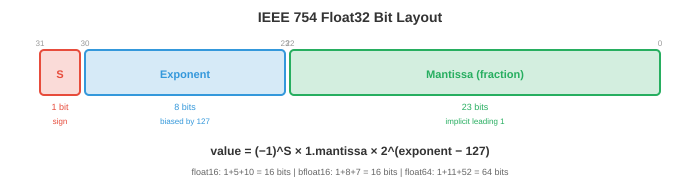
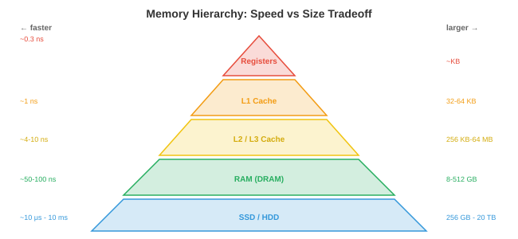

# Компьютерная архитектура

*Компьютерная архитектура — это то, как мы создаем машины, выполняющие инструкции. Этот файл охватывает системы счисления, логические элементы, конструкцию ЦП, архитектуру набора команд, конвейерную обработку, иерархию памяти и виртуальную память — аппаратную основу, на которой в конечном итоге работает каждая программа, платформа и модель искусственного интеллекта.*

- Каждая нейронная сеть, каждый цикл обучения, каждый вызов вывода в конечном итоге становится последовательностью электрических сигналов, проходящих через транзисторы. Понимание аппаратного обеспечения не является обязательным для серьезных специалистов по машинному обучению: оно объясняет, почему умножение матриц происходит быстро, почему память является узким местом, почему графические процессоры доминируют в обучении ИИ и почему код, дружественный к кэшу, может быть в 100 раз быстрее, чем простой код.

## Системы счисления

- Компьютеры представляют все в **двоичном формате** (основание 2): последовательности 0 и 1. Каждая цифра представляет собой **бит**. Группа из 8 бит представляет собой **байт**. Значение двоичного числа $b_{n-1} b_{n-2} \ldots b_1 b_0$ равно $\sum_{i=0}^{n-1} b_i \cdot 2^i$.

- Например, $1011_2 = 1 \cdot 8 + 0 \cdot 4 + 1 \cdot 2 + 1 \cdot 1 = 11_{10}$.

- **Шестнадцатеричный** (по основанию 16) – это компактная система записи двоичных чисел. Каждая шестнадцатеричная цифра представляет 4 бита: $0\text{-}9$ соответствует $0000\text{-}1001$, а $A\text{-}F$ соответствует $1010\text{-}1111$. Итак, $\text{0xFF} = 1111\,1111_2 = 255_{10}$. Адреса памяти и цветовые коды обычно записываются в шестнадцатеричном формате.

- **Дополнение до двух** представляет целые числа со знаком. Для битового числа $n$ старший бит имеет вес $-2^{n-1}$ вместо $+2^{n-1}$. 8-битное дополнение до двух находится в диапазоне от $-128$ до $+127$. Чтобы инвертировать число: переверните все биты и добавьте 1. В этом представлении сложение и вычитание используют одну и ту же аппаратную схему, поэтому оно универсально.

- **IEEE 754 с плавающей запятой** представляет действительные числа в виде $(-1)^s \times 1.m \times 2^{e-\text{bias}}$, где $s$ — знаковый бит, $m$ — мантисса (дробная часть), а $e$ — смещенная экспонента.



    - **float32** (одинарная точность): 1 знак + 8 экспонент + 23 мантисса = 32 бита. Диапазон: $\approx \pm 3.4 \times 10^{38}$, точность: $\approx 7$ десятичные цифры.
    - **float64** (двойная точность): 1 знак + 11 показатель степени + 52 мантисса = 64 бита. Диапазон: $\approx \pm 1.8 \times 10^{308}$, точность: $\approx 15$ десятичные цифры.
    - **float16** (половинная точность): 1 + 5 + 10 = 16 бит. Ограниченный диапазон и точность, но используется половина памяти и пропускной способности. Широко используется при обучении машинному обучению (смешанная точность, глава 6).
    - **bfloat16**: 1 + 8 + 7 = 16 бит. Тот же диапазон экспоненты, что и у float32, но более низкая точность. Разработано Google специально для машинного обучения: полный диапазон экспоненты предотвращает переполнение во время обучения, а пониженная точность приемлема для обновлений градиента.

- Арифметика с плавающей запятой **неточна**. $0.1 + 0.2 \neq 0.3$ в float64 (это равно $0.30000000000000004$). Это связано с тем, что $0.1$ не имеет точного двоичного представления, так же как $1/3$ не имеет точного десятичного представления. Накопление этих ошибок за миллионы операций (например, градиентный спуск) может вызвать числовую нестабильность, поэтому существуют такие методы, как масштабирование потерь (глава 6) и суммирование Кахана.

## Логические вентили

- Все вычисления сводятся к **логическим элементам**: физическим схемам, реализующим логические операции (пропозициональная логика из файла 1).

- Фундаментальные ворота:
    - **И**: выход равен 1, только если оба входа равны 1.
    - **ИЛИ**: выход равен 1, если хотя бы один вход равен 1.
    - **NOT** (инвертор): переворачивает вход.
    - **NAND** (НЕ-И): универсальный вентиль. Любой другой вентиль может быть построен только из вентилей И-НЕ. Вот почему NAND является фундаментальным строительным блоком цифровых схем.
    - **XOR** (исключающее ИЛИ): выход равен 1, если входные данные различаются. Необходим для сложения (бит суммы двоичного сложения — XOR) и криптографии.

- **Полусумматор** складывает два одиночных бита с помощью операций XOR (сумма) и AND (перенос). **Полный сумматор** складывает два бита плюс перенос, образуя цепочку $n$-битный сумматор. Вот как процессоры выполняют сложение целых чисел: каскад простых логических элементов.- **Мультиплексор** (MUX) выбирает один из нескольких входов на основе управляющего сигнала. С битами управления $n$ он выбирает один из входов $2^n$. Мультиплексоры являются аппаратным эквивалентом цепочки if-else и широко используются в путях передачи данных ЦП для маршрутизации данных.

- Современные процессоры содержат миллиарды транзисторов, каждый из которых действует как крошечный переключатель. Транзистор либо включен (проводит, что соответствует 1), либо выключен (не проводит, что соответствует 0). Гейты состоят из транзисторов, сумматоры — из вентилей, АЛУ — из сумматоров, а ЦП — из АЛУ. На этом фундаменте покоится вся иерархия вычислений.

## Архитектура ЦП

- **Центральный процессор (ЦП)** выполняет инструкции. Его основные компоненты:

    - **АЛУ** (арифметико-логический блок): выполняет целочисленные арифметические операции (сложение, вычитание, умножение) и логические операции (И, ИЛИ, исключающее ИЛИ, сдвиг). Именно здесь происходят фактические вычисления, построенные на логических элементах, описанных выше.

    - **Регистры**: крошечные, сверхбыстрые ячейки памяти внутри процессора. Современный процессор имеет десятки регистров общего назначения, каждый из которых содержит одно слово (64 бита в 64-битном процессоре). Регистры — самая быстрая память в системе: доступ занимает ~0,3 наносекунды.

    - **Счетчик программ (ПК)**: хранит адрес памяти следующей выполняемой команды.

    - **Управляющий модуль**: декодирует инструкции и организует путь данных, сообщая АЛУ, какую операцию выполнять и какие регистры использовать.

- **Цикл инструкций** (выборка-декодирование-выполнение) повторяется миллиарды раз в секунду:

    1. **Извлечение**: прочитать инструкцию из памяти по адресу в ПК.
    2. **Декодирование**: определите, что делает инструкция (добавляет? загружает из памяти? разветвляет?) и какие операнды она использует.
    3. **Выполнить**: выполнить операцию (вычисление ALU, доступ к памяти или переход).
    4. Увеличить PC (если инструкция не является ветвлением/переходом).

- Процессор, работающий на частоте 4 ГГц, выполняет 4 миллиарда циклов в секунду. Каждый цикл занимает 0,25 наносекунды. За это время свет проходит около 7,5 сантиметров, поэтому физический размер чипа имеет значение: сигналы не могут пересечь большой чип за один цикл.

## Архитектура набора команд

- **Архитектура набора инструкций (ISA)** — это договор между аппаратным и программным обеспечением: он определяет инструкции, которые понимает ЦП, набор регистров, модель памяти и формат кодирования.

- **CISC** (компьютер со сложным набором команд): инструкции могут быть сложными, переменной длины и могут иметь прямой доступ к памяти. Одна инструкция может умножить два значения памяти и сохранить результат. **x86** (Intel/AMD) — это доминирующий CISC ISA, на котором работает большинство настольных компьютеров и серверов. Его обратная совместимость (современные процессоры x86 до сих пор используют код 1980-х годов) — это одновременно его сила и бремя.

- **RISC** (компьютер с сокращенным набором команд): инструкции простые, фиксированной длины и работают только с регистрами. Доступ к памяти требует отдельных инструкций загрузки/сохранения. Более простые инструкции позволяют повысить тактовую частоту и упростить конвейерную обработку.

    - **ARM**: доминирующий RISC ISA для мобильных устройств и все чаще для серверов и ноутбуков (чипы Apple серии M — это ARM). Энергоэффективность ARM делает его идеальным для устройств с батарейным питанием и температурными ограничениями.
    - **RISC-V**: RISC ISA с открытым исходным кодом. Любой может разработать чип RISC-V без лицензионных отчислений. Растущее внедрение встроенных систем, исследований и ускорителей искусственного интеллекта.

- Различие между CISC и RISC размыто: современные процессоры x86 внутренне декодируют сложные инструкции CISC в более простые микрооперации (по сути, внутренние RISC), получая преимущества обоих миров.

## Конвейерная обработка

- Без конвейерной обработки ЦП полностью выполняет одну инструкцию перед запуском следующей. Это приводит к потере аппаратного обеспечения: пока работает АЛУ, блоки выборки и декодирования простаивают.


- **Конвейерная обработка** перекрывает выполнение инструкций, как сборочная линия. Пока выполняется инструкция 1, инструкция 2 декодируется, а инструкция 3 извлекается. Пятиэтапный конвейер (выборка, декодирование, выполнение, доступ к памяти, обратная запись) может одновременно выполнять 5 инструкций.- Пропускная способность приближается к одной инструкции за такт (хотя для выполнения каждой инструкции требуется 5 тактов). Это тот же принцип, что и конвейерная обработка в ML: параллелизм данных перекрывает вычисления и обмен данными (глава 6).

- **Опасностями** являются ситуации, когда трубопроводы ломаются:

    - **Опасность данных**: инструкции 2 нужен результат, который инструкция 1 еще не дала. «Добавить R1, R2, R3», а затем «Sub R4, R1, R5» — для второй инструкции требуется R1, который первая все еще обрабатывает. **Пересылка** (обход) решает эту проблему, перенаправляя результат напрямую с одного этапа конвейера на другой, не дожидаясь этапа обратной записи.

    - **Опасность управления**: инструкция ветвления (if-else) означает, что ЦП не знает, какую инструкцию выбрать следующей, пока ветвь не будет разрешена. **Прогнозирование ветвления** предполагает, в каком направлении пойдет ветвь, и спекулятивно извлекает инструкции по предсказанному пути. Современные предсказатели имеют точность> 95%, используя исторические таблицы и сопоставление шаблонов, подобных нейронным сетям. Неправильный прогноз стоит ~15 циклов (конвейер необходимо очистить и перезапустить).

    - **Структурная опасность**: двум инструкциям одновременно требуется один и тот же аппаратный ресурс (например, обеим нужен порт памяти). Решается дублированием ресурсов или вставкой стойла.

## Иерархия памяти

- Фундаментальное противоречие в компьютерной памяти: быстрая память дорогая и маленькая, дешевая память медленная и большая. **Иерархия памяти** устраняет этот разрыв, используя **локальность**: программы имеют тенденцию неоднократно обращаться к одним и тем же данным (временная локальность) и получать доступ к близлежащим данным (пространственная локальность).



- Иерархия, от самого быстрого к самому медленному:

    - **Регистры**: доступ ~0,3 нс, всего ~КБ. Внутри процессора.
    - **Кэш L1**: ~1 нс, 32–64 КБ на ядро. Разделение на кеш инструкций и кеш данных.
    - **Кэш L2**: ~4 нс, 256 КБ–1 МБ на ядро.
    - **Кэш L3**: ~10 нс, 8–64 МБ совместно используется всеми ядрами.
    - **ОЗУ (DRAM)**: ~50–100 нс, 8–512 ГБ. Основная память.
    - **SSD**: ~10–100 мкс, 256 ГБ–8 ТБ. Постоянное хранение.
    - **Жесткий диск**: ~5–10 мс, 1–20 ТБ. Механический, очень медленный для произвольного доступа.

- Разрыв в скорости между регистрами и оперативной памятью составляет ~300x. Между регистрами и диском оно составляет ~30 000 000x. Иерархия кэша скрывает этот пробел: если данные, необходимые ЦП, находятся в кэше L1 (**попадание в кэш**), доступ осуществляется быстро. В противном случае (**промах кэша**) процессор останавливается, пока данные извлекаются с более медленного уровня.

- **Ассоциативность кэша** определяет, где в кеше может храниться адрес памяти:
    - **Прямое отображение**: каждый адрес сопоставляется ровно с одной строкой кэша. Просто, но вызывает конфликты.
    - **Полностью ассоциативен**: любой адрес может идти куда угодно. Гибкий, но дорогой поиск.
    - **Set-associative** ($k$-way): каждый адрес сопоставляется с набором местоположений $k$. Практический компромисс, используемый в реальных процессорах (обычно 4- или 8-процессорных).

- **Связность кэша** гарантирует, что все ядра ЦП видят единообразный вид памяти. Когда ядро ​​1 записывает по адресу, который кэшировало ядро ​​2, протокол когерентности (например, MESI) делает недействительной или обновляет копию ядра 2. Это критически важно для параллельного программирования (файл 4) и является одной из причин сложности параллелизма с общей памятью.

- Для специалистов по машинному обучению иерархия памяти объясняет, почему:
    - Матричные операции должны обращаться к памяти последовательно (имеет значение расположение по строкам или по столбцам).
    - Размер пакета влияет на производительность: большие пакеты амортизируют задержку памяти.
    - Смешанная точность (float16/bfloat16) удваивает эффективную пропускную способность памяти, что часто является узким местом.

## Виртуальная память

- **Виртуальная память** дает каждому процессу иллюзию наличия собственного большого непрерывного пространства памяти, хотя физическая оперативная память ограничена и распределяется между процессами.

- Адресное пространство разделено на **страницы** фиксированного размера (обычно 4 КБ). **Таблица страниц** сопоставляет номера виртуальных страниц с номерами физических кадров. Когда программа обращается к виртуальному адресу 0x1234, ЦП преобразует его в физический адрес, просматривая таблицу страниц.- **Буфер перевода (TLB)** — это кэш для записей таблицы страниц. Поскольку таблица страниц находится в оперативной памяти (медленно), TLB хранит недавно использованные переводы на быстром оборудовании. Промах TLB требует обхода таблицы страниц в памяти, что занимает сотни циклов.

- **ошибка страницы** возникает, когда программа обращается к странице, которой нет в физической оперативной памяти. ОС загружает страницу с диска (подкачка), что занимает миллионы циклов. Чрезмерное количество ошибок страниц (**перегрузка**) снижает производительность. Вот почему для обучения машинному обучению требуется достаточно оперативной памяти для хранения модели, состояний оптимизатора и разумного пакета данных.

- Алгоритмы **замены страниц** решают, какую страницу удалить, когда ОЗУ заполнено:
    - **LRU** (наименее недавно использованный): удалить страницу, к которой не обращались в течение длительного времени. Оптимально на практике для большинства рабочих нагрузок. Аппаратно аппроксимируется **алгоритмом синхронизации** (циклический список с опорными битами).
    - **FIFO**: удалить самую старую страницу. Простой, но может удалить часто используемые страницы.
    - **Оптимальный** (Белади): удалить страницу, которая не будет использоваться в течение длительного времени. Невозможно реализовать (требуются будущие знания), но полезно в качестве теоретического ориентира.

- Виртуальная память также обеспечивает **изоляцию**: каждый процесс имеет собственное виртуальное адресное пространство. Ошибка в одном процессе не может повредить память другого процесса, поскольку их виртуальные адреса соответствуют разным физическим фреймам. Это основа безопасности и стабильности ОС.

## Ввод-вывод, прерывания и DMA

- Процессору необходимо взаимодействовать с внешним миром: дисками, сетевыми картами, клавиатурами, графическими процессорами. Это **подсистема ввода-вывода**.

- **Программированный ввод-вывод** (опрос): ЦП неоднократно в цикле проверяет регистр состояния устройства, ожидая готовности данных. Просто, но тратит ресурсы процессора на вращение вместо выполнения полезной работы.

- **Ввод-вывод, управляемый прерываниями**: устройство отправляет аппаратное **прерывание**, когда данные готовы. ЦП продолжает нормальное выполнение до тех пор, пока не поступит прерывание, а затем запускает **обработчик прерываний** (функция ядра) для обработки данных. Это гораздо более эффективно, чем опрос, поскольку процессор не простаивает во время ожидания.

- Механизм прерывания:
    1. Устройство сигнализирует о прерывании по аппаратной линии.
    2. ЦП завершает текущую инструкцию, сохраняет текущее состояние (регистры, счетчик программ) в стек.
    3. ЦП ищет адрес обработчика прерываний в **таблице векторов прерываний** (таблице указателей функций, по одному на каждый тип прерывания).
    4. Обработчик запускается в режиме ядра, обрабатывает ввод-вывод и завершает работу.
    5. ЦП восстанавливает сохраненное состояние и возобновляет прерванную программу.

— Это тот же шаблон сохранения/восстановления, что и при переключении контекста (файл 3), но он запускается аппаратным обеспечением, а не таймером.

- **DMA** (прямой доступ к памяти): при передаче больших объемов данных (чтение с диска, сетевые пакеты, копирование памяти графического процессора) копирование данных ЦП побайтово является расточительным. **Контроллер DMA** передает данные напрямую между устройством и оперативной памятью, не задействуя ЦП. ЦП устанавливает передачу (источник, пункт назначения, размер), контроллер DMA обрабатывает ее, а по завершении ЦП получает прерывание.

— DMA критически важен для ML: при вызове `model.to('cuda')` данные передаются из системной оперативной памяти в память графического процессора через DMA по шине PCIe. Во время обучения градиентная синхронизация между графическими процессорами использует RDMA на основе DMA (Remote DMA) для передачи с высокой пропускной способностью и малой задержкой (глава 6).

- **Шина** соединяет ЦП с памятью и устройствами ввода-вывода. Современные системы используют **PCIe** (Peripheral Component Interconnect Express) для высокоскоростных устройств (графических процессоров, твердотельных накопителей NVMe, сетевых карт). PCIe 4.0 обеспечивает ~32 ГБ/с на слот x16; PCIe 5.0 удваивает это. Пропускная способность шины часто является узким местом для обучения графического процессора: графический процессор может выполнять вычисления быстрее, чем на него можно подавать данные.

- **MMIO** (ввод-вывод с отображением в памяти): регистры устройства сопоставляются с адресами памяти. ЦП читает и записывает по этим адресам, используя обычные инструкции загрузки/сохранения, а оборудование направляет доступ к устройству вместо ОЗУ. Это объединяет доступ к памяти и вводу-выводу в единый механизм, упрощая как аппаратное, так и программное обеспечение.

## Задачи по кодированию (используйте CoLab или блокнот)1. Изучите представление чисел с плавающей запятой IEEE 754. Преобразуйте число с плавающей запятой в его двоичное представление и обратите внимание на поля знака, показателя степени и мантиссы.
```python
import struct

def float_to_bits(f):
    """Show the IEEE 754 binary representation of a float32."""
    packed = struct.pack('>f', f)
    bits = ''.join(f'{byte:08b}' for byte in packed)
    sign = bits[0]
    exponent = bits[1:9]
    mantissa = bits[9:]
    return sign, exponent, mantissa

for val in [1.0, -1.0, 0.1, 0.5, 3.14, float('inf'), float('nan')]:
    s, e, m = float_to_bits(val)
    print(f"{val:>10}  sign={s}  exp={e} ({int(e, 2) - 127:>4d})  mantissa={m[:10]}...")
```

2. Имитировать кэш с прямым отображением. Отслеживайте попадания и промахи для последовательности обращений к памяти.
```python
def simulate_cache(accesses, cache_size=8, block_size=1):
    """Simulate a direct-mapped cache."""
    cache = [None] * cache_size
    hits, misses = 0, 0

    for addr in accesses:
        cache_line = addr % cache_size
        if cache[cache_line] == addr:
            hits += 1
            status = "HIT "
        else:
            misses += 1
            cache[cache_line] = addr
            status = "MISS"
        print(f"  Access {addr:3d} → line {cache_line}: {status}")

    print(f"\nHits: {hits}, Misses: {misses}, Hit rate: {hits/(hits+misses):.1%}")

# Sequential access (good locality)
print("Sequential access:")
simulate_cache([0, 1, 2, 3, 4, 5, 6, 7, 0, 1, 2, 3])

# Strided access (conflict misses)
print("\nStrided access (stride = cache size):")
simulate_cache([0, 8, 0, 8, 0, 8])
```

3. Продемонстрируйте, почему арифметика с плавающей запятой не является ассоциативной. Покажите случаи, когда $(a + b) + c \neq a + (b + c)$.
```python
import jax.numpy as jnp

a = jnp.float32(1e8)
b = jnp.float32(1.0)
c = jnp.float32(-1e8)

left = (a + b) + c   # (1e8 + 1) + (-1e8)
right = a + (b + c)  # 1e8 + (1 + (-1e8))

print(f"(a + b) + c = {left}")   # should be 1.0
print(f"a + (b + c) = {right}")  # might lose the 1.0
print(f"Equal: {left == right}")
print(f"\nThe 1.0 is lost when added to 1e8 because float32 has only ~7 digits of precision")
```