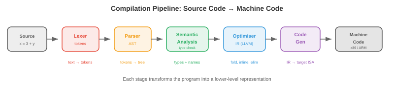

# Языки программирования

*Языки программирования — это интерфейс между человеческим намерением и машинным исполнением. В этом файле описаны языковые парадигмы, системы типов, стратегии управления памятью, конвейер компиляции, интерпретация и JIT-компиляция, ключевые функции языка, языки, специфичные для конкретной предметной области, а также компромиссные решения при проектировании*.

- Каждое программное обеспечение, каждая модель машинного обучения, каждая операционная система написаны на языке программирования. Но существуют сотни языков, каждый из которых имеет разные сильные стороны. Почему? Потому что языковой дизайн предполагает фундаментальные компромиссы: производительность и безопасность, выразительность и простота, контроль и абстракция. Понимание этих компромиссов поможет вам выбрать правильный инструмент для работы и понять ограничения, с которыми вы работаете.

## Языковые парадигмы

- **Парадигма** — это стиль программирования: набор принципов, которые определяют, как вы структурируете код и думаете о проблемах.

- **Императивное** программирование описывает вычисления как последовательность команд, изменяющих состояние. «Установите x равным 5. Прибавьте 3 к x. Если x > 7, выведите его». C, Python и Java являются обязательными по своей сути. Ментальная модель — это машина с памятью, которую вы модифицируете шаг за шагом.

- **Объектно-ориентированное (ООП)** программирование организует код вокруг **объектов**: пакетов данных (атрибутов) и поведения (методов). Объекты взаимодействуют, отправляя друг другу сообщения. Ключевыми идеями являются **инкапсуляция** (скрытие внутреннего состояния за общедоступным интерфейсом), **наследование** (создание новых классов путем расширения существующих) и **полиморфизм** (единообразное обращение с различными типами через общий интерфейс). Java, C++ и Python поддерживают ООП.

- **Функциональное программирование (ФП)** рассматривает вычисления как оценку математических функций. Основные принципы: **неизменяемость** (данные не изменяются после создания), **чистые функции** (выходные данные зависят только от входных данных, никаких побочных эффектов) и **функции первого класса** (функции — это значения, которые можно передавать в качестве аргументов, возвращать из других функций и сохранять в переменных). Haskell чисто функционален. Python, JavaScript и Scala поддерживают функциональный стиль.

- Чистые функции легко анализировать, тестировать и распараллеливать (отсутствие общего изменяемого состояния означает отсутствие условий гонки). Вот почему функциональные идеи все чаще используются в распределенных системах и конвейерах данных. JAX (используемый в этой книге) функционален: `jax.grad` работает, потому что функции JAX являются чистыми.

- **Логическое программирование** описывает, *что* должно быть истинным, а не *как* это вычислить. Вы утверждаете факты и правила, а среда выполнения находит решения. Пролог — классический пример: учитывая «Сократ — человек» и «все люди смертны», движок выводит «Сократ смертен». Логическое программирование используется в базах знаний ИИ и проверке типов.

- Большинство современных языков являются **мультипарадигмальными**: Python поддерживает императивный, ООП и функциональный стили. Rust поддерживает императивные и функциональные возможности. Парадигма — это инструмент, а не религия.

## Типовые системы

– **тип** классифицирует значения и определяет, какие операции допустимы. Целое число 3 и строка «3» относятся к разным типам: вы можете складывать целые числа, но не строки (ну, вы можете объединять строки, но это другая операция).

- **Статическая типизация**: типы проверяются во время **компиляции** перед запуском программы. Ошибки типа обнаруживаются на ранней стадии. C, Java, Rust и Go статически типизированы. Вы должны объявить типы (или компилятор выведет их):

```rust
let x: i32 = 5;     // Rust: x is a 32-bit integer
let y: f64 = 3.14;  // y is a 64-bit float
// let z = x + y;    // compile error: cannot add i32 and f64
```

- **Динамическая типизация**: типы проверяются во время **выполнения**, когда операции фактически выполняются. Более гибкий, но ошибки типа появляются только при запуске кода. Python, JavaScript и Ruby являются динамически типизированными:

```python
x = 5       # x is an int (for now)
x = "hello" # now x is a string -- no error
```

- **Строгая типизация**: язык предотвращает неявное приведение типов. Python строго типизирован: `"3" + 5` вызывает ошибку TypeError. **Слабая типизация**: язык преобразует типы автоматически. JavaScript слабо типизирован: `"3" + 5` дает `"35"` (число приводится к строке). C слабо типизирован: вы можете привести указатель к целому числу.

- **Вывод типов** позволяет компилятору выводить типы без явных аннотаций:

```rust
let x = 5;        // compiler infers: i32
let y = x + 3.0;  // compile error: mixed types, even with inference
```

- **Обобщения** (параметрический полиморфизм) позволяют писать код, работающий с любым типом:```rust
fn largest<T: PartialOrd>(list: &[T]) -> &T {
    let mut max = &list[0];
    for item in &list[1..] {
        if item > max { max = item; }
    }
    max
}
// Works for integers, floats, strings -- any type that supports comparison
```

- Для машинного обучения: динамическая типизация Python ускоряет экспериментирование, но скрывает ошибки. Производственные системы ML все чаще используют подсказки типов (`def train(model: nn.Module, lr: float) -> float`) и инструменты статического анализа (mypy) для обнаружения ошибок перед развертыванием. PyTorch и JAX используют Python для обеспечения гибкости; TensorRT и ONNX Runtime используют C++ для повышения производительности.

## Управление памятью

- Каждая программа выделяет и освобождает память. То, как этим управляться, является одним из наиболее важных решений при проектировании языка.


- В **стеке** хранятся локальные переменные и кадры вызова функций. Выделение тривиально (перемещение указателя стека), а освобождение происходит автоматически (удаление кадра при возврате функции). Доступ к стеку осуществляется быстро, поскольку он всегда находится в кеше. Но стек имеет фиксированный размер (обычно 1–8 МБ) и поддерживает только распределение LIFO (последним пришел — первым обслужен).

- В **куче** хранятся динамически выделяемые данные (объекты, массивы, строки, размер которых неизвестен во время компиляции). Распределение кучи происходит медленнее (необходимо найти свободный блок) и требует явного или автоматического освобождения. Куча может расти, чтобы заполнить доступную память.

- **Ручное управление памятью** (C, C++): программист явно выделяет (`malloc`) и освобождает (`free`) память кучи. Максимальный контроль и производительность, но крайне подвержен ошибкам:
    - **Use-after-free**: доступ к освобожденной памяти. Вызывает сбои или уязвимости безопасности.
    - **Двойное освобождение**: дважды освобождает одну и ту же память. Повреждает внутренние структуры данных распределителя.
    - **Утечка памяти**: память выделяется, но не освобождается. Программа медленно потребляет всю доступную оперативную память.

- **Сборка мусора (GC)**: среда выполнения автоматически обнаруживает и освобождает память, которая больше не доступна. Программист никогда не вызывает `free`.

    - **Трассировка GC** (Java, Go, сборщик циклов Python): периодически обходит все доступные объекты от «корней» (переменные стека, глобальные переменные) и освобождает недоступные объекты. Просто, но вызывает **паузу GC**: программа останавливается, пока работает сборщик. Современные сборщики (параллельный сборщик мусора в Go, ZGC в Java) минимизируют время паузы до миллисекунд.

    - **Подсчет ссылок** (основной механизм Python, Swift, Objective-C): каждый объект отслеживает, сколько ссылок указывает на него. Когда счетчик падает до 0, объект немедленно освобождается. Нет пауз, но невозможно обрабатывать **циклы** (A ссылается на B, B ссылается на A, у обоих счетчик > 0, но ни один из них недоступен). Для решения этой проблемы Python использует отдельный детектор циклов.

- **Владение** (Rust): компилятор обеспечивает соблюдение правил безопасности памяти во время компиляции с нулевыми накладными расходами во время выполнения.

    - У каждого значения есть только один **владелец**. Когда владелец выходит за пределы области действия, значение удаляется (освобождается).
    - Значения могут быть **заимствованы** (на них есть ссылки), но компилятор требует: либо одну изменяемую ссылку, ИЛИ любое количество неизменяемых ссылок, но не обе одновременно.
    - Это предотвращает использование после освобождения, двойное освобождение, гонки данных и висячие указатели - все это во время компиляции. Нет GC, нет затрат времени выполнения.

- **Проверка заимствований** — это убийственная функция Rust и ее самая сложная кривая обучения. Он гарантирует безопасность памяти и потокобезопасность без сборки мусора, поэтому Rust все чаще используется для систем, критичных к производительности (ядра ОС, игровые движки, среды выполнения вывода машинного обучения, такие как Candle и Burn).

## Конвейер компиляции

- **Компилятор** переводит исходный код в машинный код (или другой целевой язык) перед запуском программы. Трубопровод состоит из нескольких этапов:



1. **Лексинг** (токенизация): преобразует исходный текст в поток токенов. `x = 3 + y` становится `[IDENT("x"), EQUALS, INT(3), PLUS, IDENT("y")]`. Лексер удаляет пробелы и комментарии.

2. **Разбор**: постройте **Абстрактное синтаксическое дерево (AST)** на основе потока токенов. AST представляет собой иерархическую структуру программы. `3 + y * 2` анализируется как `Add(3, Mul(y, 2))` (умножение имеет более высокий приоритет). Парсер проверяет синтаксис: здесь выявляются несовпадающие круглые скобки и пропущенные точки с запятой.3. **Семантический анализ**: проверьте типы, разрешите имена переменных, убедитесь, что функции вызываются с правильными аргументами. Здесь происходит проверка статического типа. Выходные данные представляют собой типизированный аннотированный AST.

4. **Оптимизация**: преобразуйте программу, чтобы она работала быстрее, не меняя ее поведения. Общие оптимизации:
    - **Постоянное свертывание**: вычислите `3 + 5` во время компиляции, заменив его на `8`.
    - **Устранение мертвого кода**: удалите код, который никогда не сможет выполниться.
    - **Развертывание цикла**: замените цикл повторяющимся встроенным кодом, чтобы уменьшить накладные расходы на ветки.
    - **Встраивание**: замените вызов функции телом функции, устраняя накладные расходы на вызов.

5. **Генерация кода**: преобразуйте оптимизированное представление в целевой машинный код (x86, ARM) или промежуточное представление.

- **LLVM** — доминирующая инфраструктура компилятора. Он обеспечивает общее промежуточное представление (LLVM IR), в которое компилируются многие языки. Оптимизатор LLVM работает с этим IR, а его серверные части генерируют машинный код для многих целей. Clang (C/C++), Rust, Swift, Julia и многие другие языки используют LLVM. Это означает, что улучшения оптимизатора LLVM приносят пользу всем этим языкам одновременно.

## Интерпретация и JIT-компиляция

- **Интерпретатор** выполняет программу построчно (или оператор за оператором), не создавая машинный код. Это ускоряет запуск и делает разработку интерактивной, но выполнение происходит медленнее (каждая строка анализируется повторно при каждом запуске).

- Большинство интерпретируемых языков фактически компилируются в **байт-код**: промежуточное представление, которое проще исходного кода, но не зависит от машины. Байт-код выполняется на **виртуальной машине (ВМ)**.

    - **CPython** (стандартная реализация Python) компилирует исходный код Python в байт-код (файлы `.pyc`), который выполняется виртуальной машиной CPython. Виртуальная машина интерпретирует байт-код по одной инструкции за раз. Вот почему Python примерно в 100 раз медленнее, чем C, для кода, требующего больших вычислений.

    - **JVM** (виртуальная машина Java): Java компилируется в байт-код JVM (файлы `.class`). JVM сначала интерпретирует байт-код, затем **JIT-компилирует** часто выполняемые пути кода («горячие точки») в собственный машинный код. Вот почему Java запускается медленнее, чем C (накладные расходы на интерпретацию), но приближается к скорости C для долго выполняющихся программ (горячие пути, оптимизированные для JIT).

- **JIT-компиляция (Just-In-Time)** компилирует код в машинный код во время выполнения, используя информацию, доступную только во время выполнения. JIT может оптимизироваться на основе фактических данных времени выполнения: если функция всегда вызывается с целочисленными аргументами, JIT генерирует специализированный машинный код только для целых чисел, пропуская проверки типов.

- **PyPy** — альтернативная реализация Python с JIT-компилятором. Он выполняет большую часть кода Python в 5–10 раз быстрее, чем CPython, за счет JIT-компиляции горячих циклов в машинный код. Однако он имеет ограниченную совместимость с модулями расширения C (NumPy, PyTorch), что ограничивает его использование в машинном обучении.

- Спектр от интерпретации до компиляции не является бинарным:
    - Чистая интерпретация: сценарии оболочки Bash.
    - Интерпретация байт-кода: CPython.
    — Байт-код + JIT: JVM, .NET CLR, LuaJIT, PyPy.
    - Предварительная компиляция (AOT): C, C++, Rust, Go.
    - Генерация кода AOT + во время выполнения: `jax.jit` JAX компилирует функции Python в оптимизированный код XLA при первом вызове, а затем кэширует скомпилированную версию.

## Ключевые особенности языка

- **Замыкания**: функция, которая захватывает переменные из охватывающей области. Функция «закрывает» среду, в которой она была определена:

```python
def make_adder(n):
    def add(x):
        return x + n  # n is captured from the enclosing scope
    return add

add5 = make_adder(5)
print(add5(3))  # 8
```

— Замыкания — это механизм обратных вызовов, декораторов и частичного применения. Они имеют фундаментальное значение для функционального программирования.

- **Сопоставление с образцом**: мощный механизм потока управления, который деструктурирует данные и разветвляет их в зависимости от их формы:

```rust
match value {
    Some(x) if x > 0 => println!("Positive: {}", x),
    Some(0)           => println!("Zero"),
    Some(x)           => println!("Negative: {}", x),
    None              => println!("Nothing"),
}
```

- Сопоставление с образцом более выразительно, чем цепочки if-else: оно проверяет структуру данных (некоторые или нет? содержит ли оно значение, соответствующее условию?), а не просто равенство. Python добавил сопоставление структурных шаблонов в версии 3.10 (`match`/`case`).- **Алгебраические типы данных (ADT)**: типы, которые могут быть одним из нескольких вариантов, каждый из которых несет разные данные. Тип `Result` — это `Ok(value)` или `Err(error)`. `Tree` — это `Leaf(value)` или `Node(left, right)`. ADT в сочетании с сопоставлением шаблонов позволяют исчерпывающе обрабатывать все случаи, устраняя целые классы ошибок (исключения нулевого указателя, необработанные коды ошибок).

- **Трейты и интерфейсы**: определяют набор методов, которые тип должен реализовать, без указания того, как именно. Это обеспечивает полиморфизм: функция, которая принимает «все, что реализует свойство Display», работает с целыми числами, строками и пользовательскими типами. Rust использует трейты, Java использует интерфейсы, Go использует неявные интерфейсы, Python использует утиную типизацию («если он ходит как утка…»).

## Языки, специфичные для предметной области

- **Язык, специфичный для предметной области (DSL)** предназначен для конкретной проблемной области, при этом универсальность обменивается на выразительность в этой области.

- **SQL**: язык реляционных баз данных. `SELECT name FROM users WHERE age > 30` гораздо более читаем и оптимизируем, чем эквивалентный императивный цикл. Ядро базы данных оптимизирует план выполнения запроса, автоматически выбирая стратегии соединения и использование индекса.

- **Регулярные выражения**: мини-язык для сопоставления шаблонов в тексте. `\d{3}-\d{4}` соответствует телефонным номерам типа «555-1234». Механизмы регулярных выражений компилируют шаблоны в конечные автоматы для эффективного сопоставления.

- **Языки шейдеров** (GLSL, HLSL, Metal Shading Language): программы, работающие на ядрах графического процессора для вычисления цветов пикселей, положения вершин или вычислений операций. Шейдеры в значительной степени параллельны: каждый вызов независимо обрабатывает один пиксель или один элемент. Это та же модель выполнения, которая используется CUDA для вычислений ML.

— В машинном обучении такие платформы, как PyTorch и JAX, по сути представляют собой DSL для тензорных вычислений, встроенные в Python. Они предоставляют абстракции для конкретной предметной области (тензоры, автоматическое дифференцирование, размещение устройств), одновременно используя экосистему Python.

## Компромиссы в языковом дизайне

- Ни один язык не является лучшим во всем. Дизайн – это выбор компромиссов, на которые следует пойти:

- **Производительность против безопасности**: C обеспечивает чистую скорость и аппаратный контроль, но позволяет повредить память. Rust обеспечивает сравнимую скорость с безопасностью памяти во время компиляции. Java обеспечивает безопасность памяти за счет накладных расходов на сбор мусора. Python обеспечивает максимальную безопасность и выразительность при выполнении в 100 раз медленнее.

- **Выразительность против простоты**: система типов Haskell может выражать очень точные ограничения, но требует сложного обучения. Go намеренно опускает дженерики (до недавнего времени), наследование и исключения для простоты. Философия Python «должен быть один очевидный способ сделать это» обеспечивает возможность изучения языка.

- **Контроль против абстракции**: C/C++ дает вам контроль над расположением памяти, поведением кэша и взаимодействием с оборудованием. Python скрывает все это. Для обучения машинному обучению (где доминируют вычисления на графическом процессоре) накладные расходы Python незначительны. Для вывода ML (где каждая микросекунда на счету) может потребоваться C++ или Rust.

- **Скорость компиляции в зависимости от скорости выполнения**: Go компилируется за секунды (простая система типов, минимальная оптимизация). Rust компилируется за считанные минуты (сложная система типов, агрессивная оптимизация). Компромисс заключается в скорости итерации разработчиков и производительности развертывания.

— Экосистема машинного обучения отражает эти компромиссы: Python для экспериментов и обучения (выигрыш в выразительности), C++/CUDA для ядер и вывода (выигрыш в производительности), Rust для инфраструктуры и систем, критически важных для безопасности (выигрыш в безопасности).

## Задачи по кодированию (используйте CoLab или блокнот)

1. Изучите замыкания и функции высшего порядка. Реализуйте простую фабрику функций и убедитесь, что замыкания захватывают свое окружение.
```python
def make_multiplier(factor):
    """Returns a function that multiplies by factor."""
    def multiply(x):
        return x * factor
    return multiply

double = make_multiplier(2)
triple = make_multiplier(3)

print(f"double(5) = {double(5)}")  # 10
print(f"triple(5) = {triple(5)}")  # 15

# Closures capture by reference, not by value
def make_counter():
    count = [0]  # mutable container to allow modification
    def increment():
        count[0] += 1
        return count[0]
    return increment

counter = make_counter()
print(f"counter() = {counter()}")  # 1
print(f"counter() = {counter()}")  # 2
print(f"counter() = {counter()}")  # 3
```

2. Сравните динамическое и статическое поведение при типизации. Покажите, как динамическая типизация Python обеспечивает гибкость, но может скрыть ошибки.
```python
def add(a, b):
    return a + b

# Works with different types -- flexible!
print(add(3, 5))           # 8 (int + int)
print(add("hello ", "world"))  # "hello world" (str + str)
print(add([1, 2], [3, 4]))    # [1, 2, 3, 4] (list + list)

# But type errors only surface at runtime:
try:
    print(add("hello", 5))  # TypeError! str + int
except TypeError as e:
    print(f"Runtime error: {e}")
    print("A static type checker would catch this before running")
```

3. Измерьте разницу в производительности между интерпретируемым Python и скомпилированным/JIT-подходами для задач, требующих больших вычислительных ресурсов.
```python
import time
import jax
import jax.numpy as jnp

n = 1_000_000

# Pure Python loop (interpreted)
start = time.time()
total = 0.0
for i in range(n):
    total += i * i
python_time = time.time() - start

# JAX (compiled via XLA)
@jax.jit
def sum_squares_jax(n):
    return jnp.sum(jnp.arange(n, dtype=jnp.float32) ** 2)

_ = sum_squares_jax(10)  # warm up JIT
start = time.time()
result = sum_squares_jax(n)
jax_time = time.time() - start

print(f"Python loop: {python_time:.4f}s")
print(f"JAX (JIT):   {jax_time:.6f}s")
print(f"Speedup:     {python_time / jax_time:.0f}x")
```