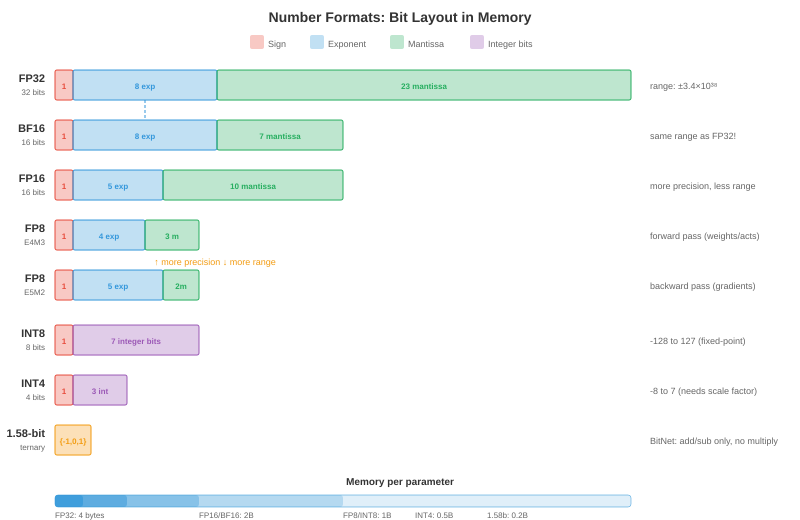

# Квантование

*Квантование снижает точность определения весов и активаций моделей, делая модели меньше, быстрее и дешевле в эксплуатации. В этом файле описаны числовые форматы, квантование после обучения, обучение с учетом квантования, методы только веса (GPTQ, AWQ), квантование активации, смешанная точность и квантование KV-кэша*

- Модель с параметрами 70B в float16 требует 140 ГБ памяти, больше, чем любой отдельный графический процессор. Квантуйте до INT4, и он умещается в 35 ГБ (один A100) или даже 20 ГБ (потребительский RTX 4090 с разгрузкой). Квантование не является тонкостью оптимизации; именно это делает развертывание крупных моделей экономически выгодным.

- Фундаментальный компромисс: более низкая точность означает меньший объем памяти, более высокую пропускную способность и меньшую мощность, но приводит к **ошибкам квантования**, которые могут ухудшить качество модели. Искусство квантования минимизирует эту деградацию.

## Зачем квантизировать

- **Уменьшение памяти**: INT8 в 2 раза меньше, чем FP16, INT4 в 4 раза меньше. Для LLM вес модели доминирует в памяти. Уменьшение точности вдвое снижает требования к памяти.

- **Прирост пропускной способности**: более низкая точность означает больше операций в секунду. Тензорные ядра NVIDIA (глава 16) обеспечивают двукратное увеличение пропускной способности для FP16 по сравнению с FP32, еще раз в 2 раза для INT8 по сравнению с FP16 и еще раз в 2 раза для INT4 по сравнению с INT8. H100 выполняет 989 терафлопс в FP8 против 67 терафлопс в FP32 — разница в 15 раз.

- **Экономия пропускной способности**: вывод LLM обычно **ограничен пропускной способностью памяти** (глава 16, модель линии крыши). Узким местом является загрузка весов из памяти графического процессора, а не вычисления с ними. Меньшие веса означают меньшее количество байтов для передачи, что напрямую увеличивает количество токенов в секунду. Вот почему квантование часто дает почти линейное ускорение вывода LLM.

- **Экономия энергии**: более низкая точность требует меньше энергии на операцию. В масштабе центра обработки данных (тысячи графических процессоров) это приводит к значительному снижению затрат на электроэнергию.

## Числовые форматы

- Мы рассмотрели IEEE 754 с плавающей запятой в главе 13 (компьютерная архитектура). Вот полная картина точности машинного обучения:



| Формат | Биты | Экспонента | Мантисса | Диапазон | Вариант использования |
|--------|------|----------|----------|-------|----------|
| ФП32 | 32 | 8 | 23 | ±3,4×10³⁸ | Обучение (золотой стандарт) |
| ТФ32 | 19 | 8 | 10 | ±3,4×10³⁸ | Обучение Tensor Core (A100+) |
| РП16 | 16 | 5 | 10 | ±65504 | Обучение смешанной точности |
| БФ16 | 16 | 8 | 7 | ±3,4×10³⁸ | Обучение (тот же диапазон, что и FP32) |
| ФП8 Е4М3 | 8 | 4 | 3 | ±448 | Пас вперед (Хоппер+) |
| ФП8 Е5М2 | 8 | 5 | 2 | ±57344 | Градиенты (более широкий диапазон) |
| ИНТ8 | 8 | — | — | от -128 до 127 | Вывод PTQ |
| ИНТ4 | 4 | — | — | от -8 до 7 | Квантование только по весу |
| INT2/троичный | 2 | — | — | {-1, 0, 1} | Экстремальное сжатие |

- **FP8** доступен в двух вариантах: **E4M3** (4-битная экспонента, 3-битная мантисса, более узкий диапазон, но более высокая точность) для прямого прохода и **E5M2** (5-битная экспонента, 2-битная мантисса, более широкий диапазон, но меньшая точность) для градиентов. Transformer Engine (глава 16) переключается между ними автоматически для каждого тензора.

- **BF16 против FP16**: BF16 имеет тот же диапазон экспоненты, что и FP32 (нет риска переполнения), но меньшую точность мантиссы. FP16 имеет большую точность, но узкий диапазон (максимум 65504), что требует масштабирования потерь во время обучения. Для вывода оба работают хорошо; для тренировок BF16 безопаснее.

- **Целочисленные форматы** не имеют показателя степени — они представляют значения с фиксированной точкой. Для преобразования между числами с плавающей запятой и целыми числами вам понадобится **коэффициент масштабирования** и, при необходимости, **нулевая точка**: $x_{\text{float}} = \text{scale} \times (x_{\text{int}} - \text{zero\_point})$.

## Уравнение квантования

- Все методы квантования преобразуют значения с плавающей запятой в целые числа и обратно:

$$x_q = \text{clamp}\left(\text{round}\left(\frac{x}{\text{scale}}\right) + \text{zero\_point}, \; q_{\min}, \; q_{\max}\right)$$

$$\hat{x} = \text{scale} \times (x_q - \text{zero\_point})$$

- **Шкала** определяет разрешение: $\text{scale} = \frac{x_{\max} - x_{\min}}{q_{\max} - q_{\min}}$. Для INT8: $q_{\min} = -128$, $q_{\max} = 127$.

- **Симметричное квантование** устанавливает $\text{zero\_point} = 0$, поэтому $\text{scale} = \frac{\max(|x|)}{127}$. Проще и быстрее (без вычитания нулевой точки во время вывода).

- **Асимметричное квантование** использует ненулевое значение $\text{zero\_point}$ для обработки асимметричных распределений (например, все выходные данные ReLU неотрицательны). Сопоставляет $[x_{\min}, x_{\max}]$ с $[0, 255]$ для беззнакового INT8.

- **Детализация квантования**: сколько значений имеют один и тот же масштабный коэффициент:
    - **По тензору**: один масштаб для всего тензора. Самая простая, но самая низкая точность (один выброс искажает масштаб всего тензора).
    - **Поканально**: один масштаб на выходной канал (для сверток) или на строку (для линейных слоев). Гораздо более высокая точность с минимальными накладными расходами.
    - **На группу**: одна шкала на группу элементов $g$ (например, $g = 128$). Наилучшая точность, используемая в современном квантовании только по весу (GPTQ, AWQ).
    - **За токен**: одна шкала на токен для активации. Учитывает тот факт, что разные токены имеют разную величину активации.

## Квантование после обучения (PTQ)

- **PTQ** квантизирует предварительно обученную модель без какого-либо повторного обучения. Вы передаете **калибровочный набор** (небольшой репрезентативный набор данных, обычно 128–512 образцов) через модель для сбора статистики активации, а затем вычисляете оптимальные коэффициенты масштабирования.

### Методы калибровки

- **Мин-макс**: установка шкалы на основе наблюдаемых минимальных и максимальных значений. Простой, но чувствительный к выбросам (одно экстремальное значение тратит большую часть диапазона квантования на редко используемые значения).

– **Процентиль**: используйте 99,99-й процентиль вместо абсолютного максимума. Обрезает крайние выбросы, обеспечивая лучшее разрешение для большинства значений. Обрезанные значения достигают $q_{\min}$ или $q_{\max}$.

- **MSE-оптимальный**: найдите масштаб, который минимизирует среднеквадратическую ошибку между исходным и квантованным тензорами. Это одномерная оптимизация (поиск возможных значений клиппирования), которая обычно обеспечивает наилучшую точность PTQ.

- **На основе энтропии** (расхождение KL): найдите масштаб, который минимизирует расхождение KL между исходным и квантованным распределениями значений. Используется при калибровке INT8 в TensorRT.

### PTQ на практике

```python
# Simplified PTQ with PyTorch (conceptual)
import torch

def quantise_tensor_symmetric(tensor, bits=8):
    qmax = 2 ** (bits - 1) - 1  # 127 for INT8
    scale = tensor.abs().max() / qmax
    quantised = torch.clamp(torch.round(tensor / scale), -qmax, qmax).to(torch.int8)
    return quantised, scale

def dequantise(quantised, scale):
    return quantised.float() * scale

# Quantise a weight matrix
weight = torch.randn(512, 512)  # pretrained weight
weight_q, scale = quantise_tensor_symmetric(weight, bits=8)
weight_reconstructed = dequantise(weight_q, scale)

# Quantisation error
error = (weight - weight_reconstructed).abs().mean()
print(f"Mean absolute error: {error:.6f}")
print(f"Compression: {weight.numel() * 4 / (weight_q.numel() * 1 + 4):.1f}x")  # +4 bytes for scale
```

- PTQ хорошо работает для INT8 на большинстве моделей с <1% accuracy degradation. For INT4, PTQ quality drops significantly — weight-only methods (below) handle INT4 much better.

## Quantisation-Aware Training (QAT)

- **QAT** inserts fake quantisation operations into the training graph: weights and activations are quantised and dequantised during the forward pass, but gradients flow through as if no quantisation happened (the **straight-through estimator**).

$$\text{Forward: } \hat{W} = \text{dequant}(\text{quant}(W))$$
$$\text{Backward: } \frac{\partial L}{\partial W} \approx \frac{\partial L}{\partial \hat{W}}$$

- The model learns to be robust to quantisation noise during training. QAT typically recovers most or all of the accuracy lost by PTQ, especially at low bit-widths (INT4, INT2).

- **Cost**: QAT requires retraining (or fine-tuning) the model, which is expensive for large models. For a 70B parameter model, QAT might cost $10,000-$100,000 in compute. PTQ costs essentially nothing (just calibration).

- **When to use QAT**: when PTQ quality is unacceptable (usually INT4 or lower), when you are deploying to edge devices with strict latency budgets, or when the model will be quantised millions of times (the one-time QAT cost is amortised).

## Weight-Only Quantisation

- For LLM inference, the bottleneck is loading weights from memory, not computing with them (memory-bandwidth-bound regime). **Weight-only quantisation** quantises weights to INT4 or INT3 while keeping activations in FP16. The compute happens in FP16 (after dequantising the weights on the fly), but memory consumption and bandwidth are reduced by 4-8x.

### GPTQ

- **GPTQ** (Frantar et al., 2022) quantises weights one column at a time, compensating for the error of each column by adjusting subsequent columns. It uses the **Hessian** (second-order information from a calibration set) to determine the optimal quantisation order and error compensation:

$$\hat{W}_{:,j} = \text{quant}(W_{:,j}), \quad W_{:,j+1:} \mathrel{-}= \frac{(\hat{W}_{:,j} - W_{:,j}) \cdot H_{j,j+1:}}{H_{j,j}}$$

- The key insight: quantising column $j$ introduces an error. GPTQ immediately compensates by adjusting all remaining columns so that the overall output of the layer ($XW$) changes as little as possible. This is **optimal brain quantisation** (OBQ) applied to transformers.

- GPTQ with 4-bit group quantisation (group size 128) achieves <1% perplexity degradation on most LLMs. The quantisation takes ~1 hour per 70B model on a single GPU.

### AWQ

- **AWQ** (Activation-Aware Weight Quantisation, Lin et al., 2023) observes that a small fraction of weight channels (1-3%) are far more important than others — they correspond to activation channels with large magnitudes. Protecting these salient channels dramatically reduces quantisation error.

- AWQ scales these important channels by a factor $s$ before quantisation (making them larger and thus less affected by rounding) and scales the corresponding activations by $1/s$ (to preserve the output). The scale $s$ is optimised per-group to minimise the overall quantisation error.

- AWQ is simpler than GPTQ (no Hessian computation), faster to run, and achieves comparable quality. It has become the default for many open-source LLM quantisation pipelines.

### GGUF / llama.cpp Quantisation

- **GGUF** (GGML Universal Format) is the format used by llama.cpp for CPU inference. It supports many quantisation schemes:
    - **Q4_0**: 4-bit, 32-element blocks, symmetric.
    - **Q4_K_M**: 4-bit with mixed-precision important channels (k-quants).
    - **Q5_K_M**: 5-bit with k-quants (higher quality).
    - **Q8_0**: 8-bit, simple and fast.

- The "K" variants (k-quants) allocate more bits to important weight blocks, similar to AWQ's insight but implemented at the format level. Q4_K_M is the sweet spot for most models: 4-bit average with minimal quality loss.

### QuIP and QuIP#

- **QuIP** (Chee et al., 2023) introduces **incoherence processing**: rotate the weight matrix using a random orthogonal transformation before quantisation. This spreads the information across all weights, preventing a few outlier weights from dominating the quantisation error.

- The intuition: if one weight is 100 and the rest are ~1, quantising all with the same scale wastes most of the INT4 range on the outlier. After an orthogonal rotation (which preserves the matrix's mathematical properties), all weights have similar magnitude, and uniform quantisation works much better.

- **QuIP#** extends this with **lattice codebooks**: instead of mapping to a uniform integer grid, map to points in an optimal lattice (the E8 lattice in 8D). Lattice codes pack more quantisation points into the same number of bits, achieving better rate-distortion than uniform quantisation. QuIP# achieves usable quality at **2-bit** precision — half the bits of typical INT4 methods.

### SpQR

- **SpQR** (Dettmers et al., 2023) observes that a tiny fraction of weights (0.1-1%) are **outliers** that contribute disproportionately to output quality. Instead of quantising everything to the same precision, SpQR:

    1. Identifies outlier weights using sensitivity analysis (how much does quantising this weight change the layer output?).
    2. Stores outliers at **full precision** (FP16) in a sparse format.
    3. Quantises all remaining weights to INT3 or INT4.

- The result: ~99% of weights are aggressively quantised (small), while the critical 1% retain full precision (accurate). The sparse outlier storage adds minimal overhead (<5% of total size).

### HQQ

- **HQQ** (Half-Quadratic Quantisation, Badri & Shaji, 2023) is a **zero-shot** weight quantisation method that requires no calibration data at all. It formulates quantisation as a half-quadratic optimisation problem, solving for optimal quantised weights and scale factors iteratively.

- The advantage: no calibration set means no data dependency, instant quantisation, and no risk of calibration data mismatch. HQQ is particularly useful for models where representative calibration data is unavailable or sensitive.

### AQLM

- **AQLM** (Egiazarian et al., 2024) applies **additive quantisation** (multi-codebook vector quantisation) to LLMs. Instead of quantising each weight independently, AQLM groups weights into vectors and represents each vector as the sum of entries from multiple learned codebooks:

$$\mathbf{w} \approx \mathbf{c}_1^{(1)} + \mathbf{c}_2^{(2)} + \cdots + \mathbf{c}_M^{(M)}$$

- where $\mathbf{c}_i^{(m)}$ is an entry from codebook $m$. With $M = 2$ codebooks of 256 entries each, a 8-element vector is encoded as two 8-bit indices = 2 bytes for 8 weights = **2 bits per weight** effective. AQLM achieves state-of-the-art quality at 2-bit precision, outperforming GPTQ and AWQ at this extreme compression level.

### BitNet and 1-Bit LLMs

- **BitNet** (Wang et al., 2023) takes quantisation to the extreme: weights are ternary ($\{-1, 0, +1\}$), requiring only ~1.58 bits per weight. Matrix multiplication becomes **addition and subtraction only** — no floating-point multiplies needed.

- **BitNet b1.58** (Ma et al., 2024) constrains every weight to $\{-1, 0, +1\}$. The "1.58 bits" comes from $\log_2(3) \approx 1.58$. At this precision, a 70B model fits in ~15 GB and inference requires no multiply operations — just adds, subtracts, and sign flips.

- The matmul becomes:

$$y_j = \sum_i W_{ij} \cdot x_i = \sum_{i: W_{ij}=+1} x_i - \sum_{i: W_{ij}=-1} x_i$$

- This is dramatically cheaper than FP16 matmul on any hardware, and could enable LLM inference on devices without floating-point units. The quality tradeoff is significant for current models but improves with scale and training-time quantisation-awareness.

### Microscaling (MX) Formats

- **Microscaling** (MX) formats are a new industry standard (supported by AMD, Arm, Intel, Meta, Microsoft, NVIDIA, Qualcomm) that use **block floating point**: a group of elements shares a single exponent, and each element has its own mantissa.

| Format | Shared Exponent | Element Bits | Total (per element) | Equivalent |
|--------|----------------|-------------|--------------------|----|
| MXFP8 | 8-bit per block | 8 (E4M3/E5M2) | ~8 | Like FP8 with better range |
| MXFP6 | 8-bit per block | 6 | ~6.5 | Between FP8 and INT4 |
| MXFP4 | 8-bit per block | 4 | ~4.5 | Like INT4 with float-like behaviour |
| MXINT8 | 8-bit per block | 8 (integer) | ~8.5 | INT8 with shared scaling |

- The shared exponent amortises the exponent cost across a block (typically 16-32 elements). Each element retains more mantissa bits than it would with an individual exponent, giving better precision per bit. MX formats are expected to replace individual FP8 and INT8 formats in future hardware.

### FP8 Training

- Training in FP8 (not just inference) is now practical on NVIDIA Hopper and Blackwell GPUs. The recipe:

    - **Forward pass**: weights and activations in E4M3 (higher precision, narrower range). The Transformer Engine dynamically computes per-tensor scale factors using delayed scaling (track statistics from the previous iteration, apply them to the current one).

    - **Backward pass**: gradients in E5M2 (wider range, lower precision). Gradients have a broader value range than weights/activations, so the extra exponent bit prevents overflow.

    - **Master weights**: maintained in FP32 for the optimiser state (like standard mixed-precision training with FP16, chapter 6). The FP8 computation is only for the matmuls, not for the weight updates.

    - **Loss scaling**: still needed for FP8, just as for FP16. The dynamic loss scaler adjusts the scale factor to keep gradient values within FP8's representable range.

- FP8 training achieves quality comparable to BF16 training for most model sizes, with ~2x throughput improvement. It is the default for new large-scale training runs on H100 clusters.

## Activation Quantisation

- Activations (the intermediate tensors flowing between layers) can also be quantised, enabling fully INT8 computation (both weights and activations in INT8, with INT32 accumulation).

- **Dynamic quantisation**: compute the scale factor at runtime from the actual activation values. More accurate (adapts to each input) but adds overhead (computing min/max or percentile at each layer).

- **Static quantisation**: compute scale factors once during calibration and fix them. Faster at inference (no runtime statistics) but less accurate if the calibration data is not representative.

- **Per-token quantisation**: compute a separate scale for each token in a sequence. Critical for LLMs because different tokens can have very different activation magnitudes (some tokens produce activations 100x larger than others).

- Activation quantisation is harder than weight quantisation because activations are data-dependent (they change with every input), while weights are fixed. The "outlier" problem is especially severe: a few activation channels have extreme values (100x the mean), and quantising them with the same scale as normal channels wastes precision.

- **SmoothQuant** (Xiao et al., 2022) addresses outliers by mathematically migrating the quantisation difficulty from activations (hard to quantise due to outliers) to weights (easy to quantise): multiply activations by $1/s$ and weights by $s$, where $s$ balances the difficulty. The output $XW = (X \cdot \text{diag}(s^{-1})) \cdot (\text{diag}(s) \cdot W)$ is unchanged.

## Mixed-Precision Quantisation

- Not all layers are equally sensitive to quantisation. Attention layers often tolerate INT4, while embedding layers and the final classifier need higher precision.

- **Sensitivity analysis**: quantise each layer individually and measure the accuracy impact. Layers with high sensitivity get more bits; insensitive layers get fewer bits.

- The Transformer Engine (chapter 16, NVIDIA Hopper) implements dynamic mixed precision at the operation level: each matmul chooses between FP8 and FP16 based on the tensor statistics, maximising throughput while maintaining quality.

## KV-Cache Quantisation

- During LLM generation, the **KV-cache** stores the key and value tensors for all previous tokens. For long sequences, this dominates memory:

$$\text{KV-cache size} = 2 \times n_{\text{layers}} \times n_{\text{heads}} \times d_{\text{head}} \times \text{seq\_len} \times \text{bytes\_per\_element}$$

- A 70B model with 80 layers, 64 heads, 128-dim heads, at sequence length 128K in FP16: $2 \times 80 \times 64 \times 128 \times 131072 \times 2 = 330$ GB. This exceeds the GPU memory.

- **KV-cache quantisation** reduces this by storing cached keys and values in INT8 or INT4 instead of FP16. The quantisation error accumulates over the sequence (each new token attends to all cached K/V), but with per-channel or per-head quantisation, the degradation is acceptable.

- **KV-cache quantisation is multiplicatively beneficial**: it enables longer sequences (more context), larger batch sizes (more concurrent users), and faster inference (less memory bandwidth to load the cache). This is one of the highest-impact optimisations for LLM serving.

## Coding Tasks (use CoLab or notebook)

1. Implement symmetric INT8 quantisation from scratch. Quantise a weight matrix, dequantise it, and measure the reconstruction error as a function of the value distribution.
```python
import jax.numpy as jnp
import jax

def quantise_int8(tensor):
    scale = jnp.max(jnp.abs(tensor)) / 127.0
    quantised = jnp.clip(jnp.round(tensor / scale), -127, 127).astype(jnp.int8)
    return quantised, scale

def dequantise(quantised, scale):
    return quantised.astype(jnp.float32) * scale

# Normal weights (typical for trained models)
key = jax.random.PRNGKey(0)
weights = jax.random.normal(key, (1024, 1024)) * 0.02

q, s = quantise_int8(weights)
recon = dequantise(q, s)

print(f"Original:     {weights.nbytes / 1024:.0f} KB")
print(f"Quantised:    {q.nbytes / 1024:.0f} KB ({weights.nbytes / q.nbytes:.0f}x smaller)")
print(f"Mean abs err: {jnp.abs(weights - recon).mean():.6f}")
print(f"Max abs err:  {jnp.abs(weights - recon).max():.6f}")
print(f"Relative err: {jnp.abs(weights - recon).mean() / jnp.abs(weights).mean():.4%}")
```

2. Demonstrate the outlier problem. Create activations with a few extreme channels and show how per-tensor quantisation fails while per-channel succeeds.
```python
import jax.numpy as jnp
import jax

key = jax.random.PRNGKey(42)

# Activations: most channels are normal, 2 channels have 100x outliers
activations = jax.random.normal(key, (32, 512)) * 0.1
activations = activations.at[:, 0].set(activations[:, 0] * 100)   # outlier channel
activations = activations.at[:, 1].set(activations[:, 1] * 50)    # outlier channel

# Per-tensor quantisation (one scale for entire tensor)
scale_tensor = jnp.max(jnp.abs(activations)) / 127.0
q_tensor = jnp.clip(jnp.round(activations / scale_tensor), -127, 127)
recon_tensor = q_tensor * scale_tensor

# Per-channel quantisation (one scale per channel)
scales_channel = jnp.max(jnp.abs(activations), axis=0) / 127.0
q_channel = jnp.clip(jnp.round(activations / scales_channel), -127, 127)
recon_channel = q_channel * scales_channel

err_tensor = jnp.abs(activations - recon_tensor).mean()
err_channel = jnp.abs(activations - recon_channel).mean()

print(f"Per-tensor error: {err_tensor:.6f}")
print(f"Per-channel error: {err_channel:.6f}")
print(f"Per-channel is {err_tensor / err_channel:.1f}x better")
print(f"\nOutlier channels waste {(activations.shape[1] - 2) / activations.shape[1]:.0%} "
      f"of the quantisation range for {2 / activations.shape[1]:.1%} of channels")
```

3. Compute the KV-cache memory for different model sizes and sequence lengths. Show why KV-cache quantisation is essential for long-context models.
```python
def kv_cache_gb(n_layers, n_heads, d_head, seq_len, bytes_per_elem):
    return 2 * n_layers * n_heads * d_head * seq_len * bytes_per_elem / 1e9

models = [
    ("Llama-7B",  32, 32, 128),
    ("Llama-70B", 80, 64, 128),
    ("GPT-4 (est)", 120, 96, 128),
]

print(f"{'Model':<15} {'SeqLen':>8} {'FP16 (ГБ)':>10} {'INT8 (ГБ)':>10} {'INT4 (ГБ)':>10}")
печать("-" * 60)

для имени, слоев, голов, d_head в моделях:
    для seq_len в [4096, 32768, 131072]:
        fp16 = kv_cache_gb (слои, головы, d_head, seq_len, 2)
        int8 = kv_cache_gb(слои, головы, d_head, seq_len, 1)
        int4 = kv_cache_gb(слои, головы, d_head, seq_len, 0,5)
        print(f"{name:<15} {seq_len:>8} {fp16:>9.1f} {int8:>9.1f} {int4:>9.1f}")
    печать()
```