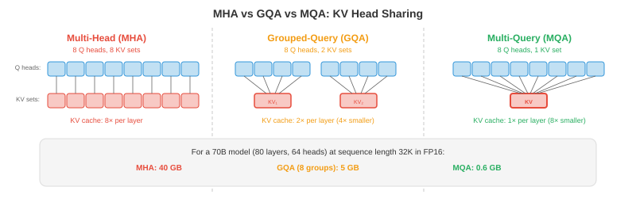

# Эффективные архитектуры

*Ускорение моделей связано не только с меньшей точностью, но и с более умной архитектурой, которая выполняет меньше работы на один токен. Этот файл охватывает StreamingLLM, разреженное и линейное внимание, внимание с несколькими и сгруппированными запросами, смесь экспертов в умозаключениях, дистилляцию знаний, обрезку и поиск нейронной архитектуры *

- Квантование (файл 1) удешевляет каждую операцию. Во-первых, этот файл позволяет выполнять меньше операций. Они дополняют друг друга: модель, которая одновременно эффективна с точки зрения архитектуры и квантована, может быть в 10–100 раз быстрее оригинала.

## StreamingLLM: генерация бесконечной длины

- Стандартные преобразователи хранят все предыдущие токены в KV-кеше, который растет линейно с длиной последовательности. В какой-то момент кэш превышает объем памяти графического процессора, и генерация завершается сбоем. **StreamingLLM** (Xiao et al., 2023) решает эту проблему с помощью **скользящего KV-кэша** фиксированного размера.

- Ключевое наблюдение: первые несколько токенов в последовательности получают непропорционально высокие оценки внимания независимо от их содержания. Это так называемые **поглотители внимания**. Если их выселить из кэша, распределение внимания рухнет и качество генерации катастрофически ухудшится.

- Решение StreamingLLM: постоянно храните небольшое количество **приемных токенов** (первые 1–4 токена) в кеше, а также **скользящее окно** самых последних токенов $w$. Общий размер кэша равен $\text{sink} + w$ и является фиксированным независимо от того, сколько токенов было сгенерировано.

$$\text{Cache} = [\text{token}_0, \text{token}_1, \text{token}_{t-w+1}, \ldots, \text{token}_t]$$

- Приемники внимания закрепляют распределение softmax, а скользящее окно обеспечивает недавний контекст. Это обеспечивает **генерацию бесконечной длины** с постоянной памятью за счет потери доступа к контексту середины последовательности.

- StreamingLLM работает без какой-либо переподготовки для моделей, которые естественным образом привлекают внимание (большинство предварительно обученных LLM так и делают). Для моделей, которые этого не делают, добавление одного обучаемого токена приемника во время обучения исправляет проблему.

## Редкое внимание

- Полное самообслуживание — это $O(n^2)$ с длиной последовательности $n$, поскольку каждый токен обслуживает каждый другой токен. Для $n = 128K$ матрица внимания содержит $128K^2 = 16$ миллиардов записей. Шаблоны **разреженного внимания** уменьшают эту проблему, ограничивая то, какие токены к каким относятся.


- **Внимание к скользящему окну** (Mistral, Gemma): каждый токен учитывает только предыдущие токены $w$ (например, $w = 4096$). Внимание: $O(n \cdot w)$ вместо $O(n^2)$. Информация распространяется за пределы окна через несколько слоев: после слоев $L$ эффективным контекстом является $L \times w$.

- **Локальное + глобальное внимание** (Longformer, BigBird): большинство токенов используют внимание скользящего окна (локальное), но несколько назначенных токенов (например, [CLS], каждый 512-й токен) обслуживают все токены (глобальные). Это фиксирует как локальные закономерности, так и долгосрочные зависимости.

- **Расширенное внимание**: обращайте внимание на каждый $k$-й токен в окне, создавая разреженный шаблон, охватывающий больший диапазон с тем же количеством оценок внимания. Увеличение расширения слоев создает иерархическую структуру, похожую на расширенные извилины (глава 8).

- Практическим преимуществом современных LLM является **скользящее окно + чередование полного внимания**: некоторые слои используют скользящее окно (дешево, обрабатывают локальный контекст), некоторые слои используют полное внимание (дорого, захватывают на большом расстоянии). Мистраль/Микстраль используют эту схему.

## Линейное внимание и модели в пространстве состояний

- Можем ли мы полностью заменить внимание $O(n^2)$? **Линейное внимание** и **модели в пространстве состояний (SSM)** обрабатывают последовательности за время $O(n)$, избегая явной матрицы внимания.

- **Линейное внимание** заменяет внимание softmax приближением ядра:

$$\text{Standard: } O = \text{softmax}(QK^T / \sqrt{d}) V$$
$$\text{Linear: } O = \phi(Q) (\phi(K)^T V)$$

- Если сначала связать продукт $K^T V$ (то есть $d \times d$, независимо от длины последовательности), вычисление становится $O(n \cdot d^2)$ вместо $O(n^2 \cdot d)$. Для длинных последовательностей, где $n \gg d$, это существенная экономия.- **RWKV** сочетает в себе идеи RNN и преобразователей. Он использует рекуррентную формулировку, которая обрабатывает токены последовательно (как RNN), но может быть распараллелена во время обучения (как преобразователь). Вывод — $O(1)$ на токен (постоянная память, отсутствие роста KV-кэша).

- **Мамба** (Гу и Дао, 2023) — это селективная модель в пространстве состояний. Он обрабатывает последовательности посредством изученных переходов состояний:

$$h_t = \bar{A} h_{t-1} + \bar{B} x_t, \quad y_t = C h_t$$

- где $\bar{A}$ и $\bar{B}$ зависят от ввода (выборочно), что позволяет Mamba динамически фокусироваться на частях ввода или игнорировать их. В отличие от фиксированных SSM, избирательность делает Mamba конкурентоспособной с преобразователями в языковых задачах, сохраняя при этом масштабирование $O(n)$.

- **Компромисс**: линейное внимание и SSM работают быстрее для длинных последовательностей, но, как правило, менее эффективны, чем полное внимание, для задач, требующих точного извлечения информации на большие расстояния. Гибридные архитектуры (некоторые уровни преобразователя + некоторые уровни Mamba) часто сочетают в себе лучшее из обоих миров.

## Внимание к множественным и групповым запросам

- Стандартное внимание с несколькими головами (MHA, глава 7) использует отдельные проекции $K$, $V$ для каждой головы. Для головок $h$ это означает $h$ отдельные тензоры ключей и значений в KV-кеше. **Внимание к множественным запросам (MQA)** и **Внимание к групповым запросам (GQA)** уменьшают эту проблему.

- **MQA** (Shazeer, 2019): все головы имеют один набор проекций $K, V$. У каждой головы по-прежнему есть своя проекция $Q$. KV-кэш уменьшается в раз $h$ (например, в 32 раза для 32 головок).

- **GQA** (Ainslie et al., 2023): золотая середина. Головы сгруппированы, и каждая группа имеет один набор проекций $K, V$. При использовании головок $h = 32$ и групп $g = 8$ каждая группа из 4 головок имеет общий K/V. KV-кэш уменьшается на $h/g = 4$x.

$$\text{MHA: } h \text{ heads, } h \text{ K/V sets} \quad \to \quad \text{GQA: } h \text{ heads, } g \text{ K/V sets} \quad \to \quad \text{MQA: } h \text{ heads, } 1 \text{ K/V set}$$



- Большинство современных LLM используют GQA (Ллама 2/3, Джемма, Мистраль). Это уменьшает память KV-кэша и задержку вывода с незначительной потерей качества по сравнению с MHA.

### Многоголовое скрытое внимание (MLA)

- **MLA** (DeepSeek-V2, 2024 г.) идет дальше GQA, сжимая KV-кэш в **скрытое пространство низкого ранга**. Вместо кэширования полных векторов ключей и значений MLA кэширует сжатый скрытый вектор $\mathbf{c}_t$ для каждого токена и восстанавливает K/V на лету во время внимания:

$$\mathbf{c}_t = W_{\text{compress}} \cdot [\mathbf{k}_t; \mathbf{v}_t], \quad \mathbf{k}_t = W_K^{\text{up}} \cdot \mathbf{c}_t, \quad \mathbf{v}_t = W_V^{\text{up}} \cdot \mathbf{c}_t$$

- Сжатый вектор $\mathbf{c}_t$ намного меньше исходных K и V вместе взятых. DeepSeek-V2 обеспечивает сокращение размера KV-кэша на **93,3%** по сравнению с MHA, превосходя даже MQA, сохраняя при этом качество на уровне MHA.

- Компромисс: восстановление K/V из скрытого добавляет небольшие вычислительные затраты на операцию внимания. Но поскольку декодирование LLM привязано к пропускной способности памяти (а не к вычислениям), это чистый выигрыш: меньше памяти для загрузки > немного больше вычислений на токен.

### Вспышка внимания

- **Мгновенное внимание** (Дао и др., 2022, подробно описано в главе 16, файл 05) — это не архитектурное изменение, а оптимизация реализации, которая принадлежит к любому обсуждению эффективного внимания. Он рассчитывает точное стандартное внимание с помощью:

    - **O(n) память** вместо O(n²) (матрица внимания никогда не материализуется в HBM).
    - **2–4 раза быстрее**, чем стандартное внимание (за счет хранения данных в SRAM с помощью тайлинга и онлайн-softmax).
    - **Без потери качества** — результат математически идентичен стандартному вниманию.

- Flash Attention теперь является реализацией внимания по умолчанию в PyTorch (`torch.nn.functional.scaled_dot_product_attention`), JAX и всех основных платформах вывода. Если вы используете внимание в 2024+, вы почти наверняка используете Flash Attention.

### Внимание!

- **Ring Attention** (Лю и др., 2023) распределяет вычисления внимания между несколькими устройствами для последовательностей, которые слишком длинны для размещения в памяти одного графического процессора, даже с Flash Attention.- Идея: распределить последовательность по устройствам $N$. Каждое устройство содержит токены $n/N$ Q, K, V. Устройства расположены в виде кольца. На каждом этапе:
    1. Каждое устройство вычисляет локальное внимание (его Q относительно своего локального K/V).
    2. Каждое устройство отправляет свой блок K/V следующему устройству в кольце.
    3. Каждое устройство получает K/V от предыдущего устройства и рассчитывает внимание на их основе.
    4. После шагов $N$ каждое устройство обработало каждый блок K/V.

- Коммуникация **перекрывается** с вычислениями: пока внимание уделяется текущему блоку K/V, передается следующий блок. Это почти полностью скрывает задержку связи.

- Ring Attention включает **контекстные окна с миллионами токенов** путем распределения KV-кэша по кольцу графических процессоров. Объем памяти на устройство составляет O(n/N), что делает возможным создание последовательностей произвольной длины (ограниченных только количеством устройств).

## Смесь экспертов по выводам

- Модели MoE (глава 7) активируют только часть своих параметров на токен (обычно 2 из 8 экспертов). Таким образом, уникальной проблемой является **кэширование экспертов**: все эксперты должны находиться в памяти (поскольку любой токен может быть направлен к любому эксперту), но на каждый токен активны только два эксперта.

- Для модели Mixtral 8x7B: общие параметры = 47B (эксперты 8 × 7B, но с общими компонентами). Активных параметров на один токен ≈ 13B (2 эксперта + общие слои). Модель имеет качество класса LLM-70B со стоимостью вывода класса LLM-13B, но требует 47B параметров в памяти.

- **Разгрузка экспертов**: при развертывании с ограничением памяти графического процессора оставляйте неактивных экспертов на ЦП или SSD и загружайте их по требованию. Это работает, поскольку маршрутизация токенов достаточно предсказуема, чтобы заранее выбрать вероятных экспертов.

- **Экспертное кэширование**: сохранение LRU-кэша недавно использованных экспертов в памяти графического процессора. Если одни и те же эксперты активируются неоднократно (обычно для данных внутри домена), вероятность попадания в кэш высока.

## Дистилляция знаний

- **Дистиллация** (глава 6) обучает маленькую модель «ученика» имитировать большого «учителя». Учащийся учится на мягких прогнозах учителя (распределения вероятностей по классам), которые содержат больше информации, чем одни лишь жесткие ярлыки.

$$\mathcal{L} = \alpha \cdot \text{KL}(p_{\text{teacher}}^{T} \| p_{\text{student}}^{T}) + (1 - \alpha) \cdot \mathcal{L}_{\text{CE}}(y, p_{\text{student}})$$

- где $T$ - температура (более высокое значение $T$ смягчает распределения, раскрывая неуверенность учителя), а $\alpha$ уравновешивает потери при перегонке со стандартной кросс-энтропийной потерей.

- **Для LLM**: дистилляция используется для создания маленьких и быстрых моделей из больших и эффективных. GPT-4 → учащийся 7B, который фиксирует большую часть поведения GPT-4 для конкретной задачи. Обслуживание студента может стоить в 10-100 раз дешевле.

- **Дистилляция для конкретной задачи**: анализируйте только данные, относящиеся к вашей задаче развертывания. Модель 7B, основанная на медицинских вопросах и ответах учителя 70B, может превзойти модель 70B при решении этой конкретной задачи (поскольку ограниченные способности ученика полностью сосредоточены на целевой области).

## Обрезка

- **Сокращение** удаляет ненужные веса (устанавливая их на ноль), уменьшая размер модели и объем вычислений.

- **Неструктурированное сокращение** (на основе величины): удаление отдельных весов с наименьшими абсолютными значениями. Это создает разреженную матрицу весов. Просто и эффективно для сжатия, но современное оборудование (графические процессоры) не может эффективно ускорять разреженные операции, если разреженность не соответствует определенным шаблонам.

- **Структурированная обрезка**: удаление целых единиц — головок внимания, нейронов MLP или слоев. В результате получается модель меньшей плотности, которую легко ускорить на стандартном оборудовании. Компромиссом является более грубая степень детализации (удаление полной головки может удалить вместе полезные и бесполезные веса).

- **Разреженность 2:4** (NVIDIA Ampere+): аппаратно поддерживаемый шаблон разреженности, при котором 2 из каждых 4 весов равны нулю. Редкие тензорные ядра графического процессора пропускают нулевое умножение, обеспечивая ускорение примерно в 2 раза. На сегодняшний день это единственный шаблон разреженности с практическим аппаратным ускорением.- **Гипотеза о лотерейном билете** (Франкл и Карлин, 2019): внутри случайно инициализированной сети существует подсеть («выигрышный билет»), которую можно обучать изолированно, чтобы она соответствовала производительности всей сети. Поиск этих подсетей (путем обучения, сокращения и перемотки) обходится дорого, но это понимание мотивирует исследования по сокращению.

## Поиск нейронной архитектуры (NAS)

- **NAS** автоматизирует проектирование архитектуры путем поиска среди возможных архитектур, чтобы найти ту, которая обеспечивает максимальную точность с учетом аппаратных ограничений (задержка, память, мощность).

- **EfficientNet** (глава 8) был найден NAS: правило составного масштабирования (глубина баланса, ширина, разрешение) возникло в результате поиска, а не из человеческой интуиции.

- Для повышения эффективности вывода NAS может находить архитектуры, оптимизированные для конкретных аппаратных целей: «найдите модель с точностью <5ms latency on an iPhone Neural Engine and >80% в ImageNet». Пространство поиска включает в себя типы слоев, ширину, функции активации и шаблоны внимания.

- **Единичные сети** обучают одну сверхпараметризованную сеть и извлекают подсети для различных целей развертывания. За один обучающий прогон создаются модели для облачных графических процессоров, мобильных графических процессоров и ЦП, каждая из которых оптимизирована для своей цели.

## Задачи по кодированию (используйте CoLab или блокнот)

1. Внедрите скользящее окно внимания и сравните использование памяти с полным вниманием.
```python
import jax
import jax.numpy as jnp

def full_attention(Q, K, V):
    """Standard O(n^2) attention."""
    scores = Q @ K.T / jnp.sqrt(Q.shape[-1])
    weights = jax.nn.softmax(scores, axis=-1)
    return weights @ V

def sliding_window_attention(Q, K, V, window_size=128):
    """Sliding window attention: each token attends to window_size previous tokens."""
    n = Q.shape[0]
    d = Q.shape[-1]
    output = jnp.zeros_like(Q)

    for i in range(n):
        start = max(0, i - window_size + 1)
        k_window = K[start:i+1]
        v_window = V[start:i+1]
        scores = Q[i] @ k_window.T / jnp.sqrt(d)
        weights = jax.nn.softmax(scores)
        output = output.at[i].set(weights @ v_window)

    return output

n, d = 512, 64
key = jax.random.PRNGKey(0)
Q = jax.random.normal(key, (n, d))
K = jax.random.normal(jax.random.PRNGKey(1), (n, d))
V = jax.random.normal(jax.random.PRNGKey(2), (n, d))

print(f"Full attention memory:    O(n^2) = {n*n} entries")
print(f"Window (w=128) memory:   O(n*w) = {n*128} entries")
print(f"Reduction: {n*n / (n*128):.1f}x")
```

2. Сравните размер KV-кеша для MHA, GQA и MQA. Покажите, почему GQA — это оптимальное решение с практической точки зрения.
```python
def kv_cache_size(n_heads, n_kv_heads, d_head, seq_len, bytes=2):
    """KV-cache size in MB."""
    return 2 * n_kv_heads * d_head * seq_len * bytes / 1e6

n_heads = 32
d_head = 128
seq_len = 32768

mha = kv_cache_size(n_heads, n_heads, d_head, seq_len)       # 32 KV heads
gqa = kv_cache_size(n_heads, 8, d_head, seq_len)              # 8 KV heads
mqa = kv_cache_size(n_heads, 1, d_head, seq_len)              # 1 KV head

print(f"MHA (32 KV heads): {mha:.0f} MB per layer")
print(f"GQA (8 KV heads):  {gqa:.0f} MB per layer ({mha/gqa:.0f}x smaller)")
print(f"MQA (1 KV head):   {mqa:.0f} MB per layer ({mha/mqa:.0f}x smaller)")
```

3. Имитируйте структурированное сокращение, удаляя наименее важные головы внимания из случайного слоя внимания и измеряя изменение выходных данных.
```python
import jax
import jax.numpy as jnp

key = jax.random.PRNGKey(0)
n_heads, seq_len, d_head = 8, 64, 32

# Random multi-head attention output (one per head)
head_outputs = jax.random.normal(key, (n_heads, seq_len, d_head))

# Full output: concatenate all heads
full_output = head_outputs.reshape(seq_len, n_heads * d_head)

# Importance: measure each head's contribution by its norm
head_norms = jnp.linalg.norm(head_outputs, axis=(1, 2))
print("Head importance (by norm):", jnp.round(head_norms, 2))

# Prune least important heads
for n_keep in [8, 6, 4, 2]:
    top_heads = jnp.argsort(head_norms)[-n_keep:]
    pruned = head_outputs[top_heads].reshape(seq_len, n_keep * d_head)

    # Pad to original size for comparison (zero out pruned heads)
    full_pruned = jnp.zeros_like(head_outputs)
    full_pruned = full_pruned.at[top_heads].set(head_outputs[top_heads])
    full_pruned = full_pruned.reshape(seq_len, n_heads * d_head)

    error = jnp.linalg.norm(full_output - full_pruned) / jnp.linalg.norm(full_output)
    print(f"Keep {n_keep}/{n_heads} heads: relative error = {error:.4f}, "
          f"memory = {n_keep/n_heads:.0%}")
```