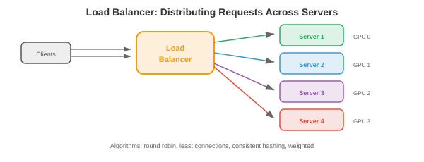

# Основы проектирования систем

*Проектирование систем — это способ создания программного обеспечения, которое надежно работает в любом масштабе. Этот файл описывает архитектуру клиент-сервер, сетевые протоколы, DNS, прокси-серверы, балансировку нагрузки, кэширование, базы данных, очереди сообщений, модели согласованности и шаблоны устойчивости*.

— Каждая система ML в производстве — это распределенная система. Механизм рекомендаций — это не просто модель — это сервер API, хранилище функций, реестр моделей, уровень кэширования, очередь сообщений и стек мониторинга, которые обмениваются данными по сети. Понимание системного проектирования — это то, что отличает «Я обучил модель» от «Я создал продукт».

- Собеседования по проектированию систем в ведущих технологических компаниях (Google, Meta, Amazon, OpenAI) проверяют, можете ли вы проектировать эти системы. В этой главе представлены строительные блоки (этот файл), облачная инфраструктура (файл 02), шаблоны масштабирования (файл 03), дизайн, ориентированный на машинное обучение (файл 04), и рабочие примеры (файл 05).

## Архитектура клиент-сервер

- Фундаментальная закономерность: **клиент** отправляет запрос, **сервер** обрабатывает его и возвращает ответ. Ваш браузер (клиент) отправляет HTTP-запрос на google.com (сервер), который возвращает HTML.

- **Модель запрос-ответ**: синхронная. Клиент ждет ответа. Просто, но создает узкое место: клиент простаивает во время ожидания, и сервер должен обработать запрос, прежде чем двигаться дальше.

- **Серверы без сохранения состояния**: сервер не запоминает предыдущие запросы. Каждый запрос содержит всю информацию, необходимую для его обработки. Это упрощает масштабирование: любой сервер может обрабатывать любой запрос, поэтому вы можете добавить больше серверов за балансировщиком нагрузки.

- **Серверы с отслеживанием состояния**: сервер поддерживает состояние между запросами (например, сеансом пользователя). Сложнее масштабировать, поскольку запросы от одного и того же пользователя должны отправляться на один и тот же сервер (привязка сеансов). Современные системы избегают состояния на стороне сервера, сохраняя его в базе данных или кеше (Redis).

## Сетевые протоколы

- Мы рассмотрели работу сети в главе 13 (уровни TCP/IP, сокеты). Здесь мы сосредоточимся на протоколах уровня приложения, используемых при проектировании систем:

- **HTTP/HTTPS**: протокол Интернета и большинство API. Методы запроса: GET (чтение), POST (создание/прогнозирование), PUT (обновление), DELETE (удаление). HTTPS добавляет шифрование TLS (глава 13 безопасности). API REST (глава 15, файл 03) построены на основе HTTP.

- **WebSockets**: постоянное двунаправленное соединение между клиентом и сервером. В отличие от HTTP (запрос → ответ → соединение закрывается), WebSocket сохраняет соединение открытым для потоковой передачи в реальном времени. Используется для: потоковой передачи токенов LLM (отправка токенов по мере их создания), интерактивных информационных панелей, приложений чата.

- **gRPC**: платформа Google RPC. Использует буферы протокола (двоичная сериализация, примерно в 10 раз меньше и быстрее, чем JSON) через HTTP/2. Поддерживает потоковую передачу (на стороне сервера, на стороне клиента, двунаправленную). Используется для внутренней связи между службами, где важна производительность. Сервер вывода Triton (глава 15) и обслуживание TensorFlow используют gRPC.

- **Буферы протокола**: определяют схемы сообщений в файлах `.proto`:

```protobuf
message PredictRequest {
    repeated float features = 1;
    string model_version = 2;
}

message PredictResponse {
    float prediction = 1;
    float confidence = 2;
}

service ModelService {
    rpc Predict(PredictRequest) returns (PredictResponse);
}
```

- Схема компилируется в клиентский и серверный код на любом языке (Python, C++, Go, Java). Безопасность типов, обратная совместимость и производительность предоставляются бесплатно.

## DNS

- **DNS** (система доменных имен) преобразует удобочитаемые имена в IP-адреса (глава 13). Для проектирования систем DNS также предоставляет:

- **Балансировка нагрузки через DNS**: возвращает разные IP-адреса для одного и того же доменного имени, распределяя трафик между несколькими серверами. Простой, но грубый (результаты DNS кэшируются от нескольких минут до нескольких часов, поэтому трафик не перебалансируется быстро).

- **Географическая маршрутизация**: возвращает IP-адрес ближайшего центра обработки данных на основе местоположения клиента. Пользователь в Токио получает доступ к японскому дата-центру; пользователь в Лондоне получает европейский.

- **Аварийное переключение**: если сервер выходит из строя, DNS перестает возвращать его IP-адрес. Новые клиенты переходят на исправные серверы. Но кэшированные записи DNS означают, что некоторые клиенты продолжают обращаться к неработающему серверу в течение нескольких минут (проблема TTL).

## Прокси

- **Прокси** – это посредник между клиентом и сервером:- **Обратный прокси** (перед серверами): клиенты подключаются к прокси, который пересылает запросы на внутренние серверы. Клиент не знает, какой сервер обработал запрос. **Nginx** и **HAProxy** — стандартные обратные прокси. Они обеспечивают: балансировку нагрузки (распределение запросов), завершение SSL (расшифровка HTTPS на прокси-сервере, отправка обычного HTTP на серверные части), кэширование, ограничение скорости и сжатие.

- **Шлюз API**: специализированный обратный прокси-сервер для API. Управляет аутентификацией, ограничением скорости, маршрутизацией запросов (разные пути → разные службы) и управлением версиями API. Обычно выбирают **Kong**, **AWS API Gateway** и **Envoy**.

- Для обслуживания машинного обучения: шлюз API находится перед серверами вашей модели. Он проверяет подлинность ключей API, ограничивает скорость пользователей бесплатного уровня, направляет `/v1/predict` на сервер модели A и `/v2/predict` на сервер модели B и собирает показатели использования.

## Балансировка нагрузки

– Если у вас несколько серверов, **балансировщик нагрузки** распределяет по ним входящие запросы.



- **Алгоритмы**:
    - **Раундный алгоритм**: отправляйте запросы на серверы по порядку (1, 2, 3, 1, 2, 3...). Просто, честно, но не учитывает нагрузку на сервер.
    - **Наименьшее количество подключений**: отправка на сервер с наименьшим количеством активных подключений. Лучше для запросов с переменным временем обработки (некоторые запросы LLM генерируют 10 токенов, другие — 1000).
    - **Взвешенный циклический алгоритм**: серверы с большей емкостью получают больше запросов. Сервер с графической памятью 80 ГБ обрабатывает в два раза больше запросов, чем сервер с 40 ГБ.
    - **Последовательное хеширование**: хеширование ключа запроса для конкретного сервера. Один и тот же ключ всегда отправляется на один и тот же сервер. Полезно для: кэширования (запросы одного и того же пользователя попадают в один и тот же кеш), привязки сеансов и кэширования префиксов (глава 17: запросы с одинаковым системным приглашением передаются на сервер, на котором есть KV-кэш для этого приглашения).

- **Балансировка нагрузки L4 и L7**:
    - **L4** (транспортный уровень): маршруты на основе IP и порта. Быстро, но не может проверить содержимое запроса.
    - **L7** (уровень приложений): маршруты на основе пути HTTP, заголовков или содержимого тела. Можно направить `/api/chat` на серверы чата и `/api/embed` на встраиваемые серверы. Медленнее, но более гибко.

## Кэширование

- **Кэширование** сохраняет часто используемые данные в быстром слое хранения (ОЗУ), чтобы избежать их повторного вычисления или повторной выборки.


- **Шаблоны кэширования**:
    - **Cache-aside** (отложенная загрузка): приложение сначала проверяет кеш. В случае промаха он извлекает данные из базы данных, сохраняет их в кэше и возвращает. Самый распространенный узор.
    - **Сквозная запись**: каждая запись выполняется одновременно и в кэш, и в базу данных. Обеспечивает постоянное обновление кэша, но замедляет запись.
    - **Обратная запись**: запись осуществляется только в кэш; кэш асинхронно сбрасывается в базу данных. Самая быстрая запись, но существует риск потери данных, если кеш выйдет из строя перед очисткой.

- **Политика выселения** (при заполнении кэша):
    - **LRU** (наименее недавно использованный): удалить запись, к которой не обращались в течение длительного времени. Самая распространенная политика.
    - **LFU** (наименее часто используемый): удалить запись, к которой реже всего обращаются. Лучше, когда какие-то товары пользуются стабильной популярностью.
    - **TTL** (время жизни): срок действия записей истекает по истечении фиксированного периода времени. Используется для данных, которые устаревают (предсказания модели кэшируются на 5 минут, значения функций кэшируются на 1 час).

- **CDN** (сеть доставки контента): глобально распределенный кеш для статического контента (изображения, JavaScript, CSS). Серверы в более чем 100 местах по всему миру обслуживают кэшированный контент из ближайшего к пользователю места. Для машинного обучения: веса моделей можно кэшировать в CDN для быстрой загрузки.

- **Redis**: стандартный кэш/база данных в памяти. Поддерживает строки, списки, наборы, отсортированные наборы, хеши и потоки. Задержка менее миллисекунды. Используется для: кэширования прогнозов модели, хранения данных сеанса, ограничения скорости (количество запросов на пользователя в минуту) и обслуживания функций в реальном времени.

- Для обслуживания ML: прогнозы кэша для повторяющихся входных данных. Если многие пользователи спрашивают: «Какая столица Франции?», вычислите ответ один раз и отправьте кешированный результат. Частота попадания в кэш составляет 20–40 %, что является обычным явлением для рабочих нагрузок чат-ботов, что пропорционально снижает затраты на графический процессор.

## Базы данных

### SQL (реляционный)- **Базы данных SQL** (PostgreSQL, MySQL) хранят данные в таблицах со строками и столбцами. Отношения между таблицами выражаются через внешние ключи. Запросы используют SQL. **ACID** гарантирует:

    - **Атомарность**: транзакция либо полностью завершается, либо полностью откатывается. Никаких частичных обновлений.
    - **Согласованность**: база данных переходит из одного допустимого состояния в другое. Ограничения (уникальные ключи, внешние ключи) всегда выполняются.
    - **Изоляция**: параллельные транзакции не мешают друг другу.
    - **Долговечность**: зафиксированные данные сохраняются при сбоях (записываются на диск до подтверждения).

- Базы данных SQL превосходно справляются со структурированием данных со связями, сложными запросами (объединениями, агрегациями), строгими требованиями согласованности и целостностью данных.

### NoSQL

- **Базы данных NoSQL** обмениваются некоторыми гарантиями ACID на масштабируемость и гибкость:

    - **Хранилища ключей-значений** (Redis, DynamoDB): простейшая модель. Быстрый поиск по ключу. Используется для кэширования, хранения сеансов и хранилищ функций.
    - **Хранилища документов** (MongoDB, Firestore): храните документы в формате JSON. Гибкая схема (каждый документ может иметь разные поля). Используется для профилей пользователей, каталогов продуктов и конфигурации.
    - **Хранилища семейств столбцов** (Cassandra, HBase): оптимизированы для рабочих нагрузок с большим объемом записи и данных временных рядов. Используется для регистрации событий, показателей и аналитики.
    - **База данных графов** (Neo4j): храните узлы и ребра. Оптимизирован для запросов обхода. Используется для социальных сетей, графов знаний и систем рекомендаций.
    - **Векторные базы данных** (Pinecone, Milvus, Weaviate, FAISS): хранят многомерные вложения и поддерживают поиск приближенного ближайшего соседа (ANN). Необходим для семантического поиска, RAG (генерации с расширенным поиском) и рекомендательных систем.

### Теорема CAP

— В распределенной базе данных можно иметь не более двух из трех свойств:

    - **Согласованность**: каждое чтение возвращает самую последнюю запись.
    - **Доступность**: на каждый запрос поступает ответ (даже если некоторые узлы не работают).
    - **Допуск на разделы**: система продолжает работать, несмотря на сетевые разделы (узлы не могут обмениваться данными).


- Поскольку сетевые разделы неизбежны в распределенных системах, реальный выбор — **CP** (последовательный, но может быть недоступен во время разделов — например, PostgreSQL) или **AP** (доступен, но может возвращать устаревшие данные во время разделов — например, Cassandra, DynamoDB).

- Для машинного обучения: хранилища функций обычно выбирают AP (немного устаревшее значение функции лучше, чем отсутствие прогноза). Модельные реестры выбирают CP (обслуживание неправильной версии модели приводит к катастрофе).

### Шардинг

- **Шардинг** разбивает базу данных на несколько компьютеров. Каждый осколок содержит подмножество данных.

- **Хеширование**: хэширование ключа для определения сегмента. `shard = hash(user_id) % num_shards`. Равномерное распределение, но делает невозможными запросы диапазона.

- **Осколок диапазона**: каждый сегмент содержит диапазон ключей (пользователи A-G в сегменте 1, H-N в сегменте 2). Включает запросы диапазона, но может создавать горячие точки (если имена многих пользователей начинаются с «S»).

- **Проблема повторного разделения**: добавление сегмента делает недействительным сопоставление хеша. **Последовательное хеширование** минимизирует перемещение данных: при добавлении n-го фрагмента необходимо переместить только ~1/n ключей.

### Индексирование базы данных

– **Индекс** – это структура данных, которая ускоряет запросы за счет дополнительного хранилища и замедления записи. Без индекса запрос сканирует каждую строку (**O(n)**). С помощью индекса он находит цель в **O(log n)**.

- **Индекс B-дерева** (по умолчанию): сбалансированное дерево (глава 13, глава 14), в котором каждый узел содержит несколько ключей и указателей. B-деревья удобны для кэширования (широкие узлы помещаются в строки кэша) и поддерживают запросы диапазона (`WHERE age BETWEEN 20 AND 30`). Большинство баз данных SQL используют B-деревья.

- **Хеш-индекс**: сопоставляет ключи с местоположениями строк с помощью хэш-функции. $O(1)$ поиск, но не поддерживает запросы диапазона. Используется для поиска точного соответствия (`WHERE id = 12345`).

– **Составной индекс**: индекс по нескольким столбцам. `CREATE INDEX ON users(country, city)` ускоряет запросы, отфильтрованные по стране или по стране + городу, но НЕ только по городу (крайний левый столбец должен быть в запросе).- **Компромисс**: каждый индекс ускоряет чтение, но замедляет запись (индекс должен обновляться при каждой вставке/обновлении/удалении) и использует хранилище (~10–30% размера таблицы на индекс). Не индексируйте все — индексируйте те столбцы, которые вы часто запрашиваете.

- **Для систем машинного обучения**: онлайн-базе данных хранилища функций необходимы индексы по ключам объектов (user_id, item_id) для быстрого поиска функций. Базе данных отслеживания экспериментов необходимы индексы (experiment_id, metric_name) для запросов информационной панели.

### Дизайн API

- Системы взаимодействуют через API. Хороший дизайн API делает систему удобной для использования, развиваемой и отлаживаемой:

- **Соглашения REST**: используйте существительные для ресурсов (`/users`, `/models`), методы HTTP для действий (GET = чтение, POST = создание, PUT = обновление, DELETE = удаление) и коды состояния для результатов (200 = ОК, 201 = создано, 400 = неверный запрос, 404 = не найден, 429 = скорость ограничена, 500 = ошибка сервера).

- **Разбиение на страницы**: для конечных точек, возвращающих списки, никогда не возвращайте все результаты сразу. Используйте нумерацию страниц на основе курсора (`GET /items?cursor=abc&limit=50`) или смещения (`GET /items?offset=100&limit=50`). На основе курсора более эффективно работать с большими наборами данных (на основе смещения требуется пропуск строк).

- **Управление версиями**: префикс путей API с версией (`/v1/predict`, `/v2/predict`). Это позволяет вам развивать API, не нарушая работу существующих клиентов. Клиенты переходят на версию 2 в своем собственном темпе; Версия 1 устарела, но не удалена до тех пор, пока трафик не упадет.

- **Ответы об ошибках**: возвращайте структурированные ошибки с достаточным количеством информации для отладки:

```json
{
    "error": {
        "code": "INVALID_INPUT",
        "message": "Feature 'user_age' must be a positive integer",
        "details": {"field": "user_age", "value": -5}
    }
}
```

## Очереди сообщений

- **Очереди сообщений** отделяют производителей (службы, генерирующие работу) от потребителей (службы, которые ее обрабатывают). Производитель отправляет сообщение в очередь; потребитель тянет его, когда будет готов.

- **Почему очереди так важны**: без очереди, если потребитель работает медленно или не работает, производитель блокируется. В случае очереди производитель запускает и забывает; очередь буферизует сообщения до тех пор, пока потребитель не будет готов.

- **Apache Kafka**: распределенная, постоянная очередь сообщений с высокой пропускной способностью. Сообщения хранятся в **темах**, каждая из которых распределена по нескольким брокерам. Потребители читают данные из разделов, отслеживая их положение (**смещение**). Kafka гарантирует порядок внутри раздела и может воспроизводить сообщения (журнал является постоянным).

- **Pub/sub**: издатели отправляют сообщения в тему; все подписчики этой темы получают копию. Используется для архитектуры, управляемой событиями: «развернута новая модель» одновременно запускает службу мониторинга, службу A/B-тестирования и службу ведения журнала.

— Для машинного обучения: запрос прогнозирования поступает через HTTP, помещается в очередь Kafka, обрабатывается работником графического процессора, а результат возвращается через обратный вызов или WebSocket. Очередь буферизует всплески трафика и гарантирует, что запросы не будут потеряны в случае сбоя работы графического процессора.

## Модели согласованности

— В распределенной системе разные узлы могут иметь разные представления данных. **Модели согласованности** определяют, какие гарантии предоставляет система:

- **Сильная согласованность**: после записи все последующие чтения (из любого узла) видят новое значение. Просто рассуждать, но медленно (требуется координация между узлами).

- **Эвентуальная согласованность**: после записи при чтении в течение некоторого периода времени могут отображаться устаревшие данные, но в конечном итоге они увидят новое значение. Быстро (без координации), но требует, чтобы приложение обрабатывало устаревшие операции чтения.

- **Каузальная согласованность**: если операция A причинно предшествует операции B (например, «записать X, затем прочитать X»), система гарантирует, что B увидит результат A. Но несвязанные операции можно рассматривать в любом порядке.

- **Чтение записи**: пользователь всегда сразу видит свои записи, даже если другие пользователи видят устаревшие данные. Минимальная согласованность, необходимая большинству приложений.

## Шаблоны устойчивости

- **Ограничение скорости**: ограничение количества запросов на одного пользователя за временной интервал. Защищает от злоупотреблений и обеспечивает справедливый доступ. Реализовано с помощью корзины токенов или счетчика скользящего окна в Redis.- **Выключатель**: если в нисходящей службе начинается сбой (частота ошибок превышает пороговое значение), автоматический выключатель «размыкается» и прекращает отправлять ему запросы (немедленно возвращая резервный ответ). По истечении таймаута он «полуоткрывается» и отправляет тестовый запрос. Если тест пройден успешно, он закрывается (нормальная работа). Это предотвращает каскадные сбои: если хранилище функций не работает, сервер модели возвращает прогнозы без функций, а не истекает время ожидания при каждом запросе.

- **Обратное давление**: когда система перегружена, она подает сигнал восходящему потоку о необходимости замедлиться. Вместо того, чтобы принимать запросы и отказывать в их выполнении, он заранее отклоняет лишние запросы (с кодом состояния 429 или 503). Клиент повторяет попытку с экспоненциальной задержкой.

- **Повторить с экспоненциальной задержкой**: если запрос не выполнен, подождите 1 секунду и повторите попытку. Если снова произойдет сбой, подождите 2 секунды. Затем 4, 8 и т. д. Добавьте джиттер (случайную задержку), чтобы предотвратить одновременную повторную попытку всех клиентов (проблема громоподобного стада).

- **Идемпотентность**: операция является идемпотентной, если ее выполнение дважды дает тот же эффект, что и однократное выполнение. `PUT /user/123 {"name": "Alice"}` является идемпотентным (можно дважды задать имя «Алиса»). `POST /payments` нет (платить дважды – плохо). Идемпотентность операций обеспечивает безопасность повторных попыток.