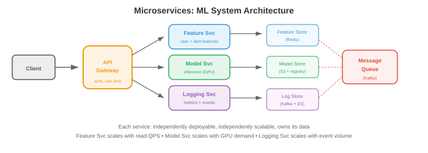

# Крупномасштабная инфраструктура

*Для создания систем, обслуживающих миллионы пользователей, требуется более одного сервера. В этом файле описаны шаблоны масштабируемости, основы распределенных систем, микросервисы, конвейеры данных, масштабирование баз данных, поисковые и векторные системы, наблюдаемость, проектирование надежности и CI/CD*.

— Модель, обслуживающая 1 запрос в секунду, может работать на ноутбуке. Для обслуживания 100 000 запросов в секунду с доступностью 99,9 % требуются распределенные системы, автоматическое переключение при сбое и тщательно спроектированные конвейеры данных. Этот файл описывает шаблоны, которые устраняют этот пробел.

## Масштабируемость

- **Вертикальное масштабирование** (увеличение масштаба): получите машину большего размера. Больше процессора, больше оперативной памяти, больше графического процессора. Простой, но имеет жесткие ограничения (самая большая доступная машина) и единственную точку отказа.

- **Горизонтальное масштабирование** (уменьшение масштаба): добавьте больше машин. Каждый обрабатывает часть трафика. Ограничения на одну машину нет, но требуется: балансировка нагрузки (файл 01), секционирование данных и обработка распределенного состояния.

- **Службы без сохранения состояния** по умолчанию масштабируются горизонтально. Добавьте больше экземпляров за балансировщиком нагрузки. Сервер вывода модели, который загружает веса при запуске и обрабатывает запросы независимо, не имеет состояния — любой экземпляр может обрабатывать любой запрос.

- **Службы с отслеживанием состояния** (базы данных, KV-кэш, хранилища функций) сложнее масштабировать. Состояние должно быть разделено между машинами (шардинг, файл 01) и реплицировано для обеспечения отказоустойчивости.

- **Уравнение масштабируемости**: для системы с серверами $n$:
    - **Идеально**: пропускная способность масштабируется линейно (серверы $n$ → пропускная способность $n\times$).
    - **Фактическое**: накладные расходы на координацию, балансировку нагрузки и передачу данных означают, что пропускная способность масштабируется сублинейно. Применяется закон Амдала (глава 13): серийная дробь (совместное состояние, координация) ограничивает ускорение.

## Распределенные системы

– **Распределенная система** — это группа компьютеров, координирующих свои действия для предоставления услуг. Основные проблемы:

- **Сетевые разделы**: машины не всегда могут обмениваться данными. Перерезан сетевой кабель, вышел из строя коммутатор, в дата-центре отключилось электричество. Система должна обрабатывать частичные сбои.

- **Смещение часов**: у машин разные часы. «Событие A произошло в 10:00:01 на машине 1» и «Событие B произошло в 10:00:01 на машине 2» не означает, что они произошли одновременно. **Логические часы** (временные метки Лампорта, векторные часы) устанавливают порядок, не полагаясь на физические часы.

– **Консенсус**: как несколько машин согласовывают значение (например, кто является лидером)? **Raft** — стандартный алгоритм консенсуса. Кластер узлов выбирает лидера. Лидер обрабатывает все записи. Если лидер терпит неудачу, оставшиеся узлы выбирают нового лидера. Для работы требуется большинство (3 из 5 узлов), поэтому он допускает сбои $\lfloor(n-1)/2\rfloor$.

- **Распределенные блокировки**: убедитесь, что критически важную операцию выполняет только один компьютер. **Redlock** (на основе Redis) получает блокировки для нескольких экземпляров Redis. Если большинство экземпляров разрешают блокировку, она получена. Используется для: предотвращения дублирования развертываний моделей, обеспечения записи в контрольную точку только одного учебного задания.

## Микросервисы



- **Микросервисы** разлагают систему на небольшие, независимо развертываемые сервисы. Каждому сервису принадлежит один домен:

```
┌─────────────┐  ┌──────────────┐  ┌─────────────┐
│ API Gateway │→ │ Feature Svc  │→ │ Feature DB  │
└─────────────┘  └──────────────┘  └─────────────┘
       │
       ├────────→ ┌──────────────┐  ┌─────────────┐
       │          │ Model Svc    │→ │ Model Store │
       │          └──────────────┘  └─────────────┘
       │
       └────────→ ┌──────────────┐  ┌─────────────┐
                  │ Logging Svc  │→ │ Log Store   │
                  └──────────────┘  └─────────────┘
```

- **Преимущества**: независимое развертывание (обновление сервиса моделей, не затрагивая сервис объектов), независимое масштабирование (масштабирование серверов моделей на основе нагрузки запросов, серверы функций на основе скорости чтения хранилища объектов), свобода технологий (сервис моделей на Python, сервис объектов на Go).

- **Недостатки**: сетевые издержки (каждый вызов службы представляет собой круговой обход сети), сложность (отладка охватывает несколько служб), согласованность данных (отсутствие межсервисных транзакций).

- **Обнаружение службы**: как шлюз API находит службу модели? Варианты: на основе DNS (каждая служба регистрирует DNS-имя), службы K8s (встроенные) или реестр служб (Consul, Eureka).

- **Шаблон саги**: для операций, охватывающих несколько служб (создание пользователя + выделение ресурсов + отправка приветственного письма), используйте сагу: последовательность локальных транзакций с компенсирующими действиями в случае сбоя на каком-либо этапе.## Конвейеры данных

- Системы ML потребляют огромные объемы данных. **Конвейеры данных** перемещают, преобразуют и обслуживают эти данные:

### Пакетная обработка

- Обработка больших объемов данных через регулярные промежутки времени (ежечасно, ежедневно).

- **MapReduce**: исходная пакетная парадигма. Карта (преобразование каждой записи независимо) → Перемешать (группировать по клавишам) → Уменьшить (агрегировать по группам). Концептуально просто, но многословно в реализации.

- **Apache Spark**: современный пакетный движок. Обработка в памяти (в 100 раз быстрее, чем MapReduce для итеративных алгоритмов). Поддерживает конвейеры SQL, DataFrames и ML. Стандарт масштабного проектирования функций.

– **Пример**: вычисление пользовательских функций для системы рекомендаций. Входные данные: 1 миллиард событий активности пользователей за последние 30 дней. Результат: 100 миллионов пользовательских векторов функций. Запускать ежедневно как задание Spark и выводить данные в хранилище функций.

### Потоковая обработка

- Обработка данных в режиме реального времени по мере их поступления (задержка менее секунды).

- **Apache Flink**: ведущий механизм обработки потоков. Одноразовая обработка, обработка времени события (обработка событий по времени их возникновения, а не по времени их поступления), оконная обработка (переворачивание, скольжение, окна сеанса).

- **Kafka Streams**: облегченная потоковая обработка, встроенная в Kafka. Подходит для более простых преобразований (фильтрация, агрегация) без развертывания отдельного кластера.

- **Пример**: обнаружение мошенничества в режиме реального времени. Каждая транзакция по кредитной карте — это событие Kafka. Задание Flink вычисляет текущую статистику (частоту транзакций, изменения местоположения) и помечает аномалии в течение 100 мс.

### Лямбда-архитектура

- Объединение пакетной и потоковой обработки. **Пакетный уровень** обеспечивает точные и полные результаты (но с задержкой). Уровень **скорости** предоставляет приблизительные результаты в реальном времени. **Обслуживающий уровень** объединяет оба.

- На практике многие команды сейчас используют **архитектуру Каппа**: только обработку потока, рассматривая поток как источник истины. Поток можно воспроизвести (Kafka сохраняет события), поэтому пакет можно смоделировать, воспроизведя поток.

## Инфраструктура обучения ML

— Обучение пограничной модели (более 100 миллиардов параметров) — это масштабная инфраструктурная проблема: тысячи графических процессоров работают месяцами, потребляют мегаватты энергии, генерируют петабайты данных и стоят десятки миллионов долларов. Инфраструктура определяет, будет ли обучение успешным или неудачным.

### Кластеры графических процессоров

— Учебный кластер — это совокупность GPU-серверов, соединенных высокоскоростными сетями. Ключевые компоненты:


- **Серверы (узлы)**: каждый сервер имеет 4–8 графических процессоров. Типичная конфигурация: 8 графических процессоров H100, 2 процессора AMD EPYC, 2 ТБ ОЗУ, твердотельный накопитель NVMe емкостью 30 ТБ. Графические процессоры внутри узла соединены с помощью **NVLink** (900 ГБ/с на графический процессор в H100), что в 30 раз быстрее, чем PCIe.

- **Размеры кластера**: небольшой обучающий кластер имеет 64–256 графических процессоров (8–32 узла). Обучающий кластер пограничной модели имеет 4000–32 000 графических процессоров (500–4000 узлов). В Llama 3 от Meta использовалось 16 384 графических процессора H100. Google тренируется на модулях TPU с более чем 8000 чипами.

- **Задняя часть**: для обучения модели 70B требуется ~$2M in compute. Training a 400B+ frontier model requires ~$50-100M. Само оборудование кластера стоит ~$500M-$1B по ценам H100 ($30K per GPU × 16,000 GPUs = $480M).

### Топология сети

— Сеть между узлами GPU — наиболее важный компонент инфраструктуры. Если графические процессоры не могут обмениваться градиентами достаточно быстро, они простаивают, ожидая завершения связи.

- **InfiniBand** — это стандарт для сетей кластеров графических процессоров. **Quantum-2 InfiniBand** от NVIDIA обеспечивает скорость 400 Гбит/с на порт. Каждый узел обычно имеет 8 портов InfiniBand (по одному на каждый графический процессор), что обеспечивает общую пропускную способность пополам 400 ГБ/с на узел.

- **RDMA** (прямой удаленный доступ к памяти): InfiniBand поддерживает RDMA, который передает данные напрямую между памятью графического процессора на разных узлах без участия ЦП. Это уменьшает задержку с ~100 мкс (TCP) до ~1 мкс и необходимо для эффективного снижения градиента (глава 6).- **Топология сети имеет значение**: **толстое дерево** (сеть Clos) обеспечивает полную пропускную способность пополам (любой графический процессор может взаимодействовать с любым другим на полной скорости). Более дешевые топологии (**оптимизированные по рельсам**, **3D-тор**) обеспечивают меньшую пропускную способность, но и стоят дешевле. Топология должна соответствовать стратегии параллелизма:
    - **Параллелизм данных**: полное сокращение для всех графических процессоров → требуется высокая пропускная способность пополам (жирное дерево).
    - **Тензорный параллелизм**: связь внутри узла → NVLink справляется с этим (сеть не требуется).
    - **Параллелизм конвейеров**: связь между соседними этапами конвейера → требуется пропускная способность только между определенными парами узлов (оптимизация по железной дороге подойдет).

- **Альтернативы Ethernet**: **RoCE v2** (RDMA через конвергентный Ethernet) обеспечивает RDMA через стандартную инфраструктуру Ethernet. Дешевле, чем InfiniBand, но с более высокой задержкой и большей перегрузкой. Google использует RoCE для некоторых сетей модулей TPU. Консорциум Ultra Ethernet разрабатывает Ethernet без потерь для рабочих нагрузок искусственного интеллекта.

### Хранилище для тренировок

- Для обучения требуется три уровня хранения:

    – **Хранилище набора данных**: обучающий корпус (1–100 ТБ текста или петабайты мультимодальных данных). Хранится в распределенных файловых системах или объектных хранилищах. Должен поддерживать последовательное чтение с высокой пропускной способностью (загрузчик данных считывает данные большими пакетами). **Lustre** и **GPFS** — распространенные файловые системы HPC; облачные альтернативы включают **FSx for Lustre** (AWS) и **Filestore** (GCP).

    - **Хранилище контрольных точек**: состояние обучения (веса модели + состояние оптимизатора + состояние планировщика) периодически сохраняется. Для модели 70B смешанной точности с оптимизатором Adam: ~560 ГБ на контрольную точку (70B × 4 байта × 2 для оптимизатора). Экономия в час за 3 месяца = ~2000 контрольных точек = 1,1 ПБ. На практике сохраняются только N последних контрольных точек, а старые удаляются. Должно быть достаточно быстрым, чтобы контрольные точки не замедляли обучение существенно.

    - **Журналирование и метрики**: данные отслеживания эксперимента (кривые потерь, графики скорости обучения, нормы градиента). Относительно небольшой, но его необходимо писать в режиме реального времени. С этим справятся W&B, MLflow или TensorBoard.

- **Узкое место в хранилище**: кластеру на 16 000 графических процессоров, загружающему обучающий пакет, необходимо постоянно считывать данные со скоростью около 100 ГБ/с. Если файловая система не может поддерживать такую ​​пропускную способность, графические процессоры простаивают в ожидании данных. Оптимизация конвейера данных (предварительная выборка, кэширование, оптимизация формата с использованием WebDataset или Mosaic Streaming) имеет решающее значение.

### Планирование заданий

- Кластер графического процессора обслуживает несколько команд и проектов. **Планировщик заданий** выделяет графические процессоры для обучающих заданий:

- **SLURM**: стандартный планировщик заданий HPC. Пользователи отправляют задания с указанием количества графических процессоров, памяти и ограничения по времени. SLURM распределяет ресурсы и управляет очередью. Поддерживает планирование на основе приоритетов, упреждение и справедливое распределение между командами.

- **Kubernetes с планированием графического процессора** (глава 18, файл 02): облачный подход. Плагины устройств графического процессора K8s предоставляют графические процессоры как планируемые ресурсы. **Volcano** и **Run:ai** добавляют функции планирования, специфичные для машинного обучения: групповое планирование (выделение всех графических процессоров для задания одновременно, а не по одному), очереди приоритетов и разделение времени графического процессора.

- **Проблемы с планированием**:
    - **Фрагментация**: в кластере с 1000 графических процессоров может быть 200 свободных, но они распределены по 50 узлам (по 4 свободных на узел). Задание, требующее 128 смежных графических процессоров, не может быть выполнено, хотя всего графических процессоров достаточно. **Дефрагментация** (перенос заданий для консолидации свободных графических процессоров) или **планирование с учетом топологии** (выделение графических процессоров с хорошим соединением) решают эту проблему.
    - **Приоритет и вытеснение**: срочные эксперименты должны вытеснять задания с более низким приоритетом. Но вытеснение задания обучения, которое выполняется в течение двух дней, приводит к потере вычислительных ресурсов. Планировщик должен балансировать между приоритетом и эффективностью.
    - **Справедливая доля**: команды должны получать выделенную им часть вычислительных ресурсов с течением времени, даже если команда отправляет больше заданий, чем отведено ей.

### Отказоустойчивость

- В масштабах тысяч графических процессоров, работающих месяцами, аппаратные сбои не являются чем-то исключительным — они являются обычным явлением. Среднее время между сбоями для кластера с 16 000 графических процессоров измеряется часами, а не месяцами.- **Распространенные сбои**: ошибки памяти графического процессора (исправляемые и неисправимые с помощью ECC), сбои NVLink (связь между графическими процессорами внутри узла), сбои канала InfiniBand (связь между узлами), сбои узлов (паника ядра, сбой блока питания) и сбои хранилища (сбой диска или контроллера).

- **Контрольные точки** – это основная защита. Сохраняйте полное состояние обучения (модель, оптимизатор, положение загрузчика данных) каждые N шагов. При сбое: определите неисправный узел, замените или удалите его, перезапустите обучение с последней контрольной точки. Цена сбоя — это вычисление между последней контрольной точкой и сбоем.

- **Оптимизация частоты контрольных точек**: частые контрольные точки (каждые 10 минут) тратят меньше ресурсов в случае сбоя, но замедляют обучение (проверка 560 ГБ требует времени). Редкие контрольные точки (каждые 2 часа) выполняются быстрее, но в случае сбоя тратится до 2 часов вычислений. Большинство команд проходят контроль каждые 20-60 минут.

- **Эластичное обучение**: современные платформы (PyTorch Elastic, DeepSpeed) поддерживают изменение размера обучающего прогона без перезапуска. Если из 500 выходят из строя 2 узла, обучение продолжается с 498 узлами. Неисправные узлы заменяются, и обучение автоматически включает их, когда они снова в сети.

- **Мониторинг работоспособности**: непрерывный мониторинг всех графических процессоров (температура, ошибки памяти, вычислительная пропускная способность), сетевых каналов (потеря пакетов, задержка) и хранилища (пропускная способность, частота ошибок). Автоматическое оповещение об аномалиях. Некоторые кластеры проводят периодические проверки работоспособности графического процессора (короткий вычислительный тест), чтобы заранее выявить ухудшающееся оборудование до того, как оно выйдет из строя.

- **В масштабе**: при обучении Meta's Llama 3 (16 384 H100, 54 дня) произошло около 466 перерывов в работе. Эффективное время обучения составляло лишь ~90% времени настенных часов — 10% было потеряно из-за сбоев и восстановления. Инфраструктура для достижения 90% (а не 50% или 70%) — это то, что отличает организации, которые могут обучать передовые модели, от тех, которые не могут.

### Стоимость и эффективность

- В стоимости инфраструктуры обучения преобладают часы работы графического процессора:

| Компонент | % от общей стоимости |
|-----------|----------------|
| Вычисления на графическом процессоре | 70-80% |
| Сеть (InfiniBand) | 10-15% |
| Хранение | 5-10% |
| Охлаждение и питание | 5-10% |

- **Загрузка графического процессора** (Model FLOPs Utilisation, MFU) измеряет, какая часть теоретической пиковой производительности графического процессора фактически используется для полезных вычислений. Пиковая H100 — 989 терафлопс (FP8). Достижение 40-50% MFU – это хорошо; 50-60% — это отлично. Этот разрыв обусловлен: накладными расходами на связь (всесокращение, пузыри конвейера), ограничениями пропускной способности памяти и временем простоя во время проверки контрольных точек и загрузки данных.

- **Улучшение MFU**: перекрытие вычислений и связи (глава 6), использование эффективного внимания (Flash Attention, глава 16), оптимизация загрузки данных (предотвращение нехватки графического процессора), уменьшение накладных расходов на контрольных точках (асинхронное создание контрольных точек, сначала контрольная точка для быстрого NVMe, затем фоновое копирование в постоянное хранилище).

- **Создавать или покупать**: в небольших масштабах (графические процессоры <256 GPUs), cloud is cheaper (no upfront cost, pay per hour). At large scale (>1000, длительное использование более 6 месяцев) владение оборудованием обходится дешевле (стоимость владения снижается примерно в 2–3 раза за 3 года). Большинство компаний, занимающихся искусственным интеллектом, используют сочетание: собственные кластеры для непрерывного обучения, облако для увеличения производительности и экспериментов.

## Масштабирование базы данных

- **Реплики чтения**: запросы на чтение направляются к репликам основной базы данных. Первичные дескрипторы обрабатывают запись, реплики обрабатывают чтение. Поскольку большинство рабочих нагрузок требуют большого количества операций чтения (более 95 % операций чтения), пропускная способность чтения линейно масштабируется в зависимости от количества реплик.

- **Разделение** (шардинг, из файла 01): разделение данных по нескольким базам данных. Каждый раздел независим, что позволяет выполнять параллельное чтение и запись. Проблема заключается в межсекционных запросах (объединении данных из разных шардов).

- **Пул соединений**: базы данных имеют ограниченную пропускную способность соединений. Пул соединений (PgBouncer для PostgreSQL) повторно использует соединения между запросами, предотвращая исчерпание соединений, когда каждый из сотен экземпляров службы пытается подключиться.

## Поисковые и векторные системы

### Текстовый поиск- **Инвертированный индекс**: основа текстового поиска. Для каждого слова сохраните список документов, содержащих это слово. Запрос пересекает списки для каждого слова запроса. **Elasticsearch** — это стандарт: распределенный, в режиме реального времени, поддерживает полнотекстовый поиск, агрегирование и геопространственные запросы.

- **BM25**: стандартная функция оценки текстового поиска. Оценивает документы по частоте терминов, обратной частоте документов и нормализации длины документа. Простой, но эффективный — по-прежнему конкурирующий с нейронными методами для запросов с большим количеством ключевых слов.

### Векторный поиск

- **Векторные базы данных** хранят вложения (многомерные векторы) и поддерживают быстрый поиск **приблизительного ближайшего соседа (ИНС)**. Учитывая внедрение запроса, найдите $k$ наиболее похожие сохраненные внедрения.

- **FAISS** (поиск сходства AI в Facebook): библиотека (не база данных) для поиска ИНС. Поддерживает несколько типов индексов:
    - **Квартира**: точный поиск, $O(n)$. Используется для небольших наборов данных или в качестве базовой истины.
    - **IVF** (инвертированный файл): разбивает векторы на кластеры, ищет только ближайшие кластеры. $O(n/k)$ для каждого запроса.
    - **HNSW** (Иерархический навигационный малый мир): на основе графов. Постройте иерархический график, переходя от грубого к мелкому. Чрезвычайно быстрый и точный вариант по умолчанию для большинства приложений.
    - **Квантование продукта (PQ)**: сжимайте векторы в компактные коды для поиска с эффективным использованием памяти. Обменяйте точность на память.

- **Управляемые базы данных векторов**: Pinecone, Weaviate, Milvus, Qdrant. Они обеспечивают масштабирование, репликацию и обновления в реальном времени, чего не делает FAISS.

- **Для RAG** ​​(дополненная поисковая генерация): пользовательский запрос → встраивание с помощью текстового кодировщика → поиск соответствующих документов в векторной базе данных → добавление полученных документов к подсказке LLM. Качество поиска напрямую определяет качество ответа LLM.

## Наблюдаемость

- **Наблюдаемость** — это способность понимать, что происходит внутри вашей системы, по ее внешним выходам. Три столпа:

### Ведение журнала

- **Структурированные журналы** (JSON) доступны для поиска и анализа. Неструктурированные журналы («ОШИБКА: что-то не удалось») — нет. Всегда регистрируйте: метку времени, имя службы, идентификатор запроса (для отслеживания между службами), серьезность и соответствующий контекст.

- **Стек ELK** (Elasticsearch, Logstash, Kibana): стандартный конвейер ведения журналов. Logstash собирает и преобразует логи, Elasticsearch их индексирует, Kibana визуализирует и выполняет поиск.

### Метрики

- **Метрики** — это численные измерения с течением времени: частота запросов, частота ошибок, процентили задержки, загрузка графического процессора, глубина очереди. **Prometheus** извлекает метрики из сервисов; **Grafana** визуализирует их на информационных панелях с оповещениями.

- **Метод RED** для сервисов: **R**ate (запросов в секунду), **E**errors (частота ошибок), **D**uration (задержка). Контролируйте их для каждой службы.

- **Метод USE** для ресурсов: **Использование (% использования), **Насыщение (глубина очереди), **Ошибки. Контролируйте их для каждого ресурса (ЦП, графический процессор, память, диск, сеть).

### Трассировка

- **Распределенная трассировка** следует за одним запросом к нескольким службам. Пользовательский запрос попадает в шлюз API → сервис объектов → сервис модели → постобработка. **Трассировка** записывает время каждого перехода, показывая, на что расходуется задержка.

- **OpenTelemetry**: открытый стандарт трассировок, метрик и журналов. Инструментируйте свой код один раз, экспортируйте его в любой бэкэнд (Jaeger, Zipkin, Datadog).

## Надежность

- **SLO** (Цель уровня обслуживания): целевая надежность. «99,9% запросов выполняются менее чем за 200 мс». Это дает конкретный бюджет ошибок: 0,1% запросов (около 43 минут в месяц) могут быть медленными или завершаться неудачно.

- **SLI** (Индикатор уровня обслуживания): измерение. «Задержка 99-го процентиля за последние 5 минут».

- **SLA** (Соглашение об уровне обслуживания): договорное обещание с последствиями. «Если доступность падает ниже 99,95%, клиент получает кредит».

- **Бюджеты ошибок**: если ваш SLO составляет 99,9%, а у вас 99,99%, у вас есть бюджет на рискованные изменения (развертывание новой модели, миграция баз данных). Если у вас 99,85%, заморозьте все изменения и сосредоточьтесь на надежности. Бюджеты ошибок превращают надежность из абстрактной цели в измеримый ресурс.- **Хаос-инжиниринг**: намеренно внедряйте сбои (закрытие сервера, увеличение задержки в сети, повреждение данных), чтобы проверить, правильно ли их обрабатывает ваша система. Chaos Monkey от Netflix случайным образом завершает производственные экземпляры. Если система работает, она устойчива. Если он упадет, значит, вы обнаружили ошибку раньше, чем это сделали ваши пользователи.

## CI/CD

- **Непрерывная интеграция**: автоматическое создание и тестирование каждого изменения кода. Каждое нажатие запускает: проверку типа, модульные тесты, интеграционные тесты. Если какой-либо из них окажется неудачным, изменение отклоняется. Это позволяет обнаружить ошибки до того, как они достигнут рабочей среды.

- **Непрерывное развертывание**: автоматическое развертывание изменений, прошедших CI. Стратегии развертывания:

    - **Синий-зеленый**: запуск двух одинаковых сред (синий = текущая, зеленый = новая). Мгновенно переключайте трафик с синего на зеленый. Если зеленый не сработал, переключитесь обратно на синий (мгновенный откат).

    - **Canary**: перенаправьте небольшую часть трафика (1–5%) на новую версию. Следите за ошибками. Постепенно увеличивайте трафик, если показатели выглядят хорошо. Это ограничивает радиус взрыва при неправильном развертывании.

    – **Флаги функций**: разверните новый код, но спрячьте его за флажком. Включите флаг для подмножества пользователей (внутренние тестировщики, затем бета-пользователи, затем все). Отделите развертывание (код доступен) от выпуска (пользователи видят эту функцию).

- Для машинного обучения: CI/CD включает шаги, специфичные для модели. Изменение модели вызывает: модульные тесты (тесты формы, проверки градиента), оценку на отложенном наборе (точность не должна снижаться), теневое развертывание (запуск новой модели вместе со старой, сравнение результатов) и постепенное развертывание (канарейка от 1% до 100%).