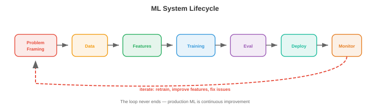

# Проектирование систем машинного обучения

*При проектировании систем машинного обучения шаблоны инфраструктуры из файлов 01–03 применяются к конкретным задачам машинного обучения. Этот файл охватывает жизненный цикл машинного обучения, управление данными, инфраструктуру обучения, оценку модели, стратегии обслуживания, разработку функций, конвейеры машинного обучения и мониторинг.*

– Вопрос на собеседовании по проектированию систем, например «Разработать систему рекомендаций для YouTube», не требует от вас описания алгоритма рекомендаций. Вам предлагается спроектировать **всю систему**: конвейеры данных, разработку функций, обучение модели, оценку, обслуживание, мониторинг и итерацию. Этот файл обеспечивает основу.

## Жизненный цикл системы машинного обучения



- Каждая система ML имеет один и тот же жизненный цикл, будь то классификатор спама или базовая модель:

```
Problem Framing → Data → Features → Training → Evaluation → Deployment → Monitoring → Iteration
       ↑                                                                                    │
       └────────────────────────────────────────────────────────────────────────────────────┘
```

### Формулировка проблемы

- Прежде чем прикасаться к данным или моделям, определите:
    - **Что** ты предсказываешь? (вероятность щелчка, следующий токен, ограничивающая рамка объекта)
    - **Кто** пользователи? (конечные пользователи, внутренние аналитики, другие модели ML)
    - **Каковы ограничения?** (задержка < 100ms, offline batch is fine, must run on-device)
    - **What is the business metric?** (revenue, engagement, accuracy) and how does the ML metric relate to it?
    - **What is the baseline?** (heuristic, rule-based system, existing model) — you must beat this to justify the ML system.

- **Common mistake**: jumping to model architecture before understanding the problem. "We should use a transformer" is not a system design answer. "We need to predict click probability for 10M candidates within 200ms, so we need a two-stage system: fast retrieval then a small ranking model" is.

## Data Management

### Data Collection and Labelling

- **Explicit labels**: humans annotate data (click/no-click, object bounding boxes, conversation quality ratings). Expensive (~$0.02-$10 per label depending on complexity), slow, and subjective.

- **Implicit labels**: derive labels from user behaviour. Clicks, dwell time, purchases, skips. Cheap and abundant but noisy (a click does not mean satisfaction; a skip does not mean dislike).

- **Programmatic labelling** (Snorkel): write labelling functions (heuristics, regex, existing models) that vote on each example. Aggregate votes statistically to produce probabilistic labels. Scales to millions of examples with moderate accuracy.

- **Active learning**: the model identifies the examples it is most uncertain about and requests human labels for those. This maximises label efficiency: 1000 actively-selected labels can match 10,000 random labels.

### Data Quality

- **Data validation**: check every batch of incoming data for schema violations (missing fields, wrong types), distribution shifts (average values changed significantly), and volume anomalies (expected 1M rows, got 500K).

- **Great Expectations** and **TFX Data Validation** are tools that define expectations about data and alert when they are violated.

- **Data versioning**: every training run should be reproducible. **DVC** (chapter 15) tracks data files alongside code. Each dataset version gets a hash; the training config references the hash.

### Feature Stores


- **Feature stores** (chapter 15) provide consistent features for training and serving. Key concepts:

    - **Offline features**: computed from batch pipelines (Spark), stored in data warehouses. Used during training and for batch inference. Examples: user's average session length over 30 days, item's total purchase count.

    - **Online features**: computed in real-time or precomputed and served from a low-latency store (Redis, DynamoDB). Used during real-time inference. Examples: user's last 5 actions, current cart contents.

    - **Training-serving skew**: if the feature computation differs between training and serving, the model sees different feature values at inference than it was trained on. Feature stores eliminate this by using the same computation for both.

## Training Infrastructure

- For this book's audience, distributed training was covered in depth in chapter 6 (data parallelism, model parallelism, mixed precision, scaling laws). Here we focus on the **systems** aspects:

- **Experiment tracking** (W&B, MLflow — chapter 15): every training run logs hyperparameters, metrics, git commit, data version, and hardware. This is the ML equivalent of version control for models.

- **Hyperparameter tuning**: automated search over hyperparameters. Methods: grid search (exhaustive, expensive), random search (surprisingly effective), Bayesian optimisation (model the objective, sample where improvement is likely), and **ASHA** (Asynchronous Successive Halving: start many trials, kill underperforming ones early).

- **Training pipeline orchestration** (Airflow, Kubeflow — chapter 15): automate the sequence of data prep → training → evaluation → registration. Schedule daily retraining. Alert on failures.

## Model Evaluation

### Offline Evaluation

- **Held-out test set**: evaluate on data the model never saw during training. Standard but can be misleading if the test set does not represent production data.

- **Slice-based evaluation**: evaluate on subgroups (by user demographics, content type, language, time period). A model with 95% overall accuracy might have 70% accuracy for a specific minority group — unacceptable.

- **Backtesting**: for time-series or sequential prediction, evaluate on historical data in time order. Train on data up to time $t$, evaluate on data from $t$ to $t + \Delta t$. Avoids the leakage of using future data for training.

### Online Evaluation


- **A/B testing**: randomly split live traffic into control (old model) and treatment (new model). Compare business metrics (revenue, engagement, retention) with statistical significance. The gold standard for evaluating ML changes.

    - **Sample size**: you need enough data to detect the expected effect size. A 0.1% improvement in click-through rate requires millions of impressions to detect with significance.

    - **Duration**: run for at least one full cycle (1-2 weeks for most products) to capture day-of-week effects.

    - **Guardrail metrics**: monitor metrics that should NOT change (page load time, error rate, crash rate) alongside the target metric. A model that increases revenue but also increases crashes is a net negative.

- **Shadow deployment**: run the new model alongside the old one in production. Both receive the same requests, but only the old model's predictions are served to users. Compare the outputs. This catches bugs and quality issues without risk to users.

- **Interleaving**: for ranking problems, interleave results from the old and new model in a single list. Users interact with the interleaved list, and you measure which model's results get more engagement. Requires fewer users than A/B testing to reach significance.

## Model Serving

### Batch vs Real-Time

- **Batch inference**: precompute predictions for all possible inputs. Store in a database/cache. Serve from the cache. Works when: the input space is finite (recommend for all users nightly), freshness is not critical (daily predictions are fine), and latency tolerance is high.

- **Real-time inference**: compute predictions on demand for each request. Works when: the input space is infinite (any user query), freshness matters (predict for this specific query right now), and latency must be low.

- Many systems use **both**: batch precomputes a set of candidates (cheap, covers 80% of traffic), real-time handles the rest (expensive, covers tail queries and new users).

### Model Versioning and Registry

- A **model registry** (MLflow, W&B, SageMaker) stores trained models with metadata:
    - Version number and training date.
    - Training config and data version.
    - Evaluation metrics (accuracy, latency, memory usage).
    - Stage: development → staging → production → archived.

- **Rollback**: if a new model degrades metrics in production, revert to the previous version immediately. The registry makes this a one-click operation.

## Feature Engineering

- **Feature engineering** transforms raw data into the inputs the model needs. It is often the highest-leverage activity in ML: better features improve every model, while better models are limited by the features they receive.

### Online vs Offline Features

- **Offline features** are precomputed and change slowly (user demographics, 30-day aggregates). Computed by batch pipelines (Spark), stored in the feature store.

- **Online features** reflect the current state and change rapidly (items in cart, last action, current location). Computed in real-time from event streams or looked up from a fast store.

- **Feature freshness**: some features need to be seconds-fresh (fraud detection: is this transaction anomalous given the last 5 transactions?). Others can be hours-stale (recommendations: what genres does this user prefer based on their history?). Fresher features are more expensive to compute and serve.

### Common Feature Patterns

- **Counting features**: count of events in a time window (purchases in last 7 days, logins in last 24 hours).
- **Embedding features**: learned embeddings for categorical variables (user embedding, item embedding, query embedding). These are the inputs to two-tower models and similar architectures.
- **Cross features**: combinations of two or more features (user_age × item_category). Capture interactions that individual features miss.
- **Temporal features**: time since last action, day of week, hour of day. Capture temporal patterns.
- **Aggregation features**: mean, median, min, max, std of a numerical feature over a group (average rating of items by this seller).

## ML Pipelines

- An ML pipeline orchestrates the entire workflow from data to deployed model:

```
Data ingestion → Validation → Feature engineering → Training → Evaluation → Registration → Deployment → Monitoring
```

- Each step is a task in an orchestrator (Airflow, Kubeflow, Metaflow — chapter 15). The pipeline:
    - Runs on a schedule (daily retraining) or on trigger (new data available).
    - Is idempotent (rerunning produces the same result).
    - Has retry logic (if feature computation fails, retry 3 times with backoff).
    - Produces artifacts (trained model, evaluation report, feature statistics) that are versioned and stored.

- **Metaflow** (Netflix/Outerbounds) is particularly well-suited for ML: it versions code, data, and models together, supports local development and cloud execution with the same code, and integrates with K8s and AWS.

## Monitoring

- We covered monitoring fundamentals in chapter 15 (Prometheus, Grafana, alerts). Here we focus on **ML-specific monitoring**:

### Data Drift

- **Data drift** occurs when the distribution of incoming data changes relative to the training data. A model trained on summer data may perform poorly on winter data (different user behaviour, different product availability).

- **Detection**: compare the distribution of incoming features to the training distribution using statistical tests:
    - **KS test** (Kolmogorov-Smirnov): compares two empirical distributions. Tests whether they come from the same underlying distribution.
    - **PSI** (Population Stability Index): measures how much a distribution has shifted. PSI < 0.1 is stable, 0.1-0.25 is moderate shift, > 0,25 значительна.
    - **Сдвиг внедрения**: сравните распределение входящих запросов с обучающим набором, используя центроидное расстояние или MMD (максимальное среднее несоответствие).

### Концептуальный дрифт

- **Дрейф концепции** возникает, когда меняется соотношение между входными и выходными данными. Характеристики выглядят одинаково, но правильный прогноз отличается. Пример: предпочтения пользователей меняются после культурного события, пандемии или смены продукта.

- Отклонение понятий обнаружить труднее, чем отклонение данных, поскольку для этого требуются помеченные данные. Отслеживайте прокси-метрики: рейтинг кликов, коэффициент конверсии, оценку удовлетворенности пользователей. Устойчивый спад предполагает дрейф концепции.

### Деградация модели

- Модели со временем ухудшаются по нескольким причинам: дрейф данных, дрейф концепции, ошибки конвейера функций (функция начинает возвращать нулевые значения) и изменения исходных данных (сторонний API меняет формат ответа).

- **Реакция**: при обнаружении деградации действие зависит от серьезности:
    - Легкая: переподготовка на основе последних данных (это решается плановой переподготовкой).
    - Умеренный: выясните основную причину (какая функция изменилась? Какой сегмент пользователей затронут?).
    - Серьезная: немедленно откатитесь к предыдущей версии модели, а затем проведите расследование.

### Петли обратной связи

- Системы машинного обучения создают **петли обратной связи**: прогнозы модели влияют на поведение пользователей, что становится обучающими данными для следующей версии модели. Эти петли могут быть добродетельными или порочными.

- **Петля положительной обратной связи** (опасно): модель рекомендаций показывает в основном популярные элементы → пользователи нажимают на популярные элементы (потому что это все, что они видят) → модель узнает, что популярные элементы становятся еще более популярными → разнообразие падает. Модель создает данные, подтверждающие ее предвзятость.

- **Петля отрицательной обратной связи** (также опасно): модель обнаружения мошенничества выявляет все мошенничества типа A → никакое мошенничество типа A не достигает обучающих данных → следующая модель не учится обнаруживать мошенничество типа A → мошенничество типа A появляется снова.

- **Устранения**:
    - **Исследование**: показать некоторые элементы, в отношении которых модель не уверена (эпсилон-жадная выборка Томпсона). Это генерирует разнообразные данные обучения.
    - **Контрфактическое ведение журнала**: записывайте то, что *предсказала* модель, а не только то, что видел пользователь. Тренируйтесь на данных, противоречащих Дебиасу.
    - **Наборы удержания**: случайным образом обслуживают часть трафика без фильтрации модели. Нефильтрованные данные предоставляют достоверную информацию для оценки качества модели.
    - **Отложенные метки**: дождитесь истинного результата, прежде чем использовать данные для обучения. О рекомендации, на которую нажали сегодня, завтра могут пожалеть. При прогнозировании мошенничества необходимо дождаться окна возврата средств (30–90 дней).

### Встраивание управления таблицами

– Крупномасштабные системы машинного обучения часто имеют таблицы внедрения с более чем 100 миллионами записей (по одному внедрению на пользователя, элемент, объявление или сущность). Управление ими в масштабе является системной задачей:- **Хранилище**: 100 млн объектов × 256-dim × float16 = 50 ГБ. Не помещается в память графического процессора. Решения: хранить в памяти ЦП с помощью кэширования на стороне графического процессора, распределять данные по нескольким машинам или использовать **встраивания хеша** (хэш-объекты в таблицу фиксированного размера, допускающие коллизии).

- **Обновления**: встраивания меняются по мере переобучения модели. Для развертывания новой таблицы внедрения на обслуживание необходимо: загрузить 50 ГБ в память без нарушения живого трафика, проверить правильность и выполнить откат в случае ухудшения показателей. Используйте сине-зеленое развертывание для внедрения таблиц.

- **Устарелость**: у вновь созданного пользователя нет встраивания (проблема холодного запуска). Решения: используйте внедрение по умолчанию, извлеките внедрение из функций пользователя с помощью модели «функции-встраивание» или вернитесь к неперсонализированной модели.

### Справедливость и предвзятость

- Системы МО могут систематически по-разному относиться к различным группам, что часто отражает предвзятость в данных обучения. **Контроль за честностью** – это обязанность, а не дополнительная функция.

– **Показатели для мониторинга**:
    - **Демографический паритет**: различается ли вероятность положительного прогноза в зависимости от группы (пол, этническая принадлежность, возраст)?
    - **Равные возможности**: различается ли истинный процент положительных результатов в разных группах? (Модель найма должна одинаково хорошо выявлять квалифицированных кандидатов из всех групп.)
    - **Калибровка**: если в модели указано P(квалифицировано) = 0,7 для группы A, действительно ли 70% группы A соответствуют критериям? И то же самое для группы B?

- **Практические шаги**:
    - Оценивайте производительность модели по срезам (подгруппам), а не только по общим показателям.
    - Включите показатели справедливости в конвейер оценки модели (модель, которая повышает общую точность, но ухудшает конкретную группу, не должна использоваться без проверки).
    - Документируйте известные ограничения и виды отказов.
    - Установить процесс проверки моделей, применяемых в чувствительных областях (найм, кредитование, уголовное правосудие, здравоохранение).