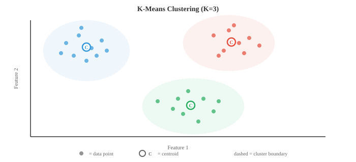

# Классическое машинное обучение

*Классические алгоритмы машинного обучения изучают закономерности на основе данных без явного программирования, используя решения в закрытой форме или эвристический поиск, а не градиентный спуск. Этот файл охватывает наивный байесовский метод, k-NN, деревья решений, случайные леса, SVM, кластеризацию k-средних и PCA*.

— Машинное обучение — это изучение алгоритмов, которые улучшают свою производительность при выполнении какой-либо задачи за счет обучения на основе данных, а не за счет явного программирования с помощью правил. Вместо того, чтобы писать «если доход > 50 тыс. и возраст < 30, то одобрить кредит», вы передаёте алгоритму тысячи прошлых решений по кредитам и позволяете ему самому выявить закономерность.

- Есть три широкие парадигмы. **Обучение с учителем** использует помеченные данные. Это означает, что каждый входной сигнал имеет заведомо правильный выходной результат. Алгоритм изучает сопоставление входов и выходов. **Обучение без учителя** работает с немаркированными данными и пытается обнаружить скрытую структуру, например кластеры или сжатые представления. **Обучение с подкреплением** учится методом проб и ошибок, получая награды или штрафы за действия, предпринятые в окружающей среде (описано в файле 04).
- В рамках контролируемого обучения **классификация** прогнозирует отдельные категории (спам или не-спам, кошка или собака), а **регрессия** прогнозирует непрерывные значения (цена дома, температура завтра). Граница не всегда четкая: логистическая регрессия называется «регрессией», но выполняет классификацию.
- Ключевое различие в вероятностных моделях — **генеративное и дискриминативное**. Генеративная модель изучает совместное распределение $P(x, y)$, а это значит, что она понимает, как генерируются сами данные. Он может производить новые образцы. Дискриминационная модель изучает $P(y \mid x)$ напрямую, ориентируясь только на границу между классами. Наивный Байес является порождающим; логистическая регрессия (файл 02) является дискриминационной. Генеративные модели более гибки, но их сложнее обучать; дискриминационные модели часто обеспечивают более высокую точность классификации, когда у вас достаточно данных.
- **Наивный Байес** — один из самых простых и эффективных классификаторов. Он напрямую применяет теорему Байеса (из главы 05):
$$P(C_k \mid x) = \frac{P(x \mid C_k) \, P(C_k)}{P(x)}$$
- «Наивная» часть — это сильное предположение о независимости: она рассматривает каждую функцию как независимую от данного класса. Если вы классифицируете электронные письма как спам, Наивный Байес предполагает, что наличие слова «бесплатно» ничего не говорит вам о наличии слова «победитель», если вы знаете, что электронное письмо является спамом. В действительности это почти никогда не соответствует действительности, но классификатор в любом случае работает на удивление хорошо.
- Поскольку $P(x)$ одинаков для всех классов, классификация упрощается до выбора класса, который максимизирует числитель:
$$\hat{y} = \arg\max_{k} \; P(C_k) \prod_{i=1}^{n} P(x_i \mid C_k)$$
- Предыдущий $P(C_k)$ — это лишь часть обучающих примеров в каждом классе. Вероятность $P(x_i \mid C_k)$ зависит от того, какие у вас функции, что приводит к трем общим вариантам.
- **Мультиномиальный наивный байесовский метод** предназначен для подсчета данных, например частоты слов в документах. Каждый признак $x_i$ показывает, сколько раз появляется слово $i$, а вероятность соответствует полиномиальному распределению. Это стандартный выбор для классификации текста, анализа настроений и фильтрации спама.
- **Гауссовский наивный байес** предполагает, что каждый признак имеет нормальное распределение внутри каждого класса. Вы оцениваете среднее значение $\mu_{ik}$ и дисперсию $\sigma_{ik}^2$ признака $i$ для класса $k$ на основе обучающих данных, а затем вычисляете:
$$P(x_i \mid C_k) = \frac{1}{\sqrt{2\pi\sigma_{ik}^2}} \exp\!\left(-\frac{(x_i - \mu_{ik})^2}{2\sigma_{ik}^2}\right)$$
- Это естественный выбор, когда ваши функции представляют собой непрерывные измерения, такие как рост, вес или показания датчиков.

- **Наивный Байес по Бернулли** моделирует бинарные признаки: каждый признак либо присутствует (1), либо отсутствует (0). Вместо того, чтобы подсчитывать, сколько раз появляется слово, вы лишь отслеживаете, появляется ли оно вообще. Это хорошо работает для коротких текстов или двоичных векторов признаков.
— Практическая проблема возникает, когда значение признака никогда не появляется для определенного класса в обучающих данных. Вероятность становится нулевой, а поскольку все умножается вместе, вся апостериорная часть схлопывается до нуля. **Сглаживание по Лапласу** исправляет это, добавляя небольшое количество (обычно 1) к каждой комбинации классов объектов:
$$P(x_i \mid C_k) = \frac{\text{count}(x_i, C_k) + \alpha}{\text{count}(C_k) + \alpha \cdot V}$$
- Здесь $\alpha$ — параметр сглаживания (обычно 1), а $V$ — количество возможных значений для этой функции. Это гарантирует, что ни одна вероятность никогда не будет равна нулю.
- **Деревья решений** используют совершенно другой подход. Вместо вычисления вероятностей они разделяют пространство признаков с помощью последовательности вопросов типа «да/нет». Вспомните игру «Двадцать вопросов»: на каждом этапе вы задаете вопрос, который максимально сужает возможности.
- Дерево начинается с корня со всеми обучающими примерами. На каждом внутреннем узле он выбирает признак и порог для разделения (например, «возраст < 30?»). Примеры чередуются влево или вправо в зависимости от ответа. Это продолжается рекурсивно до тех пор, пока не появятся листья, содержащие прогнозы: класс большинства для классификации или среднее значение для регрессии.

- Важнейший вопрос: на какую функцию следует разделить? Вам нужны разделения, которые создают «самые чистые» дочерние узлы, где большинство примеров принадлежат одному и тому же классу. Двумя распространенными мерами примеси являются **примесь Джини** и **энтропия**.
- **Примесь Джини** измеряет вероятность того, что случайно выбранная выборка будет неправильно классифицирована, если будет помечена в соответствии с распределением в этом узле:
$$\text{Gini}(S) = 1 - \sum_{k=1}^{K} p_k^2$$
- Если узел совершенно чистый (все одного класса), Джини равен 0. Если классы одинаково сбалансированы (скажем, 50/50 для двух классов), Джини достигает максимума 0,5.
- **Энтропия** (из раздела теории информации главы 05) измеряет среднюю неожиданность:
$$H(S) = -\sum_{k=1}^{K} p_k \log_2 p_k$$
- Чистый узел имеет энтропию 0. Идеально сбалансированный двоичный узел имеет энтропию 1 бит. На практике Джини и энтропия дают очень похожие деревья; Джини вычисляется немного быстрее, поскольку он позволяет избежать логарифма.
- **Прирост информации** — это уменьшение примесей, достигаемое за счет разделения. Для разделения, которое делит набор $S$ на подмножества $S_L$ и $S_R$:
$$\text{IG}(S, \text{split}) = H(S) - \frac{|S_L|}{|S|} H(S_L) - \frac{|S_R|}{|S|} H(S_R)$$
- Алгоритм жадно выбирает разделение с наибольшим приростом информации в каждом узле. Это локально оптимальная стратегия, а не глобально оптимальная, но на практике она хорошо работает.
- **Деревья регрессии** работают таким же образом, но листья предсказывают непрерывное значение (среднее значение примеров, достигших этого листа), а критерий разделения использует сокращение дисперсии вместо Джини или энтропии.
- Если ничего не контролировать, дерево решений будет продолжать разбиваться до тех пор, пока каждый лист не станет чистым, по сути, запоминая данные обучения. Это серьезное переоснащение. **Обрезка** борется с этим. Предварительная обрезка устанавливает ограничения перед выращиванием дерева: максимальная глубина, минимальное количество образцов на лист или минимальный сбор информации для разделения. После обрезки сначала растет все дерево, а затем удаляются ветви, которые не улучшают производительность в наборе проверки.
- Единое дерево решений легко интерпретировать, но оно имеет тенденцию быть нестабильным: небольшие изменения в данных могут привести к совершенно иному дереву. **Ансамблевые методы** объединяют множество моделей для получения более точных прогнозов, чем любая отдельная модель.
- Основная идея – «мудрость толпы». Если вы опросите 100 посредственных классификаторов и получите большинство голосов, ансамбль может оказаться превосходным, пока отдельные классификаторы допускают несколько независимые ошибки.
- **Бэгинг** (начальное агрегирование) обучает несколько моделей на разных случайных подмножествах данных, отобранных с заменой (начальные выборки). Каждая модель видит примерно 63% исходных данных. Во время прогнозирования вы усредняете результаты (регрессия) или принимаете большинство голосов (классификация). Поскольку каждая модель видит разные данные, они допускают разные ошибки, а усреднение сводит на нет большую часть дисперсии.
- **Случайные леса** — это группировка, применяемая к деревьям решений, с одним дополнительным нюансом: при каждом разбиении дерево учитывает только случайное подмножество функций (обычно функции $\sqrt{d}$ из общего числа $d$). Это еще больше декорирует деревья, делая ансамбль еще более мощным. Случайные леса — один из самых надежных готовых классификаторов во всем машинном обучении.

- **Усиление** основано на противоположной философии. Вместо независимого обучения моделей он обучает их последовательно, при этом каждая новая модель концентрируется на примерах, в которых предыдущие модели ошиблись.
- **AdaBoost** (адаптивное повышение) сохраняет вес для каждого примера тренировки. Изначально все веса равны. После обучения слабого ученика (часто это очень поверхностное дерево решений, называемое «пень»), примеры, которые были неправильно классифицированы, получают более высокий вес, поэтому следующий ученик обращает на них больше внимания. Окончательный прогноз представляет собой взвешенное голосование всех учащихся, при котором более успешные учащиеся получают больше голоса:
$$H(x) = \text{sign}\!\left(\sum_{t=1}^{T} \alpha_t \, h_t(x)\right)$$
- Вес $\alpha_t$ для обучающегося $t$ зависит от его частоты ошибок $\epsilon_t$:
$$\alpha_t = \frac{1}{2} \ln\!\left(\frac{1 - \epsilon_t}{\epsilon_t}\right)$$
- Учащийся с низкой ошибкой получает большой положительный вес; одно случайное исполнение ($\epsilon = 0.5$) получает нулевой вес.
- **Усиление градиента** обобщает эту идею. Вместо повторного взвешивания примеров каждая новая модель обучается прогнозировать остаточные ошибки (отрицательный градиент функции потерь) объединенного ансамбля. Для квадрата потерь ошибок остатки представляют собой буквально разницу между прогнозами и целевыми значениями. Градиентное повышение с помощью деревьев решений (GBDT) лежит в основе многих решений, выигравших в конкурсах структурированных данных (XGBoost, LightGBM, CatBoost — популярные реализации).
– Ключевой контраст: объединение уменьшает **дисперсию** (усреднение шума), а усиление уменьшает **смещение** (исправление систематических ошибок). Упаковка лучше всего работает, когда отдельные модели подходят друг другу; повышение работает лучше всего, когда они недостаточно подходят.
- При переходе к обучению без учителя **Кластеризация по K-средним** является самым простым и наиболее широко используемым алгоритмом кластеризации. Учитывая точки данных $n$ и целевое количество кластеров $K$, он присваивает каждую точку одной из групп $K$, минимизируя общее расстояние от каждой точки до центра ее кластера.
- Алгоритм чередует два шага. Сначала **назначьте** каждую точку ближайшему центроиду. Во-вторых, **обновите** каждый центроид до среднего значения всех назначенных ему точек. Повторяйте до тех пор, пока задания не перестанут меняться. Это гарантированно сходится, поскольку общее расстояние внутри кластера уменьшается (или остается неизменным) на каждом этапе.

- Формально K-Means минимизирует сумму квадратов внутри кластера, называемую **инерцией**:
$$J = \sum_{k=1}^{K} \sum_{x \in C_k} \|x - \mu_k\|^2$$
- где $\mu_k$ — центр тяжести кластера $C_k$.
- K-Means чувствителен к инициализации. Плохие начальные центроиды могут привести к плохим локальным минимумам. Стратегия инициализации **K-Means++** выбирает первый центроид случайным образом, затем выбирает каждый последующий центроид с вероятностью, пропорциональной его квадрату расстояния от ближайшего существующего центроида. Это расширяет первоначальные центры и почти всегда дает лучшие результаты.
- Как вы выбираете $K$? Два распространенных инструмента. **Метод локтя** строит график инерции в зависимости от $K$ и ищет «колено», где добавление дополнительных кластеров перестает сильно помогать. **Оценка силуэта** показывает, насколько точка похожа на собственный кластер по сравнению с ближайшим другим кластером, в диапазоне от -1 (неправильный кластер) до +1 (хорошо кластеризованный). Средняя оценка силуэта по всем точкам дает общую оценку качества кластера.
- K-Means имеет ограничения: он предполагает наличие сферических кластеров примерно одинакового размера и выполняет «жесткие» задания (каждая точка принадлежит ровно одному кластеру). **Модели гауссовой смеси (GMM)** ослабляют оба ограничения.
- GMM моделирует данные как смесь гауссовских распределений $K$, каждое со своим средним значением $\mu_k$, ковариацией $\Sigma_k$ и весом смешивания $\pi_k$ (где сумма весов равна 1):
$$P(x) = \sum_{k=1}^{K} \pi_k \, \mathcal{N}(x \mid \mu_k, \Sigma_k)$$
- Вместо жестких назначений каждая точка получает **мягкое назначение**: вероятность (называемую «ответственностью») того, что она принадлежит каждому кластеру. Точка рядом с границей между двумя гауссианами может составлять 60% кластера A и 40% кластера B.
- GMM подбираются с использованием **алгоритма максимизации ожиданий (EM)**, который чередует два шага, как и K-средние. **E-шаг** вычисляет обязанности: какова вероятность того, что для каждой точки она возникла из каждого гауссиана? **М-шаг** обновляет параметры: с учетом обязанностей, каковы наилучшие средние значения, ковариации и веса смешивания? EM гарантированно увеличивает вероятность данных на каждой итерации и сходится к локальному максимуму.
- K-Means на самом деле является частным случаем EM с GMM: оно соответствует сферическим гауссианам с равной ковариацией и жесткими (0/1) обязанностями.
- **Машины опорных векторов (SVM)** подходят к классификации с геометрической точки зрения. Учитывая два линейно разделимых класса, существует бесконечно много гиперплоскостей, разделяющих их. SVM находит тот, у которого **максимальный запас**, максимально возможный разрыв между гиперплоскостью и ближайшими точками данных каждого класса.
- Ближайшие точки, расположенные прямо на краю поля, называются **опорными векторами**. Это единственные точки, которые имеют значение для определения границы; вы можете удалить все остальные тренировочные точки и получить ту же гиперплоскость.

- Для линейного классификатора $f(x) = w \cdot x + b$ нахождение максимального запаса сводится к решению:
$$\min_{w, b} \; \frac{1}{2}\|w\|^2 \quad \text{subject to} \quad y_i(w \cdot x_i + b) \geq 1 \; \text{for all } i$$
- Это выпуклая квадратичная программа, поэтому она имеет единственное глобальное решение (нет необходимости беспокоиться о локальных минимумах).
- Реальные данные редко полностью разделимы. **SVM с мягкими границами** позволяет некоторым точкам нарушать границы за счет введения слабых переменных $\xi_i \geq 0$:
$$\min_{w, b, \xi} \; \frac{1}{2}\|w\|^2 + C \sum_{i=1}^{n} \xi_i \quad \text{subject to} \quad y_i(w \cdot x_i + b) \geq 1 - \xi_i$$
- Гиперпараметр $C$ контролирует компромисс: большой $C$ серьезно наказывает за неправильную классификацию (более плотное соответствие, риск переобучения), маленький $C$ допускает больше нарушений (более широкий диапазон, более регуляризованный).
- Самая мощная особенность SVM — это «трюк ядра». Многие наборы данных, которые не являются разделимыми линейно в исходном пространстве объектов, становятся разделимыми при отображении в многомерное пространство. Трюк с ядром позволяет вычислять скалярные произведения в этом многомерном пространстве без явного вычисления преобразования.
- Функция ядра $K(x_i, x_j) = \phi(x_i) \cdot \phi(x_j)$ заменяет каждое скалярное произведение при оптимизации SVM. Самым популярным ядром является ядро ​​**Радиальная базисная функция (RBF)**:
$$K(x_i, x_j) = \exp\!\left(-\gamma \|x_i - x_j\|^2\right)$$
- Ядро RBF неявно отображает данные в бесконечномерное пространство. Параметр $\gamma$ контролирует, насколько далеко распространяется влияние одной обучающей точки: большой $\gamma$ означает, что каждая точка влияет только на свое ближайшее окружение (риск переобучения), маленький $\gamma$ дает более плавные границы.
- Другие распространенные ядра включают полиномиальное ядро ​​$K(x_i, x_j) = (x_i \cdot x_j + c)^d$ и линейное ядро ​​$K(x_i, x_j) = x_i \cdot x_j$ (которое представляет собой стандартную SVM без каких-либо преобразований).
- На практике SVM с ядрами RBF были доминирующим классификатором до того, как на смену пришло глубокое обучение. Они по-прежнему хорошо работают с наборами данных малого и среднего размера, особенно когда количество объектов велико по сравнению с количеством выборок.
- Связь SVM с главой 02 (матрицы) очень глубока. Оптимизация обычно решается в двойной форме, где решение зависит только от скалярного произведения между обучающими примерами, что и делает возможным трюк с ядром. Весь алгоритм работает на языке внутренних произведений и линейной алгебры.
- Подводя итог классическому набору инструментов ML:
| Алгоритм | Тип | Ключевая сила | Ключевая слабость |
|---|---|---|---|
| Наивный Байес | Контролируемый (генеративный) | Быстро, работает с небольшим объемом данных | Предположение независимости |
| Дерево решений | Под наблюдением | интерпретируемый | Легко переобувается |
| Случайный лес | Под руководством (ансамбль) | Надежный, с небольшим количеством гиперпараметров | Менее интерпретируемо |
| Повышение градиента | Под руководством (ансамбль) | Новейшие разработки в области табличных данных | Медленнее, больше настройки |
| К-средства | Неконтролируемый (кластеризация) | Простой, масштабируемый | Предполагает сферические кластеры |
| ГММ | Неконтролируемый (кластеризация) | Мягкие задания, гибкие формы | Чувствителен к инициализации |
| СВМ | Под наблюдением | Эффективен в больших размерах | Медленно на больших наборах данных |
## Задачи по кодированию (используйте CoLab или блокнот)
1. Реализация гауссовского наивного байесовского метода с нуля. Тренируйтесь на синтетических 2D-данных с двумя классами и визуализируйте границу решения. Сравните с реализацией scikit-learn.```python
import jax.numpy as jnp
import matplotlib.pyplot as plt
from sklearn.datasets import make_classification

# Generate synthetic data
X, y = make_classification(n_samples=300, n_features=2, n_redundant=0,
                           n_informative=2, n_clusters_per_class=1, random_state=42)
X, y = jnp.array(X), jnp.array(y)

# Fit Gaussian Naive Bayes from scratch
classes = jnp.unique(y)
params = {}
for c in classes:
    c = int(c)
    mask = y == c
    X_c = X[mask]
    params[c] = {
        'mean': jnp.mean(X_c, axis=0),
        'var': jnp.var(X_c, axis=0),
        'prior': jnp.sum(mask) / len(y)
    }

def gaussian_log_likelihood(x, mean, var):
    return -0.5 * jnp.sum(jnp.log(2 * jnp.pi * var) + (x - mean)**2 / var)

def predict(X):
    preds = []
    for x in X:
        log_posts = []
        for c in [0, 1]:
            log_post = jnp.log(params[c]['prior']) + gaussian_log_likelihood(
                x, params[c]['mean'], params[c]['var'])
            log_posts.append(log_post)
        preds.append(jnp.argmax(jnp.array(log_posts)))
    return jnp.array(preds)

# Decision boundary visualisation
xx, yy = jnp.meshgrid(jnp.linspace(X[:,0].min()-1, X[:,0].max()+1, 200),
                       jnp.linspace(X[:,1].min()-1, X[:,1].max()+1, 200))
grid = jnp.column_stack([xx.ravel(), yy.ravel()])
zz = predict(grid).reshape(xx.shape)

plt.figure(figsize=(8, 6))
plt.contourf(xx, yy, zz, alpha=0.3, cmap='coolwarm')
plt.scatter(X[y==0, 0], X[y==0, 1], c='#3498db', label='Class 0', edgecolors='k', s=20)
plt.scatter(X[y==1, 0], X[y==1, 1], c='#e74c3c', label='Class 1', edgecolors='k', s=20)
plt.title("Gaussian Naive Bayes Decision Boundary")
plt.legend()
plt.grid(alpha=0.3)
plt.show()

accuracy = jnp.mean(predict(X) == y)
print(f"Training accuracy: {accuracy:.2%}")
```

2. Постройте дерево решений, которое разбивается с использованием примеси Джини. Реализуйте логику разделения для одного узла и покажите, как получение информации выбирает лучший признак и порог.```python
import jax.numpy as jnp

def gini_impurity(y):
    """Gini impurity of a label array."""
    classes, counts = jnp.unique(y, return_counts=True)
    probs = counts / len(y)
    return 1.0 - jnp.sum(probs ** 2)

def information_gain(y, left_mask):
    """IG from splitting y into left/right by boolean mask."""
    parent_gini = gini_impurity(y)
    left_y, right_y = y[left_mask], y[~left_mask]
    n = len(y)
    if len(left_y) == 0 or len(right_y) == 0:
        return 0.0
    child_gini = (len(left_y)/n) * gini_impurity(left_y) + \
                 (len(right_y)/n) * gini_impurity(right_y)
    return float(parent_gini - child_gini)

def best_split(X, y):
    """Find the feature and threshold that maximise information gain."""
    best_ig, best_feat, best_thresh = -1, None, None
    for feat in range(X.shape[1]):
        thresholds = jnp.unique(X[:, feat])
        for thresh in thresholds:
            mask = X[:, feat] <= float(thresh)
            ig = information_gain(y, mask)
            if ig > best_ig:
                best_ig, best_feat, best_thresh = ig, feat, float(thresh)
    return best_feat, best_thresh, best_ig

# Example: synthetic data
from sklearn.datasets import make_classification
X, y = make_classification(n_samples=100, n_features=4, n_redundant=0, random_state=0)
X, y = jnp.array(X), jnp.array(y)

feat, thresh, ig = best_split(X, y)
print(f"Best split: feature {feat}, threshold {thresh:.3f}, info gain {ig:.4f}")
print(f"Parent Gini: {gini_impurity(y):.4f}")
mask = X[:, feat] <= thresh
print(f"Left Gini:   {gini_impurity(y[mask]):.4f} ({int(jnp.sum(mask))} samples)")
print(f"Right Gini:  {gini_impurity(y[~mask]):.4f} ({int(jnp.sum(~mask))} samples)")
```

3. Реализуйте K-Means с нуля с помощью инициализации K-Means++. Кластеризируйте синтетический набор данных и визуализируйте кластеры на каждой итерации.```python
import jax
import jax.numpy as jnp
import matplotlib.pyplot as plt
from sklearn.datasets import make_blobs

# Generate synthetic clusters
X, y_true = make_blobs(n_samples=300, centers=4, cluster_std=0.8, random_state=42)
X = jnp.array(X)

def kmeans_plus_plus_init(X, K, key):
    """K-Means++ initialisation."""
    n = X.shape[0]
    idx = jax.random.randint(key, (), 0, n)
    centroids = [X[idx]]
    for _ in range(1, K):
        dists = jnp.min(jnp.stack([jnp.sum((X - c)**2, axis=1) for c in centroids]), axis=0)
        probs = dists / jnp.sum(dists)
        key, subkey = jax.random.split(key)
        idx = jax.random.choice(subkey, n, p=probs)
        centroids.append(X[idx])
    return jnp.stack(centroids)

def kmeans(X, K, max_iters=20, key=jax.random.PRNGKey(0)):
    centroids = kmeans_plus_plus_init(X, K, key)
    history = [centroids]
    for _ in range(max_iters):
        # Assign step
        dists = jnp.stack([jnp.sum((X - c)**2, axis=1) for c in centroids])
        labels = jnp.argmin(dists, axis=0)
        # Update step
        new_centroids = jnp.stack([
            jnp.mean(X[labels == k], axis=0) for k in range(K)
        ])
        history.append(new_centroids)
        if jnp.allclose(centroids, new_centroids):
            break
        centroids = new_centroids
    return labels, centroids, history

K = 4
labels, centroids, history = kmeans(X, K)

# Plot final result
colors = ['#3498db', '#e74c3c', '#27ae60', '#9b59b6']
plt.figure(figsize=(8, 6))
for k in range(K):
    mask = labels == k
    plt.scatter(X[mask, 0], X[mask, 1], c=colors[k], s=20, alpha=0.6)
    plt.scatter(centroids[k, 0], centroids[k, 1], c=colors[k], marker='X',
                s=200, edgecolors='k', linewidths=1.5)
plt.title(f"K-Means Clustering (K={K}, {len(history)-1} iterations)")
plt.grid(alpha=0.3)
plt.show()

# Compute inertia
inertia = sum(jnp.sum((X[labels == k] - centroids[k])**2) for k in range(K))
print(f"Final inertia: {inertia:.2f}")
```

4. Продемонстрируйте трюк с ядром. Покажите, что ядро ​​RBF вычисляет скалярное произведение в многомерном пространстве путем сравнения матрицы ядра с явным отображением признаков для полиномиального ядра.```python
import jax.numpy as jnp

# Simple 2D data
X = jnp.array([[1.0, 2.0], [3.0, 4.0], [5.0, 6.0]])

# Polynomial kernel: K(x,y) = (x·y + 1)^2
def poly_kernel(X, degree=2, c=1.0):
    return (X @ X.T + c) ** degree

# Explicit degree-2 feature map for 2D: (1, sqrt(2)*x1, sqrt(2)*x2, x1^2, x2^2, sqrt(2)*x1*x2)
def poly_features(X):
    x1, x2 = X[:, 0], X[:, 1]
    return jnp.column_stack([
        jnp.ones(len(X)),
        jnp.sqrt(2) * x1,
        jnp.sqrt(2) * x2,
        x1 ** 2,
        x2 ** 2,
        jnp.sqrt(2) * x1 * x2
    ])

K_trick = poly_kernel(X)
phi = poly_features(X)
K_explicit = phi @ phi.T

print("Kernel trick (polynomial degree 2):")
print(K_trick)
print("\nExplicit feature map dot products:")
print(K_explicit)
print(f"\nMatrices match: {jnp.allclose(K_trick, K_explicit)}")

# RBF kernel: no finite explicit map exists
def rbf_kernel(X, gamma=0.5):
    sq_dists = jnp.sum(X**2, axis=1, keepdims=True) + \
               jnp.sum(X**2, axis=1) - 2 * X @ X.T
    return jnp.exp(-gamma * sq_dists)

K_rbf = rbf_kernel(X)
print("\nRBF kernel matrix:")
print(K_rbf)
print("Diagonal is always 1 (a point is identical to itself)")
print("Off-diagonal entries decay with distance")
```